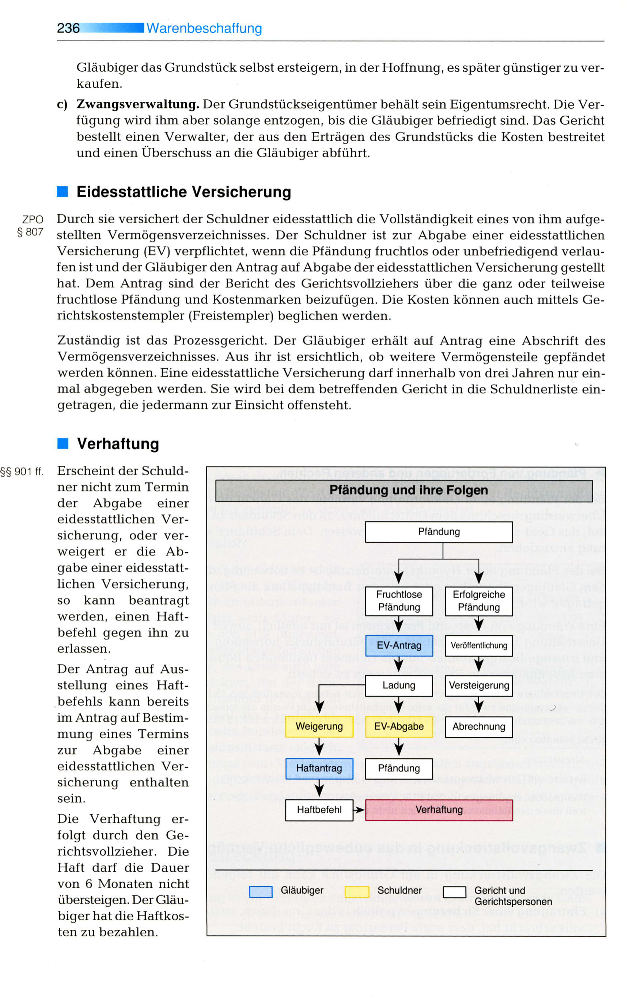

# 2 Semester

## 30-01-2023

### PT

CD $PSScriptRoot
. .\helperscript.ps1

### bs win

#### ncpa.cpl

##### SMB (Server Message Block)

ist ein Protokoll, das in lokalen Netzwerken für die Übertragung von Daten zwischen einem Client und einem Server verantwortlich ist. Es wird verwendet, um in Windows-Netzwerken Datei- und Verzeichnis-Freigaben und Druckdienste zu realisieren.

##### Samba Linux

Ein Linux-Samba-Server regelt die Freigabe von Dateien und Diensten im Netzwerk wie ein Windows-Server – nicht zuletzt (seit Samba-Version 4) auch dank der Fähigkeit, die Rolle des Active Directory Domain Controllers zu übernehmen.

cifs[^4] common Internet File System -CIFS and SMB (Server Message Block) are both Windows file-sharing protocols used in storage systems, such as network-attached systems (NAS). The key difference between CIFS and SMB is that CIFS is a dialect of SMB – a particular implementation of the SMB protocol.fruerher version von SMB

[^4]: common Internet File System -CIFS and SMB (Server Message Block) are both Windows file-sharing protocols used in storage systems, such as network-attached systems (NAS). The key difference between CIFS and SMB is that CIFS is a dialect of SMB – a particular implementation of the SMB protocol.fruerher version von SMB

### wiso

#### Willenserklärungen

#### Vertragsarten

#### Vertragsfreiheit und AGB

#### Nichtigkeit Anfechtbarkeit

## 20.02.2023

### wiso

#### Form der Rechtsgeschäfte

### Powershell

#### Powershell Parameters

fehlt...

## 22.02.2023

### wiso

#### Überblick Dienstleistungsverhältnisse

## 24.02.2023

### NT

#### ipv6

2001:1234:5678:90ab:cdef:1y2b:3c4d:5e6f

1 nibble = 4 bit  
1 Block = 4 nibbles = 16 bit  
8 Blöcke = 32 nibbles = 128 bit

ex:  
2001:0000:0000:000a:0000:0000:0000:0800
2001:0:0:a:0:0:0:800

##### version 1

2001::a:0:0:0:800

##### version 2

2001:0:0:a::800

#### ipv6 Subnetting

2001:A:1B:3c5::/64 in 2 subnetze

##### expendieren

2001:000a:001b:03c5:&nbsp;0000:0000:0000:0000/64  
 fix &nbsp;&nbsp;&nbsp;&nbsp;&nbsp;&nbsp;&nbsp;&nbsp;&nbsp;&nbsp;&nbsp;&nbsp;&nbsp;&nbsp;&nbsp;&nbsp;&nbsp;&nbsp;&nbsp;&nbsp;&nbsp;&nbsp;&nbsp;&nbsp;&nbsp;&nbsp;&nbsp;&nbsp; :0000:0000:0000:0000/64

16 number / 2 = 8
aber wir fangen mit 0 an dann 7!!

###### 1.

2001:000a:001b:03c5:&nbsp;0000:0000:0000:0000 /65
2001:000a:001b:03c5:&nbsp; 7fff:ffff:ffff:ffff /65

###### 2.

2001:000a:001b:03c5:&nbsp;8000:0000:0000:0000 /65
2001:000a:001b:03c5:&nbsp;ffff:ffff:ffff:ffff /65

##### Übung

2001:A:1B:3c5::/56  
alles schreiben  
2001:000a:001B:03|c5:0000:0000:0000:0000  
(16) (32) (48) (64) ....

## 02.03.2023

### BS

#### Laufwerk

ist: low level formatierung  
partition tabelle schreiben  
MBR bios 4 primäre P 2TB 32 bit  
GPT uefi 127 partition zetabite 64 bit  
Partition  
filesystem  
fast blöcke zu cluster

##### AHCI vs. RAID vs. IDE – das sollten Sie wissen

AHCI vs. RAID vs. IDE – alles Wissenswerte zusammengefasst
Zu den Vorteilen von modernen Betriebssystemen wie Windows 10 und Windows 11 gehört, dass die Bedienung äußerst einfach und kein tieferes Verständnis von Computern erforderlich ist. Auch ohne langwierige Konfigurationen können Programme wie Microsoft Word ausgeführt und verschiedenste Hardware genutzt werden. Allerdings ist nicht jede Standardeinstellung die beste Option für alle Benutzer – und einige der Änderungen, von denen Sie möglicherweise profitieren, erfordern tiefere Computerkenntnisse. Die Wahl zwischen AHCI, RAID und IDE für Ihre SATA-Konfiguration ist eines der Dinge, die Ihr gesamtes Computererlebnis verbessern können, aber etwas kompliziert ist. In diesem Blogbeitrag schauen wir uns die Gemeinsamkeiten und Unterschiede von AHCI, RAID und IDE etwas genauer an.

##### Was ist SATA und was gibt die Konfiguration vor?

SATA steht für Serial Attached Technology Attachment und beschreibt eine Übertragungs-Technik für Festplatten und Wechselspeicher-Laufwerke. Wie es die Bezeichnung bereits erahnen lässt, basiert SATA auf der seriellen Signaltechnik. Dies bedeutet, dass Daten als eine Folge einzelner Bits übertragen werden. Die Entwicklung der technischen Spezifikation überwacht die Serial ATA International Organization (SATA-IO).

Ihre SATA-Konfiguration gibt vor, wie Ihr Rechner Daten speichert und verarbeitet. Neuere Laufwerkstypen wie Solid-State-Drive (SSD) und NVme-Laufwerke verwenden nicht immer ein SATA-Protokoll. Im Allgemeinen sind Geräte, die direkt mit dem Motherboard verbunden sind, schneller als solche, die Kabel verwenden, insbesondere wenn PCIe 4.0-Steckplätze vorhanden sind. IDE, AHCI und RAID sind verschiedene Möglichkeiten, Ihre SATA-Geräte zu verwalten. Welches am besten funktioniert, hängt von Ihrem Computer ab, welche Laufwerke Sie verwenden und wie Sie sie nutzen möchten.

AHCI und IDE im Vergleich
IDE[^5] steht für Integrated Drive Electronics und ist das älteste SATA-Protokoll. Moderne Systeme verwenden es selten, weil es langsamer ist und weniger Optionen bietet als AHCI. Es wird im Allgemeinen als Möglichkeit bereitgestellt, ältere Hardware anzuschließen, die mit anderen Konfigurationen nicht funktioniert. Letztendlich ist der einzige Grund, IDE zu verwenden, wenn Sie keine anderen Optionen haben. IDE wird von fast jedem Betriebssystem unterstützt und ist weit verbreitet.

[^5]: IDE steht für Integrated Drive Electronics und ist das älteste SATA-Protokoll.

AHCI steht für Advanced Host Controller Interface und ist die beliebteste Alternative zu IDE. Sein neueres Protokoll speichert alle Informationen auf dem zugewiesenen Laufwerk. Dem 2004 veröffentlichten Schnittstellenstandard für Serial-ATA-Controller kommt die zentrale Aufgabe zu, die Datenübertragung vom RAM auf die Festplatten zu erleichtern.

AHCI bietet gegenüber IDE mehrere Vorteile. Geschwindigkeit ist einer der wichtigsten Vorteile von AHCI gegenüber IDE. Native Command Queueing (NCQ[^6]) ist eine Möglichkeit, die Handhabung von Aufgaben zu priorisieren, wenn Daten verschoben werden. Ältere IDE-Systeme erledigen Aufgaben stets in der angeforderten Reihenfolge, was nur selten der sinnvollste und effektivste Weg ist.

[^6]: NCQ Native Command Queueing ist eine Möglichkeit, die Handhabung von Aufgaben zu priorisieren, wenn Daten verschoben werden.

Hot Plugging ist eine Funktion, die von AHCI unterstützt wird und mit der Sie neue Laufwerke anschließen können, selbst wenn der Computer eingeschaltet ist. Dies ist nützlich, insbesondere bei der Fehlerbehebung oder wenn Sie häufig Laufwerke anschließen und wieder entfernen müssen.

Was ist RAID?
RAID steht für Redundant Array of Independent Disks und erfordert im Allgemeinen, dass Sie AHCI aktivieren. Die Technologie kombiniert mehrere Festplatten zur Speicherung von Daten. RAID kann als eine Art Speichervirtualisierungsfunktion angesehen werden, die in den Bereichen Sicherheit und Speicher-Flexibilität zu überzeugen weiß.

Wie mehrere physische Festplatten zum Aufteilen und/oder Speichern von Daten verwendet werden, gibt der sogenannte RAID-Level vor. Die am häufigsten verwendeten Arten von RAID-Arrays sind RAID 0 und RAID 1. RAID 0 ist eine schnelle Konfiguration, die Daten über mehrere Festplatten verteilt, aber keine Backups erstellt. Es ist schnell, weil es gleichzeitig von mehr als einer Festplatte schreibt und liest. RAID 0 ist optimal, wenn Sie die größtmögliche Geschwindigkeit benötigen und dabei einen Datenverlust in Kauf nehmen können. RAID 1 kopiert die Daten zwischen mehr als einer Festplatte, sodass Sie nicht alles verlieren, wenn eine Festplatte ausfällt. Während die Lesegeschwindigkeit höher als bei RAID 0 ist, kann es bei der Schreibgeschwindigkeit zu leichten Einbußen kommen. Es ist unglaublich zuverlässig, da die Daten auf jeder Festplatte im Array gespiegelt werden.

#### Welche Konfiguration sollte wann gewählt werden?

Welche SATA-Konfiguration in Ihrem konkreten Fall besonders sinnvoll ist, hängt von mehreren Faktoren ab. Wenn Sie ältere Hardware verwenden, überprüfen Sie, welche SATA-Controller überhaupt unterstützt werden. Einige ältere Systeme funktionieren nicht mit AHCI oder RAID. Sodann bleibt IDE als solider Standard. Wenn es um IDE im Vergleich zu AHCI geht, verbessert AHCI normalerweise die Leistung.

Für Heimanwender ist AHCI im Allgemeinen eine sehr gute Wahl. Wenn Sie ein erweitertes Setup erstellen möchten und viele Festplatten haben, mit denen Sie arbeiten können, sollten Sie jedoch auch RAID in Betracht ziehen. RAID eignet sich hervorragend für viele verschiedene Funktionen, ist jedoch nicht die beste Wahl für Spiele. Die Technologie benötigt mehr Festplatten, reduziert Ihren Gesamtspeicher und hat eine höhere Ausfallrate. Für Gamer ist somit AHCI empfehlenswerter. Wenn Sie mit einem RAID-Array Games spielen möchten, sollten Sie RAID 0 wählen und alles, was Ihnen wichtig ist, an anderer Stelle speichern, damit Sie bei einem Ausfall des Laufwerks nur Spieldateien verlieren, die einfach heruntergeladen und wiederhergestellt werden können.

RAID wird häufig in Serverumgebungen verwendet, um bestimmte Lese- oder Schreibgeschwindigkeiten zu verbessern. Wenn es Ihnen nichts ausmacht, mehr PC-Management zu betreiben, ist RAID eine gute Wahl.

Wo kann die Konfiguration geändert werden?
Welches Protokoll Sie verwenden möchten, müssen Sie vor der Installation des Betriebssystems auswählen. Die Auswahl wird über das BIOS des Rechners getroffen. An welcher Stelle die entsprechende Option gefunden werden kann, erfahren Sie über die Motherboard-Benutzeranleitung bzw. die Homepage des jeweiligen Herstellers.

Viele Windows-Benutzer haben bereits festgestellt, dass das Betriebssystem den AHCI-Treiber nur dann lädt, wenn die Option vor der Betriebssysteminstallation ausgewählt wurde. Wird der Modus nachträglich im BIOS von IDE auf AHCI geändert, ist ein fehlerhafter Start von Windows oder ein Bluescreen vorprogrammiert

Sie können AHCI mit allen Festplatten verwenden, die das Protokoll unterstützen, einschließlich SSDs. Überprüfen Sie einfach die Dokumentation zu Ihrem Laufwerk, um zu sehen, welche SATA-Protokolle es unterstützt.

Sie möchten Windows 10 oder Windows 11 günstig kaufen und die neuste Hardware verwenden? Bei Softwarekaufen24 finden Sie die Betriebssysteme von Microsoft zu einem herausragenden Preis-Leistungs-Verhältnis.

| -                    | raid 0                | raid 1                           | raid 5                                       | raid 6                                           | raid 10 eins nul                    | jbod                   |
| -------------------- | --------------------- | -------------------------------- | -------------------------------------------- | ------------------------------------------------ | ----------------------------------- | ---------------------- |
| mind                 | Block Level Stripping | mirroring                        | Block Level Stripping mit rotierende Parität | Block Level Stripping mit 2 rotierenden Paritätn | Block Level Stripping mit mirroring | übergreifendes volumen |
| -                    | 2                     | 2                                | 3                                            | 4                                                | 4                                   | 2 bis n                |
| -                    | schnell read write    | schnell read / NOt schnell write | schnell read / NOt schnell write             | schnell read / NOt schnell write                 | quick read and write-               | -                      |
| Qr                   | B = N                 | B/2 = N                          | -                                            | -                                                | -                                   | -                      |
| QHdd                 | Qr = n\*Qhd           | Qr = (n/2)\*Qhdd                 | Qr = (n-1)\*Qhdd                             | Qr = (n-2)\*Qhdd                                 | Qr = (n/2)\*Qhdd                    | Qr = Σ Qhdd            |
| ausfall datenverlust | 0                     | 1                                | 1                                            | 2                                                | 1 aber jeweils 1 von raid 1         | -                      |

## 03.03.2023

### NT

Hyper Backup Quick Start Guide von Sinology macht back ups

synology dsm: Synology DiskStation Manager  
Das modulare Betriebssystem Synology DiskStation Manager (DSM) ermöglicht es dank der benutzerfreundlichen Oberfläche und zahlreichen Features sowohl ...

## 03.10.2023

### NT

ipconfig

xxxx:xxxx:xxxx:xxxx:xxxx:xxxx:%13  
der 13. ausgedacht addresse vom computer

IN IPV6 eingebettete ipv adresse
----->192.168.13.42 Dez  
0000:0000:0000:0000:0000:FFFF:
0:0:0:0:0:ffff:C0A8:0D2A
|&nbsp;|&nbsp;
|----|----
||HEADERS

<u>in terminal traceroute:</u> In computing, **traceroute** and **tracert** are computer network diagnostic commands for displaying possible routes and measuring transit delays of packets across an Internet Protocol network

| &nbsp;                                     | &nbsp;  |
| ------------------------------------------ | ------- |
|  | HEADERS |

https://www.tutorialspoint.com/ipv6/ipv6_headers.htm#:~:text=IPv6%20headers%20have%20one%20Fixed,to%20handle%20a%20packet%2Fflow.

ver version  
PRI priorisierung bzw tarffic class

| &nbsp;                              | &nbsp;  |
| ----------------------------------- | ------- |
|  | HEADERS |

## 16.03.2023

??  
TBW = 150 GB  
R = 250 GB  
protag = 40 GB  
What is CrystalDiskInfo used for?  
CrystalDiskInfo is an MIT-licensed S.M.A.R.T. utility for reading and monitoring disk drive status. Like CrystalDiskMark, this tool is designed with an emphasis around solid state devices, supporting NVMe connections in addition to the usual PATA and SATA.

HDD MAGNET
SSD Strom

## 22.03.2023

### Front end Programmier Sprache

Angular  
Typescript  
NgBootStrap  
primeng  
Scrum
...

### back end Programmier Sprache

MSSQL  
C#  
Crud API  
AZURE  
Docker / DevOPS  
Scrum

### NT

#### Namenauflösung

PC NAME --------------------------- IP-Adress  
**MUSS**  
net bios Name  
<= 15 Zeichnen  
azAZ09-  
ex: srv1

Broadcast  
old: <del>lmhosts.sam</del>  
oder <del>wins</del>

**Optional**  
(wenn aus dem internet erreichbar sein soll)  
(seit win 2000 Domäne)  
FQDn/dns qualified domain name  
<= 255 Zeichnen  
<= 63Z.<= 63Z.<= 63Z.<= 62Z.  
azAZ09-

DNS  
<del>hosts</del> is old

    **nslookup** is the name of a program that lets an Internet server administrator or any computer user enter a host name (for example, "whatis.com") and find out the corresponding IP address or domain name system (DNS) record.

ping -4 localhost ping address with ip4  
ping -6 localhost ping address with ip6

## 23.03.2023

### BS

seite 218 uebungsbuch  
seite 398 Datenschutz

## 23.03.2023

### NT

netstat -rn

C:\Users\Administrator\Downloads>netstat -rn

## 23.04.2023

### WISO

#### B2b Zweiseitiges HandelsKauf

#### B2C Verbrauchsgüterkauf

#### Bürgerlischer kauf

Um einen bürgerlichen Kauf handelt es sich, wenn Käufer und Verkäufer Nicht-Kaufleute im Sinne des § 1 Abs. 1 HGB sind. Eine Mutter verkauft die zu klein gewordene Kleidung ihres Kindes an eine andere Mutter. Ein Student kauft ein gebrauchtes Fahrzeug von einem privaten Anbieter.

Unternehmen / Kaufmann Unterschied

<f>Mängelrüge</f>

- Nacherfüllung
  - Nachlieferung
  - Nachbesserung

**Die <f>Mängelrüge</f>** ist eine Anzeige durch den Käufer eines Handelsgeschäftes, durch die dem Verkäufer ein Mangel oder die Falschlieferung der Ware gemeldet wird. Im Sinne des § 377 Handelsgesetzbuch muss die Ware unverzüglich nach Erhalt durch den Käufer untersucht und etwaige Mängel unverzüglich beanstandet werden.

La réclamation est une notification par l'acheteur d'une transaction commerciale, par laquelle le vendeur est informé d'un défaut ou d'une erreur de livraison de la marchandise. Au sens de l'article 377 du Code de commerce, la marchandise doit être examinée immédiatement après sa réception par l'acheteur et les éventuels défauts doivent être signalés sans délai.

**<f>Nacherfüllung** Unter Nacherfüllung versteht man im deutschen Schuldrecht das dem Käufer beim Kaufvertrag und dem Besteller beim Werkvertrag eingeräumte Gewährleistungsrecht, das ihm einen Anspruch auf Nachbesserung oder Nachlieferung einräumt, sofern der Leistungsgegenstand im Zeitpunkt des Gefahrübergangs einen Mangel aufweist.

**<f>Nachlieferung & Nachbesserung**  
 Was ist der Unterschied zwischen Nachbesserung und Nachlieferung?
Das Gesetz sieht zwei Formen der Nacherfüllung vor, zwischen denen der Käufer wählen darf: Nachbesserung und Nachlieferung. Bei der Nachbesserung beseitigt der Verkäufer den Mangel an der gelieferten Sache. Bei der Nachlieferung übergibt der Verkäufer dem Käufer eine neue, erfüllungstaugliche Sache.

The law provides for two forms of supplementary performance between which the buyer may choose: Rectification and subsequent delivery. In the case of rectification, the seller removes the defect in the delivered item. In the case of subsequent delivery, the seller hands over a new item to the buyer that is suitable for fulfilment.

**<f>Garantie ist nicht gleich Gewährleistung**  
Das Wichtigste in Kürze. Garantie und Gewährleistung unterscheiden sich erheblich voneinander. Gewährleistungsrechte bestehen aufgrund gesetzlicher Vorschriften gegenüber dem Verkäufer. Eine Garantie ist eine freiwillige Leistung eines Herstellers und richtet sich nach seinen Bedingungen.

## 23.04.2023

### bs

#### Internetangriffen:

- **Phishing**: Hierbei versuchen Cyberkriminelle, sensible Informationen wie Benutzernamen, Passwörter und Kreditkarteninformationen durch gefälschte Websites, E-Mails oder Nachrichten zu erhalten.

- **Malware**: Diese Art von Angriff bezieht sich auf die Verwendung von schädlicher Software wie Viren, Würmern, Trojanern und Spyware, um auf Systeme zuzugreifen und Daten zu stehlen oder Schäden zu verursachen.

- **Distributed Denial of Service (DDoS)**: Ein DDoS-Angriff zielt darauf ab, eine Website oder einen Server durch Überlastung mit Traffic lahmzulegen.

- **Man-in-the-Middle (MitM)** Angriffe: Bei diesen Angriffen versucht ein Angreifer, sich zwischen zwei Kommunikationspartnern zu positionieren, um Daten abzufangen oder zu manipulieren.

- **Cross-Site-Scripting (XSS)**: Hierbei wird schädlicher Code in eine Website eingefügt, um den Benutzer zu täuschen oder seine Daten zu stehlen.

- **SQL-Injection**: Hierbei wird eine Schwachstelle in einer Website ausgenutzt, um eine SQL-Abfrage auszuführen, die dem Angreifer Zugriff auf die Datenbank der Website gewährt.

- **Zero-Day-Exploits**: Dies bezieht sich auf die Ausnutzung von Schwachstellen in Software, die noch nicht bekannt sind oder für die noch kein Patch verfügbar ist.

- **Social Engineering**: Hierbei versucht ein Angreifer, durch Manipulation oder Täuschung von Benutzern Zugang zu vertraulichen Informationen oder Systemen zu erhalten.

### db

**changes names after removing foreign key constrain and adding it back!**

ALTER TABLE tbl_teilnehmer CHANGE personalNr Id INT;  
Alter TABLE tbl_teilnehmer RENAME teilnehmer;  
ALTER TABLE personal CHANGE personalNr Id INT;  
ALTER TABLE teilnehmer FOREIGN KEY(id) REFERENCES personal(id);

<f>ALTER TABLE teilnehmer  
ADD CONSTRAINT fk_teilnehmer_personal_id  
FOREIGN KEY (id)  
REFERENCES personal(id) </f>;

**take first letter of the name**  
SELECT \* FROM k
WHERE <f>LEFT(name, 1) </f> IN ('B','k')

**get date**  
SELECT <f>NOW()</f> AS today_date_withtime;  
SELECT <f>CURDATE()</f> AS today_dat;

**add new column**  
ALTER TABLE AT ADD COLUMN proAuszahlung float

### POWERSHELL

**CALL-by-value  
Call-by-reference**

write-host "`$c = $c"

`$c write not the value but the name of the variable

$e =3

$g = ([ref]$e)

to get value of $g use $g.value

## 03 05 2023

### NT

Ports: 216 = 0 -> 65535  
0 - 1023 System Ports (**well known ports**)  
1024 - 49151 user ports (**registered ports**)  
49152 - 65535 **Dynamic /private Ports**

combination von IP und Port is socket

## 08 05 2023

### wiso

#### Mahnung bei Lieferverzug

#### Mangelbegriff

#### Nicht Rechtzeitig Lieferung

<f>Sofort ist keine Kalendarmäßige Bestimmung

#### **Deckungskauf**:

Der Deckungskauf ist in der Wirtschaft ein Handelskauf, bei dem ein Käufer wegen eines Lieferverzugs durch seinen Lieferanten ersatzweise die benötigte Ware bei anderen Lieferanten beschaffen muss.  
In business, a covering purchase is a commercial purchase in which a buyer has to procure the required goods from other suppliers as a substitute due to a delay in delivery by his supplier.

 

#### **Subjektiv Anforderung // Objektive Anforderung**

##### Was ist der Unterschied zwischen subjektiven und objektiven Anforderungen?

Eine objektive Sichtweise ist völlig wertfrei und unvoreingenommen, während eine subjektive Betrachtungsweise von Meinungen, persönlichen Vorlieben und Erfahrungen geprägt ist. Subjektive Ansichten sind damit individuell.  
An objective view is completely value-free and unbiased, whereas a subjective view is shaped by opinions, personal preferences and experiences. Subjective views are thus individual.

## 10 05 2023

### nt

| &nbsp;                | &nbsp;              | &nbsp;      |
| --------------------- | ------------------- | ----------- |
| anwendung port x   | anwendung port y | 7 6 5 |
| <td colspan=2>TCP/UDP | 4                   |
| <td colspan=2>IP      | 3                   |
| <td colspan=2>MAC     | 2                   |
| <td colspan=2>NIC     | 1                   |
| <td colspan=2>Medien  | 0                   |

DHCP server Port 67  
DHCP client Port 68  
DNS Port 53  
DHCPv6 client 546  
DHCPv6 server 547

**Apcupsd**, short for APC UPS daemon, is a utility that runs on Linux, UNIX, macOS and Windows. It allows the computer to interact with APC UPSes. Apcupsd also works with some OEM-branded products manufactured by APC. Apcupsd is a free software equivalent of the APC's proprietary PowerChute software.

| TCP                           | UDP                      |
| ----------------------------- | ------------------------ |
| **Verbindungsorientiert**     | Verbindungsorientiert    |
| Verbindungsaufbau             | -                        |
| Kontrolierte datenübertragung | -                        |
| Verbindungsabbau              | -                        |
| 1 zu 1 Verbindung             | 1 zu 1/1 zu N Verbindung |
| slow and safe                 | fast and dangerous       |
| Fester Vorgang                | frei programmierbar      |
| Einschreiben mit Rückschein   | Postkarte                |

**Quic ist der TCP Nachvolger**  
QUIC gilt vielen als Nachfolger des Transmission Control Protocol (TCP), weil es den Verkehr nicht nur selbst verschlüsselt, sondern auch lange Zeit übliche Aushandlungsschritte einspart. Das beschleunigt den Aufbau insbesondere komplexer Webseiten, die von verschiedenen Domänen Daten beziehen.

**IETF[^2]**: The Internet Engineering Task Force is a standards organization for the Internet and is responsible for the technical standards that make up the Internet protocol suite. It has no formal membership roster or requirements and all its participants are volunteers

[^2]: IETF The Internet Engineering Task Force is a standards organization for the Internet and is responsible for the technical standards that make up the Internet protocol suite. It has no formal membership roster or requirements and all its participants are volunteers

## 11 05 2023

### BS

- **Phishing**: Versuch, sensible Daten wie Benutzernamen, Passwörter oder Kreditkarteninformationen durch gefälschte E-Mails oder Webseiten zu stehlen.

- **Vhishing**: Eine Form von Phishing, bei der Betrüger per Telefon versuchen, persönliche Informationen zu erlangen.
- **Pharming**: Manipulation der DNS Eine Technik, bei der Internet-Verkehr auf gefälschte Websites umgeleitet wird, um sensible Informationen zu stehlen.
- **Spoofing**: Fälschung von Datenpaketen oder Identitäten, um sich als eine andere Person oder ein anderes System auszugeben.

- **Nicknapping**: Die Entführung oder Übernahme einer Online-Identität oder eines Benutzernamens.

- **Spam**: Massen-E-Mails oder Nachrichten, die unerwünschte oder betrügerische Inhalte enthalten.
- **Spyware**: Software, die ohne Wissen des Benutzers Informationen über seine Aktivitäten auf dem Computer oder im Internet sammelt.
- **Adware**: Software, die Anzeigen auf dem Computer anzeigt, oft zusammen mit Freeware-Programmen.
- **Virus**: Schädliches Programm, das sich selbst reproduziert und andere Computer infiziert.

- **Trojaner**: Schadsoftware, die sich als nützliches Programm tarnt und heimlich bösartige Aktivitäten ausführt.

- **Wurm**: Schadprogramm, das sich selbst verbreitet und durch das Netzwerk oder das Internet ausbreitet.
- **Ransomware**: Schadprogramm, das die Computerdateien des Benutzers verschlüsselt und Lösegeld für die Entschlüsselung verlangt.

- **DDoS**: Distributed-Denial-of-Service-Angriff, bei dem eine Website oder ein Netzwerk durch Überlastung mit Verbindungsanfragen lahmgelegt wird.

- **Botnetze**: Eine Gruppe von vernetzten Computern, die von einem Angreifer ferngesteuert werden, um bösartige Aktivitäten auszuführen.

- **APT[^1]** Ein Advanced Persistent Threat (APT) Angriff ist eine sehr anspruchsvolle und gezielte Art von Cyber-Angriff, bei dem ein Angreifer langfristigen und zielgerichteten Zugang zu einem Netzwerk oder System eines Unternehmens erlangt. Der Angriff erfolgt oft über Phishing- oder Spear-Phishing-E-Mails, um Zugangsdaten zu stehlen oder Malware zu installieren, die es dem Angreifer ermöglicht, im System zu bleiben und Daten zu sammeln oder zu manipulieren.
  Ein APT-Angriff ist oft schwer zu erkennen und zu stoppen, da er sich auf lange Sicht versteckt und langsam vorgeht, um das Zielunternehmen zu infiltrieren und zu schädigen. Es erfordert oft eine umfassende und fortlaufende Überwachung und Analyse des Netzwerkverkehrs, um einen APT-Angriff zu identifizieren und zu stoppen.

[^1]: APT Advanced Persistent Threat Angriff ist eine sehr anspruchsvolle und gezielte Art von Cyber-Angriff, bei dem ein Angreifer langfristigen und zielgerichteten Zugang zu einem Netzwerk oder System eines Unternehmens erlangt.

IPsec[^3]: In computing, Internet Protocol Security is a secure network protocol suite that authenticates and encrypts packets of data to provide secure encrypted communication between two computers over an Internet Protocol network. It is used in virtual private networks.

[^3]: IPsec In computing, Internet Protocol Security is a secure network protocol suite that authenticates and encrypts packets of data to provide secure encrypted communication between two computers over an Internet Protocol network. It is used in virtual private networks.

### db

count days from mySql:  
DATEDIFF(end,start) as days_diff

## 15 05 2023

### BS

#### Berechnung Größe scans 1

**Größe der Vorlage:** 21 cm \* 29,7 cm

**Auflösung:** 300 dpi \* 400 dpi

**Farbtiefe:** 24 bits rgb

**Kompression:** 20:1
KompressionFaktor 20

##### cm to inch

1nch = 2,54 cm  
x inch = 21 cm  
x= 21/2,54 = 8.26 inch

1nch = 2,54 cm  
x inch = 29,7 cm  
x= 29,7/2,54 = 11.69 inch

##### aufösung

8.26 * 300 = 2478  
11,69*400 = 4677

11 587 128 pixels oder dots

##### Farbtiefe in Byte

24 bit rgb /8 = 3  
11 587 128 \* 3 = 34 761 384 Byte

##### Kompression

1 : 20
x : 34 761 384 Byte

x= 34 761 384/20  
x= 1738069 Byte

##### Byte to MiByte

Burger King Makes Great Toast

1738069 /1024^2 = 1.65 MiByte

#### Berechnung Größe scans 2

**Größe der Vorlage:** 400 mm \* 600 mm

**Auflösung:** 300 dpi \* 200 dpi

**Farbtiefe:** 16 graustuffe  
 4 bits

**Kompression:** 20:1
KompressionFaktor 20

##### cm to inch

1nch = 2,54 cm  
x inch = 40 cm  
x= 40/2,54 = 15.74 inch

1nch = 2,54 cm  
x inch = 60 cm  
x= 60/2,54 = 23.62 inch

##### aufösung

15.74 * 300 = 4724  
23.62*200 = 4724

22 316 176 pixels oder dots

##### Farbtiefe in Byte

16 bit grau 4 bits = 1/2 bytes  
22 316 176 \* 1/2 = 11 148 642 Byte

Burger King Makes Great Toast  
11 158 088 byte

x= 11 158 088 /1024^3
x= 10.64 MiB

##### transfer time with 1Mbit/s

total= 10.64 MiB  
total to Mbit = 10.64*8 *1024\*1024 /10^6
total = 88,92 Mbit
transfer = 1Mbit/s

### WISO

Umtausch - Gewährleistung - Garantie  
Kulanz umtausch  
Prüf rügel ... ??

- Nacherfüllung
  - Nachlieferung
  - Nachbesserung

#### Schadenersatz mit der Leistung

fallen alle Schadenspositionen, die durch eine Nachholung der zunächst ausgebliebenen Leistung bis zum letztmöglichen Zeitpunkt hätten vermieden werden können und das Interesse des Gläubigers an der Leistung als solcher befriedigen

#### Schadenersatz neben der Leistung

betrifft solche Schäden, die endgültig eingetreten sind und nicht durch Nacherfüllung behebbar sind. Der Schadensersatzanspruch tritt neben den Primäranspruch, die ursprünglich geschuldete Leistung bleibt bestehen.

### BS

#### Back ups

zeitlich örtlich getrennt  
Üben

3 2 1 Regel

vollbackup kann auf einem betriebsystem oder nur eienm ordner

##### **voll backup**

- schnell wieder herstellen
- lang zu machen.
- ein mal in der Woche

##### **Differenzielle backup**

- Daten die geändert wurden
- alles seit dem vollbackup
- geringe speicherplatz

##### **Inkrementelle backup**

- Daten die geändert wurden
- alles seit dem letzen mal
- geringe speicherplatz

vorwärts Delta
Reverse-Delta

## 17 05 2023

### nt

interface identifier = suffix  
**netstat -putan**  
The command "netstat -putan" is used in a terminal to display active network connections and related information on a Linux or Unix-based system. Here's a breakdown of the command and its options:

- netstat: It stands for "network statistics" and is a command-line tool used for monitoring network connections and network-related statistics.

  - p: This option shows the process or program associated with each network connection. It displays the PID (Process ID) and the name of the program.

  - u: This option filters the output to show only UDP (User Datagram Protocol) connections.

  - t: This option filters the output to show only TCP (Transmission Control Protocol) connections.

  - a: This option displays all active connections, including listening ports that are waiting for incoming connections.

  - n: This option disables the resolution of hostnames, displaying IP addresses instead.

## 22 05 2023

### bs

#### RFID[^9]

[^9]: RFID Radio-frequency identification

### Wiso

Warenschulden sind Holschulden  
Geldschulden sind Bringschulden bzw. Schickschulden.

#### Beweislastumkehr

Tritt innerhalb der ersten 12 Monate ein Sachmangel auf, so ist immer davon auszugehen, dass die Sache bereits beim Kauf mangelhaft war (Beweislastumkehr nach § 476 BGB). Nach dieser Frist liegt die Beweislast beim Käufer.

#### Kalkulatorische Wagnisse

Bei den kalkulatorischen Wagnissen handelt es sich um so genannte Einzelwagnisse, die mit dem allgemeinen Unternehmensrisiko nichts zu tun haben. Einzelwagnisse geht der Unternehmer immer wieder ein; sie ergeben sich aus der alltäglichen Unternehmensführung und dem betrieblichen Alltag.

| <td colspan=2> KV Störung |               |
| :-----------------------: | :-----------: |
|         verkäufer         |    Kaufer     |
|   Mangelhafte Lieferung   | AnnahmeVERZUG |
|       LieferVERZUG        | ZahlunsVERZUG |

Fälligkeit der Leistung  
Kalendarmässige bestimmbarkeit

Sofort ist kein Kalendarmässige Bestimmung

Freizeichnungsklausel

#### Mahnung bei Lieferverzug

Deckungskauf

Fixkauf: ist nach deutschem Recht eine spezielle Form eines Kaufvertrags, bei dem die Lieferung der Ware innerhalb einer genau bestimmten Frist oder zu einem festgelegten Termin erfolgen muss.

## bswin

vorwärts Delta  
Reverse-Delta

## 24 05 2023

### nt

tcp 3 wege handshake Aufbau
tcp 4 Wege handshake Abbau

syn: synchronise  
seq: sequence  
psh: push
mss: maximal segnment size
wind: window

MTU: In computer networking, the maximum transmission unit (MTU[^7]) is the size of the largest protocol data unit (PDU) that can be communicated in a single network layer transaction. The MTU relates to, but is not identical to the maximum frame size that can be transported on the data link layer, e.g. Ethernet frame.

[^7]: MTU: In computer networking, the maximum transmission unit is the size of the largest protocol data unit (PDU) that can be communicated in a single network layer transaction. The MTU relates to, but is not identical to the maximum frame size that can be transported on the data link layer, e.g. Ethernet frame.

## 27 05 2023

### Linux

- tree -pug

  - -p : Print the protections for each file (as per ls -l).
  - -u : Print the username, or UID # if no username is available, of the file.
  - -g : Print the group name, or GID # if no group name is available, of the file.

- chmod

  - The letters represent:

    - r: Read permissions. The file can be opened, and its content viewed.
    - w: Write permissions. The file can be edited, modified, and deleted.
    - x: Execute permissions. If the file is a script or a program, it can be run (executed).

| Besitzer |         |         | Gruppe  |         |         | Andere  |         |         |
| :------: | :-----: | :-----: | :-----: | :-----: | :-----: | :-----: | :-----: | :-----: |
|    r     |    w    |    x    |    r    |    w    |    x    |    r    |    w    |    x    |
| 22  | 21 | 20 | 22 | 21 | 20 | 22 | 21 | 20 |
|    1     |    1    |    1    |    1    |    1    |    1    |    1    |    0    |    1    |
|          |    7    |         |         |    7    |         |         |    5    |         |

- objekttyp:
  - &minus; Datei
  - d directory
  - l link
  - c ?
  - b ?
  - ...

make dir with permisions:  
mkdir -m 700 name

just change permission:
or chmod 700 name

### 練習 れんしゅう

**A VPN tunnel:** is a secure, encrypted connection between two endpoints over a public or untrusted network, such as the internet. It creates a virtual "tunnel" that allows data to be transmitted privately and securely between the two endpoints.

When you establish a VPN tunnel, your data is encapsulated within packets that are encrypted before being sent over the network. This encryption ensures that the data is protected from unauthorized access and maintains its confidentiality.

The VPN tunnel works by using tunneling protocols to encapsulate and encrypt the data. These protocols establish a secure connection between the two endpoints and handle the encryption and decryption of the data packets.

Once the VPN tunnel is established, all network traffic between the two endpoints, including internet traffic, is routed through the tunnel. This means that even if you are connected to a public Wi-Fi network or another untrusted network, your data remains secure and private.

In summary, a VPN tunnel provides a secure and encrypted pathway for transmitting data between two endpoints over an untrusted network, ensuring privacy and confidentiality of the transmitted information.

**IPsec**[^8]:

- Encryption
- authentification
- integrity

[^8]:
    IPsec Internet Protocol Security. As a part of the IPv4 enhancement, IPsec is a layer 3 OSI model or internet layer end-to-end security scheme.
    Encryption authentification integrity

**Hybrid Encryption** combines the efficiency of symmetric encryption with the convenience of public-key (asymmetric) encryption. Only users with the private key can decrypt the data. To encrypt a message, a fresh symmetric key is generated and used to encrypt the plaintext data.

XOR!!
Beispiel:

|         | info      |           | key       |           | encrypted |         |
| ------- | --------- | :-------: | --------- | --------- | --------- | ------- |
| Zeichen | ASCII-hex | ASCII-bin | 0000 1010 | ASCII-bin | ASCII-hex | Zeichen |
| H       | 48        | 0100 1000 | 0100 0010 | 0100 0010 | 42        | B       |

## 31 05 2023

### NT

#### ports:

49151 = 1011 1111 1111 1111  
49152 = 1100 0000 0000 0000

NAT/PAT/Source-Nat/PNAT same thing

SPI FIREWALL:
Stateful Packet Inspection FIREWALL

## 1 06 2023

### bs

#### Vertraulichkeit

##### Confidentialité

Unter Vertraulichkeit versteht man, dass Daten nur von den Personen eingesehen oder offengelegt werden dürfen, die dazu auch berechtigt sind.

#### Integrität

##### intgrité

Integrität bedeutet allerdings, dass es nicht möglich sein darf, Daten unerkannt bzw. unbemerkt zu ändern. Es geht hierbei also um das Erkennen von Datenänderungen, wohingegen bei Vertraulichkeit der Fokus auf der Berechtigung liegt.

#### Verfügbarkeit

##### Disponibilité

Die Verfügbarkeit eines Systems beschreibt ganz einfach die Zeit, in der das System funktioniert. Im Sinne der Schutzziele geht es hier selbstverständlich darum, die Verfügbarkeit möglichst hoch zu halten. Anders gesagt: Es gilt, das Risiko von Systemausfällen zu minimieren!

#### noch die Schutzziele **Authentizität**, **Zurechenbarkeit** und **Verbindlichkeit**, die bei erweiterter Betrachtung relevant sein können

### DB

#### Agregat functionen

- The COUNT() function returns the number of rows that matches a specified criterion.
- The SUM() function returns the total sum of a numeric column.
- The AVG() function returns the average value of a numeric column.
- The MIN() function returns the smallest value of the selected column.
- The MAX() function returns the largest value of the selected column.
- group by
- having

## 2 06 2023

### kup

#### USV

<f>avr</f> **Automatic voltage regulator:**  
if avr immer VI for usv
A voltage regulator is a system designed to automatically maintain a constant voltage. A voltage regulator may use a simple feed-forward design or may include negative feedback. "

#### NAS vs SAN

NAS (Network Attached Storage) und SAN (Storage Area Network) sind zwei verschiedene Technologien zur Speicherung und Bereitstellung von Daten in Rechenzentren. Der Hauptunterschied zwischen ihnen liegt in der Art und Weise, wie sie auf das Netzwerk zugreifen und wie sie Daten übertragen.

##### NAS (Network Attached Storage):

**NAS** ist ein Dateisystem-basiertes Speichersystem, das über das Netzwerk mit TCP/IP-Protokollen kommuniziert. Es wird normalerweise über Ethernet-Verbindungen verbunden und verwendet standardmäßige Netzwerkprotokolle wie NFS[^10] (Network File System) oder SMB/CIFS[^11] (Server Message Block/Common Internet File System) zur Dateifreigabe. NAS ermöglicht es mehreren Benutzern, gleichzeitig auf dieselben Dateien zuzugreifen, ähnlich wie bei einem gemeinsamen Laufwerk.

###### Vorteile von NAS:

- Einfache Konfiguration und Verwaltung.
- Geringere Kosten im Vergleich zu SAN.
- Flexibilität bei der Integration in bestehende Netzwerke.

##### SAN (Storage Area Network):

**SAN** ist ein blockbasiertes Speichersystem, das über spezielle Netzwerktechnologien wie Fibre Channel (FC)[^12] oder iSCSI[^13] (Internet Small Computer System Interface) kommuniziert. Im SAN werden die Speicherressourcen zu einem eigenständigen Netzwerk zusammengefasst, das nur für die Übertragung von Daten zwischen den Servern und den Speichergeräten verwendet wird. SAN ermöglicht einen direkten und schnellen Zugriff auf Blockebene auf die Speichergeräte.

###### Vorteile von SAN:

- Höhere Leistung und geringere Latenzzeiten im Vergleich zu NAS.
- Skalierbarkeit für große Datenmengen und Anwendungen mit hohen Anforderungen an die E/A-Leistung.
- Unterstützung für erweiterte Funktionen wie Speichervirtualisierung, Spiegelung und Replikation.
  Zusammenfassend kann man sagen, dass NAS ideal für gemeinsam genutzte Dateisysteme geeignet ist, bei denen der Fokus auf der Freigabe von Dateien liegt, während SAN für anwendungsintensive Umgebungen bevorzugt wird, in denen eine hohe Leistung und ein direkter Blockzugriff erforderlich sind.

## 4 06 2023

### WISO

#### Schadensersatz statt der Leistung:

erlischt die Pflicht zur Erfüllung

#### Schadensersatz neben der Leistung:

betrifft solche Schäden, die endgültig eingetreten sind und nicht durch Nacherfüllung behebbar sind.

#### vorrangige Rechte

Vorrangig hat der Käufer das Recht auf Nacherfüllung.

#### nachrangige Rechte

Sollten Sie mit Ihrem Anspruch auf Nachbesserung scheitern, kommen **nachrangige Rechte** zum Tragen und Sie haben Anspruch auf Minderung des Kaufpreises oder den Rücktritt vom Kaufvertrag.

#### objektive Anforderung

entspricht die Sache, wenn sie sich für die gewöhnliche Verwendung eignet und eine Beschaffenheit aufweist, die bei Sachen der gleichen Art üblich ist.

#### subjektive Anforderung

entspricht der Kaufgegenstand, soweit er die vereinbarte Beschaffenheit hat und sich für die nach dem Vertrag vorausgesetzte Verwendung eignet und mit dem vereinbarten Zubehör und den vereinbarten Anleitungen übergeben wird.

##### remember:

- Fälligkeit der Zahlung
- Mahnung des Käufers
- verschulden des Käufers
- Vom Kaufvertrag kann erst nach Ablauf einer angemenssenen Nachfrist zurückgetreten werden.
- Rückgriffsrecht

[^10]: NFS **Network File System** is a distributed file system protocol originally developed by Sun Microsystems in 1984, allowing a user on a client computer to access files over a computer network much like local storage is accessed.
[^11]: CIFS **Common Internet File System** is a protocol that gained popularity around the year 2000, as vendors worked to establish an Internet Protocol-based file-sharing protocol.
[^12]: FC **Fibre Channel** is a high-speed data transfer protocol providing in-order, lossless delivery of raw block data. Fibre Channel is primarily used to connect computer data storage to servers in storage area networks in commercial data centers.
[^13]: iSCSI **Internet Small Computer System Interface** an Internet Protocol-based storage networking standard for linking data storage facilities. iSCSI provides block-level access to storage devices by carrying SCSI commands over a TCP/IP network.

## 15 06 2023

### kup

#### Iperka

IPERKA ist eine Methode mit sechs Schritten, die in vielen Situationen erfolgreich angewendet werden kann.

Beispiele:
• Im Lehrbetrieb muss ein Auftrag ausgeführt werden.
• In der Schule wird eine grössere Arbeit geschrieben und präsentiert.
• Zuhause müssen die Hausaufgaben erledigt werden.
Die Abkürzung steht für:

I nformationen beschaffen
P lanen
E ntscheiden
R ealisieren
K ontrollieren
A uswerten

## 16 06 2023

### tk

vdk: verband der sach und schaden sicherheit  
soho: small office home office  
pstn: public switch telefon network
erl: erlang  
au: amt umsetzer
pmx: primärmultiplex

## 19 06 2023

### WISO

#### Zahlungverzug

OP-Liste offene Post Liste  
Mahnung 3 davon  
Rücklastschrift ?

##### Zahlungverzug.pdf

##### Mahnverfaren.pdf

### PTsle

C:\Users\Administrator>net use
Neue Verbindungen werden gespeichert.

Status Lokal Remote Netzwerk

---

OK P: \\192.168.13.1\s01 Microsoft Windows Network  
OK S: \\192.168.13.1\ablage Microsoft Windows Network  
OK T: \\192.168.13.1\transfer Microsoft Windows Network  
OK \\192.168.13.225\Backup Microsoft Windows Network  
 Der Befehl wurde erfolgreich ausgeführt.

C:\Users\Administrator>net use \\192.168.13.225\Backup \* /user:backupadmin
Geben Sie das Kennwort für \\192.168.13.225\Backup ein:

Der Befehl wurde erfolgreich ausgeführt.

## 21 06 2023

### NT

#### Authentizität:

Bist du der jenige fuer den du dich ausgibst?

#### integrität:

wurden die Daten verändert?

#### Vertraulichkeit:

Kann ein dritter die daten mitlesen?

# 3 Semester

## 26 06 2023

### Kup

#### Radius:

Der Remote Authentication Dial-In User Service (RADIUS) sorgt bei der Einwahl in ein Dial-In-Netzwerk oder beim Layer-2-Zugang zu einem LAN oder WLAN für die Authentifizierung und Autorisierung der User oder Geräte. Eine zentrale Rolle übernimmt der RADIUS-Server.

#### Sysinternals

Windows Sysinternals is a website that offers technical resources and utilities to manage, diagnose, troubleshoot, and monitor a Microsoft Windows environment. Originally, the Sysinternals website was created in 1996 and was operated by the company Winternals Software LP, which was located in Austin, Texas

### Sata III

ELI5 (explain like I'm five): SATA uses 8b/10b encoding. Basically, the SATA protocol converts the normal 8-bit data into 10-bit data. This conversion, somehow, gives it a lower error rate. So,yeah: SATA I was 1.5Gbps (thus 150 MB/s), SATA II was 3.0Gbps (thus 300 MB/s), and SATA III is 6.0Gbps (thus 600 MB/s).

## 27 06 2023

### Luc

Vorstellung...

### KUP 2

#### Snapshot:

Abbild des fileesystems an einem bestimmten Zeitpunkt

#### Private ip addresse Bereiche:

10.0.0.0 10.255.255.255
172.16.0.0 172.31.255.255
192.168.0.0 192.168.255.255

#### USV

VFI online  
VFD offline  
VI Line interacxtive fueur AVR

### WISo

#### Verjaehrung_von_Ansprüchen

#### Verjaehrung

Unter Verjährung versteht man den Ablauf einer gesetzlich festgelegten Frist, innerhalb derer ein Anspruch gerichtlich durchgesetzt werden kann.
Der Anspruch bleibt zwar weiterhin bestehen, aber mit der Verjährung des Anspruchs erwirbt der Schuldner die >Einrede der Verjährung< (das Leistungsverweigerungsrecht).

Hat der Schuldner aber eine verjährte Forderung erfüllt, so kann er das Geleistete nicht zurückfordern. Ist zur Sicherung des Anspruchs ein Pfandrecht bestellt, so kann sich der Gläubiger auch nach der Verjährung aus dem Pfandgegenstand befriedigen.
Der Zeitpunkt des Beginns der Verjährung hängt vom Zeitpunkt der Entstehung des Anspruchs und von den Verjährungsfristen ab,

##### Beginn der Verjährung

Die regelmäßige Verjährungsfrist beginnt am Ende des Jahres, in dem der Anspruch entstanden ist. Bei Ansprüchen, die nicht der regelmäßigen Verjährungsfrist unterliegen, beginnt die Verjährung mit der Entstehung des Anspruchs.

##### Dauer der Verjährung (Bild,seite242)

a) Die regelmäßige Verjährungsfrist beträgt drei Jahre und gilt für alle Forderungen der Privatleute, Gewerbetreibenden und für Darlehen.
b) Verlängerte Verjährungsfristen
In 10 Jahren verjähren die Ansprüche auf bestimmte Rechte des Eigentums an einem
Grundstück.
In 30 Jahren verjähren u.a. die Ansprüche aus der Herausgabe des Eigentums, familien- und erbrechtliche Ansprüche, Ansprüche aus vollstreckbaren Vergleichen oder vollstreckbaren Urkunden, sowie vollstreckbare Ansprüche aus Insolvenzverfahren.
c) Verkürzte Verjährungsfristen gelten für Mängelrügen aus Kauf- oder Werkverträgen.

##### Hemmung der Verjährung

Bei der Hemmung wird die Verjährungsfrist um die Zeitspanne der Hemmung verlängert.

Die Verjährung wird u.a. gehemmt

a) bei Verhandlungen zwischen Schuldner und Gläubiger, ob der Anspruch berechtigt ist.
Die Verjährung tritt frühestens drei Monate nach dem Ende der Verhandlung ein.

b) durch Rechtsverfolgung wie

- Erhebung der Klage auf Leistung oder Erlass des Vollstreckungsurteils,
- Zustellung des Mahnbescheids,
- Anmeldung des Anspruchs im Insolvenzverfahren.

Die Hemmung endet sechs Monate nach der rechtskräftigen Entscheidung oder einer anderen Beendigung des eingeleiteten Verfahrens.

c) solange der Schuldner vorübergehend berechtigt ist, die Leistung zu verweigern.

d) solange der Gläubiger durch höhere Gewaltwährend der Letzten sechs Monate der Verjährungsfrist daran gehindert ist, seine Rechte geltend zu machen.

##### Neubeginn der Verjährung

Die Verjährung beginnt erneut, wenn

a) der Schuldner seine Schuld anerkennt,
Beispiel: Der Schuldner leistet eine Abschlagszahlung.

b) der Gläubiger eine gerichtliche oder behördliche Vollstreckungshandlung beantragt oder vornehmen lässt.
Beispiel: Der Gläubiger beantragt einen Vollstreckunqsbescheid zu erlassen.

Zusammenfassendes Beispiel

**ZPO**: ZIVIL PROZESS ORDNUNG

**Verjährung** = Zeitpunkt, ab dem der Schuldner seine Leistung nicht mehr erfüllen braucht, sodass der Gläubiger seine Ansprüche nicht mehr durchsetzen kann. Zivilrechtliche Verjährungsfristen liegen nach dem BGB zwischen 3 und 30 Jahren. Regelmäßige Verjährungsfrist: Dauer ist in § 195 BGB geregelt: 3 Jahre.

**Statute of limitations** = point in time from which the debtor no longer needs to fulfill his performance, so that the creditor can no longer enforce his claims. Civil law limitation periods are between 3 and 30 years according to the BGB. Regular limitation period: duration is regulated in § 195 BGB: 3 years.

### Pog

#### Daten transport format

- csv
- json
- XML

CSV vs XML vs JSON – Which is the Best Response Data Format?

**API:** Application programming interface

### KUE PT

## 28 06 2023

### Pog

#### Service Level

##### First-Level-Support

- leute nicht qualifiziert
- 10 Schritte
  - begruessung, abfrage, Versuch problem zu lösen...
- Ticket zu gemacht/ zum anderen Level weiter leiten
- Zeit wird gemessen
- Zeitdruck

Der First-Level-Support ist die erste Anlaufstelle für Probleme. Der Kontakt erfolgt entweder über ein **Ticketsystem**, per E-Mail oder Telefon. Je nach Schwierigkeit des Problems kann es vom First-Level-Support bereits gelöst werden, oder es wird an den Second- oder Third-Level-Support weitergegeben. Der entsprechende Mitarbeiter hat sehr viel Kundenkontakt.

Zum First-Level Support, zählt auch der Onsite-Support, der Hardwareaustausch, Diagnose vor Ort, Mobile Devices und direkte Störungsbehebung am Arbeitsplatz des Kunden. Kleinere Softwareprobleme, direkter Kontakt mit den Usern.

##### Second-Level-Support

- weniger Leute als beim 1. Level
- Mehr qualifiziert

Der Second-Level-Support erfolgt durch die IT-Spezialisten. Sie sind zuständig für Softwareinstallation und sonstige Probleme, die der First-Level-Support nicht lösen konnte. Zusätzlich sind sie zuständig für die Wartung von IT-Systemen. Die entsprechenden Mitarbeiter sind in der Regel nicht auf direktem Wege telefonisch erreichbar.

##### Third-Level-Support

Der Level 3 Support ist die höchste Stufe in einem hierarchischen 3-stufigen Support-Model. Er ist verantwortlich für die schwierigsten und komplexesten Probleme. Diese Personen sind Experten auf ihrem Fachgebiet und sind nicht nur dafür verantwortlich den Level 1 und 2 Support zu unterstützen, sondern auch für die Erforschung und Entwicklung von Lösungen für neue oder unbekannte Probleme.

Techniker des Level 3 Support haben die gleiche Verantwortung wie Techniker des Second-Level-Supports, wenn es darum geht, den Arbeitsauftrag zu überprüfen und die bereits mit dem Kunden verbrachte Zeit zu bewerten, damit die Arbeit priorisiert und das Zeitmanagement ausreichend genutzt wird. Wenn es überhaupt möglich ist, wird der Techniker daran arbeiten, das Problem mit dem Kunden zu lösen, da sich herausstellen kann, dass die Techniker vom First Level Support und/oder vom Second-Level-Support einfach nicht die richtige Lösung gefunden haben. Wenn jedoch neue Probleme auftreten, muss das Tier-3-Personal zunächst entscheiden, ob es das Problem lösen soll oder nicht, und benötigt möglicherweise die Kontaktdaten des Kunden, damit der Techniker ausreichend Zeit hat, das Problem zu untersuchen und eine Lösung zu finden. Es ist typisch, dass ein Entwickler oder jemand, der den Code oder das Backend des Produkts kennt, der Tier-3-Support-Mitarbeiter ist.

Dieses Level 3 Support Team kann den Code und die Daten mit Hilfe der Informationen von First und Second Level Support analysieren.

In einigen Fällen kann das Problem durch den Third-Level-Support nicht gelöst werden. Solche Probleme werden auch an die ursprünglichen Entwickler zur eingehenden Analyse geschickt. Wenn festgestellt wird, dass das Problem gelöst werden kann, ist diese Gruppe dafür verantwortlich, eine oder mehrere Vorgehensweisen zu entwerfen und zu entwickeln, jede dieser Vorgehensweisen in einer Testfallumgebung zu evaluieren und die beste Lösung für das Problem zu implementieren. Sobald die Lösung verifiziert ist, wird sie an den Kunden ausgeliefert und für zukünftige Fehlerbehebungen und Analysen zur Verfügung gestellt.

**Webinare**: online kurs mit Lehrer

**multiplicatoren-Schulung**: ein Mitarbeiter geht und lernt und bringt den anderen bei

**functional anforderung**: was es macht

**nicht functional anforderung**: sichereheit effizienz performanz Ausshen

### Wiso

**Einrede der Verjährung**: Beruft sich der Schuldner auf die Einrede der Verjährung, so verweigert er damit die Leistung, weil die Forderung des Gläubigers inzwischen verjährt ist. Der Gläubiger kann derart verjährte Schulden nicht mehr durchsetzen.

**Kabulatorische Wagnisse**: Das kalkulatorische Wagnis ist im Rechnungswesen ein Teil der kalkulatorischen Kosten, welche die aus dem unternehmerischen Wagnis resultierenden befürchteten oder erwarteten Verluste in der Kostenrechnung abbilden sollen.  
En comptabilité, le risque calculé est une partie des coûts calculés qui doivent représenter dans la comptabilité analytique les pertes redoutées ou attendues résultant du risque entrepreneurial.

**Gewährleistunggswagnis**: Das G. gehört zu den kalkulatorischen Wagnissen (Einzelwagnisse) und umfasst Risiken, die sich aus Garantieverpflichtungen, Ersatzlieferungen, Preisnachlässen, Nachbesserungen, Vertragsstrafen ergeben.

**Hemmung:** Schweben zwischen dem Schuldner und dem Gläubiger Verhandlungen über den Anspruch oder die den Anspruch begründenden Umstände, so ist die Verjährung gehemmt, bis der eine oder der andere Teil die Fortsetzung der Verhandlungen verweigert.  
 Lorsque des pourparlers sont en cours entre le débiteur et le créancier au sujet de la créance ou des circonstances justifiant la créance, la prescription est suspendue jusqu'à ce que l'une ou l'autre partie refuse de poursuivre les pourparlers.

**Neubegin der Verjährung**: Bei Neubeginn der Verjährung beginnt die Verjährung nicht (erst) wieder mit dem 1. Januar des Folgejahres zu laufen, sondern unmittelbar nach dem Tag des Ereignis- ses, das zum Neubeginn der Verjährung geführt hat (z.B. Anerkenntnis des Anspruchs durch Zahlung einer Abschlagszahlung).  
En cas de nouveau départ de la prescription, celle-ci ne recommence pas à courir (seulement) à partir du 1er janvier de l'année suivante, mais immédiatement après le jour de l'événement qui a entraîné le nouveau départ de la prescription (p. ex. reconnaissance du droit par le paiement d'un acompte).

**Schuldanerkanntnis: ** Das Schuldanerkenntnis (oder Schuldversprechen) ist im Schuldrecht ein Anerkenntnis mittels Vertrag durch den Schuldner gegenüber seinem Gläubiger, womit er losgelöst vom zugrundeliegenden Kausalgeschäft mit einem hiervon selbständigen Haftungsgrund seine Schuld bekräftigt.  
En droit des obligations, la reconnaissance de dette (ou promesse de dette) est une reconnaissance par contrat du débiteur envers son créancier, par laquelle il confirme sa dette, indépendamment de l'acte causal sous-jacent, avec un motif de responsabilité indépendant de celui-ci.

**Liquidität:** Der Begriff Liquidität beschreibt die Fähigkeit eines Unternehmens, seine laufenden Zahlungsverpflichtungen jederzeit erfüllen zu können. Es stellt ein Urteil über die Zahlungsfähigkeit eines Unternehmens dar und gibt an, ob ein Unternehmen über ausreichende Mittel verfügt, um seine Verpflichtungen zu erfüllen.

**Bonität**: Bonität (lat. bonitas = Vortrefflichkeit) beschreibt den Willen und die Fähigkeit eines Kreditnehmenden, seinen Zahlungsverpflichtungen vollständig und fristgerecht nachzukommen. Das deutsche Pendant ist der Begriff Kreditwürdigkeit.

### winBS

win R  
taskschd

