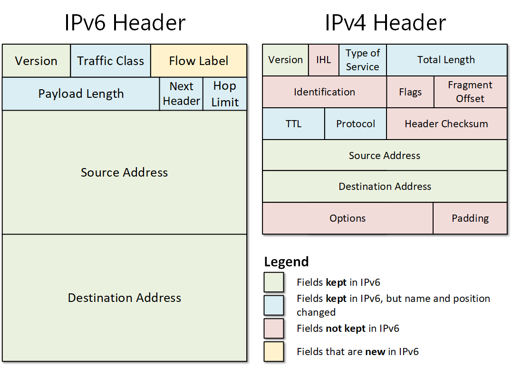

# 2 Semester

## 30-01-2023

### PT

CD $PSScriptRoot
. .\helperscript.ps1

### bs win

#### ncpa.cpl

##### SMB (Server Message Block)

ist ein Protokoll, das in lokalen Netzwerken für die Übertragung von Daten zwischen einem Client und einem Server verantwortlich ist. Es wird verwendet, um in Windows-Netzwerken Datei- und Verzeichnis-Freigaben und Druckdienste zu realisieren.

##### Samba Linux

Ein Linux-Samba-Server regelt die Freigabe von Dateien und Diensten im Netzwerk wie ein Windows-Server – nicht zuletzt (seit Samba-Version 4) auch dank der Fähigkeit, die Rolle des Active Directory Domain Controllers zu übernehmen.

cifs fruerher version von SMB

### wiso

#### Willenserklärungen

#### Vertragsarten0001

#### Vertragsfreiheit und AGB

#### Nichtigkeit Anfechtbarkeit

## 20.02.2023

### wiso

#### Form_der_Rechtsgeschäfte

### Powershell

#### Powershell Parameters

fehlt...

## 22.02.2023

### wiso

#### Überblick Dienstleistungsverhältnisse_04

## 24.02.2023

### NT

#### ipv6

2001:1234:5678:90ab:cdef:1y2b:3c4d:5e6f

1 nibble = 4 bit
1 Block = 4 nibbles = 16 bit

8 Blöcke = 32 nibbles = 128 bit

2001:0000:0000:000a:0000:0000:0000:0800
2001:0:0:a:0:0:0:800

##### version 1

2001::a:0:0:0:800

##### version 2

2001:0:0:a::800

#### ipv6 Subnetting

2001:A:1B:3c5::/64 in 2 subnetze

##### expendieren

2001:000a:001b:03c5:0000:0000:0000:0000/64  
 fix &nbsp;&nbsp;&nbsp;&nbsp;&nbsp;&nbsp;&nbsp;&nbsp;&nbsp;&nbsp;&nbsp;&nbsp;&nbsp;&nbsp;&nbsp;&nbsp;&nbsp;&nbsp;&nbsp;&nbsp;&nbsp;&nbsp;&nbsp;&nbsp;&nbsp;&nbsp;&nbsp;&nbsp; :0000:0000:0000:0000/64

16 number / 2 = 8
aber wir fangen mizt 0 an dann 7!!

###### 1.

2001:000a:001b:03c5:0000:0000:0000:0000 /65
2001:000a:001b:03c5:7fff:ffff:ffff:ffff /65

###### 2.

2001:000a:001b:03c5:8000:0000:0000:0000 /65
2001:000a:001b:03c5:ffff:ffff:ffff:ffff /65

##### Übung

2001:A:1B:3c5::/56  
alles schreiben  
2001:000a:001B:03|c5:0000:0000:0000:0000  
(16) (32) (48) (64) ....

## 02.03.2023

### BS

#### Laufwerk

ist: low level formatierung  
partition tabelle schreiben  
MBR bios 4 primäre P 2TB 32 bit
GPT uefi 127 partiotion zetabite 64 bit  
Partition  
filesystem  
fast blöcke zu cluster

AHCI vs. RAID vs. IDE – das sollten Sie wissen

AHCI vs. RAID vs. IDE – alles Wissenswerte zusammengefasst
Zu den Vorteilen von modernen Betriebssystemen wie Windows 10 und Windows 11 gehört, dass die Bedienung äußerst einfach und kein tieferes Verständnis von Computern erforderlich ist. Auch ohne langwierige Konfigurationen können Programme wie Microsoft Word ausgeführt und verschiedenste Hardware genutzt werden. Allerdings ist nicht jede Standardeinstellung die beste Option für alle Benutzer – und einige der Änderungen, von denen Sie möglicherweise profitieren, erfordern tiefere Computerkenntnisse. Die Wahl zwischen AHCI, RAID und IDE für Ihre SATA-Konfiguration ist eines der Dinge, die Ihr gesamtes Computererlebnis verbessern können, aber etwas kompliziert ist. In diesem Blogbeitrag schauen wir uns die Gemeinsamkeiten und Unterschiede von AHCI, RAID und IDE etwas genauer an.

Was ist SATA und was gibt die Konfiguration vor?
SATA steht für Serial Attached Technology Attachment und beschreibt eine Übertragungs-Technik für Festplatten und Wechselspeicher-Laufwerke. Wie es die Bezeichnung bereits erahnen lässt, basiert SATA auf der seriellen Signaltechnik. Dies bedeutet, dass Daten als eine Folge einzelner Bits übertragen werden. Die Entwicklung der technischen Spezifikation überwacht die Serial ATA International Organization (SATA-IO).

Ihre SATA-Konfiguration gibt vor, wie Ihr Rechner Daten speichert und verarbeitet. Neuere Laufwerkstypen wie Solid-State-Drive (SSD) und NVme-Laufwerke verwenden nicht immer ein SATA-Protokoll. Im Allgemeinen sind Geräte, die direkt mit dem Motherboard verbunden sind, schneller als solche, die Kabel verwenden, insbesondere wenn PCIe 4.0-Steckplätze vorhanden sind. IDE, AHCI und RAID sind verschiedene Möglichkeiten, Ihre SATA-Geräte zu verwalten. Welches am besten funktioniert, hängt von Ihrem Computer ab, welche Laufwerke Sie verwenden und wie Sie sie nutzen möchten.

AHCI und IDE im Vergleich
IDE steht für Integrated Drive Electronics und ist das älteste SATA-Protokoll. Moderne Systeme verwenden es selten, weil es langsamer ist und weniger Optionen bietet als AHCI. Es wird im Allgemeinen als Möglichkeit bereitgestellt, ältere Hardware anzuschließen, die mit anderen Konfigurationen nicht funktioniert. Letztendlich ist der einzige Grund, IDE zu verwenden, wenn Sie keine anderen Optionen haben. IDE wird von fast jedem Betriebssystem unterstützt und ist weit verbreitet.

AHCI steht für Advanced Host Controller Interface und ist die beliebteste Alternative zu IDE. Sein neueres Protokoll speichert alle Informationen auf dem zugewiesenen Laufwerk. Dem 2004 veröffentlichten Schnittstellenstandard für Serial-ATA-Controller kommt die zentrale Aufgabe zu, die Datenübertragung vom RAM auf die Festplatten zu erleichtern.

AHCI bietet gegenüber IDE mehrere Vorteile. Geschwindigkeit ist einer der wichtigsten Vorteile von AHCI gegenüber IDE. Native Command Queueing (NCQ) ist eine Möglichkeit, die Handhabung von Aufgaben zu priorisieren, wenn Daten verschoben werden. Ältere IDE-Systeme erledigen Aufgaben stets in der angeforderten Reihenfolge, was nur selten der sinnvollste und effektivste Weg ist.

Hot Plugging ist eine Funktion, die von AHCI unterstützt wird und mit der Sie neue Laufwerke anschließen können, selbst wenn der Computer eingeschaltet ist. Dies ist nützlich, insbesondere bei der Fehlerbehebung oder wenn Sie häufig Laufwerke anschließen und wieder entfernen müssen.

Was ist RAID?
RAID steht für Redundant Array of Independent Disks und erfordert im Allgemeinen, dass Sie AHCI aktivieren. Die Technologie kombiniert mehrere Festplatten zur Speicherung von Daten. RAID kann als eine Art Speichervirtualisierungsfunktion angesehen werden, die in den Bereichen Sicherheit und Speicher-Flexibilität zu überzeugen weiß.

Wie mehrere physische Festplatten zum Aufteilen und/oder Speichern von Daten verwendet werden, gibt der sogenannte RAID-Level vor. Die am häufigsten verwendeten Arten von RAID-Arrays sind RAID 0 und RAID 1. RAID 0 ist eine schnelle Konfiguration, die Daten über mehrere Festplatten verteilt, aber keine Backups erstellt. Es ist schnell, weil es gleichzeitig von mehr als einer Festplatte schreibt und liest. RAID 0 ist optimal, wenn Sie die größtmögliche Geschwindigkeit benötigen und dabei einen Datenverlust in Kauf nehmen können. RAID 1 kopiert die Daten zwischen mehr als einer Festplatte, sodass Sie nicht alles verlieren, wenn eine Festplatte ausfällt. Während die Lesegeschwindigkeit höher als bei RAID 0 ist, kann es bei der Schreibgeschwindigkeit zu leichten Einbußen kommen. Es ist unglaublich zuverlässig, da die Daten auf jeder Festplatte im Array gespiegelt werden.

#### Welche Konfiguration sollte wann gewählt werden?

Welche SATA-Konfiguration in Ihrem konkreten Fall besonders sinnvoll ist, hängt von mehreren Faktoren ab. Wenn Sie ältere Hardware verwenden, überprüfen Sie, welche SATA-Controller überhaupt unterstützt werden. Einige ältere Systeme funktionieren nicht mit AHCI oder RAID. Sodann bleibt IDE als solider Standard. Wenn es um IDE im Vergleich zu AHCI geht, verbessert AHCI normalerweise die Leistung.

Für Heimanwender ist AHCI im Allgemeinen eine sehr gute Wahl. Wenn Sie ein erweitertes Setup erstellen möchten und viele Festplatten haben, mit denen Sie arbeiten können, sollten Sie jedoch auch RAID in Betracht ziehen. RAID eignet sich hervorragend für viele verschiedene Funktionen, ist jedoch nicht die beste Wahl für Spiele. Die Technologie benötigt mehr Festplatten, reduziert Ihren Gesamtspeicher und hat eine höhere Ausfallrate. Für Gamer ist somit AHCI empfehlenswerter. Wenn Sie mit einem RAID-Array Games spielen möchten, sollten Sie RAID 0 wählen und alles, was Ihnen wichtig ist, an anderer Stelle speichern, damit Sie bei einem Ausfall des Laufwerks nur Spieldateien verlieren, die einfach heruntergeladen und wiederhergestellt werden können.

RAID wird häufig in Serverumgebungen verwendet, um bestimmte Lese- oder Schreibgeschwindigkeiten zu verbessern. Wenn es Ihnen nichts ausmacht, mehr PC-Management zu betreiben, ist RAID eine gute Wahl.

Wo kann die Konfiguration geändert werden?
Welches Protokoll Sie verwenden möchten, müssen Sie vor der Installation des Betriebssystems auswählen. Die Auswahl wird über das BIOS des Rechners getroffen. An welcher Stelle die entsprechende Option gefunden werden kann, erfahren Sie über die Motherboard-Benutzeranleitung bzw. die Homepage des jeweiligen Herstellers.

Viele Windows-Benutzer haben bereits festgestellt, dass das Betriebssystem den AHCI-Treiber nur dann lädt, wenn die Option vor der Betriebssysteminstallation ausgewählt wurde. Wird der Modus nachträglich im BIOS von IDE auf AHCI geändert, ist ein fehlerhafter Start von Windows oder ein Bluescreen vorprogrammiert

Sie können AHCI mit allen Festplatten verwenden, die das Protokoll unterstützen, einschließlich SSDs. Überprüfen Sie einfach die Dokumentation zu Ihrem Laufwerk, um zu sehen, welche SATA-Protokolle es unterstützt.

Sie möchten Windows 10 oder Windows 11 günstig kaufen und die neuste Hardware verwenden? Bei Softwarekaufen24 finden Sie die Betriebssysteme von Microsoft zu einem herausragenden Preis-Leistungs-Verhältnis.

| -                    | raid 0                | raid 1                           | raid 5                                       | raid 6                                           | raid 10 eins nul                    | jbod                   |
| -------------------- | --------------------- | -------------------------------- | -------------------------------------------- | ------------------------------------------------ | ----------------------------------- | ---------------------- |
| mind                 | Block Level Stripping | mirroring                        | Block Level Stripping mit rotierende Parität | Block Level Stripping mit 2 rotierenden Paritätn | Block Level Stripping mit mirroring | übergreifendes volumen |
| -                    | 2                     | 2                                | 3                                            | 4                                                | 4                                   | 2 bis n                |
| -                    | schnell read write    | schnell read / NOt schnell write | schnell read / NOt schnell write             | schnell read / NOt schnell write                 | quick read and write-               | -                      |
| Qr                   | B = N                 | B/2 = N                          | -                                            | -                                                | -                                   | -                      |
| QHdd                 | Qr = n\*Qhd           | Qr = (n/2)\*Qhdd                 | Qr = (n-1)\*Qhdd                             | Qr = (n-2)\*Qhdd                                 | Qr = (n/2)\*Qhdd                    | Qr = Σ Qhdd            |
| ausfall datenverlust | 0                     | 1                                | 1                                            | 2                                                | 1 aber jeweils 1 von raid 1         | -                      |

## 03.03.2023

### NT

Hyper Backup Quick Start Guide von Sinology macht back ups

synology dsm: Synology DiskStation Manager  
Das modulare Betriebssystem Synology DiskStation Manager (DSM) ermöglicht es dank der benutzerfreundlichen Oberfläche und zahlreichen Features sowohl ...

## 03.10.2023

ipconfig

xxxx:xxxx:xxxx:xxxx:xxxx:xxxx:%13
der 13. ausgedacht addresse vom computer

IN IPV6 eingebettete ipv adresse
----->192.168.13.42 Dez
0000:0000:0000:0000:0000:FFFF:
0:0:0:0:0:ffff:C0A8:0D2A

in terminal
traceroute: In computing, traceroute and tracert are computer network diagnostic commands for displaying possible routes and measuring transit delays of packets across an Internet Protocol network

https://www.tutorialspoint.com/ipv6/ipv6_headers.htm#:~:text=IPv6%20headers%20have%20one%20Fixed,to%20handle%20a%20packet%2Fflow.

ver version  
PRI priorisierung bzw tarffic class

## 16.03.2023

??
TBW = 150 GB
R = 250 GB
protag = 40 GB
What is CrystalDiskInfo used for?  
CrystalDiskInfo is an MIT-licensed S.M.A.R.T. utility for reading and monitoring disk drive status. Like CrystalDiskMark, this tool is designed with an emphasis around solid state devices, supporting NVMe connections in addition to the usual PATA and SATA.

HDD MAGNET
SSD Strom

## 22.03.2023

### Front end Programmier Sprache

Angular  
Typescript  
NgBootStrap  
primeng  
Scrum
...

### back end Programmier Sprache

MSSQL  
C#  
Crud API  
AZURE  
Docker / DevOPS  
Scrum

### NT

#### Namenauflösung

PC NAME --------------------------- IP-Adress  
**MUSS**  
net bios Name  
<= 15 Zeichnen  
az09-  
ex: srv1

Broadcast
old: <del>lmhosts.sam</del>  
oder <del>wins</del>

**Optional**  
(wenn aus dem internet erreichbar sein soll)  
(seit win 2000 Domäne)  
FQDn/dns qualified domain name  
<= 255 Zeichnen  
<= 63Z.<= 63Z.<= 63Z.<= 62Z.  
az09-

DNS  
<del>hosts</del> is old

    **nslookup** is the name of a program that lets an Internet server administrator or any computer user enter a host name (for example, "whatis.com") and find out the corresponding IP address or domain name system (DNS) record.

ping -4 localhost ping address with ip4  
ping -6 localhost ping address with ip6

## 23.03.2023

### BS

seite 218 uebungsbuch  
seite 398 Datenschutz

## 23.03.2023

### NT

netstat -rn

C:\Users\Administrator\Downloads>netstat -rn

## 23.04.2023

### WISO

B2b Zweiseitiges HandelsKauf  
B2C Verbrauchsgüterkauf  
Bürgerlischer kauf : Um einen bürgerlichen Kauf handelt es sich, wenn Käufer und Verkäufer Nicht-Kaufleute im Sinne des § 1 Abs. 1 HGB sind. Eine Mutter verkauft die zu klein gewordene Kleidung ihres Kindes an eine andere Mutter. Ein Student kauft ein gebrauchtes Fahrzeug von einem privaten Anbieter.

Unternehmen / Kaufmann Unterschied

Mängelrüge  
Nacherfüllung  
Nachlieferung  
Nachbesserung

Garantie ist icht gleich Gewährleistung

