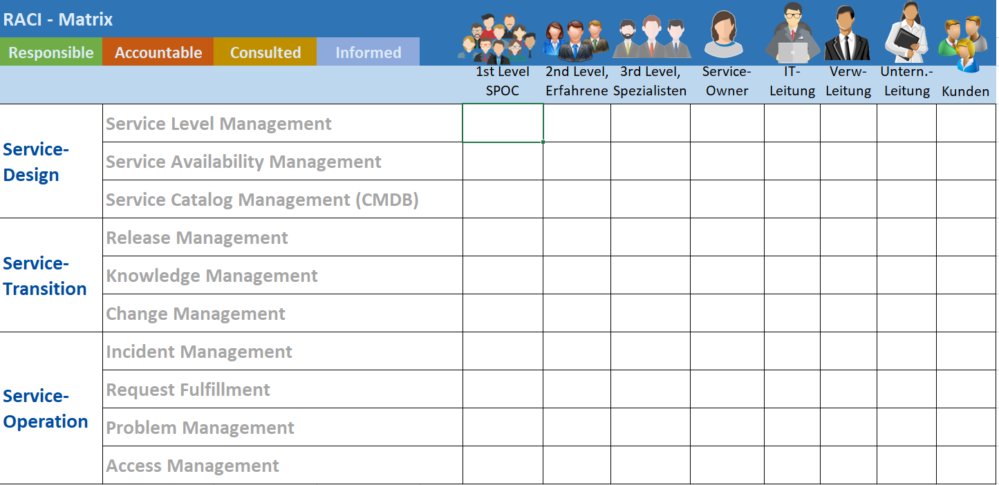

<link rel="stylesheet" type="text/css" href="styles.css">

# 3 Semester

## 03 07 2023

### Kup

#### Prozessor Intel/AMD Untershiede

AMD vs. Intel - Voici les différences

Les processeurs AMD comparables ont plus de cœurs de calcul et peuvent ainsi surpasser les processeurs Intel pour les programmes à forte intensité de calcul qui font appel à plusieurs cœurs, comme l'édition vidéo.

Les processeurs AMD sont généralement un peu moins chers que leurs homologues Intel.

Les processeurs AMD peuvent être overclockés sans restriction, alors que pour les processeurs Intel, vous devez faire attention à la lettre "K" (par exemple : Core-i9-9900K). Veillez à ce que vous soyez seul responsable des dommages causés par l'overclocking.

Les CPU Intel ont généralement des fréquences d'horloge plus élevées, ce qui profite particulièrement aux jeux.

#### dedizierte Grafikkarte

Eine dedizierte Grafikkarte besitzt im Gegensatz zu einer internen Grafikkarte (IGP) einen eigenen Videospeicher (VRAM) und einen eigenen Grafikprozessor, die GPU. Somit wird der Arbeitsspeicher meistens entlastet, wodurch er für andere Aufgaben genutzt werden kann.

#### Anbindung von Massendatenträgern an die CPU

Die Anbindung von Massendatenträgern an die CPU kann über verschiedene Schnittstellen erfolgen, darunter SATA, M.2 und PCIe. Hier sind die wichtigsten Unterschiede zwischen diesen Schnittstellen:

**SATA** (Serial ATA): SATA ist eine weit verbreitete Schnittstelle für Massenspeichergeräte wie Festplatten und SSDs. Sie bietet eine gute Datenübertragungsrate, ist jedoch im Vergleich zu M.2 und PCIe etwas langsamer. SATA-Geräte werden über separate Kabel an das Motherboard angeschlossen und bieten in der Regel mehrere Anschlüsse für verschiedene Laufwerke.

**M.2**: M.2 ist eine kompakte Schnittstelle, die vor allem für SSDs entwickelt wurde. Es handelt sich um eine Schnittstelle, die direkt auf das Motherboard gesteckt wird und keine separaten Kabel erfordert. M.2 unterstützt verschiedene Protokolle, darunter SATA und PCIe. Die PCIe-Version von M.2 bietet die schnellste Datenübertragungsrate und wird für Hochleistungs-SSDs verwendet. M.2 bietet außerdem den Vorteil einer platzsparenden Bauweise, da keine zusätzlichen Kabel benötigt.

**PCIe** (Peripheral Component Interconnect Express): PCIe ist eine Hochgeschwindigkeits-Schnittstelle, die normalerweise für Grafikkarten verwendet wird, aber auch für andere Erweiterungskarten wie SSDs genutzt werden kann. PCIe bietet die höchste Datenübertragungsrate im Vergleich zu SATA und M.2. Bei der Verwendung von PCIe für Massenspeicher werden häufig PCIe-Erweiterungskarten oder PCIe-Adapter verwendet, um die Verbindung zwischen dem Massenspeichergerät und dem Motherboard herzustellen.

Im Allgemeinen bieten M.2 und PCIe schnellere Datenübertragungsraten im Vergleich zu SATA, wobei PCIe die höchste Leistung bietet. M.2 hat den zusätzlichen Vorteil einer kompakten Bauweise und der Möglichkeit, sowohl SATA- als auch PCIe-Protokolle zu unterstützen. Die Wahl der Schnittstelle hängt von den individuellen Anforderungen, dem verfügbaren Motherboard-Steckplatz und dem Budget ab.

## 04 07 2023

### Wiso

#### Finanzierung

##### Finanzierung - Investierung

##### Finanzierungsarten - Überblick

##### Finanzierungsarten - Übersicht

## 07 08 2023

### BS_DS

#### AUFTRAG

**dockingstation**: A docking station is an electronic device described as a "port replicator." This convenient device provides a simple, hassle-free, and convenient way to plug in common computer peripherals, thus bridging the gap between a laptop and a desktop through its multiple ports.

**SOLIDWORKS**: SOLIDWORKS is used to develop mechatronics systems from beginning to end. At the initial stage, the software is used for planning, visual ideation, modeling, feasibility assessment, prototyping, and project management. The software is then used for design and building of mechanical, electrical, and software elements.

**proxmox**: Proxmox Virtual Environment is a hyper-converged infrastructure open-source software. It is a hosted hypervisor that can run operating systems including Linux and Windows on x64 hardware.

**slimline**: ist ein Ausdruck, der im EDV- und Unterhaltungselektronikbereich verringerte Baugrößen für Laufwerke beschreibt. Der Ausdruck findet Verwendung bei Notebooks, DVD-Playern, Digitalkameras, Spielkonsolen und vielem mehr.

## 07 08 2023

### pog

#### TOM und Betroffenenrechte

##### Technische und organisatorischen Maßnahmen (BDSG)

| TOM                          | Ziel                                                                                                                                             | Beispiele für eine TOM                                                                              |
| ---------------------------- | ------------------------------------------------------------------------------------------------------------------------------------------------ | --------------------------------------------------------------------------------------------------- |
| Zutritts- kontrolle       | Verhindern, dass Unbefugte Zutritt zu den Datenverarbeitungsanlagen haben.                                                                       | Alarmanlage Pförtner Zäune Schlösser                                                                |
| Zugangs- kontrolle        | Verhindern, dass Unbefugte Datenverarbeitungsanlagen nutzen können.                                                                              | Passwortverfahren Verschlüsselung Firewall                                                          |
| Zugriffs- kontrolle       | Gewährleisten, dass nur Berechtigte auf Daten zugreifen können und diese nicht unbefugt gelesen, verändert, kopiert oder entfernt werden können. | Berechtigungskonzepte Protokollierung Zertifikate                                                   |
| Weitergabe- kontrolle     | Gewährleisten, dass Daten bei der elektronischen Übertragung/Transport nicht unbefugt gelesen, kopiert, verändert oder entfernt werden können.   | Verschlüsselung VPN                                                                                 |
| Eingabe- kontrolle        | Gewährleisten, dass nachträglich überprüft werden kann, ob und wer Daten verändert oder entfernt hat.                                            | Protokollierung Protokollauswertungssysteme                                                         |
| Auftrags- kontrolle       | Gewährleisten, dass Daten, die im Auftrag verarbeitet werden, nur entsprechend den Anweisungen des Auftraggebers verarbeitet werden können.      | Vertragsgestaltung bei ADV Kontrollen                                                               |
| Verfügbarkeits- kontrolle | Gewährleisten, dass Daten gegen zufällige Zerstörung oder Verlust geschützt sind.                                                                | Datensicherung/Backup Firewall/Virenschutz Brandschutzmaßnahmen Unterbrechungsfreie Stromversorgung |
| Trennungs- gebot          | Gewährleisten, dass zu unterschiedlichen Zwecken erhobene Daten getrennt verarbeitet werden                                                      | getrennte Datenbanken Trennung der Systeme                                                          |

##### Rechte der Betroffenen (DSGVO)

###### 01 Recht auf Information

Das Recht auf Information ist ein anderer Ausdruck für die Informationspflichten.
Das beinhaltet z.B. die Aufklärung Ihrer Betroffenen über ihre Rechte, die Speicherung ihrer Daten, Zwecke der Verarbeitung ihrer Daten usw.

Achtung: Diese Informationen müssen schon vor der erstmaligen Verarbeitung bereitgestellt werden!

###### 02 Recht auf Auskunft

Auf Verlangen muss das Unternehmen die betroffene Person über

- die Verarbeitungszwecke seiner Daten,
- die Kategorien der verarbeiteten Daten,
- die exakten Empfänger bzw. Empfängerkategorien,
- die Speicherdauer der Daten sowie
- die Herkunft der Daten informieren.

Außerdem muss eine Anfrage innerhalb von 30 Tagen beantwortet werden, sonst können Strafen drohen!

###### 03 Recht auf Berichtigung

Jeder Betroffene kann die Richtigstellung bzw. Vervollständigung seiner personenbezogenen Daten einfordern. Vorausgesetzt natürlich, diese sind wirklich falsch.

###### 04 Recht auf Löschung

Auf Verlangen eines Betroffenen muss das Unternehmen die personenbezogenen Daten dieser Person löschen. Außerdem müssen die personenbezogenen Daten in jedem Fall gelöscht werden, wenn die Zwecke, für die sie erhoben oder auf sonstige Weise verarbeitet wurden, nicht mehr aktuell sind, die betroffene Person ihre Einwilligung, auf die sich die Verarbeitung gestützt hat, widerruft, oder die Daten unrechtmäßig verarbeitet wurden (also z.B. keine Rechtsgrundlage wie Vertrag oder Einwilligung vorliegt).

###### 05 Recht auf Einschränkung

Der Betroffene kann hierbei einfordern, dass seine personenbezogenen Daten für eine bestimmte Dauer eingeschränkt verarbeitet werden. Beispielsweise werden diese Daten für einen gewissen Zeitraum von einer Website entfernt, für Nutzer gesperrt.

###### 06 Recht auf Widerspruch

Ein Betroffener hat das Recht, der Verarbeitung seiner personenbezogenen Daten zu
widersprechen. Jedoch nur, wenn er sich in einer besonderen Situation befindet, die diesen Widerspruch rechtfertigt. Folglich dürften Sie diese Daten nicht weiterverarbeiten.
Hier einige Beispiele für spezielle Situationen:

- Die Daten werden für Direktwerbung genutzt
- Ein Betroffener erhält Drohungen und auf einer Website wird seine Adresse
  veröffentlicht
- Der Betroffene hat Angst vor weiteren Angriffen, wenn er schon Opfer von
  Datenschutz-Verstößen wurde

###### 07 Recht auf Datenübertragbarkeit

Ein weiteres Recht betrifft die Übertragung von personenbezogenen Daten. Das
heißt, ein Betroffener hat die Möglichkeit, die Herausgabe seiner Daten zu
beantragen. Anschließend sollen diese an eine andere Stelle übertragen werden.
Beispielsweise an einen neuen Anbieter. Dies soll einen Anbieterwechsel
erleichtern.
Wenn Sie also beispielsweise ein Versicherungsunternehmen betreiben, hat Ihr Kunde
das Recht, dass Sie, wenn er zu einer anderen Firma wechselt, seine gesammelten
Daten direkt an Ihren Konkurrenten übermitteln.
Wichtig dabei:

- Die Auslieferung muss dabei in einem strukturierten und maschinenlesbaren
  Format erfolgen.
- Das Recht gilt nur, wenn die Verarbeitung auf einer Einwilligung oder einem
  Vertrag beruht und die Verarbeitung mittels automatisierter Verfahren
  erfolgt.

## 09 08 2023

### wiso

#### Finanzierung

##### innenfinanzierung

- Selbstfinanzierung
- Finanzierung aus Rückstellungen
- Finanzierung aus freigesetztem Kapital

##### aussenFinanzierung

- Beteiligungsfinianzierung
- Kredit finanzierung

Rücklagen  
Rückstellungen

- pensionrückstellung
- Steuerrückstellung
- Prozessrückstellung

  | Aktive                     | Passiv               |
  | -------------------------- | -------------------- |
  | was mit geld gemqacht wird | wo das Geld herkommt |
  | Anlage Vermögen            | Eigen Kapital        |
  | Umlauf Vermögen            | Fremd Kapital        |

  Bonität: zahlungsfähigkeit

##### Gewinn und Verlust

Abschreiben Umsatz
Aufwende Erlöse
Gewinn kommmt in den Passiv

##### Darlehnen

## 10 08 2023

### sle

Get-EventLog -LogName security |
? {$_.EventID -eq 4624 -and $_.Timewritten -gt (get-Date).AddDays(-1) -and $\_.Message -match "s01"} |
FL

? is for where  
(get-Date).AddDays(-1) today minus one day

FL makes a list insteaad of tabele

**ODBC**: The Microsoft **Open Database Connectivity** interface is a C programming language interface that makes it possible for applications to access data from a variety of database management systems (DBMSs). ODBC is a low-level, high-performance interface that is designed specifically for relational data stores.

## 11 08 2023

### pog

#### Netzplan

Ein Netzplan ist eine graphische oder tabellarische Darstellung einer Ablaufstruktur im Projekt.

Der Netzplan im Projektmanagement stellt die Dauer von Vorgängen im Projekt, ihre zeitliche Anordnung und logische Abhängigkeiten zwischen den Vorgängen graphisch oder tabellarisch dar.

Auch Balkendiagramme wie zum Beispiel Gantt Charts lassen sich als Sonderform des Netzplanes betrachten.

##### Hauptfunktionen des Netzplans:

- Ermittlung der Gesamtdauer des Projektes
- Darstellung der logischen und zeitlichen Abfolge im Projekt
- Risiken: Wo liegt der kritische Pfad? Wo sind Flaschenhälse im Projektablauf?
- Chancen: An welcher Stelle kann der Projektablauf gestrafft werden?
- Der Netzplan bildet die Grundlage für die Terminplanung.

Im modernen Projektmanagement werden kaum noch Netzpläne „von Hand“ berechnet, das übernimmt heute eine Projektmanagement-Software.

Allerdings helfen die Grundlagen der Methode dabei, den eigenen Projektplan besser zu verstehen.
**Basiselement des Netzplanes ist der Vorgangsknoten.**

- eine Dauer (d)
- eine Vorgangsnummer
- ein frühester Anfangszeitpunkt (FAZ)
- ein spätester Anfangszeitpunkt (SAZ)
- ein frühester Endzeitpunkt (FEZ)
- ein spätester Endzeitpunkt (SEZ)
- ein Gesamtpuffer (GP) (= SAZ – FAZ oder = SEZ – FEZ)
- und der freie Puffer (FP) (= FAZ des Nachfolgers – FEZ des aktuellen Vorgangs)

Der früheste Endzeitpunkt (FEZ) ergibt sich aus dem frühesten Anfangszeitpunkt (FAZ) und der Vorgangsdauer (d).
Der späteste Endzeitpunkt minus der Vorgangsdauer (d) ergibt den spätesten Anfangszeitpunkt (SAZ).

## 14 08 2023

### ass

#### uml

UML (Unified Modeling Language) ist eine grafische Modellierungssprache, die zur Darstellung, Kommunikation und Spezifikation von Software- und Systemdesigns verwendet wird. Die UML kann bei verschiedenen Phasen des Softwareentwicklungsprozesses eingesetzt werden, darunter auch bei der Testphase.

Weißkastentests (auch als White-Box-Tests oder Strukturtests bezeichnet) und Schwarzkastentests (auch als Black-Box-Tests bezeichnet) sind zwei verschiedene Ansätze für das Testen von Software oder Systemen, und die UML kann bei beiden Ansätzen eine Rolle spielen.
**Weißkastentests (White-Box-Tests):**
Bei Weißkastentests liegt der Fokus darauf, die interne Struktur und Logik einer Softwarekomponente zu verstehen und zu testen. Der Tester hat Kenntnisse über den Quellcode, die Algorithmen und die Implementierungsdetails der Software. Ziel ist es, sicherzustellen, dass alle möglichen Pfade im Code abgedeckt werden und dass alle Anweisungen und Bedingungen getestet werden. UML-Diagramme wie Klassendiagramme, Sequenzdiagramme und Zustandsdiagramme können verwendet werden, um den Code zu analysieren und Testfälle abzuleiten, die spezifische Codepfade abdecken.

**Schwarzkastentests (Black-Box-Tests):**
Bei Schwarzkastentests liegt der Fokus darauf, die Software aus der Perspektive des Benutzers oder der externen Schnittstellen zu testen. Der Tester hat keine Kenntnisse über die interne Implementierung und sieht die Software als eine "Black Box". Ziel ist es, sicherzustellen, dass die Software die Anforderungen erfüllt und die erwarteten Ausgaben für gegebene Eingaben erzeugt. UML-Diagramme wie Use Case-Diagramme, Aktivitätsdiagramme und Klassendiagramme können verwendet werden, um die Anforderungen und das erwartete Verhalten zu definieren und Testfälle abzuleiten.

In beiden Ansätzen kann die UML bei der Modellierung der Software helfen, was die Kommunikation zwischen Testern und Entwicklern erleichtert. Weißkastentests nutzen die UML, um den Code zu analysieren und Testfälle abzuleiten, während Schwarzkastentests die UML verwenden können, um Anforderungen und erwartetes Verhalten zu definieren.

Insgesamt ist der Hauptunterschied zwischen Weißkastentests und Schwarzkastentests der Fokus des Tests: Weißkastentests konzentrieren sich auf die interne Struktur und Implementierung, während Schwarzkastentests sich auf das externe Verhalten und die Anforderungserfüllung konzentrieren.

## 15 08 2023

### wieso

#### Liesing

#### Liesingart

## 17 08 2023

### ptsle

Get-EventLog -LogName security |
? {$_.EventID -eq 4624 -and $_.Timewritten -gt (get-Date).AddDays(-1) -and $_.Message -match "s01" -and $_.Message -match "0x31563"} |
FL

## 21 08 2023

### kup

wpa2-entreprise wpa2-personel  
WPA3-Personal mode replaces PSK with Simultaneous Authentication of Equals (SAE) so it eliminates dependency on shared passwords and gets devices authorized without sacrificing security. While for WPA3-Enterprise mode, there is a move from the 128-bit security level of WPA2-Enterprise to 192-bit security.

#### agent ransack

is a free file search tool for finding files on your PC or network drives. It has a Lite mode, which is FREE for both personal ...

#### issue tracking system

also ITS, **trouble ticket system**, support ticket, request management or incident ticket system is a computer software package that manages and maintains lists of issues. Issue tracking systems are generally used in collaborative settings, especially in large or distributed collaborations, but can also be employed by individuals as part of a time management or personal productivity regimen. These systems often encompass resource allocation, time accounting, priority management, and oversight workflow in addition to implementing a centralized issue registry.

## 21 08 2023

### luc

#### fussnoten

- kursor nach dem wort
- werweise in der rubbanfussnote clicken

## 28 08 2023

### kup

#### usb 3 speed usb 2 speed

First the transfer rates: USB 2.0 offers transfer rates of 480 Mbps and USB 3.0 offers transfer rates of 4.8 Gbps - that's 10 times faster.

- So wird bei der Nutzung von USB-3.0-Anschlüssen eine zehnmal höhere USB-Geschwindigkeit erreicht.
- USB 2.0 und USB 3.0 unterscheiden sich außerdem darin, dass letzterer vollduplex arbeitet und Sie Daten gleichzeitig in beide Richtungen übertragen können.
- Auch die Stromversorgung wurde bei USB 3.0 verstärkt und beträgt statt 500mA nun 900mA.
- Eine Einschränkung von USB 3.0 liegt allerdings in der nutzbaren Kabellänge. War die Kabellänge bei USB 2.0 noch auf maximal fünf Meter begrenzt, kann diese bei USB 3.0 höchstens drei Meter betragen.

**str suspend to ram**:  
Sleep mode has gone by various names, including Stand By, Suspend and Suspend to RAM. Machine state is held in RAM and, when placed in sleep mode, the computer cuts power to unneeded subsystems and places the RAM into a minimum power state, just sufficient to retain its data.

**std suspend to disk**:  
The suspend-to-disk(STD) mode is a power managementprogram. In this mode, the running program is interrupted and the data stored in the RAM is saved to the hard disk.

## 29 08 2023

### luc

#### Powerpoint

- schrift größe 24
- nicht mehr als 7 Stich punkte pro Folie
- view/master layout benutzen
  - pick color
  - pick font
  - pick background color

### wiso

#### kaufvertrag

##### Inhalte Kaufvertrages

### POG

##### Privacy by design

Privacy by design seeks to deliver the maximum degree of privacy by ensuring that personal data are automatically protected in any given IT system or business practice. If an individual does nothing, their privacy still remains intact.

##### Privacy by default

Privacy by Default means that once a product or service has been released to the public, the strictest privacy settings should apply by default, without any manual input from the end user.

## 07 09 2023

### sle

#### it service einfuehrrung

raci matrix

R esponsible  
A ccountable  
C onsulted  
I informed

spoc single point of context
cmdb

##### Service-Design

Service design addresses the need for a cohesive experience flow between the business itself as well as the end users. It's a process that pulls from many different sources—like user experience, product management, and marketing—in order to create and optimize powerful experiences that can be delivered seamlessly.

###### Service Level Management

Service Level Management aims to ensure that services are delivered at an agreed-upon level and continually improve service quality. Service Level Management includes processes for monitoring and reporting on service levels, as well as for taking corrective action when service levels are not met.

###### Service Availability Management

Service Availability Management in SAP Solution Manager provides availability reporting for business-critical systems, databases or services. It calculates the availability based on outages detected by system monitoring and compares it to defined availability Service Availability Levels.

###### Service Catalog Management (CMDB)

The purpose of the service catalog management process is to provide and maintain a single source of consistent information on all operational services and those being prepared to be run operationally and to ensure that it is widely available to those who are authorized to access it.

##### Service-Transition

Service transition includes high-level activities such as planning and coordinating service changes, building and testing new or changed service components, and deploying new or changed service components into the live environment.

###### Release Management

Release management is an IT term used frequently across a range of industries. At its most basic, release management describes overseeing the development, testing, deployment, and support involved in designing and releasing software.

###### Knowledge Management

Knowledge management is the process by which an enterprise gathers, organizes, shares and analyzes its knowledge in a way that is easily accessible to employees. This knowledge includes technical resources, frequently asked questions, training documents and people skills.

###### Change Management

Change management is a systematic approach to dealing with the transition or transformation of an organization's goals, processes or technologies. The purpose of change management is to implement strategies for effecting change, controlling change and helping people to adapt to change.

##### Service-Operation

Service operations is responsible for developing a service strategy and working with customer success, customer support, and customer experience teams. The goal of the team is to help scale a business's customer service organization.

###### Incident Management

Incident management is the process of identifying, analyzing, and solving any organizational mishaps or hazards to prevent them from happening again. The aim of incident management is to fix and clear these issues before they become large-scale, company-wide crises.

###### Request Fulfillment

Request fulfillment is the process of resolving a customer's service request and refers to managing the entire lifecycle of all service requests. The service desk team is dedicated to responding to and fulfilling requests while delivering the highest level of service support quality to the customer.

###### Problem Management

Problem Management is an IT service management process tasked with managing the life cycle of underlying "Problems." The primary goal of Problem Management is to prevent incidents from occurring, and if incidents do occur, prevent them from occurring again.

###### Access Management

??

## 26 09 2023

### luc

#### diagramm / chart

in ribbon select data kann man wegklicken was man nicht moechte
in ribbon select change chart type

chart element change: titel, axis

#### smartz grafic

### kup

#### to install Kali

- boot efi 500 mb
- boot 500 mb
- root / 60 gb
- home 20 GB
- swap 4 GB

### Wiso

to finish

### Iot

#### def

the interconnection via the internet of computing devices embedded in everyday objects, enabling them to send and receive data. "if one thing can prevent the internet of things from transforming the way we live and work, it will be a breakdown in security"

Industrie 4.0: die vierte Industrielle Revolution

lerne buch page 80

rebound effekt??

## 28 09 2023

### deu

#### join

where xx = is the same as join on
| |
| :--------------------------------------------------------------------------: |
| 
 |

#### join left

The LEFT JOIN keyword returns all records from the left table (table1), and the matching records from the right table (table2). The result is 0 records from the right side, if there is no match.
| |
| :-------------------------------------------------------------------------: |
| 
 |
| |

#### join right

The RIGHT JOIN keyword returns all records from the right table (table2), and the matching records from the left table (table1). The result is 0 records from the left side, if there is no match.
| |
| :--------------------------------------------------------------------------: |
| 
 |

#### join full

|                                                                             |
| :-------------------------------------------------------------------------: |
| 
 |

### SLE

### verschluesselung

symetrish asymetrish hybrid

#### symetrishe Verschluesselung

## 29 09 2023

### pog

MVC Model view controller Pattern/Muster

**Heuristische Evaluation** (auch als heuristisches Testen bekannt) ist ein Prozess, der Usability-Probleme aufdeckt, indem ein Produkt untersucht und seine Leistung beurteilt wird. Sie stellt einen Rückstand an Verbesserungen fest, der als Teil eines iterativen Designprozesses angegangen werden kann.

## 04 10 2023

### pog

- antrag muss erst mal nicht formatiert werden, wird später

- Herr Poguntke meldet sich 2 Wochen nach Praktikum Anfang

- Antrag wird nicht bewertet sonsdert angelehnt oder akkeptiert

- titel erst mal weglassen
- project beschreibung, wo fanegt an wo endet ...
- kurze Beschreibung des Projekts
- ist zusztand: wie ist es jetzt grade
- soll zustand wie es am Ende auszusehen hat
- zukunft zeit benutzen

- Projekt nehmen das gut zu dokumentieren ist

- was im Antrag steht muss im Doku stehen

- personelle schnitstellen
- herr xx leiter war der Aufraggeber
- ich bin projekt nehmer

#### 3.7 Sachmittel

- hardware und software
- wenn etwas spaeter dazu kommt ist es ok
- ide, rechner, zusatzsoftware, virtialisierung software

#### 3.8 kosten planung

- azubi im dritten lehr ajhr das mal 80
- was kostet hardware
- was kostet software
- energieverbrauch 6 euro pro tag
- gibt es meetings

- was macht die firma?
- wie gross ist die firma?

#### phasen ist sehr wichtig

- ist spaeer der inheltverzeichnuis fuer das project
- plannen eine Stunde zeit puffer oder auch mehr
- meeting 2 Stunden mit jemanden der auch geld verdiennt  
  ...

- Erstellen der Dokumentation 8 bis 12 Stunden aber im Echt mindesten 20 Stunden

\*Das ergibt 80 Stunden

**Presentationsmittel**: was wir mitbringen zu mundlichen pruefung

- beispiel notebook
- nicht schreiebn und mit brigebn ok
- was schreiben und nichtt bringen ist ein Problem

Portal erst ab Februar geöffnet und die info zu laden

[https://it-berufe-podcast.de/vorbereitung-auf-die-ihk-abschlusspruefung-der-it-berufe/beispiele-fuer-ihk-abschlussprojekte-in-den-it-berufen/](https://it-berufe-podcast.de/vorbereitung-auf-die-ihk-abschlusspruefung-der-it-berufe/beispiele-fuer-ihk-abschlussprojekte-in-den-it-berufen/)

### WISO

#### Personal witrschaft

##### Entscheidungshilfen der Personalwirtschaft & Personalstatistik Personalinformationssystem

- Personalbedarfsplanung
- Personalbeschaffungsplanung
- Personalbeschaffung
- Personaleinsatzplanung
- Personalführung
- Personalentwicklung / Personalbeurteilung
- Personalentlohnung
- Personalfreistellung
- Bewältigen von Arbeitskonflikten
- Personal-Controlling

###### Personalbedarfsplanung

Sie stellt den gegenwärtigen und den künftigen Personalbedarf nach Quantität der Arbeitskräfte fest.  
_Elle détermine les besoins actuels et futurs en personnel en fonction de la quantité de main-d'œuvre._

###### Personalbeschaffungsplanung

Hier werden alle Maßnahmen geplant, die notwendig sind, um den tatsächlichen Personalbestand dem Sollbestand anzupassen. Weiterhin geht es darum, die Personalbeschaffungswege (interne Personalbeschaffung und/oder externe Personalbeschaffung) festzulegen  
_Il s'agit ici de planifier toutes les mesures nécessaires pour adapter l'effectif réel à l'effectif théorique. Il s'agit également de définir les canaux de recrutement (interne et/ou externe)._

###### Personalbeschaffung

Die Personalwirtschaft hat die Aufgabe, die geeigneten Bewerber auszuwählen und unter Beachtung der gesetzlichen Vorschriften einzustellen.
_La gestion des ressources humaines a pour mission de sélectionner les candidats appropriés et de les recruter en respectant les dispositions légales._

###### Personaleinsatzplanung

Die Personaleinsatzplanung hat zum Ziel, den bestmöglichen Einsatz der vorhandenen Arbeitskräfte unter Beachtung der Arbeitsschutzvorschriften sicherzustellen.  
La planification de l'affectation du personnel a pour objectif d'assurer la meilleure utilisation possible de la main-d'œuvre disponible, dans le respect des règles de santé et de sécurité au travail.

###### Personalführung

Hierunter versteht man das planmäßige Leiten von einzelnen Personen oder Personengruppen in einem Unternehmen. Die Personalführung hat u. a. die Aufgabe, Führungsgrundsätze zu entwickeln und zu beachten und die angemessenen Führungsstile und - techniken einzusetzen.  
_On entend par là la gestion planifiée de personnes ou de groupes de personnes au sein d'une entreprise. La gestion du personnel a notamment pour mission de développer et de respecter des principes de gestion et de mettre en œuvre les styles et techniques de gestion appropriés._

###### Personalentwicklung / Personalbeurteilung

Aufgabe der Personalentwicklung ist, durch geeignete Maßnahmen die Qualifikationen und Kompetenzen der Mitarbeiter zu fördern.
Durch die Beurteilung wird die Entwicklung der Qualifikationen und Kompetenzen der Mitarbeiter überprüft.  
_La tâche du développement du personnel est de promouvoir les qualifications et les compétences des employés par des mesures appropriées.
L'évaluation permet de contrôler l'évolution des qualifications et des compétences des salariés._

###### Personalentlohnung

Sie hat einerseits einen großen Einfluss auf die Personal- und damit die Gesamtkosten eines Unternehmens. Anderseits hat sie einen erheblichen Einfluss auf das Leistungsverhalten der Mitarbeiter  
_D'une part, elle a une grande influence sur les frais de personnel et donc sur les coûts totaux d'une entreprise. D'autre part, elle a une influence considérable sur les performances des collaborateurs._

###### Personalfreistellung

Sie hat zur Aufgabe, eine durch die Personalplanung festgestellte Personalüberdeckung abzubauen. Die Geschäftsleitung wird zunächst versuchen, die Mitarbeiterzahl ohne Kündigung abzubauen. Gelingt dies nicht, sind Kündigungen erforderlich.  
_Elle a pour mission de réduire un sureffectif constaté par la planification des effectifs. La direction va d'abord essayer de réduire les effectifs sans licencier. Si elle n'y parvient pas, des licenciements seront nécessaires._

###### Bewältigen von Arbeitskonflikten

Konflikte im Arbeitsleben können auf der persönlichen Ebene oder zwischen den Organisationsebenen eines Unternehmens entstehen. Können die Konflikte nicht innerhalb des Unternehmens gelöst werden, entscheiden die Arbeitsgerichte.  
_Les conflits dans la vie professionnelle peuvent survenir au niveau personnel ou entre les niveaux organisationnels d'une entreprise. Si les conflits ne peuvent pas être résolus au sein de l'entreprise, ce sont les tribunaux du travail qui tranchent._

###### Personal-Controlling

Das Personal-Controlling hat die Aufgabe, den Entscheidungs- und Steuerungsprozess von Führungskräften durch die Bereitstellung entsprechender Informationen aus der Personalwirtschaft zu unterstützen.  
Le contrôle de gestion du personnel a pour mission de soutenir le processus de décision et de gestion des cadres en leur fournissant les informations correspondantes issues de la gestion du personnel.

#### verschiedenen Formen der Arbeitsteilung

##### Begriff:

**Arbeitsteilung** ist die Auslösung von Arbeit in Teilverrichtungen, die von verschiedenen Personen oder Wirtschaftseinheiten ausgeführt werden. Das Gegenteil der Arbeitsteilung ist die vollständige Selbstversorgung einer einzelnen Person.  
_Beispiel: Ein Bauer baut Weizen an, der Müller mahlt aus dem Weizen Mehl, aus dem der Bäcker wiederum Brot backt. In der Selbstversorgung musste ein Mensch alle diese Tätigkeiten ausführen, um das Brot zu erhalten._

##### Familiäre Arbeitsteilung:

Die **familiäre Arbeitsteilung** ist die ursprünglichste Form der **Arbeitsteilung**. Sie fand zwischen Mann und Frau statt, als es noch keinen Austausch von Gütern gab und die Familien sich noch selbst versorgten.

##### Berufliche Arbeitsteilung:

###### Berufsbildung

**Berufsbildung** ist die Spezialisierung von Personen auf bestimmte Tätigkeitsfelder nach Neigung und Fähigkeit.  
_Beispiel: Entwicklung von Berufen wie Landwirt, Tischler, Müller, Bäcker, Händler, Elektriker_

###### Berufsspaltung

**Berufsspaltung** beinhaltet die durch die Technisierung erforderliche Spezialisierung innerhalb der ursprünglichen Grundberufe.  
_Beispiel. Der Grundberuf Mechaniker lässt sich aufspalten in Industriemechaniker, Werkzeugmechaniker, Automobilmechaniker usw._

##### Betriebliche Arbeitsteilung

###### Arbeitszerlegung

Die **Arbeitszerlegung** beinhaltet die Zerlegung eines gesamten Arbeitsvorgangs in mehrere Teilleistungsprozesse.  
_Beispiel: Die Gesamtaufgabe eines Tischlers wird aufgeteilt in Sägen, Hobeln, Verzinken, usw._

###### Abteilungsbildung

Die **Abteilungsbildung** ist das Ergebnis der **Arbeitszerlegung**. Einzelne Arbeitsprozesse werden auf Stellen/Personen verteilt und diese zu organisatorischen Einheiten (Abteilungen) zusammengefasst.  
_Beispiel: Eine Möbelfabrik enthält im Fertigungsbereich die Abteilungen Zuschnitt, Furnieren, Oberflächenbearbeitung, Bankraum usw._

##### Gesellschaftliche Arbeitsteilung (überbetriebliche Arbeitsteilung)

Die **gesellschaftliche Arbeitsteilung** erstreckt sich nicht mehr nur auf Menschen und Betriebe, sondern auf die gesamte Volkswirtschaft. Die Volkswirtschaft zerfällt in verschiedene Wirtschaftsbereiche, von denen jeder ganz bestimmte Aufgaben übernimmt.

- **Überzeugung**: Gewinnung von Rohstoffen und Energie (z. B. Landwirtschaft, Bergbau)
- **Weiterverarbeitung**: Verarbeitung der Stoffe durch Industrie und Handwerk
- **Handel und Dienstleistungen**: Verteilung der Waren und Erstellung von Dienstleistungen

##### Internationale Arbeitsteilung

Jedes Land spezialisiert sich auf den Anbau oder die Produktion von Waren oder Dienstleistungen, die sich in diesem Land besonders lohnt (Kaffee aus Südamerika, Kupfer aus Chile, Textilien aus Marokko).

#### Rationalisierung

##### Begriff

Unter **Rationalisierung** werden alle Maßnahmen zusammengefasst, die dazu geeignet sind, eine bestimmte Leistung mit einem geringeren Kraft-, Zeit- und Kostenaufwand zu erzielen als vor der Rationalisierung

##### Ziel

Ziel der Rationalisierung ist deshalb die Erhöhung der Produktivität der Fertigung sowie die Gestaltung humaner Arbeitsbedingungen. Produktivität ist das Verhältnis von betrieblicher Ausbringungsmenge (Output) zur betrieblichen Einsatzmenge (Input).

**Produktivität = mengenmäßige Ausbringung/mengenmäßiger Einsatz**

_Beispiel: 200 Mitarbeiter erzeugen vor der Rationalisierung 42 000 Stück. Ihre Produktivität beträgt damit 210 Stück. Nach der Rationalisierung kann diese Leistung durch 175 Mitarbeiter erbracht werden. Die Produktivität hat sich damit auf 240 Stück erhöht._

##### Mahnahmen zur Rationalisierung

Rationalisierungseffekte werden durch folgende Maßnahmen erreicht:

Rationalisierungseffekte werden durch folgende Maßnahmen erreicht:

- **Automation:**  
  beinhaltet den Einsatz von Maschinen und Computern zur Durchführung von Arbeitsvorgängen, wodurch ganz oder teilweise menschliche Arbeit eingespart wird.  
  _Beispiel: Einsatz von Schweißrobotern in der Automobilfertigung_
- **Arbeitsteilung** führt zur Zerlegung eines zusammenhängenden Arbeitsvorgangs in Einzeltätigkeiten. Durch die Ausrichtung einer Arbeitskraft oder Maschine auf nur einen Arbeitsvorgang werden ein hoher Spezialisierungsgrad und eine erhöhte Produktivität erreicht.  
  _Beispiel: Bohrautomaten in der Möbelproduktion_
- **Normung und Typung** stellen durch die Vereinheitlichung von Werkstoffen, Teilen, Baugruppen oder ganzen Erzeugnissen einen Rationalisierungseffekt im Materialbereich dar.  
  _Beispiel: Abstimmung zwischen Herstellern von Küchenmöbeln und Küchengeräten_
- **Spezialisierung** beinhaltet die Beschränkung eines Betriebes auf die Herstellung bestimmter Produkte. Dies führt zu höheren Losgrößen und damit zu Einsparungen bei den Herstellungskosten durch niedrige Rüstkosten und den Einsatz von Spezialmaschinen.  
  _Beispiel: ein Leuchtenhersteller verringert sein Programm von 260 verschiedenen Artikeln um 150 und spezialisiert sich auf Büroleuchten und moderne Design-Leuchten._

#### Ziel und Aufgabe berufsständischer Organisationen

<table border="1">
      <tr>
        <td>Art der Betriebe/ Branche</td>
        <td>berufsständischer  Organisationen</td>
        <td>zielaufgabe</td>
        <td>Mitglied- schaft</td>
        <td>Dachverband auf Bundesebene</td>
      </tr>
      <tr>
        <td rowspan="2"><o>Betriebe der gewerblichen Wirtschaft (Industrie, Handel, Dienstleistung)</o></td>
        <td><o>Industrie- und Handelskammer</o> = Interessenvertretun für die gewerbliche Wirtschaft</td>
        <td>- Betreut alle in ihrem Bereich liegenden Gewerbebetriebe, die Pflichtbeiträge zahlen 
            - berät und fordert die gewerbliche Wirtschaft 
            - überwacht die Berufsausbildung, fuhrt das Verzeichnis der Ausbildungsbetriebe und nimmt Prüfungen ab</td>
        <td>Pflicht</td>
        <td>DeutscherIndustrie- und Handelstag DIHK</td>
      </tr>
      <tr>
        <td><o>Wirtschaftsfachverband</o> = Interessenvertretung des jeweiligen Wirtschaftszweiges</td>
        <td>- fordert den jeweiligen Wirtschaftszweig (z. B. Verband der Elektroindustrie) 
            - berät ihre Mitglieder 
            - gibt branchenbezogene Informationen und Statistiken für die Mitglieder heraus 
            - gibt Stellungnahmen zu aktuellen wirtschaftspolitischen Themen ab 
            - versucht Einfluss auf die Gesetzgebung zu nehmen, sofern diese den Wirtschaftszweig betrifft (Lobby)</td>
        <td>freiwillig</td>
        <td>- Bundesverband des entsprechenden Wirtschaftszweiges 
            - Bundesverband der deutschen Industrie BDI</td>
      </tr>
      <tr>
        <td rowspan="3"><o>Handwerksbetriebe</o></td>
        <td><o>Handwerksinnung</o> = Zusammen- schlussselbstständiger Handwerker einer Berufsgruppe</td>
        <td>- nimmt Gesellenprüfungen ab 
            - vermittelt zwischen Kunden und Betrieb 
            - richtet Unterstützungs- und Krankenkassen ein</td>
        <td>freiwillig</td>
        <td>Bundesinnungs- verbände</td>
      </tr>
      <tr>
        <td><o>Kreishandwerkerschaft</o> = Zusammenschluss aller oder mehrerer Handwerksinnungen eines Stadt- oder Landkreises</td>
        <td>- nimmt die gemeinschaftlichen Interessen des
            Handwerks auf Bezirksebene wahr 
            - schafft überbetriebliche Ausbildungsstatten
            und Schlichtungsstellen 
            - erteilt Auskünfte und Rechtsberatungen 
            - betreut die Auszubildenden gemeinsam mit
            den Lehrlingswarten der Kammern</td>
        <td>Pflicht</td>
        <td>- Bundesverei- nigung der Fachverbände 
            - Zentralverband des deutschen Handwerks</td>
      </tr>
      <tr>
        <td><o>Handwerkskammer </o>= Interessenvertretung des Handwerks und Organ der handwerklichen Selbstverwaltung</td>
        <td>- berät ihre Mitglieder 
            - fuhrt die Handwerksrolle, in der jeder Betrieb verzeichnet ist 
            - regelt und überwacht die Ausbildung 
            - nimmt die Meisterprüfung ab</td>
        <td>Pflicht</td>
        <td>Deutscher Handwerks- kammertag</td>
      </tr>
    </table>

##### Finanzamt

Das Finanzamt ist die unterste Behörde der Finanzverwaltung, die als örtliche Dienststelle der Bundesländer die Besteuerung durchfuhrt. Es verrichtet die dazu notwendige Verwaltungsarbeit, ermittelt die Steuerpflichtigen, veranlagt und erhebt die Steuern und fuhrt Kontrollen oder Fahndungen durch. Finanzämter werden durch die für ihren Bezirk zuständigen Oberfinanzdirektionen überwacht.

##### Arbeitsagentur

Die Arbeitsagentur ist vor Ort die unterste Behörde der Bundesagentur für Arbeit (BA). Wichtigste Aufgabe der Arbeitsagentur ist es, arbeitsuchende und Arbeitgeber mit offenen Stellen für einen bestimmten Arbeits- Agenturbezirk Zusammenzuführen. Die Arbeitsagenturen erbringen Leistungen, die im Arbeitsförderungsgesetz (Sozialgesetzbuch II./lIl. Buch) geregelt sind: Arbeitsvermittlung, Arbeits- und Berufsberatung, berufliche Weiterbildung, Umschulungen sowie Arbeitsbeschaffungsmaßnahmen. Diese Leistungen sind unentgeltlich. Auch die Beantragung und Zahlung von Arbeitslosengeld I und II gehört zu den Aufgaben.

##### Gewerbeaufsicht

Die Gewerbeaufsicht (oder: Amt für Arbeitsschutz) ist die zuständige Behörde für die Einhaltung von Vorschriften des Arbeits-, Umwelt- und Verbraucherschutzes. Ihr obliegen die Überwachung von Betrieben und die Erteilung von Genehmigungen. Nicht zu verwechseln mit Ordnungsamt oder Gewerbeamt.

##### Kommunalverwaltung (Stadt- bzw. gemeindverwaltung)

Das Grundgesetz legt in Artikel 28, Absatz 2 die Eigenverantwortung der Gemeinden „im Rahmen der
Gesetze” fest. Die Eigenverantwortung bezieht sich auf Personal-, Gebiets-, Planungs- und Rechtsetzungshoheit. Die Kommunalverfassungen selber sind Sache der Ländergesetzgebung. Die konkrete Ausgestaltung der
Kommunalverwaltungen unterscheidet sich daher je nach Landesgesetz. Sie betreffen vornehmlich das
Verhältnis von gewählter, ehrenamtlicher Vertretung (Stadtrat, Kreisrat) und der hauptamtlichen Verwaltungs-
spitze (Bürgermeister, Gemeinde- oder Oberstadtdirektor).

##### Arbeitsgericht

Arbeitsgerichte sind die in erster Instanz tätigen Anlaufstellen für Streitigkeiten, die von der Arbeitsgerichtsbarkeit geklärt werden müssen. Die Kammern am Arbeitsgericht sind mit einem Berufsrichter und zwei ehren- amtlichen Richtern, die von den Arbeitgeberverbanden und den Gewerkschaften vorgeschlagen werden, besetzt. Die Arbeitsgerichte sind u. a. zuständig für Rechtsstreitigkeiten zwischen Arbeitgebern und Arbeitnehmern und zwischen Tarifvertragsparteien, wie Gewerkschaften und Arbeitgeberverbanden.

#### das duale System der Berufsausbildung

Das gesamte Ausbildungssystem (kaufmännische und gewerbliche Ausbildung) in der Bundesrepublik Deutschland basiert darauf, dass für das Erlernen eines Ausbildungsberufes zwei Lernorte zuständig sind:

 <table border="1">
      <tr>
        <td><b>Lenort</b></td>
        <td><b>Betrieb</b>  Ausbildungsbetriebe der Industrie, des Handwerks sowie Betriebe aus dem Bereich Handel und Dienstleistungen   
            <i>Beispiel: Bauträgergesellschaft Normbau GmbH </i></td>
        <td><b>Schule</b>  
            alle berufsbildenden Schulen, die entsprechend ihrer Größe eine unterschiedliche Zahl von Berufen ausbilden 
            <i>Beispiel. Berufskolleg Bielefeld</i>
        </td>
      </tr>
      <tr>
        <td><b>Aufgabe</b></td>
        <td>Vermittlung von fachpraktischen Kenntnissen und Fertigkeiten entsprechend der Ausbildungsordnung und dem Ausbildungsberufsbild in den verschiedenen Abteilungen des Betriebes 
            <i>Beispiel. Angebotserstellung</i></td>
        <td>Vermittlung von fachtheoretischen, berufsbezogenen (Fächer: Geschäftsprozesse, Steuerung und Kontrolle, Wirtschafts- und Sozialprozesse) und berufsübergreifenden Lerninhalten (Fächer: Deutsch/Kommunikation, Politik/Gesellschaftslehre, Religion, Sport/Gesundheitsforderung) 
            <i>Beispiel: Kaufertragsrecht</i></td>
      </tr>
      <tr>
        <td><b>Rechtsquellen und Inhalte</b></td>
        <td>Ausbildungsordnung: 
         
            - Ausbildungsdauer 
            - Berufsbild 
            - Ausbildungsrahmenplan 
            - Ausbildungsplan 
            - Prüfungsanforderungen</td>
        <td>Rahmenlehrplan: 
         
            - Unterrichtsfächer 
            - Anzahl der Unterrichtsstunden pro Fach 
            - Lerngebiete / Lernziele / Lerninhalte 
            - zeitliche Zuordnung der Lerninhalte (Unterstufe, Mittelstufe, Oberstufe der Berufsschule)</td>
      </tr>
    </table>

###### Berufsbildungsgesetzes

**Aufgabe**  
Das Berufsbildungsgesetz ist die rechtliche Grundlage für alle anerkannten Ausbildungsberufe. Es enthält allgemeine Vorschriften, die für alle Ausbildungsberufe einheitlich gelten.

**Begriffe der beruflichen Bildung**

- Berufsausbildung
  Darunter ist die breit angelegte berufliche Grundbildung in einem geordneten Ausbildungsgang zu verstehen  
  _Beispiel: Berufsausbildung zum/zur Industriekaufmann/Industriekauffrau_
- berufliche Fortbildung
  Sie soll die erlernten Kenntnisse und Fertigkeiten in diesem Beruf erhalten, erweitern und den gestiegenen Anforderungen aufgrund der fortschreitenden technischen Entwicklung anpassen.  
  _Beispiel: Fortbildungslehrgang zu einer EDV-Anwendersoftware_
- berufliche Umschulung Sie soll zu einer anderen beruflichen Tätigkeit befähigen, weil der ursprüngliche Beruf aus bestimmten Gründen nicht mehr ausgeübt werden kann.
  _Beispiel: Umschulung eines Bäckers mit einer Mehlstauballergie zum Industriekaufmann_

**wesentliche Inhalte**
Allgemeine Regelungen über:

- Berufsausbildungsvertrag
- Beginn und Beendigung des Berufsausbildungsverhältnisses
- Pflichten des Ausbildenden
- Berechtigung zum Einstellen und Ausbilden
- Pflichten des Auszubildenden
- Änderung der Ausbildungszeit
- Vergütung

###### Ausbildungsordnung

**Begriff und Ziele**
Die Ausbildungsordnung ist die rechtliche Grundlage für einen speziellen Ausbildungsberuf. Sie enthält alle Vorschriften, die für diesen speziellen Ausbildungsberuf von Bedeutung sind.  
_Beispiel: Verordnung über die Berufsausbildung zum Industriekaufmann/zur Industriekauffrau_

**wesentliche Inhalte**
Bezogen auf die Berufsausbildung in den meisten kaufmännischen Ausbildungsberufen:

- Ausbildungsdauer (Regeldauer drei Jahre, Verkürzung möglich)
- Berufsbild (z. B. zu vermittelnde Fertigkeiten und Kenntnisse in den Bereichen: Beschaffung, Lagerung, Absatz, Personalwesen, Rechnungswesen)
- Ausbildungsrahmenplan (Anleitung zur Erstellung eines Ausbildungsplans hinsichtlich der sachlichen und zeitlichen Gliederung der Berufsausbildung)
- Ausbildungsplan (individueller Plan für jedes einzelne Ausbildungsverhältnis)
- Prüfungsanforderungen (z. B. Industriekaufmann/Industriekauffrau) Zwischenprüfung
  Abschlussprüfung:  
  a) schriftliche Prüfung (Geschäftsprozesse, Kaufmännische Steuerung und Kontrolle Wirtschafts- und Sozialkunde)  
  b) Einsatzgebiet (Report als Grundlage einer Präsentation und eines Fachgesprächs)

###### Berufsausbildungsvertrag

**ablauf**

- Formvorschrift: keine; jedoch müssen wesentliche Inhalte schriftlich festgehalten werd en (§ 4 BBiG)
- Vertragspartner: Ausbildender und Auszubildender (bei Minderjährigen: gesetzlicher Vertreter)
- Eintragung: in das Verzeichnis der Ausbildungsverhältnisse bei der zuständigen Kammer (z. B. IHK)• Eintragung: in das Verzeichnis der Ausbildungsverhältnisse bei der zuständigen Kammer (z. B. IHK)

**Mindestinhalte eines Berufsausbildungsvertrages**

- Art, Gliederung und Ziel der Ausbildung (Ausbildungsberuf, Ausbildungsplan)
- Beginn und Dauer der Ausbildung (i. d. R. Beginn am 01.08., Dauer 3 Jahre)
- Ausbildungsmaßnahmen außerhalb der Ausbildungsstätte (z. B. Seminar über Verkaufstraining)
- Dauer der täglichen Arbeitszeit
- Probezeit (zwischen ein und vier Monate)
- Zahlung und Hohe der Vergütung
  (gestaffelt nach jährlicher Steigerung)
- Dauer des Urlaubs
- Kündigungsmöglichkeiten

**Rechte und Pflichten**

Pflichten des Auszubildenden ( Rechte des Ausbildenden):

- Lern-/Dienstleistungspflicht
- Weisungen befolgen
- sorgfältige Ausführung der Weisungen
- Berufsschulpflicht
- Berichtsheft fuhren
- Einhaltung der betrieblichen Ordnung
- Einrichtungen pfleglich behandeln
- „Kleiderordnung” einhalten
- Wahrung von Geschäftsgeheimnissen
  (z. B. Bezugsquellen, Preiskalkulationen)

Pflichten des Auszubildenden ( Rechte des Auszubildenden):

- korrekte Durchführung der Ausbildung
- keine „ausbildungsfremden” Tätigkeiten
- geeignete Ausbilder
- kostenlose Ausbildungsmittel
- Besuch der Berufsschule ermöglichen
- Sorgepflicht
  -Arbeitsschutz
- Zahlung der Vergütung
- Gewähren von Urlaub
- Zeugniserteilung nach Beendigung der Ausbildung

**Wie wird ein Ausbildungsverhältnis beendet?**

mit bestandener Abschlussprüfung:
Entscheidend ist der Tag der Abschlussprüfung, nicht das Datum laut Ausbildungsvertrag (bei Nichtbestehen: Verlängerung bis zur nächsten Prüfung, höchstens um ein Jahr)

durch Kündigung Formvorschrift Schriftlich:

- wahrend der Probezeit: von beiden Seiten ohne Angabe von Gründen moglich
- nach der Probezeit:
  - vom Auszubildenden: mit Kündigungsfrist von vier Wochen, wenn ein anderen Beruf angestrebt wird oder die Ausbildung aufgegeben wird
  - von beiden Seiten: ohne Einhalten einer Frist bei einem „wichtigen Grund”, z. B. einer Tätlichkeit

**Jugendarbeitsschutzgesetzes**

Grundlegendes:

- geschützter Personenkreis: Kinder (Personen, die noch nicht 15 Jahre alt sind);jugendliche (Personen, die
  1 5 Jahre, aber noch nicht 18 Jahre alt sind)
- überwachende Behörde ist das Gewerbeaufsichtsamt bzw. das Staatliche Amt für Arbeitsschutz
- Kinderarbeit ist bis auf Ausnahmen verboten
- Akkordarbeit ist verboten

Arbeitszeit:

- täglich maximal 8 Stunden (bzw. 8,5 Stunden, wenn an einem Wochentag die Mehrstunden abgegolten
  werden); wöchentlich maximal 40 Stunden
- an Samstagen, Sonn- und Feiertagen keine Beschäftigung; Ausnahmen find zulässig
- Schichtzeit ist die Arbeitszeit inkl. Ruhepausen: maximal 10 Stunden
- tägliche Freizeit: mindestens 12 Stunden zwischen Arbeitsende und Arbeitsbeginn am nächsten Tag

Ruhepausen:

- bei einer tägl. Arbeitszeit von 4,5—6 Std. mind. 30 Minuten
- bei einer tägl. Arbeitszeit von über 6 Std. mind. 60 Minuten

Nachtruhe:
Beschäftigung nur zwischen 06:00 und 20:00 Uhr; Ausnahmen: z. B. im Gaststättengewerbe bis 22:00 Uhr, in Bäckereien ab 05-00 Uhr, in mehrschichtigen Betrieben bis 23:00 Uhr

Urlaub:

- 30 Werktage für 15-jährige
- 27 Werktage für 16-jährige
- 23 Werktage für 17-jährige

Berufsschule:

- Freistellung für den Berufsschulunterricht
- Arbeitsentgelt für die Zeit, die in der Berufsschule verbracht wird
- keine Beschäftigung an einem Berufsschultag in der Woche bei mindestens 6 Unterrichtsstunden

Einstellungs- Untersuchung:

- Erstuntersuchung : innerhalb der letzten 14 Monate vor Beginn der Ausbildung
- Nachuntersuchung: 1 Jahr nach Beginn der AusbildungwisoQuestionSeptembre2023

## 05.10.2023

### IoT

#### Cyber-physische System

- **ERP** (**Enterprise Resource Planning**): **ERP** refers to a software system that integrates various business processes and functions within an organization. It helps manage and streamline operations such as finance, human resources, inventory, and production planning.

- **MES** (**Manufacturing Execution System**): **MES** is a software system used in manufacturing to monitor, control, and manage production processes on the shop floor. It helps bridge the gap between enterprise-level systems (like **ERP**) and the actual manufacturing process.

- **SCADA** (**Supervisory Control and Data Acquisition**): **SCADA** is a control system architecture used for industrial processes. It involves collecting data from sensors and devices in real-time, monitoring and controlling industrial processes, and often includes remote access and control capabilities.

- **SPS** (**Speicherprogrammierbare Steuerung**): **SPS** stands for "Speicherprogrammierbare Steuerung," which is the German term for "**Programmable Logic Controller (PLC)**" in English. **PLCs** are ruggedized industrial computers used for controlling manufacturing processes, machinery, and automation in various industries.

- **CNC** (**Computer Numerical Control**): **CNC** refers to the automation of machine tools and 3D printers by means of computers executing pre-programmed sequences of machine control commands. It's commonly used in manufacturing for precision machining.

- **IPC** (**Industrial Personal Computer**): **IPCs** are specialized computers designed for use in industrial environments. They are built to withstand harsh conditions and are often used for data collection, control, and monitoring in industrial automation and IoT applications.

- **HMI** stands for "**Human-Machine Interface**." In the context of industrial automation and IoT (Internet of Things), an HMI is a user interface or dashboard that allows human operators to interact with and monitor machines, systems, or processes.

##### Konnektivität

###### Funktechnology

- **Zigbee**
- **Zwave**
- **LoRa**

###### Industrieprotokollen

- **OPC UA**
- **Modbus**

**OPC** stands for "**OLE for Process Control**."  
**OLE** stands for "**Object Linking and Embedding**,"

**OPC UA & Modbus** are two commonly used industrial communication protocols, each with its own features and advantages. Here's a brief overview of each:

**OPC UA** (Unified Architecture):

**OPC UA** is a modern and highly flexible industrial communication protocol designed for interoperability and data exchange in industrial automation and IoT environments.

It provides a platform-independent and vendor-neutral framework for exchanging data and information between different industrial systems and devices, including sensors, controllers, and **SCADA** systems.

**OPC UA** supports secure communication with features like encryption and authentication, making it suitable for applications where data security is critical.
It is known for its rich information modeling capabilities, allowing for structured and standardized data representation, which makes it easier to interpret and use data across various systems.
**OPC UA** is widely used in industries like manufacturing, process control, and building automation for tasks such as remote monitoring, control, and data collection.
Modbus:

**Modbus** is one of the oldest and most widely used industrial communication protocols. It was originally developed in the late 1970s and is available in several variants, including Modbus RTU, Modbus ASCII, and Modbus TCP/IP.
Modbus is relatively simple and lightweight, making it easy to implement and widely supported by various devices and controllers.
It is often used for connecting devices within a local area network (LAN) or for serial communication between devices over RS-232 or RS-485.
**Modbus** is commonly used in industrial applications for tasks like reading and writing data from sensors, control devices, and programmable logic controllers (PLCs).
While Modbus is straightforward and suitable for many applications, it lacks some of the advanced features and security measures found in more modern protocols like OPC UA.
The choice between OPC UA and Modbus depends on factors like the complexity of the industrial system, security requirements, interoperability needs, and the legacy equipment in use. OPC UA is often favored for its advanced capabilities and robust security features, especially in more complex and modern industrial environments. **Modbus** remains a popular choice for simpler applications or when working with legacy devices that support the protocol.

**RTOS**: "Real-Time Operating System." It is an operating system designed for real-time and embedded systems, where precise and predictable responses to events or inputs are essential. RTOS is often used in applications that require strict timing, reliability, and determinism, such as industrial control systems, automotive electronics, medical devices, aerospace systems, and more.

- sensorik
- Kommunikation
- Aktorik

**SBC Single board computer**: A single-board computer (SBC) is a complete computer built on a single circuit board, with microprocessor(s), memory, input/output (I/O) and other features required of a functional computer. Single-board computers are commonly made as demonstration or development systems, for educational systems, or for use as embedded computer controllers. Many types of home computers or portable computers integrate all their functions onto a single printed circuit board.

**MQTT** stands for "**Message Queuing Telemetry Transport**." It is a lightweight, publish-subscribe messaging protocol designed for low-bandwidth, high-latency, or unreliable networks. **MQTT** is often used in Internet of Things (IoT) and **M2M (Machine-to-Machine)** communication scenarios, where efficiency and reliability are essential.

**SoC System-On-Chip**

Arduino vs Raspberry Pi (Python interpreter)

**ESP32** is a series of low-cost, low-power **system on a chip** microcontrollers with integrated Wi-Fi and dual-mode Bluetooth.

**WPAN (Wireless Personal Area Network)**:  
A **WPAN** is a small-scale wireless network used for connecting devices within a relatively short range, typically within a few meters to a few tens of meters.
Common WPAN technologies include Bluetooth and Zigbee, which are used for applications like wireless headphones, computer peripherals, home automation, and IoT devices.
WPANs are often used for personal or localized connectivity, such as connecting a smartphone to a wireless headset.

**6LoWPAN (IPv6 over Low-Power Wireless Personal Area Networks)**:  
**6LoWPAN** is a specific networking protocol designed to enable the use of IPv6 (Internet Protocol version 6) over WPANs, particularly in low-power and resource-constrained devices.
It is commonly used in IoT applications where devices need to communicate using standard IP protocols but have limited power and processing capabilities.
6LoWPAN enables devices to connect to the Internet and communicate with other devices over IPv6, even in scenarios with low data rates and intermittent connectivity.

**NFC (Near Field Communication):**
**NFC** is a short-range wireless communication technology used for contactless data transfer and secure communication between devices.
NFC operates at very short distances, typically within a few centimeters, making it ideal for applications like contactless payments (e.g., Apple Pay and Google Wallet), access control systems, and data transfer between devices.
NFC is also used for pairing devices quickly, such as tapping a smartphone to a speaker to establish a Bluetooth connection.

### kup

#### Kernel:

The kernel is a computer program at the core of a computer's operating system and generally has complete control over everything in the system. It is the portion of the operating system code that is always resident in memory and facilitates interactions between hardware and software components. A full kernel controls all hardware resources (e.g. I/O, memory, cryptography) via device drivers, arbitrates conflicts between processes concerning such resources, and optimizes the utilization of common resources e.g. CPU & cache usage, file systems, and network sockets. On most systems, the kernel is one of the first programs loaded on startup (after the bootloader). It handles the rest of startup as well as memory, peripherals, and input/output (I/O) requests from software, translating them into data-processing instructions for the central processing unit.

#### driver:

A driver in software provides a programming interface to control and manage specific lower-level interfaces that are often linked to a specific type of hardware, or other low-level service. In the case of hardware, the specific subclass of drivers controlling physical or virtual hardware devices are known as device drivers.[1]

#### logisches laufwerke vs physiches laufwerke

##### Logisches Laufwerk

Ein logisches Laufwerk ist eine Partition, die vom Betriebssystem wie ein physikalisches Laufwerk behandelt werden kann. Der Begriff schließt eigentlich sowohl die primären Partitionen als auch die Partitionen in der erweiterten Partition ein, wird jedoch häufig nur als Bezeichnung für die logischen Laufwerke der erweiterten Partition verwendet.
Logische Partition

Eine logische Partition ist ein logisches Laufwerk innerhalb einer erweiterten Partition. Das Wort „logisch“ ist in diesem Zusammenhang gleichzusetzen mit „virtuell“. Es handelt sich also um keine reale Partition der primären Partitionstabelle sondern nur um einen Bereich der erweiterten Partition, der vom Betriebssystem ähnlich behandelt wird. Analog muss ein logisches Laufwerk keinem realen Laufwerk entsprechen, Betriebssysteme können es jedoch so behandeln.

### pog

#### UML (Unified Modeling Language)

"**Komposition**" und "**Assoziation**" zwei wichtige Konzepte zur Darstellung von Beziehungen zwischen Objekten oder Klassen in einem Klassendiagramm.

##### Assoziation

a ruft b auf, keine spezielle beziehung...

- stellt eine Verbindung oder Beziehung zwischen zwei oder mehr Klassen dar.
- wird normalerweise mit einer Linie zwischen den beteiligten Klassen dargestellt und kann mit einem Namen und optionalen Multipizitätsangaben versehen werden.
- Die Multipizität gibt an, wie viele Instanzen einer Klasse mit einer Instanz der anderen Klasse in Beziehung stehen können.

_Beispielsweise kann eine Assoziation zwischen den Klassen "Kunde" und "Bestellung" eine Multipizität von "1..\*" haben, was bedeutet, dass ein Kunde mehrere Bestellungen aufgeben kann, aber jede Bestellung einem einzigen Kunden gehört._

##### Komposition:

existenz abhangig, teil stirbt wenn das gan

- eine spezielle Art der Assoziation, die eine "Teil-Ganzes"-Beziehung zwischen Klassen darstellt.
- wird oft verwendet, um zu zeigen, dass ein Objekt einer Klasse aus anderen Objekten einer anderen Klasse besteht und diese Objekte ohne das übergeordnete Objekt nicht existieren können.
- normalerweise mit einer Diamant-förmigen Hohlspitze (Raute) an der Seite der übergeordneten Klasse dargestellt. Diese Diamant-förmige Hohlspitze zeigt auf die Klasse, die die Teile enthält.

_Ein häufiges Beispiel für eine Komposition ist die Beziehung zwischen einem Auto und seinen Rädern. Ein Auto besteht aus Rädern, und wenn das Auto zerstört wird, werden auch die Räder zerstört._

##### agregation:

st eine Beziehung zwischen Klassen, die eine "ganze-teilt"-Beziehung darstellt, ähnlich wie die Komposition. Bei der Aggregation handelt es sich jedoch um eine schwächere Form der Teil-Ganzes-Beziehung im Vergleich zur Komposition. Hier sind die wichtigsten Merkmale der Aggregation:

1.) Teil-Ganzes-Beziehung: Aggregation wird verwendet, um darzustellen, dass eine Klasse aus anderen Klassen besteht, wobei die Teile auch ohne die übergeordnete Klasse existieren können.

2.) Lebenszyklus: Im Gegensatz zur Komposition haben die Teile einer Aggregation ihren eigenen Lebenszyklus und können unabhängig von der übergeordneten Klasse existieren oder gelöscht werden.

3.) Darstellung: In einem Klassendiagramm wird eine Aggregation oft mit einer Raute (Diamant) an der Seite der übergeordneten Klasse dargestellt, ähnlich wie bei der Komposition. Die Verbindungslinie zwischen der Raute und der Teilklasse zeigt die Aggregation an.

_Beispiel: Ein häufiges Beispiel für Aggregation ist die Beziehung zwischen einer Universität und ihren Fakultäten. Eine Universität besteht aus verschiedenen Fakultäten (z. B. Ingenieurwissenschaften, Geisteswissenschaften), und jede Fakultät kann unabhängig von der Universität existieren. Wenn die Universität aufgelöst wird, können die Fakultäten immer noch bestehen._

##### ueberschreiben:

zrtrz

##### ueberladen:

zrtz

## 10 10 2023

### luc

#### breadcromb

einfuegen smart art smart art waehlen

er hat 3 ich brauch aber 5
type your text here

shift taste druecken um alle auszuwaehlen
At the top change color

#### morphen transition

man kann zeit und audio einstellen  
probieren den gleichen zu haben

hyperlink hinzufuegen

### IoT

#### mosquitto

The MQTT protocol provides a lightweight method of carrying out messaging using a publish/subscribe model. This makes it suitable for Internet of Things messaging such as with low power sensors or mobile devices such as phones, embedded computers or microcontrollers.

#### port 1883

is special in the context of Internet of Things (IoT) and messaging protocols. Port 1883 is the default port used for the MQTT (Message Queuing Telemetry Transport) protocol, which is a lightweight publish-subscribe messaging protocol commonly used in IoT and M2M (Machine-to-Machine) communication.

Here's why port 1883 is considered special:

- **MQTT Protocol**: MQTT is designed for efficient and low-overhead communication between IoT devices and servers. It is widely used for transmitting sensor data, commands, and other messages in IoT applications.

- **Standard Por**t: Port 1883 is the well-known and standardized port number for MQTT. When an MQTT client wants to connect to an MQTT **broker** (server), it typically uses port 1883 by default unless configured otherwise.

- **Publish-Subscribe Model**: MQTT follows a publish-subscribe communication model, which is well-suited for scenarios where multiple devices need to publish data to specific topics, and other devices are subscribed to receive updates on those topics.

- **Efficiency**: MQTT is designed to be highly efficient, making it suitable for IoT devices with limited processing power and bandwidth. It minimizes the amount of data transmitted and provides various QoS (Quality of Service) levels to ensure message delivery.

- **Brokers and Subscribers**: In an MQTT architecture, MQTT brokers (servers) handle message distribution to the appropriate subscribers. Port 1883 is where MQTT clients (both publishers and subscribers) connect to the broker.

- **Security Concerns**: Port 1883, when used without encryption (MQTT over TLS/SSL), can pose security risks as data exchanged is in plain text. For secure communication, MQTT can also operate on port 8883 with TLS/SSL encryption.

So, port 1883 is special in the sense that it is the default port for MQTT, a protocol widely adopted in IoT for efficient and scalable messaging between devices and servers. However, it's important to note that security considerations should be taken into account when using port 1883, and in many cases, MQTT is configured to use port 8883 with TLS/SSL for secure communication.

##### TLS/SSL

SSL stands for “Secure Socket Layer” and TLS for “Transport Layer Security”. Both are encryption protocols for the internet's transport layer. Their job is to encrypt data streams between the client and server.

- mosquitto-2.0.18-install-windows-x64.exe
- MQTT-Explorer-0.4.0-beta1.exe

##### arduino ide

The Arduino Integrated Development Environment - or Arduino Software (IDE) - connects to the Arduino boards to upload programs and communicate with them. Programs written using Arduino Software (IDE) are called sketches. These sketches are written in the text editor and are saved with the file extension

DHTPIN is a variable commonly used in Arduino code for projects involving DHT (Digital Humidity and Temperature) sensors. This variable is typically used to specify the digital pin to which the DHT sensor is connected.

## 11.10.2023

### Pog

#### Doku

##### 1 Projektdokumentationshinweise Verzeichnisse

###### 1.1 Verwerdungsvermerk

darf man Sachen von der Firma benutzeb vorher zu klären

###### 1.2 abbildung verzeichnis

alle bilder von der Dok

###### 1.3 Tabellen verzeichnis

alle Tabellen von der Dok vielleicht alle in Bilder

###### 1.4 abk

nur abk schreiebn die in der Dok sind

###### 1.5 quelle verzeichnis

nur wen welche komme, Ki Bilder generieren

##### 2 Planungspahase

###### 2.1 Ausgangsituation

**2.1.1 Projektumfeld**

wer ist die firma wiveil leute was machen sie

**2.1.2 Ausganglage/Istzustand**

ein von den beiden weg lassen
wie es jetzt ist

**2.1.3 Soll zustand**

das koperien von Antrag

**2.1.4 Projektziele**

soll zu stand als Stichpunkte

**2.1.5 Personellen Schnittstellen**

Die Menschen mit der wir im Unterhenm sind
nennen oder sagen er möchte nicht bennant werden
nicht mehr als 2. ein reicht aus bzw der Auftraggeber

**2.1.6 Teschniche Schnittstellen**

könne muessen nicht sein, wenn nicht nötig
server und was fuer den Project wichtig istbzw daten bank die benutz wird oder bereits exoistiert, api aus dem internet,

**2.1.7 Projectabgrenzung**

ist der project allein stehen punkte weg lassen  
wenn Project ein Teil Projekt von einem Grösserem Project

**2.1.8 Projectbegründung**

unterschied zwishen ist und soll

**2.1.9 projektrisiken**

Kranksein? mit ansprechpartenr darueber sprechen, etwas nicht rechtzeitig geliefert

###### 2.2 Project Ablauf

**2.2.1.Teschnische Planung des Projektziele**

**2.2.2 Analyse des Istzustand**

**2.2.3 herstellung des soll konzept**

soll zu stand als Stichpunkte wie bereits oben oder weglassen

##### 3 Ressourcen und ablaufplan

###### 3.1 personal planung

nur ich

###### 3.2 sachmittel

was gebraucht wird

###### 3.3 zeitlichr planung

erst mal leer lassen

###### 3.4 kosten planung

was ich verdiene im echten leben pro Stunde \*80
bei meeting schaeten was der ansprechpartenr kostet
energie pro schal 6 euro am Tag home office

##### 4. Durchführungsphase

###### 4.1. Eventuelle Beschaffung gemäß Planung

###### 4.2. Herstellen der Arbeitsumgebung

wi ich mich zurecht finde und arbeitumbgebung fertig mache

###### 4.3. Eigentlich Umsetzung

ich brauch hardware uich instaliere das welche daten bak ich da brauche

###### 4.4.Testen

ganz wichtig

###### 4.5. Fehler, Fehlerbehebung und Anpassung

wenn kein Problem weg lassen

##### 5.Übergabe und Auswertung

###### 5.1.Projektübergabe

wie das project abgegeben wurde

###### 5.2.Mitarbeiterschulung, Bedienungsanleitung

?

###### 5.3.SOLL-IST-Vergleich (inhaltlich, zeitlich, kostentechnisch)

wieveil zeit fuer jeden punkt
eine ganze seite

###### 5.4.Technische Auswertung und Ausblick

was hat mir das gebracht?  
ausblcik was passiert mit diesem Programm jetzt?

###### 5.5.Persönliche Auswertung

Wie es war fuer mich

## 12 10 2023

### IoT

#### aarduino set up

##### freigabe zu windows

###### Schritt 1: Samba auf Kali Linux installieren

sudo apt-get install samba

###### Schritt 2: Samba-Konfigurationsdatei bearbeiten:

sudo nano /etc/samba/smb.conf

Fügen Sie am Ende der Datei die folgenden Zeilen hinzu, um einen Ordner für die Freigabe zu erstellen:

    [FreigegebenerOrdner]
       path = /pfad/zum/zu/freigebenden/ordner
       writeable = yes
       guest ok = yes

Ersetzen Sie /pfad/zum/zu/freigebenden/ordner durch den tatsächlichen Pfad des Ordners, den Sie freigeben möchten.

###### Schritt 3: Samba-Service neu starten:

sudo service smbd restart

###### Schritt 4: Freigabe auf Windows hinzufügen:

Gehen Sie zu Ihrem Windows-Computer und öffnen Sie den Datei-Explorer. Geben Sie in der Adressleiste \\IP-Adresse-des-Kali-Computers ein. Sie müssen die IP-Adresse Ihres Kali-Computers verwenden.

- doesnt work from windows to kali
  setting up iptables on kali
  sudo apt-get install iptables
  sudo iptables -A INPUT -p icmp --icmp-type echo-request -j ACCEPT
  sudo mkdir -p /etc/iptables
  sudo iptables-save > /etc/iptables/rules.v4
  -> permission denied
  sudo iptables-save | sudo tee /etc/iptables/rules.v4

LOST...

### TK

3PTY three party service line 3 konferece kleine konferenz

## 16.10.2023

### Kup

#### lsusb:

lsusb stands for "List USB." When you run this command in a terminal, it displays a list of all USB devices connected to your computer. This includes information about the USB controllers, hubs, and the devices connected to them. The output typically includes the device's vendor and product IDs, which can be helpful for identifying USB devices.
Here's an example of the lsusb command and its output:

#### lsblk:

lsblk stands for "List Block." This command is used to list information about block devices, which include hard drives, solid-state drives, partitions, and other storage devices. It shows the device names, sizes, and other details about the block devices attached to your system.

#### fern wifi cracker

Fern-Wifi-Cracker. Fern-Wifi-Cracker is a graphical user interface (GUI) tool for wireless security assessment and penetration testing. It is primarily used to audit the security of Wi-Fi networks and discover vulnerabilities in them. This tool is often used by security professionals and ethical hackers to assess the strength of wireless network security and to strengthen it against potential threats.

Some of the features of Fern-Wifi-Cracker include:

Wireless Network Scanning: It can scan for available wireless networks in the vicinity.

WEP and WPA/WPA2 Key Cracking: Fern-Wifi-Cracker supports cracking WEP, WPA, and WPA2 encryption keys, assuming they are vulnerable to attacks.

Automatic WPS Attack: It can perform automated attacks against Wi-Fi Protected Setup (WPS) implementations if they are enabled and susceptible to attacks.

Session Hijacking: It allows users to capture and analyze data packets on a target network.

MITM (Man-in-the-Middle) Attacks: It can help set up and execute MITM attacks on wireless networks.

It's important to note that using Fern-Wifi-Cracker or any similar tool for unauthorized or malicious activities on Wi-Fi networks is illegal and unethical. This tool is intended for security professionals and ethical hackers to assess and secure their own networks or those for which they have explicit permission to test.

Using such tools without proper authorization is a violation of laws and regulations related to computer security and privacy. Always ensure that you have the necessary permissions before using such tools, and use them responsibly and ethically.

#### wlan sicher machen

- ssid verbergen   
aber eventuel keine neue verbindung

- zeitlich begrenzt zugriff auf wlan

- lange des passworts möglichkeit anzahlZeichnen ^lange der kette

- Mac filter nur begrenzet mac zulassen
- ...

**sudo ip link set wlan0 dow**n is used to disable or turn off a wireless network interface in a Linux system. 

The command sudo ip link set wlan0 name wlan1mon is used to rename a network interface in Linux. In this specific case, it renames a wireless network interface named 

footnotes:
