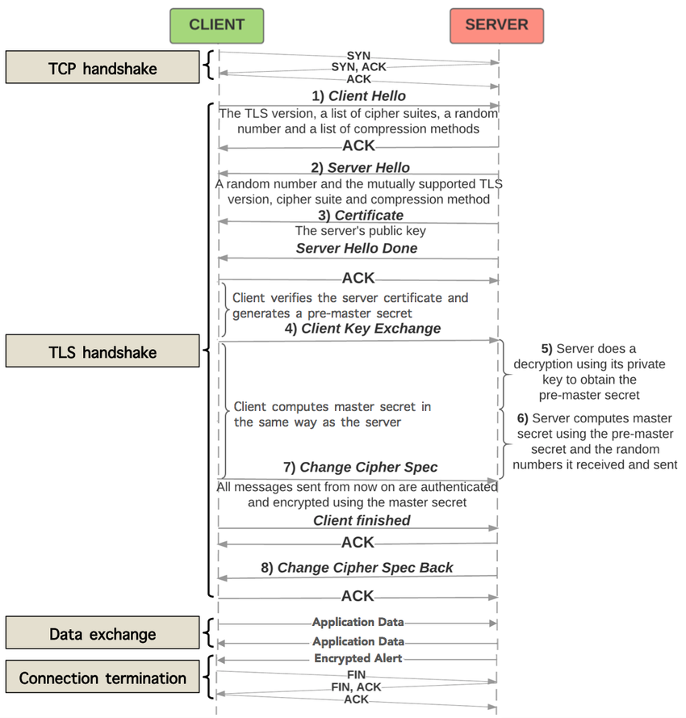
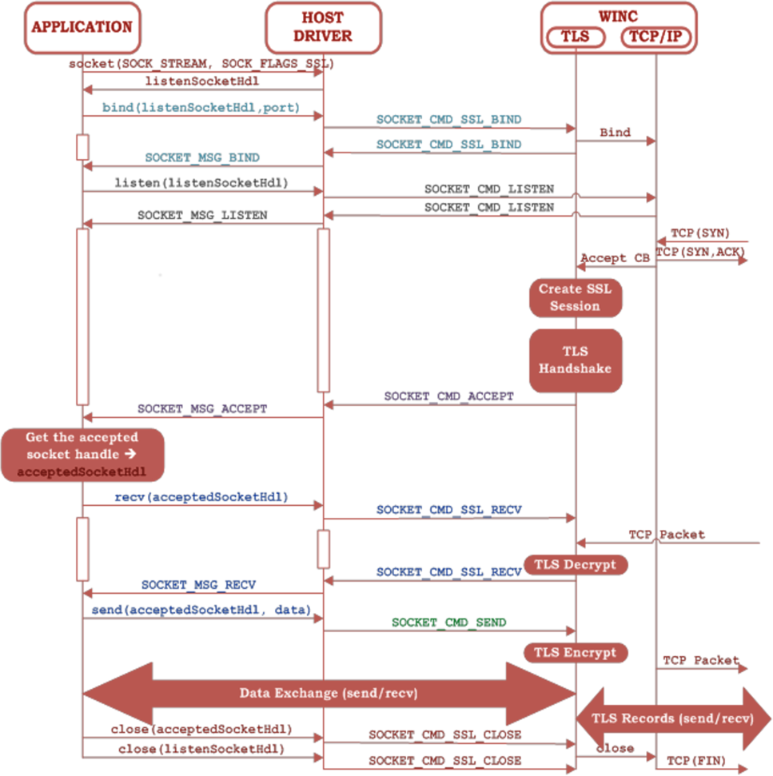

<link rel="stylesheet" type="text/css" href="styles.css">

# 4 Semester

## ## 29 01 2024

### ### IoT

- esp32
- DHT Digital Humidity and Temperature.

with the ESP32. The ESP32 is a popular low-cost, low-power system-on-a-chip (SoC) microcontroller with integrated Wi-Fi and Bluetooth capabilities. It is developed by Espressif Systems, a company based in Shanghai, China. The ESP32 is widely used in various IoT (Internet of Things) applications, embedded systems, and projects where wireless communication is essential.

**Espressif Systems Processor**!

        // Bibliothek für Temperatur- und Luftfeuchtigkeitssensor KY-015

        #include "DHT.h"

        // Input PINs
        #define DHTPIN 22

        // DHT22 will be initialized here
        #define DHTTYPE DHT22 // DHT22
        DHT dht(DHTPIN, DHTTYPE);

        void setup() {

        // DHT22 Mearsurement will be started
        dht.begin();

        }

        void loop() {

        Serial.begin(115200);

        Serial.println("---------Temperatur und Luftfeuchtigkeit (DHT22) ----------");

        // Measurement of humidity
        float h = dht.readHumidity();
        // Measurement of temperature
        float t1 = dht.readTemperature();

        // The measurements will be tested of errors here
        // If an error is detected, an error message will be displayed
        if (isnan(h) || isnan(t1)) {
        Serial.println("Error while reading the sensor");
        return;
        }
        // Output at the serial console
        Serial.print("Luftfeuchtigkeit: ");
        Serial.print(h);
        Serial.print(" %\t");
        Serial.print("Temperatur: ");
        Serial.print(t1);
        Serial.print(char(186)); //Output <°> symbol
        Serial.println("C ");
        Serial.println("-----------------------------------------------------------");
        Serial.println(" ");

        // 60 Sekunden Warten
        delay(60000);

        }

## ## 1 2 2024

### ### pog

**gamma.app** benutzen

[3cx](https://www.3cx.de/) lernen

## 5 2 2024

### iot

ultraschale sensor

braucht 5 volt
triger und echo

ssid FRTZ!Box Fon WLAN 7390  
passeord 3734033917067700  
mqtt server 192.168.13.137

range topic m1016gmjs/Fuellstand
time topic m1016gmjs/time

pussubclient installieren von ide

## ## 6 2 2024

### ### Sequenzdiagram

synchron erwartet eine Antwort
asynchron erwartet keine Antwort

## ## 8 2 2024

### ### Pog

#### #### mehr info zu Dokumentation

kopie eins zu eins von Antrag ist gut

aus der Frau Lukas, unterlagen können wir löschen was wir nicht brauchen, zbp Risiko

die Seite von Herrn Pog geschickt:  
https://it-berufe-podcast.de/vorbereitung-auf-die-ihk-abschlusspruefung-der-it-berufe/beispiele-fuer-ihk-abschlussprojekte-in-den-it-berufen/

hinzufuegen: lohnnebenkosten der arbeitsgeber

ablauf plan ganntdiagramm ist gut bewerten oder eion n netzplan

sollist vergleicht fuellt eine ganze seite

Einweichung anpassung weglassen

schrift 10 12
line anstand 1 bis 1,5

## ## 12 2 2024

### ### sle

#### #### Asymetrische Kryptographie

**TLS** : Transport Layer Security  
**PKI** : public key infrastructure  
**SSL**: Secure Sockets Layer  
TLS (Transport Layer Security) ist der Nachfolger von SSL.

&nbsp;

- Symmetrisch
- Asymmetrisch
- Hybrid

##### ##### Problem

unsicherer Kanal
Symetrischer Schlüssel gefährdet

##### ##### Lösung

Asymmetrische Verschlüsselung
Öffentlicher Schlüssel: versschlüsseln
Privater Schlüssel: entschlüsseln

##### ##### Nachteil

Rechenaufwändig, langsamer als symmetrische Verschlüsselung  
&nbsp;  
**Diffie Hellman Merkle Schlüssel Austausch**  
&nbsp;  

Vereinbarung eines gemeinsamen geheimen Schlüssels über eine abhörbare Leitung mit dem **Diffie-Hellman-Merkle-Schlüsselaustausch**  
&nbsp;  
**Rivest Shamir Adelman**

Asymmetrische Kryptogrsystem

&nbsp;

**Certificat**: aussstelklungdatum, aussteller, name, signature
**öffentlische Schuessel**: ein sehr langezeichenkette
**fingerabdruck**

### ### iot

**"Baud"** is a unit of measurement used to describe the speed of data transmission over a communication channel. It represents the number of signal or symbol changes that occur per second. Originally, baud rate referred to the number of signaling events (such as voltage or frequency changes) per second in a communication channel. However, with the advent of more complex modulation schemes, baud rate is not always equivalent to bits per second (bps).

## ## 13 2 2024

### ### Pog

#### #### Zustandsdiagramm

Ein Object hat unterschiedliche Zustand

## ## 13 2 2024

### ### Pog

#### #### PAP ProgrammAblaufPlan

## ## 19 2 2024

### ### iot

PHP MY ADMIN
http://192.168.13.173/
ITMO2202
ITMO2202!

node red:

http://192.168.13.173:1910/

## ## 21 2 2024

### ### sle

#### #### TLS HANDSHAKE

PMS: pre-master secret

delfie hellman VS RSA

##### ##### TLS sequenz diagramm

participant Client
participant Server

        Client -> Server: ClientHello
        Server -> Client: ServerHello, Certificate, ServerKeyExchange, ServerHelloDone
        Client -> Server: ClientKeyExchange, ChangeCipherSpec, Finished
        Server -> Client: ChangeCipherSpec, Finished

**ClientHello**: The client sends a ClientHello message to the server, indicating its supported TLS versions, encryption algorithms, and other parameters.

**ServerHello**, Certificate, ServerKeyExchange, ServerHelloDone: In response to the ClientHello, the server sends a ServerHello message, along with its certificate (if required), the ServerKeyExchange message (if needed), and a ServerHelloDone message to indicate it has finished the initial handshake.

**ClientKeyExchange**, ChangeCipherSpec, Finished: The client processes the ServerHello and, if necessary, sends a ClientKeyExchange message to establish the pre-master secret. Then, it sends a ChangeCipherSpec message to indicate it will start encrypting messages with the negotiated parameters. Finally, it sends a Finished message to confirm that the handshake is complete.

**ChangeCipherSpec**, Finished: Upon receiving the ChangeCipherSpec message from the client, the server switches to the agreed-upon encryption parameters. It then sends its own ChangeCipherSpec message and a Finished message to confirm the completion of the handshake from its end.

##### ##### activity diagram illustrating the steps involved in a TLS handshake.

Initiate TLS Handshake
ClientHello: Client sends a hello message to the server, including supported cryptographic algorithms and options.
ServerHello: Server responds with its own hello message, including selected cryptographic algorithms and options.
Certificate Exchange: Server sends its certificate to the client for authentication.
Key Exchange: Server sends key information to the client to establish encryption parameters.
ClientKeyExchange: Client generates a premaster secret and encrypts it using the server's public key, sending it back to the server.
ChangeCipherSpec: Both client and server inform each other that subsequent messages will be encrypted.
Finished: Both client and server exchange messages to confirm that the handshake is complete and the connection is secure.

Activity diagram for certificate validation in Firefox

**RSA** is used for **asymmetric encryption** and digital signatures, allowing for secure key exchange and authentication. In the context of TLS, RSA is commonly used for encrypting and decrypting session keys during the handshake process, as well as for authenticating the identities of the server and, optionally, the client.&nbsp;  
&nbsp;  
Diffie-Hellman, on the other hand, is a key exchange algorithm that allows two parties to securely establish a shared secret over an insecure channel. This shared secret can then be used to derive session keys for symmetric encryption, ensuring confidentiality of communication.&nbsp;  
&nbsp;  
In summary, while RSA is primarily used for encryption and authentication, Diffie-Hellman is used for secure key exchange without needing to transmit secret keys over the network.  
&nbsp;  
In asymmetric cryptography, different keys are used for encryption and decryption. In RSA, a public key is used for encryption and a corresponding private key is used for decryption. Similarly, in Diffie-Hellman, each party generates a public-private key pair, and the public keys are exchanged to establish a shared secret, which is used for encryption and decryption.  
&nbsp;  
The main advantage of asymmetric cryptography is that it enables secure communication without the need for prior exchange of secret keys.

- private key
- public key
- certificate
- signature

**UEBUNG**

- create key
- create certificat
- signature algorytm md5 or sha256

PKCS stands for "Public Key Cryptography Standards." It is a set of standards defined by RSA Laboratories that facilitate secure communication and data exchange using public key cryptography. PKCS standards cover various aspects of public key cryptography, including encryption, digital signatures, certificate formats, and key management.&nbsp;  
&nbsp;

Some commonly used PKCS standards include:

PKCS #1: Defines the RSA Cryptography Standard, which includes specifications for RSA encryption, digital signatures, and key exchange.&nbsp;  
&nbsp;

PKCS #7: Specifies the Cryptographic Message Syntax (CMS), which is a standard for creating digitally signed or encrypted messages.&nbsp;  
&nbsp;

PKCS #10: Defines the Certificate Signing Request (CSR) format, which is used to request digital certificates from Certificate Authorities (CAs).&nbsp;
&nbsp;

PKCS #12: Specifies a file format for storing and transporting cryptographic keys and certificates securely, often used for storing private keys, public keys, and certificates in a single encrypted file.
