

# Magnetische Speicherung

## 1 Bandlaufwerke

## 2 Gliederung

- Speicherhierarchie
- Funktionsprinzip
- Aufzeichnungsarten
- Schreibmethoden
- Standards

## 3 Speicherhierarchie

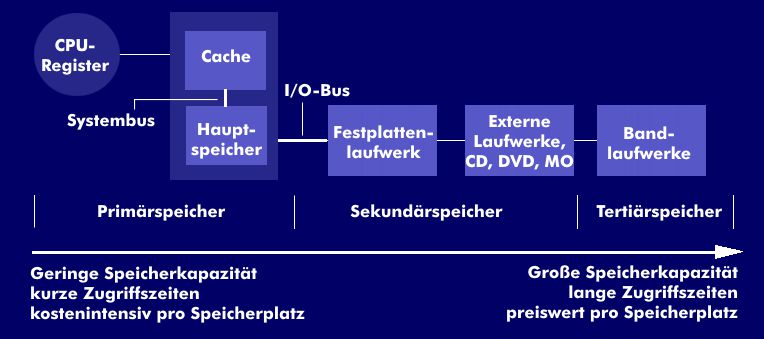

## 4 Aufbau und Funktionsprinzip

- Antrieb f. 2 Spulen
- Aufnahme-/Wiedergabekopf
- Löschkopf
- Daten werden seriell geschrieben und gelesen
- Speicherkapazität ist abhängig von Bandlänge und Standard
- Cartridge –> eine Bandspule
- Kassette –> zwei Bandspulen
- Kapazität bis Peta-Byte (Pebi-)

## 5 Aufzeichnungsarten Standards

- Standards: z. B. AIT[^1], QIC[^2], DAT[^3], DCC[^4], DDS[^5], SLR[^6], DLT[^7], FSK[^8], LTO[^9], VXA[^10]
- Aufzeichnungsarten
  - Lineare Aufzeichnung
  - Schrägspuraufzeichnung
  - Degressive Aufzeichnung
  - Mehrspurige Aufzeichnung
    [^1]: AIT Advanced Intelligent Tape ist ein Magnetband-System zur Datenspeicherung.
    [^2]: QIC Quarter-inch cartridge is a magnetic tape data storage format introduced by 3M in 1972,[1] with derivatives still in use as of 2016.
    [^3]: DAT Digital Audio Tape ist ein digitales Audio-Magnetband (Tonband) für entsprechende Audiorekorder.
    [^4]: DCC Digital Compact Cassette is a magnetic tape sound recording format introduced by Philips and Matsushita Electric in late 1992
    [^5]: DDS Digital Data Storage is a computer data storage technology that is based upon the Digital Audio Tape (DAT) format that was developed during the 1980s.
    [^6]: SLR Scalable Linear Recording is the name used by Tandberg Data for its line of QIC based tape drives.
    [^7]: DLT Digital Linear Tape previously called CompacTape) is a magnetic-tape data storage technology developed by Digital Equipment Corporation
    [^8]: FSK ????
    [^9]: LTO Linear Tape-Open echnology originally developed in the late 1990s as an open standards alternative to the proprietary magnetic tape formats that were available at the time.
    [^10]: VXA is a tape backup format originally created by Ecrix and now owned by Tandberg Data.

## 6 Schreibmethoden

- Start-Stopp-Verfahren (selten)

  - Einzelne Datenblöcke
  - Aufzeichnung fordert bestimmte Geschwindigkeit am Magnetkopf – Startphase
  - Stopp, Klüfte oder Interblock-Gaps

- Streaming
  - Kontinuierlich, schneller
  - Band und Geräte werden geschont

## 7 Standards DAT[^3]

- DAT[^3] – Digital Audio Tape

  - Nachfolger d. Audiokassette
  - Höhere Qualität der Audio-CD
  - Tonstudios, Sicherungsmedium

- 4 mm breites Mag.-Band
- Abtastrate 48 kHz, 44,1 kHz, 21 kHz, Sampletiefe 16 Bit (z. B. Datenrate 1,536 Mbit/s)
- 4 – 320 GiB
- Schrägspurverfahren < 6 MB/s
- Keine Streamerbänder (Media Recognition System(MRS[^11]),Streifencode)
  [^11]: MRS Media Recognition System

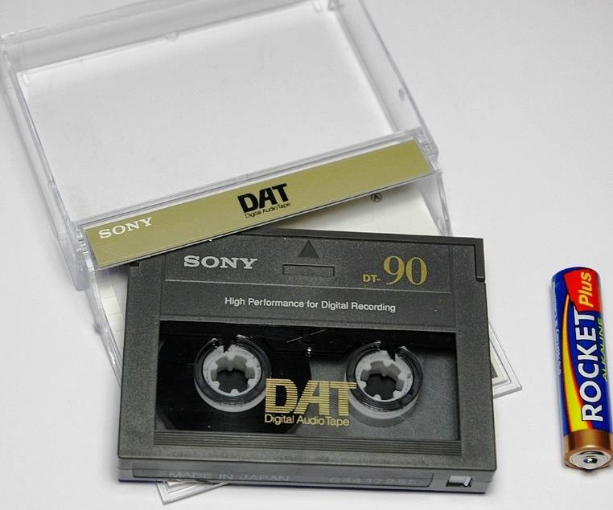

## 8 Entwicklung DAT[^3]

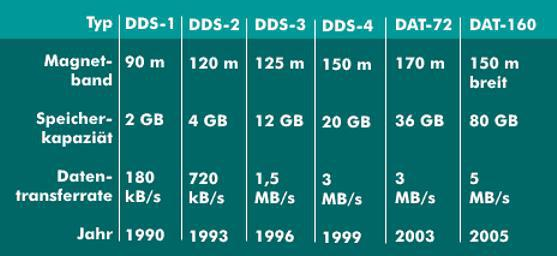

DDS[^5] Digital Data Storage

## 9 Standards DDS[^5] 1/2

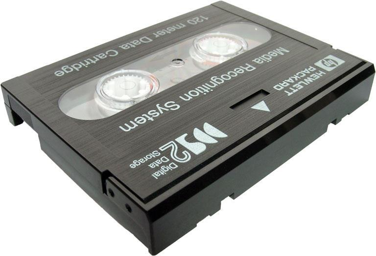

- DDS[^5] - Digital Data Storage
- Pro. Einsatz Datensicherung
- Schrägspurverfahren
- 4 u. 8 mm Bänder
- Verbesserte Störeigenschaften
- Geringere Bitfehlerrate
  (BER[^12])
  [^12]: BER Bit error rate is the number of received bits of a data stream over a communication channel that have been altered due to noise, interference, distortion or bit synchronization errors.

## 10 Standards DDS[^5] 2/2

| -           | Bandlänge   | Speicherkapazit | Transferrateät  |
| ----------- | ----------- | --------------- | --------------- |
| DDS[^5]-1   | 60 m / 90 m | 1,2 GB / 2 GB   | 183 – 366 kB/s  |
| DDS[^5]-2   | 120 m       | 4 GB            | 350 – 750 kB/s  |
| DDS[^5]-3   | 125 m       | 12 – 24 GB      | 1 – 1,5 MB/s    |
| DDS[^5]-4   | 150 m       | 20/40 GB        | 1 – 3 MB/s      |
| DDS[^5]-5   | 170 m       | 72 GB           | 3 MB/s          |
| DDS[^5]-6\* | 150 m       | 80/160 GB       | 6,9 – 13,8 MB/s |
| DDS[^5]-7   | 153 m       | 160 GB          | -               |

\*lesen/schreiben bidirektional

25 – 100 Benutzerzyklen

## 11 12 Standards DLT[^7]

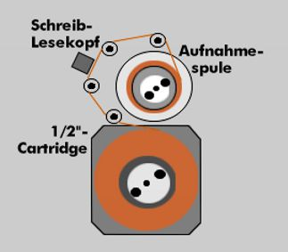

- DLT[^7] - Digital Linear Tape
- Midrange-Bereich und bei PCServern im High-End-Bereich
- Speicherung d. Daten in Blöcken fester Größe im Längsspurverfahren
- Fehlererkennung: Paritätsprüfung, zyklischer Blockprüfung, EDC
- Speicherkapazität: 40/70/80 GB, 10 MB/s
- Lebensdauer Magnetköpfe bis 30.000 h, 500.000 Banddurchläufe

## 13 Entwicklung DLT[^7]

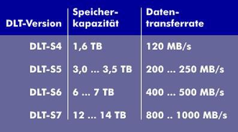

## 14 Standards SDLT

- SDLT – Super DLT[^7] Digital Linear Tape
- Speicherkapazität 1,6 TB; 120 MB/s
- 10 TB und 800 – 1.000 MB/s in Planung

## 15 Standards LTO[^9]

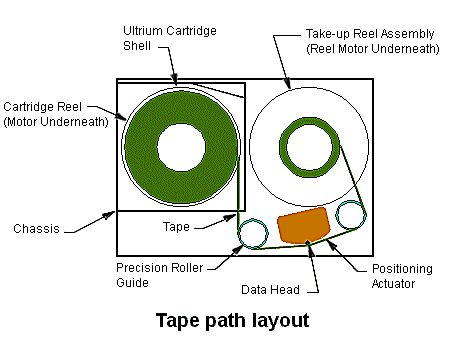

- Digitale Bandlaufwerke für mittlere Datentechnik
- Längsspurverfahren
- ½“ Cartridges
- 100 – 400 GB, 20 – 750 MB
- Bibliotheken >mehrere TB
- EDC und Kompression
- Außer LTO[^9]-3 wird die WORM-Technik unterstützt
- Ab LTO[^9]-5 LTFS[^13]-Technologie, ähnliche FAT
  [^13]:LTFS Linear Tape File System

## 16 Entwicklung LTO[^9]

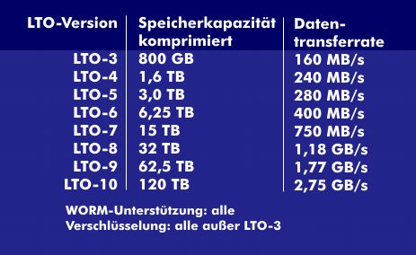

## 17 Tape Library (Jukebox)

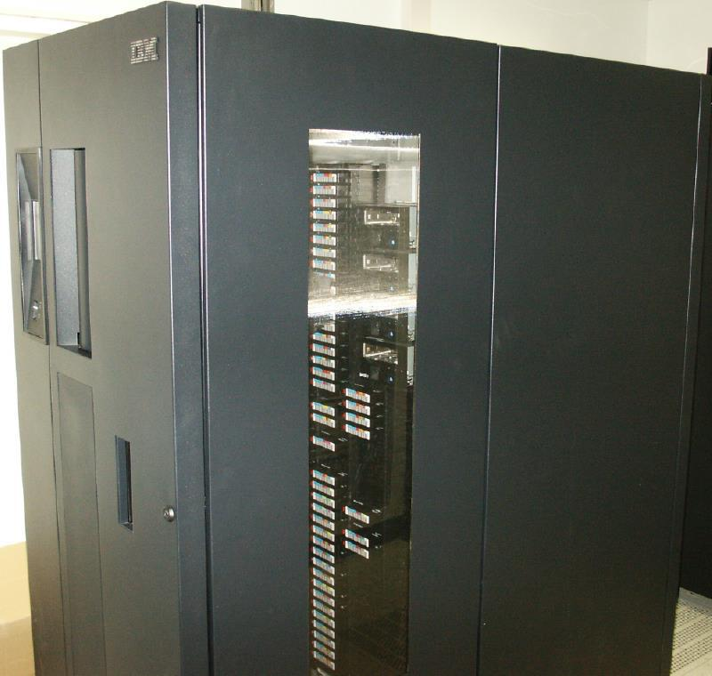
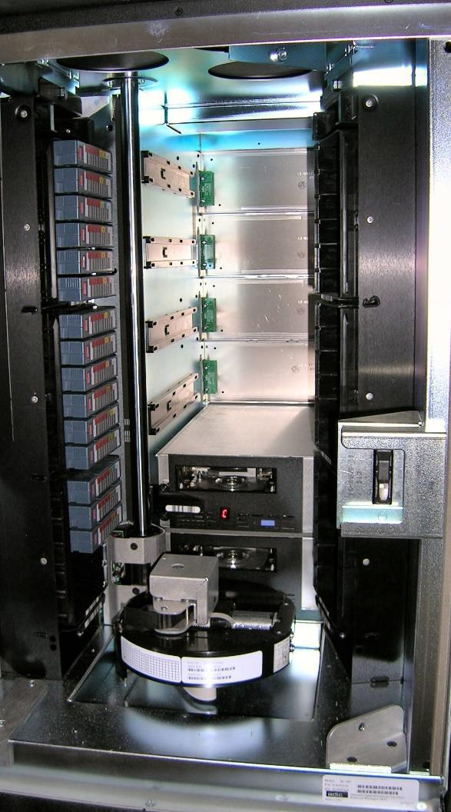

## 18 Tape Silo

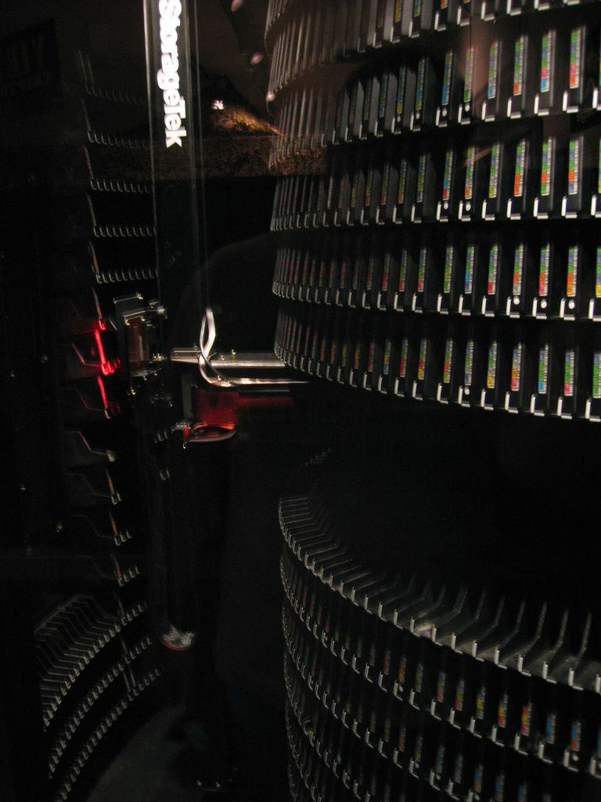

## 19 Lernzielkontrolle

- Welche Vorteile bietet die Magnetbandaufzeichnung?
- Erläutern Sie die Aufzeichnung von Daten auf einem Magnetband?
- Was verstehen Sie unter einem Magnetkopf für Schreiben, Lesen und Löschen?
- Nennen Sie verschiedene Typen der Datenaufzeichnung auf Magnetband!
- Welche verschiedenen Kassettensysteme (Streamerkassetten) gibt es?
- Was verstehen Sie unter einer Band-Kassette?
- Was verstehen Sie unter einer Cartridge?
- Was verstehen Sie unter Linearer Aufzeichnung?
- Was verstehen Sie unter dem Schrägspurverfahren?
- Was verstehen Sie unter Start-Stop-Betrieb?
- Was verstehen Sie unter Streaming?
- Was verstehen Sie unter WORM-Technik?
- Was verstehen Sie unter einer Tapelibrary?
