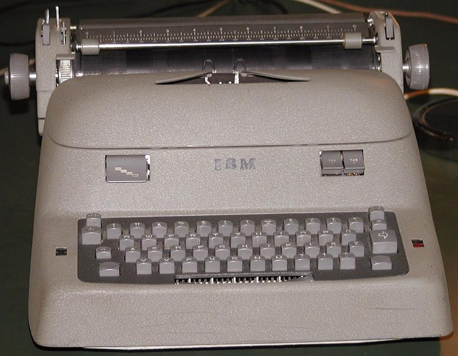
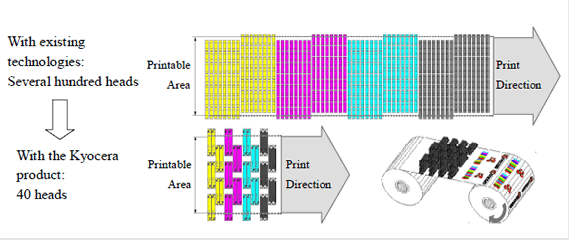
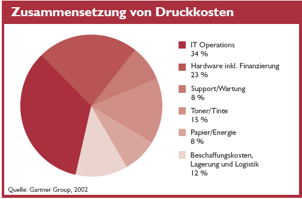
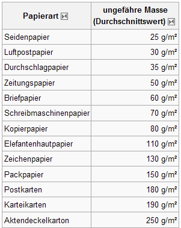

# Drucker

Eine Übersicht oder, wie kommt die Information auf das Papier

## 2 Gliederung

- Geschichte
- Klassifizierung der Drucker
- Zeichengestaltung und Farben
- Druckverfahren
  - Nadel
  - Tinte
  - Xerox
  - …

## 3 Geschichte Schreibmaschine

| Schreibmaschine Peter Mitterhofer 1864 | Hansen Writing Ball 1865 |
| -------------------------------------- | ------------------------ |
|                  |    |

## 4 Geschichte Schreibmaschine

| Wanderer „Continental“ Schreibmaschine | IBM-Schreibmaschine    |
| -------------------------------------- | ---------------------- |
|                  |  |

## 5 Geschichte Drucker

| -                      | -                      | -                      |
| ---------------------- | ---------------------- | ---------------------- |
|  |  |  |

## 6 Geschichte Drucker

| - | - |
| -------------------------------------- | ------------------------ |
|                  |    |
|                  |    |

## 7 Klassifizierung Drucker
 

## 8 Klassifizierung Zusammenfassung

- Einsatzbereich
- Druckmedien
- Druckerstellung
- Druckfähigkeit
- Druckverfahren
- Zeichengestaltung
- Drucktechnologie

## 9 Kriterien für die Druckerauswahl

- Treiber, Betriebssystem
- Schnittstellen
- Anschaffungskosten
- Folgekosten
  - Tinte/Toner
  - Druckkopf
  - Strom
  - Papier
- Farbe/S-W
- Qualität (Farben,
  Auflösung)
- Geschwindigkeit
- Auslastung/Druckvolumen
- Kombigerät?
- Formate
- Umweltschutz
- Platzbedarf
- Bedruckstoff
- Haltbarkeit (UV, Feuchtigkeit…)

## 10 Seitenbeschreibungssprache

Die Umwandlung in die gerasterte Druckausgabe auf dem Drucker erfolgt über den
**Raster Image Processor**.

## 11 Druckersprachen

Seitenbeschreibungssprachen
Page Description Languages (PDL)
Printer Control Languages (PCL)

Programmiersprache zur Ansteuerung von Druckern

## 12 Protokolle

**WIN**
Remote Desktop Protocol
(RDP)

**Linux**
Line Printer Remote
(LPR)
Internet Printing Protocol
(IPP)
Independent Computing Architecture
(ICA)

 

## 13 Erstellen der Rasterdaten

PC
Anwendung
Host-BasedDrucker
GDI
Druckertreiber/RIP
Druckerdaten
PS-Drucker
PC
Anwendung
GDI
Gener. PS-Treiber
PS-Daten
PC
Anwendung
Druckertreiber
RIP
Belichtereinheit
GDI
RIP-Server

## 14 Zeichengestaltung

## 15 Matrixdruck

- Zeichen werden als Grafik verstanden
- Vertikale und horizontale Erstellung der Zeichen und Grafiken

## 16 Matrixdruck

Prinzip des Matrixstempels  
9x9 Matrix

Druckkopfschritte

Punktmatrix

## 17 Matrixdruck Druckverbesserung

Dithering

RET[^1] Resolution Enhancement Technology

[^1]: RET Resolution Enhancement Technology

## 18 Aufbau Nadeldrucker

## 19 Nadeldrucker Druckkopf

## 20 Shuttle-Matrixdrucker

Shuttle-Matrix-Drucker sind ebenfalls Zeilendrucker und arbeiten mit einem Matrix-Kamm.

## 21 Vergleich Matrixdrucker

## 22 Tintendruckverfahren

(seit über 50 Jahren)
|Continuous flow|Drop on Demand|
|------|-------|
|||

## 23 CIJ[^2]

### Continuous Ink Jet, Tintenstrahl
bis zu einer Million (!) Tropfen pro Sekunde ausstoßen, je nach Düsengeometrie sind sie nur wenige Mikrometer groß und fliegen mit bis
zu 40 m/s

[^2]: CIJ Continuous Ink Jet,
Tintenstrahl

## 24 Continuos Flow

**Oszillomink** von Siemens-Elema, der erste Tintenstrahler, heute vor allem noch in EKG-Geräten genutzt, kein Text und Grafik

## 25 Continuos Flow

|-|-|
|-----|-----|
|||
|||
Inkjet-Drucker "Compactline 2.5" zum
Beschriften der Kartons

## 26 Unterschiedliche
Oberflächen Ideal eignen sich diese Drucker nämlich dazu, fast beliebige Oberflächen und Gegenstände zu  markieren und zu kodieren.

## 27 Drop on Demand

|Thermal InkJet|Piezo InkJet|
|-----|-----|
|||

## 28 Steuerung v. Tröpfchengröße und Menge

Tintenportionierung: Durch zwei Heizelemente in den Düsenkanälen lassen sich  unterschiedlich große Tröpfchen generieren.
(z. B. RET)

|-|-|
|-----|-----|
|||

## 29 Tinte und Papier

**Normalpapier**

„Normalpapier
(80-90 g/m2 im Format DIN A4) “
kann Tinte nicht vollständig
aufnehmen, Es wellt sich an den Überlappungsstellen

**Spezialpapier**

Bei Grafiken und fotorealistischen Ausdrucken muss das Papier oft die sechs- bis achtfache Tintenmenge aufnehmen wie beim Textdruck.

## 30 Dichte Düsen, dünne Tinte, tiefes Schwarz, mehr Farben für Fotodruck

Canon Pixma iP5200:
Druckkopf enthält sechs Düsenspalten mit den Farben Cyan, Magenta, Gelb, Magenta, Cyan und Schwarz. Zweite hohe Düsenspalte versprüht pigmentiertes Schwarz für schnellen Textdruck.

## 31 Adressing?!

## 32 Tintenpatronen mit Chip

„verdongel“ der Füllstandsanzeige

## 33Integrierte Reinigung

## 34 Großformat und High End

Großformatdrucker für Poster, CAD und Proofen

## 35 Tintendrucker oder?

## 36 Memjet-Technologie

## 37 Memjet-Technologie

- Memjet-Technologie, Druckkopf besteht aus einer durchgehenden Reihe von 2 cm breiten Chips
- 6.400 Düsen pro Chip
- Tintentröpfchen: mit einer Größe von nur gut
- 1 Pikoliter (= 0,000000000001 Liter)
- Druckkopf besteht aus 5 Chips bei einer Papierbreite von 10 cm (für 10x15cm-Fotos) rund 32.000 Düsen
- bei einem A4-Drucker (Papierbreite: 21 cm) bräuchte man einen Druckkopf mit 11 Chips, dann mit 74.400 Düsen

## 38 Memjet-Technologie

Die Ansteuerung des Druckkopfes und der einzelnen Chips soll bei der Memjet-Technologie ein spezieller Steuerbaustein übernehmen, der in der Lage sein soll, bis zu 900 Millionen Druckpunkte pro Sekunde zu berechnen. Aus den vielen Druckpunkten soll dann ein Bild bzw. Ausdruck mit einer maximalen Druckauflösung von 1.600 x 1.600 dpi entstehen - und das bei einer Druckgeschwindigkeit von bis zu 30 Seiten pro Minute bei Fotos im typischen 10x15cm-Format (60 Seiten/min bei Dokumenten im A4-Format und 90 Seiten/min in EntwurfsQualität).

## 39 Tintendrucker druckt 1.000 A4-Seiten pro Minute

Kyocera entwickelt schnellen Druckkopf mit hoher Auflösung

Der KJ4 beherbergt 2.656 Düsen und kann neben UV- auch pigmentierte Tinten verarbeiten und erzielt variable Tintentropfenvolumen zwischen 4 und 21 Picolitern. Die Druckbreite des Kopfes liegt bei 108 Millimetern.

## 40 Memjet-Technologie
Für eine Papierbreite von 50 cm, benötigt man für die drei Grundfarben und Schwarz zusammengenommen 40 Druckköpfe, die hintereinander angeordnet sind.

## 41 MJP600 High End

Printing-Speed 50 m/min, 600 dpi x 600 dpi

## 42 Die Tinte macht es!

- Wasserbasierende Tinten
- Pigmenttinten
- Lösemittelbasierende Tinten
- UV-härtende Tinten
- Sublimationstinten
- Textildrucktinten
- Gel-Tinten

## 43 Ricoh druckt mit Gel

- Auflösung von 1.200 dpi
- Seitenpreise für Farbseiten 9 -11 Cent
- S/W-Kartuschen für 1.450 Seiten bzw. 2.900 Seiten
- Farbige Einheiten kommen mit Kapazitäten für 1.150 und 2.300 Seiten
- G500 kostet rund 380 Euro, der G700 wird für 520 Euro angeboten

## 44 Pigment-ReactionTechnologie (PgR)

- Canon-Tintendrucker
  beschichtet Normalpapier
  vor der Fotoausgabe
- Canons neues
  Multifunktionsgerät
  Pixma MX7600 soll mit
  transparenter
  Beschichtungsflüssigkeit
  den Fotodruck
  verbessern
- Ab 4/2008 für 399 Euro

## 45 High-End-Farbdrucker
mit 8 Tinten

## 46 Kartuschen & Preise

## 47 Phase-ChangeVerfahren (Solid Ink)

- Solid-Ink-Drucker
  (Festtintendrucker)
- feste Farbstifte statt flüssige
  Tinte
- Abschmelzen durch
  Heizelemente (flüssige Tinte
  entsteht)
- Aufbringen der Tinte durch die
  andere Verfahren (Bubble-Jet,
  Piezo)
- sehr gute Druckqualität auf
  Normalpapier (Tinte wird schnell
  fest)

## 48 Phase-ChangeVerfahren (Solid Ink)

## 49 Phase-ChangeVerfahren (Solid Ink)

## 50 Phase-ChangeVerfahren (Solid Ink)

## 51 Phase-ChangeVerfahren (Solid Ink)

## 52 Phase-ChangeVerfahren (Solid Ink)

## 53 Phase-ChangeVerfahren (Solid Ink)

## 54 Phase-ChangeVerfahren (Solid Ink)

- Vorteil: Der Druckkopf
  bewegt sich nicht wie
  bei Tintendruckern über
  die Papierbreite hin
- und her, sondern nimmt
  die ganze Papierbreite
  ein und kann so sehr
  schnell und leise
  drucken
- Inkstix: Ist die Farbe der
  Festtintendrucker und
  können im Betrieb
- nachgelegt werden

## 55Drucker mit Wachstinte

ca. 1200 €

 

## 56Tintenloser Druck?

-

-

Zink-Papier, drei übereinanderliegende
Emulsionsschichten aus Kristallen der
Grundfarben der subtraktiven Lichtmischung:
Gelb, Magenta und Cyan
Aktivierung der Farbpigmente erfolgt durch
thermische Impulse unterschiedlicher
Temperatur und Einwirkdauer
weiße Kristalle werden in ihrer Wirkfarbe
verändert

-

-
-
-
-
-
-

Schichtreihenfolge
Gelbe Emulsion
(aktiviert durch kurzen Hitzeimpuls von 200 °C)
Magenta Emulsion
(aktiviert durch mittleren Hitzeimpuls von 150 °C)
Transparente Trägerschicht
Cyan Emulsion
(aktiviert durch längeren Hitzeimpuls von 100 °C)
Grundträger, weiß (PVC?)
Klebebeschichtung
Abdeckpapier

## 57 Geräte und Papier
Tintenloser PolaroidDrucker mit ZINKSpezialpapier 39,99 €

Der C81 ist ein direkter
thermischer Farbplotter von
Grund auf für den Betrieb im
schwierigen Umfeld eines
Logging-LKW oder OffshorePlattform entwickelt.

Polaroid GL10 Bluetooth
Digitaler Fotodrucker mit
ZINK Zero Ink-Technologie +
Polaroid ZINK 7.6 x 10.2 cm
(3 x 4 Zoll) Fotopapier für den
GL10 Drucker -
70 Stück Packung 164,99 €

Papier 70 Blatt 50 x 70,2
12,90 - 26,61 €

Polaroid Two Digitalkamera (5
Megapixel, 4-fach digit. Zoom,
7,6 cm (3 Zoll) Display)
155,99 €

## 58 Thermodrucker

- Thermoreaktionsdrucker
- Thermosublimationsdrucker
- Thermotransferdrucker

## 59 Thermodrucker

## 60 Thermoreaktions(direkt)-drucker

- Anordnung der
  Heizplättchen wie bei
  Nadeldrucker
- benötigt
  wärmeempfindliches
  Spezialpapier
- Papier verfärbt sich an
  den erwärmten Stellen
- prinzipbedingt nur als
  Schwarz-Weiß-Drucker

## 61 Thermoreaktions(direkt)-drucker

## 62 Thermoreaktions-(direkt)drucker
Einsatzbereiche

- Barcode-, Typen- und Inventarschilder für den Innenund Außeneinsatz
- Schilder für Produkte mit langer Haltbarkeit
- Schaltschrank- und Gerätekennzeichnung
- Schilder für Materialfluss und Inhaltskennzeichnung
  (auch Fleischkennzeichnung)
- Etiketten für Textilbereiche
- Warnhinweise
- Registrierkassen und früher auch in Faxgeräten

## 63 Thermotransferdruck

## 64 Zeilenweiser
Thermodruck

als Thermokamm

## 65 Folien

## 66 Thermotransferdrucker

- auch Thermalprinter
  genannt
- Einsatz sehr häufig beim
  Druck von Belegen,
  Typenschildern, Lageretiket
  ten, langlebigen Paket- und
  Produktauszeichnungen
- können Papier, PE-, PET-,
  PVC- Folien und viele
  andere Materialien
  bedrucken

## 67 Thermosublimationsdrucker

-
-
-
-
-
-

Funktioniert größtenteils wie Thermotransferdrucker
benötigt Spezialpapier und Thermotransferrollen
Wachsbeschichtung der Transferrolle wird gasförmig
Farbe diffundiert in das Papier mittels chemischer Reaktion
ermöglicht fotorealistische Ausdrucke
hohe Verbrauchsmaterialkosten

## 68 Thermosublimationsdrucker
Einsatzgebiete

Sofortdruck über Mobiltelefon,
Speicherkarte, Digicams usw.
sehr populär bei kompakten
Photodruckern

Plastikkartendruck
Plastikkarten einund mehrfarbig
bedruckt und mit
Schutzschicht
versehen

## 69 Thermosublimationsdrucker
weitere Einsatzgebiete
Passbilddruck
Textildruck (z. B.: Warnwesten mit
mehrfarbigen Druck)

Fotostudios
z.B.: Präsentationsmappen in
der Architektur
oder Spezielle Kataloge

## 70 Thermosublimationsdrucker
Vorteile

- Extrem hohe Farbtreue
- gegenüber Umwelteinflüssen sehr widerstandsfähige
  Druckergebnisse durch Eindampfen der Farbe und
  zusätzliche Fixierschicht
- bei Geräten für Privatanwender sehr kompakte
  Ausmaße (Anschaffungskosten zwischen 80 - 500 €)
- gegenüber anderen Thermotransferdruckern
  (Verfahren) können Halbtöne unterscheiden (alle
  anderen müssen rastern, was die Auflösung
  herabsetzt)

## 71 Thermosublimationsdrucker
Nachteile

- sehr hohe Anschaffungskosten (Kommerziell)
  (150 € bis zu mehreren tausend)
- sehr hohe laufende Kosten durch Spezialpapier und spezielle
  Trägerfolien
- (2 - 3 € pro Seite)
- (25 - 30 € für das Papier) ein Band ca. 40 Bilder bei 10 x 15 cm

- hoher Energieverbrauch durch Heizelemente
- bei Druckvorgang wird immer nur eine Farbe aufgebracht, dadurch
  muss der Drucker das Spezialpapier mehrfach an exakt den
  gleichen Punkt zurückfahren, um Farbe aufzubringen, dadurch
  Druckverfahren sehr langsam
- sehr voluminöse und schwere Geräte für professionelle
  Anwendungen

## 72 Elektrophotografischer
Druck
Laser

LED

LCS

Ionen

Magnet

- Auch Xerographische Drucker
- Verschiedene Licht-Quellen:
- Laser, meist Laserdioden
- LED, 2400 einzeln ansteuerbare LED
- LCS, Liquid Crystal Shutter aus 2.400 Zellen

## 73 Entwicklung und Geschichte

- 22.10.1938 von Chester Carlson
- Begriff - Xerographie:
  trockenes Schreiben
- Kein chemischer Nassprozess -
  physikalischer Trockenprozess ohne
  feuchte chemische Zusätze
- sauber und trocken

## 74 Laser-/Leuchtdioden

Laser - Technik

LED - Technik

## 75 LED-Plotter (Drucker)

- Für Belichtung einer Zeile sind bei einer
  Auflösung
  von 300 dpi 2560 Leuchtdioden nötig;
- bei 6OOdpi -Zeile 5120 Leuchtdioden.

- Großformatdrucker - Laserdrucker
- 15 m/min Druckgeschwindigkeit
- LED-Drucker - A0 innerhalb weniger
  Sekunden
- Auch Bahnen bedruckbar
  (Rollenpapier)

## 76 Weitere Varianten

- LED-Drucker (Leuchtdiodenmatrix dient
  als Belichtungsquelle)
- LCS-Drucker (eine „liquid crystal“-Zeile
  dient als optischer Schalter vor einer
  Halogenröhre)

## 77 Aufbau
Aufbau eines s/wLaserdruckers:

0

1 - Elektronik
2 - Bildleitertrommel
3 - Tonereinheit
4 - Papiertransport,
Übertragung des
latenten Bildes
5 - Fixiereinheit
0 - Gehäuse

## 78 Funktion 1
Bildtrommel, dreht
sich im Uhrzeigersinn 
die Corona sorgt für die Aufladung der Trommel

## 79 Funktion 2
die Belichtereinheit ist durch ein Blech verdeckt, damit die Strahlung nicht nach außen dringt und kein Fremdlicht in die Belichterzone eindringt

## 80 Funktion 3

- 4 „Entwickler“,   pro Durchlauf nur einer   aktiv.
- Farbbild >>   4 Umdrehungen   notwendig -  oder
- 4 „Einheiten“ verfügbar   Das Papier wird über eine   Gummiband geführt. Positioniergenauigkeit
  

## 81 Funktion 4
Transfereinheit: Transfer-Trommel dreht sich gegen den Uhrzeigersinn. Auf ihr haftet das Papier und der Toner wird auf dieses übertragen. 

## 82 Funktion 5
Entladung, sowie Tonerreste entfernen  Fixierung des latenten Staubbildes

## 83 Funktion im Überblick

## 84 Bauteile

## 85 Baugruppen des Laserdruckers

## 86 Tonerführung

## 87 Xerox-Drucker

Color

Monochrom

Revolver
(Fuor pass)

Inline
(Single pass)

## 88 Revolversystem

## 89 In-line-System

## 90 In-line-System

## 91 PrismenlaserTechnology

kombiniert die kompakte Bauweise der Revolvertechnik mit der Schnelligkeit der Inline-Technik

## 92 Laserdrucker mit Photoband nach In-line-Prinzip

## 93 Farb-Laserdrucker im Detail

## 94 Transferband

Belichtertrommel

Tonerkassetten

## 95 Druckerfolgekosten

## 96 Einfache IT-Systeme
Belichter

Ausgabegeräte: Drucker

## 97 98 99 Belichtertrommel A4

Transferband

CMYK-Toner

Fixierer
Einfache IT-Systeme

Ausgabegeräte: Drucker

## 100 Rest-Tonerbehälter

Einfache IT-Systeme

Ausgabegeräte: Drucker

## 101 LED‘s stattLASER-Diode

Einfache IT-Systeme

Ausgabegeräte: Drucker

## 102 Ein S/W-Laser- oder -Tintenstrahldrucker kann nur schwarze
Punkte drucken
Dithern

Abbildung 1 zeigt, wie mit einer Matrix aus 4 x 4 Druckpunkten 17 Graustufen
(inkl. Weiß und Schwarz) dargestellt werden können
Einfache IT-Systeme

Ausgabegeräte: Drucker

## 103 LED-Drucker

Einfache IT-Systeme

Ausgabegeräte: Drucker

## 104 Bildtrommel: Der Laser schreibt darauf ein unsichtbares Bild. An den belichteten

Stellen bleibt der Toner haften.
Einfache IT-Systeme

Ausgabegeräte: Drucker

## 105 Fixierheinheit: Hier schmilzt der Drucker den noch losen Toner mittels Hitze
und Druck ins
Papier.

Einfache IT-Systeme

Ausgabegeräte: Drucker

## 106 Fixieroel: Damit werden die Fixierwalzen benetzt, damit der Toner auf dem Papier und
nicht an den Fixierwalzen haften bleibt.

Einfache IT-Systeme

Ausgabegeräte: Drucker

## 107 Die Übertragungswalze: Sie nimmt das komplette Bild mit
allen vier Grundfarben auf.

Einfache IT-Systeme

Ausgabegeräte: Drucker

## 108 Wegwerfbildtrommeln haben eine sehr
dünne organische fotosensitive Beschichtung
und verschleißen relativ schnell

semipermanente Bildtrommeln haben
eine dickere, organische, fotosensitive
Beschichtung und verschleißen weniger schnell.

permanente Bildtrommeln besitzen eine
sehr harte fotosensitive Beschichtung aus
amorphem Silizium oder eine dicke
organische Beschichtung

Einfache IT-Systeme

Ausgabegeräte: Drucker

## 109 Einfache IT-Systeme

Ausgabegeräte: Drucker

## 110 Einfache IT-Systeme

Ausgabegeräte: Drucker

## 111 Flächengewicht von Papier

Einfache IT-Systeme

Ausgabegeräte: Drucker

## 112 Druckkosten im Vergleich
Der Vergleich in der Tabelle zeigt, dass sich in einem mittelständischen Unternehmen auch ohne Vertragsbindung erheblich sparen lässt. Wir gehen dabei von einem Unternehmen mit 100 Mitarbeitern aus, die mit zehn Farblaserdruckern monatlich 100.000 Ausdrucke zu Papier bringen (85.000 Schwarz-Weiß- und 15.000 Farbseiten). Der Anschaffungspreis des Farblasers ist bereits im Seitenpreis enthalten. Kosten für Verbrauchsmaterial und Verschleißteile fließen über eine Laufzeit von 36 Monaten in die monatliche Rechnung respektive den Seitenpreis ein.  Einfache IT-Systeme 
Ausgabegeräte: Drucker

## 113 Einrichtung

- Seitendrucker
- Hoher eigener Arbeitsspeicher notwendig -   muss eine ganze Seite aufnehmen (mehrere   MByte)
- 2 Sprachen:   Adobe- PostScript und HP- PCL   (printer control languages)
- Treiber und meist eigenes ManagementProgramm (Treiber werden oft von Windows   „mitgebracht“ besser aktuelle aus Web)
- Netzwerk oder Lokal

## 114 Einsatzgebiete und Wartung 1

- Bei Toner- und Bauteilwechsel - Gerät mit   Spezialstaubsauger (mit Feinstaubfilter) reinigen
- Bildleitertrommel wenig dem Licht aussetzen und NICHT mit den Fingern berühren
- Nur sauberes Papier (!Umweltpapier!)
  verwenden, Transportwalzen verkleben durch   Papierstaub und müssen öfter gereinigt oder   ausgetauscht werden
- Papierstau nicht mit Gewalt oder gar falschem
  Werkzeug entfernen

## 115 Einsatzgebiete und Wartung 2

- Papier immer „richtig“ einlegen,   Pfeilrichtung beachten
- Papier darf keine Klammern oder andere   Fremdkörper haben
- Bei einseitig bedrucktem Papier, keine   Signatorfarben oder Offsetfarben

## 116 Einsatzgebiete und Wartung

- mögliche Gefahren
- Durch die Hochspannungsentladung
  entsteht Ozon
- Entstehung von Lösungsmitteldämpfen
  (Benzol und Styrol)
- Relativ hohe Temperatur des
  Trägermaterials (bis ca. 200 °C), Beispiele
- Feinstaub bei Toner- und Bildleiterwechsel

## 117 Einsatzgebiete und Wartung

- Bedruckbare Medien
- Papier mit einem Gewicht von mind.
  60 g/m² bis max. 150 g/m² - Probleme mit
  Fixierung
- Folien und Adressetiketten müssen (!)
  kopiertauglich, d. h. müssen die hohen
  Temperaturen in der Fixiereinheit
  aushalten
- Medien müssen (!) biegsam sein (keine zu
  schweren Pappen oder gar CD‘s)

## 118 „Erste Hilfe 1“

- Bei Toner-Kontakt mit der Haut, mit kaltem
  Wasser und Seife abwaschen
- Bei Toner-Kontakt mit den Augen, mit reichlich
  kaltem Wasser auswaschen und Arzt aufsuchen
- Bei Verschlucken, mindestens 300 - 500 ml
  kaltes Wasser zu trinken geben und Arzt
  aufsuchen
- Bei Einatmen, sofort an die frische Luft und Arzt
  aufsuchen

## 119 „Erste Hilfe 2“

- Tonerstäube stellen ein Explosionsrisiko dar. Bei
  Tonerstaubwolke, sofort alle Zündquellen
  löschen o. entfernen.
- Verschütteten Toner mit Spezial-Staubsauger
  aufnehmen (NICHT wegblasen!).
  Reste mit KALTEM Wasser wegwischen.
- Verbrauchte Toner und Bauelemente sind
  Sondermüll

## 120 Vorteile

- Gute Druckqualität - 1200 dpi
  (dots per inch, 1 Punkt ~20 µm )
- Hohe Druckgeschwindigkeit > 8 Seiten/min
- Drucke sind wasserfest und UV-beständig, kein
  „Ausbluten“ von Konturen
- Unempfindlich gegenüber verschiedenen Papiersorten
- Druckkosten sind meist erheblich geringer als bei
  Tintenstrahldruckern
- Lebenserwartung höher
- Lange Wartungsintervalle (kein Eintrocknen oder
  verstopfen) #

 ## 121 Nachteile

-
-
-
-
-
-
-
-

Geringerer Farbraum und härtere Kontraste
Fehlende Tiefenwirkung und Rasterung
Dunkles wird dunkler, Helles wird heller
Komplizierte Mechanik
Große Bauweise,
Nur bestimmte bedruckbare Medien
Hoher Energieverbrauch
Emission von Ozon, Feinstaub und Lösungsmitteln
Sinnvoll bei hohen Druckauflagen und langen
Druckpausen #

## 122 Lernzielkontrolle

-
-
-
-
-
-
-
-
-
-
-
-
-
-
-
-
-

Wie werden Drucker nach dem Druckverfahren unterschieden?
Wie werden Drucker nach der Zeichengestaltung unterschieden?
Was ist der Unterschied zwischen einem Seiten- und einem Zeilendrucker?
Wie werden „saubere“ Zeichen gedruckt?
Was verstehen Sie unter Dithering?
Was verstehen Sie unter Resolution Enhanced Technology?
Nennen Sie die 2 unterschiedlichen Tintenstrahldrucktechnologien!
Was verstehen Sie unter Duplexeinrichtung?
Nennen Sie 3 gebräuchliche Xerox-Drucktechnologien. Wie unterscheiden sie sich?
Beschriften Sie die Bestandteile eines Xeroxdruckers in der Abbildung!
Bringen Sie die Teilvorgänge beim Xeroxdruck in die richtige Reihenfolge, beginnend mit dem Empfang
der Daten!
Nennen Sie 3 wesentliche Verschleißteile eines Xeroxdruckers!
Nennen Sie 5 Gesichtspunkte, die bei der Arbeit und dem Wechsel der Verschleißteile von
Xeroxdruckern beachtet werden müssen.
Was muss bei der Papierwahl bei Xeroxdruckern beachtet werden?
Welche Nachteile hat ein Xeroxdrucker?
Welche Kriterien sprechen für einen Xeroxdruckern und welche für einen Tintenstrahldrucker?
Was ist bei Schädigungen durch Toner zu beachten?
Was ist beim Wechsel des Verbrauchsmaterials eines Xerox-Druckers zu beachten?

