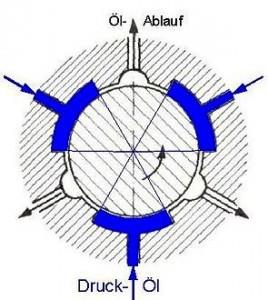
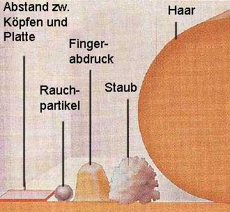

# Festplatte

## 1 HDD – Hard Disk Drive

### magnetischer Datenträger!

## 2 Festplatten Label

## 3 Wichtige Parameter

- Schnittstelle
- Speichervolumen (!Angabe in TB (Marketing) nicht TiB!)
- Versorgungsspannung und notwendiger el. Strom
- Betriebsart
- Typbezeichnung
- Seriennummer
- Produktnummer
- Firmwareversion
- Garantibedingungen

## 4 Schnittstellen

- Anschlussarten(Intern):
  - Parallel SCSI
  - Parallel ATA (IDE)
  - SATA
  - Serial Attached SCSI (SAS)
  - Fibre Channel

- Anschlussarten(Extern):
  - FireWire
  - USB
  - eSATA
  - Thunderbolt
  - \* bei manchen externen Geräten ist die Schnittstelle direkt mit der Laufwerkselektronik verbunden

## 5 Baugrößen

### 5,25“–Festplatten:
1980 von Seagate eingeführt, seit 1997
verschwunden  
### 3,5“–Festplatten:  
1987 von IBM eingeführt, derzeitiger
Standard  
### 2,5“–Festplatten:
1992 von Conner-Peripherials eingeführt,
derzeitiger Standard
### 1,8“–Festplatten:
wurden seit 2003 bei Sub-Notebooks und
großen MP3-Playern eingesetzt
### 1,0“-Festplatte:
2012, Microdrive, 1 GB - 8 GB,Digitalcameras,

## 6 Geschichte

- 1956
- 5 Millionen 7-Bit-Zeichen,
4,375 Megabyte
- 1t
- 1.200 u/min, 100 Bit/Inch
- 152,4×172,72×63,5 cm
- Eisenoxid
- 50 Platten

## 7 IBM 350 RAMAC

L’IBM RAMAC 305 est le premier ordinateur à disque dur commercialisé en septembre 1956 par IBM.

## 8 Datendichte

Datendichte verdoppelt sich jährlich

## 9 Entwicklung

CMR[^1] refers to **Conventional Magnetic Recording**. It is also called PMR (Perpendicular Magnetic Recording). CMR aligns the poles of a magnetic element perpendicular to the surface of the disk in a hard drive. Magnetic elements in this technology represent bits of data. Tracks are written side by side and do not overlap.  
SMR[^2] **Shingled magnetic recording** is a technique for writing data to a hard disk drive (HDD) whereby the data tracks partially overlap to increase the areal density and overall storage capacity per disk.
[^1]: CMR Conventional Magnetic Recording. It is also called PMR (Perpendicular Magnetic Recording). CMR aligns the poles of a magnetic element perpendicular to the surface of the disk in a hard drive. Magnetic elements in this technology represent bits of data. Tracks are written side by side and do not overlap.
[^2]: SMR Shingled magnetic recording is a technique for writing data to a hard disk drive (HDD) whereby the data tracks partially overlap to increase the areal density and overall storage capacity per disk.

## 10 Aufbau

## 11 Aufbau 2

## 12 Aufbau 3

## 13 Innenleben

### Gehäuse  

### Datenscheibe  

### Schreib-/Lesekopf  

  

### Steuerelektronik  

### Antriebe für die Schreib/Leseköpfe  

## 14 Bauteile einer Festplatte

- Eine oder mehreren rotierbar gelagerten Scheiben.
- Eine Welle, auch “Spindel“ genannt, auf der die Scheiben
übereinander montiert sind.
- Ein Elektromotor als Antrieb für die Scheiben.
- Bewegliche Schreib-/Leseköpfe.
- Linearmotor für die Schreib-/Leseköpfe.
- Steuerelektronik für Motor- und Kopfsteuerung,
- Festplattencache: Üblich 2 - 64 MB.
- Schnittstelle
- Gehäuse

## 15 Parkposition

Bei Inaktivität / Abschaltung des Datenträgers, parkt der Schreib-/Lese-Kopf in der Parkposition.

  
Befindet sich entweder außen, siehe Abb. o. nahe
der Achse.

## 16 Lagerarten und Geräuschentwicklung

Hydrodynamisches Lager  

Wälzlager  

  
Hydrostatisches Lager  
  

## 17 Triple Stage Actuator (TSA[^3])

TSA[^3]: Triple Stage Actuator. Actuator technology has evolved from single stage to dual stage to triple stage actuators. Each evolution increases the read-write head position accuracy while decreasing the amount of time required to read and write the media.

VCM[^4]: **voice coil motor** and noted here as "VCM". A VCM is a magnetic circuit that combines an iron yoke and magnets glued to it. Within a hard disk drive, because of the danger of the recorded data being destroyed, the introduction of even tiny particles must be avoided.

[^3]: TSA Triple Stage Actuator Actuator technology has evolved from single stage to dual stage to triple stage actuators. Each evolution increases the read-write head position accuracy while decreasing the amount of time required to read and write the media.

[^4]: VCM **voice coil motor** is a magnetic circuit that combines an iron yoke and magnets glued to it. Within a hard disk drive, because of the danger of the recorded data being destroyed, the introduction of even tiny particles must be avoided.

## 18 Triple Stage Actuator

## 19 Schreib-Lesekopf

GMR Kopf[^5] Giant Magneto-Resistive (GMR) head technology builds on existing read/write technology found in TFI and anisotropic MR, producing heads that exhibit a higher sensitivity to changing magnetisation on the disc and work on spin-dependent electron scattering.

[^5]:(GMR) Giant Magneto-Resistive head technology builds on existing read/write technology found in TFI and anisotropic MR, producing heads that exhibit a higher sensitivity to changing magnetisation on the disc and work on spin-dependent electron scattering.

## 20 Helium ermöglicht mehr Platten

- Helium besitzt 1/7 der Dichte
wie Luft
- Dies ermöglicht
  - Eine höhere Speicherdichte
  - Mehr Platten
(7 – 9 Platten -> 18 TB)
  - Dünnere Platten, spezielle
Gläser
  - Kleinere Abstände Kopf – Platte
  - Geringere Verwirbelungen an
der Plattenoberfläche

## 21 Größenvergleich zum SchreibLesekopf Abstand

### Nanometerbereich

## 22 Abstand!!

## 23 Prinzip - Speicherdichte

## 24 EAMR-Technology[^6]  

- EAMR-Technology[^6]
- ePMR[^7] - Energyassisted Perpendicular Magnetic Recording
- MAMR[^8] - Microwave Assisted Magnetic Recording
- HAMR[^9] - Heat Assisted Magnetic Recording

[^6]:EAMR-Technology Energyassisted Magnetic Recording
[^7]:ePMR - Energyassisted Perpendicular Magnetic Recording
[^8]:MAMR - Microwave Assisted Magnetic Recording
[^9]:HAMR - Heat Assisted Magnetic Recording

## 25 Datendichte

Ausrichtung der „Magnete“ von waagerecht in senkrecht->höhere Speicherdichte

## 26 Prinzip - Speicherdichte

## 27 Magnetkopf heute

- Magnetköpfe erreichen durch den Schreibstrom nicht die volle magnetische Sättigung
-> undefiniertes Magnetfeld auf dem Medium   
-> Verzerrung der Schreibströme   
->Jitter  
- ePMR[^7] – elektr. Strom an Hauptpol – magnetische „Vorspannung“
- Ermöglicht höhere Schreibdichte (BPI[^10])

EAMR[^6] effect on jitter

## 28 Triple Stage Actuator

## 29 nothing!!

## 30 CHS / LBA

- CHS (Cylinder Head Sector) ist die
physikalische Adressierung der Festplatte  
  - Max. Adressierbarer Speicher = 7,844GiB

- LBA (Logical Block Addressing) wird die Anzahl der Sektoren abgezählt, was einen größeren Adressraum zulässt
- Speichergröße kann durch höhere Speichergröße der Blöcke
erhöht werden – Größere Dateien

## 31 Adressierung

- CHS (Cylinder Head Sector) 
- LBA (Logical Block Addressing) 

## 32 Shingled Magnetic Recording SMR[^2]

SMR[^2] versus CMR[^1]

## 33 Das magnetische Medium

Perfekt: Das perfekte magnetische Medium als Ziel der Entwicklung.

## 34 Fragmentiert

- Platte wird im Laufe der Arbeit fragmentiert
- Große Dateien liegen dann nicht mehr an einem Stück, sondern in kleinen Fragmenten verstreut – Verzögert das Laden der Dateien und erhöht die Beanspruchung der Platte

## 35 Defragmentiert

- Defragmentierung,beseitigt die Lücken
- Dateien werden
- Zugriffszeiten deutlich
verbessert

## 36 Berechnung der Umfangsgeschwindigkeit

Formel: v = d \* π \* n  
oder v = w \* r
| - | - | Umfang in m | v in m/min | km/h |
|-----|-----|-----|-----|-----|
|Durchmesser|3,5“|0,27928759|1508,15297|90,50|
|Umdrehungen|5400|-|-|-|
|Geschwindigkeit|~90,49 km/h|-|-|-|
|-|-|-|-|-|
|Durchmesser|2,5“|0,19949113|1077,25212|64,64|
|Umdrehungen|5400|-|-|-|
|Geschwindigkeit|~64,64 km/h|-|-|-|

## 37 Drehzahlen

- In Arbeitsplatzrechnern oder Privat-PCs (3,5“):
  - 5.400 bis 10.000/min

- In Hochleistungsrechnern und Servern (3,5“):
  - 10.000 bis 15.000/min

- Bei den 2,5“ Festplatten:
  - 5.400 bis 7.200/min wobei 5.400/min sehr
verbreitet ist.

## 38 Zugriffszeiten

- Positionierzeit + mittlere Latenzzeit
(+ Datenübertragungszeit)
Typisch 2 – 3 ms.
- Latenzzeit (rotational delay):
0 bis 1 Plattenumdrehung.
mittlere Latenzzeit : ½ Umdrehungen.
- Zugriffszeit = Positionierzeit + Latenzzeit.
typisch bei 7200 U/m → ~15 ms

http://www.lehrer-rautenberg.de/klasse-13/laufwerke/festplatte.htm

## 39 Was ist eine Firmware?

- Firmware stellt Funktionen für die Speicherung bereit
- Low Level Formatierung, Regelparameter,
Anlaufcharakteristik, S.M.A.R.T[^11], Setup d. Gerätes, Cluster, Sektorengröße …
- Firmware dient als Vermittler zwischen der Hardware und der Software

[^11]: S.M.A.R.T Self-Monitoring, Analysis and Reporting Technology is a monitoring system included in computer hard disk drives

## 40 Organisation der Daten

- Eine Spur stellt einen konzentrischen Kreis auf einer Magnetplatte dar, Breite einer Spur: 75 nm.
- Jede Spur ist in Sektoren (zumeist mit 512 Byte Nutzdaten) unterteilt.
- Jeder Sektor enthält noch 40 - 100 Bytes für Verwaltungsinformationen, (Präambel) und Fehlererkennung/-korrektur (ECC)
- Es können nur ganze Sektoren gelesen oder beschrieben werden!
- Bei Einsatz mehrerer Magnetplatten bilden alle übereinander liegenden
Spuren einen Zylinder (→ mehr Daten ohne neue Kopfpositionierung!)
- Jeder Sektor ist somit durch Zylindernummer, Kopfnummer und
Sektornummer eindeutig identifiziert (CHS)

## 41 Formatierung & Dateisystem

### Physikalische Formatierung (Low-Level-Formatierung)

- Wird vom Hersteller durchgeführt
- Einteilung der Festplatte in Spuren, Zylinder und Sektoren

### Logische Formatierung

- Einrichtung eines Dateisystems

### Aufgaben eines Dateisystems

- Verwaltung des Speichers
- Verwaltung der Verzeichnisse und Dateinamen
- Festhalten der Positionen von Dateien auf der Platte

## 42 MBR/GPT

- Master Boot Record / Global Unique IDentifier Partition Table
- MBR kann nur Partitionen von
max. 2,6 TByte verwalten.

- Alles was darüber liegt, benötigt den Nachfolger „GPT“
  - Größere Datenträger werden bootbar

## 43 Aufbau des MBR

| Adresse - Hex | Adresse - Dez | Funktion/Inhalt | Größe in Byte |
| ----- | ------ | ------ | ------ |
| 0x0000 | 0 | Bootloader (Programmcode) | 440 |
| 0x01B8| 440 | Disk-Signatur (seit Win 2000) | 4 |
| 0x01BC | 444 | Null (0x0000) | 2 |
| 0x01BE | 446 | Partitionstabelle | 64 |
| 0x01FE  0x01FF| 510   511| Bootsektor-Signatur(wird vom BIOS für den ersten Bootloader geprüft) | 2 |
| Gesamt: | -  | -  | 512 |

## 44 Aufbau des MBR

## 45 Aufbau GPT

## 46 Partitionen

- Einteilung, aus Sicht des Betriebssystems, der
Festplatte in mehrere Bereiche.
- Jede Partition hat ihr eigenes Dateisystem und
gilt als logisches Laufwerk.
- Dadurch können mehrere Betriebssysteme auf
einer Festplatte installiert werden.

## 47 Vor- und Nachteile der Partitionierung.

### Vorteile:

- Organisation der Daten
- Schnellerer Datenzugriff
- Effizientere Nutzung des Speichers

### Nachteil:

- Partitionieren schützt nicht vor Datenverlust
- Bei Hardwareschäden, Verlust aller Daten

## 48 Windows Datenträgerverwaltung MBR

## 49 Windows Datenträgerverwaltung GPT

## 50 Korrektes Arbeiten mit einer Festplatte

- Ausgebaute HDD in antistatischer Verpackung aufbewahren
- Schockabsorbierende Verpackung wählen
- Keine korrosive Umgebung
- Regelmäßige Kontrolle auf „verwischte“ Daten, zeitlich
bedingter Ausgleich der Magnetfelder
- Vor Neueinbau – Überprüfen der S.M.A.R.T[^11]-Werte

## 51 S.M.A.R.T[^11]?

- Self Monitoring and Analysis Reporting Tool
- Ermöglicht die Diagnose der Datenträger durch Aktivierung im UEFI/BIOS
- Beispiele für wichtige Werte sind
  - Reallocated Sectors Count
  - Spin Retry Count
  - End-To-End error
  - Reported uncorrectable Error
  - Commando Timeout
  - eallocation Event Count
  - Current Pending Sector Count
  - Uncorrectable Sector Count
  - Soft Read Error Rate

- Sollten dies Werte in einem Tool rot angezeigt werden, ist
sofort der Datenträger zu wechseln – Es droht Datenverlust!!!

## 52 Abkürzungen

HDD Hard Disk Drive

SSD Solid State Drive

TB Terra Byte (Umrechnung 1000, Marketing)

TPI[^13] Tracks per Inch

BPI[^10] Bits per Inch (Gbit/I)

EAMR[^6] Energy Assisted Magnetic Recording

ePMR[^7] Energy Enhanced Perpendicular Magnetic Recording

CMR[^1] Conventional Magnetic Recording

EPMR[^8] Microwave Assisted Magnetic Recording

HAMR[^9] Heat Assisted Magnetic Recording

TSA[^3] Triple Stage Actuator

MTBF[^12] Mean Time Between Failure

[^12]:MTBF Mean Time Between Failure
[^13]:TPI Tracks per Inch
[^10]:BPI Bits per Inch (Gbit/I)

## 53 Lernerfolgskontrolle

- In Ihrem PC befindet sich eine Festplatte (HDD). Benennen Sie die Bauteile der Festplatte in dem Sie die Ziffern
den Bauteilen zuordnen!
- Nennen Sie das Speicherprinzip bei einer HDD!
- Nennen Sie 3 Vorschriften, wie HDD zu behandeln sind!
- Nennen Sie für die Dimensionierung eines Rechnersystems wichtige Parameter eines Festplattenlaufwerkes?
- Was verstehen Sie Zugriffszeit und wovon ist sie abhängig?
- Was unterscheidet ein logisches Laufwerk von einem physischen?
- Nennen sie 3 Datenschnittstellen für HDD!
- Nennen Sie die zwei gängigen Baugrößen!
- Wie viele Primären Partitionen kann man maximal auf einer Festplatte erstellen, begründen Sie!
- Nennen Sie mindestens 2 aktuelle Schnittstellen einer Festplatte!
- Warum benötigt man, bei Partitionen ab 2TB die GUID-Partition-Table (GPT) ? Begründen Sie!
- Wie heißt die aktuelle Adressierung der Festplatte?
- Durch welche Methode konnte man die Datendichte auf der Festplatte erhöhen?
- Was bedeutet CHS & LBA voll ausgeschrieben?
- Was ist die Low-Level-Formatierung?
- Welche Probleme treten beim Einsatz von HDD mit mehr als 3 TiB auf?
- Was verstehen Sie unter S.M.A.R.T. und wozu dient es?
- Nennen Sie 5 wichtige S.M.A.R.T.-Werte und ihre Bedeutung! Informieren Sie sich über weitere Werte, da diese
für Systemfehler und Ausfälle verantwortlich sein können!
- Wann sollte eine HDD ausgetauscht werden?
- Informieren Sie sich über die in der Präsentation erwähnten Abkürzungen!

## 54 Abschluss

Vielen Dank für Ihre Aufmerksamkeit!

Für weitere Fragen stehe ich Ihnen gerne zur Verfügung.

## 55 Ende
Ende

Anhang folgt…..

## 56 Anhang

## 57 Anhang

## 58 Anhang

## 59 Anhang

## 60 Anhang

## 61 Anhang

## 62 Anhang

## 63 Anhang

## 64 link

- https://funnyjunk.com/25+years+of+storage/funnypictures/5464265/