

# Betriebssysteme Windows – Registry

## 1 Gliederung

- Windows-Registry 2
- Aufbau und Inhalt 3
- Speicherorte 4
- Beispiele für Registry Werte 5
- Registry Komponenten und Hierarchische Struktur 6
- Hive's Inhalt 7
- HKEY's und Dateien 8
- Dateien der Registrierdatenbank 9 - 10
- Benutzerbezogene Daten 11
- Grundaufbau Registry 12
- HiveKEY s 13
- Windows Sicherheits ID Übersicht 14
- Werttypen in der Registry 15
- Systemrelevante Schlüssel 16
- Editoren 17
- Registrierungseditor 18
- Andere Tools 19
- Registry sichern 20 - 21
- Registry Import 22
- Datentypen 23
- Eindeutige Kennzeichnung 24
- Ab XP, W2k3 25
- Wichtige Schlüssel 26
- Im - und Export von Einstellungen 27
- Aufbau der Reg Dateien 28
- Beispiele 29
- Autostarteinträge finden 30
- Weitere Tools 31
- Bereinigen der Registry 32
- Übungen 33
- Quellen 34 - 35

## 2 Windows-Registry

- Windows-Registrierungsdatenbank
- Bekannt als Registrierung (von englisch Registry)
- Ist zentrale, hierarchische Konfigurationsdatenbank des
  Betriebssystems Microsoft Windows (ab W98)
- Hier werden Informationen von Windows selbst und Informationen von
  Programmen gespeichert
- „DNA“ von Windows

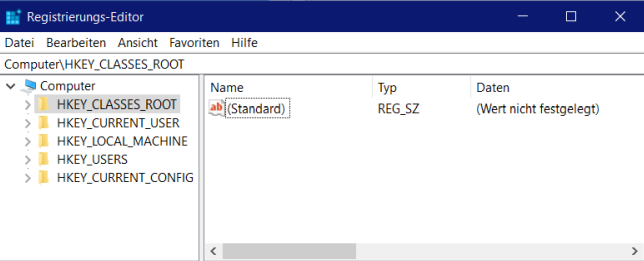

## 3 Aufbau und Inhalt

- Alle Konfigurationswerte sind in sogenannten **Schlüsseln** gespeichert. (Hauptschlüssel und Unterschlüssel)
- Die Ordnung der Registry innerhalb der hierarchischen Baumstruktur ist festgeschrieben.
  - Einstellungen deren Ort geändert werden würde, hätten entweder gar keine Wirkung oder können unvorhersehbare Wirkungen auslösen
- Veränderungen mit Einstellungs-Tools von Windows oder Fremdtools (TWEAKUI)
- Manuelle Eingriffe beziehen sich immer auf die
  Einstellwerte der Schlüssel
- Vor Windows NT (also W3.x) waren diese Werte in
  WIN.INI und SYSTEM.INI gespeichert

## 4 Speicherorte

- Speicherung in verschiedenen Dateien = verteilte Datenbank (DB hat viele Daten und viele Ansichten)
- Die Dateien, welche geschlossene Teilbereiche der Registry speichern werden **Hives** genannt
- Im Verzeichnis:  
  %SystemRoot%\System32\Config\  
  befinden sich die wesentlichen Dateien, die den Inhalt der
  Registry Hives speichern
  - .DEFAULT
  - HARDWARE
  - SOFTWARE
  - SAM[^1]
  - SECURITY
- Die Liste aller verwendeten **Hives** finden Sie in:<f>HKLM\SYSTEM\CurrentControlSet\Control\hivelist</f>
  [^1]: Sam secure acount manager

## 5 Beispiele für Registry-Werte

- Computer Name
- Last Shutdown Time
- Startup Drivers / Programs
- User Account Names
- Application Settings
  - IE Start Page
  - Skype Username
- Recently Accessed
  - Programs
  - Web Pages
  - Files
- Previously Connected:
  - Wireless Networks
  - USB Drives

## 6 Registry – Komponenten und Hierarchische Struktur

- Komponeten
  - Hives
  - Root Keys (Schlüssel)
  - Keys
  - Sub-keys
  - Values (Werte)
- Hierarchische Struktur
  - Ähnlich der Verzeichnis-/Dateistruktur
  - Root Keys enthalten Keys und Sub-Keys
  - Schlüssel und Unterschlüssel enthalten weitere Unterschlüssel und Werte

## 7 Hive‘s - Inhalt

| System       | Systemkonfiguration                                                             |
| ------------ | ------------------------------------------------------------------------------- |
| User.dat     | Benutzerprofil                                                                  |
| Classes.dat  | Dateitypen, Dateierweiterung und alle COM-Komponenten                           |
| Default      | Standard-Benutzerprofil                                                         |
| SAM[^1]      | (Security Account Manager) Benutzerkontendatenbank (System- und Zugriffsrechte) |
| Security     | Sicherheitsrichtlinien                                                          |
| Software     | Softwareinformation                                                             |
| Usrclass.dat | benutzerspezifischen Software-Einstellungen                                     |
| ntuser.dat   | Konfigurationsdatei des eingerichteten Benutzerprofils                          |

## 8 HKEY's und Dateien

Feste Einstellungen Speicherorte Dateien

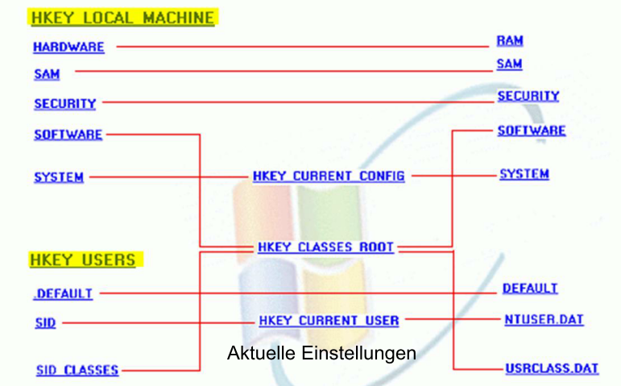

## 9 Dateien der Registrierdatenbank 1

| Dateiname    | Pfad                                                   | Pfad in der Registry          | Aufgabe                                                |
| ------------ | ------------------------------------------------------ | ----------------------------- | ------------------------------------------------------ | --- | -------- | -------------------------- | ------------- | -------------------------------------------------- | --- | -------- | -------------------------- | ------------- | ------------------- |
| SYSTEM       | C:\Windows\System32\Config                             | HKLM\System                   | Systemkonfiguration für Treiber und Dienste            |
| DEFAULT      | C:\Windows\System32\Config                             | HKU\.DEFAULT und HKU\S-1-5-18 | Standard-Benutzerprofil                                |
| SAM[^1]      | C:\Windows\System32\Config                             | HLKM\SAM                      | Benutzerkontendatenbank (System- und Zugriffs- Rechte) |     | SECURITY | C:\Windows\System32\Config | HKLM\SECURITY | Sicherheitsrichtlinien (System-und Zugriffsrechte) |     | SOFTWARE | C:\Windows\System32\Config | HKLM\SOFTWARE | Softwareinformation |
| BCD          | \EFI\Microsoft\Boot\BCD                                | HKLM\BCD00000000              | Information zur Boot-Konfiguration                     |
| ntuser.dat   | c:\Users\Benutzename\                                  | HKCU\                         | Konfigurationsdatei des eingerichteten Benutzerprofils |
| Usrclass.dat | c:\Users\Benutzename\AppData\Local\Microsoft\Windows\  | HKU\Software\Classes          | Benutzerspezifischen Software-Einstellungen            |
| ntuser.dat   | C:\Windows\ServiceProfiles\LocalService\               | HKU\S-1-5-19                  | Konfigurationsdatei für „Lokaler Dienst“               |
| ntuser.dat   | C:\Windows\ServiceProfiles\NetworkService\             | HKCU\S-1-5-20                 | Konfigurationsdatei für „Netzwerkdienst“               |

## 10 Dateien der Registrierdatenbank 2

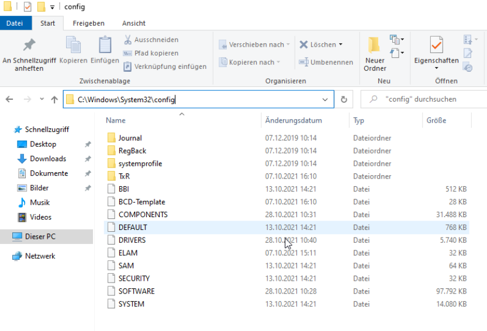

## 11 Benutzerbezogene Daten

### WinNT4

Dateien stehen noch im Systemverzeichnis
<f>%SystemRoot%\Profiles\WinUser\NTUSER.DAT</f>

### Ab Win2000

die benutzerbezogenen Registry Hives
stehen außerhalb des Systemverzeichnisses in
<f>\Dokumente und Einstellungen\WinUser\NTUSER.DAT</f>

### Ab Windows Vista

die benutzerbezogenen Registry
Hives stehen außerhalb des Systemverzeichnisses in
<f>\users\username\NTUSER.DAT</f>

## 12 Grundaufbau - Registry

- Hive-Dateien enthalten hierarchisch Struktur von
  Schlüsseln, welche mit den Hive Key's (Hauptschlüssel)
  beginnen
- HKEY_LOCAL_MACHINE\SYSTEM\CurrentControlSet\....
- Aufbau:
  - HKEY_CLASSES_ROOT
  - HKEY_CURRENT-CONFIG
  - HKEY_LOCAL_MACHINE
  - HKEY_CURRENT-USER
  - HKEY_USERS
- Systemsteuerung oder Editor (regedit – als Admin) für
  Registry benutzen

## 13 HiveKEY‘s

| Schlüsselbezeichnung                               | Erklärung                                                                                                                                                                                                                                                                                                                    |
| -------------------------------------------------- | ---------------------------------------------------------------------------------------------------------------------------------------------------------------------------------------------------------------------------------------------------------------------------------------------------------------------------- |
| **HKEY_CLASSES_ROOT**                              | Ist eine Verknüpfung zu dem Unterschlüssel HKEY_LOCAL_MACHINE\SOFTWARE\Classes sowieHKEY_USER S/SID des Benutzers (z.b. S-1-5-17). Hier befindet sich die lange Liste der Dateiendungen sowie die der installierten Anwendungen. Hier wird definiert, welche Aktion bei welchem Dateityp ausgeführt wird.                    |
| **HKEY_CURRENT_USER**                              | Sämtliche Konfigurationen, Einstellungen, Information und viele mehr zu dem gerade angemeldeten Benutzer finden Sie hier. Die globalen Einstellungen werden von HKEY_USERS verwendet.                                                                                                                                        |
| **HKEY_LOCAL_MACHINE**                             | Hier finden Sie die Einstellungen und Informationen, die für die entsprechende Maschine gelten: Diese Einstellungen haben Vorrang vor den Werten unter HKEY_CURRENT_USER und gelten somit für sämtliche Benutzer des Systems. HKLM beinhaltet die wichtigen Unterschlüssel SYSTEM, SAM[^1], SECURITY, SOFTWARE und HARDWARE. |
| **HKEY_USERS**                                     | Hier finden Sie die globalen Einstellungen, die für alle Benutzer bzw. jeden Einzelnen gelten - sie sind die Grundlage für HKEY_CURRENT_USER. Die Benutzeridentifikation findet anhand der SID[^2] (Security Identifier) anstelle des Benutzernamens statt.                                                                  |
| **HKEY_CURRENT_CONFIG**                            | Verknüpft mit HKEY_LOCAL_MACHINE\SYSTEM\CurrentControlSet\Hardware Profiles\Current. Es wird die aktuelle Information über die Hardware des Rechners angezeigt.                                                                                                                                                              |
| **HKEY_PERFORMANCE_DATA (nicht überall sichtbar)** | Erlaubt verschiedenen Anwendungen den Zugriff auf Leistungsdaten (Performance Data). Dieser Schlüssel wird erst bei entsprechenden Anforderungen erstellt und bei einer Standardinstallation nicht angezeigt.                                                                                                                |

## 14 Windows Sicherheits-ID - Übersicht

Eine Sicherheits-ID (Security Identifier = SID[^2]) ist ein eindeutiger Wert variabler Länge, der einen
Sicherheitsprinzipal oder eine Sicherheitsgruppe in Windows-Betriebssystemen identifiziert.  
..\Win_Registry\Windows Sicherheits-ID - Übersicht.doc
[^2]: SID Security Identifier ist ein
eindeutiger Wert variabler Länge, der einen
Sicherheitsprinzipal oder eine Sicherheitsgruppe in Windows-Betriebssystemen identifiziert.

## 15 Werttypen in der Registry

### Zeichenfolge (String)

REG_SZ, reiner, beliebiger Text

### Binär-Wert (Binary) = REG_BINARY

Zahlenwert in der binären, dezimalen (0 bis 255) oder hexadezimalen (00 bis FF) Schreibweise

### DWORD-Wert (DWORD) = REG_DWORD

32-Bit-Zahl (sowie REG_QWORD für eine 64-Bit-Zahl)

### Wert der erweiterbaren Zeichenfolge = REG_EXPAND_SZ (expandierbarer Text)

einen Textwert mit Variablen wie %SYSTEMROOT%, welche durch den Inhalt der Variable ersetzt wird

### Wert der mehrteiligen Zeichenfolge = REG_MULTI_SZ

eine mehrzeilige Zeichenkette (Mehrfachzeichenkette), bei welcher die Texteinträge durch Leerzeichen, Kommas oder andere Trennzeichen voneinander getrennt sind

- <f>Die Namen der Werte dürfen in einem
  Schlüssel nur einmal vorkommen. <f>
- <f>Die Groß- oder Kleinschreibung spielt dabei
  keine Rolle.<f>

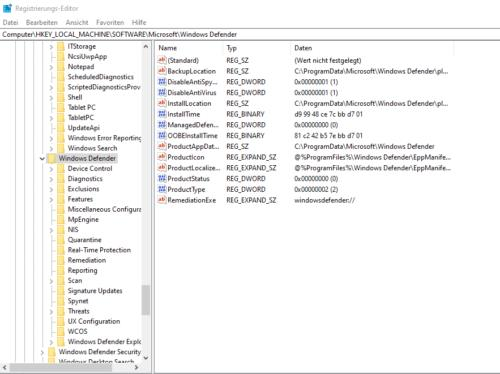

## 16 Systemrelevante Schlüssel und Werte sind mit Zugriffsrechten geschützt

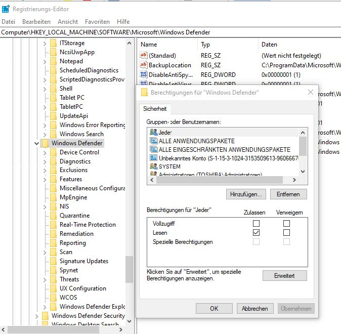

## 17 Editoren

- Zuerst die Systemeinstellungstools benutzen!!!
  Damit werden die Werte bearbeitet – ohne Konflikte.
- Vor Änderungen mit Regedit: SICHERN!
- Regedit.exe
- Regedt32.exe
- siehe https://de.wikipedia.org/wiki/Registrierungsdatenbank

### Übung

- https://www.wintotal.de/softwarearchiv/rund-um-die-registry/

## 18 Registrierungseditor

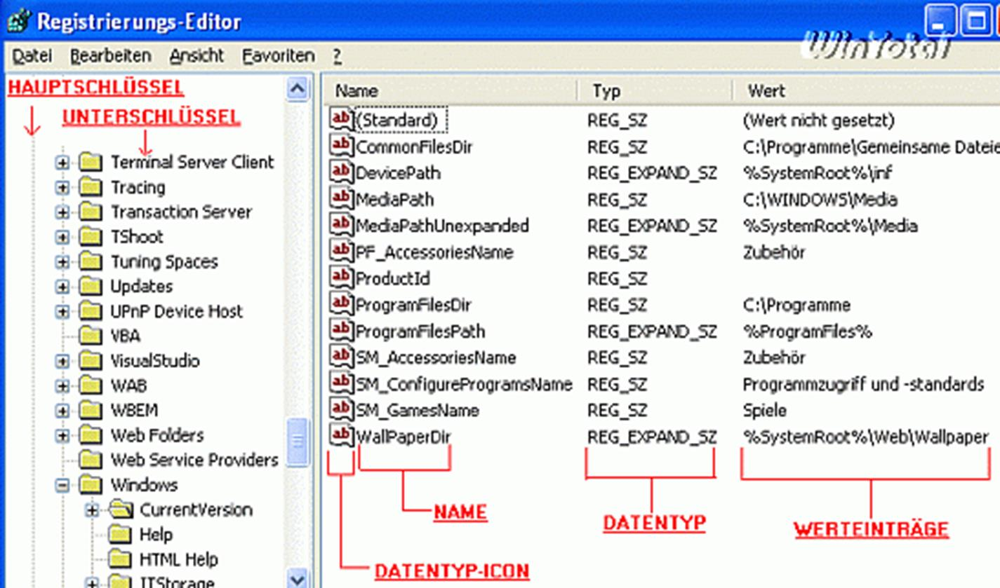

## 19 Andere Tools

- ERUNT
- NTREGOPT
- Registry Backup
- Registry System Wizard
- RegSeeker
- Regmon
- CCleaner
- TuneUp Utilities
- cmd – Reg-Befehl

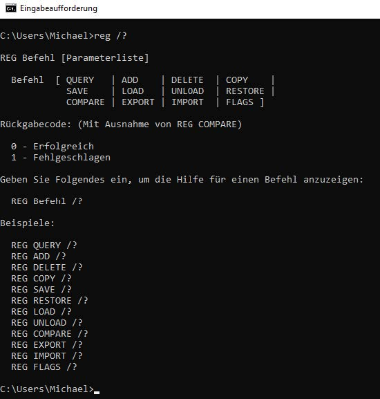

## 20 Registry sichern 01

- Immer erst ein Backup anlegen bevor man etwas ändert!!!
- Im Editor REGEDIT.EXE
  - Menü Datei – Exportieren
  - Auswahl "Alles" oder "Teilstruktur"
  - Dateiname eingeben, Dateityp immer .reg
  - Speichern in Verzeichnis (wiederfinden!)

## 21 Registry sichern 02

- Win R – Regedit – als admin
- Backup erstellen
  - Öffnen sie den Registrierungseditor
  - Klicken Sie mit der rechten Maustaste auf Arbeitsplatz
  - Aus dem aufklappenden Kontextmenü wählen sie nun
    „Exportieren“
- Es erscheint nun ein Fenster, in welchem Sie den Zielort,
  sowie den Namen des Backups auswählen können
- Speichern – Erweiterung > „.reg“

## 22 Registry Import

- In REGEDIT - Menü Datei - Import
- Doppelklick auf .reg-Datei
- Importierte Werte überschreiben Werte
- Ab WXP/W2k nur Teilschlüssel
- Für gesamte Registry Tool ERUNT  
  http://www.wintotal.de/softw/?id=1232
- Auch Freewaretool RSW (Registry System Wizard)
  geeignet  
  http://www.wintotal.de/softw/?id=521

## 23 Datentypen

| Datentyp                                            | Erklärung                                                                                                                    |
| --------------------------------------------------- | ---------------------------------------------------------------------------------------------------------------------------- |
| Zeichenfolge (REG_SZ)                               | Eine Zeichenkette (Text)                                                                                                     |
| Binärwert (REG_BINARY)                              | Besteht aus den Werten 0 und 1 (meist in Hexadezimalform). Findet man häufig bei Hardwarekonfigurationen.                    |
| DWORD-Wert (REG_DWORD)                              | Kennzeichnet den Status einer Funktion (0 für Deaktiviert, 1 für Aktiviert).                                                 |
| Wert der mehrteiligen Zeichenfolge (REG_MULTI_SZ)   | Eine Gruppe von Zeichenfolgen, die voneinander durch ein Nullbyte getrennt sind.                                             |
| Wert der erweiterbaren Zeichenfolge (REG_EXPAND_SZ) | Zeichenkette mit einer Umgebungsvariable (z.B. %WINDOWS% für das Windows-Verzeichnis; egal wie die/dieses nun genannt wurde) |

## 24 Eindeutige Kennzeichnung

• Jedes Objekt (z. B. Desktop, Papierkorb usw.) erhalten
einen eindeutigen Bezeichner: CLSID[^3] (ClasSIDentifier)
• CLSID ist 16 Byte Wert = 32 hex. Zahlen
• Gruppiert: 8-4-4-4-12

[^3]: CLSID (ClasSIDentifier)

## 25 Ab XP, W2k3

- Für Schlüssel können Berechtigungen
  (Vollzugriff, Ändern, nur Lesen, verboten)
  für Benutzer und Gruppen vergeben werden
- Rechte Maustaste auf Schlüssel - Berechtigungen
  26

## 26 Wichtige Schlüssel

### HKLM\Software\Microsoft\

Windows\CurrentVersion\Run(x)
startet alle eingetragene Software für alle Benutzer

### HKCU\Software\Microsoft\

Windows\CurrentVersion\Run(x)
startet alle eingetragene Software für angemeldeten
Benutzer

## 27 Im- und Export von Einstellungen

- Export ist über das
  Kontextmenü in einem
  Schlüssel möglich
- Alle darin befindlichen
  Unterschlüssel und Werte
  werden dann in eine Reg-Datei
  exportiert
- Eine so erstellte Reg-Datei
  kann über einen Doppelklick
  wieder importiert oder über das
  Kontextmenü „Bearbeiten“
  auch editiert werden

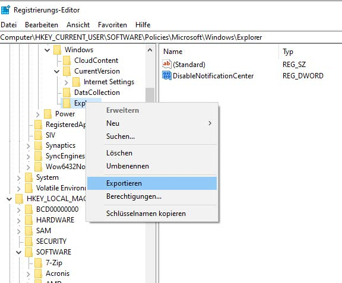
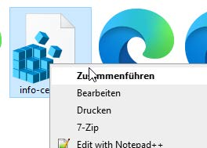

## 28 Aufbau der Reg-Dateien

- Reg-Dateien auch editieren oder ergänzen
- Bei „Minus“ vor einen Eintrag, wird dieser beim
  „Zusammenführen“ entfernt

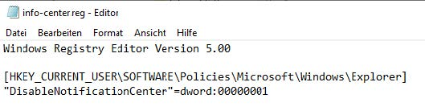

## 29 Beispiele

- Mit exportierten und wieder importierten Reg-Dateien können individuelle Einstellungen gespeichert werden  
  =>Neuinstallation
- Keine Backups!
- Inhalte von einem importierten Schlüssel legen neue Schlüssel oder Werte an oder überschreiben sie
- Bereits anderweitig bestehende Einträge bleiben in der Struktur aber erhalten!

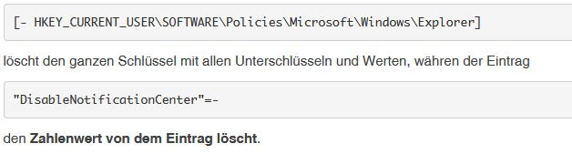

## 30 Autostarteinträge finden

### Autostart-Einträge finden sich in den Unterschlüsseln

- HKEY_LOCAL_MACHINE\SOFTWARE\Microsoft\Windows\CurrentVersion\Run
- HKEY_LOCAL_MACHINE\SOFTWARE\Microsoft\Windows\CurrentVersion\RunOnce

### Aber auch für den Benutzer unter

- HKEY_USERS\.DEFAULT\Software\Microsoft\Windows\CurrentVersion
- HKEY_USERS\S-1-5-21-33549198-{lange CLSID_Nummer}-2045952872-1000\Software\Microsoft\Windows\CurrentVersion

## 31 Weitere Tools

- Regshot Advanced
- Process Monitor von Microsoft

## 32 Bereinigen der Registry?

- Verschiedene Tools
- Löschen nur Einträge zu nicht
  mehr existierenden
  Programmen (kein Zugriff auf
  die Programme)
- Programm oder Windows
  starten nicht mehr
- Windows wertet nur die
  Schlüssel aus, welche gerade
  benötigt werden
- „aufgeräumte“ Registry keinen
  wesentlichen Vorteil

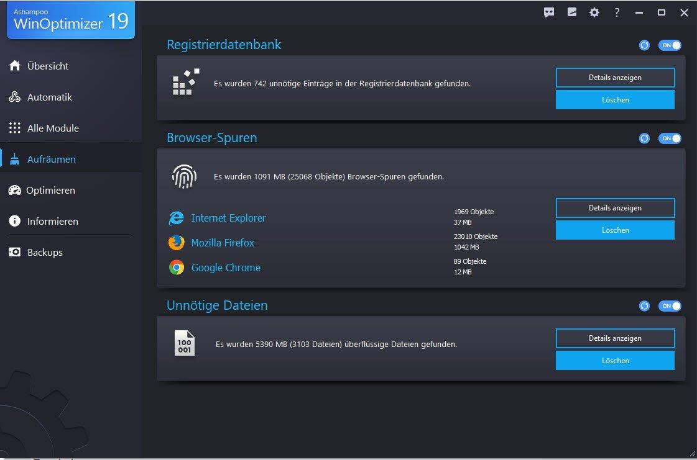

## 33 Übungen

- Microsoft Onlineregistrierung (ab XP) deaktivieren
- Um in den Genuss der Windows Update Funktion zu
  kommen, setzt Microsoft eine Onlineregistrierung voraus,
  bei der Daten nach Redmond übertragen werden
- Um diese Funktion manuell zu deaktivieren, muss man
  unter <f>HKEY_LOCAL_MACHINE\SOFTWARE\Microsoft\Windows NT\CurrentVersion</f>
  den Wert RegDone auf „1“ setzen.

## 34 Quellen

- https://www.winhistory.de/more/win10.htm#ed
- https://www.winhistory.de/more/msdos.htm
- https://docs.microsoft.com/en-us/previous-versions/windows/it-pro/windows-server-2008-R2-and-2008/cc731901(v=ws.11)?redirectedfrom=MSDN
- https://docs.microsoft.com/de-de/windows/client-management/images/boot-sequence.png
- https://docs.microsoft.com/en-us/windows-hardware/drivers/devtest/bcd-boot-options-reference
- https://upload.wikimedia.org/wikipedia/commons/5/52/Linux-bootvorgang.svg
- https://www.verbraucherzentrale.de/wissen/digitale-welt/datenschutz/datenschutz-bei-windows-10-erhoehen-12154
- https://www.bsi.bund.de/DE/Themen/Verbraucherinnen-und-Verbraucher/Cyber-Sicherheitslage/Methoden-der-Cyber-Kriminalitaet/methoden-der-cyber-kriminalitaet_node.html
- https://www.bsi.bund.de/SharedDocs/Downloads/DE/BSI/Cyber-Sicherheit/SiSyPHus/Analyse_Telemetriekomponente_1_0.html
- https://www.giga.de/downloads/windows-10/tipps/windows-10-einrichten-von-a-bis-z-so-geht-s/
- https://entwickler.de/online/windows-10-wissenswertes-nutzer-168786.html
- https://www.google.de/search?client=ms-opera-mobile&channel=new&espv=1&q=Windows+10+Schritt+f%C3%BCr+Schritt+Anleitung+PDF&sa=X&ved=2ahUKEwi4w_v47JzxAhVF4qQKHcehDKgQ1QIwKHoECDMQAQ&biw=902&bih=1503
- https://www.appdated.de/2020/11/windows-10-handbuch-und-anleitung-in-deutsch/
- https://www.pcwelt.de/ratgeber/Von-Windows-1-bis-10-Die-Geschichte-von-Windows-9849474.html
- https://www.pc-magazin.de/ratgeber/windows-10-einstellungen-apps-startmenue-edge-desktop-cortana-onedrive-3191899.html
- https://www.computerwoche.de/k/windows-10,3530
- https://www.giga.de/downloads/windows-10/specials/windows-10-handbuch-kostenlos-zum-download-quick-guide-deutsch/

## 35 Quellen 2

- https://docs.microsoft.com/de-de/windows-hardware/design/device-experiences/oem-secure-boot
- https://www.winhistory.de/more/win10.htm#ed
- https://www.winhistory.de/index.php
- https://www.computerwoche.de/a/god-mode-per-trick-in-windows-10-freischalten,3315849
- https://www.computerwoche.de/a/die-besten-tricks-zum-windows-10-browser,3316565
- https://www.computerwoche.de/a/windows-10-creators-update-alle-neuerungen-im-ueberblick,3330536
- https://www.computerwoche.de/a/suchfunktion-optimal-nutzen,3331986
- https://www.computerwoche.de/a/mac-oder-pc-ein-test-ueber-zehn-runden,2557071
- https://www.computerwoche.de/a/so-bereinigen-sie-windows,3544129
- https://www.computerwoche.de/a/microsoft-baut-an-neuer-betriebssystem-generation,3544239
- https://www.computerwoche.de/a/tools-die-auf-jedes-windows-gehoeren,3544369
- https://www.computerwoche.de/a/windows-10-die-besten-freeware-tools,3226100
- https://www.computerwoche.de/a/cortana-per-trick-abschalten,3544820
- https://www.computerwoche.de/a/windows-10-statistik-zur-datennutzung-anzeigen,3545114
- https://www.computerwoche.de/a/datenschutz-in-windows-10-privatsphaere-schuetzen,3545490
- https://www.computerwoche.de/a/problemen-gezielt-auf-die-spur-kommen,3331447
- https://www.computerwoche.de/a/fuenf-hilfreiche-tipps-und-tricks-fuer-windows-10,3544199
- https://www.computerwoche.de/a/schneller-auf-ordner-zugreifen,3546976
- https://www.computerwoche.de/a/optimierung-fuer-windows-10,3547100
- https://www.computerwoche.de/a/windows-tools-die-wirklich-jeder-braucht,3547134
- https://www.computerwoche.de/a/windows-10-erfordert-ein-neues-betriebsmodell,3547153
- https://www.computerwoche.de/a/windows-10-mit-pin-statt-passwort-schuetzen,3547320
- https://www.computerwoche.de/a/geheime-windows-funktionen-nutzen,3544311
- https://www.computerwoche.de/a/die-besten-tipps-zu-sicherheit-und-datenschutz,3328090
- https://www.computerwoche.de/a/so-steuern-sie-ihr-windows-ohne-maus,3547985
- https://www.computerwoche.de/a/sicheres-loeschen-von-dateien-in-windows-10,3548338
- https://www.computerwoche.de/a/pfiffige-gratis-tools-machen-windows-besser,3547435
- https://www.computerwoche.de/a/11-kleine-windows-tricks-mit-grosser-wirkung,3548159
- https://www.computerwoche.de/a/dieser-trick-aktiviert-neues-startmenue-in-windows-10,3549540
- https://www.computerwoche.de/a/das-kann-microsofts-verwaltungstool,3549962
- https://www.computerwoche.de/a/die-35-besten-cmd-tricks-fuer-windows,3550137
- https://www.computerwoche.de/k/windows-10,3530/hintergrund,31,3
- https://apfelböck.de/windows-tipps-und-grundlagen/
- https://secure-bits.org/category/tutorials/
- https://botfrei.de/was-ist-eigentlich-ein-mbr-oder-wie-kann-ich-es-reparieren/
- https://knowitlikepro.com/understanding-master-boot-record-mbr/
- https://knowitlikepro.com/
- https://metebalci.com/blog/a-quick-tour-of-guid-partition-table-gpt/
- https://www.codeproject.com/Articles/488296/Partition-Tables-Explained
- https://slidetodoc.com/using-large-hard-drives-in-linux-presented-by/
- https://www.thessdreview.com/ssd-guides/optimization-guides/complete-guide-to-speeding-up-your-pcs-boot-times/
- https://www.wintotal.de/windows-registry/
