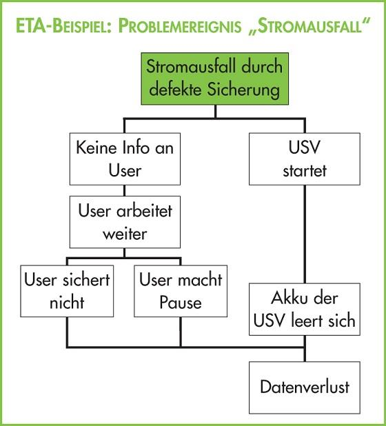
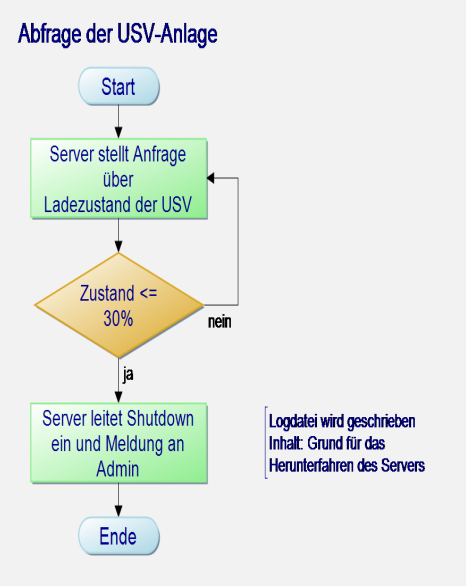
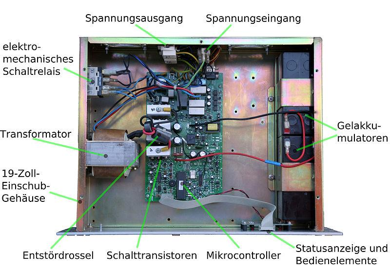
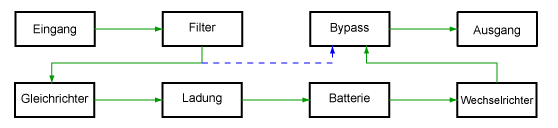
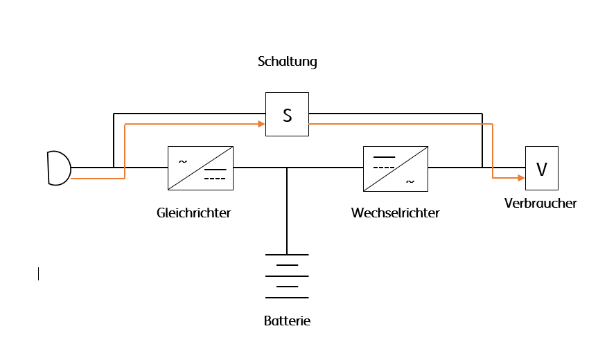
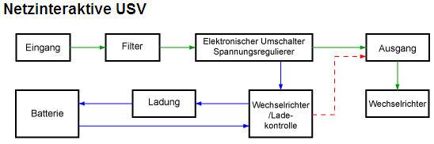
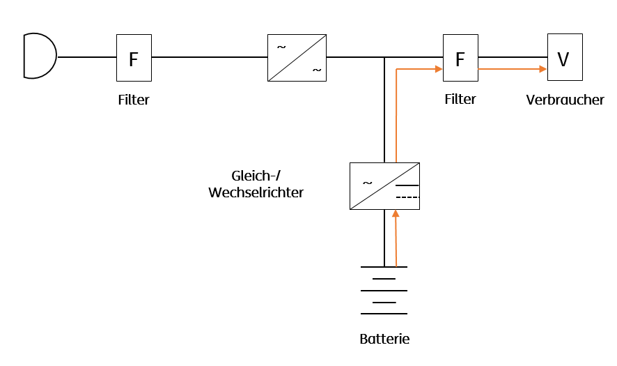
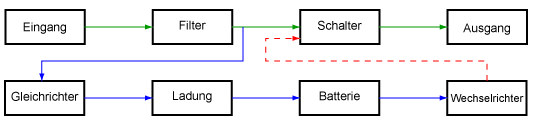

# Unterbrechungsfreie Spannungsversorgung

## 2 Thema-Schwerpunkte

- Die Aufgaben einer USV
- Was muss eine USV leisten können
- Klassifizierung von USV-Anlagen
- Der Aufbau einer USV
- Klassen der USV
- Überbrückungszeit
- Berechnungen, Scheinleistung, Nennleistung und Wirkleistung
- Häufigsten Einsatzgebiete
- Anschaffungskosten
- Zusammenfassung

## 3 Die Aufgaben einer USV

- Schutz gegen lokale Spannungsausfälle
- Schutz gegen lokale Spannungsausfälle und Störungen
- Sicherheit für empfindliche Verbraucher („critical load“)
- Systemverfügbarkeit nahe 100%

## 4 Beispiel

- 99,9 % im Jahr Verfügbarkeit – ≈ 520 min ohne Energie
- 5 Spannungsausfälle kosteten einem deutschen Unternehmen ≈ 62.000 €
  - 1 Spannungsausfall öffentliches Netz, 15 min
  - 2 innerbetriebliche Schwankungen, ca. 5 s
  - 1 unkontrollierter Spannungsausfall, 5 min
  - 1 Blitzschlag, 10 min
- 99,99 % bedeutet 52 min ohne Energie
  - kann kein Anbieter gewährleisten
- 99,999 %bedeutet 5 min ohne Energie
  - kann keine USV gewährleisten
    - verschiedene Technologien

## 5 Wovor soll eine USV schützen?

| Störungstyp                                     | Dauer        | Definition                                                                                                                                                                            |
| ----------------------------------------------- | ------------ | ------------------------------------------------------------------------------------------------------------------------------------------------------------------------------------- |
| Netzausfälle - Power Failure                    | > 10 ms      | Ein Netzausfall wird als Nullspannungsbedingung definiert, dies kann auf ein Netzspannungsfehler zurückführen.                                                                        |
| Spannungsschwankungen - Power Sag               | < 16 ms      | Spannungsschwankungen sind Einbrüche, die kurzzeitig unter dem Normalwert liegen. Sie können beim Einschalten großer Anlagen oder Starkstromleitungen auftreten.                      |
| Spannungsspitzen - Switching Transient          | 4 ms … 16 ms | Sie werden häufig durch eine statische Entladung verursacht. Spannungsspitzen werden auch oft als Schaltspitzen bezeichnet.                                                           |
| Spannungsstöße - Power Surge                    | < 4 ms       | Diese treten bei plötzlichen und kurzzeitigen Spannungsspitzen auf. Normalerweise kann dies auf einen Blitzeinschlag in der näheren Umgebung zurück geführt werden.                   |
| Unterspannungen - Under Voltage                 | Fortlfd.     | Die Spannung fällt unter den zulässigen Grenzwert (für einige Sekunden oder sogar dauerhaft).                                                                                         |
| Überspannung - Over Voltage                     | Fortlfd.     | Wenn zum Beispiel große elektrische Anlagen aktiviert werden, kann der Normalbetrieb auf über 100% steigen, dies wird als Überspannung bezeichnet.                                    |
| Frequenzschwankungen - Frequency Variation      | Sporad.      | Hierbei weicht die Frequenz von der normalerweise konstanten Netzfrequenz ab.                                                                                                         |
| Spannungsverzerrungen - Line Noise              | Period.      | Eine Spannungsverzerrung wird auch als eine elektrische Störspannung bezeichnet, dies hat einen negativen Einfluss auf die Schaltungen in elektrischen Systemen.                      |
| Spannungsoberschwingungen - Harmonic Distortion | Fortlfd.     | Dabei wird die normale Wellenform der Spannung verzerrt und damit verändert Gründe dafür können zum Beispiel einfache Leuchtstoffröhren sein, die dies in die Netzleitung übertragen. |

## 6 7 Was muss eine USV leisten können?

- vor Netzunterbrechungen und Spannungsschwankungen schützen
- eine störfreie und stabile Spannung liefern, auch im Normalbetrieb.
- die Akkumulatoren korrekt laden können
- vor Überlast durch angeschlossene Geräte geschützt sein
- bei Netzunterbrechung akustisch und optisch warnen
- die Akkumulatoren vor Selbstentladung schützen und ungenügende
  Akkumulatorladung anzeigen

## 8 Problem „Stromausfall“

## 9 Der Aufbau einer USV

- USV besteht aus Akkumulatoren
- bei Einzelplatz-USV aus Blei-Vlies-Batterien (AGM[^1], Absorbent Glass Mat) oder Blei-Gel-Batterien
- bei Leistungs-USV´en aus Bleiakkumulatoren Stromrichtern und einer elektronischen Regelung
- als Energiespeicher werden auch NiCd-Akkus, in seltenen Fällen Li-Ionen-Batterien eingesetzt
  [^1]: AGM Absorbent Glass Mat

## 10 Der Aufbau einer USV

<f>IMPORTANT

## 11 Europäische Richtlinien EN 50091-3 (IEC 62040-3) zur Klassifizierung von USV-Anlagen

### 1. Stufe:

- Welche Störung wird aufgefangen?
- 3 Klassen: VFI[^2], VI[^3], VFD[^4]

[^2]: VFI Voltage and Frequency Independent from mains supply
[^3]: VI Voltage Independent from mains supply
[^4]: VFD Voltage and Frequency Dependent from mains supply

### 2. Stufe:

- Welche Abweichung vom idealen Sinus hat die Ausgangsspannung?

### 3. Stufe:

- Wie sieht die dynamische Toleranzkurve der Ausgangsspannung aus?

## 12 Europäische Richtlinien EN 50091-3 (IEC 62040-3) zur Klassifizierung von USV- Anlagen (Stufe1)

### Vergleichstabelle (aufgefangene Störungen)

| Neue Definitionen                                                                                                                                                                                                       | Alte Definitionen                                                         |
| ----------------------------------------------------------------------------------------------------------------------------------------------------------------------------------------------------------------------- | ------------------------------------------------------------------------- |
| Klasse 1 - VFI[^2]: (Voltage and Frequency Independent from mains supply) USV- Ausgangsfrequenz unabhängig von Netz-, Spannungs- und Frequenzänderungen innerhalb der Grenzen nach IEC 61000-2-2 (Klasse 1)          | - On-line - Double - conversion - Dauerwandler                   |
| Klasse 2 - VI[^3]: (Voltage Independent from mains supply) USV- Ausgangsfrequenz abhängig von der Netzfrequenz, Spannung stabilisiert (elektronisch/passiv) innerhalb der Grenzwerte für Normalbetrieb (Klasse 2) SX/SY | - Single Conversion - Line-Interactive - Aktiver -Mitlaufbetrieb |
| Klasse 3 - VFD[^4]: (Voltage and Frequency Dependent from mains supply) USV- Ausgangsfrequenz abhängig von Spannungs- und Frequenzänderungen des Netzes (Klasse 3) SX/SY                                             | -Off-line -Stand-by -Backup-Betrieb                                 |

## 13 Online/Dauerwandler-USV

- die zwei unten beschriebenen USV-Techniken haben einen gravierenden Nachteil: Die Last wird erst bei Netzausfall aus der Batterie gespeist
- Dauerwandler- bzw. Online-USVs gelten als echte Stromgeneratoren
- ständige Erzeugung einer eigene Netzspannung
- Ausgangsspannung verfügt über bessere Eigenschaften als der Strom aus der
  Steckdose
- Einsatz in hochsensiblen Bereichen in der Computer- und
  Kommunikationstechnik

## 14 Schematischer Aufbau einer Online USV

## 15 Netzinteraktive USV (Klasse 2 - VI[^3])

- netzinteraktive USVs funktionieren ähnlich wie Standby-USV‘s
- schützen vor Netzausfall, kurzzeitigen Spannungsspitzen und können durch Filter Spannungsschwankungen ständig regeln
- Umschaltzeit von Netzbetrieb auf Batteriebetrieb 2 bis 4 ms
- Einsatz in Gegenden, wo viele Spannungsschwankungen vorkommen
- Absicherung von einzelne Computer, größere TK-Anlagen und Netzwerken
- 

## 16-17 Schematischer Aufbau der netzinteraktive USV

## 18 Netzinteraktive USV

## 19 Standby/Offline-USV (Klasse 3 - VFD[^4])

- Einfachste und preiswerteste USV
- Schützen nur gegen Netzausfälle
- Umschaltdauer zwischen Netzbetrieb auf Batteriebetrieb von 4 bis 10
  Millisekunden
- Schalten automatisch bei Über(?)- oder Unterspannung auf Batterie-
  Betrieb um
- Geeignet für kleine TK-Anlagen und einzelne Computer mit Peripherie

9

## 20 Schematischer Aufbau der Offline-USV

## 21 Eigenschaften im Überblick

(Stufe 1)
29.09.2020 © Dr.-Ing. Reiner Kupferschmidt 22
USV-Klasse Klasse 1 - VFI[^2] Klasse 2 - VI[^3] Klasse 3 - VFD[^4]
Leistung ab 500 VA bis 5 kVA bis 1 kVA
Wirkungsgrad 90% 95 – 98 % 95 %
Preis hoch mittel niedrig
Anwendung Server und Datenkom-
munikation,
Krankenhäuser,
Kernkraftwerke u. ä.
einzelne Computer,
TK-Anlagen und
Netzwerke
Kleinst-Verbraucher,
einzelne Computer
Schutz vor umfassender Schutz
durch ständige
Erzeugung einer
Sinusspannung
Netzausfall, filtern von
Spannungs-
schwankungen und –
spitzen
Netzausfall
Umschaltdauer 2 bis 4 ms 4 bis 10 ms

## 22 Schutzfunktionen - Klassen

Störung VFI[^2] VI[^3] VFD[^4]
Netzausfälle -
Power Failure X X X
Spannungsschwankungen –
Power Sag X X O
Spannungsspitzen -
Switching Transient X X O
Spannungsstöße -
Power Surge X X O
Unterspannungen -
Under Voltage X X O
Überspannung -
Over Voltage X X O
Frequenzschwankungen -
Frequency Variation X O O
Spannungsverzerrungen -
Line Noise X O O
Spannungsoberschwingungen -
Harmonic Distortion X O O
29.09.2020 © Dr.-Ing. Reiner Kupferschmidt 23
Europäische Richtlinien EN 50091-3 (IEC
62040-3) zur Klassifizierung von USV-
Anlagen (Stufe2)

- Form der Spannungskurve am Ausgang – Abweichung vom idealen Sinus
- Unterscheidung in
  Normalbetrieb (1. Buchstabe) und
  Batteriebetrieb (2. Buchstabe)
  – „SS“ Klasse 1; Verzerrungsfaktor < 0,08, ideal!
  – „SX“ Klasse 2; Verzerrungsfaktor < 0,08 nur bei linearer Referenzlast
  – „SY“ Klasse 3; keine Garantie für Ausgangskurve, auch Rechteck,
  Trapez und Dreieck
  29.09.2020 © Dr.-Ing. Reiner Kupferschmidt 24
  Europäische Richtlinien EN 50091-3 (IEC
  62040-3) zur Klassifizierung von USV-
  Anlagen (Stufe 3)
- dynamisches Verhalten der Toleranzkurve
  (bei Änderung der Belastung)
  – „nnn“; 1…3; 1- bester Wert!!!
- Erste Ziffer: Verhalten bei Änderung der Betriebsart
  (Netzbetrieb/Batteriebetrieb, Unterbrechung)
- Zweite Ziffer: Verhalten bei Lastsprüngen mit linearer Last
- Dritte Ziffer: Verhalten bei Lastsprüngen mit nichtlinearer Last
  29.09.2020 © Dr.-Ing. Reiner Kupferschmidt 25
  Abhängigkeiten
  Die drei Stufen der IEC-Norm sind nicht völlig losgelöst voneinander zu
  betrachten. So wird eine USV, die in Stufe 1 als VFD[^4] zu bewerten ist,
  bei Stufe 3 prinzipbedingt niemals "111" erreichen, da zumindest das
  Umschalten von Netz- auf Batteriebetrieb eine gewisse Zeit in
  Anspruch nimmt.
  Da VFD[^4]-Geräte meist auch relativ preiswert konstruiert sind, erreichen
  sie in Stufe 3 in der Regel sogar nur eine "333". Auch etwas
  aufwändigere USVs vom VI[^3]-Typ erreichen in der Praxis nie die
  Bestnote in Stufe 3. Typisch sind diese Modelle als "122" spezifiziert.
  Nur der VFI[^2]-Klasse bleibt somit die Einhaltung der strengen Toleranzen
  in Stufe drei mit "111" vorbehalten.
  Aber VFI[^2] bedeutet deswegen noch lange nicht, dass die Geräte auch
  die Spitzennote in Stufe 3 erreichen. Deswegen gilt es besonders hier,
  also bei den klassischen Online-USVs, auf die Werte der Stufe 3 zu
  achten.
  29.09.2020 © Dr.-Ing. Reiner Kupferschmidt 26
  Verwaltung der USV
- Moderne USVs bieten heute neben der
  RS232-Schnittstelle auch eine USB-Schnittstelle
- mit der zur USV gehörenden Software ist über diese
  Schnittstellen
  – die Verwaltung und Beobachtung der USV möglich
  – das geregelte Herunterfahren der angeschlossenen Verbraucher
  möglich
  (z. B. bevor die USV bei Stromausfall wegen leerer Batterien
  komplett abschaltet)
- zusätzlich warnen USVs durch optische
  (Display-Meldungen) und akustische Zeichen
  29.09.2020 © Dr.-Ing. Reiner Kupferschmidt 27
  Beispiel einer USV-
  Softwaresteuerung (Monitor)
  29.09.2020 © Dr.-Ing. Reiner Kupferschmidt 28
  Überbrückungszeit
- Überbrückungszeit, auch Autonomiezeit genannt, ist abhängig
  von der entnommenen Leistung und der Batteriekapazität bei
  Volllast der USV Anlage
  (werden längere Überbrückungszeiten benötigt, muss die USV
  mit mehr Leistung geplant werden)
- Beispiel: PC mit TFT - Bildschirm ohne zusätzliche
  Peripheriegeräte reicht eine 500 VA USV,
  soll eine größere Überbrückungszeit gewährleistet sein kann z. B.
  eine 1.500 VA oder eine 2.000 VA USV eingesetzt werden
- man kann auch die Batteriekapazität durch zusätzliche Batterien
  erhöhen (funktioniert aber nur begrenzt, da die Gleichrichter in
  der USV nur bis zu einer bestimmten Leistung dimensioniert sind)
  29.09.2020 © Dr.-Ing. Reiner Kupferschmidt 29
  Laufzeit/Überbrückungszeit
  von USV/Akku berechnen
  Schaltung
  Gegeben?
  Gesucht? Formel
  Q = 1,5 mAh
  I = 0,5 mA
  t = ? Stunden
  (Schritt 2)
  Rechenweg:
  (Schritt 3) Das Ergebnis:
  Der Akku hält 3 h.
  (Schritt 1)
  Lösungsansatz:
  29.09.2020 © Dr.-Ing. Reiner Kupferschmidt 30
  Wie hoch ist der abzusichernde
  Leistungsbedarf (Kapazität
  ermitteln)?
- Auflisten aller Geräte, die mit einer USV abzusichern sind
- jedes der zu schützenden Systeme gibt auf einem
  Typenschild die Anschlussleistung in Volt-Ampere (VA)
  (Scheinleistung / (S)) oder Watt (W) (Wirkleistung) an
- Umrechnung:
- Anschließend alle Werte Summieren
  29.09.2020 © Dr.-Ing. Reiner Kupferschmidt 31
  Wichtig in Bezug auf unsere
  Berechnung!
  29.09.2020 © Dr.-Ing. Reiner Kupferschmidt 32
- Nach Addition aller Komponenten ergibt sich
  z. B. 460 VA
  Empfehlung USV von z. B. 750 VA oder 1000 VA
  einzusetzen.
  500 VA USV ergibt keine Reserve bei Alterung
  und führt oft zu Unterladung der Akkus.
- Berücksichtigung von Spannungsspitzen wie z. B.
  Einschalten von Verbrauchern
- Berücksichtigung von späteren
  Systemerweiterungen
  Scheinleistung, Nennleistung
  und Wirkleistung
- Scheinleistung (S) - (Nennleistung) ist die
  Dauerleistung des in einer USV integrierten
  Wechselrichters und wird in Voltampere (VA) angegeben
- die tatsächliche Wirkleistung (P) ermittelt man
  gemeinsam mit dem Leistungsfaktor cos φ nach der
  Gleichung P = S \* cos φ (bei Computerlasten
  (Schaltnetzteile) nimmt man einen cos φ=0,65 an)
- Richtwerte: Nennscheinleistung (möglicher Verbrauch)
  siehe nachfolgende Tabelle (Beispiele):
  29.09.2020 © Dr.-Ing. Reiner Kupferschmidt 33
  © Dr.-Ing. Reiner Kupferschmidt 34
  29.09.2020
  Beispiele für Scheinleistung
  Tower PC: 300 VA
  Unix-Workstation: 400 VA
  Pentium Server: 500 VA
  17" CRT Monitor: 150 VA
  21" CRT Monitor: 220 VA
  17" TFT Monitor: 40 VA
  19" TFT Monitor: 70 VA
  Laserdrucker: 450 VA
  Netzwerklaserdrucker: 1000 VA
  Modem: 30 VA
  Fax: 130 VA
  Einsatzgebiete
- PC
- Server
- LAN-Knoten
- Telefonanlagen (Telecom-Systeme)
- Steuerungen
- Klimaanlagen
- Notstromversorgungen (z. B. Notbeleuchtungen)
- Alarmanlagen
- Überwachungsanlagen
- Kassensysteme
- Automationsanlagen der Industrie
- Zutrittskontrollsysteme
  29.09.2020 © Dr.-Ing. Reiner Kupferschmidt 35
  29.09.2020 © Dr.-Ing. Reiner Kupferschmidt 36
- APC BE325 (5 kg)
  Hochleistungs- Überspannungsschutz mit
  zusätzlicher Batteriepufferung
  Preis 53,95 €
- Leistung: 325 VA / 185 Watt
- 4 Schutzkontakt Steckdosen mit Überspannungsschutz,
  davon 2 batteriegepuffert
- Überspannungsschutz für Telefon, Fax, Modem und DSL
- bis zu 4 Minuten Laufzeit
- optische und akustische Zustandsanzeige
- Im laufenden Betrieb austauschbare Akkus
- 2 Jahre Garantie auf Gerät und Akku
  Klasse 3 Gerät
  Anschaffungskosten
  Anschaffungskosten
  29.09.2020 © Dr.-Ing. Reiner Kupferschmidt 37
- BASIC P (18 kg)
  Preis 336,90 €
- 1250 VA / 825 W, Line-Interaktive-Technologie
- 20 / 8 Minuten bei 50 / 100 % Last
- Geräuschlos
- Hot-Swap-Batterie
- Intelligentes Batteriemanagement, Selbsttest und Schnell-Ladefunktion
- Klarschriftdisplay und Alarmfunktion
- 2 Jahre Garantie inkl. Batterien und 24 Stunden Vorab-Austausch
  Klasse 2 Gerät
  Anschaffungskosten
  29.09.2020 © Dr.-Ing. Reiner Kupferschmidt 38
  Modell XANTO S 10000 3/110000VA/7000W,
  24 Minuten (50% Last),
  Doppelwandler-Technik (200 kg)
  Preis 6.113,90 €
  Klasse 1 Gerät
- 10.000 VA / 7.000 W, Doppelwandler-Technologie,
- VFI[^2]-SS-111, 24/11 Minuten bei 50/100 % Last
- 3-phasiger Eingang / 1-phasiger Ausgang
- Skalierbare Überbrückungszeit mit zusätzlichen Batteriepaketen
- Intelligentes Batteriemanagement, Selbsttest und Schnell-Ladefunktion
- Automatischer Bypass bei Überlast, z. B. beim Einschalten großer Lasten
- Hot-Standby-fähig, Steigerung der Betriebssicherheit bei Versorgung redundanter
  Netzteile
- RS-232-Schnittstelle
- Slot für optionalen SNMP-Adapter / Netzwerkmanagementkarte, AS400- oder Relaiskarte
- Inklusive Shutdown-, Management- und Monitoringsoftware „DataWatch“
  für alle Betriebssysteme (WIN, LINUX, UNIX, MAC etc.)
- 2 Jahre Garantie inkl. Batterien und 24 Stunden Vorab-Austausch
  Zusammenfassung
- Eine USV schützt einen elektronischen Verbraucher vor
  Stromversorgungsstörungen, die die empfindliche Elektronik
  eines Gerätes zerstören können.
- Eine USV sorgt bei Stromausfall für eine bestimmte
  Zeitspanne für Strom, und initialisiert z.B. bei einem
  Computer, dass dieser nach dieser Zeitspanne sauber
  heruntergefahren wird.
  29.09.2020 © Dr.-Ing. Reiner Kupferschmidt 39
  Lernerfolgskontrolle
- Ermitteln Sie die Scheinleistung der Geräte, die auf Ihrem Arbeitsplatz stehen und dimensionieren Sie eine USV, die für eine Zeit
  von 30 min die erforderliche Elektroenergie bereitstellt und dabei maximal bis auf
  50 % entladen wird!
- Sie haben eine Netzfrequenz von 50 Hz. Wie lange dauert eine Halbwelle? Wieviel Prozent davon sind eine Umschaltdauer von 10
  ms?
- Erläutern sie die 3 Klassen von USV!
- Was bedeutet der Begriff USV in der Computertechnik und was heißt er ausgeschrieben?
- Nennen Sie mindestens 4 Probleme vor denen eine USV schützen soll!
- Erläutern Sie kurz den Aufbau einer USV!
- Nennen sie die Stufen der Europäischen Richtlinien EN 50091-3 (IEC 62040-3) zur Klassifizierung von USV-Anlagen!
- Was bedeuten die Abkürzungen der 3 Klassen VFI[^2], VI[^3], VFD[^4]?
- Erläutern Sie den Unterschied zwischen den 2 in Blockschaltbildern dargestellten USV-Anlagen!
- Nennen Sie mindestens ein Einsatzgebiet für jede der 3 Klassen der USV!
- Nennen Sie mindestens 5 Parameter für eine USV!
- Nennen sie mindestens 4 Faktoren, die bei der Dimensionierung einer USV berücksichtigt werden müssen!
- Was verstehen Sie unter Überbrückungszeit?
- Was verstehen Sie unter einem Sekundärelement?
- Warum dürfen in USV keine Primärelemente eingesetzt werden?
- Was verstehen Sie unter einer Batterie in Bezug auf eine USV?
- Sie haben Zellen mit 2 V Zellspannung und 20 Ah Kapazität. Sie brauchen aber eine Betriebsspannung auf der
  Gleichspannungsseite von 48 V und eine Kapazität von 80 Ah. Was müssen Sie tun?
- Wie sind die verbrauchten Sekundärzellen einer USV zu entsorgen?
- Vor welchen Faktoren schützen die einzelnen USV-Klasse?
  29.09.2020 © Dr.-Ing. Reiner Kupferschmidt 40
  Fragen
- Was bedeutet „Hot-Standby-fähig“?
- Was ist ein „SNMP-Adapter“?
  Aufgabe:
  Bei einem Stromausfall soll eine USV den Raum für 20 min mit Energie versorgen. Die
  Leistung der Geräte, die über die USV versorgt werden, beträgt 4.200 Watt,
  Spannung 230 Volt
  Diese Modelle stehen zur Auswahl:

1. Modell: A; Akkukapazität: 40 Ah; Akkuspannung: 12 Volt
2. Modell: B; Akkukapazität: 80 Ah; Akkuspannung: 12 Volt
3. Modell: C; Akkukapazität: 50 Ah; Akkuspannung: 24 Volt
4. Modell: D; Akkukapazität: 150 Ah; Akkuspannung: 12 Volt
5. Modell: E; Akkukapazität: 200 Ah; Akkuspannung: 24 Volt
6. Modell: F; Akkukapazität: 240 Ah; Akkuspannung: 24 Volt
   Erforderlich ist der Lösungsweg, die Berechnung und die Auswahl der(s)
   entsprechenden(s) Modelle(s)!
   29.09.2020 © Dr.-Ing. Reiner Kupferschmidt 41
   Die Ursache der
   Stromschwankungen
   29.09.2020 © Dr.-Ing. Reiner Kupferschmidt 42
