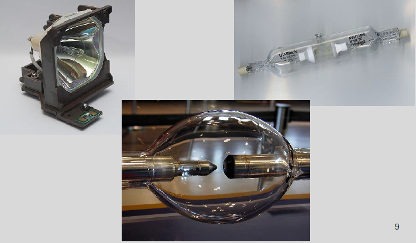
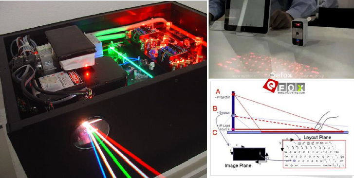
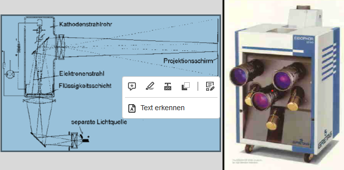
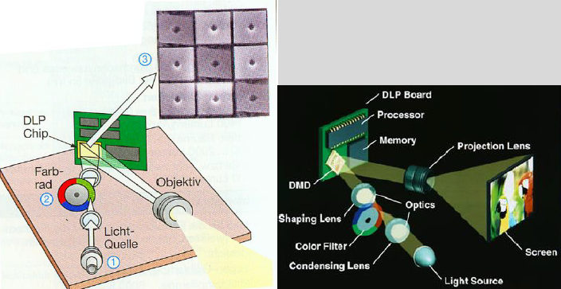

<link rel="stylesheet" type="text/css" href="../../styles.css">

# Beamer

## 2 Gliederung

- Einsatzgebiete
- Projektionstechniken
- Beleuchtungstechniken
- Vor und Nachteile
- Quellen

## 3 Einsatzgebiete

- home
- office
- Lehre
- Event
- Speziell
  - sonstige
  - Medizin (Röntgenbildprojektoren)

## 4 Projektionstechniken

*Aufprojektion oder Frontprojektion
*Rückprojektion

## 5 Rückprojektion

## 6 Frontprojektion

- analog
  - CRT[^1] Röhre
  - Eidophor
- digital
- Laserstrahl
  - DLP[^2] mit DMD[^3] Chip
  - LCD[^4]
    - transmissive
    - reflexive

[^1]: CRT cathode-ray tube is a vacuum tube containing one or more electron guns, which emit electron beams that are manipulated to display images on a ...
[^2]: DLP Digital Light Processing the image is created by microscopically small mirrors laid out in a matrix on a semiconductor chip, known as a digital micromirror device ..
[^3]: DMD Digital Micromirror Device
[^4]: LCD liquid crystal displays

## 7 Beleuchtungstechniken

- Elektronenröhre
- Glühlampen
- Gasentladungslampen
- LED[^5]
- Laser

[^5]: LED Light Emitting Diode

## 8 Beleuchtungstechniken 1 Glühlampen

## 9 Beleuchtungstechniken 2 Gasentladungslampen

## 10 Beleuchtungstechniken 3 LED

## 11 Beleuchtungstechniken 4 Laser

## 12 Projektoren

- Analoge Projektoren
- Digitale Projektoren

## 13 Analoge Projektoren 1 Eidophor

## 14 Analoge Projektoren 1 Eidophor

Das Eidophor
System war
das erste System, das
lichtstarke Bilder in hoher
Auflösung liefern konnte und
war im professionellen
Bereich bis in die späten
1980er Jahre üblich.

## 15 Analoge Projektoren 2

- Röhrenprojektoren (CRT)
- spezielle Kathodenstrahlröhren auf große Helligkeit getrimmt
- Farbpojektoren mit 3 Röhren und 3 Objektiven
- Elektromagnetische Fokussierung
  - extrem scharfes Bild:9‘ Geräte in Flugsimmulatoren , High End
    Heimkino;7‘ und 8‘ Geräte in Rückprojektionsfernseher
- Elektrostatische Fokussierung

## 16 Analoge Projektoren 2

## 17 Analoge Projektoren Vorteile

## 18 Analoge Projektoren Nachteile

## 19 Digitale Projektoren

## 20 Digitale Projektoren 1 LCD Projektoren

## 21 Digitale Projektoren 1 LCD Projektoren

## 22 Digitale Projektoren 1 LCD Projektoren

## 23 Digitale Projektoren 1 LCD Projektoren

## 24 Digitale Projektoren 1 LCD Projektoren

## 25 Digitale Projektoren 1 LCD Projektoren

## 26 Digitale Projektoren 1 LCD Projektoren

## 27 Digitale Projektoren 1 LCD Projektoren

## 28 Digitale Projektoren 1 LCD Projektoren

## 29 Digitale Projektoren 1 LCD Projektoren

## 30 Digitale Projektoren 2 DLP Projektoren

## 31 Digitale Projektoren 2 DLP Projektoren

## 32 Digitale Projektoren 2 DLP Projektoren

Beamer mit 1 Chip DLP und Farbrad

## 33 Digitale Projektoren 2 DLP Projektoren

## 34 Digitale Projektoren 2 DLP Projektore

## 35 Digitale Projektoren 2 DLP Projektore

## 36 Digitale Projektoren 2 DLP Projektore

## 37 Digitale Projektoren 3 LED-Projektoren

## 38 Digitale Projektoren 3 LED-Projektoren

## 39 Digitale Projektoren 3 LED-Projektoren

## 40 Digitale Projektoren 4 LCoS Projektoren

## 41 Digitale Projektoren 4 LCoS Projektoren

## 42 Digitale Projektoren 4 LCoS Projektoren

## 43 Digitale Projektoren 4 LCoS Projektoren

## 44 Digitale Projektoren 4 LCoS Projektoren

## 45 Digitale Projektoren 4 LCoS Projektoren

## 46 Digitale Projektoren 5 Laser Projektoren

## 47 Digitale Projektoren 5 Laser Projektoren

## 48 Digitale Projektoren 5 Laser Projektoren

## 49 Digitale Projektoren 5 Laser Projektoren

## 50 Digitale Projektoren 5 Laser Projektoren

## 51 Technikvergleich

## 52 Vergleich LCD und DLP System

## 53 Vergleich LCD und LCoS System

## 54 Picoprojektor

## 55 DLP Pico Chipset

## 56 Picobeamer für Handys

## 57 Toshiba und die Zukunft der LED Beamer

## 58 Toshiba und die Zukunft der LED Beamer

## 59 Pico Projektor Displays

## 60 Kombinierte Systeme 1

## 61 Kombinierte Systeme 1

## 62 Kombinierte Systeme 1

## 63 Technische Kennwerte für Beamer

## 64 Projektionslampen

## 65 Lampenkosten

## 66 Lampenvergleich

## 67 Projektorwahl

- Lichtverhältnisse
- Personenzahl
- Projektionsentfernung
- Projektionsfläche
- Mobil oder Stationär
- Deckenmontierbarkeit
- Format
- Zoom (BeiRöhrenbeamer nicht möglich)
- Videobildqualität
- Auflösung
- Schrägprojektionsausgleich
- Lampenlebensdauer
- Lampenkosten
- Lichtstrom
- Einsatzdauer
  -Stromverbrauch im Jahr(8 h/d, 250)
- Lüftergeräusch
- Preis

## 68 Auflösung von Projektionen

## 69

## 70 Anschlussmöglichkeiten

- DVI-D mit HDCP in D sub 15pin in und out
- 5 x BNC RGBHV in
- YUV in
- S-Video in
- Cinch Video in
- 2 x Cinch Stereo in 1 x out
- RJ45 in
- PCMCIA Slot Type-2
- RS232C D-sub15 pin
- USB Typ A
- Mini Jack in

## 71 Digitaler Kino Beamer

## 72 Geometrische Berechnungen Deckenmontage

## 73 Lichttechnische Berechnungen

„Die DIN 19045 sagt aus, dass das durch die Projektionseinheit erzeugte Licht mindestens fünfmal so hell sein muss, als die durch das Raumlicht erzeugte Bildwandleuchtdichte.“
Messung der reflektierten Beleuchtungsstärke von der Projektionswand Multiplikation mit dem 5 fachen d. Fläche 5 ergibt „Mindestlumen“ des Projektors

<o>Lichtstrom (lm (Beamer)  
= 5 x reflekt. Beleucht. st. (lx) a. d. Projektionsw x Fläche  
Beleuchtungsstärke (lx) = Lichtstrom (lm) / Fläche (m
2)<o>

## 74 ANSI Lumen

- American National Standards Institute
- International ElectrotechnicalCommission
- DIN EN 61947-1
- Erkennbarer Unterschied von 5 und 10 Prozent graugetönten Feldern
- Messung an 9 Feldern auf der „weißen Fläche“
- Ermittlung des Durchschnitts ergibt ANSI-Lumen

## 75

## 76 Beispiele für Beleuchtungsstärken

Diese Tabelle stellt Richtwerte
dar. Die wirklich auftretenden
Werte sind von Fall zu Fall
durch geeigneten Messgeräte
zu ermitteln.
Beispiel: Unterrichtsraum
Gem.: 60 lx, refl. v. Proj.
Fl.
Nach Formel: 900 lm
Ansi
lm: 1.350 alm

## 77 Lernzielkontrolle

1. Wie unterscheiden sich Front und Rückprojektion?
2.Welches sind die Unterschiede zwischen digitaler und
analoger Projektion?
3.Welche Beleuchtungssysteme gibt es?
4.Wie kann man die Beleuchtungssysteme vergleichen?
5.Welche unterschiedlichen Projektionssysteme gibt es?
6.Vergleichen Sie mindestens 2 Arten miteinander!
7.Nennen Sie mindestens 5 relevante Angaben für
Beamer!
8.Welche mathematischen Überlegungen müssen für die
Beamerwahl getroffen werden?
9.Wählen sie einen beliebigen Beamer aus dem Internet
und ermitteln Sie die Einsatzeigenschaften und
Möglichkeiten!

## 78
