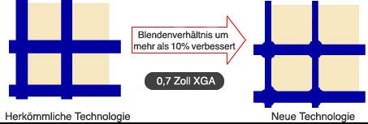
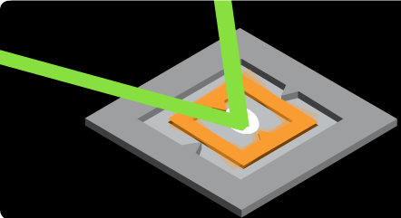
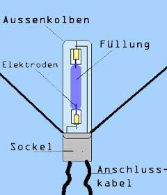
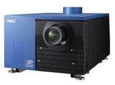

<link rel="stylesheet" type="text/css" href="../../styles.css">

# Beamer

## 2 Gliederung

- Einsatzgebiete
- Projektionstechniken
- Beleuchtungstechniken
- Vor- und Nachteile
- Quellen

## 3 Einsatzgebiete

- home
- office
- Lehre
- Event
- Speziell
  - sonstige
  - Medizin (Röntgenbildprojektoren)

## 4 Projektionstechniken

| Aufprojektion oder Frontprojektion  | Rückprojektion|
|-------------- | -------------- |
|     |      |

## 5 Rückprojektion

## 6 Frontprojektion

- analog
  - CRT[^1] Röhre
  - Eidophor
- digital
  - Laserstrahl
  - DLP[^2] mit DMD[^3] Chip
  - LCD[^4]
    - transmissive
    - reflexive

[^1]: CRT **cathode-ray tube** is a vacuum tube containing one or more electron guns, which emit electron beams that are manipulated to display images on a ...
[^2]: DLP **Digital Light Processing** the image is created by microscopically small mirrors laid out in a matrix on a semiconductor chip, known as a digital micromirror device ..
[^3]: DMD **Digital Micromirror Device**
[^4]: LCD **liquid crystal displays**

## 7 Beleuchtungstechniken

- Elektronenröhre
- Glühlampen
- Gasentladungslampen
- LED[^5]
- Laser

[^5]: LED Light Emitting Diode

### 1 Glühlampen

| -  | -   |
|   |      |
|     |      |

### 2 Gasentladungslampen

| -  | -   |
|   |      |
|     | -     |

### 3 LED[^5]

| -  | -   |
|   |      |

### 4 Laser

| -  | -   |
|   |      |

## 12 Projektoren

- Analoge Projektoren
- Digitale Projektoren

### Analoge Projektoren 1 Eidophor

| -  | -   |
|   |      |

Das Eidophor System war das erste System, das lichtstarke Bilder in hoher Auflösung liefern konnte und war im professionellen Bereich bis in die späten 1980er Jahre üblich.

 

### 15 Analoge Projektoren 2 Röhrenprojektoren (CRT)

- spezielle Kathodenstrahlröhren auf große Helligkeit getrimmt
- Farbpojektoren mit 3 Röhren und 3 Objektiven
- Elektromagnetische Fokussierung
  - extrem scharfes Bild:9‘ Geräte in Flugsimmulatoren , High End
    Heimkino;7‘ und 8‘ Geräte in Rückprojektionsfernseher
- Elektrostatische Fokussierung

| Column1  | Column2   |
|-------------- | -------------- |
|     |         |
|         |        |

## 17 Analoge Projektoren Vorteile

- Wegen der Bildröhren sind die Projektoren sehr variabel in der Auflösung. Sie können in der Regel von NTSC[^6] bis 1080p und auch 3D-Material (Bluray-3D, sequential 3D) darstellen
- Das Verfahren kennt keine Pixel (Bildpunkte). Somit werden die Bilder etwas unschärfer, aber natürlicher dargestellt.
- Es existiert fast keine Verzögerungszeit. Dadurch ist Video mit Zeilensprungverfahren (interlacing) kein Problem.
- Es ist keine Lampe erforderlich, da die Röhren selbst Licht erzeugen und typische Lebensdauern von mindestens 10.000 Stunden haben.
- Die Röhren erzeugen sehr hohe Kontraste (1 : 10.000 bis 30.000) und sehr gute Schwarzwerte.
  
[^6]: NTSC **National Television Standards Committee**, named for the group that originally developed the black & white and subsequently color television system that is used in the United States, Japan and many other countries.

## 18 Analoge Projektoren Nachteile

- Relativ geringe Gesamthelligkeit. Der Raum muss bei den meisten Modellen komplett abgedunkelt sein.
- Die Röhren sind sehr empfindlich gegenüber Einbrennen. Werden Stellen der Leuchtschicht zu stark oder zu lange angeregt, dunkeln sie dort nach und nach ab.
- Da bei Farbprojektoren die drei Projektionssysteme getrennt arbeiten, erfordern sie eine sehr aufwändige Einrichtungsprozedur. Die erschwert den mobilen Einsatz.
- Die Projektoren sind durch die Röhren sehr schwer.
- Abgesehen von älteren gebrauchten Modellen werden nur noch wenige neue Geräte gebaut (Barco, VDC).
- Gute gebrauchte bzw. neue Geräte sind immer noch sehr teuer.

## 19 Digitale Projektoren

- LCD[^4]-Projektoren
- DLP[^2]-Projektoren
- LED[^5]-Projektoren
- LCoS[^7]-Projektoren
- Laser-Projektoren
  
[^7]: LCoS Liquid crystal on silicon is a miniaturized reflective active-matrix liquid-crystal display or "microdisplay" using a liquid crystal layer on top of a silicon backplane. 

## 20 Digitale Projektoren 1 LCD[^4] Projektoren

• Funktionsprinzip, wie Diaprojektor
• 3 LCD-Elemente (3 Grundfarben - dichroitischen, jeder Bildpunkt, jede Farbe)

Epson ist Marktführer  
Viele andere nutzen die LCD[^4]-Chiptechnik

Problem Fliegengitter

| -  | -   | 
|     |    |

 
 

 

### Nachteile:

- Die scharf abgezeichnete Pixelstruktur („Fliegengitter“/Screendoor-Effekt) kann störend wahrgenommen werden,
- HD-Projektoren leiden allerdings nicht mehr so stark unter diesem Problem wie frühere XGA[^8]-Geräte.
- Aufgrund fixer Displayauflösung im Gerät ist die beste Qualität nur bei einer bestimmten Auflösung des Eingangssignals gegeben. Ansonsten ist eine qualitätsmindernde Skalierung nötig.
- Bei frühen Geräten: Nachziehen des Bildes durch die Trägheit der LCD[^4]s.

[^8]:XGA-Geräte Extended Graphics Array (XGA) is a computer display standard that provides 1,024 by 768 pixels in 256 colors, or 640 by 480 pixels in 16-bit color.

- LCD[^4]-Memory-Effekt (Einbrennen): Werden Stellen zu lange mit zu hellen Bildern angeregt, so werden diese Stellen langsam permanent dunkel.
- Ausbleichen der Farbstoffe von organischen LCD[^4]s. Nach einigen 1000 Stunden Betriebsdauer sind die Farbstoffe dieser LCD[^4]s im Allgemeinen infolge der hohen Lichtintensität ausgeblichen. Anorganische LCD[^4]-Panels, welche seit 2008 vermehrt eingesetzt werden, besitzen dieses Manko laut Herstellerangaben nicht mehr und besitzen eine „weit
längere“, allerdings mit bisher noch unspezifizierter Lebensdauer.

- Empfindlichkeit gegenüber Staub und Rauch, da sowohl die Lampe als auch die Panels mit frischer Luft gekühlt werden müssen. Eine inkapselung/Versiegelung der optischen Einheit ist daher nicht möglich (im Gegensatz zu DLP[^2]-Projektoren). In sehr staubigen oder rauchigen Umgebungen lässt die Bildqualität daher schnell nach.
- Die Lichtleistung der Lampe lässt innerhalb der ersten 100 Stunden um ca. 15 % bis 25 % nach.
- Fehlerhafte Konvergenz bei Mehr-Panel-Projektoren ist möglich

### Vorteile:

- relativ preiswert
- gute Lesbarkeit bei Texten und Grafiken durch die scharfe Abgrenzung der Bildpunkte
- klein und leicht
- im Vergleich zu Ein-Chip-DLP[^2]-Projektoren der gleichen Lichtleistungsklasse wesentlich bessere Farbintensität

## 30 Digitale Projektoren 2 DLP[^2] Projektoren

- Digital Light Prozessor
- Digital Mirror Device (Mikro-Kippspiegel)
- Helligkeitsunterschiede durch Kippfrequenz (bis 5000 Hz)
  

Beamer mit 1 Chip DLP[^2] und Farbrad

| -  | -   |
|     |     |

| -  | -   |
|     |     |

### Vorteile Digitale Projektoren DLP

- sehr hohe Geschwindigkeit, dadurch kein Nachleuchten bzw. Nachziehen des Bildes, hierdurch sehr gut für 3D-Projektion geeignet
- kein Einbrennen des Bildes (z. B. bei Computerspielen)
- höherer Kontrast (durch das tiefere Schwarz) als beim LCD-Projektor
- weniger stark ausgeprägte Pixelstruktur als bei LCD[^4]- Projektoren
- durch gekapselte Optik und langlebiges DMD weniger staubempfindlich als LCD[^4]-Projektoren

### Nachteile Digitale Projektoren DLP  

- Aufgrund fixer Displayauflösung im Gerät ist die beste Qualität nur bei einer bestimmten Auflösung des Eingangssignals gegeben. Ansonsten ist eine qualitätsmindernde Skalierung nötig.
- Regenbogeneffekte bei einigen Geräten mit Farbrad, wenn das Farbrad keine hohe Umdrehungsgeschwindigkeit hat (herstellerabhängig).
- Bei der Darstellung bestimmter, einzelner Grau- bzw. Farbwerte kann es zu einem sichtbaren Flimmern kommen.
- Farbtreue ist mitunter nicht gegeben. Insbesondere haben DLP[^2]-Projektoren ein Problem, sattes Grün darzustellen und auch alle Rot- und Orange-Farbtöne. Das betrifft hauptsächlich die Consumer-Geräte (Ein-Chip-DLP[^2]), da bei diesen die Farbradtechnik zum Einsatz kommt.
- Geräte mit Weißsegment besitzen eine schlechtere Farblichtleistung als LCD-Projektoren der gleichen Helligkeitsklasse.
- Geräuschentwicklung durch Lüfter und Farbrad
- Die Lichtleistung der Lampe lässt schon innerhalb der ersten 100 Stunden um ca. 25 % nach.

## 37 Digitale Projektoren 3 LED[^5]-Projektoren

- Lichtquellen sind LED[^5]
- Anfangs wurden noch DLP[^2] zur Bildgebung eingesetzt
- jetzt LCD[^4]-Technik

| -  | -   |
|     |     |

### 38 Digitale Projektoren LED[^5]-Projektoren Vorteile

- LEDs besitzen im Vergleich zu herkömmlichen Projektorlampen eine höhere Energieeffizienz: Bei gleicher Lichtleistung wird weniger Energie in Wärme umgesetzt, wodurch der Kühlbedarf sinkt
- Der geringere Kühlbedarf erlaubt kleinere Gehäuse und geringere Lüftergeräusche (im Extremfall Passivkühlung)
- Der geringere Energiebedarf ermöglicht den Betrieb mit einem Akku.
- LEDs halten mehr als 20.000 Stunden, während herkömmliche Projektorlampen rund 4.000 Stunden halten.
- Da die Farben durch sequenzielles Aufleuchten der RGB-LEDs gebildet werden, fällt auch das normalerweise bei DLP-Projektoren notwendige Farbrad weg

### 38 Digitale Projektoren LED[^5]-Projektoren Nachteile

- Aufgrund fixer Displayauflösung im Gerät ist die beste Qualität nur bei einer bestimmten Auflösung des Eingangssignals gegeben. Ansonsten ist eine qualitätsmindernde Skalierung nötig.
- Die Lichtleistung von LEDs ist zum Teil erheblich geringer als bei herkömmlichen Projektorlampen. Vor allem günstige Gerätebesitzen teilweise nur 1/100 der Lichtleistung herkömmlicherProjektoren. Im Sommer 2011 gab es den ersten LED-Projektor mit 1.000 ANSI-Lumen.
- Ein permanenter Lichtstromrückgang der LEDs lässt das Bild stetig dunkler werden. Ein LED-Wechsel ist teils nicht ohne weiteres möglich. Eine teilweise eingesetzte adaptive Erhöhung des LED- Stroms kann diesen Helligkeitsverlust wieder ausgleichen.
- Auch ohne Farbrad kommt es bei den DLP-basierten Modellen zum Regenbogeneffekt, da die Grundfarben nacheinander projiziert werden.

## 40 Digitale Projektoren 4 LCoS[^7] Projektoren

LCoS-Technik - Liquid Crystal on Silicon (dt.
‚Flüssigkristalle auf [einem] Silizium[substrat])

| -  | -   |
|     |     |

|     |     |

| -  | -   |
|     |     |

| -  | -   |
|     |     |

### Vorteile LCoS Projektoren

- kompakte Bauweise
- scharfe Bilder
- geringer Helligkeitsverlust bei Einsatz
hochauflösender Panels

### Nachteile LCoS Projektoren

- Aufgrund fixer Displayauflösung im Gerät ist die beste Qualität nur bei einer bestimmten Auflösung des Eingangssignals gegeben. Ansonsten ist eine qualitätsmindernde Skalierung nötig.
- leichtes Nachziehen des Bildes
- LCD-Memory-Effekt
- nachlassende Bildqualität mit zunehmender Betriebsdauer (Verringerung von Farbsättigung, Kontrast und Homogenität)
- Die Lichtleistung der Lampe lässt schon innerhalb der ersten 100 Stunden um ca. 25 % nach

## 46 Digitale Projektoren 5 Laser Projektoren

- Bildaufbau mit Hilfe eines modulierten und schnell abgelenkten Laserstrahls
- Laserdisplaytechnologie (LDT[^9])
- Graiting Light Valve V
  
[^9]: LDT Laserdisplaytechnologie

- Gera und Jena wurde die Laser Display Technology (LDT[^9]) entwickelte dabei wird das Bild zeilenweise auf die Projektionsfläche geschrieben
- Ablenkung erfolgt durch einen speziellen Scanner mit einem Facettenspiegel (Zeilenaufbau) und einem Kippspiegel (Zeilenvorschub)
- Laserstrahl wird zuvor moduliert, womit Helligkeit und Farbe jedes Bildpunktes definiert sind
- im Gegensatz zur GLV[^10]-Technologie wird der Speckle-Effekt des Lasers mit der LDT[^9] nahezu vollständig unterdrück
- der Laserstrahl wird im Picosekundenbereich gepulst.
- Gefährdungen durch den Laserstrahl werden durch die Kombination verschiedener Sicherheitstechniken ausgeschlossen
- Projektionssysteme der Laser-Display-Technologie sind im Einsatz für Flugsimulatoren - eine gesamte Halbkugel mit vier Projektoren ausgeleuchtet (360° horizontal × 90° vertikal).

[^10]: GLV grating light valve

### Vorteile Laser Projektoren

- nahezu beliebig geformte Projektionsflächen
- keine Fokussierung nötig
- sehr hoher Kontrast
- großer Gamut durch die Mischung reiner Grundfarben (RGB), also monochromatischen Lichts

### Nachteile Laser Projektoren

- begrenzte Lichtstärke
- die Laserprojektoren sind klassifiziert als Laserklasse 3R (GLV[^10]) oder 4 (LDT[^9]), der Betrieb ist daher nur durch
- entsprechend ausgebildetes Personal erlaubt.
- potentielle Gefahr für das Auge durch direkt in das Auge gelenkte Strahlen
- Alternativ gibt es auch Ansätze, bei denen der Laserstrahl aufgefächert und mit einem herkömmlichen Bilderzeuger (z. B. LCoS[^7]) kombiniert wird.

## 51 Technikvergleich

## 52 Vergleich LCD[^4] und DLP[^2] System

## 53 Vergleich LCD[^4] und LCoS[^7] System

## 54 Picoprojektor

**Pico-Projektor** mit dem Codenamen „SHOW“
Display-Entwickler Microvision miniaturisierte PicoP-Display-Engine Mikrospiegeln und Lasertechnologie basiert.

Das Kernmodul ist nur 7 mm tief und ermöglicht je nach Abstand von der Projektionsfläche bei einer Auflösung von 848x480 Pixeln eine Bilddiagonale von 12 Zoll (30 cm) bis 100 Zoll (2,50 m).

## 55 DLP[^2] Pico Chipset

480 x 320 Bildpunkte, 127 cm Diagonale, 10 lm

## 56 Picobeamer für Handys

| -  | -   |
|     |     |

VGA[^11]-Auflösung (640 x 480 Pixel) mit bis zu 40 Zoll Diagonale an die Wand.
Als Lichtquelle kommen LEDs zum Einsatz.  Dabei setzt 3M auf "Liquid Crystal on Silicon" (LCOS[^7]) in  Kombination mit einer proprietären optischen Technik.  

[^11]:VGA Video Graphics Array

## 57 Toshiba und die Zukunft der LED[^5] Beamer

| -  | -   |
|     |     |
|     |     |

 

Bei den ganz kleinen Geräten peilt man einen Lichtstrom von 10 ANSI-Lumen an, bei den größeren Varianten bis zu 1500 Lumen

## 59 Pico Projektor Displays

| -  | -   |
|     |     |

## 60 Kombinierte Systeme 1

| -  | -   |-   |
|     |  |    

Projektion mit Laser, LED und Phosphor

DLP1-Chip d.h.Regenbogeneffekt

XGA[^8]-Auflösung (1024 × 768 Pixel) WXGA-Modelle (1280 × 800 Pixel) Top-Modelle schaffen 3000 Lumen ab 1000 €

| -  | -   |-   |
|     |  |    

4K-Kinoprojektoren jetzt auch mit DLP-Technik

4 K (4096 × 2160)
2 K (2048 × 1080)

Auch in LCoS-Technik

## 63 Technische Kennwerte für Beamer

 

| -  | -   |
|     |  | 

## 64 Projektionslampen

| -  | -   |-   |
|     |  |   | 

Halogenlampen  
Metalldampflampe  
Xenon-Hochdrucklampen  
UHP[^12]-UHE[^13]-VIP[^14]-SHP[^15] Lampen  
UHP[^12] (Ultra High Performance)  

## 65 Lampenkosten

UHP[^12] = 250 bis 750 Euro  
UHE[^13] = 250 bis 750 Euro  
SHP[^15] = 250 bis 750 Euro  
VIP[^14] = 250 bis 750 Euro  
Xenon = 500 bis 1250 Euro  
Halogen = 10 bis 75 Euro  

[^12]: UHP Ultra-high-performance lamp
[^13]: UHE Ultra-high efficiency Lamp
[^15]: SHP Super High Pressure lamp
[^14]: VIP Video Projector lamp

## 66 Lampenvergleich

## 67 Projektorwahl

- Lichtverhältnisse
- Personenzahl
- Projektionsentfernung
- Projektionsfläche
- Mobil oder Stationär
- Deckenmontierbarkeit
- Format
- Zoom (BeiRöhrenbeamer nicht möglich)
- Videobildqualität
- Auflösung
- Schrägprojektionsausgleich
- Lampenlebensdauer
- Lampenkosten
- Lichtstrom
- Einsatzdauer
- Stromverbrauch im Jahr(8 h/d, 250)
- Lüftergeräusch
- Preis

## 68 Auflösung von Projektionen

svga[^16],
pal[^17],
hdtv[^18],
wxga[^19],
sxga[^20],
uxga[^21],
...

[^16]:svga Super VGA (SVGA) is a broad term that covers a wide range of computer display standards that extended IBM's VGA specification.
[^17]:pal Phase Alternate Line. This is the video format standard used in many European countries. A PAL picture is made up of 625 interlaced lines and is displayed at a rate of 25 frames per second. 
[^18]:hdtv describes a television or video system which provides a substantially higher image resolution than the previous generation ...
[^19]:wxga wide extended graphics array
[^20]:sxga Super Extended Graphics Array
[^21]:uxga Ultra Extended Graphics Array

## 70 Anschlussmöglichkeiten

- DVI-D[^22] mit HDCP[^23] in D-sub 15pin in und out
- 5 x BNC[^24] RGBHV[^25] in
- YUV[^26] in
- S-Video in
- Cinch Video in
- 2 x Cinch Stereo in 1 x out
- RJ45 in
- PCMCIA Slot Type-2
- RS232C D-sub15 pin
- USB Typ A
- Mini Jack in

[^22]: DVI-D Digital Visual Interface
[^23]: HDCP High-bandwidth Digital Content Protection
[^24]: BNC (Bayonet Neill Concelman) connector is a very common type of RF connector used for terminating coaxial cable. The Digital Visual Interface (DVI) is a video interface standard designed to maximize the visual quality of digital display devices such as flat panel LCD computer displays and digital projectors.
[^25]: RGBHV RGB Horizontal sync Vertical sync The five-wire cable that is used to connect the VGA output of a computer to the component video input of a video device such as a monitor or video processor.
[^26]: YUV stands for (Y) luma, or brightness, (U) blue projection and (V) red projection.

## 71 Digitaler Kino Beamer

## 72 Geometrische Berechnungen Deckenmontage

## 73 Lichttechnische Berechnungen

„Die DIN 19045 sagt aus, dass das durch die Projektionseinheit erzeugte Licht mindestens fünfmal so hell sein muss, als die durch das Raumlicht erzeugte Bildwandleuchtdichte.“
Messung der reflektierten Beleuchtungsstärke von der Projektionswand Multiplikation mit dem 5 fachen d. Fläche 5 ergibt „Mindestlumen“ des Projektors

<o>Lichtstrom (lm (Beamer)  
= 5 x reflekt. Beleucht. st. (lx) a. d. Projektionsw x Fläche  
Beleuchtungsstärke (lx) = Lichtstrom (lm) / Fläche (m
2)<o>

## 74 ANSI Lumen

- American National Standards Institute
- International ElectrotechnicalCommission
- DIN EN 61947-1
- Erkennbarer Unterschied von 5 und 10 Prozent graugetönten Feldern
- Messung an 9 Feldern auf der „weißen Fläche“
- Ermittlung des Durchschnitts ergibt ANSI-Lumen

## 75

## 76 Beispiele für Beleuchtungsstärken

Diese Tabelle stellt Richtwerte
dar. Die wirklich auftretenden
Werte sind von Fall zu Fall
durch geeigneten Messgeräte
zu ermitteln.
Beispiel: Unterrichtsraum
Gem.: 60 lx, refl. v. Proj.
Fl.
Nach Formel: 900 lm
Ansi
lm: 1.350 alm

## 77 Lernzielkontrolle

1. Wie unterscheiden sich Front und Rückprojektion?
2. Welches sind die Unterschiede zwischen digitaler und
analoger Projektion?
3. Welche Beleuchtungssysteme gibt es?
4. Wie kann man die Beleuchtungssysteme vergleichen?
5. Welche unterschiedlichen Projektionssysteme gibt es?
6. Vergleichen Sie mindestens 2 Arten miteinander!
7. Nennen Sie mindestens 5 relevante Angaben für
Beamer!
8. Welche mathematischen Überlegungen müssen für die
Beamerwahl getroffen werden?
9. Wählen sie einen beliebigen Beamer aus dem Internet und ermitteln Sie die Einsatzeigenschaften und Möglichkeiten!

## 78
