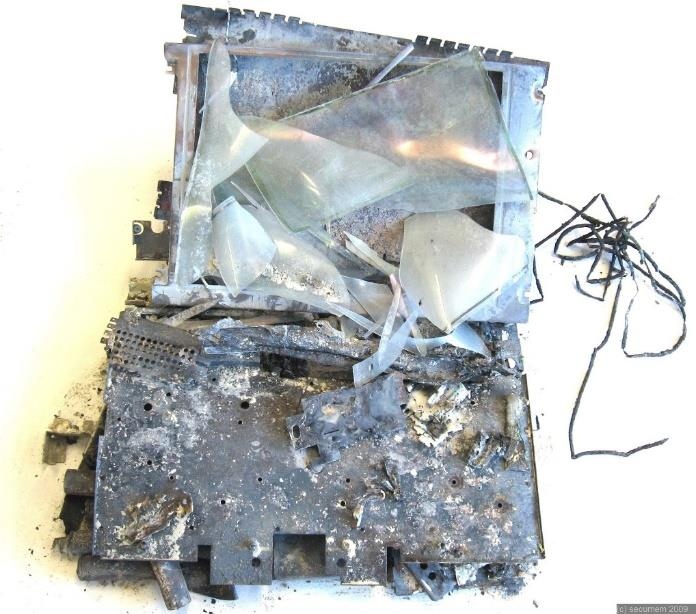

# Datenschutz?

## 1 Datensicherung?
„Kein Backup, kein Mitleid“ !!!???

## 2 Gliederung - Datensicherung
- Ursachen
- Begriff
- Notwendigkeit, Einflussfaktoren
- Sicherungsmedien
- Gesetzliche Lage
- Dokumentation
- Möglichkeiten
  - Hardwaresicherungen
  - Softwaresicherungen
- Backup
  - Verfahren
  - Varianten
- 3-Generationen-Prinzip

• Schadsoftware

## 3 Ursachen

### Hardwaredefekt: 

beschädigte Speichermedien, defekte "Controller"-Einheiten etc.

### Softwarefehler: fehlerhafte

Anwendung, Ausfall eines Dienstes oder Daemons

### Manipulation o. Fehlverhalten

des Anwenders unbeabsichtigtes Löschen oder Verändern

### Sabotage

durch Schadprogramme wie z. B. Viren, Trojaner etc. oder durch 
Mitarbeiter

## 4 Datensicherung - Begriff

### Bezeichnet das Kopieren von Daten in der Absicht, diese im Fall eines Datenverlustes zurückkopieren zu können
- Daten sind Informationen zu Personen, Sachen und Sachverhalten

- Datenverlust ist das Verlorengehen von Daten, d. h., dass sie nicht
mehr auf einem Datenträger zur Verfügung stehen,
  - Temporär
  - Dauerhaft

### Örtlich und zeitlich getrennt, Rücksicherbarkeit
### Sicherung auf anderem Medium
### 3-2-1-Regel: 3 Kopien, 2 unterschiedliche Medien, 1 Kopie extern

## 5 Notwendigkeit, Einflussfaktoren
Sicherheit
|Organisation|Infrastruktur|Mensch|Technik|
|-----|-----|-----|-----|
|-Praktischer Datenschutz -Gesetzlicher Datenschutz  -Wartung und Pflege|-Ausstattung der DV-Räume  -Elektromagnetische Strahlung -Klimatisierung der DV-Räume|-Benutzerklassifikation -Zugangskontrollen -Nutzerberechtigung|-Betriebsart -Vernetzung -Programmsicherheit|

## 6 Sicherungsmedien

- Externe Festplatten (FireWire, eSATA, USB, Netzwerk (NAS))
- Bankschließfächer, Online-Datensicherung (Cloud)
  - Gesicherter Datentransfer
  - Verschlüsselung
  - Datenschutz und -Sicherheit des Anbieters
- Feuersichere Unterbringung, Tape-Library

## 7 Gesetzliche Lage

- Gesetzliche Vorschriften über ordnungsgemäße, nachvollziehbare, revisionssichere Buchhaltung
- Kurzfristige Aufbewahrung (1 d, 3 – 6 Monate)
- Längerfristige Datenarchivierung
  - Vorhaltung der technischen Infrastruktur
  - Lesbarkeit und Haltbarkeit der Daten auf denDatenträgern

## 8 Dokumentation

### Erfolg, Geschwindigkeit und Wiederherstellung der Datensicherung

|- |-|
|-----|-----|
|Ablauf der Datensicherung |warum
|Aufbau der Archivierung |wie
|Zu treffende (Sofort-) Maßnahmen |wer
|Kompetenzen (der Mitarbeiter und Dienstleister) |was
|Prioritäten für besonders zeitkritische Daten und Systeme| welcher|
 |-|welches|
  |-|welches|
  |-|welche|
 |-|wohin|

### Dokumentation für Sicherung und Wiederherstellung ist jeweils getrennt in einem Sicherungs- bzw. Wiederherstellungsplan festzulegen

## 9 Wann und Was?

### die Änderungshäufigkeit der Daten

- geringer Änderungshäufigkeit – OS
- Generationsprinzip (Konfigurationseinstellungen, Produktivdaten, Verfallsdauer, …)

### die Art der Daten

- maschinell wiederherstellbaren Daten
- manuell wiederherstellbaren Daten
- unersetzlichen Daten

### der Wert der Daten

- Summe der Arbeitszeit, um Daten nachzuvollziehen o. neu einzugeben
- Ideller Wert?
- Informationspflicht

### und die gesetzlichen Anforderungen

- Revisionssicherheit oder Aufbewahrungspflicht
- ordnungsgemäße Führung von Buchhaltungs- und Registrierkassensystemen,dv-gestützten Buchungssystemen in Hotellerie…

## 10 Softwaresicherungen
• Absicherung gegen Übertragungsfehler
• Absicherung gegen manuelle Eingabefehler
• Absicherung gegen logische Ein- und
Ausgabefehler
• Absicherung gegen Verschiebung und
Fehlinhalte von Datenfelder

## 11 Backup-Arten
• Vollbackup
• Speicherabbildsicherung
• Differentielles Backup
• Inkrementelles Backup
• Mirror-Backup
• Snapshot

## 12 Merkmale v. Dateien
• Erstellen eines „Kataloges“
• Grundlage für weitere Backups
• Inhalt

– Pfad, Name, Erweiterung d. Dateien
– Zeitstempel (Erstellung, letzte Änderung/Zugriff)
– Größe in Byte
– Prüfsumme (Hash-Wert)
– Attribute
• r- Read only
• a- Archiv
• s- System
• h- Hidden

– Besitzer

## 13 Vollbackup
Jeweils zu sichernde Daten (ein komplettes Laufwerk, eine Partition,
bestimmte Verzeichnisse und/oder bestimmte Dateien, bestimmte
Dateiformate) werden komplett auf das Sicherungsmedium übertragen und
als gesichert markiert
•

Kopieren, Image, Klonen

• Vorteil:

– Reines Kopieren reicht

• Nachteil:

– Hoher Speicherbedarf

## 14 Vollbackup

GiB

1

2

3

4

5

Zeit

## 15 Speicherabbildsicherung (Image)

• Ist die inhaltliche Kopie eines Datenträgers oder
Datenspeichers, welche in einer Datei gespeichert
werden kann
• Es kann der komplette Datenträger oder nur eine Partition
durch ein 1-zu-1-Abbild gesichert werden
• Nutzdaten, gesamtes Dateisystem, inklusive
Betriebssystem und Benutzereinstellungen
• Vorteil:
– Bei Totalausfall kann das Speicherabbild auf den Datenträger
zurückgeschrieben werden – komplette Wiederherstellung des
Dateisystems in seiner Originalstruktur
– Nur Gerätetreiber notwendig oder ein besonderer Treiber liest
regulär das Dateisystem und extrahiert nur die gewünschten
Verzeichnisse und Dateien aus der Sicherung

## 16 Differentielles Backup
• Alle Daten, die seit der letzten Komplettsicherung geändert wurden oder neu
hinzugekommen sind, werden gespeichert
• Vorteil:
– Einsparung von Zeit und Speicherplatz
– verschiedenen Sicherungsstände können
unabhängig voneinander gelöscht werden

## 17 Differentielles Backup

GiB

1

2

3

4

5

Zeit

## 18 Inkrementelles Backup

• nur die Dateien oder Teile von Dateien werden
gespeichert, die seit der letzten inkrementellen
Sicherung oder (bei der ersten inkrementellen
Sicherung) seit der letzten Komplettsicherung
geändert wurden oder neu hinzugekommen sind
• Es wird immer auf der letzten inkrementellen
Sicherung aufgesetzt
• Nachteil:

– Bei Wiederherstellung müssen die Daten aus mehreren
Sicherungen wieder zusammengesucht werden
– Mittels verschiedener Techniken muss gewährleistet sein,
dass die vollständige Kette (Vollsicherung –
inkrementelle Sicherungen 1, 2, 3 usw. - Originaldaten)
fehlerfrei nachvollziehbar ist

## 19 Inkrementelles Backup

## 20 Inkrementelles Backup

GiB

1

2

3

4

5

Zeit
## 21 Varianten – Inkrementelles Backup
• forward deltas*:

– Vollsicherung dient als Fundament und wird nicht
verändert, während darauf die Inkremente aufgebaut
werden
– aktueller Datenbestand kann nur unter Berücksichtigung
von Inkrementen wiederhergestellt werden

• reverse deltas:

– Hat sich eine Datei gegenüber der letzten Vollsicherung
verändert, wird die vorherige Dateiversion als Inkrement
gespeichert – während die derzeit aktuelle Version in die
Vollsicherung eingefügt wird
– Auf die Vollsicherung kann jederzeit problemlos
zugegriffen werden, während eine ältere Version einer
Datei nur durch Berücksichtigung der Inkremente
wiederhergestellt werden kann

## 22 Mirror-Backup
• Identisch mit einer vollständigen Sicherung
• Dateien nicht in Zip-Dateien komprimiert und nicht mit
einem Passwort geschützt
• Exakte Kopie der Quelldaten
• Vorteil, Backup-Dateien können leicht mit Tools wie
Windows Explorer abgerufen werden

## 23 Snapshot
•
•
•
•
•
•

•

•
•

Sichern einer Partition als Image Datei
Restaurierung einer Partition mit der erstellten Imagedatei
Restaurierung einer kompletten Festplatte mit allen Imagedateien
Die in der Imagedatei enthaltenen Dateien anschauen
Ein Disk Image ist ein exaktes Abbild eines Laufwerks in einer
Datei
Dieses Laufwerk kann zu einem späteren Zeitpunkt in genau
diesem Zustand wiederhergestellt werden
Dieser Zustand beinhaltet nicht nur die 'normalen' Daten, sondern
auch alle Daten des Betriebssystems (DLL's, Registry,...), alle
Attribute der Daten (Komprimiert, Eigentümerschaft, zuletzt
geändert am, Verschlüsselung, ...), usw.
Geöffnete Dateien werden in dem Zustand gesichert, wie sie
derzeit auf der Festplatte liegen
keinen Neustart erforderlich, Benutzer kann weiterarbeiten

## 24 Übersicht

## 25 Übersicht
GiB

GiB

GiB

1

2

3
Zeit

4

5

1

2

3
Zeit

4

5

Arbeitsaufträge:
• Differentielles BU:
• Archivierungsbit der Dateien wird nur nach
Vollbackup zurückgesetzt
• Folge-BU. beeinflussen Archivb. nicht

• Inkrementelles BU:
• Archivbit wird nach jeder Sicherung zurückgesetzt

1

2

3
Zeit

4

5

## 26 Übersicht - Backup
BackupTyp

Zu sichernde
Daten

Backup-Time

Restore-Time

StorageSpace

Voll-Backup

ALLE Daten

am längsten

schnell

hoch

Inkrementelles
Backup

NUR
neue/modifizierte Daten

schnell

angepasst

am geringsten

Differentielles
Backup

ALLE Daten
(neue/modifizierte) seit
Voll-BU

angepasst

schnell

angepasst

Mirror-Backup

NUR
neue/modifizierte Daten

am schnellsten am schnellsten am höchsten

## 27 3-Generationen-Prinzip
• Großvater-Vater-Sohn-Prinzip
• mehrere Sicherungen in verschiedenen
zeitlichen Abstufungen vorhanden
• Sind „Sohn“-Daten beschädigt, werden sie
aus den „Vater“-Daten wieder erzeugt
und die „Vater“-Daten gegebenenfalls aus
den „Großvater“-Daten

## 28 3-Generationen - Beispiel
•

•
•

•

•

Der Sohn – das tägliche Backup ist die erste Generation.
Für jeden Tag der Woche erfolgt eine (inkrementelle oder) differenzielle
Datensicherung auf ein separates Speichermedium.
Dabei werden die Daten gesichert, die seit dem letzten vollen Backup geändert
wurden, oder hinzugekommen sind.
Einmal in der Woche, üblicherweise ist das ein Freitag, wird eine Ausnahme
gemacht und keine inkrementelle, sondern eine volle Datensicherung mit dem
gesamten Bestand vorgenommen.
Die Freitagssicherungen, also die wöchentlichen Backups, bilden die zweite
Generation: den Vater.
Der Vater „erbt“ sozusagen einen vollen Wochendatenbestand vom Sohn.
Genau wie beim Tagesbackup hat jede Wochensicherung ihr eigenes
Speichermedium.
Jeweils am Monatsanfang wird die Wochensicherung aus der Rotation
herausgenommen und einem neuen Zyklus zugeführt. Diese Monatssicherung
ist damit die dritte Generation: der Großvater.
Zum Jahresende wird aus der „Generation Großvater“ die Sicherung mit dem
Jahresabschluss entnommen und separat verwahrt. Sie bildet damit sogar eine
vierte Generation.

## 29 3-Generationen-Prinzip

## 30 3-Generationen-Prinzip 2
Söhne
VB0

Mo

Di

Mi

Do

Fr

Vater

1. Woche

DMo1

DDi1

DMi1

DDo1

DFr1

VB1

2. Woche

DMo2

DDi2

DMi2

DDo2

DFr2

VB2

3. Woche

DMo3

DDi3

DMi3

DDo3

DFr3

VB3

4. Woche

DMo4

DDi4

DMi4

DDo4

DFr4

VB4

5. Woche

DMo5

DDi5

DMi5

DDo5

DFr5

VB5

Großvater

VB Monat 1

Jährlicher Aufwand an Datenträgern = 22

## 31 Datensicherungsstrategien
• Wie die Datensicherung zu erfolgen hat.
• Wer für die Datensicherung verantwortlich ist.
• Wann Datensicherungen durchgeführt werden.
• Welche Daten gesichert werden sollen.
• Welches Speichermedium zu verwenden ist.
• Wo die Datensicherung sicher aufbewahrt wird.
• Wie die Datensicherung vor Datendiebstahl zu
sichern ist (zum Beispiel durch Verschlüsselung).
• Wie lange Datensicherungen aufzubewahren sind.
• Wann und wie Datensicherungen auf ihre
Wiederherstellbarkeit überprüft werden.

## 32 Weiteres zu Strategien
• Wenn die Wiederherstellung von Daten notwendig ist, sollte das
Vorgehen mehreren Mitarbeitern bekannt sein. Eine Checkliste für
diesen Fall ist sehr nützlich, da im Ernstfall oft niemand Zeit oder Nerven
hat, nachzudenken, was als Nächstes zu tun ist.
• Nach Möglichkeit sollten die Daten vor der Sicherung nicht komprimiert
werden. Redundanz kann bei der Wiederherstellung von Daten nützlich
sein.
• Es ist zumindest ein Laufwerk bereitzuhalten, welches die verwendeten
Medien lesen kann.
• Der wirtschaftliche Nutzen von Datensicherungen (Kosten, um die Daten
ohne Datensicherung wiederherzustellen) muss in einem sinnvollen
Verhältnis zu dem für die Datensicherung betriebenen Aufwand stehen.
• Der einzig sichere Beweis einer erfolgreichen Datensicherung ist der
Nachweis, dass die gesicherten Daten auch vollständig und innerhalb
eines angemessenen Zeitraums wiederhergestellt werden können. Aus
diesem Grund sollten in regelmäßigen Abständen Rücksicherungstests
erfolgen.

## 33 Medien zur Datensicherung
• Festplatten (HDD)
• Magnetbänder großer
Kapazität
– Digital Linear Tape
– Linear Tape Open

• Optische Speicher
– CD-R
– DVR-R
– DVD-RAM (WORM)

• Onlinesicherungen
– Cloud
–…

## 34 Schadsoftware
•
•
•

https://de.wikipedia.org/wiki/Schadprogramm
http://www.was-ist-malware.de/allgemein/schadsoftware/
http://www.verivox.de/themen/schadsoftware/

## 35 Computerviren, Würmer, Pferde und
Hintertüren
• Malware, kopieren sich in Programme, Dokumente o.
Datenträger
• Würmer verbreitet sich direkt über Netze
• Kombination eines scheinbaren nützlichen
Wirtsprogrammes mit einem versteckt arbeitenden,
bösartigen Teil, oft Spyware oder eine Backdoor
• ermöglicht Dritten einen unbefugten Zugang
(„Hintertür“) zum Computer, jedoch versteckt und
unter Umgehung der üblichen
Sicherheitseinrichtungen. Werden genutzt, um den
kompromittierten Computer als Spamverteiler oder
für Denial-of-Service-Angriffe

## 36 Spyware, Adware, Scareware, Ransomware, Grayware

• Forschen den Computer und das Nutzerverhalten
aus und senden die Daten an den Hersteller oder
andere Quellen
• Den Benutzer zu verunsichern und dazu zu verleiten,
schädliche Software zu installieren oder für ein
unnützes Produkt zu bezahlen
• Blockiert den Zugriff auf das Betriebssystem bzw.
verschlüsselt potenziell wichtige Dateien und fordert
den Benutzer zur Zahlung von Lösegeld auf – meist
über das digitale Bezahlsystem
• Eigene Kategorie, benutzt, um Software wie Spyware
und Adware oder andere Varianten, die
Systemfunktionen nicht direkt beeinträchtigen, von
eindeutig schädlichen Formen abzugrenzen

## 37 Dialer, Rogueware, Krypto-Mining

• Führen die Einwahl heimlich, d. h. im Hintergrund und
vom Benutzer unbemerkt, durch und fügen dem
Opfer finanziellen Schaden zu, der etwa über die
Telefonrechnung abgerechnet wird
• Gaukelt dem Anwender vor, vermeintliche andere
Schadprogramme zu entfernen. Manche Versionen
werden kostenpflichtig angeboten, andere Versionen
installieren weitere Schadprogramme während des
Täuschungsvorgangs
• Schädliche Form der Finanzierung von Webseiten,
wenn die Hardware- und Energieressourcen der
Benutzer unbemerkt und ohne deren Zustimmung
zum rechenintensiven Mining verwendet werden

## 38 Weitere „Probleme“
• Alternativer Datenstrom
• Botnet
• Contentfilter
• Crimeware
• Dropper
• Informationssicherheit
• Keylogger
• Logikbombe
• Malicious Code
• Pharming
• Phishing
• Riskware
• Vishing

## 39 Gliederung - Datenschutz
• Begriff
• Grundsätzliche Bestimmungen
• Besonders geschützt
• Rechte der Betroffenen
• Datenschutzrechtliche Bestimmungen
• Datenschutzbeauftragte

## 40 Datenschutz - Begriff
• organisatorische und technische Maßnahmen gegen Missbrauch
von Daten innerhalb einer Organisation
• IT-Sicherheit betrifft die technischen Maßnahmen gegen Löschen
und Verfälschen von Daten
• Verordnung enthält Vorschriften zum Schutz natürlicher Personen
bei der Verarbeitung personenbezogener Daten und zum freien
Verkehr solcher Daten
• Verordnung schützt die Grundrechte und Grundfreiheiten
natürlicher Personen und insbesondere deren Recht auf Schutz
personenbezogener Daten
• Der freie Verkehr personenbezogener Daten in der Union darf
aus Gründen des Schutzes natürlicher Personen bei der
Verarbeitung personenbezogener Daten weder eingeschränkt
noch verboten werden
•

https://www.datenschutz-wiki.de/index.php?title=DSGVO:Art_1&mobileaction=toggle_view_mobile

## 41 Grundsätzliche Bestimmungen
• Verbotsprinzip mit Erlaubnisvorbehalt –
Erhebung, Verarbeitung, und Nutzung
personenbezogener Daten ist verboten
• Geregelt wird der Umgang mit
personenbezogenen Daten – beschreiben
persönliche oder sachliche Verhältnisse einer
natürlichen Person
• Nicht in den Geltungsbereich des BDSG fallen
Daten über juristische Personen
• https://de.wikipedia.org/wiki/Bundesdatenschutz
gesetz

## 42 Besonders geschützt
• besondere Arten von Daten gemäß
§ 3 Abs. 9 BDSG
• rassische und ethnische Herkunft
• politische Meinung
• religiöse oder philosophische
Überzeugungen
• Gewerkschaftszugehörigkeit
• Gesundheit und das Sexualleben

## 43 Rechte der Betroffenen
• Auskunft darüber, ob und welche personenbezogenen Daten über
sie gespeichert sind
• Auskunft darüber, aus welchen Quellen diese Daten stammen
und zu welchem Verwendungszweck sie gespeichert werden
• Berichtigung von falschen personenbezogenen Daten
• Beschwerderecht bei der zuständigen Aufsichtsbehörde für den
Datenschutz
• Löschung oder Sperrung ihrer Datensätze.[6] Anstatt einer
Löschung wird immer dann eine Sperrung durchgeführt, wenn
einer der im Gesetz diesbezüglich vorgesehenen Tatbestände
erfüllt ist (z. B. gesetzliche Aufbewahrungsfristen).
• Übermittlung persönlicher Daten an Dritte zu untersagen

## 44 Datenschutzbeauftragte
• Wenn personenbezogene Daten
automatisiert verarbeitet werden
– In allen öffentlichen Stellen
– In nicht-öffentlichen Stellen, wenn mehr als neun
Personen ständig mit der Verarbeitung dieser
Daten beschäftigt sind oder Zugriff auf die Daten
haben

• Bei nicht automatisierter Verarbeitung greift
die Vorschrift ab 20 Personen
• https://de.wikipedia.org/wiki/Datenschutzbea
uftragter

## 45 Lernzielkontrolle
•

Was verstehen Sie unter Datensicherung?

•

Was verstehen Sie unter Datenschutz?

•

Was sind Daten?

•

Welche Daten unterliegen dem Datenschutzgesetz?

•

Nennen Sie Einflussfaktoren auf die Datensicherheit!

•

Was verstehen Sie unter Datenverlust?

•

Nennen Sie 3 Möglichkeiten der Realisierung der Datensicherung!

•

Nennen Sie 3 Hardware-Möglichkeiten des Datenschutzes!

•

Nennen Sie grundlegende Forderungen für eine Datensicherung!

•

Nennen Sie die 3 Arten des Backups und erläutern Sie diese in Stichpunkten!

•

Nennen Sie 5 Fakten die in der Dokumentation der Datensicherung enthalten sein müssen!

•

Wie unterscheiden entsprechende Programme, ob eine Datei gesichert werden muss oder nicht? Gehen Sie dabei auf die Backupvarianten ein!

•

Vergleichen Sie die 3 Arten des Backups bezüglich folgender Kriterien:
–
Zeitaufwand bei der Sicherung,
–
Zeitaufwand bei der Rücksicherung,
–
Datenvolumen auf den Sicherungsmedien,
–
Einschätzung der Datenwiederherstellbarkeit.

•

Nennen Sie mindestens 3 gebräuchliche Speichermedien für die Datensicherung und treffen Sie eine Aussage über die Haltbarkeit!

•

Nennen Sie Schnittstellen für die Übertragung der Datensicherung auf das Sicherungsmedium und treffen Sie eine Aussage über die
Übertragungsgeschwindigkeit!

•

Wenn Sie in einer Firma ein Datensicherungskonzept einführen sollen, für welche Datenträger würden sie sich entscheiden? Begründen Sie Ihre
Aussage!

•

Was verstehen Sie unter dem 3-Generationen-Prinzip der Datensicherung?

•

Wie viele Datenträger benötigen Sie für die Datensicherung nach dem 3-Generationen-Prinzip für ein Jahr, wenn Sie täglich, wöchentlich und
monatlich sichern?

## 46 Abschluss
Vielen Dank für Ihre Aufmerksamkeit!

Für weitere Fragen stehe ich Ihnen gerne zur
Verfügung.

