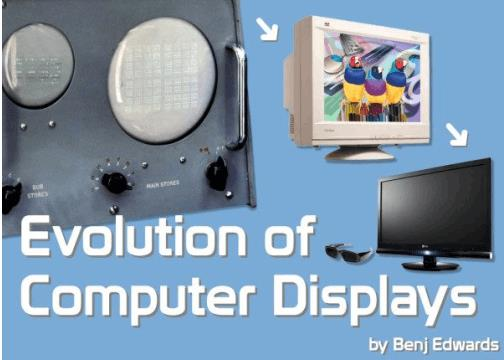
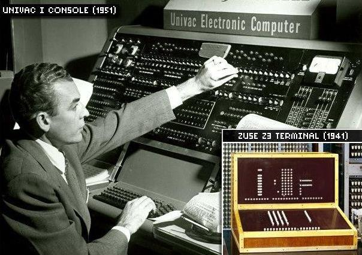
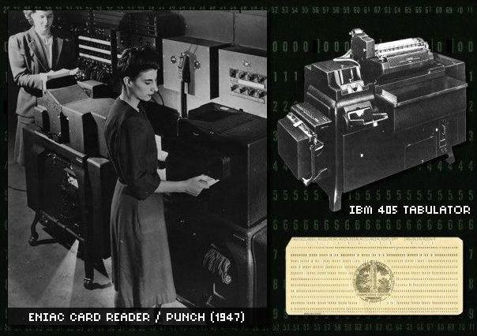
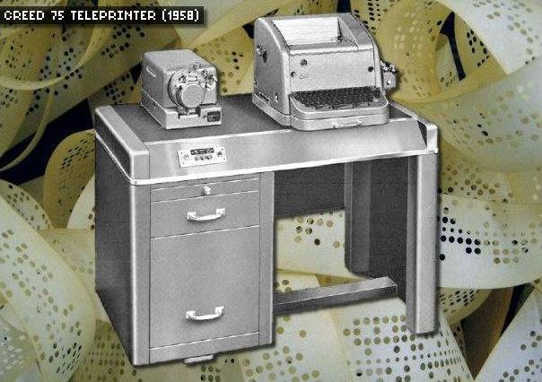
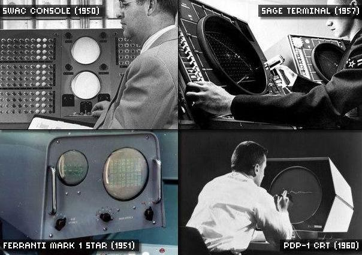
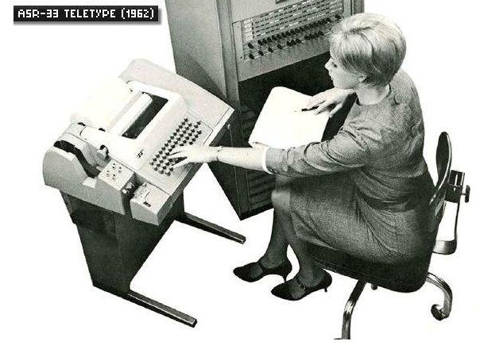
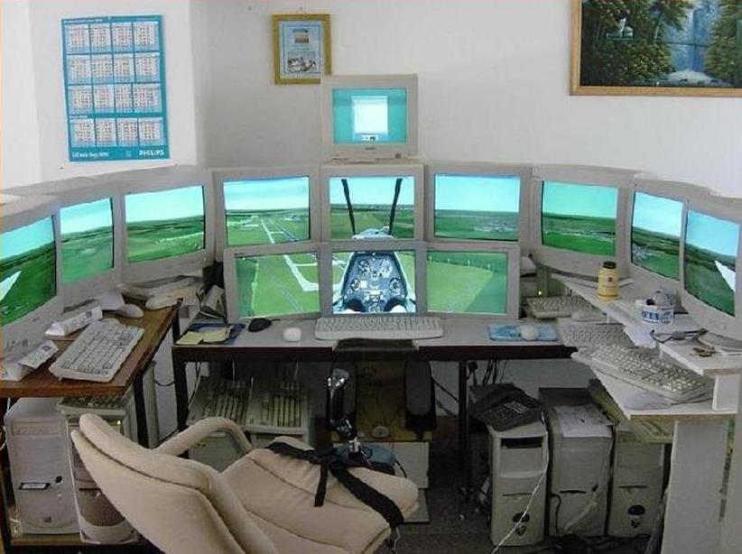

# Monitore Displays

## 1 Entwicklung und Aufbau

## 2 Gliederung

• Entwicklungsgeschichte
• Arten von Displays
• Sehen und Farben
• Auflösung

## 3 Historisches

• Erste Anzeigen
• Drucker
• CRT[^1]
• LCD[^2]
• …

[^1]: CRT cathode-ray tube
[^2]: LCD liquid crystal display

## 4 Die Evolution vom Blinklicht zum Hightecmonitor

[https://www.computerwoche.de/g/die-geschichte-der-monitore,40928,2](https://www.computerwoche.de/g/die-geschichte-der-monitore,40928,2)

| -                      | -                      |
| ---------------------- | ---------------------- |
|  |  |

## 5 Drucker, Lochkarten, Lochstreifen?

| -                      | -                      |
| ---------------------- | ---------------------- |
|  |  |

## 6 Beginn der CRT[^1]-Technik

| -                      | -                      |
| ---------------------- | ---------------------- |
|  |  |

## 7 Arten von Displays

- CRT[^1] – Monitor
  - RGB
  - TCO 99/Strahlung[^3]

- TFT – Monitor
  - LCD[^2] – Panel
  - TN[^4]
  - MVA[^5]/PVA[^6]
  - IPS[^7]
  - Backlight
    - ELF[^8]
    - CCRL[^9]
    - LED[^10]
    - QLED[^11]

- Plasma – Panel
- OLED[^12]–Panel
- Touchscreen
  - Resistiv
  - Kapazitiv
  - Induktiv
  - Infarot

[^3]: TCO 99/Strahlung Das Prüfsiegel TCO ’99 erweitert den Geltungsbereich auf die Kategorien Flachbildschirme, Kathodenstrahl-Monitore, Desktop- und Notebook-PCs, Tastaturen und Drucker.
[^4]: TN Twisted Nematic effect was a main technology breakthrough that made LCDs practical. Unlike earlier displays, TN-cells did not require a current to flow for operation and used low operating voltages suitable for use with batteries.
[^5]: MVA multidomain vertical alignment technology is a type of VA technology. It was developed in 1996 by the Fujitsu company.
[^6]: PVA Patterned Vertical Alignment is a type of thin-film transistor (TFT) liquid crystal display. It is a wide viewing angle technology best known for use in Samsung TVs for improving front screen performance at different angles.
[^7]: IPS IPS is a screen technology for liquid-crystal displays. In IPS, a layer of liquid crystals is sandwiched between two glass surfaces. The liquid crystal molecules are aligned parallel to those surfaces in predetermined directions. 
[^8]: ELF
[^9]: CCRL
[^10]: LED
[^11]: QLED
[^12]: OLED

## 8 Sehen und Farben

## 9 CRT[^1] Cathode Ray Tube Kathodenstrahlröhrenbildschirm

• Basiert auf Braunscher Röhre (Ferdinand Braun)
• Einsatz:
– Fernseher
– Monitor
– Oszilloskop

• Merkmale

– Analoge Azeige
– Gute Skalierbarkeit
– Maß: Diagonale in cm oder Zoll/Inch (ca. 2,54 cm)
– Größerer Bildschirm = mehr Bildpunkte, „Pixel“
– Umwandlung der digitalen Signale in analoge über
RAMDAC notwendig
– Monitor - Darstellung in Rastergrafik (Übertragung pro
Bildpunkt)

## 10 CRT[^1] Cathode Ray Tube - Aufbau

• Geheizten Glühkathoden erzeugt
drei Elektronenstrahlen
• Anschließend werden diese mit
elektrostatischer Fokussierung
im Vakuum in Richtung Schirm
geschossen
• Eine Loch- oder Schlitzmaske
sorgt für eine scharfe Abbildung
• Auf der Leuchtschicht wird durch
Fluoreszenz ein mehr oder
minder heller Leuchtfleck erzeugt
• Die Bildwiederholraten werden in
Herz angegeben
• (TV 50Hz, PC 80Hz)
• Nachleuchtdauer beeinflusst
Flimmer-Freiheit und die
Bildwiederholrate

## 11 CRT[^1] Cathode Ray Tube –Interlace / Progressive Scan

• Interleaced Scan
– Erster horizontalen Durchlauf
baut nur jede zweite
ungerade Zeile auf
– Zweiter vertikaler Durchlauf
baut die übrigen geraden
Zeilen auf

• Progressive Scan
– Das Bild wird in voller
Auflösung zeilenweise
erzeugt
– Doppelte Zeilenzahl bessere Bilder
– Teurere Technik, die
Horizontalablenkeinheit muss
die doppelte Frequenz liefern

## 12 CRT[^1] Cathode Ray Tube – Interlace – Progressive Scan

Bildaufbau - Interlace

Interlace vs. Progressive Scan

## 13 CRT[^1] Cathode Ray Tube – Vor- und Nachteile

• Vorteile

– Guter Schwarzwert
– Vom Betrachtungswinkel fast vollständig
unabhängige Farbdarstellung, auch bei dunklen
Bildpartien
– Keine vorgegebene Idealauflösung
– Echte Skalierung
– Schnelle Reaktionszeit
– Lange Haltbarkeit

• Nachteile

– Groß und schwer
– benötigt viel Abstellfläche
– Mögliche Beeinflussung durch externe Magnetfelder
– Nachleuchten des Leuchtschirms

## 14 CRT[^1] Cathode Ray Tube – Strahlung

• Ältere Braunsche Röhren setzen durch Bündelung
und Abbremsen des Elektronenstrahls Strahlung frei
• Bei über 20.000 Volt entsteht elektromagnetische und
Röntgen (Brems-)Strahlung
• 1987 wurde in der Röntgenverordnung ein max. Wert
für die Röhren festgelegt
• Das dicke Glas wird als Schirmung genutzt
• Zusätzlich mischen Hersteller dem Glas Blei und
andere Metalle bei
• TCO[^3] 99 - praktisch vollständig gegen
Strahlungsaustritt abgeschirmt

## 15 LCD[^2] - Typen

## 16 LCD[^2] - TN[^4] Twisted Nematic – nematische Drehzelle

• Spannung nicht angelegt
(Prinzip):
– Polarisiertes Licht fällt in die TNZelle ein
– Licht wird beim Durchlaufen des
Flüssigkristalls um 90° gedreht
– Der zweite um 90° gedrehter
Polarisator kann passiert werden
– Reflektiertes Licht und kann
austreten
– Anzeige erscheint weiß
(Hintergrundbeleuchtung)

• Spannung angelegt
– Licht wird nicht gedreht
– Licht kann den Polarisator nicht
passieren
– Anzeige bleibt dunkel

## 17 LCD[^2] - TN[^4] Twisted Nematic – nematische Drehzelle

• Spannung nicht angelegt
(Reflektives Display - TR ):
– Polarisiertes Licht fällt in die
TN-Zelle ein
– Licht wird beim Durchlaufen
des Flüssigkristalls um 90°
gedreht
– Der zweite um 90° gedrehter
Polarisator kann passiert
werden
– Spiegel reflektiert Licht und
kann austreten
– Anzeige erscheint silbrig-grau

• Spannung angelegt
– Licht wird nicht gedreht
– Licht kann den Polarisator
nicht passieren
– Anzeige bleibt dunkel

## 18 LCD[^2] - Farbdisplay

•
•
•
•
•

•

Hinter jedem Pixel sind waagerechte
stäbchenförmige Flüssigkristalle
Jedes Pixel besteht aus mehreren
Subpixeln(RGB)
Je höher die Spannung ist, desto
senkrechter stehen die Stäbchen
Je senkrechter die Ausrichtung
desto dunkel das Bild
Um dem schlechten
Blickwinkelstabilität zu
kompensieren wird ein spezieller
Verzögerungsfilm
aufgebracht(TN+Film)
Leuchtstoffröhre strahlte von außen
hinter das Panel und wurde dort von
einer Kombination milchiger und
spiegelnder Folien nach vorn
reflektiert (keine Gleichmäßige
Verteilung)

## 19 TN[^4] - Übersicht

Bezeich.

Langform

Erläuterung

CCSTN

Color Coded Super
Twisted Nematic

Farbdarstellung mit 45 Farben, erzeug durch
Doppelbrechung

CSTN

Color Super
Twisted Nematic

16-bit-Farbdarstellung mit hoher Helligkeit und
gutem Kontrast

DSTN

Double Super
Twisted Nematic

Monochromatische Darstellung mit höheren
Kontrastwerten als TN[^4] u. STN

FSTN

Film Super
Twisted Nematic

Reduzierung von störenden Farbeffekten
durch aufgeklebten Film

STN

Super Twisted Nematic

Basistechnologie mit monochromatischer und
eingeschränkter Farbdarstellung

TSTN

Triple Super
Twisted Nematic

Kompensation von unerwünschten
Farbeffekten durch mehrere Filme

TN[^4]

Twisted Nematic

Basistechnologie für LCD[^2]-Displays mit
unterschiedlichen Polarisationsebenen

## 20 Panelarten - TN-Panel

• Twisted Nematic
• Jeder Pixelbesteht aus stäbchenförmigen
Flüssigkristallen, die permanent mittels
geeigneter Beleuchtung
hintergrundbeleuchtet sind
• Je höher die anliegende Spannung ist, desto
mehr verlagern sich die Stäbchen senkrecht
zur Bildebene - gehen also in die Tiefe - und
lassen dadurch das Licht immer weniger
durchscheinen - dunkler Pixel, kein echtes
Schwarz - weil immer etwas Licht
durchscheint
• Einfache und kostengünstige Produktion Monitore mit TN[^4]-Panel auch die günstigsten
im Handel
• Großer Vorteil ist die relativ schnelle
Reaktionszeit von bis zu einer Millisekunde
für einen Wechsel von Grau zu Grau
• Nachteil ist die hohe Blickwinkelabhängigkeit
und die unterdurchschnittliche Farb- und
Kontrastdarstellung

•

Vorteile:
–
–

•

Nacheile
–
–
–

•
•
•
•

günstig in der Anschaffung
schnelle Reaktionszeiten
schlechterer Kontrast
schlechtere Farben
Blickwinkelabhängig

Einsatz
Schnelle Reaktionszeit macht TN[^4]-Panel sehr
interessant für Spieler - Wiederholungsraten
von 144 Hz oder gar 240 Hz
Günstige Anschaffungspreis
https://www.hardwareschotte.de/magazin/ips
-oder-TN[^4]-panel-was-ist-besser-a42019

## 21 MVA[^5]-Technik

• Multi-Domain-Vertical-AlignmentTechnik - Mehrfach Zellen
Vertikale Ausrichtung –Fujitsu
• Funktion
– Spannung nicht angelegt
•
•
•

Kristalle ist fast vertikal ausgerichtet
Spannung angelegt
Kristalle werden horizontal
Ausgerichtet
Hintergrundlicht kann jetzt die Schicht
durchdringen

• Eigenschaften
–
–
–
–
–

MVA[^5] höheren Kontrast (> 1000:1)
TN[^4] niedriger Kontrast (< 800:1)
Höherer Betrachtungswinkel
langsamer als TN[^4]-Bildschirme
Premium-MVA[^5] und Super-PVA[^6] <=
5ms und höhere Farbtreue < S-IPS
– Anwendungsbereich CAD/CAM,
DTP und Medizintechnik

## 22 IPS[^7]-Technik

• In Plane Switching - In
Ebenen schaltend –
Hitachi
• Funktion
–Moleküle der
Flüssigkristalle sind parallel
bzw. horizontal zum
Substrat ausgerichtet
–Elektroden sind in Form
eines Kammes nur auf der
unteren Glasplatte
angebracht
–Erfordert hohes Backlight

• hervorragende Blickwinkel
= CRT[^1]

## 23 IPS[^7] und S-IPS

• Pixel lassen sich genauer
Schalten
• Kristalle bleiben immer
waagerecht ausgerichtet
• Orientierung wird nur um 90 Grad
geändert (Zeiger Uhr)
• Licht kann das Pixel nahezu
ungehindert passieren
• Keine Farbveränderung bei
Berührung
• Betrachter kann selbst geringe
Farbdifferenzen auch bei
benachbarten Pixeln ganz genau
unterscheiden
• Bis zu 178 Grad
Betrachtungswinkel
• Durchschnittlich 15% höherer
Stromverbrauch als TN[^4]/VA

## 24 Flachbildschirm - Aufbau

• Licht der
Hintergrundbeleuchtung
hinterleuchtet das PixelPanel
• Pixel des Panels passen
ihre Transparenz an und
regulieren so die
Lichtmenge
• Entspricht Diaprojektor
• Einzelpixel entsprechen
einer Signallampe

## 25 Hintergrundbeleuchtung

• ELF[^8]
• CCFL
• LED[^10]-Leisten
• LED[^10]-Matrix (statisch, dynamisch)
• Q-LED

## 26 ELF[^8] - Elektrolumineszenz Folie

• Elektrolumineszenz ist die
Eigenschaft bei Anlegen
eines elektrischen Feldes
Licht zu emittieren
• Zwischen
zwei leitenden Schichten
liegt, elektrisch isoliert, das
Elektrolumineszenze
Material
• kam bis ca. 2008 vor allem
bei Uhren zum Einsatz
(blau oder blau-grün)
• Benötigt hohe Spannung
(200 V) zur Ansteuerung
• Zu geringe Leichtdichte

## 27 CCFL - Cold Cathode Fluorescent Lamp

• Kaltkathodenröhren
• Mehrere Kaltlichtkathodenröhren
sind parallel hinter dem
Bildschirm angebracht
• Eine Streufolie verteilt das Licht
der Röhren über die Bildfläche
• Gleichmäßige Lichtverteilung
kann nur durch einen
Mindestabstand zur Bildfläche
erreicht werden
• LCD[^2] mit CCRT hat somit eine
Mindesttiefe von 35 mm
• Benötigt verhältnismäßig hohe
elektrische Spannungen und
Leistungen

## 28 CCFL

• CCFL können immer nur
als ganze in der Helligkeit
gesteuert werden
• Um Mond und Lava hell
erscheinen zu lassen
müssen alle Röhren im
entsprechenden Bereich
aufgedreht werden
• Dadurch werden
ungewollt auch eigentlich
dunkle Bildinhalte
aufgehellt
• Das Bild verliert an Farbe
und Kontrast

## 29 LED[^10] – Light Emitting Diode (Edge)

• Light Emitting Diode lichtemittierende Diode (Edge LED)
• Die LEDs sitzen nur am Rand des
Gerätes
• Über Prismen (Spiegel) wird das
Licht dann auf eine lichtverteilende
Kunststoffschicht geleitet
• Die Anordnung der LEDs am Rand
variiert je nach Hersteller
• Flache Bauweise möglich
• Clouding - es kommt auf der
gesamten Bildfläche zu Lichthöfen
• Flashlights - helle Lichtkegel in den
Ecken
• Banding - helle oder dunkle Streifen,
meist beim schnellen
Kameraschwenk

## 30 LED[^10] – Light Emitting Diode (Matrix)

• LEDs von hinten über die
ganze Bildschirmfläche
angeordnet
• Local Dimming / LEDGruppen stärker oder
schwächer
• Jede der LED´s kann
separat angesteuert werden
• Sehr hohes
Kontrastverhältnis möglich
• Kein Clouding
• Verbesserte Kontrast- und
Schwarzwerte
• Größere Bauweise (tiefer)

## 31 Aktive LED[^10]-“White“

Hintergrundbeleuchtung
• Die Aktive LED-“White“
wird dem Bildinhalt
angepasst
• Überaus „schwierige“
Bildinhalte werden
optimal wiedergegeben
• Nur helle Cluster „hinter“
dem Mond und der Lava
• Sehr hohe Kontraste
• Weniger Farben als die
„RGB“- Variante

## 32 Aktive LED[^10]-RGB (Matrix)

• LED´s sind
abwechselnd in den
Farben RGB (Rot,
Grün, Blau) angeordnet
• Zusätzlich in kleine
Bereiche (sogenannte
Cluster) unterteilt
• Cluster können
unabhängig
voneinander gesteuert
werden

## 33 Aktive LED[^10]-RGB (Matrix)

• Grelle Farben, direkt
angrenzend an tiefes
Schwarz und
Helligkeitsverläufe
• Vereinfacht dargestellt
leuchtet die aktive LEDRGB
Hintergrundbeleuchtung
nur in besonders hellen
Bereichen des Bildes
• In dunklen Bereichen wird
sie herunter gedimmt
• In schwarzen Bereichen
ist sie komplett aus

## 34 QLED[^11] - Quantum Dots

•
•
•
•
•
•

•
•
•
•

Folie mit winzigen Nano-Partikeln, die selbst
Licht abgeben
Quantum Dots absorbieren die Licht-Energie
und geraten selbst in Schwingungen
Schwingen nur in etwas geringerer Frequenz
als das eintreffende Licht
Je nach Größe geben sie Schwingungen in
blauer, grüner, gelber oder roter Farbe ab
Dots werden in präzise ausgesuchten
Größen mit hochreinem blauem LED[^10]-Licht
angeleuchtet
Weniger ungewünschte Mischfarben müssen
weggefiltert werden
Es entsteht ein reineres Rot, satteres Grün,
klareres Blau und ein helles und viel reineres
weißes Licht
Die Maximalhelligkeit steigt/große
Farbpalette = HDR
Größere Dots schwingen etwas langsamer
als kleine
Entwickelt von Nanosys und QD Vision

## 35 PDP - Plasma Display Panel

•
•
•
•
•
•

PDP - Plasma Display Panel - Ionisiertes
Gas – Bildschirm
Zwischen zwei Glasplatten befinden sich
mehrere Beinahe-Vakuumkammern
Gefüllt mit einem Edelgasgemisch aus Neon
und Xenon
Kammer wird mittels Transistor gezündet
(Ionisiertes Gas)
Grundfarben in den Kammern werden durch
verschiedene Leuchtstoffe (Phosphore)
erzeugt
Helligkeit würd über verschiedene Intervalle
der Zündungen geregelt
–

•
•
•

(Längere Zündung = helleres Bild)

Dünnes Gas = niedrige Temperaturen
Zur Zündung sind Spannungen von einigen
hundert Volt erforderlich
Die Funktionsweise ähnelt der einer
Leuchtstofflampe

## 36 OLED[^12] - Organic Light Emitting Diode

• OLED[^12] - Organic Light Emitting
Diode - organische Leuchtdiode
• Absolut selbstleuchtend
• LED[^10] die durch eine
Elektrolumineszenz-Schicht
funktioniert und aus Verbundfolie
besteht
• Diese agiert wie ein Halbleiter
• Der Film ist in zwei
verschiedenen Elektroden
eingesetzt
• Strom- und Leuchtdichte sind
geringer als bei LCD[^2]
• Keine einkristallinen Materialien
zur Bildwiedergabe erforderlich
• Aufbau aus rot, grün, blau und
weißen LED[^10]’s

## 37 OLED[^12] - Organic Light Emitting Diode

• Vorteile:
– OLED[^12]s können auf fast jedes
Material „gedruckt“ werden
– Benötigt keine
Hintergrundbeleuchtung
– Sehr hoher Kontrast, da keine
Restliche das Bild beeinflusst
– Extrem flache Bauweise
möglich
– Noch bedingt Biegsam

• Nachteile:
– Vergleichsweise geringe
Lebensdauer
– 2013 ca. 36000 Stunden
– 2016 ca. 100.000 Stunden
(ca. 30 Jahre bei 10 St.
Nutzung Täglich)

## 38 Touchscreen

• Single/Multitouch
• Optische Systeme, Optische Systeme (in der
Regel Infrarotlicht-Gitter vor dem Monitor)
• Resistive Systeme
• Oberflächen-kapazitive Systeme
• Projiziert-kapazitive Systeme
• Induktive Systeme
• SAW (Surface Acoustic Wave) –
„(schall)wellen-gesteuerte Systeme“
• Dispersive-Signal-Technology-Systeme

## 39 Touchscreen – Single/Multitouch

• Berührungssensitive Bildschirmoberfläche, die
beim Berühren Aktionen auslöst
– Single-Touchscreen
– Dual-Touchscreen
– Multi- Touchscreen

• Anwendung
– Präsentationsterminals
– Fahrzeugdiagnose
– Industrie- und Anlagensteuerung
– Industrie-PCs, der Medizintechnik, in Kassen- u.
Bankautomaten
– Smartphones, Tablets, PDA, Handhelds

## 40 Optische Systeme

•
•

•
•
•
•
•
•
•

erste Touchscreens waren noch gewölbte
Röhrenbildschirme mit plane Fläche eines
Lichtschrankengitters
Paar aus LED[^10] und Sensor – liefen zeilenund spaltenweise zwischen Spalten oder
Lochreihen in der Brüstung des BildschirmGehäuserahmens und wurden durch eine
Fingerspitze optisch unterbrochen
Auflösung in der Größenordnung von 5 mm
Kann ohne Probleme durch eine
Schutzscheibe gesichert werden
(Panzerglas)
Kann unbeabsichtigt ausgelöst werden
(Schnee u. Insekten)
Sehr Robust
Temperatur unabhängig
Stoß und vibrationsfest
Geldausgabe- oder Fahrscheinautomaten

## 41 Resistiv

•
•
•
•
•
•

•
•

Druckempfindlich
Kann mit Finger, Fingernagel, Stift, Handschuh
usw. bedient werden
Besteht aus zwei Schichten
Obere Schicht aus Polyester und die darunter
liegende meist aus Glas
Eine Schichten wird unter Gleichspannung gesetzt
(Glas)
Durch das zusammen drücken der Schichten kann
man die Spannung an der oberen Polyesterfolie an
den Rändern messen und erhält so die Position der
Druckstelle
Four-, Five-, Six-, Seven-, Eight-Wire
Vorteile
–
–
–
–

•

Bedienung mit jedem Eingabestift möglich
Mit Handschuhen und Prothesen bedienbar
Genauer als kapazitive Touchscreens
Geringe Fertigungskosten

Nachteile
–
–
–
–
–

Nur eingeschränktes Multitouch (Two-touch)
Schlechte Lesbarkeit bei Sonneneinstrahlung durch
Zusatzschicht
Gestenbedienung aufgrund des notwendigen Drucks
erschwert
Verschleiß durch die mechanische Belastung beim
Betätigen
Unerwünschtes Auslösen beim Transport durch
Kontakt mit anderen Gegenständen möglich

## 42 Oberflächen-kapazitive Systeme

• Funktionieren auch ohne
Druck
• Auf eine Glasplatte wird eine
durchsichtige leitfähige Folie
aufgebracht
• Über Wechselstrom entsteht
ein elektrisches Feld, das auf
Berührung reagiert
• Der entsendete Stromfluss
wird an den Ecken gemessen,
um die Position Ihres Fingers
zu ermitteln
• Widerstandsfähiger
gegenüber Kratzern und
Verschleiß

## 43 Projiziert-kapazitive Systeme

•
•
•
•

•
•
•

nutzt zwei Ebenen mit einem leitfähigen
Muster
Ebenen sind voneinander isoliert angebracht
Eine Ebene dient als Sensor, die andere
übernimmt die Aufgabe des Treibers
Befindet sich ein Finger am Kreuzungspunkt
zweier Streifen, so ändert sich die Kapazität
des Kondensators – Signal am
Empfängerstreifen
Sensor auf der Rückseite des Deckglases
angebracht
Erkennung wird „hindurchprojiziert“
Vorteile
–

•

Leitfähige Eingabestifte

Nachteile
–
–
–

Nur mit bloßem Finger bedienbar
Nicht mit Handschuhen
Nicht Barrierefrei

## 44 Induktive Systeme

•

Nachteil:
–

•
•

•

•

•

Nur spezielle Eingabestifte

Handballen rufen keine Reaktion hervor
Die Bildschirmoberfläche kann – wie auch
bei den projiziert-kapazitiven Touchscreens
– aus Glas oder einem ähnlich robusten
Material angefertigt werden, da keine
mechanische Einwirkung wie bei den
resistiven Modellen notwendig ist.
Die Stiftposition kann auch ermittelt werden,
wenn der Stift die Oberfläche nicht berührt,
sondern sich in einem (geringen) Abstand
über ihr befindet.
Der Induktionsstrom kann verwendet
werden, um zusätzliche Elemente des Stiftes
zu betreiben, zum Beispiel Knöpfe oder
Druckmesser, um zu ermitteln, wie fest der
Stift auf die Oberfläche gedrückt wird.
Einige Modelle können überdies auch den
Neigungswinkel des Stiftes ermitteln.

## 45 Abschluss

Vielen Dank für Ihre Aufmerksamkeit!

Für weitere Fragen stehe ich Ihnen gerne zur
Verfügung.
