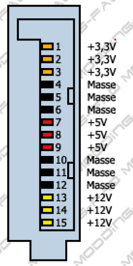

# Schaltnetzteile für PC

# Wie erhält der PC seine Betriebsspannungen?

## 2 Gliederung

- Netzteil – Begriff und Wirkungsweise
- Analognetzteil
  - Aufbau
  - Wirkungsweise
  - Vor- und Nachteile
- Schalt(Digital)netzteil
  - Aufbau
  - Wirkungsweise
  - Vor- und Nachteile
- Begriffe

## 3 Begriff und Wirkungsweise

- Netzspannung 230/115 Volt~, 50 Hz, max. 10/20 Ampere
- PC benötigt 12 Volt-, 5 Volt-, 3,3 Volt-
- PC benötigt hohe Ströme ca. 20 Ampere und mehr
- Umwandlung der Wechselspannung in niedere Gleichspannung mit hoher Amperezahl
- Bereitstellung mehrerer Ausgangsspannungen
- Stabilisierung der Ausgangsspannungen

| 230 V        |     |     |     | 12 V, 40 A      |
| ------------ | --- | --- | --- | --------------- |
| **50 Hz**    | ->  | ??? | ->  | **5 V, 60 A**   |
| **Max 16 A** |     |     |     | **3,3 V, 20A ** |

## 4 Analognetzteil 01

### Kondensator-Netzteil (☻)

<f>!!! KEINE galvanische Trennung!!!</f>

## 5 Analognetzteil

### galvanisch getrennt

## 6 Digital-(Schalt-)Netzteil (PC)

Netzteil (PC)")

## 7 Komponenten

(Baugruppen/Elemente)

- Spule, Induktivität
- Kondensator, Kapazität
- Diode, Gleichrichter
- Transistor, Schalter
- Übertrager (Transformator)
- DC-Wandler
- Analoge Regelung (OPV mit Vergleichsspannungsquelle)
- Galvanische Trennung, Potentialtrennung (Optokoppler)
- Steuerung/Überwachung, Pulsweitenmodulation

## 8 Das PC-Netzteil

## 9 Komponenten Kondensator

- Besteht aus 2 isoliert voneinander aufgewickelten Folien
- Speichert Elektronen (Kapazität)
- nF-Bereich
- Nicht polaritätsabhängig
- Beeinflusst die Kurvenform
  von Strom und Spannung
- Bestandteil von Filterschaltungen

  

## 10 Komponenten Spule

- Besteht aus einen gewickelten Kupferdraht
- Mit/ohne Kern (Eisen oder Ferit)
- Induktivität – Bestandteil v. Filtern
- Beeinflusst die Kurvenform von Strom und Spannung
- Zur Unterdrückung von Störimpulsen
- Strom durchfließt die Spule -> Selbstinduktion
- Hochfrequente Wechselströme werden minimiert

  

## 11 Komponenten Filter

- Bereinigt die Kurvenform
- Verhindert Oberwellen,
  Spannungsspitzen und -
  Einbrüche
  

## 12 Komponenten Varistoren

- Schützen vor Überspannungen
- verändern ihren Widerstandswert in Abhängigkeit der anliegenden Spannung VDR[^3]

  

[^3]: VDR Voltage Dependent Resistor

## 13 Komponenten Gleichrichter

- Meist Dioden, Halbleiterbauelement
- Als Einweg-, Zweiweg oder Brückengleichrichter
- Schotky-Dioden für hoch-frequente Spannungen u.starke Ströme
- Lässt Strom in nur einer bestimmten Richtung durch
- Eignen sich auch für Begrenzung der Ausgangsspannung

## 14 Komponenten Glättung

- Elektrolytkondensator
- Dielektrikum ist Oxidschicht
- Hohe Kapazitäten
- Verringerung der Welligkeit des pulsierenden Gleichstroms
- Polaritätsabhängig  
  

## 15 Komponenten Schalttransistor

- Erhält Steuersignal von Mikrokontroller
- Schaltet durch oder sperrt über Basisanschluss
- Schaltet (Zerhackt) die Gleichspannung in eine Rechteckspannung
- 

## 16 Komponenten Übertrager

- Besteht aus mindestens zwei Spulen und einem Ferrit-Kern
- Primärspule: höhere Wechselspannung, kleiner Strom
- Sekundärspule: niedrigere Wechselspannung, hoher Strom
- Spulen sind galvanisch getrennt
- https://www.electronics-tutorials.ws/de/transformatoren/transformator-grundlagen.html
- Transformator 1000 VA:
  - 150 x 176 x 153, 14 kg ( 2 kg Cu)
  - Ca 130 €
  - Ohne Elektronik

## 17 Komponenten DC-Wandler

- Wandeln 12 V in andere benötigte Spannungen um
- Reduziert die Spannung von 12 V auf 5 V und 3,3 V
- Microcontroller, Spulen und Kondensatoren
- Erhöht die Effizienz auf über 90 %

## 18 Komponenten Analoge Regelung

- (OPV)[^2] + Vergleichs-spannungsquelle
- Ausgangsspannung wird mit Normspannungsquelle verglichen
- Abweichungen werden über Optokoppler an Mikrokontroller gegeben
  
  [^2]: (OPV)

## 19 Komponenten Galvanische Trennung

- Optokoppler
- Trennt die Nieder-spannungsseite von der Hochspannungsseite  
  

## 20 Komponenten Steuerung/Überwachung

- Steuert das Zerhacken der Gleichspannung in hochfrequente Rechteckspannung (~4 kHz)
- Verantwortlich für Pulsweitenmodulation
- Regelung der Ausgangsspannung

## 21 22 SchaltNetzteil

LEGENDE:  
1: Netzfilter (z.B. Drosselpule, X- und Y-Kondensatoren)  
2: Gleichrichter (z.B. Brükengleichrichter oder einzelne Dioden)  
3: Glättungskondensator  
4: Leistungstransistor (z.B starker MOSFET)  
5: Übertrager ("Trafo)  
6: Steuerelektronik  
7: Optokoppler

## 23 Stecker und Verbindungen

- ATX-Stecker Motherboard
- ATX-Stecker Prozessor
- Molex-Stecker (klein/groß)
- SATA-Stecker
- PCIe-Stecker für Grafikkarte

## 24 25 26 ATX-Stecker

\*Von der Kabelseite gesehen!

| pin             |         | Signal | Kabelfarbe a                                             | Funktion b            |
| --------------- | ------- | ------ | -------------------------------------------------------- | --------------------- |
| ATX 1.0 bis 2.1 | ATX 2.2 |        |                                                          |                       |
| 1               | 1       | 3,3 V  | 
 Orange            |
| 2               | 2       | 3,3 V  | 
Orange             |
| 3               | 3       | Masse  | Schwarz                                                  |
| 4               | 4       | 5 V    | 
 Rot                  |
| 5               | 5       | Masse  | Schwarz                                                  |
| 6               | 6       | 5 V    | 
Rot                   |
| 7               | 7       | Masse  | Schwarz                                                  |
| 8               | 8       | PWR_OK | 
Grau                 | Power Ok              |
| 9               | 9       | 5 VSB  | 
Violett            | +5 V-Standby-Spannung |
| 10              | 10      | 12 V   | 
 Gelb |                       |
| 10              | 11      | 12 V   | 
Gelb  |                       |
| 2               | 12      | 3,3 V  | 
Orange             |                       |
| 11              | 13      | 3,3 V  | 
Orange             |                       |
| 12              | 14      | −12 V  | 
Blau                 |                       |
| 13              | 15      | Masse  | Schwarz                                                  |                       |
| 14              | 16      | PS ON  | 
Grün                | Power Supply On       |
| 15              | 17      | Masse  | Schwarz                                                  |                       |
| 16              | 18      | Masse  | Schwarz                                                  |                       |
| 17              | 19      | Masse  | Schwarz                                                  |                       |
| 18              | 20      | −5 V   | 
Weiß   | nur bei ATX-1.x       |
| 19              | 21      | 5 V    | Rot                                                      |                       |
| 20              | 22      | 5 V    | Rot                                                      |                       |
| 20 e            | 23 5 V  | Rot    |                                                          |
| 17 e            | 24      | Masse  | Schwarz                                                  |                       |

## 27 Molex-Stecker

- Zur Spannungsversorgung von Laufwerken
  - HDD, CD/DVD/BR
- und Zusatzkarten (nachgerüstete Schnittstellen)
- Gelb - 12 V
- Rot – 5 V
- Schwarz – 0

  

## 28 SATA-Stecker

- Neue Verbindung für
  die Stromversorgung
  der Laufwerke
- HDD/opt LW/SSD
- Kompatibel zu anderen
  Formfaktoren
  (3,5‘‘/2,5‘‘)

  

## 29 PCIe-Stecker

- Spannungs-
  versorgung
  stromhungriger
  Grafikkarten
- 6-pol. – 150 W
- 8-pol. – 225 W
- 2 x 8 pol. – 300 W
  

## 30 Das Netzteil/innen

- 1 EMI
- 2+3 PFC+AC/DC
- 2+4 PFC+PWM
- 5 AC/AC
- 6+7 AC/DC+Siebung
- 8 Feedback
  

## 31 Abkürzungen - Bedeutung

- EMI
  - Elektromagnetische Interferenz
  - Filter gegen Störungen
- PFC
- +AC/DC
- 2+4- PFC+PWM
- 5 - AC/AC
- 6+7- AC/DC+Siebung
- 8 - Feedback

## 32 Blockschaltbild

LEGENDE:  
1: Netzfilter (z.B. Drosselpule, X- und Y-Kondensatoren)  
2: Gleichrichter (z.B. Brükengleichrichter oder einzelne Dioden)  
3: Glättungskondensator  
4: Leistungstransistor (z.B starker MOSFET)  
5: Übertrager ("Trafo)  
6: Steuerelektronik  
7: Optokoppler

## 33 Arbeitsweise

- EMI – Elektromagnetische Interferenz - sorgt für Störimmunität
  gegenüber dem Versorgungsnetz
- PFC – Power Factor Correction – (cos φ)
  - Blindleistungskompensation
- AC/DC – Gleichrichtung der gesiebten Netzspannung
- PWM – Erzeugung einer hochfrequenten Rechteckspannung,
  Modulation der Pulsweite zur Belastungsausgleich
- AC/AC – Transformation der Spannung in einen geringeren
  Spannungsbereich durch Hochleistungsübertrager
- AC/DC – Gleichrichtung der Spannung
- Glättung der Gleichspannung durch z. B. Kondensatoren
- Überwachung und Regelung der Spannung

## 34 Gesamtschaltung

## 35 AC-Eingang

## 36 Spannungsteiler

• Spannungsteiler zur Beschaltung des Schaltspannungsreglers
Regelung der Ausgangsspannung
37Spannungssummierschaltung
• Spannungssummierschaltung zur Beschaltung des Spannungsreglers
38High-End vs Einsteiger
• Be Quiet! Straight Power E9 480W CM • Be Quiet! Pure Power L8 500W
39Vergleich 1
40
Straight Power E9 480 CM Pure Power L8 500W
Dauerleistung 480 Watt 500 Watt
Spitzenleistung 550 Watt 550 Watt
Powerfaktor bei 100% Last 0.99 0.97
Leistungsaufnahme im Stand-by 0.30 Watt 0.30 Watt
Durchnittliche Lebensdauer 300.000 h 100.000 h
Anzahl der 12V Leitungen 4 2
3,3V 24 A 24 A
5V 22 A 15 A
12V1 18 A 28 A
12V2 18 A 20 A
12V3 18 A
12V4 18 A
Max. Gesamtleistung 12V 456 Watt 456 Watt
Max. Gesamtleistung 5V + 3.3V 130 Watt 120 Watt
Hold-up-Time 19 ms 16 msVergleich 2
41
Straight Power E9 480 CM Pure Power L8 500W
80+ Zertifizierung Gold Bronze
Effizienz bei 20% 89.7% 84%
Effizienz bei 50% 92.8% 87%
Effizienz bei 100% 91.4% 84%
Lautstärke - 100% Last 18.8 dB(A) 25.1 dB(A)
Multi-GPU Ja Nein
Hersteller Garantie 5 Jahre 3 Jahre
80+ Zertifizierung Gold Bronze
Effizienz bei 20% 89.7% 84%
Effizienz bei 50% 92.8% 87%
Effizienz bei 100% 91.4% 84%
Lautstärke - 100% Last 18.8 dB(A) 25.1 dB(A)
Multi-GPU Ja Nein
Hersteller Garantie 5 Jahre 3 JahreBegriffe
42
Straight Power E9 480 CM Pure Power L8 500W
OCP - Überstromschutz P P
OVP - Überspannungsschutz P P
UVP - Unterspannungsschutz P P
SCP - Kurzschlussschutz P P
OTP - Überhitzschutz P P
OPP - Überlastschutz P PAnschlüsse 1
ohne Kabelmanagement
Be Quiet! Pure Power L8 500W – 60 €
43Anschlüsse
mit Kabelmanagement
Be Quiet! Straight Power E9 480W CM – 100€
44
http://www.bequiet.com/volumes/PDM/_products/bn197/bn1
97_cbl.jpg80 Plus Zertifizierung -
Wirkungsgrad
Der Wirkungsgrad ist definiert durch
η = Abgegebene Leistung/Zugeführte Leistung
4580 Plus Zertifizierung -
Wirkungsgrad
46
Leistungsfaktor 0,90 0,90 0,90 0,90 0,95
Wirkungsgrad
bei 20% Last
(Idle)
80% 82% 85% 87% 90%
Wirkungsgrad
bei 50% Last
(schwache
Last)
80% 85% 88% 90% 92%
Wirkungsgrad
bei 100% (volle
Last)
80% 82% 85% 87% 89%Symbole auf Netzteil
47
• http://www.bequiet.com/de/psucalculatorLernzielkontrolle
• Wie unterscheiden sich Analognetzteile von Digitalnetzteilen?
• Erläutern Sie kurz die Arbeitsweise eines Digital-(Schalt)-Netzteils!
• Wie lassen sich Störungen aus der Versorgungsspannung herausfiltern?
• Welche Bauelemente richten die Wechselspannung gleich?
• Wodurch erreicht man die kleinere Bauform eines Digitalnetzteils gegenüber einem Analognetzteil bei gleicher oder sogar höherer Leistung?
• Was bedeuten die bezüglich der Spannungsverarbeitung gebräuchlichen Abkürzungen?
– EMI
– PFC
– AC/DC, AC/AC, DC/DC,
– PWM
• Was bedeuten die bezüglich von eingebauten Schutzeinrichtung gebräuchlichen Abkürzungen?
– OCP, OVP
– UVP
– SCP
– OTP
– OPP
• Was muss beim Austausch eines PC-Netzteiles beachtet werden? Nennen Sie mindestens 3 Fakten!
• Was verstehen Sie unter Kabelmanagement?
• Nennen Sie mindestens 3 verschiedene Stecker, die im PC für die Stromversorgung der Komponenten eingesetzt werden!
• Nennen Sie 3 wichtige Spannungen im PC, die das Netzteil bereitstellt!
• Was verstehen Sie unter dem „Power-Good-Signal“?
• Erläutern sie die Angaben auf dem Typenschild!
• Welche Parameter und Gegebenheiten sind beim Austausch eines Netzteils zu beachten?
• Sie wollen ein Netzteil überprüfen. Dafür steht Ihnen nur ein Vielfachmesser zur Verfügung. Worauf müssen Sie achten, damit Sie brauchbare Messwerte
bekommen?
• Neue Netzteile haben einen Schalter auf der Rückseite. Wozu dient er und warum ist er notwendig?
• Was passiert beim Betätigen des Einschaltknopfes an der (z. B.) Frontseite des PC? Bitte erläutern Sie dies in Stichpunkten.
• Welche Möglichkeiten bieten sich durch das Schalten mit Fronttaster?
• Was bedeutet der Begriff „Effizienz“ eines Netzteils?
• Was bedeutet der Power-Korrekturfaktor? (cos φ)
