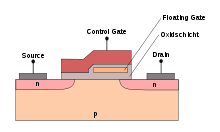
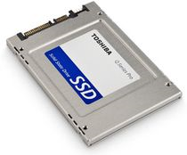
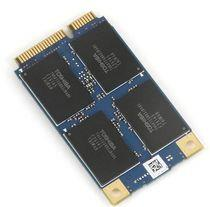
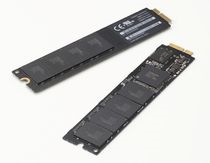
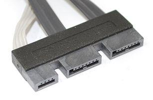
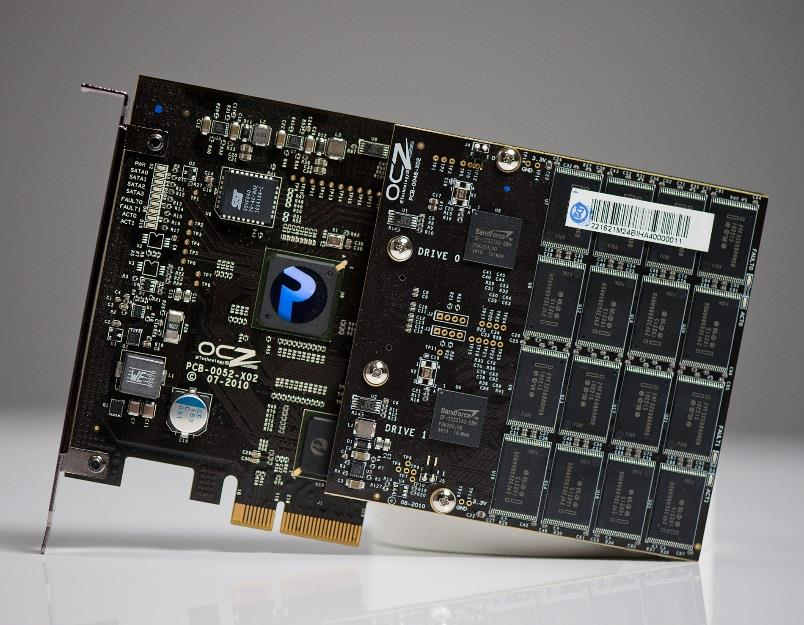
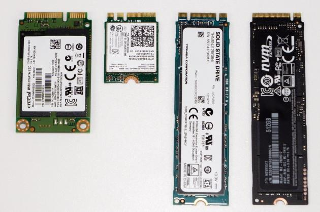
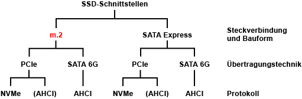
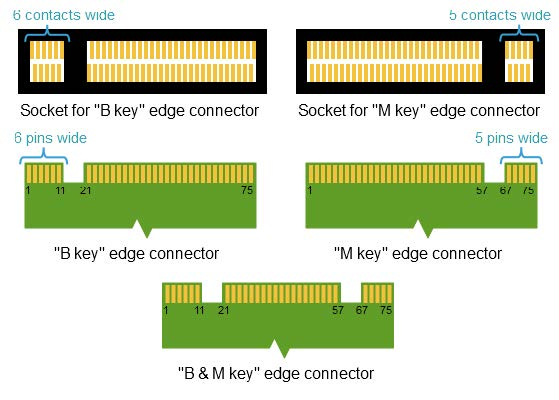
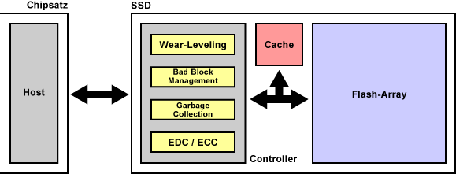

# Solid State Drive?

## 1 Die neue ”Festplatte”  

(Keine HDD!)

## 2 Gliederung

- Begriff, Eigenschaften
- Technische Daten

## 3 Begriff und Eigenschaften

- Solid State Drive/Disk
- Kein mechanisches Laufwerk oder Scheibe
vorhanden
- Lautlos
- Stolßfest
- Energiearm (Kapazitatsabhangig)
- Kuhl
- Schnell (hohe Zugriffsgeschwindigkeiten
Lesen/Schreiben)
- Flash-Speicher

## 4 Technische Daten

|- |hdd |ssd|
|-----|-----|-----|
|  Datenrate | 0,6 Gbit/s  | 128 Gbit/s|
|  Zugriffszeit |  3,5 ms |   0,1 ms|

## 5 Speicherprinzip

- Flash-Speicher (-EEPROM)

  - Nicht flüchtig (non volatile memory, kurz NVM[^1])
  - Elektrisch blockweise löschbar

- MOSFET[^2] - Floating-Gate Transistor

[^1]: NVM non volatile memory
[^2]: MOSFET The metal–oxide–semiconductor field-effect transistor (MOSFET, MOS-FET, or MOS FET) is a type of field-effect transistor (FET), most commonly fabricated by the controlled oxidation of silicon. It has an insulated gate, the voltage of which determines the conductivity of the device.

## 6 Speicherkapazitat

- Hoher Platzbedarf > feinere Halbleiterstrukturen mehr Speicherkapazitat bei gleicher Chipgröße

- Nachteil — Verkleinerung macht Floatinggate empfindlicher und starkerer Stromverbrauch

- Anderung d. Ladezustandes (Schreiben) belastet Floating-Gate und umgebende Sperrschichten

- Speicherdichte pro Speicherzelle erhöhen — mehr Zustande pro Zelle (SLC[^3] > MLC[^4] > TLC[^5])
- Anzah der Schreibvorgange sinkt, Verschleiß
- Fehlerkorrekturmaßnahmen notwendig
- Aktuelle Kapazität(03/2018): 100 TB,  
Nimbus Data ExaDrive DC100, 10.000 €

[^3]: SLC Single-level cell is memory cell, which can store only one bit per memory cell
[^4]: MLC multi-level cell is a memory cell capable of storing more than a single bit of information
[^5]: TLC Triple-level cell memory cell, which can store 3 bits per cell

## 7 Lesen und Schreiben

### Lesen

- 2 — 4 kByte aus Flash-Zellen lesen und in Pufferspeicher
schreiben — sehr schnell

### Schreiben

- Flash-Speicher ist blockweise organisiert
(128 bis 512 kByte)
- Bei Anderungen muss der betreffende Block komplett neu geschrieben werden, davor muss er gelöscht werden
- Hohe Löschspannung — alle Zellen verlieren den Inhalt
- Daten aus Puffer in Flash-Zellen einlesen
- NCQ[^6](Native Command Queuing - fangt die
Schreibzugriffe ab, sortiert sie um, intelligente Verteilung auf die einzelnen Speicherblöcke)

[^6]: NCQ Native Command Queuing

## 8 Schreiben

- 1 Block = 256 Pages mit je 8 KiB

- Zum Schreiben und Löschen werden Blöcke
nochmalig zusammengefasst

- Erst wenn alle zusammengefassten Blécke nicht
Aktuell sind, werden sie geldscht

|Schreibvorgang |1 |2|3|4|5|
|-----|-----|-----|-----|-----|------|
|1 Block|
 Bild.jpg | 
unaktuell| 
unaktuell| 
löschen|
Bild.jpg |
|2 Block| Leer|
Bild.jpg |
unaktuell|
löschen | Leer|
|3 Block| Leer| Leer|
Bild.jpg| 
löschen| Leer|
|4 Block| Leer| Leer| Leer|Leer | Leer|
|5 Block| Leer| Leer|Leer | Leer| Leer|
 
## 9 Bauformen - Schnittstellen

 
|???| ???| 
|-----|-----| 
|| |
|????| ????|
|||
|????| ????|
|||

- SATA[^8]
- mSATA[^9]
- PCIe[^10]
- M.2[^7]
- SATAe

[^8]: SATA Serial Advanced Technology Attachment

[^9]: mSATA Mini-Serial ATA s a version of the SATA interface for solid state drives (SSDs) in mobile devices. It comes with a smaller form factor than a standard SSD and is designed for use with portable, power-constrained devices such as laptops, tablets and netbooks, used like a hard disk drive in a processor.

[^10]: PCIe peripheral component interconnect express” and it's primarily used as a standardized interface for motherboard components including graphics, memory, and storage.

## 10 Ubersicht Schnittstellen

 

- SSD-Schnittstellen
- m.2[^7]
- SATA Express
- PCIe[^10]
- SATA[^8] 6G 
- PCIe[^10] 
- NVMe[^11] (AHCI)  

*Advanced Host Controller Interface  
**Non-Volatile Memory Express  
*** Peripheral Component Interconnect   express

Steckverbindung und Bauform  
Ubertragungstechnik  
Protokoll  

[^7]: m.2 pronounced m dot two and formerly known as the Next Generation Form Factor (NGFF), is a specification for internally mounted computer expansion cards ...

[^11]: NVMe nonvolatile memory express) is a new storage access and transport protocol for flash and next-generation solid-state drives (SSDs) that delivers the highest throughput and fastest response times yet for all types of enterprise workloads.

## 11 Schnittstellen

### 2,5-Z0ll-SSD mit SATA[^8] 6G

- 6 GBit/s bzw. netto 600 MByte/s
- Optimierung fir NCQ[^6]
- abwartskompatibel zu SATA[^8] und SATA[^8]-II
  
### Speicherkarte mit m.2[^7]

### 2,5-Zoll-SSD mit SATAe

- 1 GByte/s (x1, x2, x4)

### PCIe-Erweiterungskarte mit PCIe

- Server und Workstations (intern mit SATA[^8] oder SAS[^12]-Anbindung)
- Ziel mit m.2[^7] oder SATAe
- 500 MByte/s pro Lane (V 2.0)
- 1.000 MByte/s pro Lane (V 3.0)

[^12]: SAS serial attached SCSI

## 12 PCI(e) 

Identifizieren der verschiedenen PCI
Steckplätze

Peripheral Component Interconnect oder PCI ist eine häufige Methode zum Anschließen von Zusatz Controller Karten und anderen Geräten an ein Computer Motherboard.
Diese Art Konnektor stammt aus den frühen 1990er Jahren und wird heute noch verwendet. Derzeit gibt es drei wesentliche PCI Moth erboard Konnektoren (meist als
„Slots“ oder Steckplätze

64 Bit PCI  
32 Bit PCI und PCI X  
PCI Express (PCI E) 

Jeder PCI Steckplatz sieht anders aus und akzeptiert andere Geräte. Wird eine PCI Karte an den falschen Steckplatz gesteckt, wir d die Karte beschädigt und eventuell wird der gesamte Computer zerstört. 

64 Bit PCI:  
64_bit_pci  

LaCie stellt keine Produkte mehr her, die mit diesem Steckplatz kompatibel sind. Für PCs wurden sie meist nicht verwendet, ab
er für alle G4 und G3 Macintosh Computer.
Dieser Steckplatz kann anhand der drei Segmente identifiziert werden, wobei sich das kürzeste Segment in der Mitte befindet.
32
Bit PCI und PCI X:
pci_x
LaCie stellt verschiedene Erweiterungskarten her, die diesen Konnektor verwenden. Der Unterschied zwischen dem normalen 32
Bit PCI Steckplatz und dem PCI X ist der
mittellange Steckplatz auf der linken Seite. Nur PCI X hat dieses letzte Segment. Zusätzlich funktionieren 32 Bit PCI Karten an einem PCI X Steckplatz, PCI X Karten
funktionieren jedoch nicht an einem Standard 32 Bit PCI Steckplatz.

Nahezu alle PC Motherboards haben mindestens den 32 Bit PCI Steckplatz. Macintosh G5 verwendete PCI X bis zur Änderung auf flüss igkeitsgekühlte Hardware Versionen. Apple kann eine G5 Seriennummer nachschlagen, um zu bestimmen, ob PCI X Steckplätze zur Verfügung stehen oder ob stat tdessen die neue PCI E
verwendet werden muss.  

Diese Steckplätze können vom 64
Bit PCI anhand der Anordnung der Segmente unterschieden werden. Das kleine Segment kommt an erst er Stelle statt in der Mitte.
PCI
Express (PCI E):
Die meisten Computer, die nach 2005 hergestellt wurden (einschließlich Macintosh), verfügen über PCI E Steckplätze. Diese sind m anchmal schwer zu identifizieren, da die Länge des Steckplatzes unterschiedlich sein kann. Diese Varianten werden „Lanes“ genannt und sind meist mit einer Nummer, gef olg t von einem x (1x 8x 16x usw.), bezeichnet. In der Abbildung ist ein 16x PCI Steckplatz dargestellt. Ein 1x Steckplatz beginnt mit demselben kleinen Segment, ge folgt von einem zweiten kleinen Segment. Mehrere Lanes bedeuten im Allgemeinen eine größere Schnittstellengeschwindigkeit. Die meisten PCIx Karten sind 1x oder 4x (mit A usnahme der Video Controller, die fast
immer 16x Karten sind.)  

Eine 1x PCI E Erweiterungskarte passt in einen 16x Steckplatz. Aufgrund der physischen Größe bleibt der Rest des Steckplatzes un belegt, dies ist jedoch normal. Dieser Steckplatz kann von anderen (insbesondere 32 Bit PCI) durch seine physikalische Größe unterschieden werden. Alle Konnekto ren an einem PCI E Steckplatz sind deutlich kleiner und er wird weiter in das Motherboard eingesteckt als andere PCI Steckplätze.

## 13 M.2
Nachfolger von Next Generation
Form Factor (NGFF)  
Ablösung von mSATA (mini SATA)

[https://de.wikipedia.org/wiki/M.2](https://de.wikipedia.org/wiki/M.2)

## 16 Aufbau

 

- Chipsatz
- Host
- SSD
- Wear-Leveling
- Management
- Garbage Collection
- EDC | ECC
- Cache
- Flash-Array
- Controller

*ECC — Error Correction Code  
*EDC — Error Detection Code  
 
## 15 Wear-Leveling  

- Begrenzte Lebensdauer, 1.000 bis 1.000.000 Schreibvorgange
- Standig schreibende Anwendungen ungeeignet
- Wear-Leveling
  - GleichmaRige Verteilung der Schreiblast Uber die Zellen durch den
  Controller
  - Statisches WL
    - Relativ konstante Daten werden in abgenutzte Bereiche verschoben
    - Erhéhung der Lebensdauer des Speichers
    - Geht zu Lasten der Performance
    - Problem gelöschte Dateien — TRIM — BS teilt Flashcontroler ,geléschte“ Bereiche
    mit
  - Dynamisches WL
    - Schreibzugriffe werden gleichmagig uber freie oder frei werdende Blécke verteilt
    - Haufig genutzte Bereiche nutzen sich starker ab und fallen aus

- <f>Defragmentierung, Dateiindexierung und Prefetching des Betriebssystems abschalten

## 14 Overprovisioning  

## 15 Bad Block Management /Defect Management

Uberwacht die Speicherzellen

Defekte Zellen werden markiert und aus Reserve
ersetzt (Overprovisioning)

SLC-SSDs Reserve 2 % - geringe Abnutzung
MLC-SSDs Reserve 7 % - h6here Abnutzung
Kein Verlust von Speicherzellen

Erhalt von Lebensdauer, Zuverlassigkeit und
Speicherkapazitat

## 16 Garbage Collection

Wird vom Betriebssystem angestol3en

Beim Léschen wird nur der Name geldscht, Inhalt
der Speicherzelle bleibt erhalten

Nicht geleerte Speicherzellen priifen und leeren
> Steigerung der Schreibgeschwindigkeit

## 17 Haltbarkeit und Zuverlassigkeit

« 700 TByte und 1 PByte — maximale Datenmenge
abhangig

« Garantiebeispiel 80 TByte in 10 Jahren (nicht far
Server) > 20 GByte pro Tag
— (Auslagerungsdateien
— Start des BS
— Herunterfahren des BS)

« Kein Schreiben mehr mdglich — keine
Ansprechbarkeit oftmals ohne Vorwarnung

## 18 Endurance (Ausdauer, Haltbarkeit)

* maximal zulassige Anzahl an Ldsch- bzw.
Speicherzyklen (NVRAM)

* hohen Spannungen (10 bis 18 V) schadigen die
Struktur der Zelle

« Modglichst diinne Isolation — negative Auswirkung auf
Datenhaltung (Retention)

 Schreiben mit 10 ... 18 V, Oxidschicht nimmt Schaden
(wird dlinner)

« Schreibvorgang schreibt 16 bis 128 kByte gleichzeitig —
geringe Anderungen des Speicherinhaltes erfordert
Neuschreiben vieler Speicherzellen

## 19 20 NOR-Flash

Eitleitung

* Unterscheidung in Speicherdichte
und Zugriffsgeschwindigkeit

« Speicherzellen sind parallel
verschaltet

« Zugriff erfolgt wahlfrei und direkt
« Kurze Zugriffszeiten

« Geringer Widerstand zwischen
Stromquelle und
Auswerteschaltung

« Programmspeicher von MC
+ BIOS

’ Wortleitung

Messstrom

~~ Steuerspannung

## 21 NAND-Flash

» Serielle Verschaltung — Lesen und
Schreiben nur in Blécken mdéglich

« Geringe Anzahl an Datenleitungen
— weniger Platz

« Daten werden blockweise gelesen
und geschrieben —
Festplattenersatz

« Hohe Speicherdichte, geringe
Kosten, schnell. Geringer
Stromverbrauch

« Controller — Geschwindigkeit

Bitleitung Bitleitung-
Auswahl
* Wortleitung

Ho
+H
Ho

Messstrom

© Steuerspannung

~~ Auswahlspannung

## 22 SLC-Flash (Single Level Cell)

+ ein Bit pro Speicherzelle

» zuverlassiger Flash-Speicher fir
SSDs — 100.000 Schreibzyklen

« Teuer

=

## 23 TLC-Flash (Triple Level Cell)

* Drei Bit pro Speicherzelle
« 1.000 Schreibvorgange

« USB-Sticks, Speicherkarten,
extrem billige SSD

* Nicht flr Server

## 24 MLC-Flash (Multi Level Cell)

« Zwei Bit pro Speicherzelle

+ Gilnstigere Fertigung,
Massenmarkt

« Langsamer als SLC

« Haufige Lesefehler
Fehlerkorrektur

+ 3.000 Schreibzyklen
+ USB-Sticks

## 25 SLC-, MLC- und TLC-Flash

SLC (Single LevelMLC (Multi Level TLC (Triple Level
Cell) Cell) Cell)
Bit pro Zelle 1 Bit 2 Bit 3 Bit
Speicherbare : 5 -
Zustande 2 (2) 4 (29) 8(2°)
Lebensdauer 100.000 3.000 ca. 1.000
Schreibvorgédnge Schreibvorgange Schreibvorgange
Fehlerrate sehr niedrig mittel hoch
Geschwindigkeit sehr hoch niedrig niedrig
Stromverbrauch sehr niedrig hoch hoch

## 26 Vorteile von Flash-Speicher

+ Die gespeicherten Daten bleiben auch bei fehlender
Versorgungsspannung erhalten. Auf eine Erhaltungsladung
kann verzichtet werden. Somit ist auch der
Energieverbrauch und die Warmeentwicklung geringer.

* Wegen fehlender beweglicher Teile ist Flash gerauschlos,
unempfindlich gegen Erschitterungen und magnetische
Felder.

* Im Vergleich zu Festplatten haben Flash-Speicher eine sehr
kurze Zugriffszeit. Lese- und Schreibgeschwindigkeit sind
Uber den gesamten Speicherbereich weitestgehend
konstant.

» Die erreichbare Speichergréf3e ist durch die einfache und
platzsparende Anordnung der Speicherzellen nach oben
offen.

## 27 Nachteile von Flash-Speicher

 begrenzte Schreib- bzw. L6schvorgéange
* ,begrenzte” Speicherkapazitat

« _hoher” Preis

« Datenwiederherstellbarkeit®

« Lbschbarkeit”

## 28 Weiterentwicklung von Flash-Speicher =

« Langere Haltbarkeit
« Kleinere Zugriffszeiten und hohe Geschwindigkeit

« Senkung der Schreib- und Lesefehler der MLC in
Bereich der SLC

» Grolere Kapazitaten und preiswerter

 3D-V-NAND, iSLC oder eMLC — mehrere MLC
Lagen Ubereinander — vertikale Strukturen
(20 Lagen)

« Einsparung von Siliziumflache — Zellen kénnen
grél3er sein — héhere Speicherkapazitat,
Lebensdauer, Geschwindigkeit, Datenhaltung

## 29 Fragen 

Wie arbeiten SSDs?

Was ist der Unterschied zwischen "NAND"- und "NOR"-SSD-
Modellen?

» \Welche Vorteile bieten SSDs gegeniiber anderen
Speichermedien?

 \Welches sind die Nachteile von SSDs?

* Welche Formfaktoren und welche maximalen Speicherkapazitaten
bieten die SSD-Hersteller zurzeit an?

« SSDs kommen bisher vor allem in Notebooks und Netbooks zum
Einsatz. Welchen Einfluss haben SSD-Komponenten auf Server-
und Storage-Systeme?

« Was verstehen Sie unter Wear-Leveling?

« Was verstehen Sie unter TRIM?

« Was verstehen Sie unter Garbage-Colection?
« Was verstehen Sie unter Overprovisioning?

