

# Betriebssysteme

## 1 Windows - Grundlagen

## 2 Inhalt- Geschichte – Versionen

### MS-Windows 10

### Editionen

- Hardwarevoraussetzungen
- Bootvorgang
- Partitionen
- Dateizuordnungen
- Ordner und Dateien
- Aufbau und Struktur

## 3 Geschichte 01

### Die Geschichte von MS/PC DOS - Die Ausgangslage

| MSDOS ver.                   | 1.0     | 1.1     | 2.0     | 3.0     | 3.2     | 3.3     | 4.0     | 5.0     | 6.0     | 6.2     |
| ---------------------------- | ------- | ------- | ------- | ------- | ------- | ------- | ------- | ------- | ------- | ------- |
| Verfügbarkeit                | 08.1981 | 05.1982 | 03.1983 | 08.1984 | 03.1986 | 04.1987 | 06.1988 | 06.1991 | 03.1993 | 11.1993 |
| Diskette 5,25" SD 160/180 KB | +/-     | +/-     | +       | +       | +       | +       | +       | +       | +       | +       |
| Diskette 5,25" DD320/360 KB  | -       | +/-     | +       | +       | +       | +       | +       | +       | +       | +       |
| Diskette 5,25" HD 1,2 MB     | -       | -       | -       | +       | +       | +       | +       | +       | +       | +       |
| Diskette 3,5" DD 720 KB      | -       | -       | -       | -       | +       | +       | +       | +       | +       | +       |
| Diskette 3,5" HD 1,4 MB      | -       | -       | -       | -       | -       | +       | +       | +       | +       | +       |
| Diskette 3,5" ED 2,8 MB-     | -       | -       | -       | -       | -       | -       | +       | +       | +       | +       |
| Festplattenpartitionen       | -       | -       | 10 MB   | 20 MB   | 32 MB   | 32 MB   | 2 GB    | 2 GB    | 2 GB    | 2 GB    |

## 4 Geschichte 02

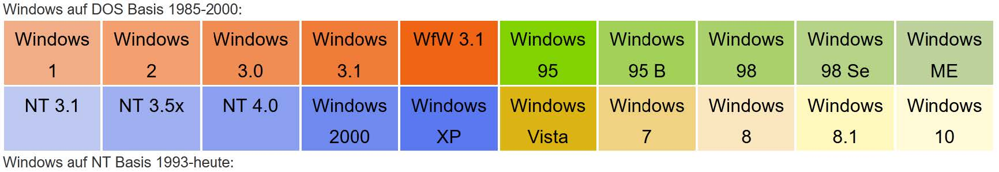 

- Die Windowsversionen auf DOS-Basis waren nur als grafische Erweiterung gedacht - Client
- Ab Win95 sollte es ein eigenständige BS werden
- Die NT-Varianten waren als Netzwerkbetriebssystem in Verwendung – Client, Server
- Ab Windows ME wollte man sich von der DOS-Oberfläche verabschieden…
- Windows 8, eine komplette Neuausrichtung und Fokussierung der Oberfläche auf Touchgeräte
  Windows
- 8.1, ersetzte das glücklose Windows 8, es wurde wieder eine deutliche Trennung der Oberfläche
  für Geräte mit und ohne Touch eingeführt
- Windows 10, kompletter Wandel Entwicklung von Windows (Oberfläche)
- zukünftig nicht mehr große Veröffentlichungen neuer Versionen alle paar Jahre, sondern mit mehreren kleineren in kürzerer Zeit
- Windows 11, Weiterentwicklung v. Windows 10 weiter
- Neuen Versionsnummer - neue Oberfläche, Kacheln und Cortana aus Windows 8 wieder komplett
  verschwinden - Transparenz und Widgets aus Vista kommen wieder
- Wohl nur eine 64-Bit Version

https://winhistory.de/more/windows.htm

## 5 Home

| -                                  | Home                 | Pro  | Enterprise | Education |
| ---------------------------------- | -------------------- | ---- | ---------- | --------- |
| Endkunden-Version                  | +                    | +    | -          | -         |
| Domänenmitgliedschaft              | -                    | +    | +          | +         |
| Bitlocker                          | -                    | +    | +          | +         |
| Gruppenrichtlinien                 | -                    | +    | +          | +         |
| IE-Enterprise Modus                | -                    | +    | +          | +         |
| Remote fernzusteuern               | -                    | +    | +          | +         |
| Direct Access                      | -                    | -    | +          | +         |
| Windows to Go (USB Installation)   | -                    | -    | +          | +         |
| App Locker                         | -                    | -    | +          | +         |
| BranchCache                        | -                    | -    | +          | +         |
| Kiosk Modus                        | -                    | -    | +          | +         |
| Windows Update                     | +                    | +    | +          | +         |
| Windows Update/Branch for Business | -                    | +    | +          | +         |
| Long Term Servicing Branch         | -                    | +    | +          | -         |
| Media Center                       | -                    | -    | -          | -         |
| max. CPU Kerne (32 Bit)            | <td colsspan= 4> 32  |      |            |           |
| max. CPU Kerne (64 Bit)            | <td colsspan= 4> 256 |      |            |           |
| max. Prozessoren                   | 1                    | 2    | 2          | 2         |
| max. Arbeitsspeicher 64            | 128 Gb               | 2Tb  | 2Tb        | 2Tb       |
| Preise UVP in Deutschland          | 145 €                | 259€ | miete      | miete     |

## 6 BIOS - UEFI

- **BIOS**:Basic Input Output System
  
- **UEFI**:Unified Extensible Firmware Interface

## 7 8 9 BIOS - UEFI 01

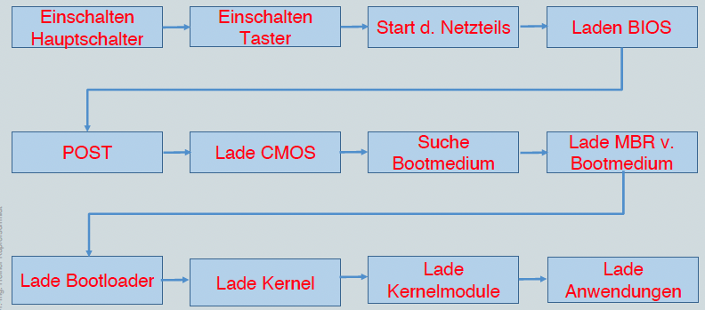

- Einschalten Hauptschalter
- Einschalten Taster
- Start d. Netzteils
- Laden BIOS
- POST
- Lade CMOS
- Suche Bootmedium
- Lade MBR v.Bootmedium
- Lade Bootloader
- Lade Kernel
- Lade Kernelmodule
- Lade Anwendungen

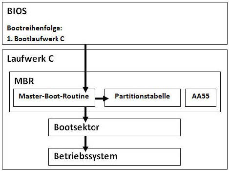

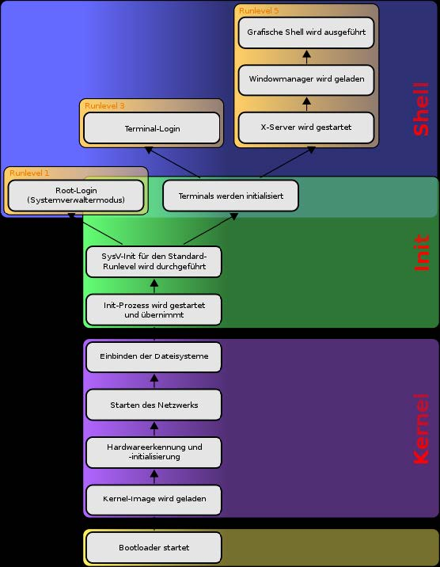

## 10 UEFI Boot

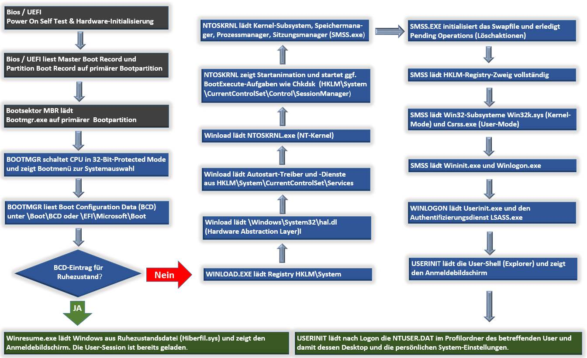

## 11 BIOS – UEFI 02

### **BIOS** Basic Input Output System

- Auf Mainboard abgelegt
- Initialisiert die Hardware, führt den POST[^14] aus und lädt Konfiguration aus dem CMOS[^15]
- Lädt Bootsektor des Startmediums (MBR[^16])
- Master Boot Record (MBR) enthält Partitionstabelle und Bootloader
- Unterstützt nur Bootmedien kleiner 2,2 TB (32 bit!)
- Langsamer Bootvorgang

[^15]: CMOS Complementary metal-oxide-semiconductor ist ein Halbleiterelement, das in vielen modernen Computern und weiteren elektronischen Produkten Verwendung findet. Der statische RAM-Baustein kann zugleich digitale und analoge Daten speichern, verarbeiten und weiterleiten.

[^16]: MBR master boot record enthält ein Startprogramm für BIOS-basierte Computer (IBM-PC-kompatible Computer) und eine Partitionstabelle.

[^14]: POST P_ower O_n S_elf T_est  is a process performed by firmware or software routines immediately after a computer or other digital electronic device is powered on.

[https://th99.classic-computing.de/bioskompendium/html/titel.htm](https://th99.classic-computing.de/bioskompendium/html/titel.htm)

[https://www.elektronik-kompendium.de/sites/com/0807131.htm](https://www.elektronik-kompendium.de/sites/com/0807131.htm)

## 12 BIOS – UEFI 03

### **UEFI** Unified Extensible Firmware Interface

- BIOS-Ersatz
- Soll die technischen Limitierungen vom PC-BIOS überwinden
- Anfangs bei Intel entwickelt (“Intel Boot Initiative”)
- UEFI Forum (Intel, AMD, IBM, Dell, Apple, Microsoft, Red Hat, …)
- Zunächst auf Intel Macs verwendet (2006)
- Mittlerweile auf “allen” “aktuellen” Mainboards
  implementiert

## 13 BIOS – UEFI 04 – UEFI-Architektur

- Modular, erweiterbar
- Integriertes Netzwerkmodul
- Integration von Treibern
- Integrierte Kommandozeile
- Compatibility Support Module (BIOS-Emulation)
- GUID Partition Table (GPT) ersetzt MBR
- Secure Boot

## 14 BIOS – UEFI 05 – UEFI-Bootprozess 1

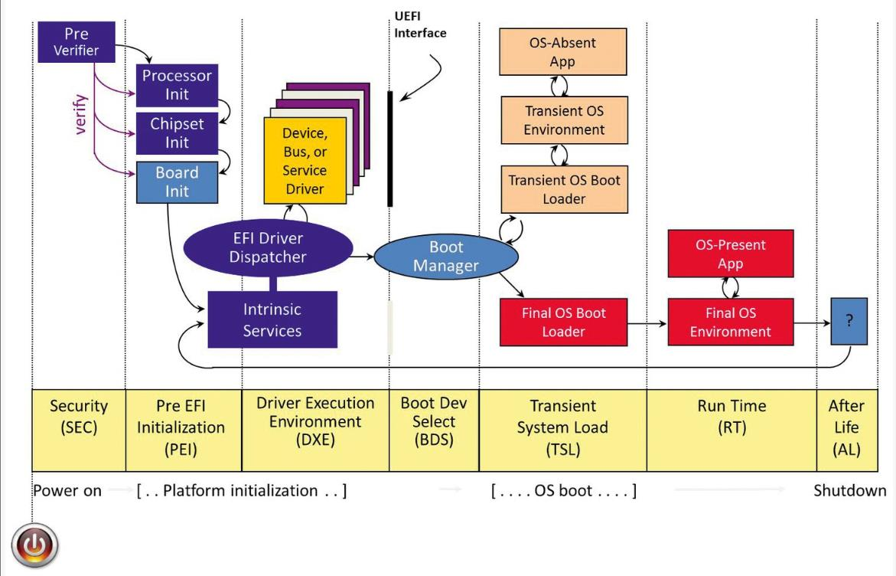

- SEC[^1] Security
- PEI[^2] Pre EFI Initialization
- DXE[^3] Driver Execution Enviroment
- BDS[^4] Boot Dev Select
- TSL[^5] Transient System Load
- RT[^6] Run Time
- AL[^7] after life

[^1]: SEC Security
[^2]: PEI Pre EFI Initialization
[^3]: DXE Driver Execution Enviroment
[^4]: BDS Boot Dev Select
[^5]: TSL Transient System Load
[^6]: RT Run Time
[^7]: AL after life

## 15 BIOS – UEFI 05 – UEFI-Bootprozess 2

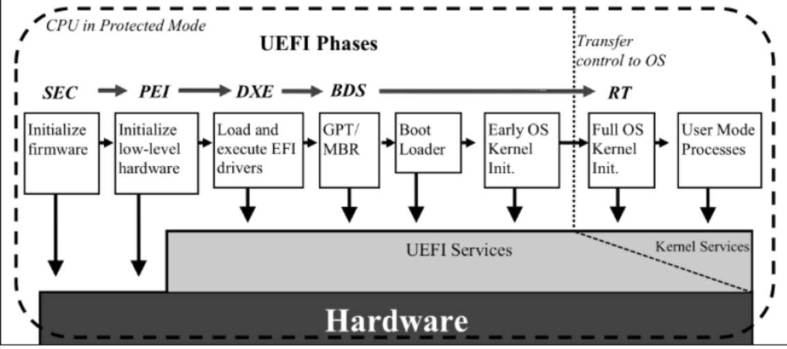

- SEC[^1] Security
- PEI[^2] Pre EFI Initialization
- DXE[^3] Driver Execution Enviroment
- BDS[^4] Boot Dev Select
- RT[^6] Run Time

## 16 UEFI Einführung

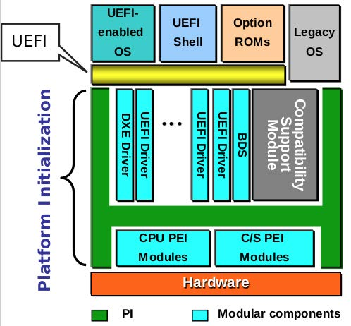

- DXE[^3] Driver Execution Enviroment
- BDS[^4] Boot Dev Select
- PEI[^2] Pre EFI Initialization

## 17 UEFI Bootvorgang

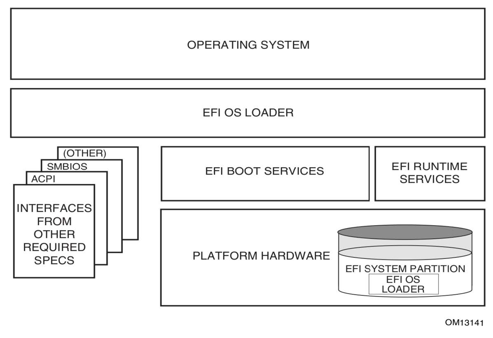

- ACPI [^8]
- SMBIOS [^9]

[^8]: ACPI Advanced Configuration and Power Interface (ACPI) is an open standard that operating systems can use to discover and configure computer hardware components, to perform power management (e.g. putting unused hardware components to sleep), auto configuration (e.g. Plug and Play and hot swapping), and status monitoring.
[^9]: SMBIOS System Management BIOS

## 18 BIOS – UEFI 06 – Secure Boot 01

### Ziele

- Sicherer Systemstart
- verhindert das Ausführen unsignierter Binärdateien (Bootloader, Kernel, Kernelmodule)
- verhindert NICHT die Installation von modifizierten Bootloadern

### Architektur

- Programmierschnittstelle für den Zugriff auf Variablen
- X.509-Zertifikate
- Validierung von Bootloader/Treibern durch Signaturen
- Widerruf von Zertifikaten und Signaturen
- Setup- und User-Modus

## 19 BIOS – UEFI 06 – Secure Boot 02

### Platform Key (PK)[^10]

[^10]: PK Platform Key

- Nur ein einzelner PK[^10] möglich
- Schlüssel des Hardware-Herstellers19(OEM[^11])
- Erlaubt die Modifikation der KEK[^12]
- Löschen -> Setup Mode

[^11]: OEM original equipment manufacturer
[^12]: KEK Key Exchange Key Datenbank

### Key Exchange Key Datenbank (KEK)[^12]

- Mehrere Zertifikate möglich
- Erlaubt Modifikation von db/dbx

### Authorisierte DB (db)

- Zertifikate und Hashes
- Identifiziert vertrauenswürdige
  Binärdateien

### Nicht authorisierte DB (dbx)

- Zertifikate und Hashes
- Identifiziert nicht vertrauenswürdige
  Binärdateien
- hat Vorrang vor db

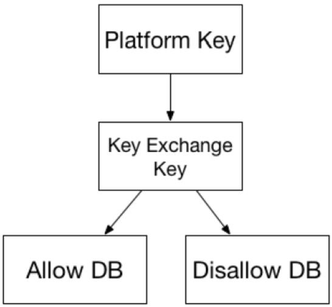

## 20 BIOS – UEFI 06 – Secure Boot 03

### Setup Mode

- Erlaubt Modifikation der Secure Boot Variablen aus dem Betriebssystem heraus
- Dient zur Einrichtung von Secure Boot

### User Mode

- Modifikation von db/dbx setzt privaten Schlüssel eines Zertifikates im KEK[^12] voraus
- Modifikation von PK/KEK setzt privaten Schlüssel des PK voraus

## 21 Secure Boot - Windows 8

- Vom OEM[^11] hinterlegte Schlüssel Voraussetzung für “Windows 8 Logo”
- Secure Boot ist keine Voraussetzung
- Start von kompromittierter Software soll durch AntiMalware-Produkt verhindert werden
- Vorinstalliert: Windows Defender
- “Early Launch Anti-Malware”-Technik (ELAM)[^13]
- Sicherheitsgewinn ist von Anti-Malware-Produktabhängig
- ELAM kann deaktiviert werden

[^13]: ELAM early Launch Anti-Malware Technik

## 22 Secure Boot - Windows 8 01

## 23 Partitionstabellen MBR vs GPT

### MBR – Master Boot Record

- < 2,2 TB
- maximal vier Partitionen, entweder bis zu vier primäre oder bis zu drei primäre und eine erweiterte Partition
- BIOS

### GPT - GUID (Globally Unique Identifier, 128 bit) PartitionTable

- < 9,4 ZB (10 Milliarden Zetabyte), Win < 256 TB
- UEFI notwendig

## 24 BIOS

- Klassische Firmware bei x86 PCs
- Nach Bereitstellung der Betriebsspannungen erfolgt Hardwaretest
- Legt Bootdatenträger fest und startet
  „Bootloader“
- Kann eigentlich NTLDR[^14] bei Windows XP,
  BootMGR bei Windows ab Vista, oder GRUB[^17]
  unter Linux nicht starten
- Kennt nur Festplatten (physische Laufwerke), keine Partitionen noch Dateisysteme
- Kann auf Festplatten zugreifen, der Reihe nach auslesen
- Greift auf den ersten 512 Byte Block zu (Master Boot Record, MBR) – liest den Inhalt
- Ist am Ende d. MBR entspr. Signatur (<f>55AA</f>)
  vorhanden wird der Inhalt in den Prozessor
  geladen und als Boot-Code ausgeführt
- 512 B = Partitionstabelle (64 B) \+ Signatur (2 B)\+ ausführbarer Code (446 B)

[^14]:NTLDR abbreviation of NT loader
[^17]:GRUB grand unified boot loader is a tool for booting and loading operating system kernels and the default bootloader for systems based on the Linux kernel. Although it runs first when a machine is turned on, regular users rarely see GRUB in action. It functions automatically and requires no user input.

- Windows – 4 mgl. Partitionen
- Eine mit „aktiv“-Flag
- Boot-Code im MBR liest die phys. Adresse dieser Partition, springt dorthin und führt den Code weiter aus

- Nach Ausführung, ist das System so weit, dass es
  das Dateisystem interpretieren und den
  Bootmanager (bootmgr) laden/starten kann
- Boot-Code muss an einer bestimmten Stelle auf
  der Festplatte (z. B. im MBR bzw. zu Beginn der
  aktiven Partition) stehen
- Boot-Code ist auch nicht als Datei im Dateisystem erkennbar
- Wenn Festplatten auf Dateiebene kopiert werden,
  ist der Boot-Code nicht mehr vorhanden
- BIOS-Bootmanager kennt nur Festplatten o.
  Disketten (später CD, USB und PXE dazu)
- Eine weitere Differenzierung ist nicht möglich, z.B. kann man im BIOS nicht festlegen, dass von
  der ersten Festplatte Windows oder Linux
  gebootet werden kann
- Jedes Betriebssystem installiert seinen eigenen
  Boot-Code und richtet seinen eigenen BootManager ein.
- Die Boot-Codes der unterschiedlichen
  Betriebssysteme überschrieben sich gegenseitig
  und arbeiteten eher gegeneinander als
  zusammen.

## 25 UEFI

- Direktes Ansprechen der HW-möglich
- Erweiterte Bootmöglichkeiten
- Kann Partitionsstruktur einer Festplatte interpretieren u. FAT-Dateisysteme lesen
- Boot-Code, gebunden an phys. Adresse, unsichtbar im Dateisystem, auf Festplatte nicht mehr nötig
- CSM Kompatibilitätsmodus (Compatibility Support Module, CSM[^15]) – MBR notwendig
  - BIOS-Modus, BIOSKompatibilitätsmodus, CSM[^15]-Modus oder als Legacy-Modus

[^15]: CSM Compatibility Support Module

- Natives UEFI
  - GPT – notwendig
  - Keine einfaches Wechseln zwischen CSM[^15] und Nativem UEFI

## 26 UEFI – CSM-Kompatibilitätsmodus

- CSM[^15]-Kompatibilitätsmodus(Compatibility Support Module, CSM) – MBR notwendig
- BIOS-Modus, BIOS-Kompatibilitätsmodus, CSM[^15]-Modus oder als LegacyModus

## 27 UEFI – Natives UEFI27

- Setzt voraus, dass die- Die Partitionstabelle einer Festplatte, von der das Betriebssystem bootet, als GPT-formatierte Festplatte (GUID-Partitionstabelle) eingerichtet ist
- UEFI-Firmware kann Partitionstabelle einer GPTFestplatte interpretieren
- Kann Daten aus FAT12/16/32 lesen
- Definiert Format für Bootloader, der ausgeführt werden kann
- Kann auch MBR-Festplatten lesen (UEFI-Fallback-Modus)
- Die Partitionstabelle einer GPT oder MBR Festplatte lesen
- Die Daten aus einem FATDateisystem lesen
- Programmcode (Bootloader) in einem bestimmten Format ausführen
- Betriebssysteme können ihren Bootloader in einem definierten Format in einer ganz normalen Partition ablegen
- UEFI definiert eine solche Partition als „EFI System Partition“ (ESP[^16])

[^16]: esp EFI System Partition

## 28 UEFI-Bootmodi

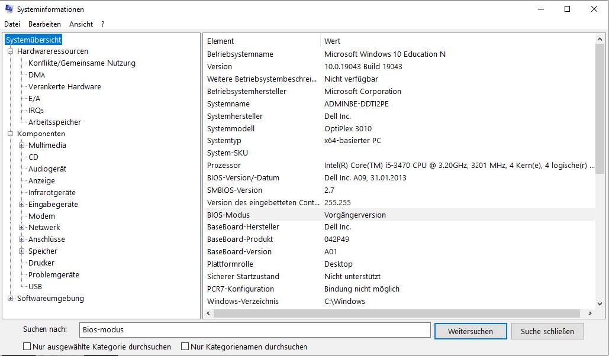

- Msinfo32.exe

## 29 Vollständiger UEFI-Bootmodus

- Start von Installierten OS
- Eintrag in ESP (EFI-Systempartition)
  - \EFI\MICROSOFT\BOOT\BOOTMGFW.EFI oder
  - \EFI\UBUNTU\GRUBX64.EFI
- Ziel
  - Alle Betriebssysteme richten einen eigenen Bootloader in einer EFI-System-Partition ein
  - Verweist nur auf das eigene OS
  - Sieht vom Booten anderer OS ab

## 30 UEFI-Fallback-Modus

- Das System von einem Wechselmedium (z. B. USB-Stick) starten
- UEFI durchsucht das Wechselmedium nach FAT32 Paritionen und sucht in diesen Partitionen nach einem Eintrag \EFI\BOOT\BOOTx64.EFI (bei x86-64Archtitekturen)
- Erster gefundener Eintrag wird ausgewertet
- Für Live- oder Installations-Systeme von Wechselmedien
- Wechselmedien enthalten eine FAT-formatierte Partition Datei \EFI\BOOT\BOOTx64.EFI

## 31 UEFI-Bootmanager

- Könnten „Ordnung“ in das Booten bringen
- Spezifikationen und Werkzeuge der Hersteller
- UEFI-Bootmanage kann OS auf Festplatte o. anderen Bootmedien identifizieren
- UEFI-Bootmanager von Betriebssystem aus bearbeiten
  - Windows „EasyUEFI“
  - Linux mit „efibootmgr“
- Wechselmedium BIOS oder UEFI
- UEFI-Modus > OS im UEFI-Mod.
- BIOS-kompatibler Modus > MBR-Bootloader

## 32 Secure Boot

- Verhinderung von nichtsignierten Boot-Loadern
- UEFI – öffentliche Schlüssel von vertrauenswürdigen Anbietern hinterlegt
- Nur wenn ein Boot-Loader mit dem zugehörigen privaten Schlüssel signiert wurde, lässt er sich starten
- Auf x86-Computern abschaltbar
- Sollte möglich sein im UEFI-Setup Schlüssel hinzuzufügen oder zu entfernen

## 33 Aufbau von Festplatten

- BIOS-kompatiblen Installation – MBR-Partitionsstil
  - Master Boot Record
- UEFI-Installation - GPT-Partitionsstil
  - Globally Unique Identify Partition Table (128 bit)

## 34 MBR-Partitionsstil

- Bis 2,2 TB (Achtung – nicht TiB)
  - MBR Master Boot Record
  - Max. 4 primäre Partitionen
- Innerhalb des MBR
  - 4 x 16 Byte für 4 prim. Partitionen reserviert
  - 16 Byte sind noch aufgeteilt
    - 4 Byte für LBA (Logical Block Addressing)
    - Max. adressierbare Größe ((2^31) +1 Blöcke x 512 Byte/Block = 2 Terabyte)
  - Eine prim. Partition ist aktiv – PC startet von dieser, falls MBR nicht v. A. Bootloader überschrieben
  - Eine prim. Partition kann zu einer erweiterten werden, mehrere logische Laufwerke – bilden eine verkettete Liste
- Zwischen MBR und erster Partition existiert freier Platz. Programme legen dort geschützte Informationen ab

## 35 Systempartition/Startpartition Windows MBR

- Systempartition (je Windows-Version 100 - 500 MB)
  - Erste Partition – aktiv
  - Enthält Bootmanager
- Startpartition / Windowspartition
  - Windows-Betriebssystemdateien
  - Windows-Verzeichnis35
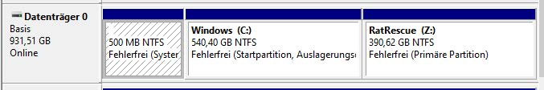
  - Systempartition hat keinen Laufwerksbuchstaben
  - Für Benutzer nicht erreichbar
  - Trennung nicht zwingend erforderlich
    - Vorteil – Bootmanager kann nicht versehentlich verändert werden
    - Imaging-Programme – Achtung!

## 36 GPT-Partitionsstil

- Kann (nach heutigen Maßstäben) beliebig große Festplatten undbeliebig viele Partitionen (128) ansprechen
- Aufbau
  - MBR (Master Boot Record) mit 512 Byte als "Protective MBR"
  - Primäre GUID-Partitionstabelle
  - Max. 128 Partitionen
- Backup GUID-Partitionstabelle- MBR so vorbelegt, dass gesamte Festplatte belegt ist – ältere36Werkzeuge (Protective MBR)
- Einzelnen Partitionen sind durch den Partitionstyp (16 B Hex.-zahl) in
  ihren Funktionen unterscheidbar
  - EFI-Systempartition
  - MSR-Partition[^18]
  - Windows-Recovery-Partition
  - Windows-Partition
  - Linux-Partition
  - etc.

[^18]:MSR-Partition A Microsoft Reserved Partition is a partition of a data storage device, which is created to reserve a portion of disk space for possible subsequent use by a Windows operating system installed on a separate partition.

## 37 MSR [^18] – Microsoft Reserved Partition

- Microsoft kann die Partition für zukünftige Zwecke verwenden
- Diese Partition entspricht dem freien Platz, der bisher bei MBR-Partitionen zur Verfügung stand
- Größe (bei Windows 10): 16 MB
- Kein Dateisystem
- Typ: e3c9e316-0b5c-4db8-817d-f92df00215ae

## 38 Windows-Partition

- Enthält Windows-Betriebssystem
  - Mindestgröße: 20 GB
  - Dateisystem: NTFS
  - Typ: ebd0a0a2-b9e5-4433-87c0-68b6b72699c738

## 39 Wiederherstellungspartition

- Enthält die Datei winre.wim (Windows Recovery)
- Standardgröße bei Windows 10: 500 MB
- Dateisystem: NTFS
- Typ: de94bba4-06d1-4d40-a16a-bfd50179d6ac39

## 40 Systempartition u. Startpartition Win (GPT)

Ohne Wiederherstellungspartition 

DISKPART> list disk  
|Datenträger|###|Status|Größe |Frei |Dyn GPT|
|-----|-----|-----|-----|-----|-----|
|Datenträger|0|Online|476 GB|0 B| *|
|Datenträger|1|Online|465 GB|0 B|  |

Diskpart zeigt an, dass der Datenträger 0 als GPT-Datenträger eingerichtet ist.

DISKPART> list partition  
|Partition|###|Typ|Größe|Offset|
|-----|-----|-----|-----|-----|
|Partition 1| - | System|100 MB |1024 KB|
|Partition 2 |-|Reserviert |16 MB| 101 MB|
|Partition 3 |-|Primär| 476 GB |117 MB|
MSR wird in Grafik nicht angezeigt!

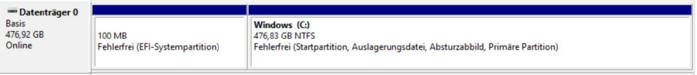

## 41 Dateisysteme

- <f>FAT16</f> ist das ursprüngliche Dateisystem von MS-DOS und Windows 3.11; früher gab es sogar eine noch eingeschränktere
Variante namens <f>FAT12</f>. »FAT« ist die Abkürzung für <f>File Allocation Table</f> – Dateizuordnungstabelle. In Form einer solchen Tabelle speichert dieses Dateisystem jeweils die Nummer des ersten <f>Clusters</f>, bei dem eine bestimmte Datei beginnt.

- Jede Zuordnungseinheit enthält einen Verweis auf den nächsten Cluster der Datei. Dateien liegen nämlich nicht unbedingt als zusammenhängende Kette von Clustern auf der Festplatte, sondern sind bisweilen ziemlich weit verstreut. Sie fragmentieren im Laufe der Zeit, weil die Lücken, die durch das Löschen kleiner Dateien entstehen, mit einzelnen Teilen größerer Dateien gefüllt
werden. Dies ist bei moderneren Dateisystemen zwar auch der Fall, aber diese verwenden intelligentere Verfahren zur Verwaltung der einzelnen Zuordnungseinheiten und räumen das Dateisystem im Hintergrund ständig auf. Bei FATDateisystemen ist es deshalb noch wichtiger als bei anderen, die Datenträger regelmäßig mit geeigneter Software zu
defragmentieren, weil sie sonst immer langsamer werden.

- Da es sich bei <f>FAT16</f> um ein 16-Bit-Dateisystem handelt, beträgt die maximale Anzahl von Zuordnungseinheiten auf einer Partition 216 = 65.536. Dies macht große Datenträger sehr ineffizient, da jede Datei immer ganze Zuordnungseinheiten belegt. Darüber hinaus ist die Größe einer FAT16-Partition auf 2 Gigabyte begrenzt.
  
- <f>FAT32</f> wurde zum ersten Mal mit der zweiten Windows 95-Neuauflage ausgeliefert, Windows 95B. Das Dateisystem besitzt exakt dieselbe Funktionsweise wie <f>FAT16</f>. Durch die 32-Bit-Adressierung wurde allerdings die Anzahl der Cluster pro Partition auf über 4 Milliarden erhöht, die Gesamtgröße einer Partition kann bis zu 4 Terabyte betragen.

- <f>NTFS, das New Technology File System</f>, existiert in verschiedenen leicht unterschiedlichen Versionen. Die Zuordnungseinheiten werden nicht mehr in einer einfachen Tabelle verwaltet, sondern in einer komplexen Baumstruktur, die erheblich schnellere Zugriffe ermöglicht und mehr Schutz vor Fehlern bietet. Des Weiteren stellt das Dateisystem eine Unixähnliche Verwaltung von Benutzerrechten für den Eigentümer, die Gruppe und sonstige Benutzer bereit. Diese Rechte lassen sich leider nicht in jeder Vista- oder XP-Version per grafischer Oberfläche einstellen.

- Der einzige Nachteil von <f>NTFS</f> besteht darin, dass es für einige ältere Betriebssysteme nicht zugänglich ist. Linux konnte NTFS bis vor Kurzem nur lesen und nicht beschreiben, und der Schreibzugriff ist noch immer fehleranfällig. Windows 95, 98 und Me konnten gar nicht auf NTFS-Partitionen zugreifen, aber dieses Problem dürfte sich inzwischen erledigt haben, da diese Versionen praktisch ausgestorben sind. Aber falls Sie mehrere Betriebssysteme auf demselben Rechner installiert haben, müssen Sie sich genau überlegen, welches dieser Systeme auf welche Daten zugreifen können soll, bevor Sie sich für die Verteilung der Dateisysteme auf die verschiedenen Partitionen entscheiden.

- Windows NT und seine Nachfolger bieten die Möglichkeit, FAT-Dateisysteme nachträglich in NTFS zu konvertieren – die umgekehrte Möglichkeit besteht dagegen nicht.

## 42 Windows im Einsatz

- [https://openbook.rheinwerk-verlag.de/it_handbuch/06_002.html#dodtp685abe57-52bb4b7d-b993-7b108c5043a643](https://openbook.rheinwerk-verlag.de/it_handbuch/06_002.html#dodtp685abe57-52bb4b7d-b993-7b108c5043a643)

## 43 Windows Netzwerkeinstellungen

- [https://openbook.rheinwerk-verlag.de/it_handbuch/06_003.html#dodtpaaabd0ec-220f49ee-a409-4fa00bd168b444](https://openbook.rheinwerk-verlag.de/it_handbuch/06_003.html#dodtpaaabd0ec-220f49ee-a409-4fa00bd168b444)

## 44 Quellen 1

- https://www.winhistory.de/more/win10.htm#ed
- https://www.winhistory.de/more/msdos.htm
- https://docs.microsoft.com/en-us/previous-versions/windows/it-pro/windows-server-2008-R2-and2008/cc731901(v=ws.11)?redirectedfrom=MSDN
- https://docs.microsoft.com/de-de/windows/client-management/images/boot-sequence.png
- https://docs.microsoft.com/en-us/windows-hardware/drivers/devtest/bcd-boot-options-reference
- https://upload.wikimedia.org/wikipedia/commons/5/52/Linux-bootvorgang.svg
- https://www.verbraucherzentrale.de/wissen/digitale-welt/datenschutz/datenschutz-bei-windows-10-erhoehen12154
- https://www.bsi.bund.de/DE/Themen/Verbraucherinnen-und-Verbraucher/Cyber-Sicherheitslage/Methodender-Cyber-Kriminalitaet/methoden-der-cyber-kriminalitaet_node.html
- https://www.bsi.bund.de/SharedDocs/Downloads/DE/BSI/CyberSicherheit/SiSyPHus/Analyse_Telemetriekomponente_1_0.html
- https://www.giga.de/downloads/windows-10/tipps/windows-10-einrichten-von-a-bis-z-so-geht-s/
- https://entwickler.de/online/windows-10-wissenswertes-nutzer-168786.html
- https://www.google.de/search?client=ms-operamobile&channel=new&espv=1&q=Windows+10+Schritt+f%C3%BCr+Schritt+Anleitung+PDF&sa=X&ved=2ahUKEwi4w_v47JzxAhVF4qQKHcehDKgQ1QIwKHoECDMQAQ&biw=902&bih=1503
- https://www.appdated.de/2020/11/windows-10-handbuch-und-anleitung-in-deutsch/
- https://www.pcwelt.de/ratgeber/Von-Windows-1-bis-10-Die-Geschichte-von-Windows-9849474.html
- https://www.pc-magazin.de/ratgeber/windows-10-einstellungen-apps-startmenue-edge-desktop-cortanaonedrive-3191899.html
- https://www.computerwoche.de/k/windows-10,3530
- https://www.giga.de/downloads/windows-10/specials/windows-10-handbuch-kostenlos-zum-download-quickguide-deutsch/

## 45 Quellen 2

- https://docs.microsoft.com/de-de/windows-hardware/design/device-experiences/oem-secure-boot
- https://www.winhistory.de/more/win10.htm#ed
- https://www.winhistory.de/index.php
- https://www.computerwoche.de/a/god-mode-per-trick-in-windows-10-freischalten,3315849
https://www.computerwoche.de/a/die-besten-tricks-zum-windows-10-browser,3316565
https://www.computerwoche.de/a/windows-10-creators-update-alle-neuerungen-im-ueberblick,3330536
- https://www.computerwoche.de/a/suchfunktion-optimal-nutzen,3331986
- https://www.computerwoche.de/a/mac-oder-pc-ein-test-ueber-zehn-runden,2557071
- https://www.computerwoche.de/a/so-bereinigen-sie-windows,3544129
- https://www.computerwoche.de/a/microsoft-baut-an-neuer-betriebssystem-generation,3544239
- https://www.computerwoche.de/a/tools-die-auf-jedes-windows-gehoeren,3544369
- https://www.computerwoche.de/a/windows-10-die-besten-freeware-tools,3226100
- https://www.computerwoche.de/a/cortana-per-trick-abschalten,3544820
- https://www.computerwoche.de/a/windows-10-statistik-zur-datennutzung-anzeigen,3545114
- https://www.computerwoche.de/a/datenschutz-in-windows-10-privatsphaere-schuetzen,3545490
- https://www.computerwoche.de/a/problemen-gezielt-auf-die-spur-kommen,3331447
- https://www.computerwoche.de/a/fuenf-hilfreiche-tipps-und-tricks-fuer-windows-10,3544199
- https://www.computerwoche.de/a/schneller-auf-ordner-zugreifen,3546976
- https://www.computerwoche.de/a/optimierung-fuer-windows-10,3547100
- https://www.computerwoche.de/a/windows-tools-die-wirklich-jeder-braucht,3547134
- https://www.computerwoche.de/a/windows-10-erfordert-ein-neues-betriebsmodell,3547153
- https://www.computerwoche.de/a/windows-10-mit-pin-statt-passwort-schuetzen,3547320
- https://www.computerwoche.de/a/geheime-windows-funktionen-nutzen,3544311
- https://www.computerwoche.de/a/die-besten-tipps-zu-sicherheit-und-datenschutz,3328090
- https://www.computerwoche.de/a/so-steuern-sie-ihr-windows-ohne-maus,3547985
- https://www.computerwoche.de/a/sicheres-loeschen-von-dateien-in-windows-10,3548338
- https://www.computerwoche.de/a/pfiffige-gratis-tools-machen-windows-besser,3547435
- https://www.computerwoche.de/a/11-kleine-windows-tricks-mit-grosser-wirkung,3548159
- https://www.computerwoche.de/a/dieser-trick-aktiviert-neues-startmenue-in-windows-10,3549540
- https://www.computerwoche.de/a/das-kann-microsofts-verwaltungstool,3549962
- https://www.computerwoche.de/a/die-35-besten-cmd-tricks-fuer-windows,3550137
- https://www.computerwoche.de/k/windows-10,3530/hintergrund,31,3
- https://apfelböck.de/windows-tipps-und-grundlagen/
- https://secure-bits.org/category/tutorials/
- https://botfrei.de/was-ist-eigentlich-ein-mbr-oder-wie-kann-ich-es-reparieren/
- https://knowitlikepro.com/understanding-master-boot-record-mbr/
- https://knowitlikepro.com/
- https://metebalci.com/blog/a-quick-tour-of-guid-partition-table-gpt/
- https://www.codeproject.com/Articles/488296/Partition-Tables-Explained
- https://slidetodoc.com/using-large-hard-drives-in-linux-presented-by/
- https://www.thessdreview.com/ssd-guides/optimization-guides/complete-guide-to-speeding-up-your-pcs-boot-times/
