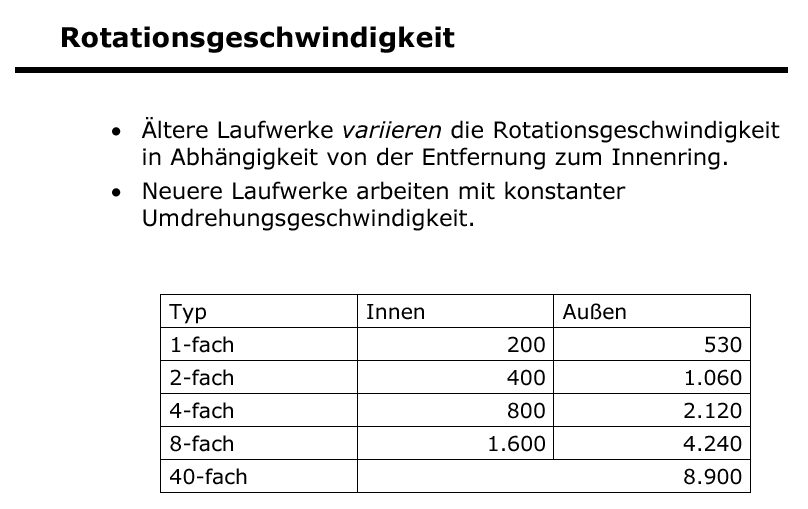
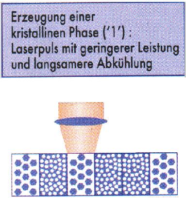
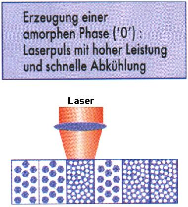
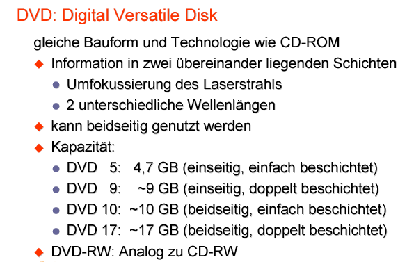

# Sekundärspeicher Optische Laufwerke

## Einführung und Überblick

## 2 Inhalt und Gliederung

- Definition Datenträger
- Prinzip der optischen Speicherung
- Arten und Eigenschaften optischer
  Datenträger

## 3 Definition Datenträger

- Datenträger: maschinell bzw. elektronisch
  verarbeitbares (lesen und schreiben)
  Speichermedium
- Daten werden in Form von Dateien (Bits,
  Bytes) dauerhaft gespeichert
- Datenträger werden in 4 Arten
  unterschieden

## 4 Arten optischer Datenträger 1

- Papier, Folie, Karton:
  - Beispiel Lochkarten bzw. Lochstreifen
  - Informationseinheiten (Bits) werden durch Löcher
    in Karten bzw. Streifen repräsentiert
- magnetische Datenträger:
  - Disketten, Festplatten, Wechselplatten, StreamerBänder, ZIP-Disketten und Magnetbänder
  - Informationseinheiten (Bits) werden durch
    magnetisierte bzw. unmagnetisierte Bereiche
    repräsentiert

## 5 Arten optischer Datenträger 2

- optische Datenträger:
  - CD-ROM, CD-R[^1], CD-RW[^2], DVD[^3] und DVD-RW[^4]
  - Informationseinheiten werden durch
    verschiedenartig reflektierende Bereiche, die vom
    Laser abgetastet werden, dargestellt
- Mischform von optischen und magnetischen
  Datenträgern
  - magnetooptische Datenträger oder Platten, auch
    magnetooptischen Speichermedien,
    Magnetkristalle werden durch Magnetisierung in
    bestimmte Richtungen ausgerichtet, die dann
    verschiedenartig reflektieren
    [^1]:CD-R Compact Disc Recordable
    [^2]:CD-RW Compact Disc ReWritable
    [^3]:DVD Digital Video Disc or Digital Versatile Disc
    [^4]:DVD-RW Digital Video Disc or Digital Versatile Disc ReWritable

## 6 Arten optischer Datenträger 3

| nur lesen                                     | 1 x schreiben beliebig lesen                                  | mehrmals schreiben beliebig lesen |
| --------------------------------------------- | ----------------------------------------------------------------- | ------------------------------------- |
| Struktur wird gepresst (ähnlich Schallplatte) | Reflexionseigenschaften d. Absorbtionsschicht thermisch verändern | Phase-ChangeMagneto-optisch           |
| ROM                                           | R/WORM[^5]                                                            | RW                                    |
| CD DVD[^3] BD[^6] HD-DVD[^7]      | CD DVD BD                                             | CD DVD+/-[^8] MOD[^9] UDO[^10]     |

[^5]: WORM Write once read many (WORM) describes a data storage device in which information, once written, cannot be modified. This write protection affords the assurance that the data cannot be tampered with once it is written to the device, excluding the possibility of data loss from human error, computer bugs, or malware.
[^6]: BD The Blu-ray Disc, often known simply as Blu-ray, is a digital optical disc data storage format. It was invented and developed in 2005 and released worldwide on June 20, 2006. It was designed to supersede the DVD format, capable of storing several hours of high-definition video.
[^7]: HD-DVD High Definition Digital Versatile Disc is an obsolete high-density optical disc format for storing data and playback of high-definition video. Supported principally by Toshiba, HD DVD was envisioned to be the successor to the standard DVD format.
[^8]: DVD+/- is a term used to refer to two different formats of writable optical discs, DVD+R/RW and DVD-R/RW. These formats were developed independently by different organizations, with DVD-R being developed by the DVD Forum and DVD+R being developed by the DVD+RW Alliance.
[^9]: MOD Magnetical Optical Disc
[^10]: UDO Ultra Density Optical

## 7 Abkürzungen 1

- CD – Compact Disc
- CD-R[^1] – einmal beschreibbar
- CD-R/W – mehrmals beschreibbar
- DVD[^3] – Digital Video Disc, Digital Versatile Disc

## 8 Abkürzungen 2

- DVD-R - einmal beschreibbar
- DVD[^3]-R/W – mehrmals beschreibbar
- DVD[^3] RAM - mehrere Male beschreibbar
- BD[^6] - Blu(e) Ray Disc
- MOD[^9]  – Magnetical Optical Disc
- UDO[^10]   – Ultra Density Optical

## 9 Prinzip der optischen Speicherung

Prinzip der optischen Speicherung

## 10 Wellenlänge und Strukturen

Wellenlänge und Strukturen

## 11 Speicherdichte

Speicherdichte

## 12 Aufbau (Daten)

Aufbau

## 13 Aufbau einer CD ROM

Aufbau einer CD

## 14 Aufbau CD-R[^1] (Schichten)

Aufbau CD-R

## 15 Bits

## 16 Rotationsgeschwindigkeit

Rotationsgeschwindigkeit

## 17 Datenübertragungsrate

Datenübertragungsrate

## 18 Arten und Eigenschaften optischer Datenträger

• CD
• DVD[^3]
• Blu-ray

## 19 Phase-Change Aufzeichnungsverfahren
|&nbsp;|&nbsp;
|-----|-----
||
 |Ca. 700°C, geringer Reflexionsgrad|Ca. 200°C, hoher Reflexionsgrad

## 20 Phase-Change Aufzeichnungsverfahren Geschichte

- 1995:PD (Phasewriter Dual) von Panasonic, speichert 650 MB
(Megabyte).
- 1996:CD-RW[^2] (Compact Disc ReWriteable) von Philips, Sony,
Hewlett-Packard, Mitsubishi Chemical und Ricoh, anfänglich 650 MB,
später 700 MB speicherbar.
- 1998:DVD[^3]-RAM (DVD - Random Access Memory) vom
Herstellerkonsortium DVD Forum, anfänglich 2,6 GB (GigaByte),
heute bis 9,4 GB speicherbar.
- 1999:DVD±RW (DVD - ReWriteable) vom Herstellerkonsortium
DVD+RW Alliance, anfänglich 4,6 GB, heute bis zu 9,4 GB
speicherbar.
- 2004:UDO[^10] (Ultra Density Optical) von Plasmon, speicherbar 28 GB.
- 2004:PDD (Professional Disc for Data) von Sony, speicherbar 20,5
GB.
- 2006:BD-RE (Blu-ray Disc Rerecordable) von Sony, anfänglich 25
GB, heute bis zu 50 GB speicherbar.

## 21 Phase-Change Aufzeichnungsverfahren Geschichte

Der Übergang von einer Generation der Phase-ChangeTechnologie zur nächsten gestaltete sich bisher immer investitionssicher, weil die jeweils neuere Generation eine gewisse Abwärtskompatibilität mit der älteren Generationen aufwies.  
Drei Beispiele:  

- Die erste Generation der DVD-RAM-Laufwerke konnten
auch noch PD-Medien lesen.
- Handelsübliche DVD-Geräte können auch CD-RW[^2]s
lesen und schreiben.
- BD-Geräte können alle DVD-RAM, DVD-RW[^4] und CDRW lesen und schreiben.

## 22 DVD[^3] 1

## 23 DVD[^3] 2

## 24 DVD[^3] 3

## 25 DVD[^3] 4

## 26 DVD[^3] 5

### Vergleich DVD[^3] - CD
  

Speicherung der Daten:

- Pit: Kleine, schlechter reflektierende Vertiefung
- Land: normal reflektierende Oberfläche spiralförmig angeordnet

## 27 „Bunte Bücher“ (englisch rainbow books) 1

### Red Book:

- spezifiziert die Audio-CD
- besteht aus einem Inhaltsverzeichnis (Table of
  Contents) und bis zu 99 Audiotracks
  Eine Audio-CD, auf der die
  Kopierschutzmaßnahmen der Musikindustrie
  verwendet wird, entspricht nicht dem Red Book
  und ist gar keine richtige Audio-CD
- CD-Text mit kurzen Zusatzinfo‘s (Interpret, Titel)

## 30 „Bunte Bücher“ (englisch rainbow books) 2

### Yellow Book:

- Standard für CD-ROM, ursprüngliche DatenCD
- sie war von Anfang an als Mixed-Mode-CD
  ausgelegt, kann also neben den Computerdaten auch Audiotracks enthalten

## 31 „Bunte Bücher“ (englisch rainbow books) 3

### Green Book:

- Format der Philips CDi (für »interactive«)
festgelegt
- CDi-Player ist ein an den Fernseher
anschließbares Gerät zum Abspielen von
Multimedia-Präsentationen
- es kam kurz vor dem Siegeszug der
Multimedia-CD-ROM und des Webs auf den
Markt und verkaufte sich schlecht

## 32„Bunte Bücher“ (englisch rainbow books) 4

### Orange Book:

- standardisiert die beschreibbare CD
(CD-R[^1], für »recordable«) und die
wiederbeschreibbare CD
(CD-RW[^2], rewritable).

## 33 „Bunte Bücher“ (englisch rainbow books) 5

### White Book:

- definiert das Format der Video-CD
(nicht etwa der DVD[^3]).

## 34 „Bunte Bücher“ (englisch rainbow books) 6

- Das Blue Book ist eine Erweiterung des Yellow-Book-Standards im Hinblick auf Mixed-Mode-CDs: Es wird genauer festgelegt, wie Audio- und Datentracks aufeinanderfolgen sollen, damit die CD sowohl von einem alten Audio-CD-Player
als auch von einem modernen CD-ROMLaufwerk in einem Computer abgespielt werden kann.

## 35 DVD[^3] Forum oder Alliance

## 36

DVD[^3] Forum

- WG1: DVD-Video and video recording applications.
- WG2: Physical specifications for DVD-ROM.
- WG3: File system specifications for discs.
- WG4: DVD-Audio applications.
- WG5: Physical specifications for DVD-RAM.
- WG6: Physical specifications for DVD-R and DVD-RW[^4].
- WG9: Copyright protection.
- WG10: Professional applications.
- WG11: Blue Laser DVD.

## 37 DVD-Alliance

- DVD+RW Alliance ist ein Industriekonsortium
- preisgünstige Alternativen zu den teuren
beschreibbaren DVD-Formaten DVD-R und
DVD-RW[^4] des DVD Forum
- die zwei Alternativformate DVD+R und DVD+RW
werden auch als Plus-Formate bezeichnet.
- Dell, HP, Mitsubishi Chemical, Philips
Electronics, Ricoh, Sony, Thomson, Yamaha

## 38 Lernzielkontrolle

1. Nennen Sie 3 aktuelle gebräuchliche optische Datenträger!
2. Nennen Sie die Speichergrößen dieser Datenträger in GiByte!
3. Was ist unter Pits und Lands auf einem optischen Datenträger zu verstehen?
4. Wie werden die Informationen auf einem optischen Datenträger ausgewertet?
5. Wodurch ergibt sich die höhere Speicherdichte einer BluRay-Disk gegenüber einer DVD?
6. Nennen Sie 3 Eigenschaften von Laserstrahlung zum Unterschied von „normalem“ Licht!
7. Erläutern Sie die Bezeichnungen DVD-ROM, DVD-R, DVD-R/W!
8. Welcher Effekt liegt dem „Begriff“ R/W zu Grunde?
9. Erläutern Sie die Verfahren zur Fixierung der Daten auf DVD-ROM, DVD-R, DVD-R/W!
10. Was ist beim „Brennen“ von Daten auf einen optischen Datenträger zu beachten?
