

# Halbleiterspeicher

## 2 Gliederung

- Einteilung
- ROM
  - PROM
  - EPROM
  - EEPROM
- RAM
  - SRAM
  - DRAM

## 3 Speicherhierarchie

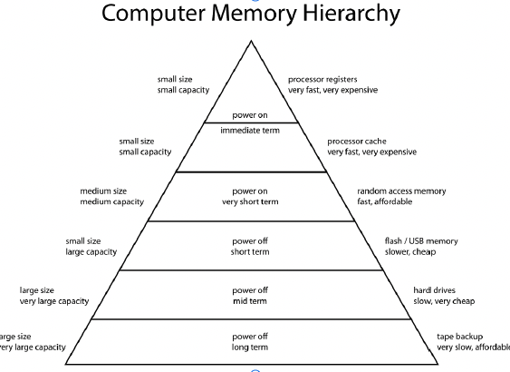

## 4 Einteilung

### Permanenter Halbleiterspeicher

- Speicherinhalt dauerhaft, unveränderlich (<r>MROM[^1]</r>, <r>PROM</r>)
- Für Betriebssysteme, Anwendungsprogramme und Firmware
- Oftmals durch Sockel austauschbar
- Durch Flash-Speicher abgelöst

### Semi-permanenter Halbleiterspeicher

- Können wiederholt neu programmiert werden
- Durch Flash-Speicher abgelöst

### Flüchtiger Halbleiterspeicher

- Verlieren Information ohne Betriebsspannung
- Aber -schnell

## 5 ROM - Read Only Memory

- digitaler Festwertspeicher
- Daten werden dauerhaft und unveränderlich gespeichert (meist vom Hersteller - <r>MROM[^1]</r>)
- Daten können weder elektrisch noch optisch gelöscht werden
- Diode stellt High-Bit dar
- Dioden verhindern Kurzschluss
- Herstellung teuer, nur Großserien

[^1]: MROM MAsk Read Only Memory

## 6 Prinzip von ROM

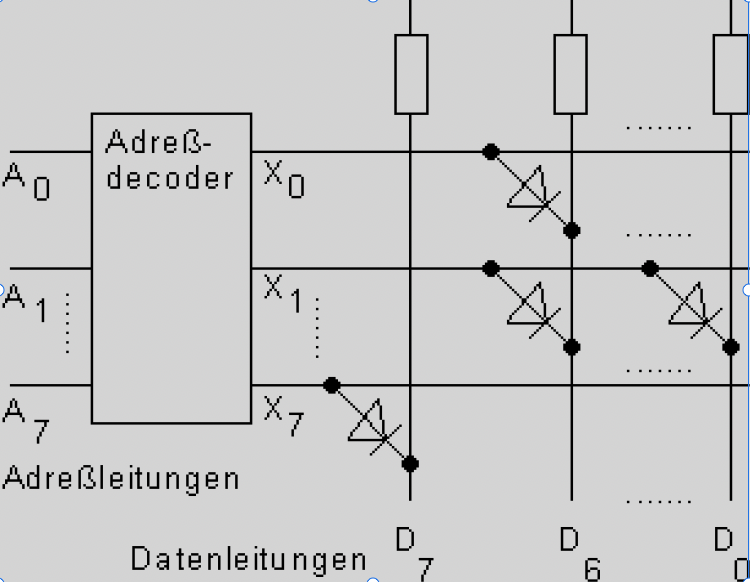

## 7 PROM

- Werden mit „1“ hergestellt und vom Anwender programmiert
- Sind nur einmal programmierbar
- Diode und Schwachstelle
- Programmiergerät zerstört Schwachstelle

## 8 EPROM - Erasable Programmable ROM

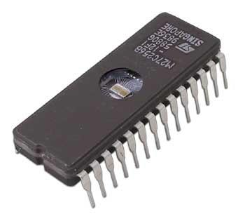

- gleiche Technik zum Programmieren wie PROM - Spannungsimpulse
- Löschung erfolgt durch UV-Licht - Ladungsverschiebung

## 9 EPROM - Aufbau

| &nbsp;                               | &nbsp;                               |
| ------------------------------------ | ------------------------------------ |
| 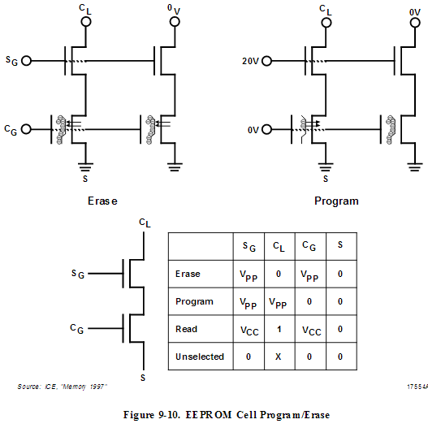 | 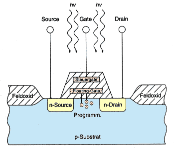 |

## 10 EPROM - Geräte

| &nbsp;                                                 | &nbsp;                                                 |
| ------------------------------------------------------ | ------------------------------------------------------ |
| 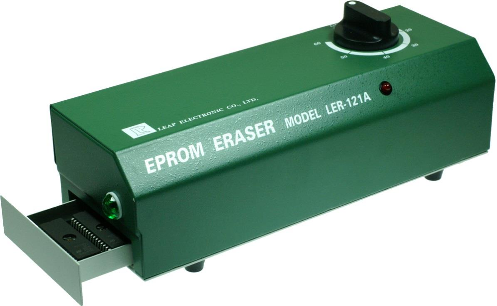 | 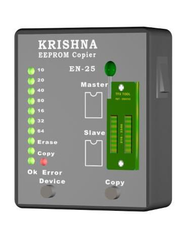 |

## 11 EEPROM - Electrical erasable programmable ROM

- Speicherzellen werden durch Spannungsimpulse programmiert und gelöscht
- lange Programmierzeit
- Anzahl der Programmierzyklen ist beschränkt
- serielle Programmierweise
- Bedienerdaten, Konfiguration, Parameter, Einstellungen

## 12 SPD-EEPROM(Serial Presence Detect)

- digitales Datenblatt, nötige Einstellungen für Speicher-Controllers des Motherboards
- Datenblatt ist im SPD-EEPROMgespeichert (Serial Presence Detect EEPROM)
  - Speicherkapazität
  - Versorgungsspannung
  - Timing
  - Anforderungen f. Refresh
  - Latenz…
  - 128…256 Byte
- BIOS liest diesen Chip über den System-Management-Bus (SMBus) beim POST aus u. konfiguriert Speicherkontroller

## 13 RAM -Random Access Memory

- Speicherzellen werden über Speicheradresse direkt angesprochen
- wahlfreier Zugriff NICHT zufällig
- RAM erlaubt Zugriff auf jede Speicherzelle
- FLASH - blockweiser Zugriff
- bei Ausfall der Stromversorgung sind die Daten im RAM verloren
- Arbeitsspeicher

## 14 Arten von RAM

- SRAM - Statisches RAM
- DRAM - Dynamisches RAM

## 15 SRAM Static Random Access Memory 1

- Speicherung erfolgt in Flip-Flops
- Sehr schnell
- <r>kein Refresh nötig</r>
- Hoher Stromverbrauch im Prog.-Zyklus
- Hoher Platzbedarf / Bit
- Teuer
- <r>Einsatz als L1-, L2-und L3-Cache</r>

## 16 SRAM Static Random Access Memory 2

- Speichert bis zu einigen Jahren
- Stromverbrauch liegt im nA-Bereich
- Batterie kann auch in Chip-Gehäuse integriert sein
  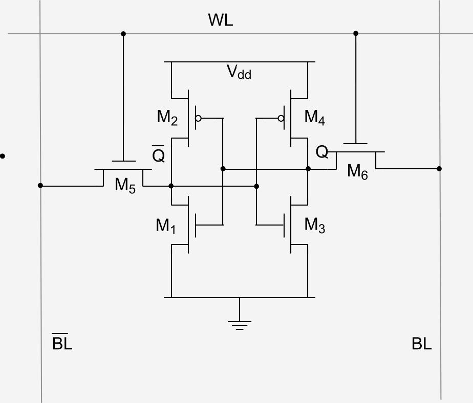

## 17 DRAM - Dynamic Random Access Memory

- Einfachster, langsamster, billigster Speicher
- Geringer Platzbedarf / Bit
- <r>Benötigt Refresh</r>
- FRAM, MRAM nicht in der Computertechnik (geringe Rolle)
- RAM-Zelle besteht aus Transistor und Kondensator - Ladung des „C“ gleich Bit

## 18 DRAM - Prinzip

- Transistor arbeitet als Schalter
- Lesen und Schreiben erfolgt über den Transistor
- Nachteil: C entlädt sich durch Kriechströme
- Benötigt Refresh (mehrere tausend mal pro Sekunde)

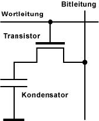

## 19 DRAM - Eigenschaften

- Datenspeicherung in einem Kondensator
- Benötigt Refresh
- Geringer Stromverbrauch
- Einsatz als Arbeitsspeicher oder Grafikspeicher
- Benötigt wenig Platz auf Chip
- Preiswert/Bit

## 20 DRAM - Speicherzugriff

- Speicherzellen werden in Spalten u. Zeilen angeordnet
- 16 MBit 4096 x 4096 Bit (16,8 Mio. Speicherzellen - 16 Zeilen und 16 Spalten
- 4096 (212) Adressen und Zustände abspeicherbar
- Multiplexing reduziert die Anzahl der Anschlüsse
- Bei Adressierung einer Speicherzelle wird zuerst die Zeilenadresse, RAS[^2] und dann die Spaltenadresse, CAS[^3] übertragen

[^2]: RAS row access strobe
[^3]: CAS column access strobe

## 21 22 23 24 SDRAM[^4] - Synchronus DRAM

- SDRAM direkter Nachfolger von EDO-RAM[^5]
- SDRAM Schreib-und Lesezugriffe sind am Systemtakt orientiert - synchron mit dem Speicherbus
- Vereinfachung und Beschleunigung der Ansteuerung des Speichers
- <r>Normales DRAM arbeitet asynchron</r>

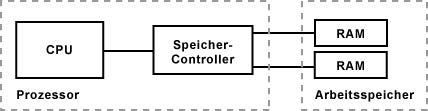

[^4]: SDRAM Synchronus DRAM
[^5]: EDO-RAM extended data output ram

## 25 26 Arbeitsweise SD-RAM

- Speicherzellen in Spalten (raw) und Zeilen (column) angeordnet
- Pro Spalte gibt es einen Schreib-/Leseverstärker
- Adressierung beginnt mit der Zeilenadresse (RAS[^2]) - erst nach Auslesen darf die Spaltenadresse folgen (CAS[^3])
- Ein Decoder sorgt für die richtige Auswahl der Daten. Die Daten stehen nach Ablauf der CAS Latency, CL[^6] am Ausgang bereit
- Pro Adressierungsvorgang wandern die Daten von mehreren Spalten aus dem Sense Amps in die Pufferstufe
- Von dort werden die Datenpakete Bit für Bit an die externen Anschlüsse des Chips weitergereicht
- Intern besteht SDRAM aus zwei Speicherbänken
- Der Zugriff erfolgt abwechselnd, so dass die benötigte Erholungszeit zwischen den Zugriffen entfällt
- Einen zusätzlichen Geschwindigkeitsvorteil bringt das Pipeline-Verfahren - während der SDRAM-Chip noch Daten einliest, gibt er Daten bereits aus.

[^6]: CL column access strobe latency

## 27 DDR-SDRAM 1

- Zur Erhöhung der Übertragungsgeschwindigkeit der SDRAM-Speichermodule wird das Double-Data-Rate-Verfahren (DDR) eingesetzt.
- dazu nutzt man beide Taktflanken (aufsteigend und absteigend) zur Übertragung -das entspricht einer Bandbreitenverdopplung
- eine weitere Geschwindigkeitssteigerung erreicht man dadurch, dass man pro Takt mehrere Datenworte überträgt (QDR[^7], ODR[^8])
- Verdopplung bezieht sich jedoch nur auf die Anbindung der Speichermodule zum Chipsatz -intern arbeiten die Speicherchips mit einer anderen Geschwindigkeit
- um die Differenz zwischen Speicherbus-Geschwindigkeit und interner Speicher-Geschwindigkeit auszugleichen, werden die Daten spekulativ aus den Speicherchips gelesen, in der Annahme, dass diese Daten nachfolgend angefordert werden

[^7]: QDR Quadruple Data Rate
[^8]: ODR Octal Data Rate

## 28 DDR-SDRAM 2

| SDR-SDRAM (Beispiel: PC100)       | DDR-SDRAM (Beispiel: DDR-400)     | DDR2-SDRAM (Beispiel: DDR2-400)   |
| --------------------------------- | --------------------------------- | --------------------------------- |
| 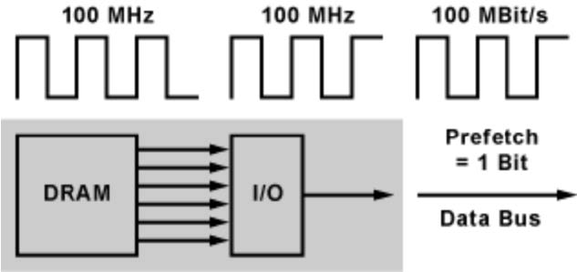 | 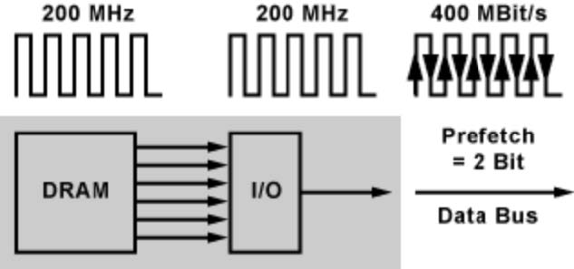 |  |

## 29 DDR-SDRAM 3

- Prefetchinginnerhalb des Speichers
- Zwei (DDR) oder mehr (DDR2, DDR3) Datenbits werden auf einmal ausgelesen
- Bedingung: Speicher-Controller fordert Daten aus hintereinander liegende Adressbereichen aus der gleichen Speicherfeldzeile an oder die angeforderten Daten liegen auf unterschiedlichen Speicherbänken
- Adresszugriffe müssen optimal auf die internen Speicherbänke verteilt werden - Nutzung der Taktverdopplung
- DDR - Verdopplung der Speicherbusgeschwindigkeit
- Tricks:
  - Prefetching-bei jeder Adressierung erfolgt ein paralleler Zugriff auf zwei interne Speicherbänke (DDR)
  - bei DDR2-SDRAM auf vier Speicherbänke
  - bei DDR3-SDRAM auf acht Speicherbänke
  - DDR4-SDRAM verwendet auch ein achtfaches Prefetching- der Zugriff erfolgt auf zwei oder vier Gruppen von Speicherbänken.
- Speicherbandbreite weiter erhöhen -Daten gleich aus zwei Speichermodulen anfordern -Dual-Channel
- Dual-Channel bezieht auf den Speicher-Controller Manche Speicher-Controller können auch mehr als 2 Speichermodule gleichzeitig auslesen (Triple-, Quad-Cannel)

## 30 Typen von DDR-SDRAM

| &nbsp;                                          | DDR1                           | DDR2                                | DDR3                              | DDR4                                |
| ----------------------------------------------- | ------------------------------ | ----------------------------------- | --------------------------------- | ----------------------------------- |
| offizielle Takt-frequenzen                      | 100 -200 MHz (DDR200 - DDR400) | 200 - 400 MHz (DDR2/400 - DDR2/800) | 400 -800 MHz(DDR3/800 -DDR3/1600) | 800 -1200 MHz(DDR4/1600 -DDR4/2400) |
| Takt Verhältnis I/O-Einheiten zu Speicherzellen | 1:1                            | 1:2                                 | 1:4                               | 1:8                                 |
| Takt der Speicher- zellen                       | 200 MHz bei DDR400             | 200 MHz bei DDR2/800                | 200 MHz bei DDR3/1600             | 200 MHz bei DDR4/2400               |
| nominelle Speicher-spannung                     | 2,5 V (±0,2V)                  | 1,8 V (±0,1V)                       | 1,5 V (±0,075 V)                  | 1,2 V                               |

## 31 SDR-SDRAM und DDR-SDRAM im Vergleich

| Speicher-modul | Speicher Typ | physikal. Takt-frequenz | genutzte Flanken | rechner. Taktrate | Interface | Speicher Bandbreite |
| -------------- | ------------ | ----------------------- | ---------------- | ----------------- | --------- | ------------------- |
| PC66           | SDR-SDRAM    | 66 MHz                  | 1                | 66 MHz            | 64 Bit    | 0,50 GByte/s        |
| PC100          | SDR-SDRAM    | 100 MHz                 | 1                | 100 MHz           | 64 Bit    | 0,75GByte/s         |
| PC133          | SDR-SDRAM    | 133 MHz                 | 1                | 133 MHz           | 64 Bit    | 0,99 GByte/s        |
| PC150          | SDR-SDRAM    | 150 MHz                 | 1                | 150 MHz           | 64 Bit    | 1,12 GByte/s        |
| PC166          | SDR-SDRAM    | 166 MHz                 | 1                | 166 MHz           | 64 Bit    | 1,24 GByte/s        |
| PC1600 (PC200) | DDR-SDRAM    | 100 MHz                 | 2                | 200 MHz (DDR200)  | 64 Bit    | 1,49 GByte/s        |
| PC2100 (PC266) | DDR-SDRAM    | 133 MHz                 | 2                | 266 MHz (DDR266)  | 64 Bit    | 1,98 GByte/s        |
| PC2700 (PC333) | DDR-SDRAM    | 166 MHz                 | 2                | 333 MHz (DDR333)  | 64 Bit    | ~ 2,7 GByte/s       |
| PC3200         | DDR-SDRAM    | 200 MHz                 | 2                | 400 MHz (DDR400)  | 64 Bit    | ~ 3,2 GByte/s       |

## 32 Bauformen

| &nbsp;  | SDR (SDRAM)            | DDR (SDRAM)      | DDR2 (SDRAM)     | DDR3 (SDRAM)     | DDR4 (SDRAM)     |
| ------- | ---------------------- | ---------------- | ---------------- | ---------------- | ---------------- |
| DIMM    | 168 Pins / 3,3 V/1,5 V | 184 Pins / 2,5 V | 240 Pins / 1,8 V | 240 Pins / 1,5 V | 284 Pins / 1,2 V |
| SO-DIMM | 144 Pins               | 200 Pins / 2,5 V | 200 Pins / 1,8 V | 204 Pins / 1,5 V | 256 Pins / 1,2 V |

## 33 DIMM-Speichermodule von DDR1, DDR2, DDR3 und DDR4 im Vergleich

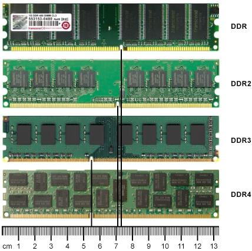

## 34 RDRAM - Rambus-DRAM

- (1995) Rambus-DRAM - die Firma Silicon Graphics setzte das RDRAM in ihren Workstations ein -Auch in den Nintendo-Spiele-Konsolen und auf einigen Grafikkarten fand dieser Speicher Anwendung
- Ende 1996 haben die Firmen Intel und Rambus ein Lizenzabkommen geschlossen. Um ein Monopol bei Chipsätzen für die Pentium-Prozessoren durchzusetzten hat Intel entschieden nur diesen Speicher in seinen Chipsätzen zu unterstützen
- da der Speicher durch die Lizenzpolitik sehr teuer war, hat er sich nie richtig durchgesetzt. Intel hat dann irgendwann auch Chipsätze für SDRAM entwickelt.

## 35 RIMM[^9] - Rambus Inline Memory Module

[^9]: RIMM Rambus Inline Memory Module

- Speichertechnik Rambus-DRAM der Firma Rambus eingesetzt
- Rambus-Interface ist eine Bus-Schnittstelle die Speichermodule sind hintereinander angeordnet -unbenutzte Steckplätze müssen mit einem Blind-Modul, dem C-RIMM, besetzt werden
- die C-RIMMs sind Module ohne Speicherbausteine. Sie überbrücken ungenutzte Steckplätze, die sonst zu einem offenen Ende des Rambus-Bus führen würden
- RIMM-Module lassen sich leicht durch das Kühlblech erkennen. Das Blech ist erforderlich, weil beim Zugriff auf den Speicher die Speicheradressen eng beieinanderliegen. Das führt zu einer höheren Belastung und extrem heißen Chips
- Für die Notebooks und andere tragbare Computer wurde eine spezielle RIMM-Ausführung (SO-RIMM[^10], Small Outline RIMM) entwickelt

| &nbsp;                            | &nbsp;                            |
| --------------------------------- | --------------------------------- |
| 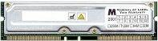 | 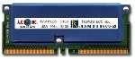 |

[^10]: SO-RIMM (Small Outline - RAMBUS Inline Memory Module)

## 36 VRAM - Video-RAM

- Heute spezielle DDR-SDRAMs mit anderer Taktung und schnelleren Zugriffszeiten
- GDDR1-4(„Graphics Double Data Rate“)
- z. B. Fa. Hynics 1,54 GHz, 92,8 GB/s, 5 ns, 256-bit-Anbindung

## 37 Die ZukunftNicht-Flüchtiger RAM

- SRAM mit Stützbatterie
- SRAM mit angekoppeltem EEPROM
- Ferroelectric Random Access Memory (FeRAM)
- Magnetoresistive Random Access Memory (MRAM)
- Phase-change random access memory (PCRAM)

## 38 Sonstige DRAM-Speichertypen

- FRAM -Ferro-electric RAM
- MRAM -Magnetoresistive RAM
- PC-RAM - Phase-Change-RAM, Phasenübergangsspeicher

## 39 FeRAM Memory (ferro-electric RAMs)

FRAM nutzt die Hysteresekurve des ferroelektrischen Effekts aus
|&nbsp;|&nbsp;|&nbsp;
|-----|-----|-----
|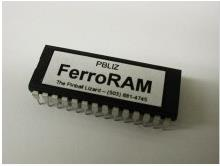|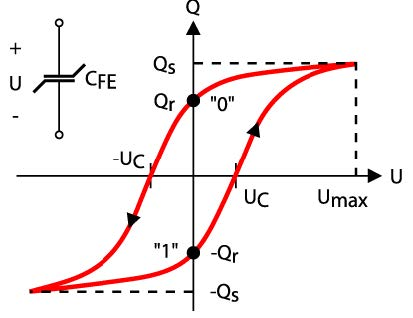|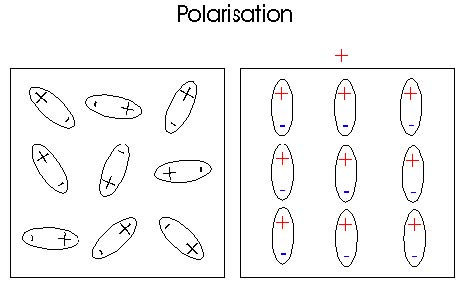

## 40 Das Ferroelektrische Speicherprinzip 1

FET[^11] - Field-effect transistor Transistor mit ferroelektrischem Kondensator

| &nbsp;                              | &nbsp;                              |
| ----------------------------------- | ----------------------------------- |
| 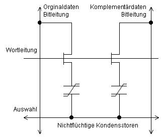 | 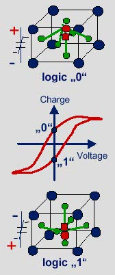 |

## 41 Das ferroelektrische Speicherprinzip 2

- entspricht einem Transistor (FET[^11]) und einem Kondensator
- Gate-Isolator des FETs wird durch eine dünne ferroelektrische Schicht ersetzt
  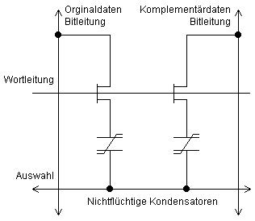
  Aufbau einer FRAM-Speicherzelle
  [^11]:FET Field-Effect Transistor A transistor in which the voltage on one terminal (the gate) creates a field that allows or disallows conduction between the other two terminals (the source and drain).

## 42 FRAM Ferroelectric RAM

- keine Stromversorgung für den Datenerhalt
- kompatibel zu den gängigen EEPROMs
- Datenhaltbarkeit über 10 Jahre, auch bei starken Temperaturschwankungen
- Schreibzeitca. 50 ns, 2,5 bis3V, z. Z 32 Mbit, 1,5 Tbit/in2.
- 1010 Schreib -und Lesezyklengarantiert, 10 Jahre
- FRAM wird als Ersatz für EEPROMs, Flash-EPROMs und gepufferten SRAMs verwendet
- magneto-resistiver Speicher
- schneller als DRAM
- weniger Platzverbrauch
- hohe Zuverlässigkeit
- Datenerhaltung ohne Strom
- großer Temperaturbereich
- FRAM scheidet wegen zu geringer Speicherdichte als Flash-oder SDRAM-Ersatz aus

## 43 MRAM (Magnetoresistive Random Access Memory)

- Fa. Freescale:
- 4-Mbit-MRAM MR2A16A 25 $
- Noch 0,18 µm später 0,09 µm
- Fa. NEC ebenfalls am Markt
- 200Mhz lesen, 500 MHz schreiben
- 2,3 ns Zugriffszeit
- 1/100 Energieverbrauch von DRAM
- magneto-resistiverSpeicher
- schneller als DRAM
- weniger Platzverbrauch
- hohe Zuverlässigkeit
- Datenerhaltung ohne Strom
- großer Temperaturbereich
  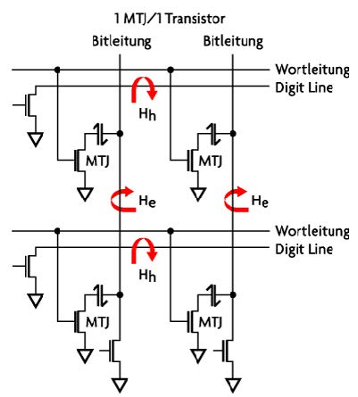

## 44 Eigenschaften von MRAM

- magneto-resistiver Speicher
- schneller als DRAM
- weniger Platzverbrauch
- hohe Zuverlässigkeit
- Datenerhaltung ohne Strom
- großer Temperaturbereich

## 45 PRAM - Phase Change Random Access Memory

| &nbsp;                            | &nbsp;                            |
| --------------------------------- | --------------------------------- |
| 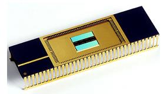 | 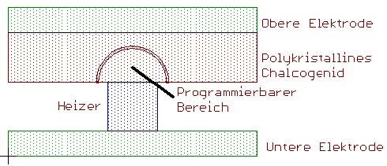 |

- auch OUM - Ovonic Unified Memory
- Wirkprinzip: Änderung des elektrischen Widerstandes(Faktor 40 bis 100) des Speichermaterials in Abhängigkeit davon, ob es in amorpher (hoher Widerstand / RESET state) oder in kristalliner (niedriger Widerstand / SET state) Phase vorliegt.
- Auslesen des gespeicherte Zustandes durch Widerstandsmessung möglich

## 46 PRAM

- Zustand wird durch Anlegen einer Spannung verändert (≈ 1 Volt)
- Speicherelemente sind Dioden
- Schreiben -
  - speichernde Schicht kurzzeitig über Schmelzpunkt erhitzt (ungeordnet, hoher Widerstand)
  - speichernde Schicht langsam Erhitzten bis unterhalb d. Schmelzpunktes (polykristalin, niedriger Widerstand)
- kleine Abmessung des Speicherelements (kleinere Chipgrößen)
- schnelle Zugriffszeiten auf den Speicher (schnelle Lese-und Schreibgeschwindigkeit)
- lange Lebensdauer
- Integration in CMOS möglich
- 30-mal schneller als Flash-Speicher, auch bei der Zahl der Schreibzyklen schlägt der neue Speicher den konventionellen um das Zehnfache

## 47 Vergleich ROM und RAM

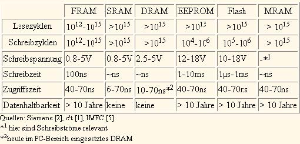

## 48 RAM-Vergleich

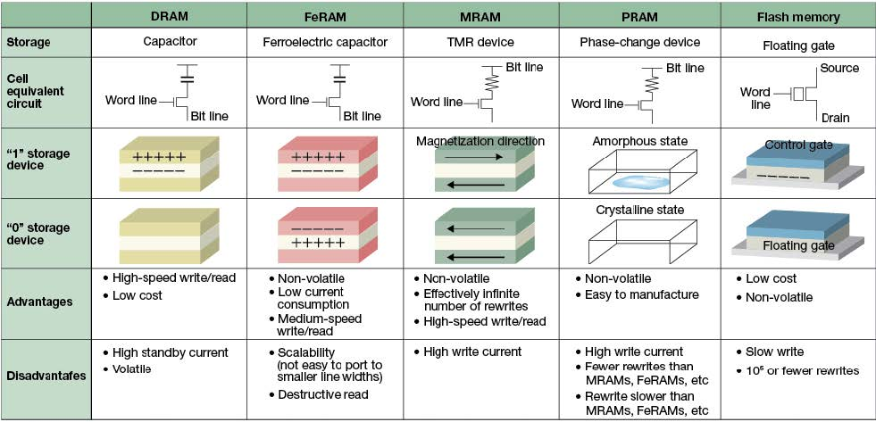

## 49 Flash-ROM

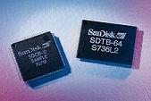

- Flash-ROM kombiniert Vorteile von Halbleiterspeicher und Festplatten
- Flash-Speicher kommt ohne bewegliche Teile aus. Und die Daten bleiben wie bei einer Festplatte auch nach dem Ausschalten erhalten
- Computer, deren Speicher rein auf Flash-ROM basieren, sind der Traum eines jeden Software-Entwicklers und Anwenders
- Der Flash-ROM hat sich aus dem EEPROM (Electrical Erasable and Programmable Read-Only Memory) entwickelt
- Je nach Literatur gibt es auch die Bezeichnungen Flash-EPROM und Flash-Memory
- Beim Flash-ROM ist die Speicherung von Daten funktionell identisch wie beim EEPROM
- die Daten werden wie bei einer Festplatte blockweise in Datenblöcken zu 64, 128, 256, 1024, ... Byte zugleich geschrieben und gelöscht

## 50 Flash-Speicherzelle

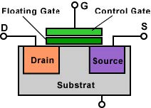

## 51 Vorteile der Flash-Speicher

- gespeicherte Daten bleiben auch bei fehlender Versorgungs spannung erhalten auf Erhaltungsladung kann verzichtet werden Energieverbrauch und Wärmeentwicklung geringer.
- bewegliche Teile fehlen Flash geräuschlos,
  unempfindlich gegen Erschütterungen und magnetische
  Felder
- Im Vergleich zu Festplatten haben Flash Speicher eine sehr kurze Zugriffszeit Lese und Schreibgeschwindigkeit sind über den gesamten Speicherbereich weitestgehend konstant.
- erreichbare Speichergröße ist durch einfache und platz sparende Anordnung der Speicherzellen nach oben offen

## 52 Nachteile von Flash-Speicher

- <r>einziger Nachteil von Flash ist die begrenzte Zahl von Schreib-bzw. Löschvorgängen</r>
- typischerweise gehen die Speicherzellen nach 10.000 Zyklen bei Multi-Level-Cells (MLC[^12]) und nach 100.000 Zyklen bei Single-Level-Cells (SLC[^13]) kaputt
- Das Floating Gate wird mit einer Spannung von 10 bis 13 Volt geladen (Schreibzugriff). Das ist notwendig, um die Oxidschicht (Isolation) zu überwinden. Dabei nimmt die Oxidschicht Schaden

[^12]: MLC Multi-Level-Cells
[^13]: SLC Single-Level-Cells

## 53 Dual-Channel

- 2 Speichermodule werden über 2 getrennte Datenbusse über den Speichercontroller vom Prozessor betrieben

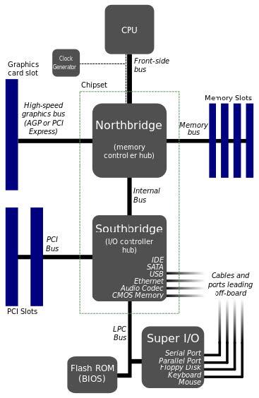

## 54 Speicherbelegungen

### Beispiel 1

- Speicherkanal 1
  - Slot 1: 512 MB
  - Slot 2: unbelegt
- Speicherkanal 1
  - Slot 1: 512 MB
  - Slot 2: unbelegt

### Beispiel 2

- Speicherkanal 1
  - Slot 1: 1 GB
  - Slot 2: 1 GB
- Speicherkanal 1
  - Slot 1: 1 GB
  - Slot 2: 1 GB

### Beispiel 3

- Speicherkanal 1
  - Slot 1: 1 GB
  - Slot 2: 512 MB
- Speicherkanal 1
  - Slot 1: 1 GB
  - Slot 2: 512 MB

### Beispiel 4 (nur best. Chipsätze)

- Speicherkanal 1
  - Slot 1: 512 MB
  - Slot 2: 512 MB
- Speicherkanal 1
  - Slot 1: 1 GB
  - Slot 2: unbelegt

## 55 Lernzielkontrolle

1. Welche verschiedenen Halbleiterspeicher gibt es in einem PC und welche Unterschiede
   bestehen bezüglich des Speicherverhaltens?
1. Was verbirgt sich hinter den Abkürzungen Flash-EEPROM, SRAM, DRAM, SDRAM und
   RDRAM?
1. Welche Arten von Flash-Speicherkarten gibt es? Welche Eigenschaften haben sie?
1. Was versteht man im Zusammenhang mit Speicherzellen unter einem Refresh?
1. Welche Kontrolle lässt sich bei Speicherbausteinen mit einer Paritätsprüfung durchführen?
1. Wodurch unterscheidet sich ein Cache-Speicher von dem normalen Arbeitsspeicher und welche Funktion hat er?
1. Welche Arten von Cache-Speichern unterscheidet man?
1. Welche Vorteile bietet die Platzierung des Cachespeichers auf dem CPU-Chip?
1. Welche Bedeutung hat der C-MOS-Speicher für den PC?
1. Welche Datenübertragungsraten ergeben sich theoretisch bei einem Speicherbustakt von 133 MHz bei einem SDR-SDRAM-Modul, einem DDR-SDRAM-Modul und einem DDR2-
   SDRAM-Modul?
1. Was versteht man unter dem sogenannten Speicher-Timing und wie ist die diesbezügliche Einstellung 2-3-3-8 im BIOS zu interpretieren?

## 56 Lösungen 1-1

| Speicher | Speicherverhalten                                                                                                                                 |
| -------- | ------------------------------------------------------------------------------------------------------------------------------------------------- |
| ROM      | - Nur-lese-Speicher  - Masken-programmierbarerSpeicher (mit Herstellungs-Prozess „programmiert“)  - z. B.: CD-ROM (kein Halbleiterspeicher) |
| PROM     | - Einmal programmierbar nach der Herstellung  - nicht mehr löschbar  - z. B.: CD-R (kein Halbleiterspeicher)                                |
| EPROM    | - Mehrmals programmierbaru. löschbar (wiederbeschreibbar nach Löschen (UV-Licht))                                                                 |
| EEPROM   | - Mehrmals programmierbaru. löschbar (wiederbeschreibbar nach Löschen (elektrische Impulse))  - z. B. BIOS                                     |

## 56 Lösungen 1-2

| Speicher  | Speicherverhalten                                                                                                                                                                                                                                                                       |
| --------- | --------------------------------------------------------------------------------------------------------------------------------------------------------------------------------------------------------------------------------------------------------------------------------------- |
| RAM       | - Speicher mitwahlweisem Zugriff, schreiben und lesen  - Informationen verschwinden bei Spannungsausfall                                                                                                                                                                             |
| SRAM      | - Statischer RAM, brauchtkein Refresh  - Behält die Informationen solange, wie Spannung anliegt  - Benötigt mehr Platz, da mehr Bauteile, teurer  - Schneller Flip-Flop, schnell  - Höherer Stromverbrauch  - Cache (L1, L2,….)                                          |
| DRAM      | - dynamischer RAM, brauchtRefresh, da Elektronen durch die Isolationsschicht „verschwinden“  - Behält die Informationen solange, wie Spannung anliegt  - Benötigt weniger Platz, da weniger Bauteile, billiger  - langsam  - niedriger Stromverbrauch  - Arbeitsspeicher |
| SDR-SDRAM | - Synchronisierter dynamischer RAM mit einfacher Datenrate  - Orientiert sich am Systemtakt, Speichern und lesen erfolgt im Takt, veraltet                                                                                                                                           |
| DDR-SDRAM | - Doppelte Datenrate RAM  - Signale werden mit auf - und absteigender Taktflanke übertragen  - DDR2, DDR3… Datenrate steigt, aber Zugriffszeiten steigen ebenfalls                                                                                                                |

## 58 Lösungen 2

| Speicher     | Speicherverhalten                                        |
| ------------ | -------------------------------------------------------- |
| Flash-EEPROM | Flash electricaly erasable programmable read only memory |
| SRAM         | Static Random access memory                              |
| DRAM         | Dynamic Random access memory                             |
| SDRAM        | Synchronous dynamic Random access memory                 |
| RDRAM        | Rambus dynamic Random access memory                      |

## 59 Lösung 3

Arten und Eigenschaften von Flash-Speicherkarten

| Art          | Eigenschaften             |
| ------------ | ------------------------- |
| Compactflash | - Keine beweglichen Teile |

Daten bleiben ohneBetriebsspannung (?) erhalten  - Kurze Zugriffszeiten  - Verschleiß des Controllers  - Konstant in Schreib-u. Lesezugriffen  - Schlechtes Preis-Volumenverhältnis  - Für Digicams  - Unempfindlich gegen magnet. Felder  - W: < 150 Mbyte/s
|SD-Card| - Secure-Digital  - Daten bleiben ohneBetriebsspannung (?) erhalten  - Unempfindlich gegen magnet. Felder  - W: < 95 Mbyte/s  - Interne Rechteverwaltung (Benutzerrichtlinien bleiben erhalten)
|MMC|Ähnliche Eigenschaften wie CF
