

# Kühlung von PC und Co

## 1 Wohin mit der Energie?

## 2 3 Gliederung

- Physikalische Grundlagen
- Woher kommt die „Wärme“
- Was ist die „TDP“[^1]
- Aktiv oder passiv
- Kühlungsmöglichkeiten passiv
- Kühlungsmöglichleiten aktiv
- Wärmeleitpaste?
- Heatpipe?
- Strömungsverhalten im Gehäuse
  [^1]: „TDP“

## 4 Physikalische Grundlagen

- Kühlung ist der „Abtransport“ der in Wärmenergie umgewandelten elektrischen Energie
- Erfolgt von „heißer“ Quelle zu „kalter“ Senke
- Strahlung (erfordert kein Medium, kann nicht aktiv beeinflusst werden)
- Leitung (erfordert Medium, materialabhängig, kann nicht aktiv beeinflusst werden)
- Strömung (erfordert Medium, materialabhängig, kann aktiv beeinflusst werden)

- Le refroidissement est l'"évacuation" de l'énergie électrique transformée en énergie thermique.
- Se fait de la source "chaude" vers le puits "froid".
- Rayonnement (ne nécessite pas de milieu, ne peut pas être influencé activement)
- Conduction (nécessite un fluide, dépend du matériau, ne peut pas être influencé activement)
- Courant (nécessite un fluide, dépend du matériau, peut être influencé activement)

Traduit avec www.DeepL.com/Translator (version gratuite)

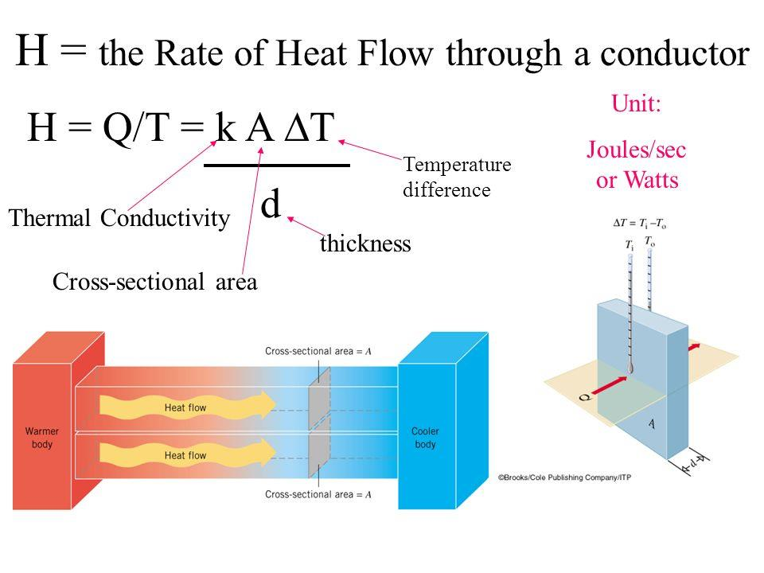

## 5 Woher kommt die „Wärme“?

### Elektrische Energie wird im elektronischen Bauelement auf Grund von Folgendem in Wärmeenergie umgewandelt:

- Ohmschen Widerständen
- Kapazitiven Umladungen (+, -)
- Taktfrequenz

- Résistances ohmiques
- Transfert de charges capacitives (+, -)
- Fréquence d'horloge

### Fast die komplette elektrische Energie wird umgewandelt

## 6 Was ist TDP?

- Thermal Design Power – Berechnete Thermische Verlustleistung
- Maximaler Wert für elektronische Geräte und Komponeten (CPU, GPU, …)
- Grundlage für Kühlung u. Netzteil
- Angegebener Wert meist größer als tatsächliche TDP
- Hersteller fassen TDP in Gruppen zusammen
- Leitlinie für Mainboard und Kühl-Körper(-Varianten)-Hersteller

### Ist abhängig unter anderem von

- Taktfrequenz
- Vcore
- Umgebungstemperatur
- Strukturgröße
- Materialübergängen (Nacktchip, Heatspreader, Wärmeleitpaste)

<f>Je höher die TDP-Klasse desto höher der Aufwand für die Kühlung – Erhöhung von Zuverlässigkeit und Verfügbarkeit!</f>

## 7 Aktiv oder Passiv?

### Aktiv

- Wärmeenergie durch Zuführung von „Fremd“-Energie abgeführt bzw. transportiert
- Strömung kann beeinflusst werden
- Lüfter, Pumpen, elektrophysikalische Effekte (Peltier)
- Game-PC, Server

- Élimination ou transport de l'énergie thermique par l'apport d'énergie "étrangère".
- Le flux peut être influencé
- Ventilateurs, pompes, effets électrophysiques (Peltier)
- PC de jeu, serveur

### Passiv

- Wärmeenergie wird ohne Zuführung von „Fremd“-Energie abgeführt bzw. transportiert
- Strahlung – Gestaltung der Oberfläche
- Leitung – Materialien mit guten Wärmeleitkoeffizient, Wärmebrücken
- Vermeidung von Wärmeisolation (Luft, Vakuum)
- Smartphone, Mini-, Micro-PC, Raspberry Pi

- L'énergie thermique est évacuée ou transportée sans apport d'énergie "étrangère".
- Rayonnement - conception de la surface
- Conduction - matériaux avec un bon coefficient de conductivité thermique, ponts thermiques
- éviter l'isolation thermique (air, vide)
- Smartphone, mini-, micro-PC, Raspberry Pi

## 8 Entwicklung 1

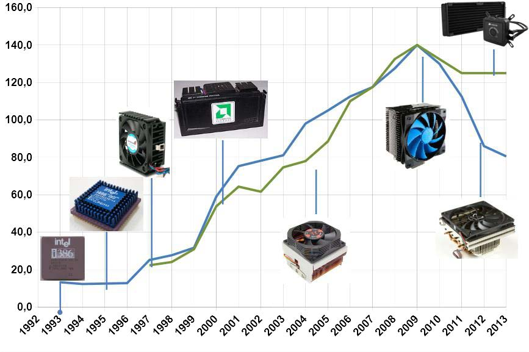
_Entwicklung_

## 9 Entwicklung 2

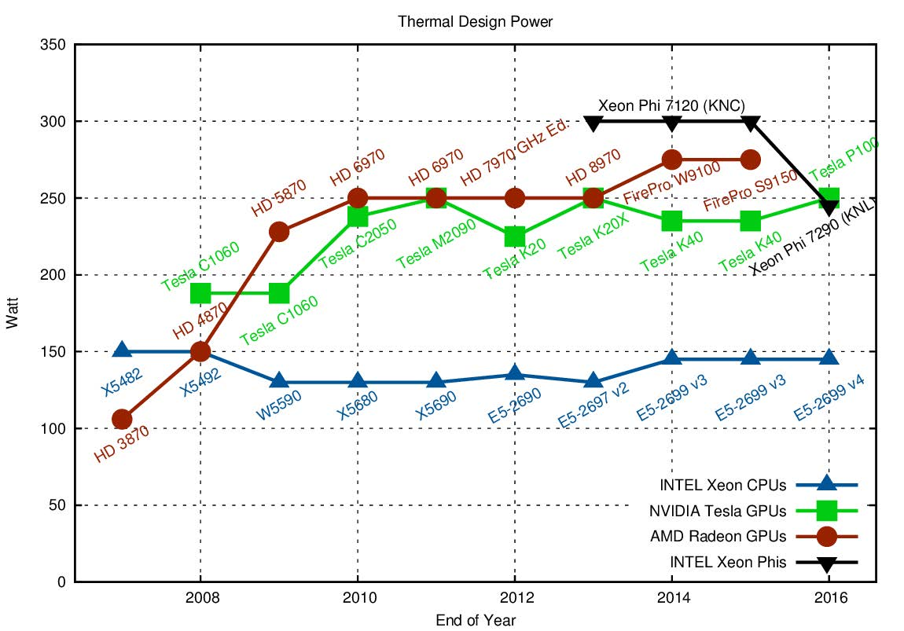
_Entwicklung_

## 10 Kühlung - Passiv

| &nbsp;                          | &nbsp;                          |
| ------------------------------- | ------------------------------- |
| 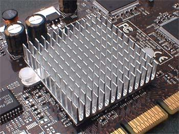 | 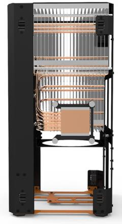 |
| 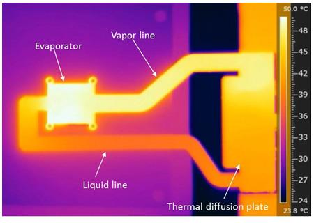 | 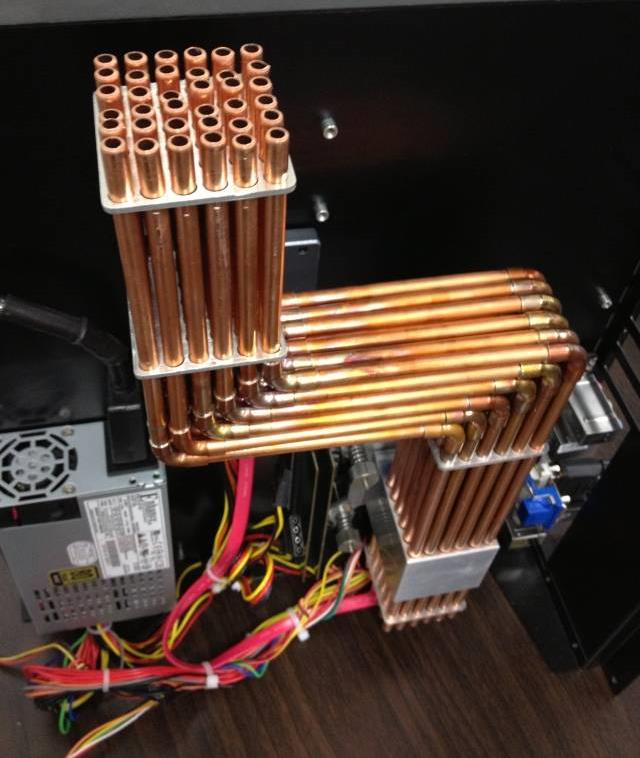 |

|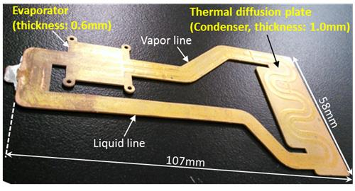

## 11 Kühlung – Aktiv – Topflow-Kühler

| &nbsp;                        | &nbsp;         |
| ----------------------------- | -------------- |
| 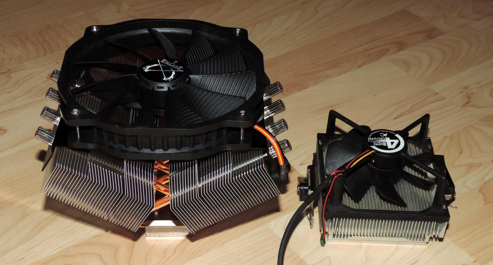 | Topflow-Kühler |

## 12 Kühlung – Aktiv – Turm-Kühler

| &nbsp;                         | &nbsp;                          |
| ------------------------------ | ------------------------------- |
| 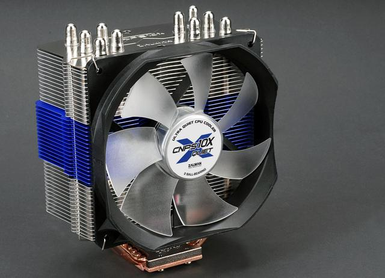 | _Kühlung – Aktiv – Turm-Kühler_ |

## 13 Kühlung – Aktiv – Radial-Kühler

| &nbsp;                         | &nbsp;                            |
| ------------------------------ | --------------------------------- |
| 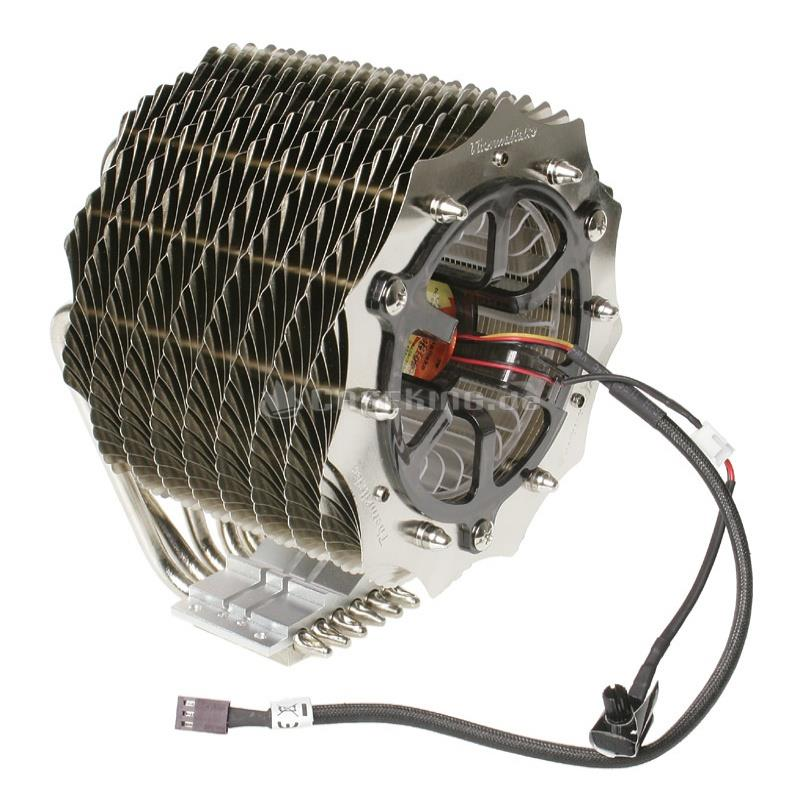 | _Kühlung – Aktiv – Radial-Kühler_ |

## 14 Kühlung – Aktiv – Kompaktwasserkühlung

| &nbsp;                         | &nbsp;                                   |
| ------------------------------ | ---------------------------------------- |
| 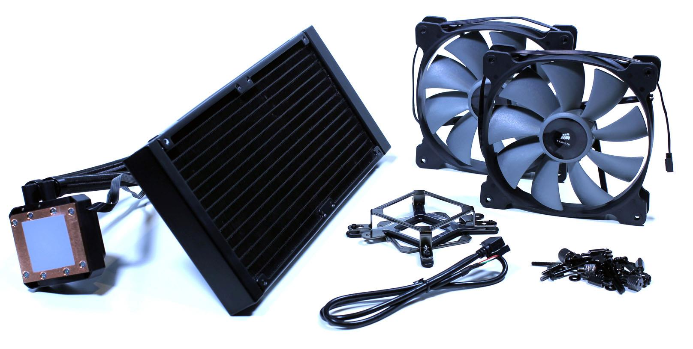 | _Kühlung – Aktiv – Kompaktwasserkühlung_ |

## 15 Kühlung – Aktiv – FlüssigmetallKühlung

| &nbsp;                         | &nbsp;                         |
| ------------------------------ | ------------------------------ |
| 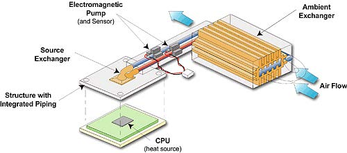 | 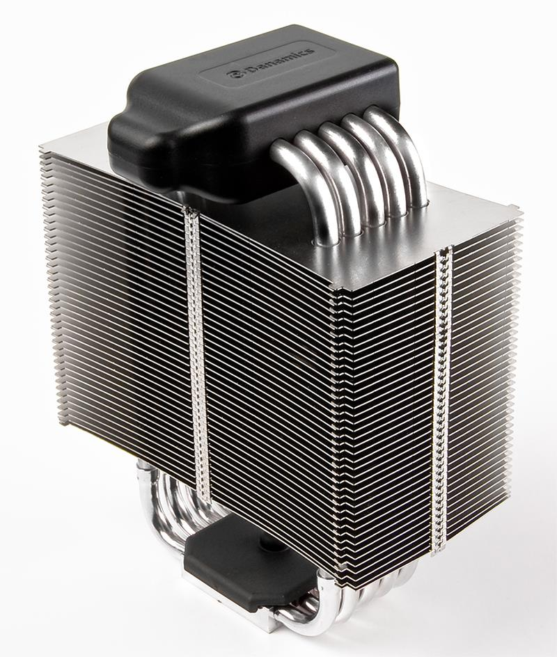 |

## 16 Kühlung – Aktiv – Peltier-Kühlung

| &nbsp;                         | &nbsp;                         |
| ------------------------------ | ------------------------------ |
| 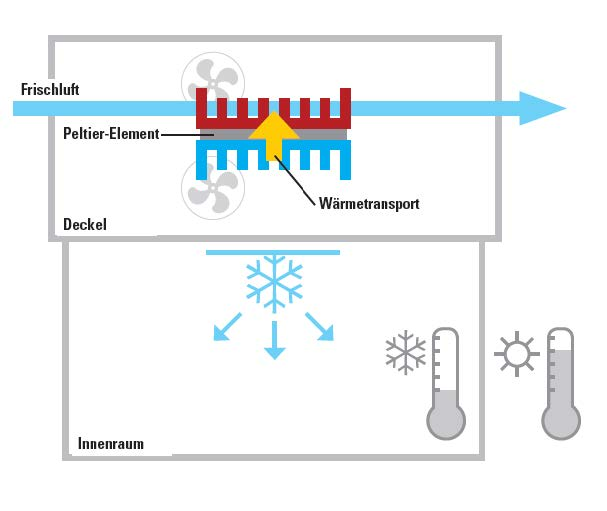 | 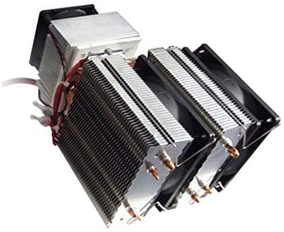 |

|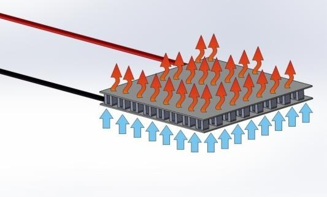
_Kühlung – Aktiv – Peltier-Kühlung_

## 17 Wärmeübergang?

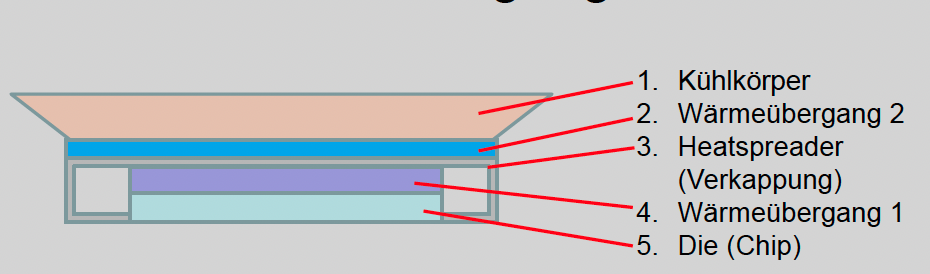

1. Kühlkörper
2. Wärmeübergang 2
3. Heatspreader (Verkappung)
4. Wärmeübergang 1
5. Die (Chip)

- Die Wärmeübergänge sollten so effektiv als möglich
  gestaltet werden
- Die Grenzflächen sind nicht 100 %ig eben
- Für möglichst geringen Wärmewiderstand werden div.
  Hilfsmittel eingesetzt
  - Wärmeleitpaste
  - Flüssigmetall
  - Wärmeleitpad

## 18 Wärmeleitpaste

| &nbsp;                                         | &nbsp;                                         |
| ---------------------------------------------- | ---------------------------------------------- |
| 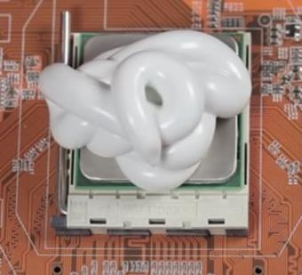 | 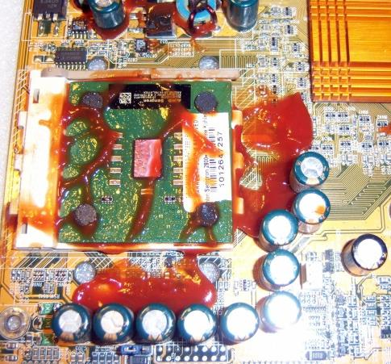 |

- Dient dem Ausgleich der Unebenheiten zwischen
  Die/Heatspreader und Kühlkörper/Collector
- Vermeidung von Lufteinschlüssen
- Silikonöl und Zinkoxid (Aluminium-, Graphit- oder
  Silberbestandteile - leitfähig)
- Nichtleitfähige Pasten auf Kohlenstoffbasis

## 19 Werkzeuge?

| &nbsp;                                 | &nbsp;                                                                                           |
| -------------------------------------- | ------------------------------------------------------------------------------------------------ |
| 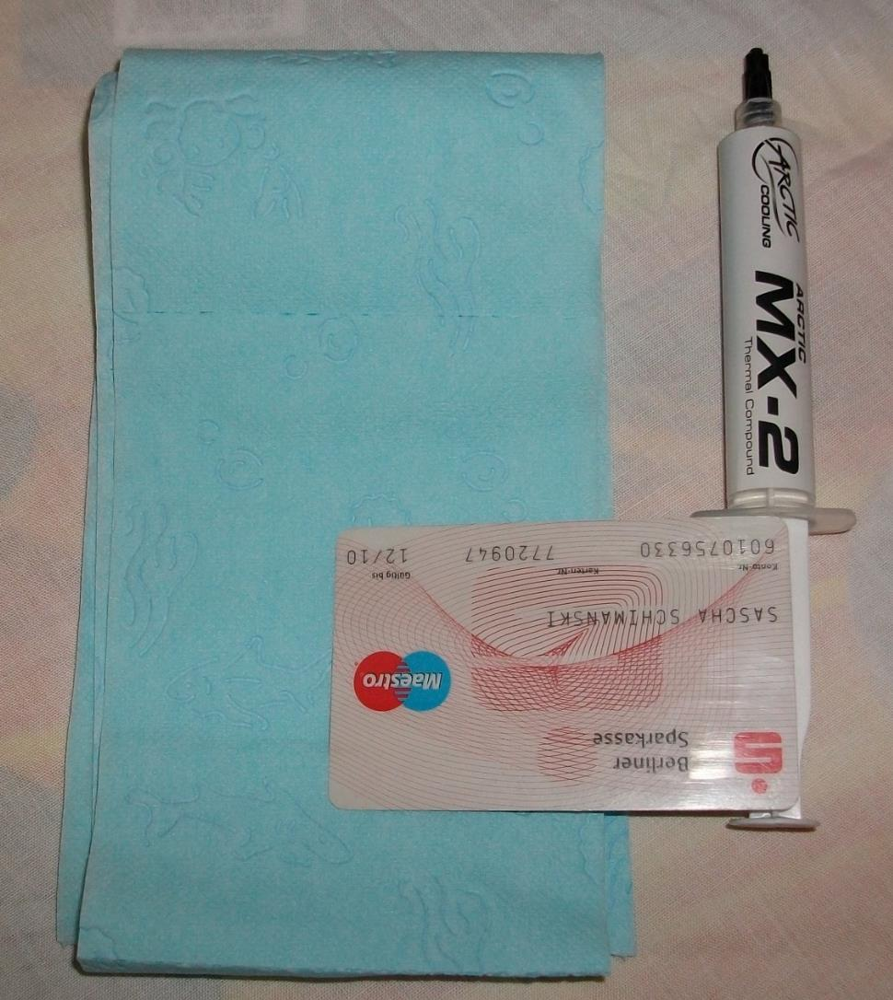 | - Plastikkarte, Reinigungstuch - Wärmeleitpaste - Reinigungsflüssigkeit (Isopropanol, H2O) |

## 20 Welche Menge?

| &nbsp;                         | &nbsp;                         |
| ------------------------------ | ------------------------------ |
| 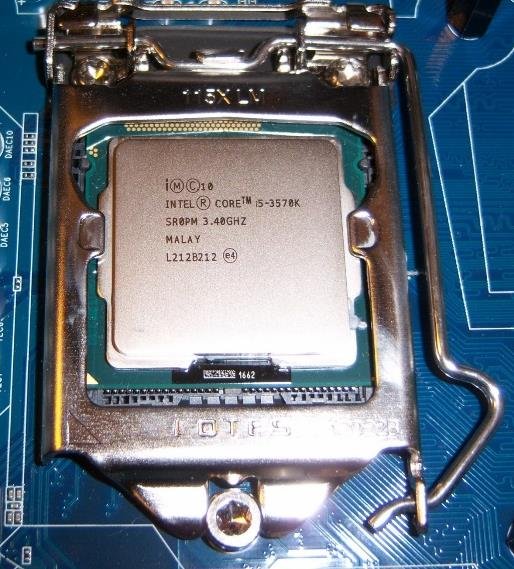 | 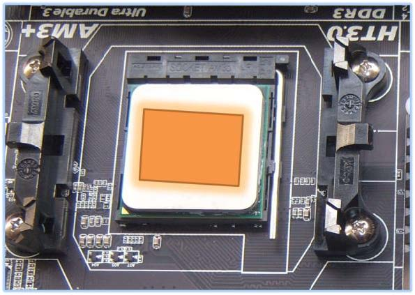 |

- Etwa ein erbsengroßes „Stück“, je nach Prozessorgröße
- Auf dem Die oder Heatspreader je nach Hotspot verstreichen
- Oder einfach dem Anpressdruck des Kühlkörpers überlassen

## 21 Wärmeleitung – Flüssigmetall?

### Vorteil

- trocknet nicht aus
- Höherer Wärmeleitkoeffizient
- Niedrigere Temperaturen der CPU

### Nachteil

- Reagiert mit anderen Metallen bes. Aluminium

| &nbsp;                         | &nbsp;                         |
| ------------------------------ | ------------------------------ |
| 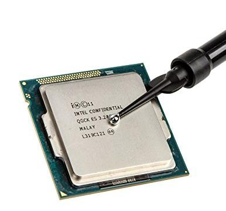 | 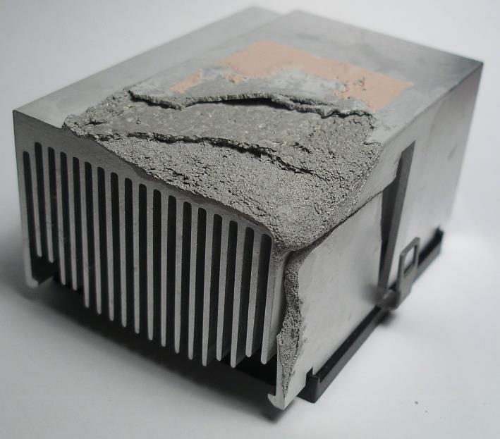 |

## 22 Heatpipe - Aufbau

- Wartungsfreier Wärmetransporteur
- Funktioniert meist unabhängig von der Schwerkraft
- Kapilarwirkung

| &nbsp;                               | &nbsp;                               |
| ------------------------------------ | ------------------------------------ |
| 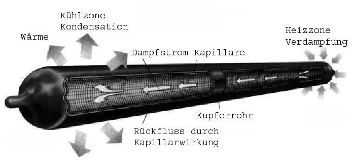 | 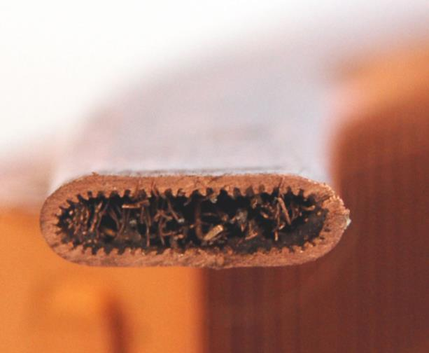 |
| 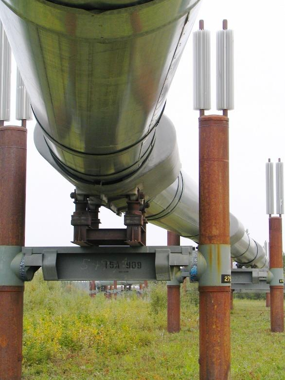 |

## 23 Heatpipe - Funktionsweise

| &nbsp;                              | &nbsp;                                                                                                                                                                                                                                               |
| ----------------------------------- | ---------------------------------------------------------------------------------------------------------------------------------------------------------------------------------------------------------------------------------------------------- |
| [Heatpipe!](img/k29.jpg "Heatpipe") | 1. In der heißen Zone nimmt die Heatpipe die Wärme auf 2. Die enthaltende Flüssigkeit wandelt sich in ein Gas um 3. Dieses strömt zur anderen Seite, wo es abkühlt und sich wieder verflüssigt 4. Und an den Innenseiten wieder zurückläuft |

## 24 Vapor Chamber 1

| &nbsp;                                         | &nbsp;                                                                                                                                                                                                                                          |
| ---------------------------------------------- | ----------------------------------------------------------------------------------------------------------------------------------------------------------------------------------------------------------------------------------------------- |
| 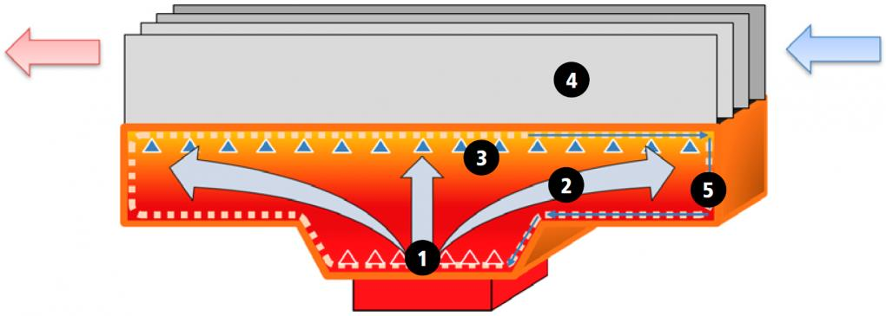 | 1. Verdampfung, Wärmequelle (z. B. Prozessor) 2. Dampfphase (verdunstetes Kühlmittel) 3. Abgabe der Wärmeenergie an Kühlrippen (Kondensation) 4. Abtransport der Wärmeenergie durch Luftströmung 5. Rückfluss durch Kapillarwirkung |

## 25 Vapor Chamber 2

| &nbsp;                                         | &nbsp;        |
| ---------------------------------------------- | ------------- |
| 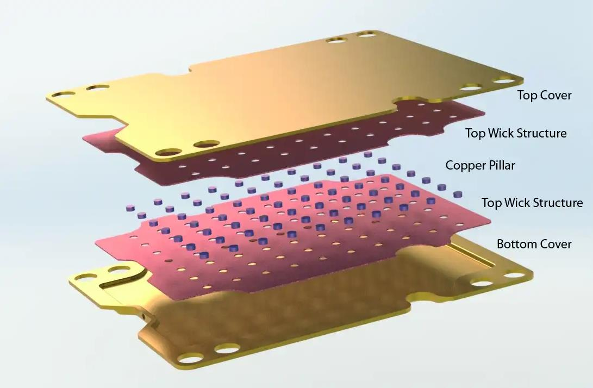 | Vapor Chamber |

## 26 Vapor Chamber 3

| &nbsp;                                         | &nbsp;                                                                                                                                                      |
| ---------------------------------------------- | ----------------------------------------------------------------------------------------------------------------------------------------------------------- |
| 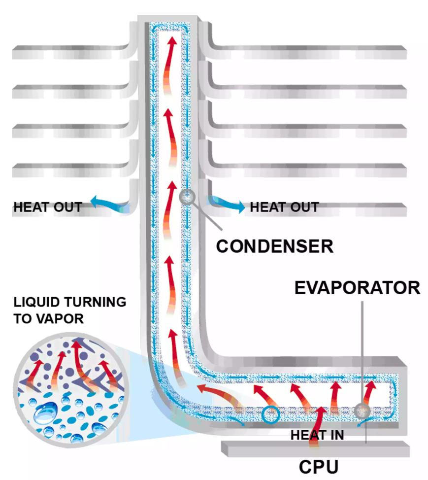 | Vereinfacht - flache Heatpipes  Vapour Chambers werden horizontal verwendet  Vapour Chambers transportieren die Wärme deutlich langsamer als HP |

## 27 Vapor Chamber 4

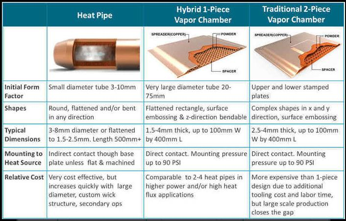

## 28 Luftkühlung

| &nbsp;                                         | &nbsp;                                                                                                                                                                                                      |
| ---------------------------------------------- | ----------------------------------------------------------------------------------------------------------------------------------------------------------------------------------------------------------- |
| 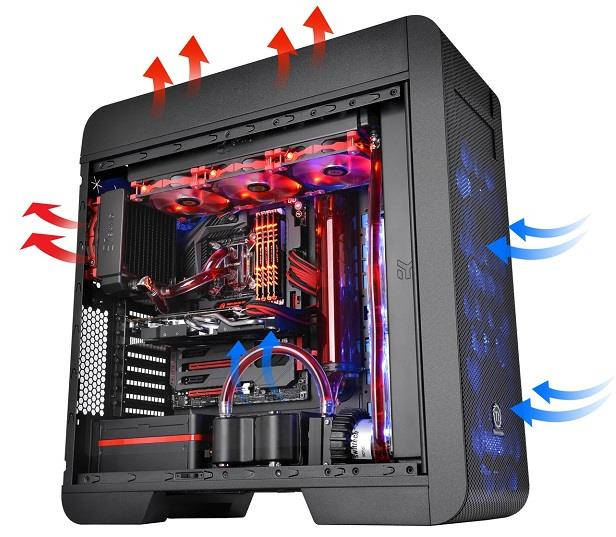 | - Unterstützung der Strömung durch Ventilatoren  Zur Beachtung - definierter Luftstrom - Keine Verwirbelungen - Leichter gefilterter Überdruck im Gehäuse zur Vermeidung von Verschmutzungen |

## 29 Optimaler Luftstrom

| &nbsp;                                                     | &nbsp;              |
| ---------------------------------------------------------- | ------------------- |
| 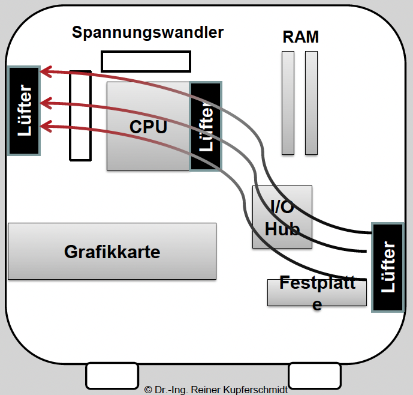 | Optimaler Luftstrom |

## 30 So oder so?

| &nbsp;                                   | &nbsp;                                   |
| ---------------------------------------- | ---------------------------------------- |
| 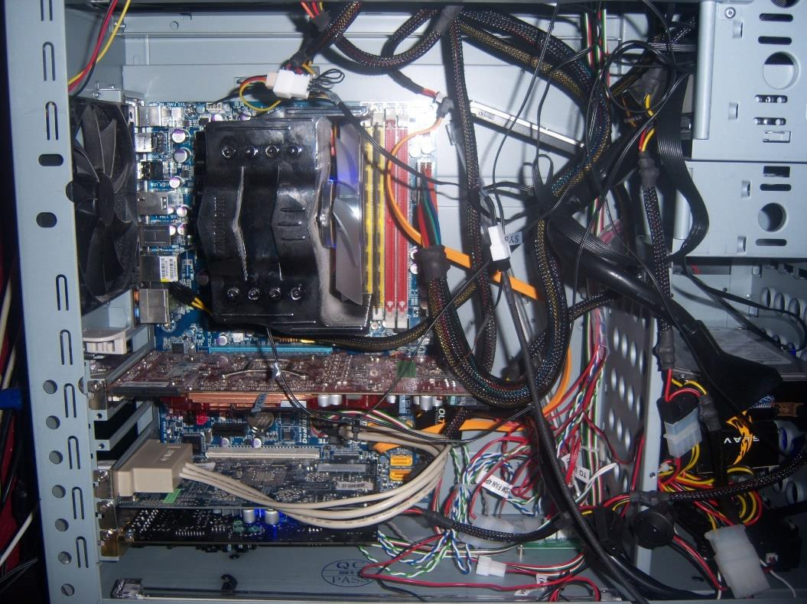 | 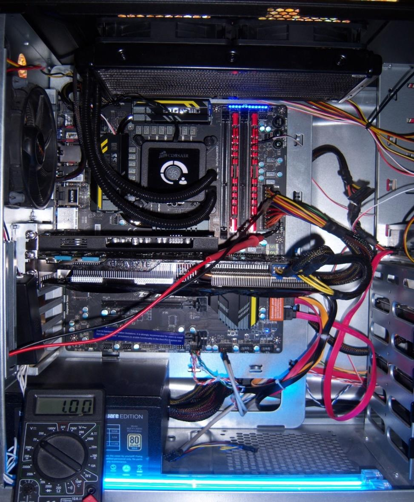 |

## 31 Wasserkühlung

| &nbsp;                                         | &nbsp;                                                                                                                                                                                                                                                                                                                                    |
| ---------------------------------------------- | ----------------------------------------------------------------------------------------------------------------------------------------------------------------------------------------------------------------------------------------------------------------------------------------------------------------------------------------- |
| 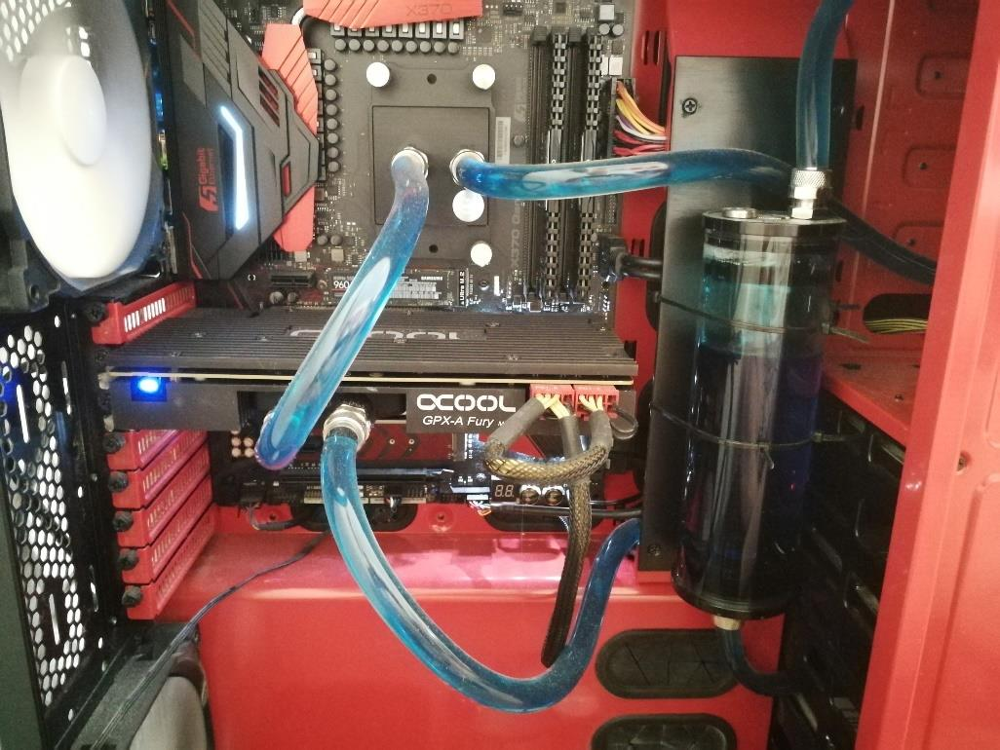 | - Arbeitet ähnlich einer Warmwasserheizung - Wasser „ersetzt“ den Luftstrom - Aber nicht vollständig! - Bauelemente sind wärmetechnisch in Reihe zu schalten - Benötigt Lüfter für Radiatoren (Wärmetauscher) - Luftkühlung für div. Bauelemente auf Motherboard  - Spannungswandler  -Chipsatz  -Arbeitsspeicher |

## 32 Lüftersteuerung

| &nbsp;                                             | &nbsp;                                                                                             |
| -------------------------------------------------- | -------------------------------------------------------------------------------------------------- |
| 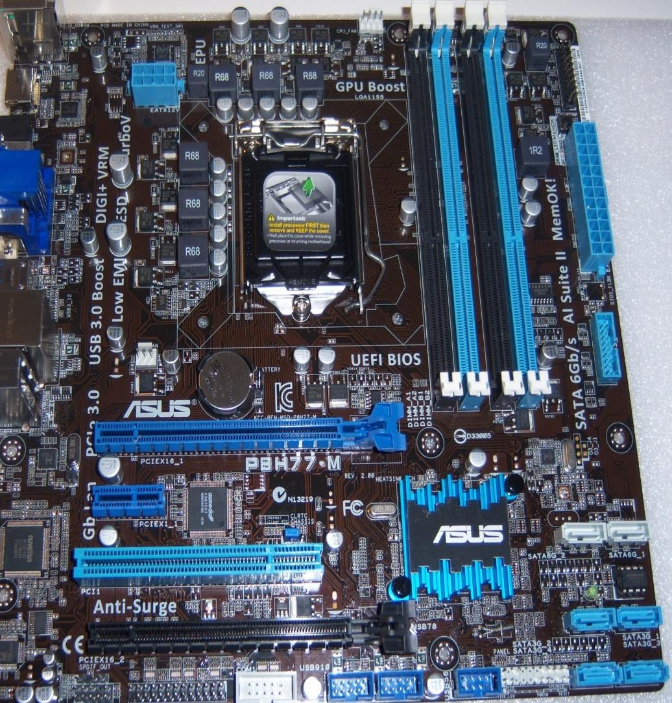 | - **Fan-Anschlüsse**  - 3-polig  - 4-polig (geregelt)  - 12 V  - Möglichst großer dmr. |

## 33 Flüssigmetallkühlung

| &nbsp;                                             | &nbsp;               |
| -------------------------------------------------- | -------------------- |
|  | Flüssigmetallkühlung |

- Flüssigmetall ersetzt Wasser
- Wird durch starke Magnetfelder umgewälzt

### Vorteile

- Keine Mechanik
- Sehr langlebig
- Sehr gute Kühlleistung

### Nachteile

- Hohe Ströme
- Und somit starke Magnetfelder
- Hoher Preis -> 120€

## 34 Kompressorkühlung

| &nbsp;                                                 | &nbsp;                                                                                                                                                                                         |
| ------------------------------------------------------ | ---------------------------------------------------------------------------------------------------------------------------------------------------------------------------------------------- |
| 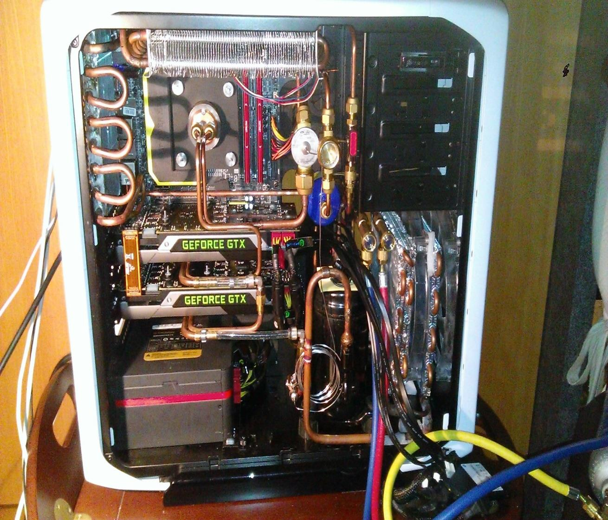 | - Funktion ähnlich Kühlschrank - Hoher Aufwand - Laut - Effektiv - Komplexer Aufbau - Schwierig zu ergänzen und zu warten - Probleme mit Kältemittel - Individuallösungen |

## 35 Kompressorkühlung - Funktionsweise

| &nbsp;                                                 | &nbsp;                                                                                                                                                                                                                                                                                                                                                                                                   |
| ------------------------------------------------------ | -------------------------------------------------------------------------------------------------------------------------------------------------------------------------------------------------------------------------------------------------------------------------------------------------------------------------------------------------------------------------------------------------------- |
| 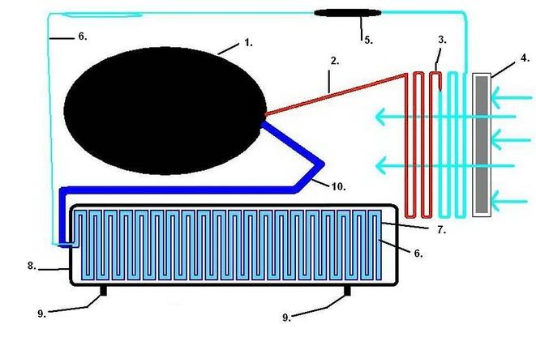 | 1. Verdichter/Kompressor 2. Hochdruckleitung (heiß),gasförmig 3. Verflüssiger (Kondensator, Kühlung des Kältemittels) /gasförmig zu flüssig 4. Lüfter 5. Filter /flüssig 6. Kapillarrohr (Drosselorgan) /flüssig 7. Evaporator (Verdampfer) /flüssig zu gasförmig 8. HX (Heatexchanger) 9. Anschlüsse für den Kühlkreislauf 10. Niederdruck- oder auch Saugleitung /gasförmig |

## 36 Weitere Lösungen…

| &nbsp;                                                 | &nbsp;                                                                                             |
| ------------------------------------------------------ | -------------------------------------------------------------------------------------------------- |
| 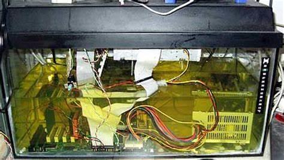 | 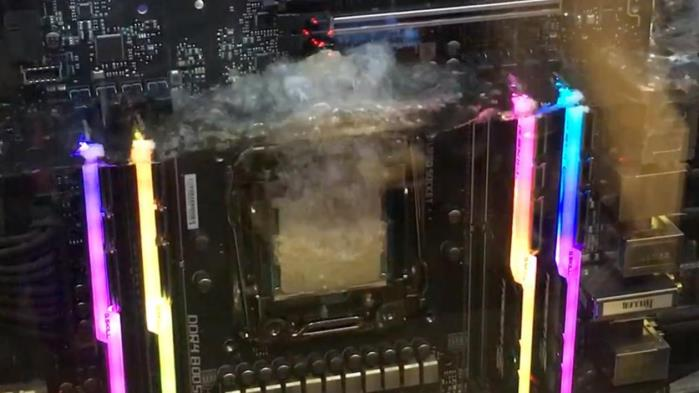                                             |
| 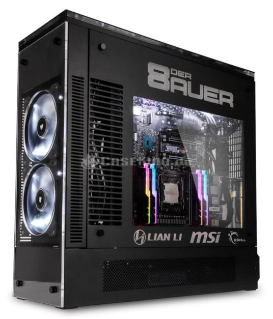 | - Peltierelemente - Trockeneiskühlung - Stickstoffkühlung - „trockenes“ Wasser - Ölbad |

## 37 Komponente Software und Messmethode und Temperaturbereich

| Komponente                   | Software & Messmethode                               | <td colspan =3 >Temp (°C)                   |                                              |                                          |
| ---------------------------- | ---------------------------------------------------- | ------------------------------------------- | -------------------------------------------- | ---------------------------------------- |
| CPU Kerntemperatur           | Core Temp, HWINFO AMD: AMD-Overdrive, Intel:Realtemp | 
 Bis 55 | 
56-74   | 
Ab 75  |
| CPU Spannungswandler         | Temperaturfühler auf der Rückseite der Platine       | 
Bis 55  | 
61-89   | 
Ab 90  |
| Chipsatz                     | Temperaturfühler auf der Rückseite der Platine       | 
Bis 50  | 
51-59   | 
Ab 60  |
| Grafikkarte - GPU            | GPU-Z, MSI-Afterburner                               | 
Bis 70  | 
71-89   | 
ab 90  |
| Grafikkarte Spannungswandler | GPU-Z, MSI-Afterburner                               | 
Bis 100 | 
101-109 | 
Ab 110 |
| HDD/SSD                      | Crystal Disk Info                                    | 
Bis 45  | 
46-59   | 
Ab 60  |

## 38 Lernerfolgskontrolle

- Was ist Kühlung?
- Was passiert während der Kühlung?
- Welche physikalischen Vorgänge liegen der Kühlung zu Grunde?
- Welche Arten der Kühlung kennen Sie? Nennen Sie je 2 Beispiele!
- Welcher Parameter eines Prozessors ist maßgeblich für die Dimensionierung der Kühlung bestimmend?
- Nennen Sie mindestens 4 Faktoren die diesen Parameter des Prozessors beeinflussen!
- Nennen Sie mindestens 4 aktive Kühlmöglichkeiten und erläutern Sie das Funktionsprinzip in ein bis zwei Stichpunkten!
- Zeichnen Sie in den Querschnitt eines PC den Lauf der Kühlluft und die zu verbauenden Lüfter ein!
- Nennen Sie mindestens 4 Fehler, die bei dem Aufbau der Kühlung nicht passieren dürfen!
- Welchen Zweck soll die Wärmeleitpaste erfüllen?
- Welche Bauelemente werden mit Wärmeleitpaste „verbunden“?
- Was ist beim Auftragen der Wärmeleitpaste zu beachten?
- Erläutern Sie die Funktionsweise einer Heatpipe?
- Was sind die Unterschiede zwischen aktiver und passiver Kühlung?

## 39 Quellen

https://www.legitreviews.com/wp-content/uploads/2014/01/Thermaltake-Core-V71-full-tower-case-is-the-ultimate-powerhouse-suitable-for-anytype-of-PC-enthusiast-%E2%80%93-no-matter-liquid-cooling-or-extreme-airflow.jpg  
https://www.computerbase.de/2018-08/cpu-tdp-verbrauch-amd-intel/  
https://www.karlrupp.net/wp-content/uploads/2013/06/tdp.png  
https://www.powerelectronicsnews.com/thermal-design-for-a-high-density-gan-based-power-stage/  
https://www.pcmasters.de/system/photos/7992/full/m__c54dc4fbcb40012cd142c7a999f79b478122142131728__m.jpg?1392720220  
http://www.sigem-elektronik.de/computer/angebot/bilder/kk_graka.jpg  
https://www.fujitsu.com/global/Images/11-1e_tcm100-1559501.jpg  
https://www.pcgameshardware.de/screenshots/medium/2009/07/_DSC5673.jpg  
https://www.allround-pc.com/wp-content/uploads/2015/03/Corsair-H110i-GT-Lieferumfang.jpg  
https://www.computerbase.de/2005-05/sapphire-entwickelt-fluessigmetallkuehlung/#bilder
https://extreme.pcgameshardware.de/luftkuehlung/43786-howto-sammelthread-fluessigmetall-waermeleitmittel.html
https://de.wikipedia.org/wiki/W%C3%A4rmerohr
