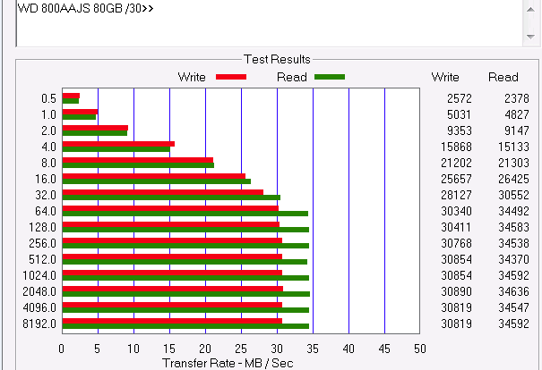
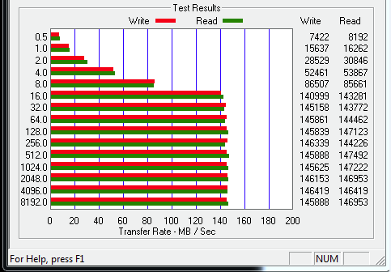
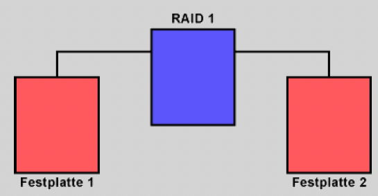
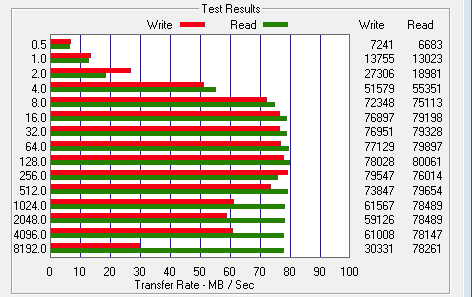
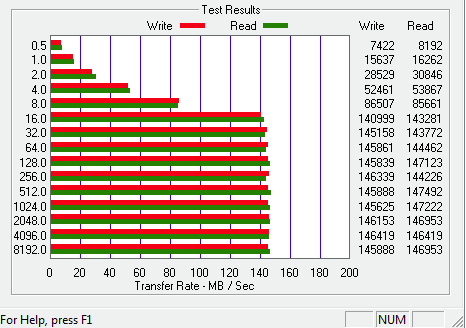
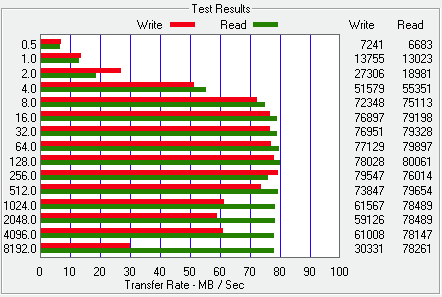
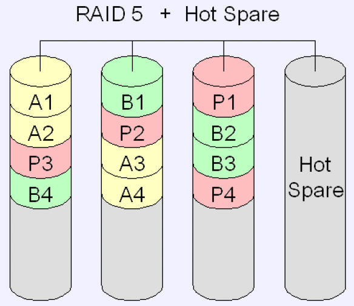

# RAID

## 1 Redundant Arrayof Independent (Inexpensive) Disk

## 2 Gliederung

- Zweck
- Prinzip –Möglichkeiten
- RAID-Level
- genutzte RAID-Level
- Hardware-RAID
- Software-RAID
- Host-RAID
- RAID-Arten, Vor-und Nachteile
- Lernzielkontrolle
- Quellen

## 3 Zweck

- Festplattenverbund von zwei oder mehr Festplatten, bei dem alle Daten mehrfach (redundant) vorhanden sind und man so vor Ausfall einer oder mehrerer Einzelplatten geschützt ist (außer RAID0)
- Geschwindigkeit steigern
- Daten-Verfügbarkeit erhöhen
- oder beides zusammen
- <f>Achtung: Ein RAID ersetzt niemals eine Datensicherung</f>

## 4 Prinzip - Möglichkeiten

- RAID-Adapter oder Betriebssystem fassen mindestens zwei oder mehr Festplatten zu einem logischen Verbund zusammen - Array
- BS „sieht“ ein einziges logisches Laufwerk mit besonderen Eigenschaften
- Daten werden im „Hintergrund“ auf die physischen Laufwerke verteilt
- Hilft nur bei Ausfall einer Platte (Ausnahme RAID 6)
- Redundanz nur wenn hohe Verfügbarkeit gefordert, auch bei Plattendefekt!
- Schützt nicht vor Viren, Würmern oder versehentlichem Löschen, da gleichzeitiger Zugriff auf alle physischen Laufwerke
- <f>KEIN Ersatz für Backup!</f>

## 5 Datenträger HDD/SSD???

IST?

- Physisch/logisch
- Laufwerke: optisch, magnetomechanisch, elektronisch
- Lese/Schreibgeschwindigkeit
- Schnittstelle
  - Übertragungsgeschwindigkeit
  - Protokoll
  - Formfaktor
- Firmware
  - Blockeinstellungen
  - Orientierung, Index, Winkel
  - Anzahl der Blöcke
- Cache
- Lebensdauer
- Betriebsart
- Speicherplatz
- Bootfähigkeit
- Lebensdauer
- Betriebsspannung, Stromversorgung
- Mechanische, Elektronische und Magnetische Beanspruchbarkeit und Empfindlichkeit

## 6 Datenträger HDD/SSD???

- IST: Laufwerk, Formatierung 512 Byte/Block
- SOLL: Wie geht es weiter?
  - Partitionstabelle schreiben
    - MBR
    - GPT
  - Partitionen anlegen
  - Formatierung, Filesystem anlegen
    - Blöcke werden zu Cluster
    - Maximale Dateigröße
    - Verschnitt
  - Bootfähigkeit?!
  - Speichern von Daten

## 7 Physisch –Logisch?

- Physisches Laufwerk
  - Physisch vorhandene Hardware
  - HDD, SSHD[^1], SSD
  - Kann in logische Laufwerke (Partitionen) aufgeteilt werden
  - „Benutzer kann die Laufwerke anfassen“
- Logisches Laufwerk
  - Betriebssystem „sieht“ nur ein Laufwerk
  - Mehrere physische Laufwerke können zusammengefasst werden oder
  - Partitionen eines physischen Laufwerks
  - „Benutzer kann die Laufwerke NICHT anfassen“

[^1]: SSHD Solid State Hybrid Drive is a logical or physical storage device that combines a faster storage medium such as solid-state drive with a higher-capacity hard disk drive. The intent is adding some of the speed of SSDs to the cost-effective storage capacity of traditional HDDs.

## 8 Hardware-RAID

- Klassische Form
- RAID-Controller
  - Meist über PCI oder PCIe connectiert
  - Organisiert die Datenverteilung auf den Festplatten
  - Berechnung der Prüfsummen, Paritäten
  - „verbirgt“ die Plattenstruktur vor dem Betriebssystem –logisches Laufwerk!
  - Ermöglicht Start des BS von RAID-Laufwerk

| PCI                         | PCIe                        |
| --------------------------- | --------------------------- |
|  |  |

## 9 Host-RAID

- Zwischenstufe Hard-/Software-RAID
- RAID-Chipsatz, RAID-Adapter (Motherboard)
- RAID-Funktionen werden von der Firmware bzw. den Treibern erledigt
- Aufwendige Berechnungen übernimmt der Hauptprozessor
- Hohe Belastung der CPU (Fake-RAID)
- RAID-Adapter kann nur durch kompatiblen, besser, gleichen ersetzt werden, ganzes Motherboard muss getauscht werden

## 10 Software-RAID

- Hauptprozessor muss Verteilung der Daten und Berechnung der Prüfsummen übernehmen

- Linux erlaubt neben RAID 0, 1 und 5 auch noch RAID 4 und 6

- MacOS beherrscht RAID 0 und 1

- Windows Server beherrscht RAID 0, 1 und 5

- Einzelplatz-Betriebssysteme von Microsoft beherrschen nur RAID 0 und 1

## 11 z. B. Windows 10

- JBOD
- RAID 0
- RAID 1
- RAID 5 (nur Win Server)
- Basisfestplatte in dynamischen
  Datenträger können Sie Volumes
  erstellen, die sich über mehrere
  Datenträger erstrecken
  (übergreifende und
  Stripesetvolumes)
- Basisfestplatten unterstützen nur
  primäre Partitionen, erweiterte
  Partitionen und logische
  Laufwerke.

## 12 Übersicht

| Bezeichnung     | Software-RAID       | Host-RAID     | HW-RAID                      |
| --------------- | ------------------- | ------------- | ---------------------------- |
| Controller-Chip | nein                | ja            | ja                           |
| CPU-Berechnung  | ja                  | ja            | nein                         |
| Performance     | mittel              | hoch          | hoch                         |
| Alarmfunktion   | nein                | möglich       | ja                           |
| Kosten          | integriert          | gering        | hoch                         |
| Vorteile        | Hardware-unabhängig | billig        | Hohe Performance             |
| Nachteile       | BS-abhängig         | unzuverlässig | Hohe Kosten durch Controller |

Nur ein Hardware-RAID schützt ausreichend vor Hardware-Defekten.

## 13 Einrichten von RAID

- Prüfen der Tauglichkeit der HW
- Vorher planen, vor allem bei HW-RAID über MB, da BS u. U. neu aufgesetzt werden muss
- Gleiche Festplatten einsetzen (Zugriffsgeschwindigkeit, Größe, Hersteller)
- Platten müssen für Dauerbetrieb geeignet sein
- Bei HW-RAID eventuell 2. Controller vorhalten
- Datensicherung rechtzeitig planen

## 14 RAID-Level

- RAID 0 - Striping
- RAID 1 - Mirroring
- RAID 10 - Mirrored-Striping-Array
- RAID 5 - Block-Stripingmit verteilter Parität
- RAID 6 - Block-Stripingmit waagerechter und senkrechter Parität
- Weitere Mischformen sind je nach Anforderungen möglich und im Einsatz –dabei werden Vorteile kombiniert und Nachteile minimiert

## 15 Genutzte RAID-Level

| RAID-Level | Lesege-schwindigkeit | Schreibge-schwindigkeit | Daten-sicherheit | Speicher-kapazität |
| ---------- | -------------------- | ----------------------- | ---------------- | ------------------ |
| RAID 0     | + +                  | + +                     | - -              | +                  |
| RAID 1     | + +                  | +                       | + +              | - -                |
| RAID 5     | +                    | -                       | +                | -                  |

- RAID 0: Nicht ausfallsicher, dafür schnelle Lese-und Schreibgeschwindigkeit

- RAID 1: Ausfallsicher, aber teuer

- RAID 5: Ausfallsicher, aber langsame Schreibgeschwindigkeit

## 16 RAID-LevelVergleich

| Betrieb                 | RAID 0                 | RAID 1                            | RAID 5                  | RAID 6                  |
| ----------------------- | ---------------------- | --------------------------------- | ----------------------- | ----------------------- |
| Redundanz               | -                      | +                                 | +                       | +                       |
| min. Datenträger        | 2                      | 2                                 | 3                       | 4                       |
| Rechenaufwand           | sehr gering            | sehr gering                       | mittel (XOR)            | hoch                    |
| Datentransferrate       | höher als Einzelplatte | beim Lesen höher als Einzelplatte | abhängig vom Controller | abhängig vom Controller |
| Kapazität bei 2 Platten | 2                      | 1                                 | -                       | -                       |
| Kapazität bei 3 Platten | 3                      | -                                 | 2                       | -                       |
| Kapazität bei 4 Platten | 4                      | 2                                 | 3                       | 2                       |
| Kapazität bei 5 Platten | 5                      | -                                 | 4                       | 3                       |

Je nach Implementierung bremst der Rechenaufwand für RAID 5 und 6 beim
Schreiben. Das Lesen von mehreren Platten geht in der Regel schneller als von
nur einer Platte. Um die Datentransferrate von RAID 1, 5 und 6 zu steigern werden
zwei RAID Verbünde zu einem RAID 0 zusammengeschaltet. Dadurch entstehen
ein RAID 10, 50 bzw. 60.

## 17 RAID Level 0

- Striping
- 0-Datenredundanz

| -                                  | -                                  |
| ---------------------------------- | ---------------------------------- |
|  |  |

## 18 Vorteile RAID 0

- Schreiben der Datenblöcke erfolgt abwechselnd auf die Platten während die andere Platte beschäftigt ist – ideal – doppelte Geschwindigkeit
- auch Lesen der Daten von RAID 0 ist die Transferrate schneller
- RAID 0 eignet sich also ausschließlich zur Geschwindigkeitssteigerung, allerdings gilt das nur bei sequenziellem Datentransfer
- beim sequenziellen Lesen und Schreiben von großen Dateien lassen sich alle Festplatten gleichzeitig nutzen

## 19 Nachteile RAID 0

- keine Datenredundanz
- Ausfall einer Platte – alle Daten „weg“
- Datenrettung nicht möglich
- höhere Ausfallwahrscheinlichkeit
- Fehler durch Controller
- Motherboarddefekt –Datencrash
- nur für temporäre Daten, wie Auslagerungsdateien und SWAP

## 20 Einzel-HDD Testprotokoll

| &nbsp;                                                                                                                                                   | &nbsp;                           |
| -------------------------------------------------------------------------------------------------------------------------------------------------------- | -------------------------------- |
|   - Zustand WD-Festplatte vor dem RAID  - Datenrate Schreiben, Lesen annähernd gleich bis 16 MB  - ab 32 MB -Lesegeschwindigkeit deutlich höher |  |

## 21 RAID 0 Testprotokoll

| &nbsp;                                                                                                                                                                                                          | &nbsp;                                                                                 |
| --------------------------------------------------------------------------------------------------------------------------------------------------------------------------------------------------------------- | -------------------------------------------------------------------------------------- |
|   - Darstellung der Datenrate (Schreiben, Lesen)  - konstant ansteigende Datenmenge -Schreib-und Leseratein etwa gleich  - Performancegewinn fast 100 Prozent   - etwas höhere Lese-geschwindigkeit |   WD-HDD-Festplatten, WD800AAJS, 80 GB , 08.03.2016 |

## 22 RAID Level 1

- Mirroring
- bestmöglicher Schutz vor Datenverlust und Festplattenausfall
- RAID 1E –3 Festplatten-Mirroring
- Duplexing

| &nbsp;                         | &nbsp;                          |
| ------------------------------ | ------------------------------- |
|  |  |

## 23 Vorteile RAID 1

- Schreiben -nur so schnell, wie die langsamste Festplatte
- Lesen –schneller als einzelne Platte –Daten werden von der Platte geholt, die sie als erstes bereitstellen kann
- bei Ausfall einer Platte kann mit geringem Geschwindigkeitsverlust weiter gearbeitet werden

## 24 Nachteile RAID 1

- teuerster RAID-Level
- gleicher Speicherplatz –doppelter Preis
- höchste Datensicherheit, halber Speicherplatz, für kleine Server oder NAS

## 25 RAID1 Testprotokoll

| &nbsp;                                                                                                                                                                                                                                                                                                    | &nbsp;                                                                                 |
| --------------------------------------------------------------------------------------------------------------------------------------------------------------------------------------------------------------------------------------------------------------------------------------------------------- | -------------------------------------------------------------------------------------- |
|   - <r>Schreibdurchsatz in Mbit/s: roter Balken</r>  - Lesedurchsatz in Mbit/s : grüner Balken  - Gesteigerte Datenrate (Lesen) durch Zugriff auf verschiedene Sektoren von verschiedenen Platten  - Datenrate (Schreiben) gleichbleibend  - steigende Datenmenge = steigender Unterschied |  WD-HDD-Festplatten, WD800AAJS, 80 GB, 08.03.2016 |

## 26 Gegenüberstellung

| einzel                             | RAID 0                             | RAID 1                             |
| ---------------------------------- | ---------------------------------- | ---------------------------------- |
|  |  |  |

## 27 RAID-Level 5

- RAID-Level 5 ist Weiterentwicklung aus RAID-Leveln 3 und 4
- wie bei RAID 0 werden die Daten in Blöcke, den Stripes, aufgeteilt und über die gesamte Festplatte verteilt
- Aus den Datenblöcken wird eine Parität ermittelt, rotierend auf andere DT verteilt
- gute Kombination aus Datensicherheit und Speicherausnutzung (80 % der Gesamtkapazität bei 5 Festplatten)

| A   | B   | ABP | B‘  |
| --- | --- | -------------- | --- |
| 0   | 0   | 0              | 0   |
| 0   | 1   | 1              | 1   |
| 1   | 0   | 1              | 0   |
| 1   | 1   | 0              | 1   |

Berechnung der Parität über XOR

## 28 Aufbau RAID 5 (2)

- verzögertes Schreiben und Lesen

| einzel                            | RAID 0                            |
| --------------------------------- | --------------------------------- |
|  |  |

## 29 Aufbau von RAID 5

- Block Striping mit verteilter Parität mit mindestens 3 Festplatten
- dabei wird ein Datenblock von 128 kByte in zwei Datenblöcke von 64 kByte geteilt
- aus den beiden Datenblöcken wird die Paritätsinformation gebildet, die einem dritten Block von 64 kByte entspricht
- Parität ist das Ergebnis einer Exklusiv-Oder-Verknüpfung (XOR) der Datenblöcke eines Sektors
- Parität wird aus Sicherheitsgründen nicht auf einem separaten Laufwerk gespeichert, sondern gleichmäßig auf alle Festplatten zwischen den Datenblöcken verteilt (Rotating Parity)

## 30 Vorteile RAID 5

- Daten vergleichsweise sicher gespeichert, solange bis eine Festplatte ausfällt
- bei Ausfall werden die Paritätsinformationen benötigt, um die fehlenden Daten zu rekonstruieren
- im Vergleich zu RAID 1 wird die Speicherkapazität besser ausgenutzt

## 31 Nachteile RAID 5

- Hauptnachteil ist die Notwendigkeit bei jedem Schreibzugriff den Paritäts-Sektor auszulesen, neu zu berechnen und wieder zu speichern
- langsame Schreibgeschwindigkeit im Vergleich zu anderen RAID-Leveln(geschickte Berechnungen, Puffer)
- Kapazitätsverlust durch die Speicherung der Paritätsinformationen

  <r>Wichtig:Fällt im RAID 5 eine Festplatte aus, so sind die Daten in höchstem Maße gefährdet. Denn fällt noch eine Festplatte aus, so sind die Daten endgültig verloren. Ein RAID 5 verkraftet den Ausfall einer zweiten Festplatte NICHT!!!</r>

## 32 RAID 6

- ein RAID-6-Verbund benötigt mindestens vier Festplatten
- Block-Level Stripingmit doppelter verteilter Paritätsinformation
- gleichzeitiger Ausfall von 2 Festpl. mgl.
- Wiederherstellung d. Redundanz kann mehrere Tagen dauern
- bessere Schreibleistung wird durch erhöhten Rechenaufwand erkauft
- zusätzliche XOR-Operation über eine orthogonale Datenzeile
- Paritäten werden rotierend auf Platten verteilt

## 33 SPAN

- VIA – Maßnahme zur Kapazitätserweiterung ohne Leistungsgewinn
- Daten gelangen zusammenhängend auf eine Festplatte
- auch unterschiedlich große HDD möglich ohne Kapazitätsverlust

## 34 JBOD[^2]

- Just a Bunch of Disks, also: Nur ein Haufen Festplatten
- kann auch an verschiedenen Schnittstellen angeschlossenen HDD als ein log. LW zusammenfassen –
- VMS[^3] –Volume Management Software

[^2]: JBOD ist eine Abkürzung für „Just a Bunch of Disks“, was so viel wie „ein Bündel Festplatten“ bedeutet. Der Begriff beschreibt ein Festplatten-Array, bei dem die Einzelkapazitäten des konfigurierten Festplattenstapels einem Server präsentiert werden, der dies als eine virtuelle Gesamtkapazität nutzt. Doch Vorsicht: Wenn eine einzige Festplatte ausfällt, sind alle Daten verloren.
[^3]: VMS – Volume Management Software

## 35 RAID-Level 10 / 0+1

- Mirrored Striping Array
- RAID 10, auch RAID 0+1, Kombination aus RAID 0 und RAID 1, Striping und Mirroring
- RAID 10 bietet die Vorteile von RAID 0 und RAID 1
- RAID 10 erfordert mindestens 4 Festplatten
- RAID 10 ist besonders geeignet um große Datenmengen redundant zu speichern
- doppelte Anzahl von Festplatten, wie RAID 1

## 36 RAID 10 (0 + 1)

- RAID-10-Verbund ist ein RAID 0 über mehrere RAID 1
- mind. 4 HDD
- erst Striping dann Mirroring
- Sicherheit und gesteigerte Schreib-/Lesegeschwindigkeit
- RAID 10 gegenüber RAID 0+1 eine bessere Ausfallsicherheit und schnellere Rekonstruktion
- eine Festpl. pro RAID 1 kann ausfallen
- 1/2 HDD-Kapazität

## 37 RAID 15

- drei RAID-1-Arrays als Bestandteile für ein RAID 5
- Striping erfolgt mit einer Parität
- bei RAID 15 mit acht HDD dürfen bis zu drei beliebige Platten gleichzeitig ausfallen
- RAID-15-Verbund benötigt mindestens sechs HDD
- Datendurchsatz ist gut, aber nicht sehr hoch
- Risiko eines kompletten Datenverlustes recht gering

## 38 Hot Swapping

- Hot Swappingist die Möglichkeit, Festplatten im laufenden Betrieb auszutauschen
- Dazu muss der Bus-Controller Hot-Plugging unterstützen (i.d.R. nur SCSI[^4], SAS[^5] oder SATA[^6])
- Festplatte muss im Controller/BIOS dafür vorgesehen sein/werden
- Damit es nicht zu Datenverlust führt, ist ein Austausch nur in Arrays mit redundanter Datensicherung (z.B. RAID 1, 5 u.a.) möglich

| SCSI                            | SAS                           | SATA                                  |
| ------------------------------- | ----------------------------- | ------------------------------------- |
| Small Computer System Interface | Serial-Attached SCSI          | Serial Advanced Technology Attachment |
|   |  |         |

[^4]: SCSI Small Computer System Interface
[^5]: SAS Serial-Attached SCSI is a method used to access computer peripheral devices that employs a serial -- one bit at a time -- means of digital data transfer over thin cables. In the business enterprise, Serial-Attached SCSI is especially of interest for access to mass storage devices, particularly external hard disk drives and magnetic tape drives.
[^6]: SATA Serial Advanced Technology Attachment

## 39 Hot-Spare-Laufwerk

- Hot-Spare-Laufwerkist ein <r>unbenutztes Reservelaufwerk</r>
- Fällt ein Laufwerk innerhalb des RAID-Verbundes aus, wird es durch das Reservelaufwerk ersetzt
- Die physischen Laufwerke werden durch das S.M.A.R.T-Monitoring des Controllers überwacht
- Passiv-HotSpare–Das zusätzliche Laufwerk wird erst „gestartet“, wenn ein RAID-LW einen Fehler meldet und ausfällt
- Aktiv-HotSpare–Das zusätzliche Laufwerk „läuft“ während der ganzen Zeit mit, „nutzt“ sich also ab. Wenn ein RAID-LW einen Fehler meldet und ausfällt wird es sofort eingebunden du es beginnt die Datenrekonstruktion

## 40 Beurteilung

| &nbsp;                                           | RAID 0                                   | RAID 1                                     | RAID 10                                   | RAID 5                                     | RAID 6                                    |
| ------------------------------------------------ | ---------------------------------------- | ------------------------------------------ | ----------------------------------------- | ------------------------------------------ | ----------------------------------------- |
| Anzahl Laufwerke                                 | n>1                                      | n =2                                       | n => (2n)                                 | n ≥ 3                                      | n ≥ 4                                     |
| RedundanteLaufwerke                              | 0                                        | 1                                          | 1 (\*\*)                                  | 1                                          | 2                                         |
| Kapazitäts-Overhead bei min. Laufwerksanzahl (%) | 0                                        | 50                                         | 50                                        | 100 /n                                     | 100 / n-2                                 |
| ParalleleLese-Operationen                        | n                                        | 2                                          | n / 2                                     | n –1                                       | &nbsp;                                    |
| ParalleleSchreib-Operationen                     | n                                        | 1                                          | 1                                         | n / 2                                      |
| Maximaler Lesedurchsatz (\*)                     | n                                        | 2                                          | n / 2                                     | n –1                                       |
| Maximaler Schreibdurchsatz (\*)                  | N                                        | 1                                          | 1                                         | n / 2                                      |
| Kapazität(QRAID,QHDD, n)   | QRAID= (n) \* QHDD | QRAID= (n/2) \* QHDD | QRAID=(n/2) \* QHDD | QRAID= (n-1) \* QHDD | QRAID=(n-2) \* QHDD |

## 41 Wertung

    Auswahl eines RAID-Levels erfordert Kompromiss:

| &nbsp;                        | &nbsp;                           |
| ----------------------------- | -------------------------------- |
| Performance,Sicherheit,Kosten |  |

## 42 Übersicht RAID-Varianten

| Bezeichnung     | Software-RAID                       | Hardware-RAID                  | Host-RAID                      |
| --------------- | ----------------------------------- | ------------------------------ | ------------------------------ |
| Controller-Chip | nein                                | ja                             | ja                             |
| CPU-Berechnung  | ja                                  | nein                           | ja                             |
| Performance     | mittel                              | hoch                           | hoch                           |
| Alarmfunktion   | nein                                | möglich                        | möglich                        |
| Kosten          | integriert                          | mittel -hoch                   | gering                         |
| Vorteile        | Hardware-unabhängig                 | entlastet Prozessor            | preiswert, Motherboard         |
| Nachteile       | zusätzlicher DT für BS, BS-abhängig | hohe Kostenf. Vorhaltung d. HW | unzuverlässig, Belastung d.CPU |

## 43 ZFS[^8] (Zetabyte File System)

- Server und Rechenzentren
- große Dateisystemgröße
- Einfache Verwaltung komplexer Konfigurationen
- Integrierte RAID-Funktionalität
  - Volumen-Management
  - Prüfsummenbasierter Schutz corÜbertragungsfehlern
- Datenträgerpools
- Einfache Administration
- Redundanz
- Snapshots
- Automatische Datenfehlerkorrektur
- Deduplikation
- Performance
- Datenkapazität

[^8]: ZFS (Zettabyte File System) is a file system with volume management capabilities.

## 44 ZFS –technische Daten

| Wortlänge                                   | 128 Bit                                                                                                                  |
| ------------------------------------------- | ------------------------------------------------------------------------------------------------------------------------ |
| Volume Manager                              | integriert                                                                                                               |
| Ausfallsicherheit                           | RAID-1 RAID-Z1 (1 Parity-Bit, ~RAID 5) RAID-Z2 (2 Parity-Bits, ~RAID 6)  und RAID-Z3 (3 Parity-Bits) integriert |
| max. Größe des Dateisystems1                | 16 EiB (= 264Byte)                                                                                            |
| max. Anzahl an Dateien in einem Dateisystem | 248                                                                                                           |
| max. Größe einer Datei1                     | 16 EiB(= 264Byte)                                                                                             |
| max. Größe jedes Pools                      | 2128Byte                                                                                                      |
| max. Anzahl an Dateien in einem Verzeichnis | 248                                                                                                           |
| max. Anzahl an Geräten im Pool              | 264                                                                                                           |
| max. Anzahl an Dateisystemen im Pool        | 264                                                                                                           |
| max. Anzahl an Pools im System              | 264                                                                                                           |

## 45 IEC[^7]-Präfixe zur Basis 2

| Name | Symbol | Wert                                                               |
| ---- | ------ | ------------------------------------------------------------------ |
| kibi | Ki     | 210 =10241=1.024                             |
| mebi | Mi     | 220 =10242=1.048.576                         |
| gibi | Gi     | 230 =10243=1.073.741.824                     |
| tebi | Ti     | 240 =10244=1.099.511.627.776                 |
| pebi | Pi     | 250 =10245=1.125.899.906.842.624             |
| exbi | Ei     | 260 =10246=1.152.921.504.606.846.976         |
| zebi | Zi     | 270 =10247=1.180.591.620.717.411.303.424     |
| yobi | Yi     | 280 =10248=1.208.925.819.614.629.174.706.176 |

[^7]: IEC International Electrotechnical Commission

## 46 Lernzielkontrolle

1. Was bedeutet die Abkürzung RAID? Anmerkung: Das I hat je nach Sichtweise zwei Bedeutungen.
2. Welche Standard-RAID-Level finden heute Verwendung?
3. Skizzieren Sie anhand von vier Festplatten die prinzipielle Verteilung der Blöcke bei RAID-Level 1 0!
4. Nennen Sie einen Einsatzbereich für RAID-Level 0 und begründen Sie diese!
5. Was versteht man unter dem RAID-Level 1?
6. Wie viele Festplatten benötigt mindestens ein RAID-Level 5-System?
7. Was versteht man unter dem RAID-Level 1 5 und nennen Sie jeweils ein Vor-und einen Nachteil?
8. Was versteht man unter dem RAID-Level 1 0?
9. Was versteht man unter RAID-Level 6?
10. Was verstehen Sie unter JBOD?
11. Was verstehen Sie unter einem physischen und was unter einem logischen Laufwerk?
12. Welche Aufgaben hat ein RAID-Controller?
13. Was verstehen Sie unter einem Hotspare-Laufwerk?
14. Was verstehen Sie unter Hotplug? Was müssen Sie dabei beachten?
15. Was verstehen Sie unter SMART-Monitoring? Nennen Sie mindestens 5 relevante Werte und erläutern Sie diese?
