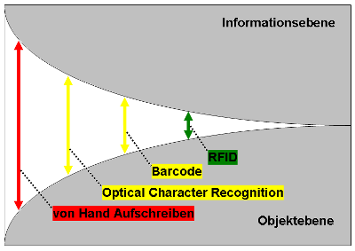
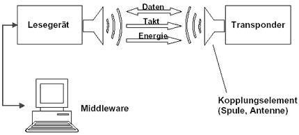

<link rel="stylesheet" type="text/css" href="../../styles.css">

# RFID

## Radio Frequency IDentification

### Funktion, Einsatz und Probleme

## Gliederung

- Einleitung
- Geschichte
- Auto-ID-Systeme
- Grundlagen d. RFID-Technologie
- Einsatzbereiche/-möglichkeiten
- Datenschutz
- Datensicherheit
- Wirtschaftliche Aspekte
- Ausblick

## Einleitung

- Methode, um Daten berührungslos und ohne Sichtkontakt lesen und speichern zu können
- RFID-Systeme eignen sich grundsätzlich überall dort, wo automatisch gekennzeichnet, erkannt, registriert, gelagert, überwacht oder transportiert werden soll
- Möglichkeiten und Chancen der RFID-Technologie zu mehr Akzeptanz zu schaffen
- Datenschützer und Bürgerrechtler arbeiten gegen Überwachung durch Sensibilisierung der Bürger
- wieviel Daten müssen wirklich erfasst werden
- welche Daten verletzen die Persönlichkeitsrechte der Bürger

## 3 Geschichte

- Transpondertechnik bei Flugzeugen, Freund-Feind-Kennung, auf Radartechnik basierend, Robert Alexander Watson-Watt,1935
  - Jedes Flugzeug britische Flugzeug sendete eine Signal aus, welches vom Bodenradar empfangen wurde

- Methode, RFID-Transponder mit Hilfe d. v. Radiosignal ausgestrahlten Energie zu betreiben und führt somit das Konzept der passiven RFID-Systeme ein, Stockman, 1948

- Ziel der Weiterentwicklung, Objekte schnell und fehlerfrei zu identifizieren

- 50er Jahre – militärische Nutzung

- 60er Jahre – Artikelsicherung, 1-Bit-Transponder

- aktive RFID-Technologie mit einem wiederbeschreibaren Chip, Mario Cardullo, 1973

- passive

- RFID-Technologie, um Türen ohne einen Schlüssel zu öffnen, Charles Walton, 1973

- "ultra-high frequency"-(UHF-)RFID-System, IBM 1990, Sendereichweite von bis zu 6,5 Metern, aus finanziellen
Gründen eingestellt

- preisgünstige RFID-Chips, um jedes Produkt damit auszustatten, David Brock und Sanjay Sarma, Chips als mobile Datenbanken, um alle Informationen über das Produkt und alle

- Produktbewegungen zu dokumentieren, Mmöglichkeit, Warenbewegungen nicht nur für den Lieferanten, sondern auch für den Kunden transparent zu gestalten, Überwachung des Status der Lieferung jederzeit

## 4 Auto-ID-Systeme

- automatische Identifikationssysteme (Auto-IDSysteme)
- Barcode
- Schrifterkennung (Optical Character Recognition OCR)
- Spracherkennung
- Biometrische Verfahren
- Warensicherungssysteme auf RF- oder EM-Grundlage
- Magnetstreifen
- Kontakt-Chipkarten
- reduziert den Aufwand bei der Datenerfassung,Verringerung von Ungenauigkeiten, weniger Prüfungsaufwand
- Zur besseren Abgrenzung der unterschiedlichen
- Einsatzgebiete (z.B. in Bezug auf genutzte Standards, Frequenzen etc.) wurde RFID Referenzmodell entwickelt ("RFIDReferencemodell").

## 5 Grundlagen d. RFID-Technologie

- Systembestandteile
  - RFID-Datenträger
  - RFID-Lesegerät
- Ausführungen und Bauformen von RFID-Systemen
- Funktionsweise
- Unterscheidungsmerkmale von RFID-Systemen
  - Frequenzbereiche
  - Reichweite
  - Speichertechnologie
  - Energieversorgung der Transponder
- Übertragungsverfahren der Transponder

## 6 Systembestandteile

- Zwei Hauptkomponenten
  - RFID-Lesegerät
  - RFID-Datenträger (RFIDTransponder)
- kontakt- oder berührungsloses System Auslesen in Sekundenbruchteilen Unabhängig von den Umgebungsbedingungen (Licht, Temperatur, Luftfeuchte)

## 7 RFID-Lesegerät

- Lese- bzw. einer Schreib-/ Leseeinheit
- kontrolliert das Lesegerät die Qualität der Datenübermittlung
- mit einer zusätzlichen Schnittstelle ausgestattet
- RFID-Lesegerät, welches die RFID-Transponder in seiner Reichweite erkennt startet die Kommunikation die einem bestimmten Protokoll unterliegt
- Informationen werden auf Energiewellen ausgetauscht
- das zu übertragende Nutzsignal in ein so genanntes Trägersignal umgewandelt
- Kommunikation erzeugte Feld wird auch als RF-Feld (Radio-Frequenz-Feld)
- hierarchischen Master-Slave-Prinzip
- Applikationssoftware, von der alle Operationen ausgehen
- Erfassungsgerät wirkt dabei als Interface
- Erfassungsgerätes, bestehend aus Hochfrequenzinterface, Controller und Antenne, lesen/schreiben
- HF-Interface Erzeugung der hochfrequenten Sendeleistung, Modulation des Sendesignals und zum Empfang
und Demodulation von HF-Signalen eingesetzt.
  - Steuerung (control unit) hat folgende Aufgaben:
  - Kommunikation mit der Applikationssoftware
  - Ausführung von Kommandos der Applikationssoftware
  - Steuerung der Kommunikation mit dem Transponder (Master-Slave)
  - Signalcodierung und -decodierung
  - ggf. Ausführung des Antikollisionsverfahrens
  - ggf. Chiffrierung und Dechiffrierung des Datenstroms zw. Transponder und Erfassungsgerät
  - ggf. Abwicklung der Authentifizierung zw. Transponder und Erfassungsgerät

## 8 RFID-Datenträger
 
- Transponder
- Mikrochip, Antenne (Spule oder Dipol), Austausch d. Daten per Modulation, Energieversorgung der Transponderchips
- RFID-Chips, -tags, -labeln oder –etiketten
- **1-Bit-Transponder**, EAS-Systeme (elektronische Artikelsicherung) dienen nur zum Erkennen, ob sich ein Transponder im Empfangsbereich d. Erfassungsgerätes befindet, Diebstahlsicherung von Waren
- **Read-only-Transponder**, mit Mikrochip ausgestattet, eindeutige Seriennummer gespeichert, bei der Produktion des Transponders generiert. Sobald sich ein solcher Transponder im Empfangsbereich eines Erfassungsgerätes befindet, beginnt dieser ständig seine Seriennummer zu senden (unidirektionaler Datenfluss). Diese Verfahrensweise ist überall dort gut geeignet, wo es auf die eindeutige Identifizierung von Objekten ankommt (z. B. Tieridentifikation, Sendungsverfolgung)
- **Transponder mit beschreibbarem Speicher**, EEPROM (passive Transponder) bzw. ein SRAM (aktive, also batteriegestützte Transponder) genutzt. In einer fest codierten State-Machine können diese Transponder einfache Kommandos des Erfassungsgerätes ausführen. Dadurch wird ein selektives Lesen bzw. Beschreiben des Speichers ermöglicht.
- **Kontaktlose Chipkarten mit Betriebssystem**, Aufgrund des Einsatzes eines eigenen Betriebssystems (Smart-Card-OS) und eines Mikroprozessors sind komplexe Algorithmen zu Chiffrierung und Authentifizierung möglich.

## 9 Ausführungen und Bauformen von RFID-Systemen - Eigenschaften

- Elektronische Identifikation: Das System ermöglicht eine eindeutige Kennzeichnung von Objekten durch elektronisch gespeicherte Daten
- Kontaktlose Datenübertragung: Die Daten können zur Identifikation des Objekts drahtlos über einen Funkfrequenzkanal ausgelesen werden
- Senden auf Abruf (on call): Ein gekennzeichnetes Objekt sendet seine Daten nur dann, wenn ein dafür vorgesehenes Lesegerät diesen Vorgang abruft
- RFID-Systeme zählen zu den Funkanlagen. Durch die elektronische Identifikation sowie die Eigenschaft, dass Transponder nur auf Abruf Daten übermitteln, grenzen sich RFID-Systeme von anderen digitalen Funktechnologien wie Mobilfunk, W-LAN oder Bluetooth ab

## 10 Ausführungen und Bauformen von RFID-Systemen - Leistungen

- Identifizierung des Transponders innerhalb einer jeweils spezifizierten Reichweite
- Das Auslesen der Daten des Transponders
- Die Selektion der für das jeweilige System relevanten Transponder
- Die Gewährleistung, dass mehrere Transponder innerhalb der Reichweite des Lesegeräts gleichzeitig verwaltet werden
- Das Durchführen der Fehlererkennung zur Gewährleistung der Betriebssicherheit

## 11 Ausführungen und Bauformen von RFID-Systemen - Formen

- Disks und Münzen
- Glasgehäuse
- Plastikgehäuse
- Werkzeug- und Gasflaschenidentifikation
- Schlüssel und Schlüsselanhänger
- Uhren
- Kontaktlose Chipkarten
- Smart Label
- Coil-on-Chip

## 12 Bestandteile eines RFID-Systems

## 13 Funktionsweise

## 14 Unterscheidungsmerkmale von RFID Systemen

- Frequenzbereiche
- Reichweite
- Speichertechnologie
- Energieversorgung der Transponder

## 15 Übertragungsverfahren der Transponder

## 16 Einsatzbereiche/-möglichkeiten

- Personenidentifikation (Personenbezug)
- Tieridentifikation
- Objektidentifikation (Produktionsgüter, Waren,
Gegenstände, ...)

## 17 Datenschutz

- Grundlagen
- RFID als Datenschutzrisiko

## 18 Datensicherheit

- Problemaufriss
- Grundlegende Angriffsarten
  - Angriffe auf den Transponder
  - Angriffe auf die mechanische Verbindung
  - Angriffe auf die Luftschnittstelle
- Motive von Angriffsarten
- Bedrohungslage der beteiligten Parteien
  - Bedrohungslage für die aktive Partei
  - Bedrohungslage für die passive Partei
- Sicherheitsmaßnahmen

## 19 Wirtschaftliche Aspekte

- Der Kostenfaktor
- Nutzen von RFID
- Einsatzbeispiele und Nutzenpotentiale

## 20 Ausblick

## 21 Lernerfolgskontrolle

## 22 Quellen

- [youtube.com/watch?v=YYHwITj7nWw](https://www.youtube.com/watch?v=YYHwITj7nWw)
- [youtube.com/watch?v=_XTC00203xM](https://www.youtube.com/watch?v=_XTC00203xM)
- [youtube.com/watch?v=06nal8BuB2w](https://www.youtube.com/watch?v=06nal8BuB2w)

- [computerwoche.de/a/wie-rfid-funktioniert-und-wie-nicht,558373](https://www.computerwoche.de/a/wie-rfid-funktioniert-und-wie-nicht,558373)

- [rfid-grundlagen.de/transponder.html](https://www.rfid-grundlagen.de/transponder.html)

- [netzmafia.de/skripten/hardware/RFID/rfid-grundlagen.html](http://www.netzmafia.de/skripten/hardware/RFID/rfid-grundlagen.html)

- [http://erfideo.com/rfid.html](http://erfideo.com/rfid.htm)

- [rfid-loesungen.com/RFID_Uebersicht.htm](http://www.rfid-loesungen.com/RFID_Uebersicht.htm)

- [elektronik-kompendium.de/sites/kom/0902021.htm](https://www.elektronik-kompendium.de/sites/kom/0902021.htm)

- [enzyklopaedie-der-wirtschaftsinformatik.de/lexikon/daten-wissen/Datenmanagement/lexikon/technologien-methoden/Informatik-Grundlagen/automatische-identifikation/rfid/](http://www.enzyklopaedie-der-wirtschaftsinformatik.de/lexikon/daten-wissen/Datenmanagement/lexikon/technologien-methoden/Informatik-Grundlagen/automatische-identifikation/rfid/)

- [bodymod.biz/Andreas_index-Site/rfid.htm](http://www.bodymod.biz/Andreas_index-Site/rfid.htm)

- [rfid-finder.com/rfid-auto-id-technologie/rfid-transponder/](https://rfid-finder.com/rfid-auto-id-technologie/rfid-transponder/)

- [siemens.com/press/de/pressemitteilungen/?press=/de/pressemitteilungen/2015/processindustries-drives/pr2015030125pdde.htm](https://www.siemens.com/press/de/pressemitteilungen/?press=/de/pressemitteilungen/2015/processindustries-drives/pr2015030125pdde.htm)

- [rfid-basis.de/funktionsweise.html](https://www.rfid-basis.de/funktionsweise.html)

- [de.wikibooks.org/wiki/RFID-Technologie#Speichertechnologie](https://de.wikibooks.org/wiki/RFID-Technologie#Speichertechnologie)

- [blog.pepperl-fuchs.de/_blog/2016/02/29/haeufig-gestellte-fragen-faq-zum-thema-rfid-teil-4-rfid-transponder/](http://blog.pepperl-fuchs.de/_blog/2016/02/29/haeufig-gestellte-fragen-faq-zum-thema-rfid-teil-4-rfid-transponder/)

- [euroid.com/rfid-transponder/868mhz-uhf-passiv/868mhz-passiv-uhf-transponder/uhf-transponder-4kbyte-fram/](https://www.euroid.com/rfid-transponder/868mhz-uhf-passiv/868mhz-passiv-uhf-transponder/uhf-transponder-4kbyte-fram/)

- [de.wikibooks.org/w/index.php?title=RFID-Technologie&oldid=847847](https://de.wikibooks.org/w/index.php?title=RFID-Technologie&oldid=847847)

-  [de.wikipedia.org/wiki/RFID](https://de.wikipedia.org/wiki/RFID)
