

 <!--  -->

# Scanner - oder wie kommen Bilder in den Computer

## 1 Grundlagen – Scannerarten und ihr Einsatz

## 2 Scannereinteilung

### Scanner

#### universell

- Flachbettscanner

- Trommelscanner

#### speziell

- Barcodescanner
- 3D-Scanner
- Dokumentenscanner
- Foto-, Film- und Diascanner
- Hand- und Visitenkartenscanner

## 3 Bildaufnahme Basistechnologien

### Opto-elektronische Wandler (Sensoren)

- CCD[^1] - Charged Coupled Device

- CIS[^2] - Contact Image System

- PMT[^3] - Photomultiplier

[^1]: CCD Charged Coupled Device the other kind of sensor often used in scanners, use mirrors to bounce light to a stationary sensor.
[^2]: CIS Contact Image System are image sensors used in flatbed scanners almost in direct contact with the object to be scanned.
[^3]: PMT Photomultiplier are extremely sensitive detectors of light in the ultraviolet, visible, and near-infrared ranges of the electromagnetic spectrum. They are members of the class of vacuum tubes, more specifically vacuum phototubes.

## 4 Photomultiplier

Photomultiplier are extremely sensitive detectors of light in the ultraviolet, visible, and near-infrared ranges of the electromagnetic spectrum. They are members of the class of vacuum tubes, more specifically vacuum phototubes.

Photomultiplier

## 5 Scannpraxis

| Sichtbares Licht                                   | Lichtempfänger                                     |
| -------------------------------------------------- | -------------------------------------------------- |
|  | 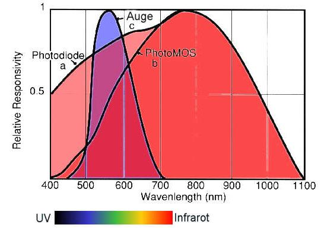 |

## 6 CCD[^1] vs. CIS[^2]

**CIS** Contact Image System are image sensors used in flatbed scanners almost in direct contact with the object to be scanned.

**CCD** Charged Coupled Device the other kind of sensor often used in scanners, use mirrors to bounce light to a stationary sensor.

## 7 2-D-Scanner

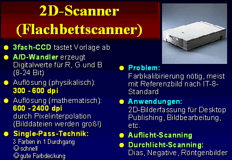

## 8 Beispiel

|   | &nbsp;                                              |
| --------------------------------------------------- | --------------------------------------------------- |
|  | 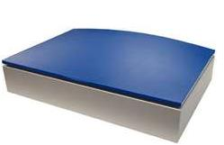  |
| 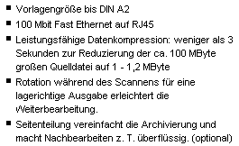  |  |

## 9 Beispiel

### KartoScan FB IV Flachbettscanner

| &nbsp;                                              | &nbsp;                                                                                                                                                                                                                                             |
| --------------------------------------------------- | -------------------------------------------------------------------------------------------------------------------------------------------------------------------------------------------------------------------------------------------------- |
| <td width=50%>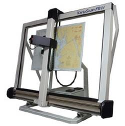 | Der KartoScan FB IV hat eine optische Auflösung von 500 - 1200 dpi, und eine maximale Scannfläche von 1050 mm x 1600 mm. Außerdem können Vorlagen bis zu maximal 20 mm Dicke bei einer geometrischen Genauigkeit von +/0,005 mm eingescannt werden |

## 10 Beispiel

Großformatscanner bis 62 Zoll

## 11 Trommelscanner

Durchlicht

## 12 13 Trommelscanner Arbeitsplatz

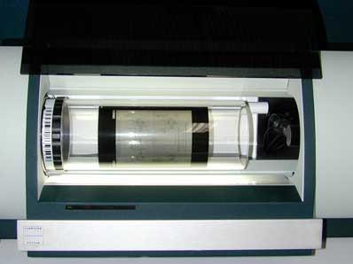

Die Trommel rotiert mit hoher Geschwindigkeit (300 bis 1.350U/min.)

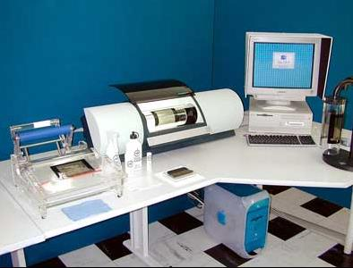
Bis A0 und 11.000 dpi

## 13 Trommelscanner Arbeitsplatz

Trommelscanner Arbeitsplatz
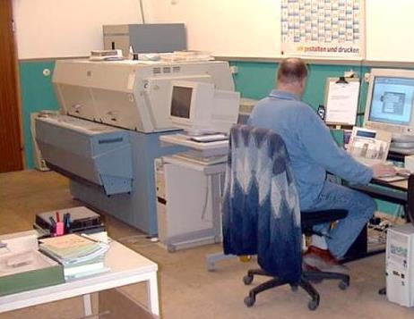

## 14 Arten - Trommelscanner

| horizontal                                                              | vertikal                                                                |
| ----------------------------------------------------------------------- | ----------------------------------------------------------------------- |
| 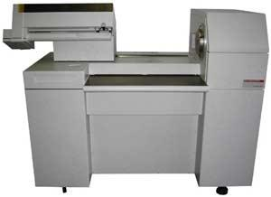 | 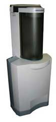 |

## 15 Handscanner

DocuPen R-700 von Planon Ganzseitenscanner im Taschenformat  

|&nbsp;|&nbsp;
|------|------
|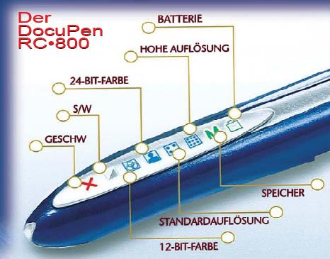| 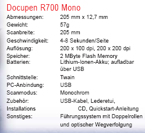

## 16 Beispiele

| Visitenkarten-Scanner                                                   | Dokumentenscanner                                                       |
| ----------------------------------------------------------------------- | ----------------------------------------------------------------------- |
|  | 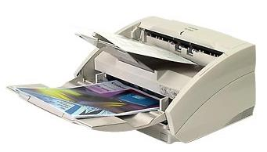 |

20 Blatt pro Minute bei
200 dpi Auflösung
optisch: 600 x 1200 dpi

## 17 Beispiele

| &nbsp;                                                                  | &nbsp;                                                                  |
| ----------------------------------------------------------------------- | ----------------------------------------------------------------------- |
| 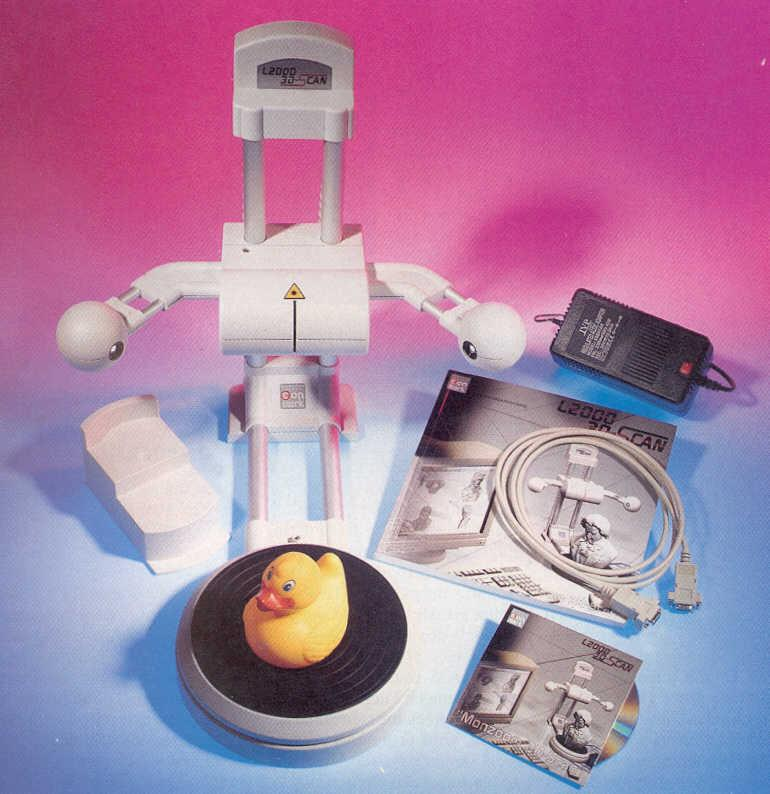 | 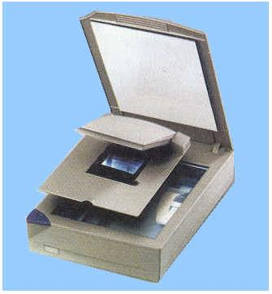 |
| 3D-Scanner                                                              | Dia-Scannvorsatz                                                        |
| 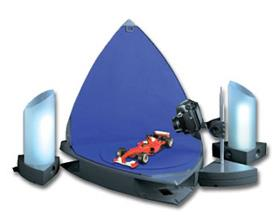 | 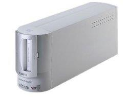 |
| Dia-Scanner                                                             | 4000 dpi/ 48 bit                                                        |

## 18 Filmscanner

4000 ppi opt. Auflösung,
14-Bit A/D-Wandler, neues
Nikkor ED Scannerobjektiv,
Scanzeit von nur 38 s,
hochwertiger CCD[^1]-Sensor,
direkter Filmeinzug,

## 19 Barcodescanner

### Mobil

| &nbsp;                                                                  | &nbsp;                                                                  |
| ----------------------------------------------------------------------- | ----------------------------------------------------------------------- |
| 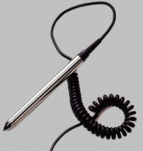 | 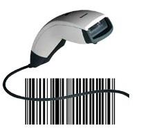 |
| Stift                                                                   | Handgerät                                                               |

### fest installiert

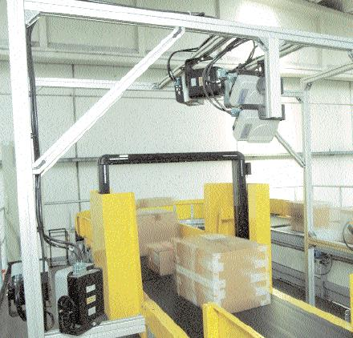

## 20 Barcodesensoren

### CCD[^1]-Technik

### Laser-Technik

### Lesetechnik

#### Statisch

#### dynamisch

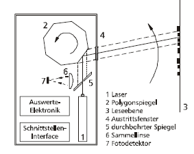
Eingabegeräte

## 21 Leseprinzip

Einstrahl  
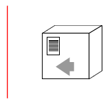

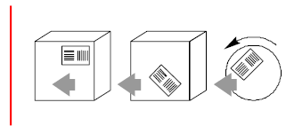

Zweistrahl  

Mehrstrahl Raster  
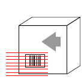

## 22 Einsatzgebiete

| <td width=50%>&nbsp;                                                    | &nbsp;                                                                  |
| ----------------------------------------------------------------------- | ----------------------------------------------------------------------- |
| 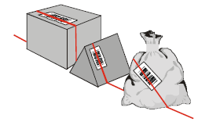 | 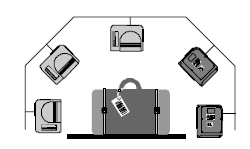 |
|  |  |

## 23 Barcode-Labeldruck

|<td width=50%>&nbsp;|&nbsp;
|------|------
|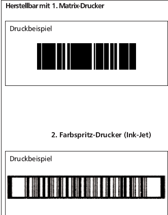| 

## 24 Berechnung des Speicherbedarfs

### Digitalkamera - die Datengröße eines Bildes berechnen.

Datenmenge (in MiB) = b x h x d bits  
8(bits / Byte) x1024(Bytes / KiB) x1024(KiB /MiB)

b = Breite des Bildes (pixel)
h = Höhe des Bildes (pixel)
d = Datentiefe (Bit)

#### 1 Mi Byte (MiB) = 1024 ki Byte = 1024² Byte = 8 x 1024² Bit

#### 1 inch = 2,54 cm

## 25 Lernzielkontrolle - Aufgabe

Berechnen Sie den Speicherbedarf
folgender Bilder

1. Größe: 8 cm x 12 cm  Auflösung: 300ppi Farbmodus: CMYK 8 Bit Farbtiefe/Kanal

2. Größe 14 inch x 12 inch Auflösung:
   72 ppi Farbmodus: RGB 
   8 Bit Farbtiefe/Kanal

## 26 Lösung 1

### cm zu inch:

- 8 cm = 3,15 inch
- 12 cm = 4,72 inch

### bei 300 Pixel pro Inch, lautet die Rechnung wie folgt:

(3,15 inch x 300 Pixel) x (4,72 inch x 300 Pixel)

### Das ergibt 1.338.120 Pixel auf der gesamten Fläche.

### Bittiefe mit 8 Bit pro Kanal (in CYMK sind es 4)

also 1.338.120 x (4 x 8 bit)= 42.819.840 bit

### bit to MiB

42.819.840 bit / 8 / 1024 / 1024 = 5,104 MiB

## 27 Lösung 2

• 14 inch
• 12 inch

### bei 72 Pixel pro Inch, lautet die Rechnung wie folgt:

(14 inch x 72 Pixel) x (12 inch x 72 Pixel)

### Das ergibt 870.912 Pixel auf der gesamten Fläche.

### Bittiefe mit 8 Bit pro Kanal (in rgb sind es 3)

(14 x 72) x (12 x 72) x (3 x 8 bit) = 20.901.888 bit

### bit to MiB

= 20.901.888 bit / 8 / 1024 / 1024 = 2,49 MiB
