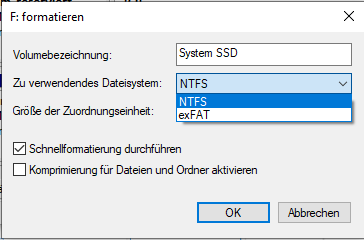

# Dateisystem - Dateiverwaltung

## 1 Intro

- Dateisysteme: Übersicht
- Grundlagen: Partitionen, Partitionstabelle
- File Allocation Table – Master File Table
- NTFS
- Attribute
- Hardlinks, Symlinks
- Alternative Datenströme
- Berechtigungen

## 2 Dateisysteme

- Grundlagen: Partitionen, Partitionstabelle
  - Benötigt für die meisten Betriebssysteme
  - Physische / Virtuelle Datenträger in separate
    Bereiche aufgeteilt:
    - A : Spur,
    - B: Sektor,
    - C: Block,
    - D: Cluster,

## 3 Dateisysteme

### Partitions-Schemata

#### MBR = Master Boot Record

- Ältere Variante
- Max. 4 primäre Partitionen
- Erweiterte Partition kann zusätzliche logische Partitionen aufnehmen

#### GPT = GUID Partition Table (globally unique identifier)

- Neuere Variante (ab ca. 2000)
- Keine Beschränkung der Partitionen-Anzahl
- größere Ausfallsicherheit durch sekundäre
  Partitionstabelle
- muss bei UEFI-Firmware eingesetzt werden

## 4 Dateisysteme

## 5 Dateisysteme

## 6 Dateisysteme - Übersicht

- Je primäre/logische Partition:
  - ein Dateisystem möglich
- Vorgang: Formatieren

  - Dateisystem festlegen
  - Clustergröße einstellen

- Wichtige Abkürzungen
  - FAT = File Allocation Table
  - NTFS = New Technology File System
  - MFT = Master File Table (NTFS)

## 7 Dateisysteme – FAT 12

|                      | Fat 12                         |
| -------------------- | ------------------------------ |
| Entwicklungsjahr     | 1977 – 1980                    |
| Verwendung           | Disketten                      |
| Clustergröße (Byte)  | 512-4096\*                     |
| Dateinamen8.3        |
| Attribute            | Schreibgeschützt , Versteckt , |
| System , Archiv      |
| Berechtigungen (ACL) | NEIN                           |
| Clusteranzahl        | 212 = 4094\*        |
| Dateigröße           | Max. 32 MiB\*\*                |

\* https://de.wikipedia.org/wiki/File_Allocation_Table#FAT32  
\*\* https://www.com-magazin.de/img/1/9/6/2/2/dateisysteme_w711_h550.jpg

## 8 Dateisysteme – FAT 16

|                      | Fat 16                                                  |
| -------------------- | ------------------------------------------------------- |
| Entwicklungsjahr     | 1983                                                    |
| Verwendung           | Festplatten (je nach Clustergröße max 32 - 512 MiB)     |
| Clustergröße (Byte)  | 512 Byte – 64 KiB\*                                     |
| Dateinamen           | 8.3                                                     |
| Attribute            | Schreibgeschützt , Versteckt ,System , Archiv           |
| Berechtigungen (ACL) | NEIN                                                    |
| Clusteranzahl        | 216 − 12 = 65.524 \* (12 Cluster reserviert) |
| Dateigröße           | Max 2 GiB (NT: 4 GiB)                                   |

 \* - https://de.wikipedia.org/wiki/File_Allocation_Table#FAT16

## 9 Dateisysteme – FAT 32

|                      | Fat32                                                             |
| -------------------- | ----------------------------------------------------------------- |
| Entwicklungsjahr     | 1996, Windows 95B                                                 |
| Verwendung           | Festplatten (je nach Clustergröße max 2 TiB – 16 TiB), USB-Sticks |
| Clustergröße         | 512 Byte – 32 KiB\*                                               |
| Dateinamen           | Long File Names (LFN) durch Virtual File Allocation Table (VFAT)  |
| Attribute            | Schreibgeschützt , Versteckt, System , Archiv                     |
| Berechtigungen (ACL) | NEIN                                                              |
| Clusteranzahl        | 228 =268.435.456\* (4 Bits reserviert)                 |
| Dateigröße           | 4 GiB (- 1 Byte)\*(Nur 4 Byte für die Dateigröße)                 |

https://de.wikipedia.org/wiki/File_Allocation_Table#FAT32

## 10 Dateisysteme – exFAT

|                      | exFAT                                        |
| -------------------- | -------------------------------------------- |
| Entwicklungsjahr     | 2006                                         |
| Verwendung           | Flash-Speicher,Austauschmedien               |
| Clustergröße         | 512 Byte bis 32 MiB\*                        |
| Dateinamen           | Long File Names (LFN)                        |
| Attribute            | Schreibgeschützt , Versteckt,System , Archiv |
| Berechtigungen (ACL) | Ja                                           |
| Clusteranzahl        | 232 = 4.294.967.296\*\*           |
| Dateigröße           | 16 EiB (264 Bytes) - 1 Byte\*\*              |

\* https://learn.microsoft.com/de-de/windows/win32/fileio/exfat-specification#3115-sectorsperclustershift-field  
 \*\* https://de.wikipedia.org/wiki/File_Allocation_Table#exFAT

## 11 Dateisysteme – Fat Übersicht

| -                    | Fat12                                                          | Fat16                                                | Fat32                                                | exFAT                             |
| -------------------- | -------------------------------------------------------------- | ---------------------------------------------------- | ---------------------------------------------------- | --------------------------------- |
| Entwicklungsjahr     | 1977 – 1980                                                    | 1983                                                 | 1996                                                 | 2006                              |
| Verwendung           | Disketten                                                      | Festplatten (je nach Clustergröße max 32 512 MiB)    | Festplatten (je nach Clustergröße max 2 TiB– 16 TiB) | Flash-Speicher                    |
| Clustergröße         | 512 – 4096 Byte                                                | 512 Byte – 64 KiB                                    | 512 – 32 KiB                                         | 512 - 32 MiB                      |
| Dateinamen           | 8.3                                                            | 8.3                                                  | Long File Names (LFN)                                | Long File Names (LFN)             |
| Attribute            | <td colspan =3 >Schreibgeschützt , Versteckt , System , Archiv |                                                      |                                                      |
| Berechtigungen (ACL) | NEIN                                                           | NEIN                                                 | NEIN                                                 | Ja                                |
| Clusteranzahl        | 212 = 4094                                          | 216 − 12 = 65.524 (12 Cluster reserviert) | 228 =268.435.456 (4 Bits reserviert)      | 232 = 4.294.967.296    |
| max. Dateigröße      | 32 MB                                                          | 2 GiB (NT: 4 GiB)                                    | 4 GiB - 1 Byte                                       | 16 EiB (264 Bytes)-1 B |

## 12 Dateisysteme – NTFS

| -                    | NTFS                                   |
| -------------------- | -------------------------------------- | --- | ---------- | ----------- |
| Entwicklungsjahr     | 1993, Windows NT                       |
| Verwendung           | Festplatten, SSD, USB-Sticks, …        |
| Clustergröße         | 512 Byte\* - 2048 KiB\*\*              |
| Dateinamen           | Long File Names (LFN)                  |
| Attribute            | Wie FAT + Erweiterungen                |
| Berechtigungen (ACL) | Ja                                     |
| Clusteranzahl        | 232 -1 = 4.294.967.295 \*\* |     | Dateigröße | Max. 16 TiB |

\* https://support.microsoft.com/de-de/topic/standard-clustergr%C3%B6%C3%9Fe-f%C3%BCr-nfts-fat-und-exfat-9772e6f1-e31a-00d7-e18f-73169155af95  
\*\* https://learn.microsoft.com/de-de/windows-server/storage/file-server/ntfs-overview

## 13 Dateisysteme – NTFS-Merkmale 1

- Journaling: sichert konsistenten Zustand
- lange Dateinamen: max. 255 Zeichen
- (lange Pfadnamen: max. 32.767 Zeichen)
  Windows: Standard 260 Zeichen
- Rechteverwaltung: Access Control Lists
- maximale Dateigröße: 16 Tebibyte (TiB)
- kleine Dateien: direkt in der Master File
  Table (MFT) gespeichert

## 14 Dateisysteme – NTFS-Merkmale 2

- Speicherung von Metadaten: alternative
  Datenströme
- transparente Komprimierung möglich
- Transparente Dateiverschlüsselung:
  Encrypting File System (EFS[^1])
- Kontingente: Beschränkungen für
  einzelne Nutzer
  [^1]: EFS Encrypting File System

## 15 Dateisysteme – NTFS-Merkmale 2

- Analysepunkte (Reparse Point):
  - Abzweigpunkte (Verknüpfungen zu
    Verzeichnissen)
  - Bereitstellungspunkte (Einbindung von
    Datenträgern ins Dateisystem)
- Symbolische Verknüpfungen zu externen
  Ressourcen
- Harte Links: pro Datei bis zu 1023 Namen

## 16 Dateisysteme – Aufbau MFT

- Alle Informationen zu Dateien finden sich
  in der MFT
- Verweis auf Speicherbereiche
- Wächst mit Zunahme der Dateien
- Gelöschte Dateien: als frei markiert
  Speicherplatz erst bei Bedarf
  überschrieben

## 17 Dateisysteme – Aufbau MFT

große Tabelle mit gleich langen
Elementen (1KB, 2KB oder 4KB groß, je
nach Clustergröße)

| 
 Index | 
Dateiinformationen |
| ------------------------------------------ | ------------------------------------------------------ |
| 
0 | 
\_               |
| 
1 | 
\_               |
| 
2 | 
\_               |
| 
3 | 
\_               |
| 
4 | 
\_               |
| 
5 | 
\_               |
| …                                          |                                                        |

## 18 Dateisysteme – Aufbau MFT

Eintrag für eine kurze Datei

**STREAMS**:
Standardinfo | Dateiname | Zugriffsrechte| Daten | Leer

## 19 Dateisysteme – Aufbau MFT

Eintrag für eine kurze Datei

**STREAMS**:
Standardinfo | Dateiname | Zugriffsrechte| Daten | Leer

<f>Standardinfo</f>: Enthält u.a. Länge, Standard-Attribute, Zeitstempel, Anzahl
der Hard links

## 20 Dateisysteme – Aufbau MFT

Eintrag für eine kurze Datei

**STREAMS**:
Standardinfo | Dateiname | Zugriffsrechte| Daten | Leer

<f>Dateiname</f>: kann mehrfach vorkommen (Hard links)

## 21 Dateisysteme – Aufbau MFT

Eintrag für eine längere Datei

VCN[^2] Virtual Cluster Number  
LCN[^3] Logical Cluster Number

[^2]: VCN Virtual Cluster Number
[^3]: LCN Logical Cluster Number

## 22 Weitere Dateisysteme

- CDRFS[^4] (CD-ROM File System) = read-only
- UDF-Dateisystem[^5] (Universal Disk Format) = beschreibbar
- ReFS [^6](Resilient FileSystem) = für Fileserver, Datenintegritä verbessert durch Checksummen

[^4]: **CDRFS** CD-ROM File System
[^6]: ReFS Resilient FileSystem
[^5]: **UDF-Dateisystem** Universal Disk Format

## 23 Dateisysteme – NTFS: Attribute

R = ReadOnly - Schreibgeschützt  
H = Hidden - Versteckt  
S = System - System  
D = Directory - Verzeichnis  
A = Archive – zu Archivieren Device – reserviert / unbenutzt  
N = Normal – keine zusätzlichen Attribute  
T = Temporary - temporäre Datei  
P = SparseFile – unbelegte Dateibereiche komprimiert  
L = ReparsePoint - Verknüpfungen  
C = Compressed - komprimiert  
O = Offline - Offlinedatei  
I = NotContentIndexed – kein Inhaltsindex  
E = Encrypted - Verschlüsselt  
V = IntegrityStream – alle Streams der Datei geprüft  
X = NoScrubData - keine Datenintegritätsüberprüfung

## 24 Dateisysteme – NTFS: Attribute Archive

A = Archive: wird bei jedem
Bearbeiten einer Datei gesetzt,
von Backup-Programmen
genutzt und zurückgesetzt

## 25 Dateisysteme – NTFS: Attribute Compressed

C = Compressed: Komprimiert,
spart Speicherplatz

## 26 Dateisysteme – NTFS: Attribute Directory

D = Directory: kennzeichnet ein
Verzeichnis, manuelle Änderung
möglich aber praktisch nicht
nutzbar

## 27 Dateisysteme – NTFS: Attribute Encrypted

E = Encrypted: verschlüsselt,
erfordert Zertifikat, nicht
kombinierbar mit
Komprimierung

## 28 Dateisysteme – NTFS: Attribute Hidden

H = Hidden: Versteckt, bei
Standardeinstellungen nicht
sichtbar

## 29 Dateisysteme – NTFS: Attribute Not content indexed

I = Not content indexed: Inhalt
der Datei wird nicht für die
Windows Suche indexiert.

## 30 Dateisysteme – NTFS: Attribute Offline

O = Offline: Die Datei ist nicht
local gespeichert. z.B. Azure /
One-Drive -Dateien

## 31 Dateisysteme – NTFS: Attribute Attribute Sparse File

P = Sparse File: Spar-Datei.
Effektivere Speichernutzung bei
größeren Bereichen mit NullWerten

## 32 Dateisysteme – NTFS: Attribute Normal

N = Normal: Die Datei hat keine
anderen Attribute

## 33 Dateisysteme – NTFS: Attribute Read-Only

R = Read-Only:
Schreibgeschützt, Datei darf
nicht geändert oder gelöscht
werden

## 34 Dateisysteme – NTFS: Attribute System

S = System: Systemdateien,
Kombination aus versteckt und
schreibgeschützt, AnzeigeOptionen müssen zum
Sichtbarmachen geändert
werden.

## 35 Dateisysteme – NTFS: Attribute Temporary

T = Temporary: temporäre
Dateien, werden von BackupProgrammen ignoriert

## 36 Dateisysteme – NTFS: Attribute

## 37 Dateisysteme – NTFS: Schattenkopien 1

- Form der lokalen Datensicherung
  - Gleiches oder separates Volume
- inkrementell (nur Änderungen) oder vollständig
- Verwendung
  - Snapshots erstellen
  - Datei- Wiederherstellung
- Ersetzt kein Backup!

## 38 Dateisysteme – NTFS: Schattenkopien 2

## 39 Dateisysteme – NTFS: Schattenkopien 3

- Methoden
  - **Vollständige Kopie** schreibgeschützter Klon
    des Laufwerks
  - **Copy-on-write** differenzielle Kopie der Daten
    bevor Änderungen vorgenommen werden
  - **Redirect-on-write** differenzielle Kopie aller
    Änderungen auf einen separaten
    Datenspeicher

## 40 Dateisysteme – NTFS: Schattenkopien 4

## 41 Dateisysteme – NTFS: Streams

- Alternative Datenströme
  - Standardmäßig nicht sichtbare ZusatzInformationen zu Dateien
  - Anzeige (cmd): <f>dir /R</f>
  - Hilfs-Tool: „Sysinternals Streams“
  - Stream erzeugen (cmd):
    echo hello > test:stream
  - Stream lesen(cmd):
    more < test:stream

## 42 Dateisysteme – NTFS: Links

### Alternative zu Verknüpfungen

- Dateien mit Endung \*.lnk
- Nur nutzbar wenn Logik im Programm
  implementiert

### NTFS-Links: Eigenschaft des Dateisystems

- transparent für alle Programme

## 43 Dateisysteme – NTFS: Hardlinks

### alternative Dateinamen

- zeigen auf gleichen Speicherbereich
- Nur auf der gleichen Partition
- Datei wird gelöscht, wenn letzter
  Eintrag gelöscht wird
- Syntax (cmd):  
  mklink /H &lt;name&gt; &lt;ziel&gt;

## 44 Dateisysteme – NTFS: Symlinks

### Symbolische Links zeigen auf Original von Datei/Ordner

- Über Grenzen des lokalen Volumes
- Nur mit administrativen Rechten möglich
- Syntax (cmd):  
  Datei: mklink &lt;name&gt; &lt;ziel&gt;  
  Ordner: mklink /D &lt;name&gt; &lt;ziel&gt;

## 45 Dateisysteme – NTFS: Junctions

### Alias: Soft Links binden entfernte Ordner ein

- Auch auf anderen Partitionen des gleichen
  Rechners
- Syntax (cmd):
  mklink /J &lt;name&gt; &lt;ziel&gt;

## 46 Dateisysteme – NTFS: Kontingente 1

### Alias: Quotas Beschränkung des Speicherplatzes pro Benutzer

1. Warnstufe
2. Hartes Limit

   Aufgaben:

- Überwachung der Speichplatznutzung
- Warnung des Admins
- Verhinderung von Speicher-Knappheit

## 47 Dateisysteme – NTFS: Kontingente 2

Achtung:

unwirksam für Benutzer, die schon Daten im
Laufwerk gespeichert haben!
Administratoren sind ausgenommen!

Keine Gruppen-Kontingente!

## 48 Dateisysteme – NTFS: Kontingente 3

## 49 Dateisysteme – NTFS: Berechtigungen

### Access Control Lists (ACL[^7])

Zugriffsrechte für Benutzer und Gruppen auf
Ordner und Dateien

### vom übergeordneten Verzeichnis vererbt

### Bearbeiten

- Datei-Eigenschaften: Reiter Sicherheit
- cmd: icacls
- Powershell: get-acl

[^7]: ACL access control list

## 50 Dateisysteme – NTFS: Berechtigungen

### Vollzugriff

schreiben, löschen, lesen,
Eigenschaften ändern (auch untergeordneter
Elemente)

### Ändern

schreiben, löschen, lesen,
Dateieigenschaften ändern

### Lesen, Ausführen

Dateien ausführen, lesen

### Lesen

### Schreiben

Dateien ändern und hinzufügen

## 51 Dateisysteme – NTFS: Berechtigungen

## 52 table

| Grundlegende Berechtigungen          | Vollzugriff | Ändern | Lesen,Ausführen | Lesen | Schreiben |
| ------------------------------------ | ----------- | ------ | --------------- | ----- | --------- |
|  **Erweiterte Berechtigungen**          |   |   |   |  |   |
| Vollzugriff                          | <f>x        | -      | -               | -     | -         |
| Ordner durchsuchen / Datei ausführen | <f>x        | <f>x   | <f>x            | -     | -         |
| Ordner auflisten / Daten lesen       | <f>x        | <f>x   | <f>x            | <f>x  | -         |
| Attribute lesen                      | <f>x        | <f>x   | <f>x            | <f>x  | -         |
| Erweiterte Attribute lesen           | <f>x        | <f>x   | <f>x            | <f>x  | -         |
| Dateien erstellen / Daten schreiben  | <f>x        | <f>x   | -               | -     | <f>x      |
| Ordner erstellen / Daten anhangen    | <f>x        | <f>x   | -               | -     | <f>x      |
| Attribute schreiben                  | <f>x        | <f>x   | -               | -     | <f>x      |
| Erweiterte Attribute schreiben       | <f>x        | <f>x   | -               | -     | <f>x      |
| Unterordner und Dateien löschen      | <f>x        | -      | -               | -     | -         |
| löschen                              | <f>x        | <f>x   | -               | -     | -         |
| Berechtigungen lesen                 | <f>x        | <f>x   | <f>x            | <f>x  | -         |
| Berechtigungen ändern                | <f>x        | -      | -               | -     | -         |
| Besitz übernehmen                    | <f>x        | -      | -               | -     | -         |

## 53 Dateisysteme – NTFS: lange Pfade

Gpedit.msc

## Dateisysteme – NTFS: Journaling

### Verschieben

1. in Ordner 2 Kopieren
2. in Ordner 1 Löschen

### Vorgehen

#### A) Journal

- kopiere in Ordner 2
- lösche in Ordner 1

#### B) Datei in Ordner 2 kopieren

#### C) Datei in Ordner 1 Löschen

#### D) Journal überprüfen

#### E) Als abgeschlossen kennzeichnen

## 55 Zum Weiterlesen

- FAT vs. NTFS:  
  https://www.com-magazin.de/praxis/windows/dateisystemeerklaert-fat-exfat-ntfs-38012.html
- Dateisysteme:  
  https://de.wikipedia.org/wiki/Dateisystem
- Re-FS:  
  https://www.ntfs.com/refs-basics.htm
- Liste von Dateisystemen:  
  https://de.wikipedia.org/wiki/Liste_von_Dateisystemen
- Alternative Datenströme:  
  https://www.der-windows-papst.de/wpcontent/uploads/2017/09/Alternative-Datenstr%C3%B6me-ADSZone.Identifier.pdf
