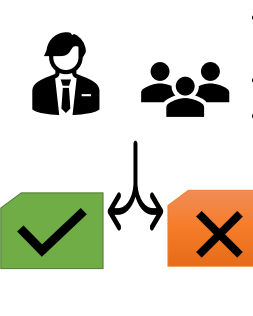
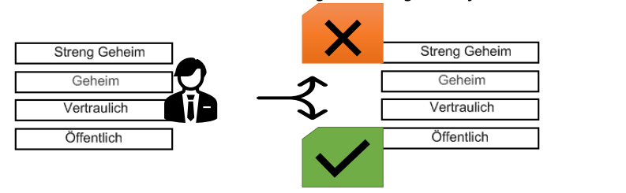
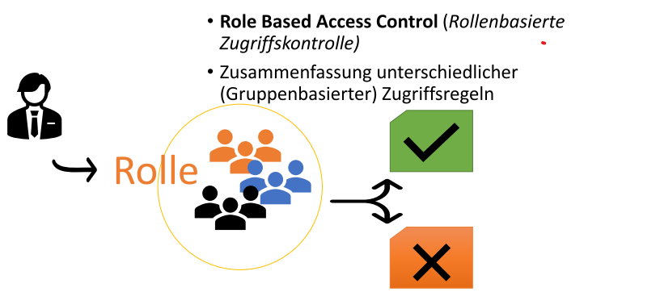
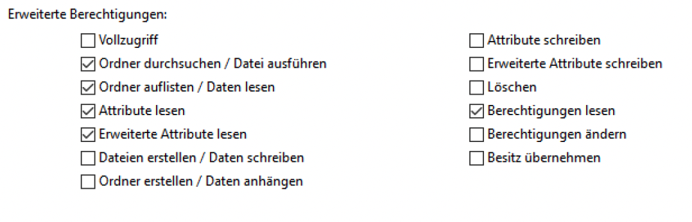

# NTFS[^5] - Berechtigungen

## 1 Gliederung

- ACL[^1], DACL[^2], MACL[^3] , RBACL[^4]
- Grundlegende Berechtigungen
- Erweiterte Berechtigungen
- Hierarchie von Berechtigungen
- Vererbung, Besitz
- Praxis
  - Grafisch
  - Eingabeaufforderung
  - PowerShell

[^1]:ACL
[^2]:DACL
[^3]:MACL
[^4]:RBACL

## 2 ACL[^1]

### Access Control List

- Eigenschaft von NTFS[^5]
- Gespeichert in MFT[^6]
- Berechtigungen für Benutzer und Gruppen
- Sichtbar in Datei-Eigenschaften
[^5]: NTFS new technology file system
[^6]: MFT Master File Table

### Varianten

- Discretionary Access Control (DAC[^2])
- Mandatory Access Control (MAC[^3])
- Role Based Access Control (RBAC[^4])

## 3 Zugriffsteuerung - DAC[^2]

### Discretionary Access Control

(Benutzerzentrierte Zugriffskontrolle)

- Zugriffsteuerung auf Basis der Benutzeridentität
- In Windows verwendet, um Zugriff auf Daten
im Dateisystem zu regeln  

## Zugriffsteuerung - MAC[^3]  

### Mandatory Access Control

- (zwingend erforderliche Zugriffskontrolle)
- zusätzliche Regeln und Eigenschaften

## 5 Zugriffsteuerung - RBAC[^4]

### Role Based Access Control

- (Rollenbasierte
Zugriffskontrolle)
- Zusammenfassung unterschiedlicher
(Gruppenbasierter) Zugriffsregeln Rolle

## 6 NTFS[^5] - Berechtigungen

- Access Control Lists (ACL[^1]) -> DAC[^2]
Zugriffsrechte für Benutzer und Gruppen auf
Ordner und Dateien
- vom übergeordneten Verzeichnis vererbt
- Bearbeiten:
  - Datei-Eigenschaften: Reiter Sicherheit
  - cmd: icacls
  - Powershell: <f>get-acl

## 7 Grundlegende Berechtigungen Liste

### Vollzugriff

schreiben, löschen, lesen,
Eigenschaften ändern (auch untergeordneter
Elemente)

### Ändern

schreiben, löschen, lesen,
Dateieigenschaften ändern

### Lesen, Ausführen

Dateien ausführen, lesen

### Lesen

lesen...

### Schreiben

Dateien hinzufügen

## 8 Grundlegende Berechtigungen Abhängigkeiten

Vollzugriff: beinhaltet alle anderen
Berechtigungen
Ändern: beinhaltet Lesen, Ausführen
Schreiben
Lesen, Ausführen: beinhaltet Lesen
Schreiben. Beinhaltet NICHT Lesen, geeignet
für Ablageverzeichnisse

## 9 Erweiterte Berechtigungen Liste

## 10 Erweiterte Berechtigungen Ordner durchsuchen/Datei ausführen

### Ordner durchsuchen/Datei ausführen

Navigation möglich ohne Berechtigungung für
einzelne Ordner oder Dateien

## 11 Erweiterte Berechtigungen Ordner auflisten/Daten lesen

### Ordner auflisten/Daten lesen

Inhalte und Dateien eines Ordners ansehen.

## 12 Erweiterte Berechtigungen Attribute lesen

### Attribute lesen

Attribute einer Datei oder eines Ordners
ansehen
(schreibgeschützt, versteckt, …)

## 13 Erweiterte Berechtigungen Erweiterte Attribute lesen

### Erweiterte Attribute lesen

erweiterte Attribute einer Datei oder eines
Ordners ansehen.
(verschlüsselt, komprimiert, …)

## 14 Erweiterte Berechtigungen Dateien erstellen/Daten schreiben

### Dateien erstellen/Daten schreiben

- Dateien innerhalb eines Ordners erstellen.
(gilt nur für Ordner)
- Datei ändern
(gilt nur für Dateien, nur gemeinsam mit
Leseberechtigung)

## 15 Erweiterte Berechtigungen Ordner erstellen/Daten anhängen

### Ordner erstellen/Daten anhängen

- Ordner innerhalb eines Ordners erstellen. (
gilt nur für Ordner.)
- Änderungen am Ende der Datei vornehmen,
(gilt nur für Dateien, nur gemeinsam mit
Leseberechtigung)

## 16 Erweiterte Berechtigungen Attribute schreiben

### Attribute schreiben

- Attribute von Datei / Ordner ändern
(schreibgeschützt, versteckt, …)

## 17 Erweiterte Berechtigungen Erweiterte Attribute schreiben

### Erweiterte Attribute schreiben

- Attribute vonDatei / Ordner ändern
(verschlüsselt, komprimiert, …)

## 18 Erweiterte Berechtigungen Löschen

### Löschen

- Datei / Ordner löschen
(auch möglich, bei übergordneter
Berechtigung „Unterordner und Dateien
löschen“)

## 19 Erweiterte Berechtigungen Berechtigungen Lesen

### Berechtigungen Lesen

- Lesen der Berechtigungen von Datei / Ordner

## 20 Erweiterte Berechtigungen Ändern

### Berechtigungen Ändern

- Ändern der Berechtigungen einer Datei /
eines Ordners
- Besitzer hat immer diese Berechtigung
(Besitzübernahme ermöglicht Admin-Zugriff)

## 21 Erweiterte Berechtigungen Besitz übernehmen

### Besitz übernehmen

- Besitz einer Datei / eines Ordners
übernehmen.

## 22  Grundlegende / Erweiterte Berechtigungen

| Grundlegende Berechtigungen          | Vollzugriff | Ändern | Lesen,Ausführen | Lesen | Schreiben |
| ------------------------------------ | ----------- | ------ | --------------- | ----- | --------- |
|  **Erweiterte Berechtigungen**          |   |   |   |  |   |
| Vollzugriff                          | <f>x        | -      | -               | -     | -         |
| Ordner durchsuchen / Datei ausführen | <f>x        | <f>x   | <f>x            | -     | -         |
| Ordner auflisten / Daten lesen       | <f>x        | <f>x   | <f>x            | <f>x  | -         |
| Attribute lesen                      | <f>x        | <f>x   | <f>x            | <f>x  | -         |
| Erweiterte Attribute lesen           | <f>x        | <f>x   | <f>x            | <f>x  | -         |
| Dateien erstellen / Daten schreiben  | <f>x        | <f>x   | -               | -     | <f>x      |
| Ordner erstellen / Daten anhangen    | <f>x        | <f>x   | -               | -     | <f>x      |
| Attribute schreiben                  | <f>x        | <f>x   | -               | -     | <f>x      |
| Erweiterte Attribute schreiben       | <f>x        | <f>x   | -               | -     | <f>x      |
| Unterordner und Dateien löschen      | <f>x        | -      | -               | -     | -         |
| löschen                              | <f>x        | <f>x   | -               | -     | -         |
| Berechtigungen lesen                 | <f>x        | <f>x   | <f>x            | <f>x  | -         |
| Berechtigungen ändern                | <f>x        | -      | -               | -     | -         |
| Besitz übernehmen                    | <f>x        | -      | -               | -     | -         |

## 23 Vererbung

- Neu erstellte Dateien / Ordner erben
Berechtigungen von übergeordnetem Ordner
- kann ausgeschaltet werden
- Umwandlung in explizite Berechtigungen
möglich

## 24 Verweigern vs. Erlauben

Verweigern hat Vorrang

## 25 Verweigern vs. Erlauben

### Hierarchie der Berechtigungen:

- Explizit verweigern
- Explizit erlauben
- Ererbt verweigern
- Ererbt erlauben
