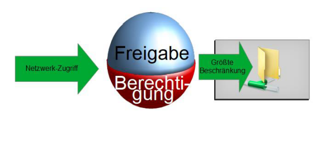

# Freigabe im Windows Netzwerk

## Einführung 1 Lernziele:

- Bedeutung
- Eigenschaften
- Unterschiede / Zusammenhang NTFS – SMB
- Praktische Anwendung

## 2 Einführung Erfahrungen?

- Bedeutung
- Praktische Anwendung

## 3 Bedeutung

### Ordner (inklusive Dateien) im Netzwerk zur Verfügung stellen

- Zugriff ermöglichen
- Zugriff selektiv verwehren
- Art des Zugriffs regeln

### Vermeidung redundanter Datenhaltung

## 4 Grundlagen

### Freigabe

- Netzwerkprotokoll
- Server Message Block
- Eigene Berechtigungsstruktur

### NTFS

- Granulare Berechtigungen
- lokal und remote identisch

## 5 Server Message Block - Geschichte 1

### Ursprünge 1983 IBM

### Erweiterung von Microsoft

- CIFS später SMB 1/2/3

### Reverse Engineering

- SAMBA-Project

### SMB1 kompromittiert

- 2017: Ransom-Ware Wannacry

## 6 Server Message Block - Geschichte 2

| SMBVersion-CIFS | Unterstützt seit      | Samba | Anmerkungen                                   |
| --------------- | --------------------- | ----- | --------------------------------------------- |
| CIFS            | Windows NT 4.0        | -     | -                                             |
| 1.0             | Windows 2000          | -     | Sicherheitslücken (WannaCry 2017) deaktiviert |
| 2.0             | Windows Vista         | 3.6   | -                                             |
| 3.0             | Windows 8 / Samba 4.0 | 4.0   | -                                             |
| 3.1.1           | Windows 10 Samba 4.3  | 4.3   | -                                             |

## 7 Server Message Block - Voraussetzungen

### Name erforderlich

### UNC-Pfad verwenden[^1]

- Universal Naming Convention
- &#92;&#92;&lt;Server-Name&gt;&#92;&lt;Freigabe-Name&gt;
- &#92;&#92;&lt;IP-Adresse&gt;&#92;&lt;Freigabe-Name&gt;
  [^1]: UNC Universal Naming Convention

### Sichtbarkeit im Netzwerk

- Datei- und Druckerfreigabe
- Kennwortgeschütztes Freigeben

## 8 Server Message Block - Eigenschaften

### Nur Ordner freigebbar

### Unsichtbare Freigaben ($)

- Standardfreigaben:  
  C$ -> C:&#92;  
  Admin$ -> C:&#92;Windows  
  IPC$ -> Freigaben anzeigen, remote Zugriff
- Versteckte Freigabe: z.B \\srv01\Freigabe$

### Keine Einschränkung bei lokalem Zugriff

### Name:

- bis 80 Zeichen, außer: " / \ : ; | < > , ? \* =

## 8 Server Message Block - Adressaten

### Benutzer

- Mitglieder der Gruppe
- Administratoren können auf
- Standardfreigaben Zugreifen

### Gruppen

- ACHTUNG:
  <f>Die weitestgehenden Rechte setzen sich durch</f>

## 9 Praktisches Vorgehen – Ordner-Eigenschaften, Reiter Freigabe

## 10 Wiederholung NTFS-Berechtigungen

- Berechtigungen für Verzeichnisse und Dateien
- Gleiche Berechtigung lokal und im Netzwerk
- Detaillierte Rechtevergabe (erweiterte Berechtigungen)
- Rechte der werden addiert
- Beispiel: Lesen + Schreiben

Gruppe - Lesen, Nutzer – Schreiben
<f>Verweigern hat immer Vorrang</f>

## 11 Zusammenwirken von Freigabe- und NTFS-Berechtigungen

## 12 Zusammenwirken von Freigabe- und NTFS-Berechtigungen

## 13 Zusammenwirken von Freigabe- und NTFS-Berechtigungen

