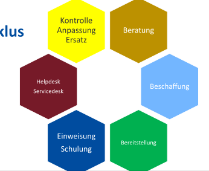
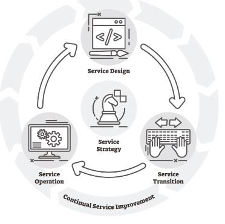
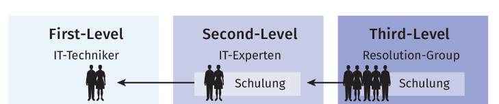

# IT-Service Management Grundlagen

## Übersicht

### definition

#### Service Lebenszyklus

#### Service arten

| Column1                | Column2                | Column3                |
| ---------------------- | ---------------------- | ---------------------- |
|  |  |  |

#### Best-Practices - ITIL

#### Service-Ooperation - Ticketsystem

| Column1                | Column2                | Column3                | Column3                |
| ---------------------- | ---------------------- | ---------------------- | ---------------------- |
|  |  |  |  |

#### Service-level

## GrundLagen

### Definition Service

BSI\*: Komposition von Objekten und Prozessen zur Erfüllung einer Aufgabenstellung

FitSM\*\*: Mittel zur Lieferung eines Mehrwerts für
Kunden indem dessen Ziele unterstützt werden.

ITIL***: Mittel zur gemeinsamen Wertschöpfung, fördert vom Kunden erstrebte Ergebnisse, vermindert Kosten und Risiken für Kunden
*Bundesamt für Sicherheit in der Informationstechnik
** Standardfamilie für ITSM
\*\*\* Best Practice Leitfaden

### Service Lebenszyklus

### Service Arten I

### Service Arten II

### Service Verfügbarkeit

### Best Practices

### Rollen und Zuständigkeit

### ticket systeme

#### Eingan/protokolierung : Auswahl der Möglichen Kontaktwege

#### Kategoriesierung, Klassifizierung

#### Priorisierung

#### Level
