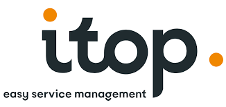
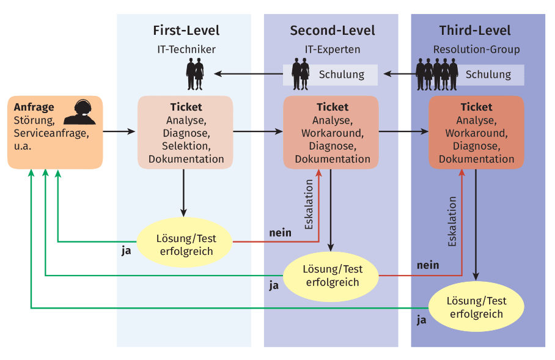

# IT-Service Management Grundlagen

## Übersicht

### definition

**IT Service Management (ITSM [^1])**

is a set of practices and processes that organizations use to design, deliver, manage, and improve IT services they provide to their customers or internal users. It focuses on aligning IT services with the needs of the business and ensuring that IT operations run efficiently and effectively. Key components of ITSM include:

[^1]: IT Service Management is a set of practices and processes that organizations use to design, deliver, manage, and improve IT services they provide to their customers or internal users. It focuses on aligning IT services with the needs of the business and ensuring that IT operations run efficiently and effectively

- **Service Design**: Planning and designing IT services that meet the needs of customers and align with business objectives.

- **Service Transition**: Managing the transition of new or changed services into the production environment while minimizing disruption.

- **Service Operation**: Day-to-day management of IT services, including incident management, problem management, and request fulfillment.

- **Change Management**: Controlling changes to IT systems and services to minimize risks and disruptions.

- **Incident Management**: Restoring normal service operations as quickly as possible after incidents, such as system failures or service disruptions.

- **Problem Management**: Identifying and addressing the root causes of recurring incidents to prevent them from happening again.

- **Service Desk**: Providing a single point of contact for users to request assistance and report issues.

- **Continuous Improvement**: Continuously reviewing and improving IT services and processes to enhance efficiency and effectiveness.

ITSM frameworks and standards like ITIL[^2] (**Information Technology Infrastructure Library**) and ISO/IEC 20000 provide best practices and guidelines for implementing ITSM processes. ITSM helps organizations deliver reliable and high-quality IT services, improve customer satisfaction, and achieve better alignment between IT and business goals.

[^2]: ITIL Information Technology Infrastructure Library

### Service Lebenszyklus

- Beratung
- Beschaffung
- Bereitstellung
- Einweisung Schulung
- Helpdesk Servicedesk
- Kontrolle Anpassung Ersatz

### Service arten

|                        |                        |                        |
| ---------------------- | ---------------------- | ---------------------- |
|  |  |  |

### Best-Practices - ITIL[^2]

### Service-Ooperation - Ticketsystem

| otrs                   | jira                   | freshdesk              | itop                   |
| ---------------------- | ---------------------- | ---------------------- | ---------------------- |
|  |  |  |  |

### Service-level

## GrundLagen

### Definition Service

BSI[^3]: Komposition von Objekten und Prozessen zur Erfüllung einer Aufgabenstellung

FitSM[^4]: Mittel zur Lieferung eines Mehrwerts für
Kunden indem dessen Ziele unterstützt werden.

ITIL[^2]\*\*\*: Mittel zur gemeinsamen Wertschöpfung, fördert vom Kunden erstrebte Ergebnisse, vermindert Kosten und Risiken für Kunden
[^3]:Bundesamt für Sicherheit in der Informationstechnik
[^4]: Standardfamilie für ITSM

## Service Lebenszyklus

Beispiel-Service  
Beschaffung / Installation / Konfiguration von Mitarbeiter-Notebooks

### Beratung

- Ist-Analyse
- Strategie
- Chancen
- Konzepte
- Pläne
- Compliance
- Sicherheit
- Green-IT
- Wirtschaftlichkeit
- Risiken

### Beschaffung

- Anforderungen
- Vertragsgestaltung
- Ausschreibung
- Angebotsauswahl
- Bestellung
- E-Procurement
- Annahme

### Bereitstellung

- Anlieferung
- Konfiguration
- Installation
- Tests
- Hosting
- Cloud-Services
- Managed Services
- Administration
- Lizenzverwaltung
- Abrechnung

### Einweisung Schulung

- Vor-Ort-Einweisung
- Website-FAQ
- Beratung
- Schulung
- Training
- Zertifizierung

### Helpdesk Service- desk

- Bearbeitung SLA
- Verträge
- Administration
- Fern-Wartung
- Pflege
- Monitoring
- Unterstützung
- Services
- Beratung
- Kommunikation

### Kontrolle Anpassung Ersatz

- Tests, Analysen ROI, Berichte Ersatz
- Gewährleistung
- Garantie
- Entsorgung
- Upgrade
- Migration
- Recycling
- Datenlöschung

## Service Arten I

- IT-Vertrieb/IT-Handel
- IT-Service
- Field-Service/Vor-Ort-Service
- On-Side-Management
- Swap-Service
- DIY-Service
- Cloud-Services
- Live-Chat
- Chatbot

## Service Arten II

### Managed Services

- Dienstleister, Managed Service Provider(MSP)[^5]
- wiederkehrende Leistungen
- Service Level Agreements(SLA)
- Ziel: Verhinderung von Ausfällen

[^5]: MSP Managed Service Provider

### Garantie-Service

- Unentgeltliche Leistungen
- Ansprüche aus
- Gewährleistung oder Garantie
- Garantieverlängerungen

### Kulanz

- Unentgeltliche Leistungen
- freiwillig
- ohne vertragliche Grundlage
- Ziel: Kundenbindung

### Wartungs-/Reparaturservice

- Service auf vertraglicher Grundlage
- Wiederkehrende Wartungen
- Reparaturen bei Bedarf

### IT-Sourcing/Outsourcing

- Vollständige Verantwortung für IT-Infrastruktur und IT- Service Management bei Dienstleister
- Gestaffelte Angebote (Bsp.)
  - Stufe 1: Basis-Angebot
  - Stufe 2: + Beratung
  - Stufe 3: + Premium-Support
  - Stufe 4: + Wunschleistungen

### IT-Einweisung/Training

- Bezahltes (Zusatz-)Training / bezahlte Schulung
- Weiterbildung
- Fortbildung
- Einweisung

### Weitere ...

- Beratung
- Projektmanagement
- Mitarbeiterüberlassung

## Service Verfügbarkeit

- 24/7
- 12/5 -> 12 Stunden / 5 Tage

## Best Practices

### ITIL

Beschreibt verschiedene Services Offen für Veränderungen „Start where you are“-Ansatz Optimieren und automatisieren Kontinuierliche Service Verbesserung

### Service-Lebenszyklus

- Kontinuierliche Service Verbesserung

### Service Design

- Service Level Management
- Service Availability Management
- Service Catalog Management (CMDB)[^6]

[^6]: CMDB Service Catalog Management

### Service-Transition

- Release Management
- Knowledge Management
- Change Management

### Service-Operation /ticket system

- Incident Management
- Request Fulfillment
- Problem Management
- Access Management

## Rollen und Zuständigkeit

### RACI-Matrix

**R** => Responsible Person/Rolle, die für die Durchführung verantwortlich ist

**A** => Accountable Person/Rolle, die die Gesamtverantwortung trägt

**C** => Consulted Person/Rolle, die Expertise beiträgt, Berater

**I** => Informed Person/Rolle, die über Status/Ergebnisse informiert sein muss

## ticket systeme

### Definition:

Fallbearbeitungs-System (Software), das die Bearbeitung von Kunden/Mitarbeiteranfragen verwaltet

### Aufgaben:

- Empfang der Anfrage (Mail, Anruf, SMS,Frontend ...)
- Bestätigung (Nr.-Vergabe, Status-Anzeige)
- Klassifizierung (Incident, Service-Request, RFC)
- Zuweisung zu Service Level / Queue
- Bearbeitung
- Überwachung (SLA)
- Nachverfolgung / Auswertung

### Anbieter(Auswahl):

- OTRS/Znuny (Open-Source)
- JIRA (Atlassian)
- Zammad (für kleinere Unternehmen)
- Crisp(Chat + Helpdesk)
- Freshdesk (Cloud-Plattform)
- SpiceWorks
- ZenDesk (Cloud-Plattform)
- iTOP (OpenSource)

### Bearbeitungsablauf:

1. Eingang – Quellen: Telefon, Mail, Frontend
2. Protokollierung (automatisch / händisch)
3. Kategorisierung, Klassifizierung
4. Priorisierung
5. Bearbeitung durch First-Level-Support
6. Ggf. Eskalation an Second- oder Third-Level-Support
7. Untersuchung und Diagnose
8. Lösung / Wiederherstellung
9. Feedback erhalten
10. Ticket Schließen

### Eingang/Protokollierung: Auswahl der möglichen Kontaktwege

#### Telefon:

händische Aufnahme der Anliegen

- Vorteil: direkter Kundenkontakt
- Nachteile: fehlende Informationen, zeitaufwändig, Emotionen

#### Mail:

schriftliche Aufnahme der Anliegen

- Vorteil: zeitsparend
- Nachteile: ggf. unvollständig Informationen, unpersönlich

#### Frontend:

schriftlich, zwingend vorgegebene Angaben

- Vorteil: zeitsparend, alle notwendigen Informationen, FAQ integrierbar
- Nachteile: unpersönlich, ggf. unverständlich, Konfiguartionsaufwand

#### Kategorisierung, Klassifizierung, Priorisierung

##### Kategorisierung:

- nach Dienstleistungskategorien / nach Ticket-Queues
- Bsp: Systemerweiterung, Störungen, Hardware-Austausch

##### Klassifizierung

- Zuordnung nach Service-Klassen
- Bsp: Service-Request, Störung (Incident), Change

##### Priorisierung

**Ermitteln der relativen Dringlichkeit / Wichtigkeit:**

Priorität 1 - höchste Stufe, Priorität 5 – niedrigste Stufe

Maximale Lösungszeit | Auswirkung / Risiko /
Anzahl betroffene Systeme, Personen
Dringlichkeit | Hoch | Mittel| Niedrig
---------|----------|---------|---------
Hoch | 1 | 2 | 3
Mittel |2 | 3 | 4
Niedrig | 3 | 4 | 5

## Level

