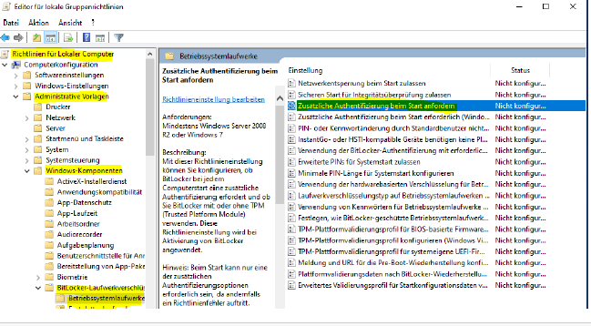
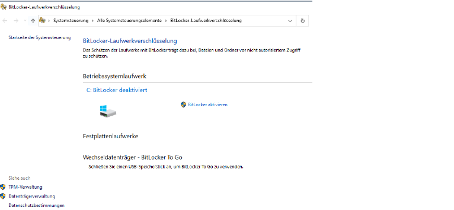
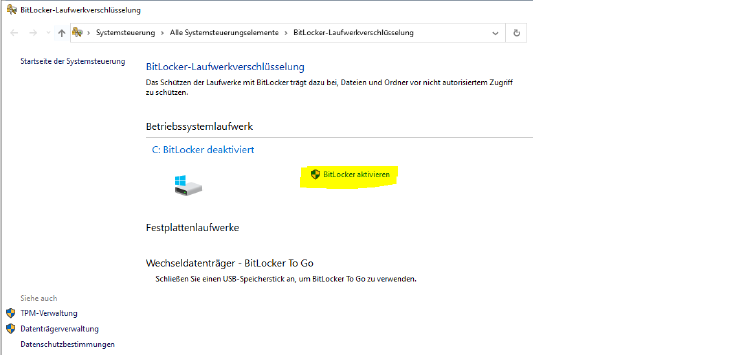
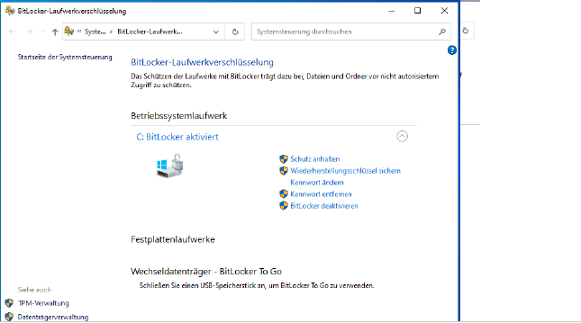
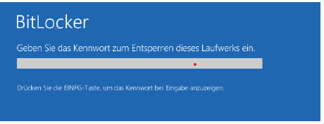

# Verschlüsselung und bit locker

## Verschlüsselung

### Grundlagen Kerckhoff Prinzip (1883)

#### Das System

1. muss im Wesentlichen (…)
   unentzifferbar sein.
2. darf keine Geheimhaltung erfordern (…).
3. muss leicht übermittelbar sein und man muss sich die Schlüssel ohne
   schriftliche Aufzeichnung merken können (…).
4. sollte mit telegraphischer Kommunikation kompatibel sein.
5. muss transportabel sein und die Bedienung darf nicht mehr als eine Person
   erfordern.
6. muss einfach anwendbar sein (…).

#### Anforderungen

1. Vertraulichkeit (nicht effizient entzifferbar)
2. Offenheit (keine Geheimhaltung des Algorithmus)
3. Übermittelbarkeit (Länge und Aufbau des Chiffrats)
4. Veränderbarkeit (Schlüssel auswechselbar, (
   leicht zu merken))
5. Einfachheit (Ohne Expertenhilfe nutzbar)
6. Robustheit (Algorithmen / Implementierung wissenschaftlich untersucht )

### Verfahren

#### Symmetrische Verschlüsselung

- Zum Ver und Entschlüsseln gleicher Schlüssel
- Schnelles Verfahren
- Algorithmen: DES[^1], AES[^2], Blowfish , Twofish , ...

[^1]: DES Data Encryption Standard is an outdated symmetric key method of data encryption. It was adopted in 1977 for government agencies to protect sensitive data and was officially retired in 2005.

[^2]: AES Advanced Encryption Standard Government-approved cryptographic algorithm that can be used to protect electronic data. The AES algorithm is a symmetric block cipher that can encrypt (encipher) and decrypt (decipher) information.

#### Asymmetrische Verschlüsselung

- Verschlüsseln:public key
- Entschlüsseln: private key
- Bei unsicherem Übertragungs Kanal

### Symmetrische Verfahren

#### Blockchiffre (blockcipher)

- Schlüssel in Blockgröße
- Wird auf jeden Block angewandt
- Beispiele: DES[^1], AES[^2], Blowfish , Twofish ,

#### Stromchiffre

- Zeichenweise/Bitweise Verschlüsselung
- FürEchzeitübertragungen : Mobilfunk, Bluetooth,
- Synchron, Selbstsynchronisierend
- Beispiele: OFB[^3], CFB[^4], SEAL[^5], E0[^6]

[^3]: OFB (short for output feedback) is an AES block cipher mode similar to the CFB mode. What mainly differs from CFB is that the OFB mode relies on XOR-ing plaintext and ciphertext blocks with expanded versions of the initialization vector.

[^4]: CFB also known as cipher feedback, is a mode of operation for a block cipher. Ciphertext refers to encrypted text transferred from plaintext using an encryption algorithm, or cipher.

[^5]: SEAL (Software-Optimized Encryption Algorithm) is a stream cipher optimised for machines with a 32-bit word size and plenty of RAM with a reported performance of around 4 cycles per byte.

[^6]: E0 is a stream cipher used in the Bluetooth protocol. It generates a sequence of pseudorandom numbers and combines it with the data using the XOR operator. The key length may vary, but is generally 128 bits.

## Bitlocker

### what is ??

BitLocker Drive Encryption, or BitLocker, is a Microsoft Windows security and encryption feature that is included with certain newer versions of Windows. BitLocker enables users to encrypt everything on the drive Windows is installed on, protecting that data from theft or unauthorized access.

#### Symmetrische Verschlüsselung

- Festplatten / Laufwerke
- USB-Medien (Bitlocker To Go)

#### Schlüsselschutz Varianten (einzeln oder Kombination)

- TPM (Trusted Platform Modul)
- Passwort
- Token (USB)

#### Verschlüsselungsverfahren:

- AES ( Advanced Encryption Standard)

### Vorgehen (ohne TPM)

#### Zusätzliches Passwort vor dem BS Start notwendig

#### Einstellung in LGPO[^7] (lokale Gruppenrichtlinie)

Richtlinie für lokalen Computer  
=> Administrative Vorlagen  
=> Windows Komponenten  
=> Bitlocker Laufwerksverschlüsselung  
=> Betriebssystemlaufwerke  
=> zusätzliche Authentifizierung beim Start anfordern

[^7]: LGPO Local Group Policy Object refers to the collection of group policy settings that only apply to the local computer and to the users who log on to that computer. Local GPOs are used when policy settings need to apply to a single Windows computer or user.

- Bitlocker in Systemsteuerung aktivieren
- Neustart mit Passwort
  Eingabe
- Verschlüsselung wird im Hintergrund durchgeführt

### Vorgehen

### Kommandozeile

#### Powershell

Get-BitLockerVolume | Select-Object \*

#### Eingabe Aufforderung

manage-bde -status

### Weitere Informationen

#### Laufwerksverschlüsselung per BitLocker : Das sollten Sie beachten | heise online

https://www.heise.de/ratgeber/Laufwerksverschluesselung-per-BitLocker-Das-sollten-Sie-beachten-7467041.html

#### BitLocker auf Windows 10: Festplatte richtig verschlüsseln | heise online

https://www.heise.de/tipps-tricks/BitLocker-auf-Windows-10-Festplatte-richtig-verschluesseln-4325375.html

#### Bitlocker aktivieren |heise online

https://www.heise.de/ratgeber/Windows-Festplatten-mit-Bordmitteln-verschluesseln-4572663.html?seite=3

#### manage bde | Microsoft Learn

https://learn.microsoft.com/de-de/windows-server/administration/windows-commands/manage-bde
