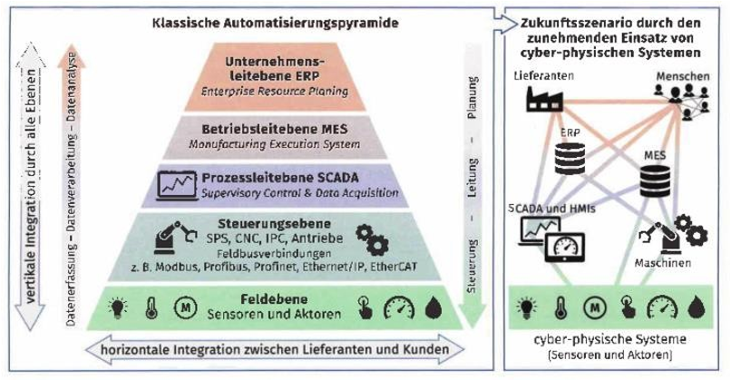
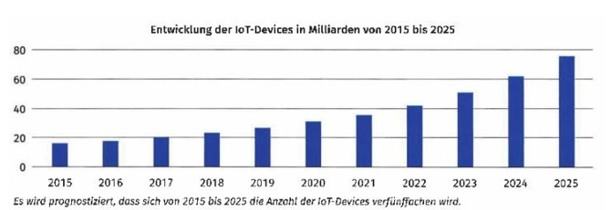
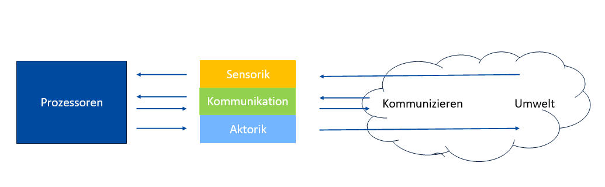

# Cyber-physische Systeme

## 2.1 Grundlagen von cyber-physischen Systemen

### Begriff

Ein cyber-physisches System bezeichnet den Verbund informatischer, softwaretechnischer Komponenten mit mechanischen und elektronischen Teilen, die über eine Dateninfrastruktur, wie z. B. das Internet oder ein Intranet, kommunizieren.

### Industrie 4.0

Man spricht dabei von der vierten industriellen Revolution

| Generation 1.0                                                           | Generation 2.0                                                       | Generation 3.0                                                       | Generation 4.0                                                            |
| ------------------------------------------------------------------------ | -------------------------------------------------------------------- | -------------------------------------------------------------------- | ------------------------------------------------------------------------- |
| Mechanisierung  Dampfmaschinen Mechanischer Webstuhl   ab ca. 1790 | Massenproduktion Elektrisierung Industrialisierung ab ca. 1870 | Automatisierung  Elektronik E-Steuerung IT-Systeme ab ca. 1970 | Cyber-physische Systeme  IoT, Netzwerke, Smart Factory  ab ca. 2017 |

### Grundbegriffe gibt es bei der Industrie 4.0

#### Cyber-physische Systeme CPS[^1]

-> CPS sind ein Verbund aus informatischen und softwaretechnischen Komponenten mit mechanischen wie auch elektrischen Teilen, die mit IT-Systemen vernetzt sind.

[^1]: CPS Cyber-physische Systeme sind ein Verbund aus informatischen und softwaretechnischen Komponenten mit mechanischen wie auch elektrischen Teilen, die mit IT-Systemen vernetzt sind.

#### Cyber-physische Produktionssysteme (CPPC[^2])

-> **CPPC** sind entsprechende cyber-physische Systeme, die im industriellen Umfeld in modernen Produktions- maschinen und –anlagen zum Einsatz kommen.

[^2]: CPPC Cyber-physische Produktionssysteme sind entsprechende cyber-physische Systeme, die im industriellen Umfeld in modernen Produktions- maschinen und –anlagen zum Einsatz kommen.

#### IoT – Internet of Things

-> Das **IoT** ist ein Sammelbegriff für die unterschiedlichsten Technologien einer global vernetzten Infrastruktur, die sowohl physische als auch virtuelle Objekte über das Internet verbindet.

#### Industrial Internet of Things (IIoT)[^3]

-> Das **IIoT** beschreibt industrielle Anwendungen im Internet of Things. Hierbei steht besonders die Vernetzung mit Maschinen und Anlagen mittels intelligenter Sensorik im Vordergrund.

[^3]: IIoT Industrial Internet of Things beschreibt industrielle Anwendungen im Internet of Things. Hierbei steht besonders die Vernetzung mit Maschinen und Anlagen mittels intelligenter Sensorik im Vordergrund.

#### Smart Factory

-> Die Smart Factory bezeichnet eine sich selbst organisierende und optimierende Produktionsumgebung, in der mittels cyber-physischen Systemen Maschinen und Anlagen vernetzt sind.

#### Smart Home

-> Smart Home ist der Oberbegriff für den Einsatz von cyber-physischen Systemen in Wohn- und Bürogebäuden zur Erhöhung der Wohn- und Lebensqualität und zum intelligenten Energiemanagement

### Internet of Things

LehrBuch\_ LF_7 – Grafik Seite 81. -> die Automatisierungspyramide

- ERP[^4]: ERP **Enterprise Resource Planning** refers to a software system that integrates various business processes and functions within an organization. It helps manage and streamline operations such as finance, human resources, inventory, and production planning.
- MES[^5]: Manufacturing Execution System is a software system used in manufacturing to monitor, control, and manage production processes on the shop floor. It helps bridge the gap between enterprise-level systems (like **ERP**) and the actual manufacturing process.
- SCADA[^6]: Supervisory Control and Data Acquisition is a control system architecture used for industrial processes. It involves collecting data from sensors and devices in real-time, monitoring and controlling industrial processes, and often includes remote access and control capabilities.
- SPS[^7]: Speicherprogrammierbare Steuerung stands for "Speicherprogrammierbare Steuerung," which is the German term for "**Programmable Logic Controller (PLC)**" in English.
- CNC[^8]: Computer Numerical Control refers to the automation of machine tools and 3D printers by means of computers executing pre-programmed sequences of machine control commands. It's commonly used in manufacturing for precision machining.
- IPC[^9]: Industrial Personal Computer are specialized computers designed for use in industrial environments. They are built to withstand harsh conditions and are often used for data collection, control, and monitoring in industrial automation and IoT applications.
- HMI[^10]:Human-Machine Interface In the context of industrial automation and IoT (Internet of Things), an HMI is a user interface or dashboard that allows human operators to interact with and monitor machines, systems, or processes.

[^4]: ERP Enterprise Resource Planning refers to a software system that integrates various business processes and functions within an organization. It helps manage and streamline operations such as finance, human resources, inventory, and production planning. 
[^5]: MES Manufacturing Execution System is a software system used in manufacturing to monitor, control, and manage production processes on the shop floor. It helps bridge the gap between enterprise-level systems (like **ERP**) and the actual manufacturing process. 
[^6]: SCADA Supervisory Control and Data Acquisition is a control system architecture used for industrial processes. It involves collecting data from sensors and devices in real-time, monitoring and controlling industrial processes, and often includes remote access and control capabilities. 
[^7]: SPS Speicherprogrammierbare Steuerung stands for "Speicherprogrammierbare Steuerung," which is the German term for "**Programmable Logic Controller (PLC)**" in English. 
[^8]: CNC Computer Numerical Control refers to the automation of machine tools and 3D printers by means of computers executing pre-programmed sequences of machine control commands. It's commonly used in manufacturing for precision machining. 
[^9]: IPC Industrial Personal Computer are specialized computers designed for use in industrial environments. They are built to withstand harsh conditions and are often used for data collection, control, and monitoring in industrial automation and IoT applications. 
[^10]: HMI Human-Machine Interface is a user interface or dashboard that allows human operators to interact with and monitor machines, systems, or processes.

### Anforderungen und technische Grundlagen für das Internet of Things

#### Konnektivität

… Unterstützung von zahlreichen Funktechnologien (4G/5G, Bluetooth, WLAN, Zigbee[^11], Zwave[^12], LoRa[^13], …) und Industrie- protokollen (OPC UA, Modbus, …)

[^11]: Zigbee is an IEEE 802.15.4-based specification for a suite of high-level communication protocols used to create personal area networks with small, low-power digital radios, such as for home automation, medical device data collection, and other low-power low-bandwidth needs, designed for small scale projects which need wireless connection. 
[^12]: Zwave, Z-Wave is a wireless communications protocol used primarily for residential and commercial building automation. It is a mesh network using low-energy radio waves to communicate from device to device, allowing for wireless control of smart home devices, such as smart lights, security systems, thermostats, sensors, smart door locks, and garage door openers. 
[^13]: LoRa (from "long range") is a physical proprietary radio communication technique. It is based on spread spectrum modulation techniques derived from chirp spread spectrum (CSS) technology.

#### Offene Schnittstellen

… Anwendungsprogrammierschnittstellen (API‘s) ermöglichen universellen Zugriff auf den Dienst

#### Management

… zentrale Steuerung und Überwachung in Hinblick auf Software-Updates, Tests oder Fehlerbehebung

#### Datenanalyse

… in Echtzeit, Untersuchung auf Muster und Abweichungen -> Künstliche Intelligenz und maschinelles Lernen

#### Reporting

… Visualisierung der Daten auf Dashboards

#### Sicherheit

… Authentifizierung, Verschlüsselung, geschützter Datentransfer

### welche technologischen Entwicklungen machen diese Revolution überhaupt möglich

- Die enorme Verkleinerung der elektronischen Komponenten und die Verbesserung der Sensortechnik.
- Die Rechenleistung steigt und der Stromverbrauch sinkt.
- Die Konnektivität hat deutliche Fortschritte im Bereich der Funktechnologien gemacht.

### Der Rebound-Effekt

Die Nachhaltigkeitsberechnung wird teilweise durch den starken Wachstum der IoT-Geräte überkompensiert.

Durch immer mehr IoT-Geräte wird das dadurch mögliche Einsparpotential teilweise oder sogar vollständig eliminiert.

### Anwendungsfelder

#### 1. **Smart Home Energie- und Gebäudetechnik**

Haushaltsgeräte und Komfort, Energieversorgung, Sicherheit

#### 2. **Intelligente Fertigung und das Industrial Internet of Things (IIoT)**

Produktionsplanung, Produktionssteuerung, Vorhersage, Analyse

#### 3. **Automotive-Bereich**

Vehicle-to-Vehicle (V2V), Vehicle-to.Infrastructure(V2I), Vehicle-to-Pedestrians(V2P), Vehicle-to-Network(V2N),Flottenmanagement, Autonomes Fahren, Automotive Maintenance System, Infotainment und Telematik

#### 4. **Smart Health – Gesundheitswesen**

Fitness-Armbänder, Smartwatches, Medikamentensteuerung, Blutzucker-Sensor

#### 5. **Smart Cities – intelligente Städte**

Verbesserung der Effizienz, Effektivität und Flexibilität des gesamten Systems

#### 6. **Consumer-Bereich**

Virtual Reality, Augmented Reality, Sprach-Erkennung und -Steuerung

### Struktureller Aufbau von cyber-physischen Systeme

#### Mehr

**OPC UA[^14]**
**Modbus[^15]**

**OPC** stands for "**OLE for Process Control**."  
**OLE** stands for "**Object Linking and Embedding**,"

**OPC UA & Modbus** are two commonly used industrial communication protocols, each with its own features and advantages. Here's a brief overview of each:

**OPC UA** (Unified Architecture):

**OPC UA** is a modern and highly flexible industrial communication protocol designed for interoperability and data exchange in industrial automation and IoT environments.

It provides a platform-independent and vendor-neutral framework for exchanging data and information between different industrial systems and devices, including sensors, controllers, and **SCADA** systems.

**OPC UA** supports secure communication with features like encryption and authentication, making it suitable for applications where data security is critical.
It is known for its rich information modeling capabilities, allowing for structured and standardized data representation, which makes it easier to interpret and use data across various systems.
**OPC UA** is widely used in industries like manufacturing, process control, and building automation for tasks such as remote monitoring, control, and data collection.
Modbus:

**Modbus** is one of the oldest and most widely used industrial communication protocols. It was originally developed in the late 1970s and is available in several variants, including Modbus RTU, Modbus ASCII, and Modbus TCP/IP.
Modbus is relatively simple and lightweight, making it easy to implement and widely supported by various devices and controllers.
It is often used for connecting devices within a local area network (LAN) or for serial communication between devices over RS-232 or RS-485.
**Modbus** is commonly used in industrial applications for tasks like reading and writing data from sensors, control devices, and programmable logic controllers (PLCs).
While Modbus is straightforward and suitable for many applications, it lacks some of the advanced features and security measures found in more modern protocols like OPC UA.
The choice between OPC UA and Modbus depends on factors like the complexity of the industrial system, security requirements, interoperability needs, and the legacy equipment in use. OPC UA is often favored for its advanced capabilities and robust security features, especially in more complex and modern industrial environments. **Modbus** remains a popular choice for simpler applications or when working with legacy devices that support the protocol.

[^14]: OPC UA OLE for Process Control Unified Architecture, Object Linking and Embedding for Process Control Unified Architecture is a modern and highly flexible industrial communication protocol designed for interoperability and data exchange in industrial automation and IoT environments. 
[^15]: Modbus is one of the oldest and most widely used industrial communication protocols. It was originally developed in the late 1970s and is available in several variants, including Modbus RTU, Modbus ASCII, and Modbus TCP/IP.

**RTOS[^16]**: "Real-Time Operating System." It is an operating system designed for real-time and embedded systems, where precise and predictable responses to events or inputs are essential. RTOS is often used in applications that require strict timing, reliability, and determinism, such as industrial control systems, automotive electronics, medical devices, aerospace systems, and more.

- sensorik
- Kommunikation
- Aktorik

**SBC Single board computer[^17]**: A single-board computer (SBC) is a complete computer built on a single circuit board, with microprocessor(s), memory, input/output (I/O) and other features required of a functional computer. Single-board computers are commonly made as demonstration or development systems, for educational systems, or for use as embedded computer controllers. Many types of home computers or portable computers integrate all their functions onto a single printed circuit board.

[^16]: RTOS "Real-Time Operating System." It is an operating system designed for real-time and embedded systems, where precise and predictable responses to events or inputs are essential. RTOS is often used in applications that require strict timing, reliability, and determinism, such as industrial control systems, automotive electronics, medical devices, aerospace systems, and more. 
[^17]: SBC Single board computer A single-board computer (SBC) is a complete computer built on a single circuit board, with microprocessor(s), memory, input/output (I/O) and other features required of a functional computer. Single-board computers are commonly made as demonstration or development systems, for educational systems, or for use as embedded computer controllers. Many types of home computers or portable computers integrate all their functions onto a single printed circuit board.

**MQTT[^18]** stands for "**Message Queuing Telemetry Transport**." It is a lightweight, publish-subscribe messaging protocol designed for low-bandwidth, high-latency, or unreliable networks. **MQTT** is often used in Internet of Things (IoT) and **M2M (Machine-to-Machine)** communication scenarios, where efficiency and reliability are essential.

**SoC System-On-Chip[^19]**

[^18]:
    MQTT Message Queuing Telemetry Transport It is a lightweight, publish-subscribe messaging protocol designed for low-bandwidth, high-latency, or unreliable networks. **MQTT** is often used in Internet of Things (IoT) and **M2M (Machine-to-Machine)** communication scenarios, where efficiency and reliability are essential.
     [^19]: SoC System-On-Chip

Arduino vs Raspberry Pi (Python interpreter)

**ESP32[^20]** is a series of low-cost, low-power **system on a chip** microcontrollers with integrated Wi-Fi and dual-mode Bluetooth.

[^20]: ESP32 is a series of low-cost, low-power **system on a chip** microcontrollers with integrated Wi-Fi and dual-mode Bluetooth.

**WPAN (Wireless Personal Area Network)[^21]**:  
A **WPAN** is a small-scale wireless network used for connecting devices within a relatively short range, typically within a few meters to a few tens of meters.
Common WPAN technologies include Bluetooth and Zigbee, which are used for applications like wireless headphones, computer peripherals, home automation, and IoT devices.
WPANs are often used for personal or localized connectivity, such as connecting a smartphone to a wireless headset.

[^21]:
    WPAN Wireless Personal Area Network is a small-scale wireless network used for connecting devices within a relatively short range, typically within a few meters to a few tens of meters.
    Common WPAN technologies include Bluetooth and Zigbee, which are used for applications like wireless headphones, computer peripherals, home automation, and IoT devices.
    WPANs are often used for personal or localized connectivity, such as connecting a smartphone to a wireless headset.

**6LoWPAN[^22] (IPv6 over Low-Power Wireless Personal Area Networks)**:

[^22]: 6LoWPAN IPv6 over Low-Power Wireless Personal Area Networks

**6LoWPAN** is a specific networking protocol designed to enable the use of IPv6 (Internet Protocol version 6) over WPANs, particularly in low-power and resource-constrained devices.
It is commonly used in IoT applications where devices need to communicate using standard IP protocols but have limited power and processing capabilities.
6LoWPAN enables devices to connect to the Internet and communicate with other devices over IPv6, even in scenarios with low data rates and intermittent connectivity.

**NFC (Near Field Communication)[^23]:**

**NFC** is a short-range wireless communication technology used for contactless data transfer and secure communication between devices.
NFC operates at very short distances, typically within a few centimeters, making it ideal for applications like contactless payments (e.g., Apple Pay and Google Wallet), access control systems, and data transfer between devices.
NFC is also used for pairing devices quickly, such as tapping a smartphone to a speaker to establish a Bluetooth connection.

[^23]:NFC (Near Field Communication)is a short-range wireless communication technology used for contactless data transfer and secure communication between devices.NFC operates at very short distances, typically within a few centimeters, making it ideal for applications like contactless payments (e.g., Apple Pay and Google Wallet), access control systems, and data transfer between devices.NFC is also used for pairing devices quickly, such as tapping a smartphone to a speaker to establish a Bluetooth connection.

PLC[^24] PLC Programmable Logic Controller are ruggedized industrial computers used for controlling manufacturing processes, machinery, and automation in various industries.

[^24]: PLC Programmable Logic Controller are ruggedized industrial computers used for controlling manufacturing processes, machinery, and automation in various industries.

### footnotes:  

