<link rel="stylesheet" type="text/css" href="../styles.css">

# Unterrichtsinhalte Netzwerktechnik

## A.) Quellen:

IT-Handbuch Westermann 12.Auflage  
Quellen aus dem Internet:

- [🔗de.wikipedia.org](de.wikipedia.org)
- [🔗netzmafia.de/skripten/netze/index.html](netzmafia.de/skripten/netze/index.html)  
  Kann komplett heruntergeladen werden (zum Entpacken kann 7-zip.org notwendig werden).

- [🔗wut.de/download/print/e-58www-11-prde-000.pdf](wut.de/download/print/e-58www-11-prde-000.pdf)
- [🔗wut.de/download/print/e-58www-20-prde-000.pdf](wut.de/download/print/e-58www-20-prde-000.pdf)
- [🔗https://www.thomas-krenn.com/de/wiki/Kategorie:Netzwerk+Zubehör](https://www.thomas-krenn.com/de/wiki/Kategorie:Netzwerk+Zubeh%c3%b6r)
- [🔗thomas-krenn.com/de/wiki/Kostenlose_IT_Bücher](thomas-krenn.com/de/wiki/Kostenlose_IT_B%C3%BCcher)

- youtube.com

- lernsoftware-filius.de/ ==>> Wird im weiteren Unterricht gebraucht.

## B.) Allgemein:

### Geschichte:

[🔗de.wikipedia.org/wiki/Arpanet](de.wikipedia.org/wiki/Arpanet)

### Leitungsvermittlung, Paketvermittlung:

[🔗www.netplanet.org/aufbau/netzwerk.shtml](www.netplanet.org/aufbau/netzwerk.shtml)

[🔗netzmafia.de/skripten/netze/netz0.html#0.3](netzmafia.de/skripten/netze/netz0.html#0.3)

### Kommunikationsprotokoll:

[🔗de.wikipedia.org/wiki/Kommunikationsprotokoll](de.wikipedia.org/wiki/Kommunikationsprotokoll)

=> siehe: im Verzeichnis Filius/Filius_1_PC_DHCP_DNS_Web_10.fls

### Host:

[🔗de.wikipedia.org/wiki/Hostrechner](de.wikipedia.org/wiki/Hostrechner)

### Server:

[🔗de.wikipedia.org/wiki/Server](de.wikipedia.org/wiki/Server)

### Vorteile von Netzwerken:

- Schneller Datenaustausch möglich.
- Gemeinsame Ressourcennutzung (z.B. nur ein Drucker für alle Anwender im Büro notwendig).
- Zentrale Datenspeicherung (Fileserver, NAS).
- Kostenersparnis (immer ein Argument), ....

### Nachteile von Netzwerken:

- Schnelle Verbreitung von Schadsoftware möglich.
- Spionage von innen und von außen möglich.
- Kosten für Aufbau, Wartung und eventuell Personalkosten für die Administration, ....

### Dimensionen von Netzwerken:

#### LAN:

[🔗de.wikipedia.org/wiki/Local_Area_Network](de.wikipedia.org/wiki/Local_Area_Network)

=> siehe: im Verzeichnis Filius/Filius_2_LAN.fls

#### MAN:

[🔗de.wikipedia.org/wiki/Metropolitan_Area_Network](de.wikipedia.org/wiki/Metropolitan_Area_Network)

#### WAN:

[🔗de.wikipedia.org/wiki/Wide_Area_Network](de.wikipedia.org/wiki/Wide_Area_Network)

#### GAN:

[🔗de.wikipedia.org/wiki/Global_Area_Network](de.wikipedia.org/wiki/Global_Area_Network)

### Topologien (allgemein):

[🔗de.wikipedia.org/wiki/Topologie\_(Rechnernetz)](<de.wikipedia.org/wiki/Topologie_(Rechnernetz)>)

#### Ringtopologie:

[🔗de.wikipedia.org/wiki/Topologie\_(Rechnernetz)#Ring-Topologie](<de.wikipedia.org/wiki/Topologie_(Rechnernetz)#Ring-Topologie>)

#### Bustopologie:

[🔗de.wikipedia.org/wiki/Topologie\_(Rechnernetz)#Bus-Topologie](<de.wikipedia.org/wiki/Topologie_(Rechnernetz)#Bus-Topologie>)

#### Sterntopologie:

[🔗de.wikipedia.org/wiki/Topologie\_(Rechnernetz)#Stern-Topologie](<de.wikipedia.org/wiki/Topologie_(Rechnernetz)#Stern-Topologie>)

<!-- [🔗3] -->

### Echtzeitfähigkeit:

[🔗de.wikipedia.org/wiki/Echtzeitsystem#Harte,\_weiche_und_feste_Echtzeit](de.wikipedia.org/wiki/Echtzeitsystem#Harte,_weiche_und_feste_Echtzeit)

### Richtungsunabhängigkeit:

[🔗de.wikipedia.org/wiki/Duplex\_(Nachrichtentechnik)](<de.wikipedia.org/wiki/Duplex_(Nachrichtentechnik)>)

#### Simplex: Nur von A nach B (Einbahnstraße).

#### Halbduplex: Erst von A nach B, danach von B nach A (Baustellenampel).

- Bustopologie
- Sterntopologie mit einem HUB

#### Vollduplex: Von A nach B und zeitgleich von B nach A (zweispurige Straße, Autobahn).

- Sterntopologie mit einem Switch

## C.) OSI Schichtenmodell:

### warum Schichten:

Austauschbarkeit von Schichten ist möglich (z.B. IPv4 wird zukünftig durch IPv6 ersetzt).

### verschiedene Schichtenmodelle:

[🔗de.wikipedia.org/wiki/Internetprotokollfamilie](de.wikipedia.org/wiki/Internetprotokollfamilie)

=> siehe: Westermann Seite 590  
 Nummerieren Sie bitte in der Spalte "ISO-OSI" (ganz links) die Schichten von "Bitübertragungsschicht" (blau) mit 1 bis "Anwendungsschicht" (gelb) mit 7. In der Spalte "TCP/IP-Protokollstruktur" kennzeichnen Sie bitte die schwach erkennbare weiße
Linie zwischen Schicht 1 und 2 und schreiben Sie in Schicht 2 zusätzlich das Wort "MAC-Adresse"
und schreiben Sie in Schicht 1 zusätzlich das Wort "Netzwerkkarte".

### ISO-OSI-7-Schichten-Modell:

=> siehe: Westermann Seite 590  
Merksatz: (von oben nach unten gesehen)
Alle Deutschen Schüler Trinken Verschiedene Sorten Brause.

### TCP/IP-Modell:

=> siehe: Westermann Seite 590 Spalte "TCP/IP-Protokollstruktur"

[🔗de.wikipedia.org/wiki/Internetprotokollfamilie#TCP/IP-Referenzmodell](de.wikipedia.org/wiki/Internetprotokollfamilie#TCP/IP-Referenzmodell)

==>> Das am häufigsten eingesetzte Modell.

==>> folgende Vorstellung, eine gute Tafel Schokolade:  
Ganz innen die Schokolade => unsere Daten (Schichten 5..7 des TCP/IP-Modells).
Drum herum das Silberpapier => TCP oder UDP (Schicht 4 des TCP/IP-Modells).
Außen herum das bunte Papier => IP (Schicht 3 des TCP/IP-Modells).
Die gesamte Tafel Schokolade stecken wir in eine Tüte => MAC-Adresse (Schicht 2 des TCP/IP-Modells).
Der Einkaufswagen transportiert die Tüte mit der Schokolade (Schicht 1 des TCP/IP-Modells).
Der Weg, auf dem wir unterwegs sind (Schicht "0" des TCP/IP-Modells).D.) Schicht "0":

## D.) "Schicht Null"

=> siehe: Westermann Seite 590 ganz unten in weißer Farbe

### Koaxialkabel:

[🔗de.wikipedia.org/wiki/Koaxialkabel](de.wikipedia.org/wiki/Koaxialkabel)

- Veraltete Technologie
- Wurde für Bustopologie verwendet.
- Wurde als 10Base2 bezeichnet (10 Mbit/s Übertragungsgeschwindigkeit, Basisband, 200 yard lang).

### Twisted-Pair-Kabel:

=> siehe: Westermann Seiten 234 und 421
[🔗de.wikipedia.org/wiki/Twisted-Pair-Kabel](de.wikipedia.org/wiki/Twisted-Pair-Kabel)

[🔗de.wikipedia.org/wiki/Ethernet#Formate_der_Ethernet-Datenübertragungsblöcke_und_das_Typfeld](de.wikipedia.org/wiki/Ethernet#Formate_der_Ethernet-Daten%C3%BCbertragungsbl%C3%B6cke_und_das_Typfeld)

#### CAT 3:

- Für 10BASE-T (10 Mbit/s Übertragungsgeschwindigkeit, Basisband, Twisted Pair),
- Adern 1,2,3,6 werden genutzt.

#### CAT 5:

- Für 100BASE-Tx (100 Mbit/s Übertragungsgeschwindigkeit, Basisband, Twisted Pair),
- Adern 1,2,3,6 werden genutzt.

#### CAT 5e:

- Für 1000BASE-T (1000 Mbit/s = 1 Gbit/s Übertragungsgeschwindigkeit, Basisband, Twisted Pair),
- Adern 1 bis 8 werden genutzt.

#### CAT 6:

- Für 1000BASE-T (1000 Mbit/s = 1 Gbit/s Übertragungsgeschwindigkeit, Basisband, Twisted Pair),  
  Adern 1 bis 8 werden genutzt.
- Für NBASE-T (2500 Mbit/s = 2,5 Gbit/s Übertragungsgeschwindigkeit, Basisband, Twisted Pair),  
  Adern 1 bis 8 werden genutzt.
- Für NBASE-T (5000 Mbit/s = 5 Gbit/s Übertragungsgeschwindigkeit, Basisband, Twisted Pair),  
  Adern 1 bis 8 werden genutzt.

#### CAT 6 A (großes „A“ tiefergestellt):

- Für 10GBASE-T (10000 Mbit/s = 10 Gbit/s Übertragungsgeschwindigkeit, Basisband, Twisted Pair),
- Adern 1 bis 8 werden genutzt.

#### CAT 7 / 8:

- Für 25GBASE-T (25000 Mbit/s = 25 Gbit/s Übertragungsgeschwindigkeit, Basisband, Twisted Pair),
  Adern 1 bis 8 werden genutzt.
- Für 40GBASE-T (40000 Mbit/s = 40 Gbit/s Übertragungsgeschwindigkeit, Basisband, Twisted Pair),
  Adern 1 bis 8 werden genutzt.

### Lichtwellenleiter (LWL):

=> siehe: Westermann Seite 190  
=> siehe: NT_Kochbuch/Laser_Hardware.mp4  
=> siehe: NT_Kochbuch/Laser_Software.mp4  
[🔗science.lu/de/wasser-experiment/leite-licht-mit-wasser-um-die-ecke](science.lu/de/wasser-experiment/leite-licht-mit-wasser-um-die-ecke)

[🔗netzmafia.de/skripten/netze/netz5.html#5.6](netzmafia.de/skripten/netze/netz5.html#5.6)

#### Multimode:

- "Mehrmoden-Stufenfaser" (obere Abbildung):
- Veraltet, zeigt aber das Prinzip sehr gut.
- "Mehrmoden-Gradientenfaser" (mittlere Abbildung):
- Aktuelle Technik mit Kerndurchmesser = 50 µm und Manteldurchmesser = 125 µm.

#### Singlemode:

- "Einmoden-Stufenfaser" (untere Abbildung):
- Aktuelle Technik mit Kerndurchmesser = 10 µm und Manteldurchmesser = 125 µm,
- wird auch manchmal "Monomode" genannt.

#### Dämpfung:

[🔗de.wikipedia.org/wiki/Dämpfung](de.wikipedia.org/wiki/D%C3%A4mpfung)

=> siehe: Westermann Seite 189 (rechts oben):

- Dämpfung ist das Gegenteil von Verstärkung.
- Die Dämpfung ändert sich bei verschiedenen Wellenlängen, könnten wir dieses Licht sehen, würden wir von verschiedenen Farben sprechen.
- In der Praxis gibt es folgende Zuordnung

Bereich bei **850 nm** wird als "SX" bezeichnet  
Bereich bei **1300 nm** wird als "LX" bezeichnet  
Bereich bei **1550 nm** wird als "ZX" bezeichnet

Welches Licht können wir sehen?
=> siehe: Westermann Seite 204

#### Geschwindigkeiten und Entfernungen von LWL:

=> siehe: Westermann Seite 422 (unten)

### strukturierte Verkabelung:

=> siehe: Westermann Seite 421  
[🔗de.wikipedia.org/wiki/Strukturierte_Verkabelung](de.wikipedia.org/wiki/Strukturierte_Verkabelung)  
 (siehe Bild auf dieser Webseite)

### Bindeglied zwischen TP-Kabel und LWL:

#### Medienkonverter

[🔗de.wikipedia.org/wiki/Medienkonverter](de.wikipedia.org/wiki/Medienkonverter)

#### SFP[^6] (Mini-GBIC[^7])

[🔗de.wikipedia.org/wiki/Small_Form-factor_Pluggable](de.wikipedia.org/wiki/Small_Form-factor_Pluggable)

[^6]: SFP Small_Form-factor_Pluggable
[^7]: Mini-GBIC mini Gigabit Interface Converter

### einfache Regel für die Verkabelung:

Bis 100 m nutzt man Twisted-Pair-Kabel.  
Bis 2000 m (praktisch bis 550 m) nutzt man Multimode-LWL.  
Darüber nutzt man Singlemode-LWL.

### Wireless LAN (WLAN):

🔗de.wikipedia.org/wiki/Wireless_Local_Area_Network#Standards_nach_IEEE_802.11](de.wikipedia.org/wiki/Wireless_Local_Area_Network#Standards_nach_IEEE_802.11)

[heise.de/select/ct/2019/2/1546773697424925](heise.de/select/ct/2019/2/1546773697424925)

IEEE 802.11 a => <f>5</f> GHz  
IEEE 802.11 b => <f>2,4</f> GHz  
IEEE 802.11 g => <f>2,4</f> GHz  
(WIFI <f>4</f>) IEEE 802.11 n => <f>2,4</f> und <f>5</f> GHz  
(WIFI <f>5</f>) IEEE 802.11 ac => <f>5</f> GHz  
(WIFI <f>6</f>) IEEE 802.11 ax => <f>2,4</f> und <f>5</f>GHz  
(WIFI <f>6E</f>) IEEE 802.11 ax => <f>2,4</f> und <f>5</f> GHz und <f>6</f> GHz

[🔗https://de.wikipedia.org/wiki/Mesh-WLAN](https://de.wikipedia.org/wiki/Mesh-WLAN)

[🔗https://avm.de/mesh/](https://avm.de/mesh/)

### MIMO / MU-MIMO:

=> siehe: Westermann Seite 218 (Abbildung unten rechts)

[🔗de.wikipedia.org/wiki/MIMO\_(Nachrichtentechnik)](<de.wikipedia.org/wiki/MIMO_(Nachrichtentechnik)>)  
[🔗avm.de/mu-mimo/](avm.de/mu-mimo/)

#### Begriffserklärung allgemein "Multiple In Multiple Out":

Über mehrere Antennen werden möglichst gleichzeitig mehrere parallele Datenströme geleitet.
Als würde man gleichzeitig durch mehrere Strohhalme trinken.

##### MIMO:

Der AP (z.B. FritzBox) besitzt angenommen 4 Antennen und soll mit Laptop A (mit je 2 Antennen) und mit Laptop B (auch mit je 2 Antennen) kommunizieren. Der AP nutzt nur 2 seiner 4 Antennen. Erst kommuniziert er mit Laptop A mit dessen 2
Antennen, dann unterbricht der AP diese Verbindung. Anschließend bedient der AP für eine
gewisse Zeit Laptop B mit dessen 2 Antennen. Dann wird auch diese Verbindung nach einer
gewissen Zeit unterbrochen und der AP bedient wieder Laptop A.

##### MU-MIMO:

Der AP (z.B. FritzBox) besitzt wieder angenommen 4 Antennen und soll mit Laptop A
(mit je 2 Antennen) und mit Laptop B (auch mit je 2 Antennen) kommunizieren (siehe oben).
Der AP nutzt alle 4 Antennen und kommuniziert zeitgleich mit Laptop A mit dessen 2
Antennen und mit Laptop B mit dessen 2 Antennen.

### Sicherheit im WLAN (kurz und knapp)

- Das WLAN sollte / muss verschlüsselt werden!
- Mindestens WPA 2, WPA 3 wärmstens empfohlen.
- Es darf heute nur noch ein Sicherheitskonzept eingesetzt werden, das zum Zeitpunkt des Kaufes
  der WLAN-Komponente marktüblich war!

### Dezibel [dB]:

Ist ein Faktor (wie viel mal mehr oder weniger), bei Leistung gilt:  
10 dB => Faktor 10  
13 dB => Faktor 20  
16 dB => Faktor 40  
19 dB => Faktor 80  
20 dB => Faktor 100  
30 dB => Faktor 1000  
40 dB => Faktor 10000

### Antennengewinn:

Eine Antenne kann nichts "gewinnen", sie konzentriert nur die abgestrahlte Energie.  
Wer sie noch kennt, die klassische Metall Stabtaschenlampe mit "Glühbirne":  
Ohne Reflektor => überall ist es "nicht wirklich hell", niemand wird geblendet.
Mit Reflektor => in einem kleinen Bereich ist es sehr hell und kann stark blenden.  
Nach diesem Prinzip arbeitet auch eine Antenne, sie ist sozusagen eine Art "Reflektor".  
Um das "Blenden" (zu viel abgestrahlte Energie auf einen zu kleinen Punkt) zu
verhindern, sagt der Gesetzgeber:  
EIRP[^8], sozusagen die Leistung ohne Reflektor:

bei 2,4 GHz => bis zu 100 mW  
bei 5 GHz => bis zu 1000 mW

ERP[^9], sozusagen die noch erlaubte Leistung mit Reflektor:  
rechne:  
1.) dB => Faktor  
2.) ERP = EIRP / Faktor

[^8]: EIRP equivalent isotropically radiated power
[^9]: ERP equivalent radiated power

Beispiel:  
EIRP = 100 mW  
Antennengewinn = 13 dB  
13 dB => Faktor 20  
ERP = 100 mW / 20  
ERP = 5 mW

EIRP = ERP x factor

## E.) Ethernet-Frame:

[🔗wut.de/download/print/e-58www-11-prde-000.pdf](wut.de/download/print/e-58www-11-prde-000.pdf)  
Seite 31 bis 34

=> siehe: Westermann Seite 579 "Rahmenformate" und Seite 581 "Rahmenstruktur":

**Präambel**:  
[🔗de.wikipedia.org/wiki/Synchronisation](de.wikipedia.org/wiki/Synchronisation)

"Rahmenformate Ethernet II" => siehe: Westermann Seite 579

Bevorzugter Rahmentyp.
Im Feld "DATA" befinden sich IP, TCP/UDP und die eigentlichen Daten.

CRC/FCS:
=> siehe: Westermann Seite 580 "FCS"  
Der Frame kann nur <f>1500 Byte</f> an Daten aufnehmen, aber darin stecken auch noch die Header (Köpfe) von IP und TCP/UDP und möglicherweise HTTP (=> siehe: Westermann Seite 581 "Rahmenstruktur").
Somit bleiben nur ca. <f>1460 Byte pro Frame</f> (Datenpaket) für die reinen Daten übrig.

[🔗https://de.wikipedia.org/wiki/Internetprotokollfamilie#TCP/IP-Referenzmodell](https://de.wikipedia.org/wiki/Internetprotokollfamilie#TCP/IP-Referenzmodell)  
=> siehe: Grafik unten: "Aufbau eines Eternet-Frames mit maximalen IPv4- / TCP-Daten"

## F. Sniffer

Wenn ein Sniffer eingesetzt werden soll, gilt folgendes zu beachten:

- Einsatz in der schulischen Ausbildung problemlos möglich, wenn keine Daten ausspioniert werden.
- Einsatz im Unternehmen nur möglich, wenn Vorgesetzter und (wenn vorhanden) Betriebsrat dem Einsatz zustimmen.

einfacher Sniffer: Packetyzer (alt aber gut):
sourceforge.net/projects/packetyzer/files/  
wer mehr möchte:  
wireshark.org/#download  
Treiber, um die Netzwerkkarte unter Windows 10 in den "freizügigen Modus" zu versetzen:  
win10pcap.org/

[🔗de.wikipedia.org/wiki/Promiskuitiver-Modus](https://de.wikipedia.org/wiki/Promiskuitiver_Modus)

## G. Schicht 1

[🔗https://de.wikipedia.org/wiki/Netzwerkkarte](https://de.wikipedia.org/wiki/Netzwerkkarte)

### Netzwerkkarte

Netzzugriffsverfahren:  
=> siehe: Westermann Seite 589 "Netzzugriffsverfahren"

#### Kollisionserkennung (CSMA/CD)

[🔗de.wikipedia.org/wiki/Carrier_Sense_Multiple_Access/Collision_Detection](de.wikipedia.org/wiki/Carrier_Sense_Multiple_Access/Collision_Detection)

#### Kollisionsvermeidung (CSMA/CA)

[🔗de.wikipedia.org/wiki/Carrier_Sense_Multiple_Access/Collision_Avoidance](de.wikipedia.org/wiki/Carrier_Sense_Multiple_Access/Collision_Avoidance)

<f>Merksatz:  
CSMA/CD => D für Drahtgebundene Netze  
CSMA/CA => A für Netze mit Antennen</f>

### HUB:

[🔗de.wikipedia.org/wiki/Hub\_(Netzwerktechnik)](<de.wikipedia.org/wiki/Hub_(Netzwerktechnik)>)

Vorgänger eines Switches.  
Verteilt alle Datenpakete an alle Netzwerkgeräte => sehr viel unnötiger Datenverkehr im Netzwerk.  
Sniffing sehr gut möglich.  
Nur bis 100 Mbit/s einsetzbar.  
Nur Halbduplex möglich.

## H. Schicht 2

### MAC Adresse

[🔗de.wikipedia.org/wiki/MAC-Adresse](de.wikipedia.org/wiki/MAC-Adresse)
Sollte weltweit einmalig sein.

### Switch

Verteilt anhand der MAC-Adresse das Datenpaket nur an das Netzwerkgerät, für das das Datenpaket auch
bestimmt ist.

#### Ausnahme:

MAC-Adresse FF:FF:FF:FF:FF:FF  
=> Ruf an alle Netzwerkkarten (Schicht 2 Broadcast).  
Unnötiger Datenverkehr im Netzwerk wird vermieden.  
=> siehe: im Verzeichnis Filius/Filius\*3_Switch_4_PCs.fls  
=> siehe: im Verzeichnis Filius/Filius_4_PCs_2_Switches.fls  
Heute die übliche Komponente im Netzwerk.  
unmanaged Switch (Desktop Switch):  
Zugriff auf den Switch nicht möglich und auch nicht nötig.  
Sniffing nicht ganz so einfach möglich.  
Oft haben unmanaged Switches nur bis zu 24 Ports.

### managed Switch:

Zugriff auf den Switch meist per Web-Frontend oder Konsole.  
Umfangreiche Einstellungen für jeden einzelnen Port möglich.  
Eine Auswahl an Einstellmöglichkeiten:

### Port-Mirroring:

Spiegelung des Datenverkehrs eines Ports an einen zweiten Port für Analyse (Sniffing).

### Link Aggregation

[🔗de.wikipedia.org/wiki/Link_Aggregation](de.wikipedia.org/wiki/Link_Aggregation)

Im Linux-Umfeld auch Bonding genannt.  
Allgemein oft als Trunking bezeichnet.  
Mehrere physische Ports werden zu einem logischen Port zusammengefasst, um den Datendurchsatz zu erhöhen (erinnert an MIMO => siehe oben).
„Pseudo“ Link Aggregation => zufällige Aufteilung des Datenstroms anhand der MAC-Adresse.

### Spanning Tree

[🔗de.wikipedia.org/wiki/Spanning_Tree_Protocol](de.wikipedia.org/wiki/Spanning_Tree_Protocol)

Zur Vermeidung von Schleifen unter den Switches.  
Zum Aufbau von redundanten Wegen zwischen den Switches.

### Redundanz:

[🔗de.wikipedia.org/wiki/Redundanz\_(Technik)](<de.wikipedia.org/wiki/Redundanz_(Technik)>)

### Power over Ethernet

=> siehe: Westermann Seite 585
[🔗de.wikipedia.org/wiki/Power_over_Ethernet](de.wikipedia.org/wiki/Power_over_Ethernet)

=> siehe: Tabelle "Vergleich der PoE-Standards"
802.3af  
802.3at  
802.3bt

#### VLAN:

- => siehe: Westermann Seite 597 "VLAN"
- => siehe: [🔗wikipedia: VLAN](de.wikipedia.org/wiki/Virtual_Local_Area_Network)
- => siehe: [🔗heise.de: VLAN](heise.de/ct/artikel/VLAN-Virtuelles-LAN-221621.html)
- => siehe: [🔗thomas-krenn.com: VLAN](thomas-krenn.com/de/wiki/VLAN_Grundlagen)

Ein physisches LAN wird in mehrere logische LANs aufgeteilt.

Eine sehr moderne Form, um Zugriffe im LAN steuern zu können.

Die Verbindung zwischen VLAN-Switches erfolgt üblicherweise durch "Tagged VLANs".

"Tagged VLANs" über nur einen Port => "Flaschenhals"

Hier hilft Link Aggregation (siehe oben).

Durch das Taggen wird der Ethernet-Frame um 4 Byte erweitert:
Der Frame kann von 1518 Byte auf 1522 Byte anwachsen:

alle Übertragungsgeräte (z.B. Medienkonverter) zwischen den Switches
müssen diese "übergroßen" Frames verarbeiten können.

## I.Schicht 3:

### Themen aus Schicht 3:

    IPv4 => Adressen, besondere Adressen, Subnetting
    IPv6 => Adressen, besondere Adressen, Subnetting
    Vergleich von IPv4 und IPv6
    Vergleich der Header von IPv4 und IPv6
    DHCP
    Namensauflösung
    Routing

<!-- 15  -->

### IPv4:

- Die IPv4-Adresse ist 32 bit lang.
- Die 32 bit der Adresse werden in 4 Oktette zu je 8 bit aufgeteilt.
- Die Oktette werden durch einen Punkt untereinander getrennt.
- Die 8 bit je Oktett werden dezimal dargestellt.

      Wir sehen:
      192  .   168  .   1    .   3
      der Computer "sieht":
      11000000.10101000.00000001.00000011

  Die Subnetzmaske ist auch 32 bit lang.

#### Es existieren 2 Schreibweisen der Subnetzmaske:

##### klassische (dezimale) Schreibweise:

- Die Subnetzmaske wird auch in 4 Oktette zu je 8 bit aufgeteilt.
- Die Oktette werden auch durch einen Punkt untereinander getrennt.
- Die 8 bit je Oktett werden auch dezimal dargestellt.

##### CIDR-Schreibweise (modern):

- Die Anzahl der binären "Einsen" wird hinter einem "/" geschrieben.
- ==>> Obwohl man heute von "classless" ausgeht, sind die IPv4-Klassen noch immer in der IHK-Prüfung ein wichtiges Thema.
- [Classless Inter-Domain Routing](de.wikipedia.org/wiki/Classless_Inter-Domain_Routing)
  <!-- 16  -->
   

#### Beispiele für die Standardsubnetzmasken Class A, Class B, Class C

#### Class A:

der Computer "sieht":  
 11111111.00000000.00000000.00000000  
 wir sehen klassische (dezimale) Schreibweise:
255 . 0 . 0 . 0  
 CIDR Schreibweise: /8

#### Class B:

der Computer "sieht":  
 11111111.11111111.00000000.00000000  
 wir sehen klassische (dezimale) Schreibweise:
255 . 255 . 0 . 0  
 CIDR Schreibweise: /16

#### Class C:

der Computer "sieht":  
 11111111.11111111.11111111.00000000  
 wir sehen klassische (dezimale) Schreibweise:
255 . 255 . 255 . 0  
 CIDR Schreibweise: /24

  <!-- 17  -->

#### IPv4 Klassen (Vergleich zum kabelgebundenen Telefon):

##### CIDR-Schreibweise /8

City:
030/1234567 => <f>Class A</f>:  
| - | Okt 1 | Okt 2 | Okt 3 | Okt 4
| ----------------------------------------------- | ----------------------- | --------------------- | ------- | -------
| IP | 0 – 127 | 0 – 255 | 0 – 255 | 0 – 255 | - |
| Subnetzmaske | 255 | 0 | 0 | 0
| | Netz-ID (Vorwahl) &gt; | &lt; Host-ID (RufN#)

##### CIDR-Schreibweise /16

Stadt:  
03003/12345 => <f>Class B</f>:

| -            | Okt 1     | Okt 2                  | Okt 3                | Okt 4   |
| ------------ | --------- | ---------------------- | -------------------- | ------- |
| IP-Adresse   | 128 – 191 | 0 – 255                | 0 – 255              | 0 – 255 |
| Subnetzmaske | 255       | 255                    | 0                    | 0       |
|              |           | Netz-ID (Vorwahl) &gt; | &lt; Host-ID (RufN#) |

##### CIDR-Schreibweise /24

Dorf:  
030056/1237 => <f>Class C</f>:  
| - | Okt 1 | Okt 2 | Okt 3 | Okt 4 |
| ------------------------------ | --------- | ------- | ------------------- | -----------------
| IP-Adresse | 192 – 223 | 0 – 255 | 0 – 255 | 0 – 255
| Subnetzmaske | 255 | 255 | 255 | 0 | CIDR-Schreibweise /24
| | | | Netz-ID (Vorwahl) &gt; | &lt; Host-ID (RufN#)

#### Zusammenfassung Class A:

- Das Oktett 1 geht von 0 – 127 (128 verschiedene Zahlen).
- Die Oktette 2, 3, 4 gehen von 0 – 255 (jeweils 256 verschiedene Zahlen).
- Die Standardsubnetzmaske lautet:
  - klassische (dezimale) Schreibweise: 255.0.0.0
  - CIDR Schreibweise: /8

Somit ergeben sich:

- 128 Netze (0 – 127) aus dem Oktett 1 (zählt durch die Subnetzmaske zur Netz-ID).
- Jedes Netz hat 16.777.216 (-2) Adressen (256 _ 256 _ 256 = 224) aus Oktett 2 und 3 und 4.

#### Zusammenfassung Class B:

- Das Oktett 1 geht von 128 – 191 (64 verschiedene Zahlen).
- Die Oktette 2, 3, 4 gehen weiterhin von 0 – 255 (jeweils 256 verschiedene Zahlen pro Oktett).
- Die Standardsubnetzmaske lautet:
  - klassische (dezimale) Schreibweise:
    255.255.0.0
    CIDR Schreibweise: /16

Somit ergeben sich:

- 64 Netze (128 – 191) aus dem Oktett 1
- 256 Netze (0 – 255) aus dem Oktett 2.
- = 16.384 Netze (Oktett 1 und 2 zählen durch die Subnetzmaske jetzt zur Netz-ID).
- Jedes Netz hat 65.536 (-2) Adressen (256 \_ 256 = 216) aus Oktett 3 und 4.

#### Zusammenfassung Class C:

- Das Oktett 1 geht von 192 – 223 (32 verschiedene Zahlen).
- Die Oktette 2, 3, 4 gehen weiterhin von 0 – 255 (jeweils 256 verschiedene Zahlen pro Oktett).
- Die Standardsubnetzmaske lautet:
  - klassische (dezimale) Schreibweise: 255.255.255.0
    CIDR Schreibweise: /24

Somit ergeben sich:

- 32 Netze (191 – 223) aus dem Oktett 1
- 256 Netze (0 – 255) aus dem Oktett 2
- 256 Netze (0 – 255) aus dem Oktett 3
- = 2.097.152 Netze (Oktett 1 und 2 und 3 zählen durch die Subnetzmaske zur Netz-ID).
- Jedes Netz hat 256 (-2) Adressen (256 = 28) aus Oktett 4.

=> siehe: Foto "Blatt 1" als handschriftliche Darstellung  
==>> In jedem Netz (auch Subnetz) können 2 Adressen NICHT benutzt werden.

- Der Anfang des Netzes (unterste Adresse) bezeichnet das Netz (eine Art "Joker").
- Das Ende des Netzes (oberste Adresse) ist der Broadcast ("Ruf an alle im jeweiligen Netz").

==>> Soll bei IPv4 und auch bei IPv6 ein ganzes Netz benannt werden, so wird die 0 als "Joker" benutzt:;

- 0 ist der Beginn des Netzes und bedeutet: 0 – 255
- Beispiele aus Class A, B, C
  - 10.0.0.0 /8 => 10 . 0 – 255 . 0 – 255 . 0 – 255
  - 172.17.0.0 /16 => 172 . 17 . 0 – 255 . 0 – 255
  - 192.168.1.0 /24 => 192 . 168 . 1 . 0 – 255

==>> Im weiteren Verlauf wird häufig die CIDR-Schreibweise verwendet.

#### besondere IPv4 Adressen (Auszug):

##### **Class A:**

###### 0.0.0.0

unspezifizierte Adresse ("Ich weiß nicht wer ich
bin.")

###### 10.0.0.0 /8

Privater Adressbereich in Class A  
[🔗de.wikipedia.org/wiki/Private_IP-Adresse](de.wikipedia.org/wiki/Private_IP-Adresse)

###### 127.0.0.1

- localhost oder auch loopback genannt
- [🔗de.wikipedia.org/wiki/Localhost](de.wikipedia.org/wiki/Localhost)
- Adresse der virtuellen Netzwerkkarte imnetzwerkfähigen Rechner.
- Austausch von Daten innerhalb des Betriebssystems und von Anwendungen möglich.

#### **Class B:**

##### 169.254.1.0 bis 169.254.254.255

- "Link Local" (APIPA[^1])
- [🔗de.wikipedia.org/wiki/Private_IP-Adresse](de.wikipedia.org/wiki/Private_IP-Adresse)  
  Sieht man häufig, wenn die automatische Zuweisung einer IPv4-Adresse nicht erfolgreich ist. Das entsprechende Gerät (PC, Drucker) gibt sich SELBST eine Adresse aus diesem Bereich.

[^1]: APIPA Automatic Private IP Addressing (APIPA) können DHCP Clients die IP Adresse und Subnetmaske automatisch konfigurieren, wenn kein DHCP Server vorhanden ist. Das Gerät wählt die Adresse im Bereich zwischen 169.254.1.0 und 169.254.254.255.

##### 172.16.0.0 bis 172.31.0.0 /16

- Privater Adressbereich in Class B
- [🔗de.wikipedia.org/wiki/Private_IP-Adresse](de.wikipedia.org/wiki/Private_IP-Adresse)

#### **Class C:**

##### 192.168.0.0 /24

- Privater Adressbereich in Class C
- [🔗de.wikipedia.org/wiki/Private_IP-Adresse](de.wikipedia.org/wiki/Private_IP-Adresse)

#### Standardsubnetzmaske vs. Subnetzmaske:

##### Einführung:

- Betrachten wir die privaten Adressbereiche aus Class A, B und C:

  - 10.0.0.0 /8 => 1 Netz mit 16.777.216 (-2) Adressen
  - 172.16.0.0 bis 172.31.0.0 /16 => 16 Netze mit je 65.536 (-2) Adressen
  - 192.168.0.0 /24 => 256 Netze mit je 256 (-2) Adressen

  <!-- 21 -->

##### **Problem 1:**

Gesucht wird eine Lösung für 50 private Netze mit je 300 Adressen:

- 10.0.0.0 /8 => geht nicht, da nur 1 Netz.
- 172.16.0.0 bis 172.31.0.0 /16 => geht nicht, da nur 16 Netze.
- 192.168.0.0 /24 => geht nicht, da die Netze zu klein sind.

##### Lösung:

- 10.0.0.0 /16
- Nutzung des privaten Netzes aus Class A.
- Nutzung der Standardsubnetzmaske aus Class B.
- **Somit ergibt sich:**
  - 1 Netz (10) aus dem Oktett 1
  - 256 Netze (0 – 255) aus dem Oktett 2
  - = 256 Netze (Oktett 1 und 2 zählen durch die Subnetzmaske jetzt zur Netz-ID).
  - Jedes Netz hat 65.536 (-2) Adressen (256 256 = 2^16) aus Oktett 3 und 4.

#### **Problem 2:**

Gesucht wird eine Lösung für 300 private Netze mit je 50 Adressen:

- 10.0.0.0 /8 => geht nicht, da nur 1 Netz.
- 172.16.0.0 bis 172.31.0.0 /16 => geht nicht, da nur 16 Netze.
- 192.168.0.0 /24 => geht nicht, da nur 256 Netze.

##### Lösung:

- 10.0.0.0 /24
- Nutzung des privaten Netzes aus Class A.
- Nutzung der Standardsubnetzmaske aus Class C.
- **Somit ergibt sich:**
  - 1 Netz (10) aus dem Oktett 1
  - 256 Netze (0 – 255) aus dem Oktett 2
  - 256 Netze (0 – 255) aus dem Oktett 3.
  - = 65.536 Netze (Oktette 1 bis 3 zählen durch die Subnetzmaske jetzt zur Netz-ID).
  - Jedes Netz hat 256 (-2) Adressen (256 = 2^8) aus Oktett 4.

 <!-- 22 -->

#### Subnetting IPv4 ("richtiges Subnetting")

- siehe: im Verzeichnis Filius/Filius_5_LAN_8_PCs.fls
  - benötigte Hilfsmittel:
  - Umrechnung dezimal => binär.
  - Umrechnung binär => dezimal.
  - Das "Mühlenbecker Wagenrad".  
    Zweierpotenzen:  
    2¹ = 2  
    2² = 4  
    2³ = 8  
    2⁴ = 16  
    usw.

<f>Der kleine Exponent gibt an, um wie viele "Einsen" die Subnetzmaske länger wird.</f>  
Die Zahl 2 oder 4 oder 8 oder 16 usw., ist der jeweils mögliche Teilungsfaktor:  
Wir können ein Netz in 2 oder 4 oder 8 oder 16 usw. Subnetze teilen.

- siehe: im Verzeichnis Filius/Filius_6_SUB_2.fls

#### gegeben:

Netz: 192.168. 1 . 0 /24 (CIDR Schreibweise)  
Subnetzmaske: 255.255.255. 0 (dezimale Schreibweise)

#### gesucht

2 Subnetze.  
Anzahl der Adressen pro Subnetz.  
Anfang und Ende der Subnetze.  
Neue Subnetzmaske für alle Hosts (PCs) in den Subnetzen.

<!-- 24 -->

#### Lösung

Zweierpotenzen aufschreiben, Exponent in ROT!  
Die 0 am Ende der des Netzes 192.168.1.0 als "Joker" betrachten.  
Die "Joker" 0 steht stellvertretend für alle Zahlen von 0 bis 255.  
0 bis 255 => 256 Zahlen! (0 ist die erste Zahl).

#### Rechnung

- 256 Adressen : 2 Subnetze = 128 Adressen pro Subnetz.
- "Mühlenbecker Wagenrad" aufzeichnen.
- Subnetz 1 beginnt bei 0 und endet bei 127 (= 128 Adressen).
- Subnetz 2 beginnt bei 128 und endet bei 255 (= 128 Adressen).
- Originale Subnetzmaske umrechnen dezimal => binär oder bei CIDR,
- 24 Einsen schreiben und den Rest mit Nullen auffüllen:

  - CIDR: /24
  - dezimal: 255 . 255 . 255 . 0
  - binär: 11111111.11111111.11111111.00000000

- Der kleine ROTE Exponent der Zweierpotenzen 2¹ = 2 besagt, die neue Subnetzmaske
- muss um eine Eins länger werden.
- 11111111.11111111.11111111.10000000
- Neue Subnetzmaske umrechnen binär => dezimal oder bei CIDR, Einsen zählen und aufschreiben:
- binär: 11111111.11111111.11111111.10000000
- dezimal: 255 . 255 . 255 . 128
- CIDR: /25

<!-- 25 -->

=> siehe: im Verzeichnis Filius/Filius_7_SUB_4.fls

#### gegeben

Netz: 192.168. 1 . 0 /24 (CIDR Schreibweise).  
Subnetzmaske: 255.255.255. 0 (dezimale Schreibweise).

#### gesucht

- 4 Subnetze.
- Anzahl der Adressen pro Subnetz.
- Anfang und Ende der Subnetze.
- Neue Subnetzmaske für alle Hosts (PCs) in den Subnetzen.

#### Lösung

- Zweierpotenzen aufschreiben, Exponent in ROT!
- Die 0 am Ende der des Netzes 192.168.1.0 als "Joker" betrachten.
- Die "Joker" 0 steht stellvertretend für alle Zahlen von 0 bis 255.
- 0 bis 255 => 256 Zahlen! (0 ist die erste Zahl).

#### Rechnung:

- 256 Adressen : 4 Subnetze = 64 Adressen pro Subnetz.
- "Mühlenbecker Wagenrad" aufzeichnen.
- Subnetz 1 beginnt bei 0 und endet bei 63 (= 64 Adressen).
- Subnetz 2 beginnt bei 64 und endet bei 127 (= 64 Adressen).
- Subnetz 3 beginnt bei 128 und endet bei 191 (= 64 Adressen).
- Subnetz 4 beginnt bei 192 und endet bei 255 (= 64 Adressen).
- Originale Subnetzmaske umrechnen dezimal
  - => binär oder bei CIDR,
    24 Einsen schreiben und den Rest mit Nullen auffüllen:  
    CIDR: /24  
    dezimal: 255 . 255 . 255 . 0  
    binär: 11111111.11111111.11111111.00000000

<!-- 26 -->

Der kleine ROTE Exponent der Zweierpotenzen 2² = 4 besagt, die neue Subnetzmaske muss um 2 Einsen länger werden.  
11111111.11111111.11111111.11000000  
Neue Subnetzmaske umrechnen binär  
=> dezimal oder bei CIDR, Einsen zählen und aufschreiben:
binär: 11111111.11111111.11111111.11000000  
dezimal: 255 . 255 . 255 . 192  
CIDR: /26  
=> siehe: Foto "TB_3" als Tafelbild

#### gegeben

Netz: 192.168. 1 . 0 /24 (CIDR Schreibweise).  
Subnetzmaske: 255.255.255. 0 (dezimale Schreibweise).

#### gesucht

8 Subnetze.  
Anzahl der Adressen pro Subnetz.  
Anfang und Ende der Subnetze.  
neue Subnetzmaske für alle Hosts (PCs) in den Subnetzen.

#### Lösung

Zweierpotenzen aufschreiben, Exponent in ROT!
Die 0 am Ende der des Netzes 192.168.1.0 als "Joker" betrachten.  
Die "Joker" 0 steht stellvertretend für alle Zahlen von 0 bis 255.  
0 bis 255 => 256 Zahlen! (0 ist die erste Zahl).

#### Rechnung

256 Adressen : 8 Subnetze = 32 Adressen pro Subnetz.

<!-- 27 -->

"Mühlenbecker Wagenrad" aufzeichnen.  
Subnetz 1 beginnt bei 0 und endet bei 31 (= 32 Adressen).  
Subnetz 2 beginnt bei 32 und endet bei 63 (= 32 Adressen).  
Subnetz 3 beginnt bei 64 und endet bei 95 (= 32 Adressen).  
Subnetz 4 beginnt bei 96 und endet bei 127 (= 32 Adressen).  
Subnetz 5 beginnt bei 128 und endet bei 159 (= 32 Adressen).  
Subnetz 6 beginnt bei 160 und endet bei 191 (= 32 Adressen).  
Subnetz 7 beginnt bei 192 und endet bei 223 (= 32 Adressen).  
Subnetz 8 beginnt bei 224 und endet bei 255 (= 32 Adressen).  
Originale Subnetzmaske umrechnen dezimal => binär oder bei CIDR,
24 Einsen schreiben und den Rest mit Nullen auffüllen:  
CIDR: /24  
dezimal: 255 . 255 . 255 . 0  
binär: 11111111.11111111.11111111.00000000  
Der kleine ROTE Exponent der Zweierpotenzen 2³ = 8 besagt, die neue Subnetzmaske  
muss um 3 Einsen länger werden.  
11111111.11111111.11111111.11100000  
Neue Subnetzmaske umrechnen binär => dezimal oder bei CIDR, Einsen zählen und aufschreiben:  
binär: 11111111.11111111.11111111.11100000  
dezimal: 255 . 255 . 255 . 224  
CIDR: /27

#### asymmetrisches Subnetting:

=> siehe: "Asymetrisches_Subnetting_Grafik.pdf"
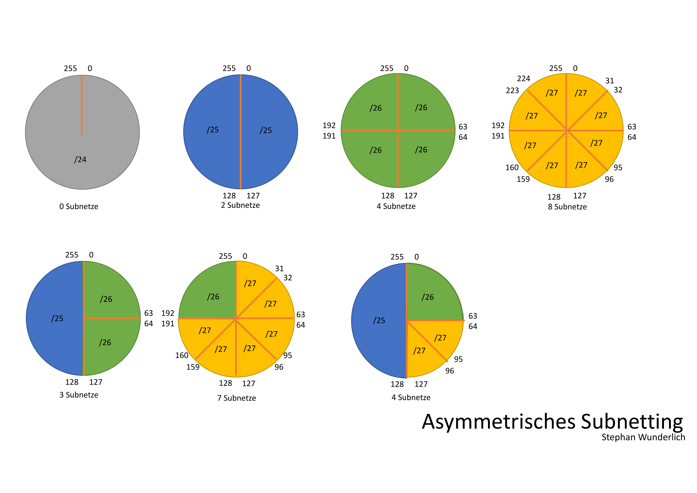

<!-- [28] -->

#### "reverses Subnetting" IPv4 (Anfang und Ende des Subnetzes ermitteln).

=> siehe: Foto "TB_4" als Tafelbild

#### gegeben:

Adresse: 192.168. 1 .130 /27 (CIDR Schreibweise).  
Subnetzmaske: 255.255.255.224 (dezimale Schreibweise).

#### gesucht:

Anfang des Subnetzes, in dem sich diese IP-Adresse befindet.  
Ende des Subnetzes, in dem sich diese IP-Adresse befindet.

#### Lösung:

IP-Adresse umrechnen dezimal => binär:

dezimal: 192 . 168 . 1 . 130  
binär: 11000000.10101000.00000001.10000010

Subnetzmaske umrechnen dezimal => binär oder bei CIDR, 27 Einsen schreiben und den Rest mit Nullen auffüllen:

CIDR: /27  
dezimal: 255 . 255 . 255 . 224  
binär: 11111111.11111111.11111111.11100000  
IP-Adresse und Subnetzmaske untereinander schreiben (binär):  
IP: &ensp;&ensp;&ensp;11000000.10101000.00000001.10000010  
Sub: &ensp; 11111111.11111111.11111111. 11100000  
Ende der "Einsen" aus der Subnetzmaske suchen und senkrechte Linie ziehen:  
IP: 11000000.10101000.00000001.100 | 00010  
Sub: 11111111.11111111.11111111.111 | 00000

<!-- [29] -->

- Anfang des Subnetzes ermitteln:  
  In der IP-Adresse, rechts von der senkrechten Linie, alle bits auf 0 ("null") setzen:  
  IP: 11000000.10101000.00000001.100 | 00000  
  Jedes Oktett für sich binär => dezimal umrechnen:  
  IP: 11000000.10101000.00000001.100 | 00000 (binär)  
  IP: 192 . 168 . 1 . 128 (dezimal)
- Vergleiche das Ergebnis 192.168.1.128 mit dem "Mühlenbecker Wagenrad" auf dem Foto "TB_3".
- Ende des Subnetzes ermitteln:  
  In der IP-Adresse, rechts von der senkrechten Linie, alle bits
  auf 1 ("eins") setzen:  
  IP: 11000000.10101000.00000001.100 | 11111
  Jedes Oktett für sich binär => dezimal umrechnen:  
  IP: 11000000.10101000.00000001.100 | 11111 (binär)  
  IP: 192 . 168 . 1 . 159 (dezimal)
- Vergleiche das Ergebnis 192.168.1.159 mit dem "Mühlenbecker Wagenrad" auf dem Foto "TB_3".  
  Subnetting Class A und Class B:  
  Funktioniert genauso, wie in Class C beschrieben.  
  => Achtung: Dabei bitte nicht die verbleibenden Oktette ("weiter rechts") vergessen!

<!-- [30] -->

#### Subnetzmaske IPv4 analysieren:

=> siehe: Foto "TB_5" als Tafelbild

##### gegeben:

Subnetzmaskee: 255.255.255.224 (dezimale Schreibweise).  
/27 (CIDR Schreibweise).

##### gesucht:

Anzahl der Subnetze.  
Anzahl der Adressen im jeweiligen Subnetz.

##### Lösung:

- Subnetzmaske umrechnen dezimal => binär oder bei CIDR, 27 Einsen schreiben und den Rest mit Nullen auffüllen  
  CIDR: /27  
  dezimal: 255 . 255 . 255 . 224  
  binär: 11111111.11111111.11111111.11100000
- Ende der "Einsen" aus der Standardsubnetzmaske (255.255.255.0 bzw. /24) suchen und senkrechte Linie ziehen:  
  11111111.11111111.11111111 | 11100000
- Ende der "Einsen" aus der gegebenen Subnetzmaske (255.255.255.224 bzw. /27) suchen, senkrechte Linie ziehen und Zahl der "Einsen" und "Nullen" notieren:  
  11111111.11111111.11111111 | 111 | 00000  
  3 5  
  rechne:
  2³ 8 => 8 Subnetze sind entstanden.  
  2⁵ 32 => 32 Adressen pro Subnetz sind vorhanden (- 2) nicht vergessen!  
  vergleiche:
  => siehe: Foto "TB_3"

<!-- [31] -->

### IPv6:

=> siehe: Foto "TB_6" als Tafelbild  

=> siehe: Cisco.jpg als Übersicht der IPv6-Adressen
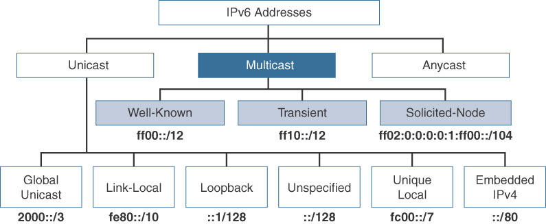

<f>Die IPv6-Adresse ist 128 bit lang.</f>  
Je 4 bit werden hexadezimal als ein <f>"Nibble"</f> dargestellt.  
4 "Nibble" bilden einen <f>"Block"</f>.  
Die "Blöcke" werden durch einen Doppelpunkt <f>:</f> getrennt.  
Somit ergeben sich:

- 128 bit
- 32 Nibble
- 16 Byte (2 Nibble = 8 bit = 1 Byte)
- 8 Blöcke

Die Subnetzmaske wird in CIDR-Schreibweise dargestellt.  
Die Subnetzmaske muss nicht /64 sein, auch andere Werte sind möglich und üblich.

#### kürzen von IPv6-Adressen:

=> siehe: Foto "TB_7" als Tafelbild

Führende "Nullen" (NUR FÜHRENDE!) dürfen weggelassen werden

##### gegeben:

IPv6-Adresse: 2001:0000:0000:000A:0000:0000:0000:0B00

##### gesucht:

Verkürzte Schreibweise der IPv6-Adresse.

##### Lösung:

Somit ergibt sich eine verkürzte Schreibweise der IPv6-Adresse:
2001:0:0:A:0:0:0:B00

<!-- [32] -->

#### weiter verkürzen von IPv6-Adressen:

=> siehe: Foto "TB_7" als Tafelbild

- Einmalig (EINMALIG!) pro IPv6-Adresse darf ein Block,
  der nur aus "Nullen" besteht, durch zwei Doppelpunkte :: ersetzt werden.
- Einmalig (EINMALIG!) pro IPv6-Adresse dürfen auch mehrere aufeinander folgende Blöcke, die nur aus "Nullen" bestehen, durch zwei Doppelpunkte :: ersetzt werden.

##### Beispiel I

###### gegeben:

Verkürzte Schreibweise der IPv6-Adresse:  
2001:0:0:A:0:0:0:B00

###### gesucht:

"Weiter verkürzte" Schreibweise der IPv6-Adresse.

###### Lösung:

Im konkreten Fall ergeben sich 2 Lösungen:

###### Lösung 1 (blaue Variante), die vorderen "Nuller-Blöcke" werden durch :: ersetzt:

2001::A:0:0:0:B00

###### Lösung 2 (rote Variante), die hinteren "Nuller-Blöcke" werden durch :: ersetzt:

2001:0:0:A::B00

Die Lösung 2 (rote Variante) ist zu bevorzugen, da sie effektiver ist.

##### Beispiel 2:

###### gegeben:

IPv6-Adresse: 2001:1234:5678:90AB:0000:0000:0000:0000

###### gesucht:

Verkürzte Schreibweise der IPv6-Adresse.  
"Weiter verkürzte" Schreibweise der IPv6-Adresse.

<!-- [33] -->

###### Lösung:

Führende "Nullen" (NUR FÜHRENDE!) dürfen weggelassen werden:

###### aus:

2001:1234:5678:90AB:0000:0000:0000:0000

###### wird:

2001:1234:5678:90AB:0:0:0:0

Einmalig (EINMALIG!) pro IPv6-Adresse dürfen auch mehrere aufeinander folgende Blöcke, die nur aus "Nullen" bestehen, durch zwei Doppelpunkte :: ersetzt werden.

###### aus:

2001:1234:5678:90AB:0:0:0:0

###### wird:

2001:1234:5678:90AB::

##### Beispiel 3:

###### gegeben:

IPv6-Adresse: 0000:0000:0000:0000:0000:0000:0000:0001

###### gesucht:

Verkürzte Schreibweise der IPv6-Adresse.  
"Weiter verkürzte" Schreibweise der IPv6-Adresse.

###### Lösung:

<!-- [34] -->

Führende "Nullen" (NUR FÜHRENDE!) dürfen weggelassen werden:

###### aus:

0000:0000:0000:0000:0000:0000:0000:0001

###### wird:

0:0:0:0:0:0:0:1

Einmalig (EINMALIG!) pro IPv6-Adresse dürfen auch mehrere aufeinander folgende Blöcke, die nur aus "Nullen" bestehen, durch zwei Doppelpunkte :: ersetzt werden.

###### aus:

0:0:0:0:0:0:0:1

###### wird:

::1

#### folgende IPv6-Adressen sind somit gleichwertig:

##### aus Beispiel I:

2001:0000:0000:000A:0000:0000:0000:0B00  
= 2001:0:0:A:0:0:0:B00  
= 2001::A:0:0:0:B00  
= 2001:0:0:A::B00

##### aus Beispiel II:

2001:1234:5678:90AB:0000:0000:0000:0000  
= 2001:1234:5678:90AB:0:0:0:0  
= 2001:1234:5678:90AB::

##### aus Beispiel III:

0000:0000:0000:0000:0000:0000:0000:0001  
= 0:0:0:0:0:0:0:1  
= ::1

<!-- [35] -->

#### Subnetting IPv6:

benötigte Hilfsmittel:  
Umrechnung hexadezimal => binär.  
Umrechnung binär => hexadezimal.  
----> "Mühlenbecker Pfeil":  
Inoffizielle Darstellung, gilt NUR im BFW-Mühlenbeck!  
Erspart mehrere "F-Böcke" (FFFF) bis zum Ende der Adresse zu schreiben.  
– „ – "Mühlenbecker Gänsefüßchen":  
Inoffizielle Darstellung, gilt NUR im BFW-Mühlenbeck!  
Erspart den immer gleichen Anfangsteil der Adresse zu schreiben.  
Zweierpotenzen:  
2¹ = 2  
2² = 4  
2³ = 8  
2⁴ = 16  
usw.  
Der kleine Exponent gibt an, um wie viele "Einsen" die Subnetzmaske länger wird.  
Die Zahl 2 oder 4 oder 8 oder 16 usw. ist der jeweils mögliche Teilungsfaktor:  
Wir können ein Netz in 2 oder 4 oder 8 oder 16 usw. Subnetze teilen.  
hexadezimale Zeichen (16 Stück)  
0 1 2 3 4 5 6 7 8 9 A B C D E F

<!-- [36] -->

=> siehe: Foto "TB_8" als Tafelbild  

##### gegeben:

Netz: 2001:1234:5678:90AB:: /64  
= 2001:1234:5678:90AB:0000:0000:0000:0000 /64

##### gesucht:

2 Subnetze.  
Anfang und Ende der Subnetze.  
Neue Subnetzmaske für alle Hosts (PCs) in den Subnetzen.

##### Lösung:

Zweierpotenzen aufschreiben, Exponent in ROT!  
Neue Subnetzmaske:  
Der kleine ROTE Exponent der Zweierpotenzen 2¹ = 2 besagt, die neue Subnetzmaske  
(in CIDR-Schreibweise) muss um eine Eins länger werden.
/64 + 1 => /65  
Die erste 0 im ersten "Nuller-Block" als "Joker" betrachten.  
Die "Joker" 0 steht stellvertretend für alle hexadezimalen Zeichen (16 Stück):  
0 1 2 3 4 5 6 7 8 9 A B C D E F

##### Rechnung:

16 hexadezimalen Zeichen : 2 = 8  
Subnetz 1 beginnt bei 0 und endet bei 7  
Subnetz 2 beginnt bei 8 und endet bei F

<!-- [37] -->

Subnetze aufschreiben:  
Subnetz 1 beginnt bei: 2001:1234:5678:90AB:0000:0000:0000:0000 /65  
Subnetz 1 endet bei: 2001:1234:5678:90AB:7FFF:FFFF:FFFF:FFFF /65  
Subnetz 2 beginnt bei: 2001:1234:5678:90AB:8000:0000:0000:0000 /65  
Subnetz 2 endet bei: 2001:1234:5678:90AB:FFFF:FFFF:FFFF:FFFF /65  
Subnetze aufschreiben "Mühlenbecker Art":  
Subnetz 1 beginnt bei: 2001:1234:5678:90AB:0000:: /65  
Subnetz 1 endet bei: – „ – :7FFF:----> /65  
Subnetz 2 beginnt bei: – „ – :8000:: /65  
Subnetz 2 endet bei: – „ – :FFFF:----> /65

<!-- [38] -->

=> siehe: Foto "TB_9" als Tafelbild  

##### gegeben:

Netz: 2001:1234:5678:90AB:: /64  
= 2001:1234:5678:90AB:0000:0000:0000:0000 /64

##### gesucht:

4 Subnetze.  
Anfang und Ende der Subnetze  
Neue Subnetzmaske für alle Hosts (PCs) in den Subnetzen.

##### Lösung:

Zweierpotenzen aufschreiben, Exponent in ROT!  
Neue Subnetzmaske:  
Der kleine ROTE Exponent der Zweierpotenzen 2² = 4 besagt, die neue Subnetzmaske  
(in CIDR-Schreibweise) muss um 2 Einsen länger werden.
/64 + 2 => /66  
Die erste 0 im ersten "Nuller-Block" als "Joker" betrachten.  
Die "Joker" 0 steht stellvertretend für alle hexadezimalen Zeichen (16 Stück):  
0 1 2 3 4 5 6 7 8 9 A B C D E F

##### Rechnung:

16 hexadezimalen Zeichen : 4 = 4  
Subnetz 1 beginnt bei 0 und endet bei 3  
Subnetz 2 beginnt bei 4 und endet bei 7  
Subnetz 3 beginnt bei 8 und endet bei B  
Subnetz 4 beginnt bei C und endet bei F

<!-- [39] -->

###### Subnetze aufschreiben:

Subnetz 1 beginnt bei:  
2001:1234:5678:90AB:0000:0000:0000:0000 /66

Subnetz 1 endet bei:  
2001:1234:5678:90AB:3FFF:FFFF:FFFF:FFFF /66

Subnetz 2 beginnt bei:  
2001:1234:5678:90AB:4000:0000:0000:0000 /66

Subnetz 2 endet bei:  
2001:1234:5678:90AB:7FFF:FFFF:FFFF:FFFF /66

Subnetz 3 beginnt bei:  
2001:1234:5678:90AB:8000:0000:0000:0000 /66

Subnetz 3 endet bei:  
2001:1234:5678:90AB:BFFF:FFFF:FFFF:FFFF /66

Subnetz 4 beginnt bei:  
2001:1234:5678:90AB:C000:0000:0000:0000 /66

Subnetz 4 endet bei:  
2001:1234:5678:90AB:FFFF:FFFF:FFFF:FFFF /66

Subnetze aufschreiben "Mühlenbecker Art":  
Subnetz 1 beginnt bei: 2001:1234:5678:90AB:0000:: /66  
Subnetz 1 endet bei: – „ – :3FFF:----> /66  
Subnetz 2 beginnt bei: – „ – :4000:: /66  
Subnetz 2 endet bei: – „ – :7FFF:----> /66  
Subnetz 3 beginnt bei: – „ – :8000:: /66  
Subnetz 3 endet bei: – „ – :BFFF:----> /66  
Subnetz 4 beginnt bei: – „ – :C000:: /66  
Subnetz 4 endet bei: – „ – :FFFF:----> /66

<!-- [40] 17 02 2023-->

#### "Reverses Subnetting" IPv6 (Anfang und Ende des Subnetzes ermitteln):

##### gegeben:

Adresse: 2001:1234:5678:90AB:CDEF:1A2B:3C4D:5E6F  
Subnetzmaske: /74

##### gesucht:

Anfang des Subnetzes, in dem sich diese IP-Adresse befindet.  
Ende des Subnetzes in, dem sich diese IP-Adresse befindet.

##### Lösung:

Die Stelle in der Adresse suchen, in der sich das 74. bit befindet:  
1 Block = 16 bit  
Block 5 beinhaltet die bits 65 bis 80:  
/16 /32 /48 /64 /80 /96 /112 /128  
2001 : 1234 : 5678 : 90AB : CDEF : 1A2B : 3C4D : 5E6F  
Den Block 5 "zerlegen" (hexadezimal => binär):  
2001 : 1234 : 5678 : 90AB : **CDEF** : 1A2B : 3C4D : 5E6F  
CDEF = 1100 1101 1110 1111

Die 74. bit abzählen (64 + 10) und senkrechte Linie ziehen:

2001 |1234 | 5678 | 90AB |CDEF | 1A2B | 3C4D | 5E6F |

             1100 1101 11  | 10 1111

<!-- [41] -->

Anfang des Subnetzes ermitteln (soweit wie möglich in Richtung hexadezimale 0):  
Alle bits nach dem 74. bit (rechts von der senkrechten Linie) auf 0 ("null") setzen:  
1100 1101 11 | 00 0000  
Jedes Nibble für sich binär => hexadezimal umrechnen:  
1100 1101 11 | 00 0000  
 &nbsp;&nbsp;C &nbsp;&nbsp;&nbsp; &nbsp; D &nbsp;&nbsp; &nbsp;&nbsp; C &nbsp;&nbsp;&nbsp; &nbsp; 0  
Adresse wieder vollständig aufschreiben und dabei an die restlichen Blöcke denken, die jetzt zu "Nuller-Blöcken" geworden sind:  
2001:1234:5678:90AB:CDC0 :0000:0000:0000  
= 2001:1234:5678:90AB:CDC0::  
Ende des Subnetzes ermitteln (soweit wie möglich in Richtung hexadezimales F):  
Alle bits nach dem 74. bit (rechts von der senkrechten Linie) auf 1 ("eins") setzen:  
1100 1101 11 | 11 1111  
Jedes Nibble für sich binär => hexadezimal umrechnen:  
 1100 1101 11 | 11 1111  
 &nbsp;&nbsp; &nbsp;&nbsp;C &nbsp;&nbsp;&nbsp;&nbsp;D &nbsp;&nbsp; &nbsp;&nbsp;F &nbsp;&nbsp;&nbsp;&nbsp;F  
Adresse wieder vollständig aufschreiben und dabei an die restlichen Blöcke denken, die jetzt zu "FFFF-Blöcken" geworden sind:  
offizielle Schreibweise:  
2001:1234:5678:90AB:CDFF:FFFF:FFFF:FFFF  
nach "Mühlenbecker Art":  
2001:1234:5678:90AB:CDFF:FFFF:---->

<!-- [42] -->

#### Besondere IPv6-Adressen (Auszug):

[🔗de.wikipedia.org/wiki/IPv6](de.wikipedia.org/wiki/IPv6)  
[🔗heise.de/IPv6-Adressen-3484199.html](heise.de/IPv6-Adressen-3484199.html)

##### Nicht spezifizierte IPv6-Adresse

0000:0000:0000:0000:0000:0000:0000:0000  
= 0:0:0:0:0:0:0:0  
= ::  
entspricht der IPv4-Adresse:  
0.0.0.0

##### localhost oder auch loopback-Adresse

0000:0000:0000:0000:0000:0000:0000:0001  
= **::1**  
entspricht der IPv4-Adresse: 127.0.0.1

##### Global Unicast:

**2000:: /3**  
geht von:  
2000:0000:0000:0000:0000:0000:0000:0000 /3
bis:
3FFF:FFFF:FFFF:FFFF:FFFF:FFFF:FFFF:FFFF /3  
nach "Mühlenbecker Art":
3FFF:FFFF:----> /3  
Im Internet gültige Adressen.

<!-- [43] -->

##### Unique Local Unicast:

**FC00:: /7**  
geht von:  
FC00:0000:0000:0000:0000:0000:0000:0000 /7  
bis:  
FDFF:FFFF:FFFF:FFFF:FFFF:FFFF:FFFF:FFFF /7  
nach "Mühlenbecker Art":  
FDFF:FFFF:----> /7  
Private IPv6-Adressen.  
Dürfen das Unternehmensnetz nicht verlassen.
Sind nicht im Internet gültig.
=> siehe: private IPv4-Adressen.

##### Link Local Unicast:

**FE80:: /10**  
geht von:  
FE80:0000:0000:0000:0000:0000:0000:0000 /10  
bis:  
FEBF: FFFF:FFFF:FFFF:FFFF:FFFF:FFFF:FFFF /10  
nach "Mühlenbecker Art":  
FEBF:FFFF:----> /10  
zur Zeit genutzt (Festlegung):  
von FE80:: bis FE80::FFFF:FFFF:FFFF:FFFF /10  
Werden genutzt für:

- Autokonfiguration.
- Neighbor-Discovery.

Dürfen das Netzsegment nicht verlassen.
Es gibt keine vergleichbare IPv4-Adresse (erinnert ein wenig an IPv4 APIPA[^1]).

<!-- [44] -->

##### Multicast:

[🔗de.wikipedia.org/wiki/Multicast](de.wikipedia.org/wiki/Multicast)  
**FF00:: /8**  
(F F X Y:: /8)  
geht theoretisch von:  
FF00:0000:0000:0000:0000:0000:0000:0000 /8  
bis theoretisch:  
FFFF:FFFF:FFFF:FFFF:FFFF:FFFF: FFFF:FFFF /8  
nach "Mühlenbecker Art" theoretisch:  
FFFF:FFFF:----> /8  
Besonderheiten:  
Ersatz für IPv4-Broadcast.  
Bedeutung des "X" nach FF:  
4 bits für Flags (Zustandsanzeigen).  
Bedeutung des "Y" nach FFX:  
4 bits für den Gültigkeitsbereich (bis wohin gilt dieser Multicast).

<!-- [45] -->

### Vergleich der Header von IPv4 und IPv6:

=> siehe: Westermann Seite 582

#### IPv4 Header

##### Variable Länge

Header-Länge = Wert in Feld (2) \* 32 bit  
In der Darstellung auf Seite 314:  
Wert in Feld (2) => je eine Zeile.  
Sollte ein "Universal"-Header werden (wie ein behördlicher Universalvordruck):  
Viele Optionen standardmäßig schon im Header vorhanden.

##### TTL

=> siehe: im Verzeichnis Filius/Filius\*8_Traceroute.fls  
Um weitere Optionen erweiterbar.  
Header hat eine Prüfsumme

#### IPv6 Header

Konstante Länge.  
Kein "Universal"-Header:

- Um weitere Optionen durch "Extension"-Header erweiterbar (siehe "Next Header").
- Vergleichbar mit einer "Anlage" bei der Steuererklärung.

Header hat KEINE Prüfsumme => ein Schelm, wer Böses dabei denkt.  
Hat ein neues Feld "Traffic Class" => Priorisierung:

- Welchen Vorrang hat das Datenpaket.
- geht von: binär 00000000 => "wenn mal Zeit ist"
- bis: binär 11111111 => "Blaulicht mit Martinshorn"

Hat ein neues Feld "Flow Label":

- Alle Datenpakete, die zu einer Sitzung gehören (z.B. VoIP), bekommen das gleiche Label.
- Super um zu Sniffen => alle zusammengehörigen Datenpakete haben das gleiche Label.
<!-- [46] -->

### DHCP

=> siehe: Foto "TB_11" als Tafelbild

| &nbsp;                           | &nbsp;                                           |
| -------------------------------- | ------------------------------------------------ |
|  | 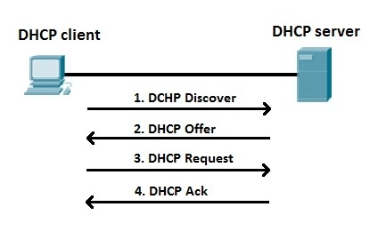 |

=> siehe: (im „10-er Netz“) im Verzeichnis Filius/Filius_9_DHCP.fls  
=> siehe: (im „10-er Netz“) Netz“ im Verzeichnis Filius/Filius_10_DHCP_statisch.fls  
=> siehe: (im „10-er Netz“) im Verzeichnis Filius/Filius_11_DHCP_Konflikt.fls  
=> siehe: Westermann Seite 595

[🔗de.wikipedia.org/wiki?Dynamic_Host_Configuration_Protocol](de.wikipedia.org/wiki?Dynamic_Host_Configuration_Protocol)

Eine Lösung, um PCs automatisch folgende Informationen zu geben (Auszug):

- IP-Adresse
- Subnetzmaske
- Standard-Gateway
- DNS-Server 1
- DNS-Server 2
- Lease-Time (Gültigkeitsdauer dieser Angaben)

#### Stellvertretend an IPv4 erklärt:

##### DHCP-Client startet "Discover":

- Quell-IP: 0.0.0.0 ("ich weiß nicht, wer ich bin").
- Ziel-IP: 255.255.255.255 ("Mega-Broadcast", Hilferuf an Jeden).

##### DHCP-Server unterbreitet ein "Offer" (ein Angebot)

- Quell-IP: IP des DHCP-Servers (im Tafelbild: 192.168.1.11).
- Ziel-IP: die zukünftige IP, die der Client erhalten soll (im Tafelbild: 192.168.1.101),
  aus dem DHCP-Pool (DHCP-Vorrat, DHCP-Bereich, im Tafelbild: 192.168.1.101 … 192.168.1.130).
- weitere Informationen (Auszug):
  - Subnetzmaske
  - Standard-Gateway
  - DNS-Server
  - Lease-Time
  <!-- [47] -->

##### DHCP-Client antwortet mit "Request":

- Quell-IP wieder: 0.0.0.0
- Ziel-IP wieder: 255.255.255.255
- weitere Informationen:
  - Nehme "Offer" (Angebot) an.

##### DHCP-Server sendet ein "ACK" (eine Bestätigung)

- Quell-IP: IP des DHCP-Servers (im Tafelbild: 192.168.1.11).
- Ziel-IP: die zukünftige IP, die der Client erhalten soll (im Tafelbild: 192.168.1.101),
  aus dem DHCP-Pool (DHCP-Vorrat, DHCP-Bereich, im Tafelbild: 192.168.1.101 … 192.168.1.130).
- weitere Informationen nochmals:
  - Subnetzmaske
  - Standard-Gateway
  - DNS-Server 1
  - DNS-Server 2
  - Lease-Time
- Ab jetzt läuft die Lease-Time.

Die Anfangsbuchstaben der 4 "Pfeile" (Discover, Offer, Request, ACK) ergeben den weiblichen Vornahmen "DORA".  
4 "Pfeile" => 4 Datenpakete sind für DHCP nötig:  
4-Wege-Handshake-Verfahren.

##### Tipps zu DHCP:

- Statische Hosts (Server, Drucker, PCs) bekommen statische IPs: Viel einfachere Fehlersuche!
- Flexible Hosts (Laptops der Außendienstmitarbeiter) werden auf DHCP gestellt.
<!-- [48] -->

### Namensauflösung:

[🔗https://de.wikipedia.org/wiki/Domain\_(Internet)#Fully_Qualified_Domain_Name\_(FQDN)](<de.wikipedia.org/wiki/Domain_(Internet)#Fully_Qualified_Domain_Name_(FQDN)>)

#### Warum Namensauflösung:

Der Host (Computer, Server) hat einen Namen (einen Namen können sich Menschen oft gut merken)  
 => wie lautet die IP-Adresse des Hosts (IP-Adressen kann man sich häufig schlechter merken)?

Beispiel:

www.heise.de  
Address: 193.99.144.85 <= IPv4-Adresse  
Address: 2a02:2e0:3fe&:1001:7777:772e:2:85 <= IPv6-Adresse  
Ein Host (Computer, Server) hat IMMER einen Netbios-Namen.  
Ein Host (Computer, Server) hat OPTIONAL einen DNS-Namen (FQDN[^2]).

[^2]: FQDN Fully_Qualified_Domain_Name

#### Netbios-Name:

- NICHT für Anfragen aus dem Internet zu gebrauchen, nur für das interne Netz (Broadcastdomain).
- Maximal 15 vergebbare Zeichen.
- Bitte nur folgende Zeichen verwenden:
  - a...z
  - A...Z
  - 0...9
- (Minuszeichen)

##### Beispiel:

Server-1

##### Namensauflösung (Netbios-Name => IP-Adresse)

Broadcast ("Wer von euch ist Server-1, ich brauche deine IP-Adresse").  
Datei <f>lmhosts"</f> abfragen (völlig veraltet).  
Dienst <f>"WINS"</f> abfragen (völlig veraltet).

<!-- [49] -->

#### DNS-Name ( FQDN[^2]):

=> siehe: Westermann Seite 595  
=> siehe: im Verzeichnis Filius/Filius_12_DNS.fls  
=> siehe: im Verzeichnis Filius/ Filius_13_DNS_komplex.fls

- Wird gebraucht, wenn der Host (Computer, Server) aus dem Internet oder außerhalb der Broadcastdomain erreichbar sein soll.
- Wird gebraucht, wenn eine Windows-Domäne aufgebaut werden soll.
- Maximal 255 vergebbare Zeichen, nach 63 Zeichen muss ein . (Punkt) gesetzt werden.
- Bitte nur das englische Alphabet verwenden (kann sonst zu Problemen kommen, wie soll jemand, deutsche
  Umlaute eingeben, der ä, ö, ü, ß nicht auf seiner Tastatur hat).

#### Praktische Lösung:

##### Für externe Namensauflösung (Zugriff aus dem Internet):

- Domain registrieren (z.B. bfw-berlin-brandenburg.de).
- Dem Server einen Netbios-Namen geben (z.B. Server-1).
- Netbios-Name und Domain verbinden:
  - Server-1.bfw-berlin-brandenburg.de
  - Da niemand im Internet wissen kann, wie der Netbios-Name des Servers lautet, wird der
    "Alias" www verwendet. Somit ist der Server aus dem Internet erreichbar unter:
  - www.bfw-berlin-brandenburg.de

##### Für interne Namensauflösung (ohne Zugriff aus dem Internet):

- Domain ausdenken (z.B. itm.bfw).
- Dem Server einen sinnvollen Netbios-Namen geben (z.B. proxy).
- Netbios-Name und Domain verbinden:
  - proxy.itm.bfw
  - Somit ist der Server aus dem lokalen Netz erreichbar unter:
  - proxy.itm.bfw
  <!-- [50] -->

### Routing:

=> siehe: Foto "TB_12" als Tafelbild

=> siehe: Westermann Seite 603

Unterschieden wird grundsätzlich:

#### Dynamisches Routing (denke an Navi im Auto):

##### Kürzeste Strecke (egal wie schnell)

=> siehe Protokoll RIP[^3].

[^3]: RIP Routing Information Protocol für IP-Netze, das zur Klasse der Distance-Vector-Protokolle gehört. Es kommt als Interior Gateway Protocol (IGP) in kleineren Netzwerken zum Einsatz und zeichnet sich durch eine einfache Implementierung aus. Nachteile sind die relative langsame Aktualisierung bei Veränderungen im Netz und die fehlende Garantie einer Schleifenfreiheit.

=> siehe: im Verzeichnis Filius/Filius_14_RIP.fls

##### Schnellste Strecke (egal wie weit)

=> siehe Protokoll BGP[^4] Border Gateway Protocol  
=> siehe Protokoll ospf[^5] Open Shortest Path First

[^4]: BGP Border Gateway Protocol refers to a gateway protocol that enables the internet to exchange routing information between autonomous systems (AS). As networks interact with each other, they need a way to communicate. This is accomplished through peering. BGP makes peering possible.
[^5]: ospf Open Shortest Path First is a routing protocol for Internet Protocol networks. It uses a link state routing algorithm and falls into the group of interior gateway protocols, operating within a single autonomous system

#### Statische Routing ("ich kenne die Strecke und fahre immer dort entlang")

Im Tafelbild 12 zu sehen:

- Standard-Gateway: 192.168.1.1

  - Alle Datenpakete, die nicht zum eigenen Netz gehören, werden an diese Adresse
    geschickt.

  - Niemand würde das Netz 192.168.2.0 oder den Computer 192.168.2.202 erreichen können.

- Lösung (eigene, feste Einträge für die Erreichbarkeit des ganzen Netzes):
  - "**Netrouting**" 192.168.2.0 (Syntax unter Windows):  
    => siehe: im Verzeichnis Filius/Filius_15_Net_Routing.fls  
    "route add 192.168.2.0 mask 255.255.255.0 192.168.1.2"  
    <f>Menschlich ausgedrückt:</f> - Wenn du ein Datenpaket für irgendjemanden im Netz 192.168.2.0 hast, dann übergebe es dem Router 192.168.1.2.
    - Beim "Netrouting" verlangt die Syntax die Angabe des Netzes mit der 0 "Null" am
      Ende und eine "normale" Subnetzmaske (255.255.255.0).
  - "**Hostrouting**" 192.168.2.202 (Syntax unter Windows):  
    => siehe: im Verzeichnis Filius/Filius_16_Host_Routing.fls
    "route add 192.168.2.202 mask 255.255.255.255 192.168.1.2"  
    <f>Menschlich ausgedrückt:</f>
  - Wenn du ein Datenpaket ausschließlich für den Host 192.168.2.202 hast,
  dann übergebe es dem Router 192.168.1.2 - Beim "Hostrouting" verlangt die Syntax die Angabe des Hosts (PCs) mit der
  konkreten IP-Adresse am Ende und einer "speziellen" Subnetzmaske
  (255.255.255.255). - Gäbe es in diesem Beispiel noch einen anderen Host (z.B. 192.168.2.222),
  müsste auch für diesen Host ein neues, eigenes Hostrouting erfolgen:  
   "route add 192.168.2.222 mask 255.255.255.255 192.168.1.2"
  <!-- [52] -->

## J. Schicht 4:

### Themen aus Schicht 4:

- Ports
- TCP:
  - Verbindungsaufbau
  - Verbindungsabbau
  - Sliding Window
  - TCP-Header
- UDP:
  - UDP-Header
- Portknocking
- Portforwarding / Destination NAT
- NAT (PAT) / Source NAT
- Black- und Whitelist (Block- und Allowlist)
<!-- [53] -->

### Ports:

[🔗LINK : service-names-port-numbers](iana.org/assignments/service-names-port-numbers/service-names-port-numbers.txt)

- Ports werden von TCP und UDP genutzt.  
  => siehe: Westermann Seite 590:

Ports befinden sich zwischen der Schicht 4 (TCP bzw. UDP) und den Anwendungsschichten 5 bis 7.

Denke an den Abfluss eines Waschbeckens:
Normalerweise läuft das Wasser von der Anwendung (Hände waschen) in das darunter liegende System ab.

Bekanntlich kann es auch passieren, dass das Wasser von unten in das Waschbecken
zurück gedrückt wird (nicht wirklich angenehm).

**Warum Ports:**  
=> siehe: im Verzeichnis Filius/Filius_17_PC_Server_Dienste_10.fls

Die IP-Adresse (z.B. 192.168.1.11) definiert nur den Host (PC, Server).  
Auf einem PC laufen häufig gleichzeitig mehrere netzwerkfähige Programme (z.B. Mail-Client und Webbrowser oder Webbrowser mit mehreren geöffneten Tabs).

Auf einem Server (gemeint ist die Serverhardware) werden oft gleichzeitig mehrere Dienste angeboten (z.B. Webserver, DHCP-Server, File-Server).

Diese Dienste müssen unterschieden werden können, dafür werden **Ports** genutzt.
Anders ausgedrückt:

Die postalische Adresse eines Mehrfamilienhauses (IP-Adresse) reicht nicht aus, soll das Paket an Meier oder Lehmann oder Schulze (**Ports**) ausgeliefert werden?

<!-- [54] -->

#### Schreibweise von IP-Adresse und Port:

##### IP-Adresse:Port

###### Beispiel:

192.168.1.11:80  
Auf dem Server mit der IP-Adresse 192.168.1.11 wird der Dienst "Webserver" auf Port 80 angesprochen.

==>> Die Kombination aus IP-Adresse und Port wird "**Socket**" genannt.

#### Anzahl und Aufteilung der Ports:

##### "System Ports" (früher "well known ports" genannt):

| Beginn: | Ende      |
| ------- | --------- |
| Port 0  | Port 1023 |

###### Ports aus diesem Bereich sind "unantastbar".

Denke an Nummernschilder von Fahrzeugen wie "Y", "THW", "BP".

- Ports, die man kennen sollte:
  - Port 20, 21 => ftp
  - Port 22 => ssh
  - Port 25 => SMTP
  - Port 53 => DNS
  - Port 67, 68 => DHCP
  - Port 80 => http
  - Port 110 => POP3
  - Port 443 => https
  <!-- [55] -->

##### "User Ports" (früher "registred ports" genannt):

| Beginn:   | Ende       |
| --------- | ---------- |
| Port 1024 | Port 49151 |

1011111111111111

Firmen haben sich aus diesem Bereich Ports für ihre Softwareprodukte "registrieren" lassen.

Denke an Standard-Nummernschilder von privaten Fahrzeugen.

- Ports, die man eventuell kennt:
  - Port 3128 => squid-proxy
  - Port 9100 => HP-Standard-Druckerport
  - Port 20000 => Webmin

##### "Dynamic/Private Ports" (hier gab es keine Änderung der Bezeichnung):

| Beginn:    | Ende       |
| ---------- | ---------- |
| Port 49152 | Port 65535 |

Diese Ports sind keiner Software fest zugeordnet.
Diese Ports können nur kurzfristig (temporär) verwendet werden.
Denke an Nummernschilder für eine Tageszulassung oder an ein Überführungskennzeichen.

<!-- [56] -->

### TCP:

[🔗LINK: TCP](de.wikipedia.org/wiki/Transmission_Control_Protocol)

#### Eigenschaften:

##### Verbindungsorientiert:

Arbeitet mit einem geordneten VerbindungsAUFbau.  
Die Daten werden kontrolliert übertragen (mit Rückmeldung).  
Arbeitet mit einem geordneten VerbindungsABbau.  
==>> Denke an ein "gepflegtes" Telefonat.

Bietet eine hohe Sicherheit, dass die Daten vollständig übertragen werden.
Langsamer als UDP.

Ist als fester "Algorithmus" zu betrachten  
=> nur wenige Eingriffs- und Steuermöglichkeiten.  
==>> Denke an ein "Einschreiben mit Rückschein".

#### VerbindungsAUFbau am Beispiel Client und Server:

##### Client => Server:

Client sendet an den Server seine Zufallszahl (z.B. 1000) und setzt das SYN-Flag

###### ich möchte mich mit dir synchronisieren

##### Server => Client:

Server sendet die Zufallszahl des Clients um 1 erhöht (1001) zurück und setzt das ACK-Flag.
Gleichzeitig sendet der Server seine Zufallszahl (z.B. 2000) und setzt das SYN-Flag

###### auch ich möchte mich mit dir synchronisieren

##### Client => Server:

Client sendet die Zufallszahl des Servers um 1 erhöht (2001) zurück und setzt das ACK-Flag.

###### :)

##### Die Verbindung wurde AUFgebaut.

##### 3 "Pfeile" => 3 Datenpakete sind für den VerbindungsAUFbau nötig:

3-Wege-Handshake-Verfahren.

<!-- [57] -->

ACHTUNG: DDoS-Attacke möglich!

[🔗DDoS](de.wikipedia.org/wiki/Denial_of_Service)

[🔗SYN-Flood](de.wikipedia.org/wiki/SYN-Flood)

#### Kontrollierte Datenübertragung:

[🔗](https://www.youtube.com/watch?v=c5qqPo5v3-U)

[🔗LINK: Medieninformatik - Kommunikationsnetze - Schiebefenster-Mechanismus - 04](youtube.com/watch?v=c5qqPo5v3-U)  
Eine bessere Erklärung ist kaum zu finden.

#### VerbindungsABbau am Beispiel Client und Server:

##### Client => Server:

Client sendet an den Server ein FIN-Flag

###### ich möchte die Verbindung beenden.

##### Server => Client:

Server sendet an den Client ein ACK-Flag

###### ok, einverstanden.

##### Server => Client:

Server sendet an den Client auch ein FIN-Flag

###### auch ich möchte die Verbindung beenden.

##### Client => Server:

Client sendet an den Server auch ein ACK-Flag

###### ok, auch einverstanden.

##### Die Verbindung wurde ABgebaut.

4 "Pfeile" => 4 Datenpakete sind für den VerbindungsABbau nötig:  
4-Wege-Handshake-Verfahren.

#### TCP-Header:

=> siehe: Westermann Seite 581
[🔗de.wikipedia.org/wiki/Transmission_Control_Protocol#Aufbau_des_TCP-Headers](de.wikipedia.org/wiki/Transmission_Control_Protocol#Aufbau_des_TCP-Headers)

<!-- [58] -->

### UDP:

[🔗LINK UDP: de.wikipedia.org/wiki/User_Datagram_Protocol](de.wikipedia.org/wiki/User_Datagram_Protocol)

#### Eigenschaften:

##### Verbindungslos:

- Arbeitet **ohne VerbindungsAUFbau**.
- Die Daten werden unkontrolliert übertragen (keine Rückmeldung).
- Arbeitet ohne VerbindungsABbau.
- Bietet keine Sicherheit, dass die Daten vollständig übertragen werden.
- Schneller als TCP.
- 1 zu 1 Verbindung (wie bei TCP) ist möglich.
- 1 zu N Verbindungen sind möglich (Multicast, Broadcast).
- Ist als "leere Hülle" zu betrachten => viele Möglichkeiten für eigene Algorithmen sind möglich.
- Eine "Spielwiese" für Programmierer.
  ==>> Denke an eine "Postkarte".

<!-- [59] -->

### Portknocking:

=> siehe: Foto "TB_15" als Tafelbild als Beispiel.

"richtiges Anklopfen" aus dem externen Netz, löst ein Ereignis im internen Netz aus.

#### Funktionsbeschreibung:

- Die "FritzBox" (FB) hat vom ISP eine externe IP-Adresse (11.1.2.4) erhalten, über die sie auch aus dem Internet erreichbar ist.
- Auf der FritzBox wurde Portknocking aktiviert.
- Auf der FritzBox wurde eine Tabelle mit 3 Sockets erstellt:

  1.)  
  externe IP-Adresse und erster willkürlicher Port (11.1.2.4:1111)

  2.)  
  externe IP-Adresse und zweiter willkürlicher Port (11.1.2.4:2222)

  3.)  
  externe IP-Adresse und dritter willkürlicher Port (11.1.2.4:3333)

Auf der FritzBox wurde ein Ereignis definiert, das ausgelöst wird, wenn die 3 Sockets in der richtigen
Reihenfolge 1 - 2 - 3 angesprochen werden.

Hier im Beispiel Wake on LAN (WoL):  
[🔗Wake_On_LAN](de.wikipedia.org/wiki/Wake_On_LAN)  
Sendet das Laptop aus dem Internet 3 Datenpakete in der richtigen Reihenfolge:

(1) beinhaltet 11.1.2.4:1111  
(2) beinhaltet 11.1.2.4:2222  
(3) beinhaltet 11.1.2.4:3333  
wird WoL ausgelöst.

Der interne Webserver (192.168.178.11) wird gebootet.

<!-- [60] -->

### Portforwarding / Destination NAT:

=> siehe: Foto "TB_16" als Tafelbild als Beispiel.

[🔗de.wikipedia.org/wiki/Netzwerkadress%C3%Bcbersetzung](https://de.wikipedia.org/wiki/Netzwerkadress%C3%Bcbersetzung)

#### Zielsetzung

Weiterleitung von Anfragen aus dem externen Netz (Internet) in das interne, private Netz.

#### Begriffe

Aus der Unix-Welt stammt der Begriff "Destination NAT" (sinngemäß: Übersetzung am Ziel).

#### Funktionsbeschreibung

Die "FritzBox" (FB) hat vom ISP eine externe IP-Adresse (11.1.2.4) erhalten, über die sie auch
aus dem Internet erreichbar ist.

Aus dem Internet soll ein Laptop von extern auf interne Geräte zugreifen können.

Im internen Netz existieren 2 WebCams, die von extern erreichbar sein sollen:

WebCam 1:  
IP-Adresse: 192.168.178.21  
Port: 80

WebCam 2:  
IP-Adresse: 192.168.178.22  
Port: 80

Auf der FritzBox wurde <f>Portforwarding</f> aktiviert.

Auf der FritzBox wurden 2 willkürliche, externe Ports gewählt (8080 und 8081).

Auf der FritzBox wurde eine Tabelle mit 2 Einträgen erstellt:

(1) 11.1.2.4:8080 => 192.168.178.21:80  
(2) 11.1.2.4:8081 => 192.168.178.22:80

==>> Die externe IP-Adresse muss immer gleich sein, nur die willkürlichen, externen Ports
dienen der Unterscheidung, welches interne Gerät angesprochen werden soll.

<!-- [61] -->

- Greift das Laptop mit (1) von extern auf die externe IP-Adresse 11.1.2.4 und den
  willkürlichen, externen Port 8080 zu, wird die Anfrage nach intern auf die IP-Adresse 192.168.178.21 und den Port 80 (WebCam 1) weitergeleitet.

- Greift das Laptop mit (2) von extern auf die externe IP-Adresse 11.1.2.4 und den
  willkürlichen, externen Port 8081 zu, wird die Anfrage nach intern auf die IP-Adresse 192.168.178.22 und den Port 80 (WebCam 2) weitergeleitet.

<f>Portforwarding</f> ist nicht sehr sicher.
Von extern wird ein Zugang zum internen Netz geschaffen  
=> kann zum Problem werden.
Portforwarding kann mit Portknocking und WoL (siehe oben) kombiniert werden,
("TB_15" + "TB_16"):

| TB_15                      | TB_16                      |
| -------------------------- | -------------------------- |
| 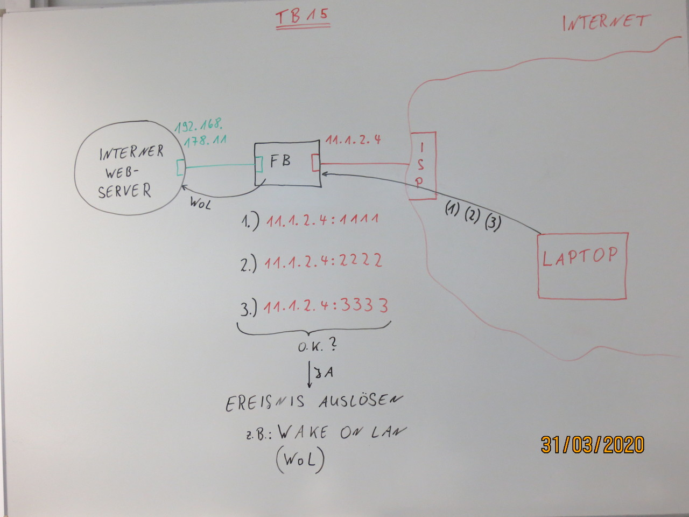 | 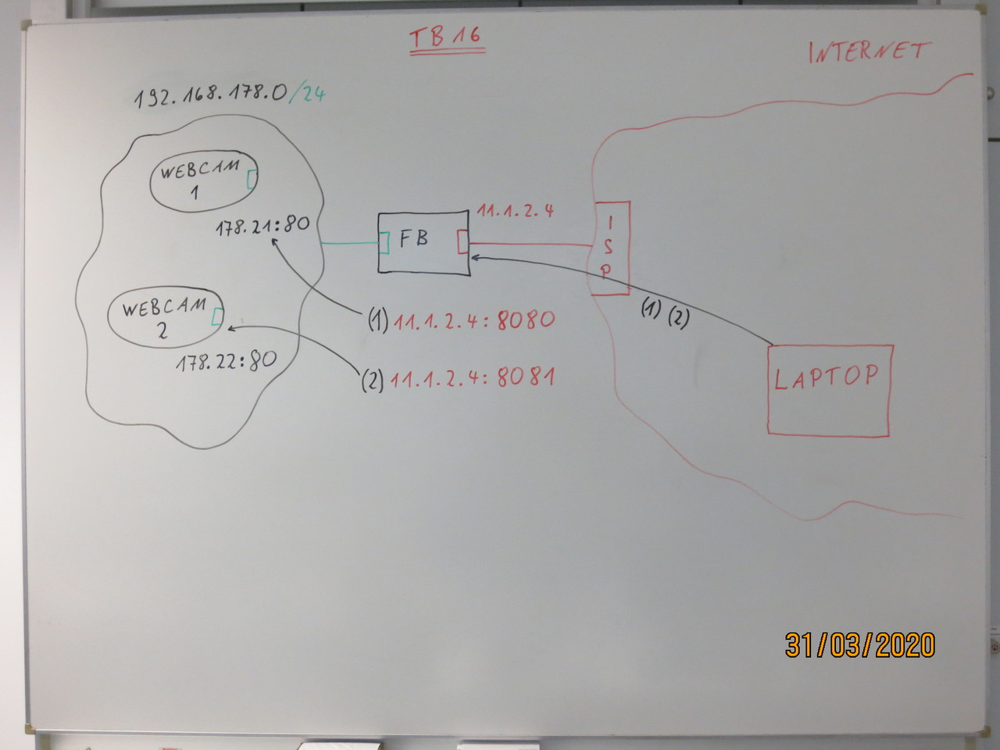 |

Portknocking => Ereignis auslösen (WoL).  
WoL => interner Webserver bootet.  
Portforwarding => Zugriff auf den internen Webserver ("poweroff" zum Schluss nicht vergessen).

<!-- [62] -->

### NAT(PAT) / Source NAT

=> siehe: Foto "TB_13" als Tafelbild, hier nur als Beispiel.

[🔗de.wikipedia.org/wiki/Port_Address_Translation](de.wikipedia.org/wiki/Port_Address_Translation)

#### Zielsetzung:

Weiterleitung von Anfragen aus dem internen, privaten Netz in das externe Netz (Internet).

#### Begriffe:

==>> Dieser Mechanismus heißt eigentlich <f>PAT</f>, aber umgangssprachlich wird von <f>NAT</f> gesprochen.  
Leider ist dieses Problem auch schon in den IHK-Prüfungen aufgetaucht!  
Aus der Unix-Welt stammt der Begriff "Source NAT" (sinngemäß: Übersetzung an der Quelle)
Funktionsbeschreibung:  
Die "FritzBox" (FB) hat vom ISP eine externe IP-Adresse (11.1.2.4) erhalten, mit der sie ins Internet "gehen" kann.  
Die FB hat eine dynamische Tabelle mit 3 Spalten:

##### 1. Spalte "Fake-Port":

Ports aus dem Bereich der "Dynamic/Private Ports" (siehe oben).

##### 2. Spalte "Quell-Socket":

Für die Anfragen, von den internen Hosts.
Hier im Beispiel für PC1 und PC2.

##### 3. Spalte "Ziel-Socket":

Für die Anfragen, welche Webseiten sollen von der FritzBox für die internen Hosts geholt werden.

Intern existiert ein privater IP-Adressbereich (siehe private IP-Adressen).  
 Alle internen Hosts haben durch ihre private IP-Adresse keine Möglichkeit direkt ins Internet "zu gehen".

   <!-- [63] -->

PC1 hat einen Browser geöffnet und soll die Webseite von Web.de (**Socket: 82.165.230.17:80**) holen. Durch das Öffnen des Browsers entsteht auch bei PC1 ein Socket: **192.168.178.11:11111**.

PC2 hat auch einen Browser geöffnet und soll die Webseite von Heise.de (**Socket: 193.99.144.85:80**) holen. Durch das Öffnen des Browsers entsteht auch bei PC2 ein Socket: **192.168.178.22:22222**.

Ablauf (step by step) für PC1:

- (1): PC1 (**192.168.178.11:11111**) schickt seinen Wunsch nach der Webseite Web.de (**82.165.230.17:80**) an die FritzBox.  
  Die FritzBox trägt diesen Wunsch in der Zeile des "Fake-Ports" 60000 ein.
  In dieser Zeile landen der Quell-Socket: **192.168.178.11:11111** (PC1) und der Ziel-Socket: **82.165.230.17:80** (Web.de).

- (2): Die FritzBox holt die Webseite von Web.de.  
  Dazu nutzt sie ihre externe IP-Adresse und den Fake-Port 60000 als Quell-Socket.  
  Inhalt der Anfrage der FritzBox (sinngemäß):  
  Quell-Socket: 11.1.2.4:60000 (externe IP-Adresse der FritzBox und Fake-Port)  
  Ziel-Socket : 82.165.230.17:80 (Web.de und Webserver-Port)  
  "Gib mir die Webseite".  
  Antwort von Web.de (sinngemäß):
  Quell-Socket: 82.165.230.17:80 (Web.de und Webserver-Port)
  Ziel-Socket : 11.1.2.4:60000 (externe IP-Adresse der FritzBox und Fake-Port)
  "Hier kommt der Inhalt der Webseite".

   <!-- [64] -->

Nach der Lieferung der Webseite von Web.de schaut die FritzBox unter dem Fake-Port 60000
nach, von wem die Bestellung ursprünglich kam: 192.168.178.11:11111 (PC1).  
 Die FritzBox liefert abschließend die Webseite von Web.de an PC1 aus.

==>> Jetzt überlegen Sie sich bitte den Ablauf für PC2. Ablauf (step by step) für PC2:

(3): PC2 (192.168.178.22:22222) schickt seinen Wunsch nach der Webseite Heise.de (193.99.144.85:80) an die FritzBox.
Die FritzBox trägt diesen Wunsch in der Zeile des "Fake-Ports" 60001 ein.
In dieser Zeile landen der Quell-Socket: 192.168.178.22:22222 (PC2) und der Ziel-Socket: 193.99.144.85:80 (Heise.de).

(4): Die FritzBox holt die Webseite von Heise.de.Dazu nutzt sie ihre externe IP-Adresse und den Fake-Port 60001 als Quell-Socket.
Inhalt der Anfrage der FritzBox (sinngemäß):
Quell-Socket: 11.1.2.4:60001 (externe IP-Adresse der FritzBox und Fake-Port)
Ziel-Socket : 193.99.144.85:80 (Heise.de und Webserver-Port)
"Gib mir die Webseite".
Antwort von heise.de (sinngemäß):
Quell-Socket: 193.99.144.85:80 (Heise.de und Webserver-Port)
Ziel-Socket : 11.1.2.4:60001 (externe IP-Adresse der FritzBox und Fake-Port)
"Hier kommt der Inhalt der Webseite".

   <!-- [65] -->

Nach der Lieferung der Webseite von Heise.de schaut die FritzBox unter dem Fake-Port 60001
nach, von wem die Bestellung ursprünglich kam: 192.168.178.22:22222 (PC2).

Die FritzBox liefert abschließend die Webseite von Heise.de an PC2 aus.

### Black- und Whitelist ==>> heute Block- und Allowlist:

shalla.de => Sehr umfangreiche Blocklist, Download nur noch mit Vertrag möglich

#### Blocklist

##### ==>> Alles erlaubt außer . . . ."

Eine Blocklist ist niemals vollständig:
Die Shalla-Liste hat z.B. mehr als 1770000 Einträge.
Aber stündlich kommen neue "schwarze" Seiten ins Internet.
Ist aber ein recht brauchbares Mittel, um das Firmennetz vor Missbrauch zu schützen.

##### Blocklist (Auszug)

- Game.com
- Musik.com
- Cars.com
- Dating.com
- Heise.de

  - Anfrage an die Blocklist: "Game.com" erlaubt? => Antwort NEIN!
  - Anfrage an die Blocklist: "Heise.de" erlaubt? => Antwort NEIN!
  - Anfrage an die Blocklist: "Web.de" erlaubt? => Antwort JA!

  ==>> Kein Mitarbeiter darf auf die Webseite von Heise.de => unbrauchbare Lösung für eine IT-Firma.
   <!-- [66] -->

#### Allowlist:

##### ==>> "Alles verboten außer . . . ."

Eine Allowlist auch ist niemals wirklich vollständig:
Täglich kommen neue Wünsche der Mitarbeiter.
Ist ein sehr striktes Mittel, um das Firmennetz vor Missbrauch zu schützen.
Allowlist (Auszug):
Heise.de

- Anfrage an die Allowlist: "Game.com" erlaubt? => Antwort NEIN!
- Anfrage an die Allowlist: "Heise.de" erlaubt? => Antwort JA!
- Anfrage an die Allowlist: "Web.de" erlaubt? => Antwort NEIN!
  ==>> Alle Mitarbeiter dürften nur auf die Webseite von Heise.de => auch nicht praktikabel.

##### Kombination aus Block- UND Allowlist:

Nutze eine sehr umfangreiche Blocklist und "bohre" sie mithilfe der Allowlist an den Stellen auf, an denen sie "zu streng" ist:
Blocklist (Auszug):  
 siehe oben  
 Allowlist (Auszug):  
 siehe oben

- Anfrage an Block- UND Allowlist: "Game.com" erlaubt? => Antwort NEIN! (steht in der Blocklist)
- Anfrage an Block- UND Allowlist: "Heise.de" erlaubt? => Antwort JA! (steht in der Allowlist)
- Anfrage an Block- UND Allowlist: "Web.de" erlaubt? => Antwort JA! (steht in keiner Liste)
==>> Alle Mitarbeiter können sich informieren aber nicht spielen => praktikable Lösung.
   <!-- [67] -->

## K. Firewalls (im weiteren Verlauf oft mit "FW" abgekürzt)

=> siehe: im Verzeichnis Filius/Filius_18_Firewall.fls

[🔗de.wikipedia.org/wiki/Firewall](de.wikipedia.org/wiki/Firewall)

[🔗de.wikipedia.org/wiki/Stateful_Packet_Inspection](de.wikipedia.org/wiki/Stateful_Packet_Inspection)

### Unterscheidungsmerkmale:

#### Personal-FW:

Schützt nur den Host (PC, Server) auf dem sie läuft.

#### Unternehmens-FW:

Schützt das LAN oder Teile des LANs eines Unternehmens.

#### Paketfilter-FW:

Kann als Personal-FW oder auch als Unternehmens-FW eingesetzt werden.  
Ist veraltet und unsicher.  
Sowohl Hin-Richtung als auch Rück-Richtung müssen angegeben werden:  
Quelle => Ziel  
Quelle <= Ziel  
==>> Noch immer Thema in den IHK-Prüfungen!

#### SPI-FW[^10]:

**<f>Stateful Packet Inspection Firewall</f>** Kann als Personal-FW oder auch als Unternehmens-FW eingesetzt werden.  
Ist modern und recht sicher.  
Nur die Hin-Richtung muss angegeben werden:  
 Quelle => Ziel  
 Die Rück-Richtung (Quelle <= Ziel) wird durch die SPI-FW[^10] selbst gesteuert.  
 Mit "iptables", ist eine kostenlose und leistungsstarke Firewall-Lösung unter Linux verfügbar.

==>> Alle weiteren Ausführungen beziehen sich auf eine **SPI-FW[^10]** mit iptables im Rahmen einer Unternehmens-Firewall.

[^10]: SPI-FW Stateful Packet Inspection Firewall Protection feature keeps track of the state of network connections traveling across it. This feature protects your internet connection against threats and Denial of Service (DoS), which is why it is recommended to keep it enabled.

   <!-- [68] -->

### Allgemeine Erklärungen:

[🔗de.wikipedia.org/wiki/Sylt ](de.wikipedia.org/wiki/Sylt)

=> siehe: \_1_Bruecke.pdf
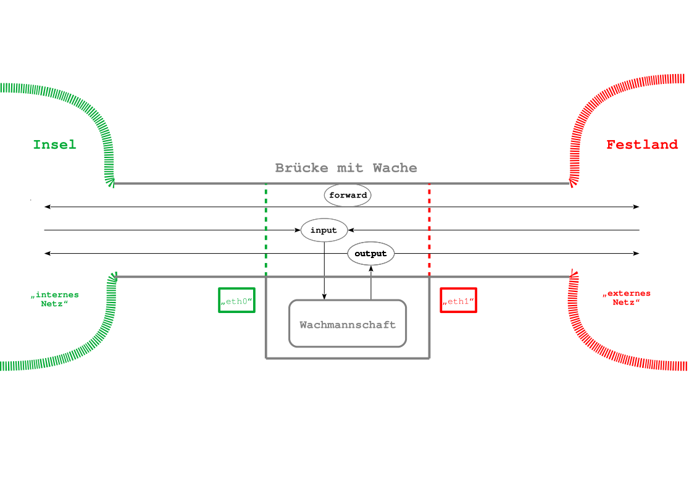

Zwischen der Insel Sylt und dem Festland gibt es nur eine Verbindung, über den Hindenburgdamm.  
==>> folgende Denke:

- Auf dem Hindenburgdamm gibt es eine Brücke mit einer Wachmannschaft.
- Die Brücke hat 2 Schranken:

  - <g>GRÜNE Schranke:

    - Name: "<g>eth0"
    - In die Richtung zur Insel Sylt (zum sicheren "internen Netz").

  - <r>ROTE Schranke:
    - Name: "<r>eth1"
    - In die Richtung zum Festland (zum unsicheren "externen Netz").

- Die Wachmannschaft hat 3 Zettel (Regelsätze genannt), auf denen bestimmte Regeln stehen:

  1. Zettel (Regelsatz **FORWARD**):

     - Wer darf vom Festland auf die Insel.
     - Wer darf von der Insel auf das Festland.

  2. Zettel (Regelsatz **INPUT**):

     - Wer darf vom Festland kommend, die Wachmannschaft besuchen.
     - Wer darf von der Insel kommend, die Wachmannschaft besuchen.

  3. Zettel (Regelsatz **OUTPUT**)

     - Wer von der Wachmannschaft darf in Richtung Festland gehen.
     - Wer von der Wachmannschaft darf in Richtung Insel gehen.

       <!-- [69] -->

### Innerer Aufbau der SPI-FW[^10] mit iptables:

=> siehe: \_2_FW_innen.pdf

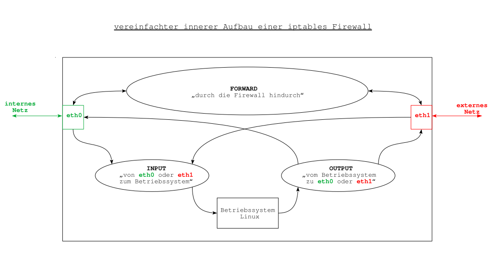

- <b>Wachmannschaft => Betriebssystem (Linux)</b>
- <g>GRÜNE Schranke => Netzwerkkarte eth0
- <r>ROTE Schranke => Netzwerkkarte eth1
- FORWARD:
  - <g>eth0</g> => Firewall => <r>eth1</r>
  - <r>eth1</r> => Firewall => <g>eth0</g>
  - Hauptaufgabe von FORWARD:
    - Wer darf welche Daten von <g>eth0</g> => <r>eth1</r> senden.
    - Wer darf welche Daten von <r>eth1</r> => <g>eth0</g> senden.
- INPUT:
  - <g>eth0</g> => <b>Linux</b>
  - <r>eth1</r> => <b>Linux</b>
  - Hauptaufgabe von INPUT:
    - Wer darf welche Daten über <g>eth0</g> => <b>Linux</b> senden.
    - Wer darf welche Daten über <r>eth1</r> => <b>Linux</b> senden.
- OUTPUT:

  - <b>Linux</b> => <g>eth0</g>
  - <b>Linux</b> => <r>eth1</r>
  - Hauptaufgabe von OUTPUT:

    - Welche Daten darf <b>Linux</b> über <g>eth0</g> aussenden.
    - Welche Daten darf <b>Linux</b> über <r>eth1</r> aussenden.

    <!-- [70] -->

Welche Schichten des OSI-Modells sind mit der SPI-FW[^10] (iptables) unter Linux steuerbar?

#### Alle Bedingungen sind logisch UND-verknüpft!

##### Schicht 1 => Netzwerkkarte:

- Funktioniert nur auf der Firewall selbst.

###### UND

##### Schicht 2 => MAC-Adresse:

- Nur der Rechner mit der entsprechenden MAC-Adresse darf….

###### UND

##### Schicht 3 => IP-Adresse:

- Nur der Rechner mit der entsprechenden IP-Adresse darf….

###### UND

##### Schicht 4 => TCP oder UDP:

- Nur wenn der Rechner ein Datenpaket über TCP oder UDP sendet, darf er….

###### UND

##### Schicht 5 - 7 => Port:

- Nur wenn der Rechner über Port xy kommuniziert, darf er….
  - ==>> Port = Anwendung
    - 22 = ssh
    - 53 = DNS
    - 80 = http
    - 443 = https

 <!-- [71] -->

### ==>> DENKSPORT (es soll ja schließlich nicht langweilig werden)

=> siehe: \_3_FW_Skizze_leer_2.pdf
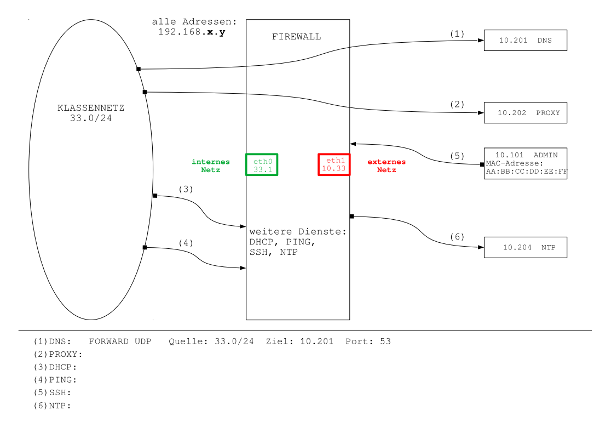

Füllen Sie bitte die Skizze aus.

- Jeder Pfeil hat einen Anfang (kleines Rechteck) => Quelle.
- Jeder Pfeil hat ein Ende (Spitze) => Ziel
- Rück-Richtung ist hier uninteressant, wir haben schließlich eine SPI-Firewall mit iptables.
- Überlegen Sie für jeden Dienst (Pfeil):
  - Ist es FORWARD?
  - Ist es INPUT?
  - Ist es OUTPUT?
  - Macht es Sinn die MAC-Adresse mit in die Regel aufzunehmen?
  - Ist die IP-Adresse ein einzelner Host oder ganzes Netz?:
    - Angabe der Subnetzmaske /24 => das ganze Netz.
    - keine Angabe der Subnetzmaske => einzelner Host.
  - Wird TCP oder UDP genutzt?
  - Welcher Port wird genutzt?

### ==>> GENUG GEDACHT:

=> siehe: \_4_FW_Skizze_Inhalt_2.pdf
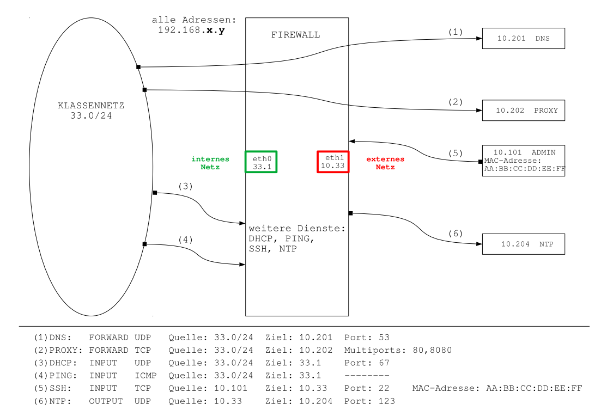

### Auflösung des Rätsels:

#### (1) DNS:

- FORWARD => durch die Firewall hindurch.
- Für DNS wird UDP verwendet.
- Quelle: das ganze Netz 192.168.33.0 /24
- Ziel: der Server 192.168.10.201
- Port: 53

  <!-- [72] -->

#### (2) PROXY:

- FORWARD => durch die Firewall hindurch.
- Für Webanfragen (http, https) wird TCP verwendet.
- Quelle: das ganze Netz 192.168.33.0 /24
- Ziel: der Server 192.168.10.202
- Ports: 80 und 8080
  - Mit "Multiports" können mehrere Ports auf einmal angegeben werden.
  - Wird die Software "Squid" als Proxy verwendet => Port 3128

#### (3) DHCP:

- INPUT => in die Firewall hinein:
  - Die Firewall selbst bietet DHCP an.
- DHCP verwendet UDP (Broadcast, funktioniert mit TCP nicht, => siehe: oben).
- Quelle: das ganze Netz 192.168.33.0 /24
- Ziel: die Firewall 192.168.33.1 (über die IP-Adresse auf der "GRÜNEN" Netzwerkkarte eth0)
- Port: 67

#### (4) Ping:

- INPUT => in die Firewall hinein:
  - Die Firewall selbst bietet an, auf Ping zu antworten.
- Ping verwendet ICMP:
  - de.wikipedia.org/wiki/Internet_Control_Message_Protocol
- Quelle: das ganze Netz 192.168.33.0 /24
- Ziel: die Firewall 192.168.33.1 (über die IP-Adresse auf der "GRÜNEN" Netzwerkkarte eth0)
- Port: gibt es bei ICMP nicht

  <!-- [73] -->

  #### (5) SSH:

  INPUT => in die Firewall hinein:
  Die Firewall selbst bietet an, sich über ssh fernsteuern zu lassen.
  Für ssh wird TCP verwendet.
  Quelle: nur der PC mit:
  der IP-Adresse 192.168.10.101
  UND
  der MAC-Adresse AA:BB:CC:DD:EE:FF
  Ziel: die Firewall 192.168.10.33 (über die IP-Adresse auf der "ROTEN" Netzwerkkarte eth1).
  Port: 22

  #### (6) NTP:

  OUTPUT => aus der Firewall heraus:  
  Die Firewall möchte sich die genaue Zeit vom Zeitserver holen.  
  Für ntp wird UDP verwendet.  
  Quelle: die Firewall 192.168.10.33 (über die IP-Adresse auf der "ROTEN" Netzwerkkarte eth1)  
  Ziel: der NTP-Server mit der IP-Adresse 192.168.10.204  
  Port: 123

  <!-- [74] -->

  ### iptables – Syntax:

  Umsetzung der oben "GENUG GEDACHTEN" Regeln in eine Syntax, die iptables versteht und danach arbeitet:

  => <f>siehe: 5_Beispiele_CSTATE.pdf

  => <f>siehe: firewall_leer.sh (als Basis für eigene Firewalls)

  Erklärungen und Vereinfachungen:

- "ABC" => steht stellvertretend für eine ganze Anweisung.
- "$ABC" => ruft diese Anweisung im Computer auf (man erspart sich die ganze Schreibarbeit).
- "IPT" => Pfad zu iptables
- "IU" => INPUT UDP
- "IT" => INPUT TCP
- "II" => INPUT ICMP
- "FU" => FORWARD UDP
- "FT" => FORWARD TCP
- "FI" => FORWARD ICMP
- "OU" => OUTPUT UDP
- "OT" => OUTPUT TCP
- "OI" => OUTPUT ICMP
- "MAC" => nur diese MAC-Adresse darf….
- "MP" => multiport (Angabe mehrerer Ports auf einmal)
- "R" => Der Rest, der hinter jeder Zeile stehen muss.

#### Alles oberhalb "# Anfang eigene Regeln" wird immer gebraucht.

**HIER KOMMEN JETZT DIE EIGENEN REGELN….**

Das "#" ist ein Kommentarzeichen (sollte man viel benutzen, um sich später zu erinnern).  
echo "irgendwas" => Bildschirmausgabe des Skripts beim Start, was es gerade macht.

#### Alles unterhalb "# Ende eigene Regeln" wird auch immer gebraucht.

 <!-- [75] -->

### ==>> DENKSPORT (wieder einmal):

=> siehe nochmals: 4_FW_Skizze_Inhalt_2.pdf

- 5_Beispiele_CSTATE.pdf
- nutzen Sie firewall_leer.sh:
  Erarbeiten Sie die Syntax für die Regeln aus

### ==>> GENUG GEDACHT:

=> siehe: firewall_Inhalt.sh
Auflösung des Rätsels:  
 aus "Quelle" => "-s"  
 aus "Ziel" => "-d"  
 aus "Port" => "--dport"  
 aus "Ports" => "--dports" (mehrere Ports, Plural):  
 ==>> Bei der Angabe mehrerer Ports in einer Regel, muss "$MP" in der Zeile stehen und man darf das kleine "s" bei "Ports" nicht vergessen.

#### Skript (firewall_Inhalt.sh) nutzen:

- PC mit Betriebssystem Linux (getestet mit Debian und Ubuntu).
- PC braucht 2. Netzwerkkarte:

1. Netzwerkkarte => IP-Adresse: 192.168.33.1 /24
2. Netzwerkkarte => IP-Adresse: 192.168.10.33 /24

- Zum "root" auf dem PC werden => "sudo -s" und anschließend das Passwort eingeben.
- Skript auf den PC kopieren (auch per USB-Stick möglich).
- Skript "ausführbar" machen => "chmod 755 firewall\*Inhalt.sh"
- Skript starten => "./firewall_Inhalt.sh"
- Skript wird abgearbeitet => die Zeilen mit "echo" werden angezeigt.

    <!-- [76] -->

### Demilitarisierte Zone ("DMZ"):

[🔗de.wikipedia.org/wiki/Demilitarisierte*Zone*(Informatik)](<de.wikipedia.org/wiki/Demilitarisierte_Zone_(Informatik)>)

[🔗heise.de/ct/artikel/DMZ-selbst-gebaut-221656.html](heise.de/ct/artikel/DMZ-selbst-gebaut-221656.html)

=> siehe: Foto "TB_14" als Tafelbild

#### Allgemein:

- Dient dazu ein sicheres "Zwischennetz" zu schaffen => warum?:
  - Für Server, die sowohl von intern (GRÜN) als auch von extern (ROT) erreichbar sein sollen.
- Das 2-stufige Konzept:
  - Wird in den IHK-Prüfungen bevorzugt.
  - Ist aufwendiger (2 Firewalls mit je 2 Netzwerkkarten, 2 mal Regeln schreiben).
  - Ist sicherer => doppelte "Verteidigungslinie".
  - ==>> Denke an Burgen aus dem Mittelalter
- Das 1-stufige Konzept:
  - Ist weniger aufwendig (nur 1 Firewall mit 3 Netzwerkkarten, nur 1 mal Regeln schreiben).
  - Ist unsicherer => einfache "Verteidigungslinie".
  - ==>> Denke an Stadttore aus dem Mittelalter
- Wird oft in ORANGENER Farbe dargestellt (so man hat, in TB_14 BLAU gezeichnet => sorry).

  

#### Erklärung zu TB_14:

##### ROTES Netz (extern) 192.168.1.0 /24:

    192.168.1.1 => ROTE Netzwerkkarte der Firewall
    192.168.1.2 => Schnittstelle der FritzBox

##### GRÜNES Netz (intern) 192.168.2.0 /24:

    192.168.2.1 => GRÜNE Netzwerkkarte der Firewall
    192.168.2.2 => PC des Chefs
    192.168.2.3 => PC des Admins

<!-- [77] -->

##### ORANGENES Netz (DMZ) 192.168.3.0 /24:

    ==>> Wir definieren in TB_14 BLAU zu ORANGE um!
    192.168.3.1 => ORANGENE Netzwerkkarte der Firewall
    192.168.3.2 => firmeneigener Webserver läuft auf Port 80

##### Allgemein formulierte Regeln für die Firewall:

(1) GRÜNES Netz => Internet (http)  
(2) Internet => firmeneigener Webserver (http)  
(3) GRÜNES Netz => firmeneigener Webserver (http)  
(4) PC des Chefs => Internet (https)  
(5) PC des Admins => Firewall (ssh)  
(6) PC des Admins => Webserver (ssh)  
(7) Firewall => Internet (NTP)

==>> Sie ahnen es schon => DENKSPORT:
=> siehe: \_4_FW_Skizze_Inhalt_2.pdf

=> siehe:5_Beispiele_CSTATE.pdf  
=> siehe:firewall_Inhalt.sh

gehen Sie in 2 Schritten vor:

1. Erarbeiten Sie eine Tabelle wie in "4_FW_Skizze_Inhalt_2.pdf" unten.
2. Erarbeiten Sie die Syntax für iptables wie in "firewall_Inhalt.sh".

<!-- [78] -->

### ==>> GENUG GEDACHT: Lösung Schritt 1:

| -          | -         | -       | -   | Quelle         | Ziel        | Port |
| ---------- | --------- | ------- | --- | -------------- | ----------- | ---- |
| 1 GRÜN     | Internet  | FORWARD | TCP | 192.168.2.0/24 | 192.168.1.2 | 80   |
| 2 Internet | Webserver | FORWARD | TCP | 192.168.1.2    | 192.168.3.2 | 80   |
| 3 GRÜN     | Webserver | FORWARD | TCP | 192.168.2.0/24 | 192.168.3.2 | 80   |
| 4 Chef     | Internet  | FORWARD | TCP | 192.168.2.2    | 192.168.1.2 | 443  |
| 5 Admin    | Firewall  | INPUT   | TCP | 192.168.2.3    | 192.168.2.1 | 22   |
| 6 Admin    | Webserver | FORWARD | TCP | 192.168.2.3    | 192.168.3.2 | 22   |
| 7 FW       | Internet  | OUTPUT  | UDP | 192.168.1.1    | 192.168.1.2 | 123  |

<!-- [79] -->

### Lösung Schritt 2:

#### Anfang eigene Regeln

    echo "(1) GRUEN => Internet"
    $FT -s 192.168.2.0/24 -d 192.168.1.2 --dport 80 $R
    echo "(2) Internet => Webserver"
    $FT -s 192.168.1.2 -d 192.168.3.2 --dport 80 $R
    echo "(3) GRUEN    => Webserver"
    $FT -s 192.168.2.0/24 -d 192.168.3.2 --dport 80 $R
    echo "(4) Chef     => Internet"
    $FT -s 192.168.2.2 -d 192.168.1.2 --dport 443 $R
    echo "(5) Admin    => Firewall"
    $IT -s 192.168.2.3 -d 192.168.2.1 --dport 22 $R
    echo "(6) Admin    => Webserver"
    $FT -s 192.168.2.3 -d 192.168.3.2 --dport 22 $R
    echo "(7) Firewall => Internet"
    $OU -s 192.168.1.1 -d 192.168.1.2 --dport 123 $R

#### Ende eigene Regeln

<!-- [80] -->

## L. Verschlüsselung:

=> siehe: "Verschluesselung_78.ppt"  
weitere Darstellungen im Verzeichnis: "Verschluesselung_Bilder"  
==>> Daten können heute teilweise verschlüsselt verarbeitet werden:

[🔗https://de.wikipedia.org/wiki/Homomorphe_Verschlüsselung](https://de.wikipedia.org/wiki/Homomorphe_Verschl%C3%BCsselung)

エンコード Transport der Daten im Internet  
=> ist anzuraten.  
エンコード Speicherung der Daten in der Cloud => auf jeden Fall!  
エンコード Verarbeitung der Daten in der Cloud
=> soll zukünftig möglich werden!

Für Wissenshungrige (Verschlüsselung lernen und selbst ausprobieren):  
[🔗de.wikipedia.org/wiki/CrypTool](de.wikipedia.org/wiki/CrypTool)

### Wir unterscheiden grob:

#### Symmetrisches Verfahren:

[de.wikipedia.org/wiki/Symmetrisches_Kryptosystem](de.wikipedia.org/wiki/Symmetrisches_Kryptosystem)

=> siehe: TB_18 und TB_19 (am Beispiel einer Geldkassette).

| TB_18                      | TB_19                      |
| -------------------------- | -------------------------- |
| 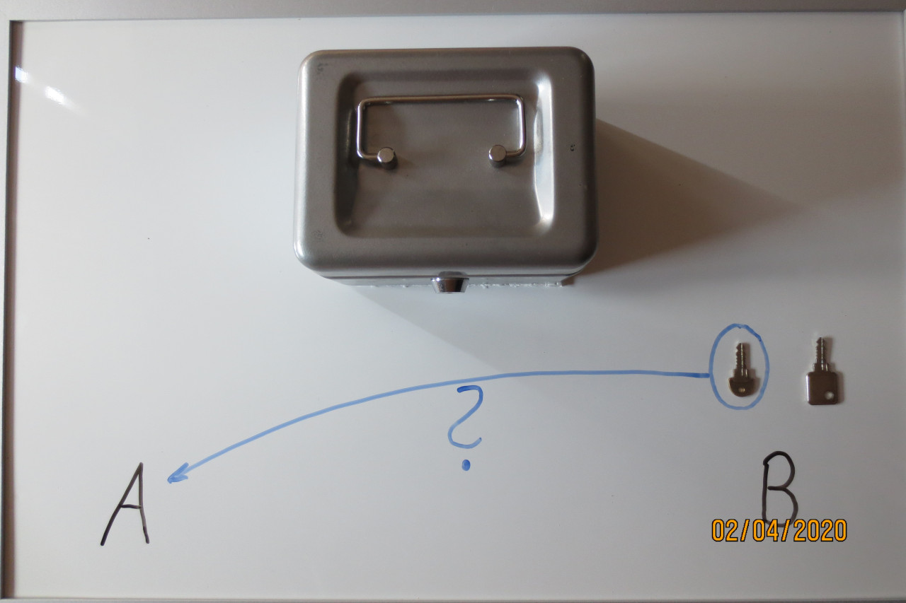 | 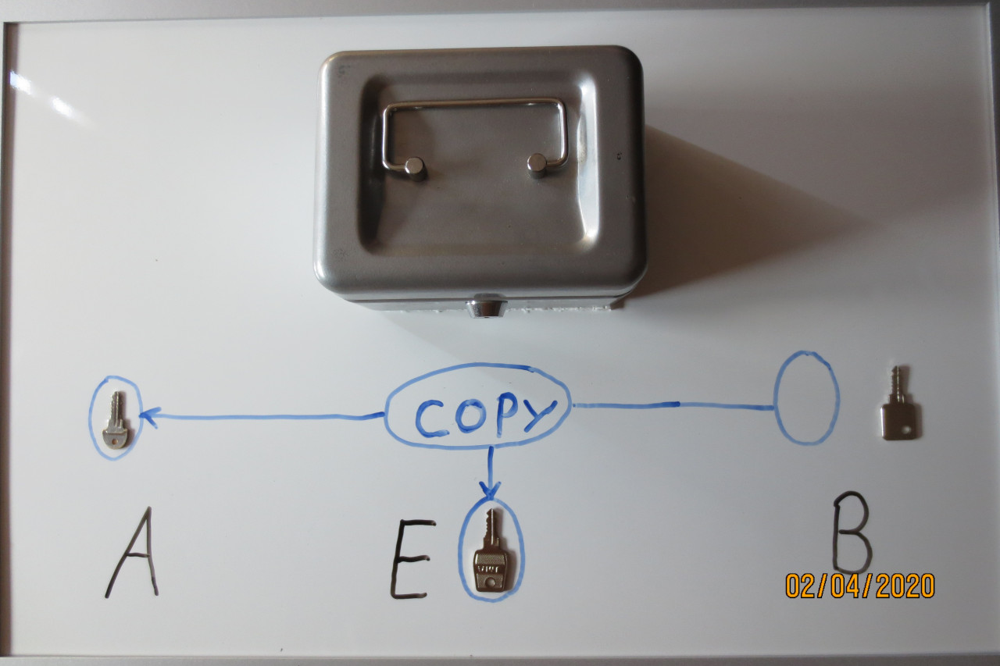 |

#### Asymmetrisches Verfahren:

[🔗de.wikipedia.org/wiki/Asymmetrisches_Kryptosystem](de.wikipedia.org/wiki/Asymmetrisches_Kryptosystem)

#### Hybrides (kombinatorisches) Verfahren:

=> siehe: TB_20 bis TB_25 (am Beispiel einer selbst gebauten "mechanischen" asymmetrischen Verschlüsselung).

| TB_20                      | TB_21                      |
| -------------------------- | -------------------------- |
| 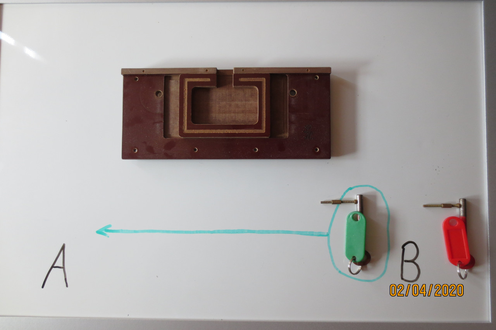 | 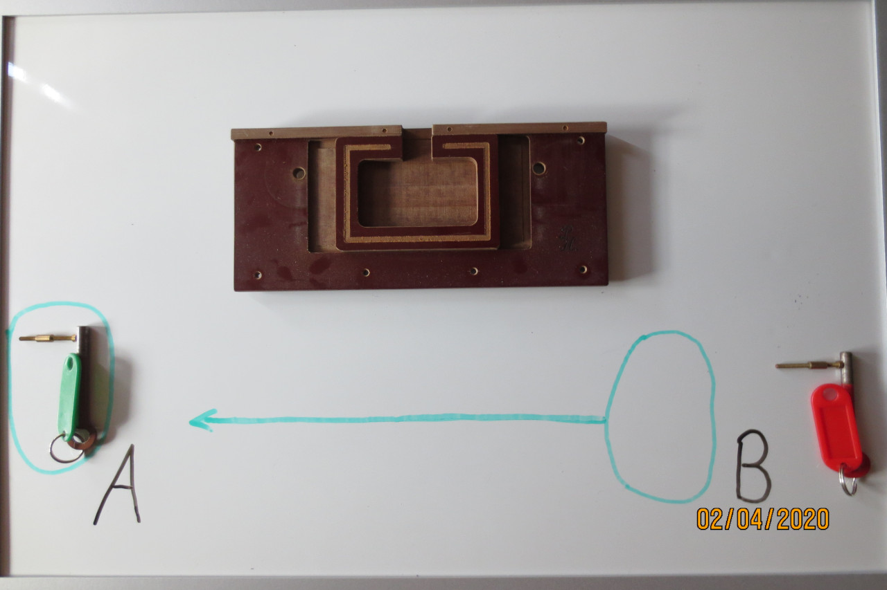 |

| TB_22                      | TB_23                      |
| -------------------------- | -------------------------- |
| 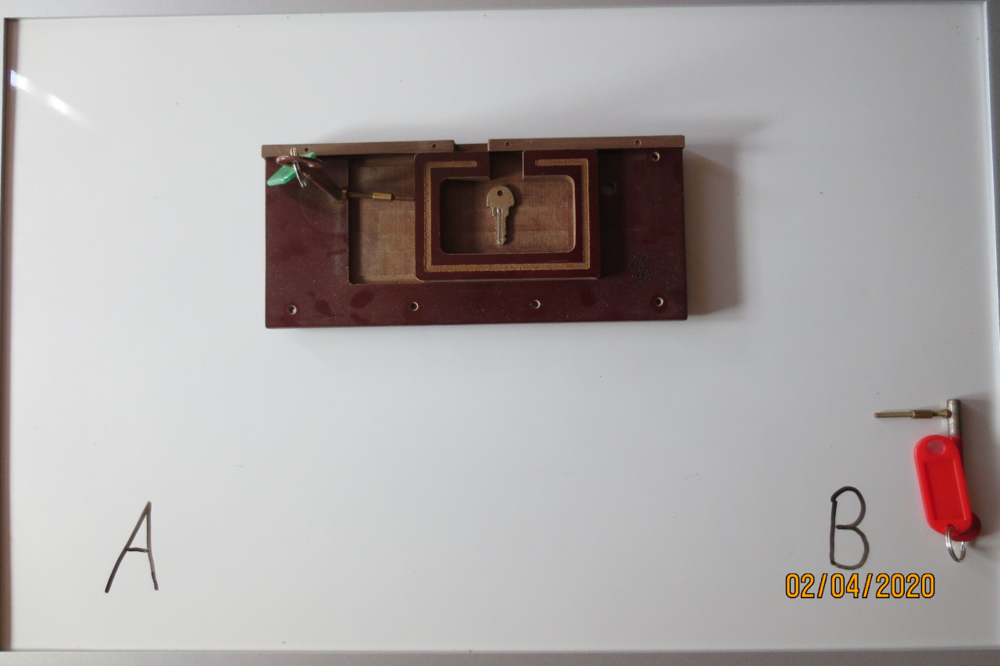 | 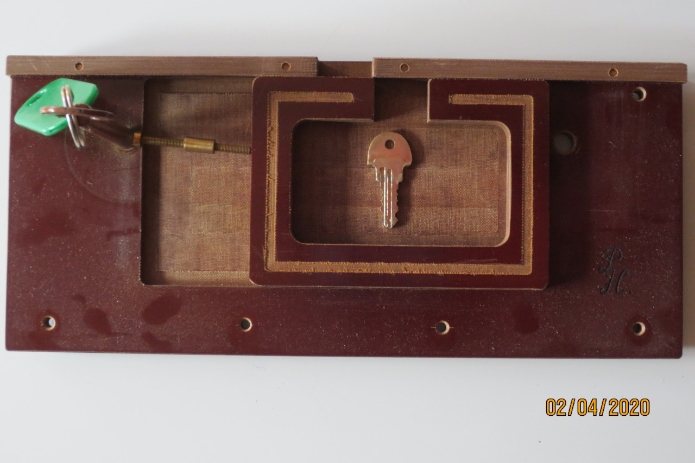 |

| TB_24                      | TB_25                      |
| -------------------------- | -------------------------- |
| 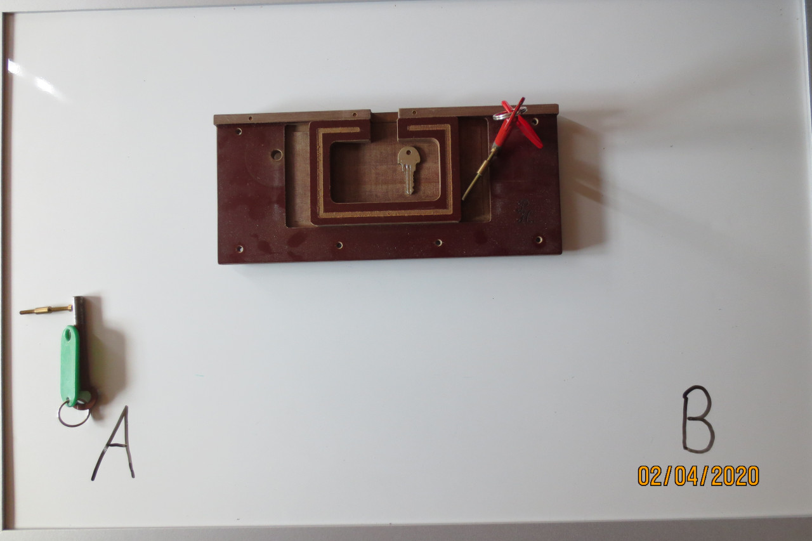 | 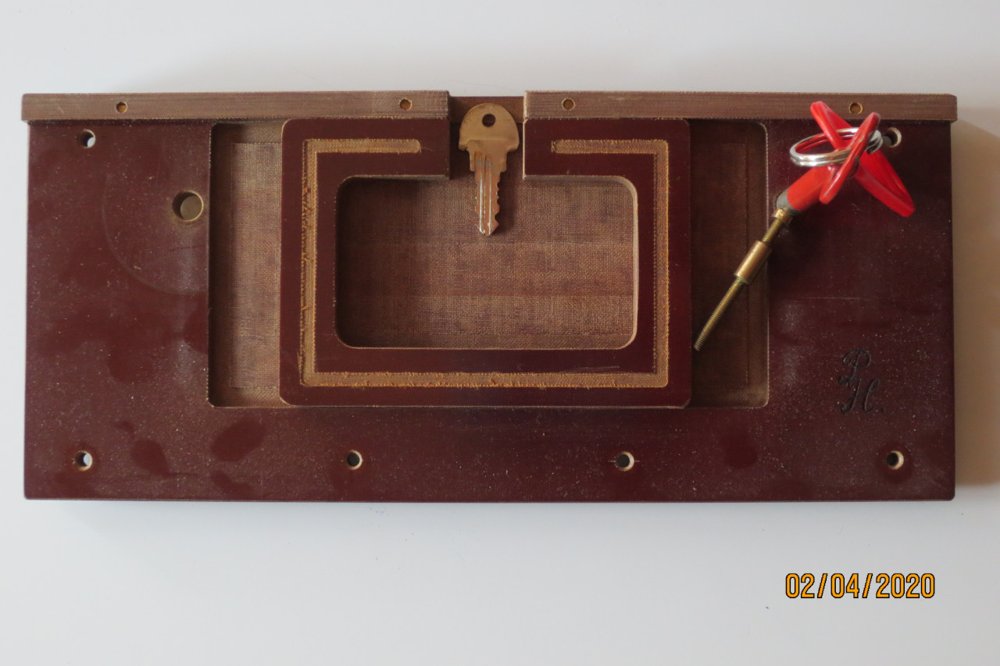 |

#### Diffie-Hellman-Verfahren (eine Spielart des asymmetrischen Verfahrens):

[🔗de.wikipedia.org/wiki/Diffie-Hellman-Schlüsselaustausch#Elliptic*Curve_Diffie-Hellman*(ECDH)](<de.wikipedia.org/wiki/Diffie-Hellman-Schlüsselaustausch#Elliptic_Curve_Diffie-Hellman_(ECDH)>)

[🔗de.wikipedia.org/wiki/Perfect_Forward_Secrecy](de.wikipedia.org/wiki/Perfect_Forward_Secrecy)

<!-- [81] -->

### Besonders 3 Begriffe spielen eine außergewöhnliche Rolle:

=> siehe: Westermann Seite 532

#### Authentizität:

Bist Du wirklich derjenige, für den Du Dich ausgibst?

##### Antwort:

- Shared_Secret:

  - [🔗de.wikipedia.org/wiki/Shared_Secret](de.wikipedia.org/wiki/Shared_Secret)

- Zertifikat:
  => siehe: Westermann Seite 295
  - [🔗de.wikipedia.org/wiki/Digitales_Zertifikat](de.wikipedia.org/wiki/Digitales_Zertifikat)
  - [🔗de.wikipedia.org/wiki/Public-Key-Zertifikat](de.wikipedia.org/wiki/Public-Key-Zertifikat)

#### Integrität:

Wurden die Daten beim Transport verändert?

##### Antwort:

- Hashfunktion:
  - siehe: Westermann Seite 293
  - [🔗de.wikipedia.org/wiki/Hashfunktion](de.wikipedia.org/wiki/Hashfunktion)
- Digitale Signatur:
  - siehe: Westermann Seite 294
  - [🔗de.wikipedia.org/wiki/Digitale_Signatur](de.wikipedia.org/wiki/Digitale_Signatur)

#### Vertraulichkeit:

Können Dritte die Daten Lesen?

##### Antwort:

- Verschlüsselungsalgorithmen: - [🔗de.wikipedia.org/wiki/Verschlüsselung](de.wikipedia.org/wiki/Verschlüsselung)
<!-- [82] -->

### Zusammenfassung Verschlüsselung:

#### Verschlüsselung nicht zu knacken?

##### Antwort:

Haben die Verschlüsselungsalgorithmen eine (gewollte) Hintertür?  
Wurden die Verschlüsselungsalgorithmen fehlerfrei in die Software integriert?

###### Echte Zufallszahlen:

[🔗de.wikipedia.org/wiki/Zufallszahlengenerator](de.wikipedia.org/wiki/Zufallszahlengenerator)  
[🔗random.org/analysis/](random.org/analysis/)
"Simple Visual Analysis"

###### Brute-Force:

[🔗de.wikipedia.org/wiki/Brute-Force-Methode](de.wikipedia.org/wiki/Brute-Force-Methode)

- Zur Erinnerung => Bitcoin-Mining:
  - Mit normalem PC => sehr langsam.
  - Mit der Grafikkarte => schneller.
  - Mit ASICs => sehr viel schneller:

[🔗de.wikipedia.org/wiki/Anwendungsspezifische_integrierte_Schaltung](de.wikipedia.org/wiki/Anwendungsspezifische_integrierte_Schaltung)

###### Einzige "unknackbare" Verschlüsselung:

One-Time-Pad:
[🔗de.wikipedia.org/wiki/One-Time-Pad](de.wikipedia.org/wiki/One-Time-Pad)  
[🔗de.wikipedia.org/wiki/Exklusiv-Oder-Gatter](de.wikipedia.org/wiki/Exklusiv-Oder-Gatter)

<!-- [🔗83] -->

## M. VPN (virtuelles Privates Netzwerk):

=> siehe: Westermann Seite 598

- [🔗wiki.securepoint.de/UTM/VPN/Übersicht](wiki.securepoint.de/UTM/VPN/Übersicht)
- [🔗de.wikipedia.org/wiki/Virtual_Private_Network](de.wikipedia.org/wiki/Virtual_Private_Network)
- [🔗de.wikipedia.org/wiki/IPsec](de.wikipedia.org/wiki/IPsec)

### Transportmodus vs. Tunnelmodus:

[🔗heise.de/security/artikel/VPN-Knigge-270796.html?seite=all](heise.de/security/artikel/VPN-Knigge-270796.html?seite=al)

==>> denke:
Alice aus Mühlenbeck möchte geheime Daten an Bob in Berlin senden.

#### Transportmodus:

==>> denke:
Alice packt geheime Daten in einen Briefumschlag:

=> Briefumschlag adressieren (Absender: Alice aus Mühlenbeck => Empfänger: Bob in Berlin).

=> Briefumschlag mit der Post verschicken.

Was sieht Eve?
Alice aus Mühlenbeck schickt Bob in Berlin geheime Daten.

Was sieht Eve nicht?
Den Inhalt des Briefumschlags (die geheimen Daten).

<!-- [84] -->

#### Tunnelmodus:

==>> denke:
Alice packt geheime Daten in einen Briefumschlag:

=> Briefumschlag adressieren (Absender: Alice aus Mühlenbeck => Empfänger: Bob in Berlin).

=> Briefumschlag mit einem Kurier verschicken, der nur zwischen Mühlenbeck und Berlin fährt.

Was sieht Eve?
Einen Kurier aus Mühlenbeck, der nach Berlin fährt.

Was sieht Eve nicht?
Absender: Alice aus Mühlenbeck => Empfänger: Bob in Berlin

Den Inhalt des Briefumschlags (die geheimen Daten).

### Intranet vs. Extranet:

=> siehe: Foto "TB\*26" als Tafelbild:

==>> Das Security Gateway ist im Tafelbild in der Firewall integriert.  
==>> Für die IHK-Prüfung:  
LAN 1 => DMZ 1 (die eigene DMZ) => Intranet (lila gestrichelte Linie).  
LAN 1 => DMZ 2 (die fremde DMZ) => Extranet (lila gestrichelte Linie).  
LAN 2 => Intranet, Extranet nicht eingezeichnet (Übersichtlichkeit geht sonst verloren).

<!-- [85] -->

## N. Cloud:

=> siehe: Westermann Seite 624
=> siehe: Foto "TB_17" als Tafelbild
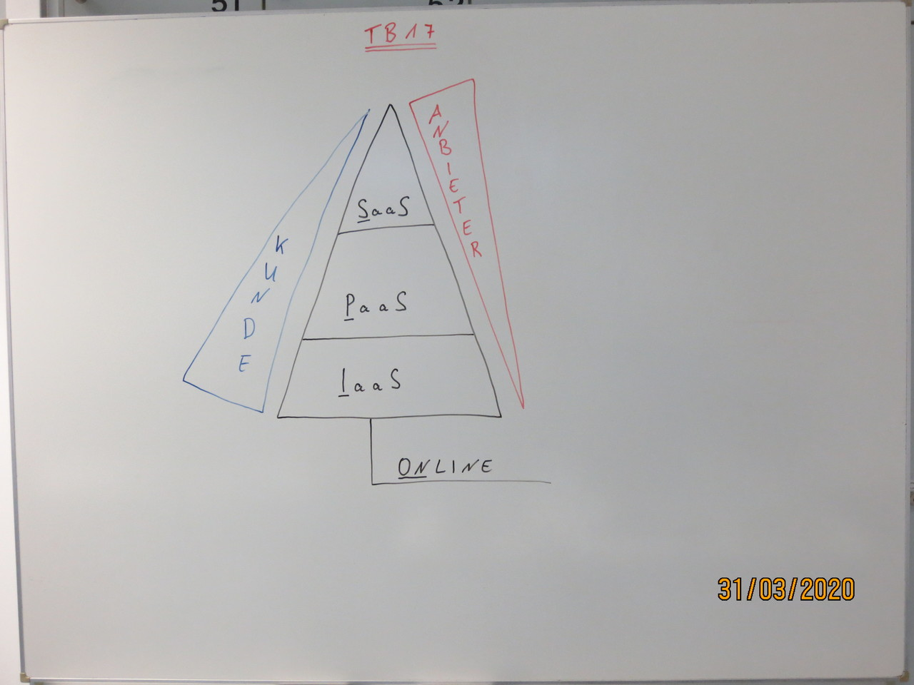

[🔗de.wikipedia.org/wiki/Cloud_Computing](de.wikipedia.org/wiki/Cloud_Computing)

[🔗de.wikipedia.org/wiki/Everything_as_a_Service#Infrastructure_as_a_Service\*(IaaS)](<de.wikipedia.org/wiki/Everything_as_a_Service#Infrastructure_as_a_Service*(IaaS)>)

[🔗de.wikipedia.org/wiki/Platform_as_a_Service](de.wikipedia.org/wiki/Platform_as_a_Service)

[🔗de.wikipedia.org/wiki/Software_as_a_Service](de.wikipedia.org/wiki/Software_as_a_Service)

[🔗ionos.de/digitalguide/server/knowhow/iaas-infrastructure-as-a-service/](ionos.de/digitalguide/server/knowhow/iaas-infrastructure-as-a-service/)

[🔗ionos.de/digitalguide/server/knowhow/paas-platform-as-a-service/](ionos.de/digitalguide/server/knowhow/paas-platform-as-a-service/)

[🔗ionos.de/digitalguide/server/knowhow/saas-software-as-a-service-im-ueberblick-vor-und-nachteile/](ionos.de/digitalguide/server/knowhow/saas-software-as-a-service-im-ueberblick-vor-und-nachteile/)

[🔗ibm.com/de-de/cloud/learn/iaas-paas-saas](ibm.com/de-de/cloud/learn/iaas-paas-saas)

### Ohne einen Alu-Hut zu tragen:

(Public-) Cloud heißt:  
Meine Daten auf unbekannten Servern irgendwo auf der Welt:  
Die Anbieter versichern natürlich, dass die Daten in Deutschland / EU verbleiben.  
Es gibt heute erste Ansätze, verschlüsselte Daten zu verarbeiten, bis dahin gilt:  
Daten müssen vor der Verarbeitung in der CPU entschlüsselt werden.  
Daten liegen somit in Klarschrift vor.  
Daten können in der CPU leicht kopiert werden.
=> siehe: TB_17:

Die unterstrichenen Buchstaben von oben nach unten gelesen ==>> nicht vergessen!

<!-- [86] -->

=> siehe: TB_17:

Linker Keil ("Kunde"):  
Aufwand für den Kunden der Cloud:  
Kunde mietet IaaS[^11] => hoher Aufwand, viele Freiheiten => preiswert.  
Kunde mietet PaaS[^12] => mäßiger Aufwand, eingeschränkte Freiheiten => teurer.  
Kunde mietet SaaS[^13] => geringer Aufwand, wenige Freiheiten => noch teurer.  
Rechter Keil ("Anbieter"):  
Aufwand für den Anbieter der Cloud:
Kunde mietet IaaS => geringer Aufwand => geringer Gewinn.
Kunde mietet PaaS => mäßiger Aufwand => mäßiger Gewinn.
Kunde mietet SaaS => hoher Aufwand => höchster Gewinn.

[^11]: IaaS Infrastructure as a Service is a cloud computing model that provides on-demand access to computing resources such as servers, storage, networking, and virtualization.
[^12]: PaaS Platform as a service is a complete development and deployment environment in the cloud, with resources that enable you to deliver everything from simple cloud-based apps to sophisticated, cloud-enabled enterprise applications.
[^13]: SaaS Software as a service allows users to connect to and use cloud-based apps over the Internet. Common examples are email, calendaring, and office tools (such as Microsoft Office 365).

==>> Für die IHK-Prüfung nicht vergessen:  
Public Cloud.  
Hybride Cloud.  
Community Cloud.  
Private Cloud.

=> siehe: Verzeichnis Filius_Sammlung
Version 12_1.
