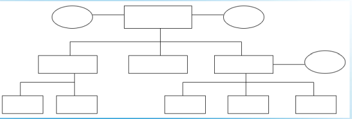
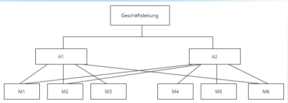
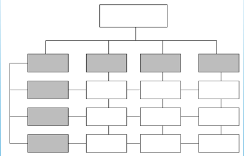

# Projektmanagement

## 1...

## 2 Übersicht

- Was ist Projektmanagement?
- Stakeholder
- Arten von Stakeholdern
- Organisationsformen

## 3 Was ist Projektmanagement?
- DIN69901
- Gesamtheit von 
    - Führungsaufgaben
    - Führungsorganisation
    - Führungstechniken
    - Führungsmitteln
für die Abwicklung eines Projektes.

## 3 Was ist Projektmanagement?

### Projektinitialisierung

- Projektidee konkretisieren und mit Informationen anzureichern 
- Entscheidungsgrundlage, ob es sich lohnt dieses Projekt durchzuführen oder andere bevorzugt werden
- endet mit Projektauftrag / Projektfreigabe

## Was ist Projektmanagement?

### Projektplanung

- Was ist alles notwendig, um das Projektziel zu erreichen
- Projektstrukturplan (PSP) als Entwicklungs- und Darstellungsinstrument für die Aufgabenbestimmung
- daraus ergeben sich Zeit-, Kosten- und Ressourcenplanung

## Was ist Projektmanagement?

### Projektsteuerung

- Projekt auf Kurs halten ggf. Planungsanpassung
- Sammeln von relevanten Informationen für den Projektstatus und Vergleichen mit den Planwerten
- Bei Abweichungen Ursachenforschung und Steuerungsmassnahmen notwendig

## Was ist Projektmanagement?

### Projektführung
  
- Schaffung, Erhaltung und Weiterentwicklung des Projektteams
- Führungsqualitäten (Leadership- Fähigkeiten)
- Umgang mit Menschen zentraler Baustein für Projekterfolg

## Was ist Projektmanagement?

### Projektmarketing

- Alle Aktivitäten für den Verkauf des Projekts
- zweckmäßiges Marketing und Stakeholdermanagment entscheidener Erfolgsfaktor 

## Was ist Projektmanagement?

### Projektinformation und -dokumentation

- gute Informationspolitik sehr wichtig
- sowohl nach oben als auch nach unten
- Projektdokumentation um Projektverlauf festzuhalten (Nachvollziehbarkeit der Ergebnisse)
- Lösungskonzepte und Evaluationsberichte ebenfalls enthalten

## Was ist Projektmanagement?

### Projektabschluss

- Alle Aufgaben für die Übergabe des Projektes an den Auftraggeber
- Auflösen des Teams und Sicherstellen der weiteren Betreuung des Projektresultats
- Analyse des Projektes(Lessons Learned)
  
## Stakeholder

- Stake (engl.) = Ansprüche / Erwartungen
- Haben Erwartungen und Ansprüche an ein 
Unternehmen
- Kooperieren mit Unternehmen da Sie auch 
von ihm profitieren
- Verschiedene Arten von Stakeholdern

## Arten von Stakeholdern

- Kapitalgeber (Zinsen, Erträge)
- Mitarbeiter (Arbeitsplätze, Löhne, Zulagen)
- Lieferanten (Absatz der Produkte und 
Dienstleistungen)
- Kunden (Nutzen der Produkte bzw. 
Dienstleistungen)

## Arten von Stakeholdern

- Kommunen und Behörden 
(Steuereinnahmen, Sozialleistungen)
- Mitbewerber (Kooperationen)
- Wirtschaftsorganisationen

## Organisationsformen

- Einlinienorganisation
- Stablinienorganisation
- Mehrlinienorganisation
- Matrixorganisation

## Einlinienorganisation

- Jede untergeordnete Stelle hat eine 
übergeordnete Stelle
- Somit klare Zuständigkeiten und 
Überschaubar
- Lange Weisungs- und Informationswege, 
mangelnde Flexibilität, zahlreiche 
Schnittstellen und Übermittlungsfehler

## Einlinienorganisation

## Stablinienorganisation

- Einlinienorganisation mit Stabsstellen
- Dienen zur Entlastung mit Beraterfunktion
- Keine Weisungsbefugnis
- Ebenfalls lange Kommunikationswege 
- Kompetenzkonflikte mit anderen Instanzen

## Stablinienorganisation

## Mehrlinienorganisation

- Untergeordnete Stelle kann von mehreren 
Instanzen Weisungen erhalten
- Mitarbeiter flexibel einsetzbar
- Betonung der Fachautorität
- Zuständigkeitsabgrenzung problematisch
- Überforderung der Mitarbeiter

## Mehrlinienorganisation

## Matrixorganisation
- Weiterentwicklung des Mehrliniensystems
- Jede Stelle von 2 Instanzen geführt
- Teamarbeit gefördert
- Unterstützt so Produkt- und 
Geschäftsprozessorientierung
- Streitigkeiten bei den Zuständigkeiten

## Matrixorganisation

