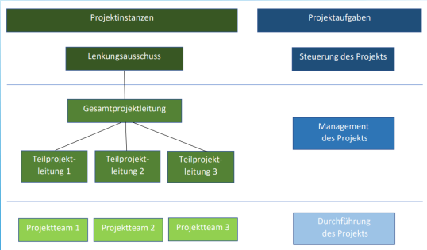

# Projektmanagement 2

## 1 Projektmanagement

## 2 Übersicht

- Projektdefinition
- Merkmale und Faktoren
- Projektstruktur
- Phasen / Meilensteine eines Projekts
- Projektziele
- Projektarten

## 3 Projektdefinition

- DIN69901
- Vorhaben, welches im Wesentlichen durch die Einmaligkeit der Bedingungen in ihrer Gesamtheit gekennzeichnet ist.

## 4 5 Merkmale eines Projekts

- Einmaligkeit
- Zielvorgaben
- Zeitliche, personelle, finanzielle oder andere Begrenzungen
- Abgrenzung gegenüber anderen Projekten
- Projektspezifische Organisation
<!-- ## 5 Merkmale eines Projekts -->

### Erfolgfaktoren

- genau Definition von Projektzielen
- Entwicklung präziser Projektpläne
- Einhaltung der Pläne Kontrolieren
- Zusammenstellen eines geeigneten Teams
- Optimale Kommunikationsbedingungen

### Risikofaktoren

- Schlechte Kommunikation(Sprachbarrieren, schlechte Kommunikationskanäle, unvereinbare Persönlichkeiten)
- schlechte Planung(knappe Ressourcen)
- Mangelnder Überblick über Projektdetails
- verwendung falscher Pm-Tools
- mangelnde Kontrolle
- Änderung im Umfang (Fristen werden verschoben, Aufgabe geändert)

## 6 7 8 9 10 Projektstruktur

- Abhängig von Art und Umfang des Projektes
- 1 Person für Management und Durchführung in kleineren Projekten
- Mittlere und große Projekte haben eine andere Struktur

<!-- ## 7 Projektstruktur -->

<!-- ## 8 Projektstruktur -->

### Lenkungsausschuss:

- Erteilung des Projektauftrages und Freigabe der Projektziele und -planung
- Verfolgt Projektfortschritt
- Legt Projektprioritäten fest
- Trifft Grundsatzentscheidungen im Projektablauf

<!-- ## 9 Projektstruktur -->

### Projektleitung:

- Berichtet dem Projektausschuss
- Zuständig für das Projektmanagement
- Teilprojekte können Teilprojektleiter haben

<!-- ## 10 Projektstruktur -->

### Projektteam:

- Arbeiten am Projekt
- Geben Probleme an Projektleitung weiter

## 11 12 Projektphasen

- Projekt zeitlich zu strukturieren
- Zur Erhaltung der Übersicht
- Jede Phase in einem abgeschlossenen Zeitraum
- Unterschiedliche Gestaltung der Phasen abhängig vom Auftrag, Größe oder Branche

<!-- ## 12 Projektphasen -->

- Projektstart
- Projektplanung
- Projektdurchführung
- Projektkontrolle
- Projektabschluss

## 13 Projektphasen IEEE 12207

- Anforderungsanalyse
- Design/Entwurf
- Implementierung/Umsetzung
- Tests/Kontrolle
- Dokumentation
- Auslieferung und Support

## 14 Anforderungsanalyse

- Ist- und Sollzustand erfassen
- Wünsche und Vorstellungen des Auftraggeber erfassen
- Leistungen beschreiben
- Lasten- und Pflichtenheft erstellen
- Aufwandsabschätzung

### 15 Lastenheft

- DIN69901-5: 2009-01
- ... vom Auftraggeber festgelegte Gesamtheit der Forderungen an die Lieferungen und Leistungen eines Auftragnehmers innerhalb eines (Projekt-)Auftrags.
- Leistungsverzeichnis des Kunden oder Sollkonzept genannt

### 16 Pflichtenheft

- DIN69901-5: 2009-01
- ... vom Auftragnehmer erarbeitete
  Realisierungsvorgaben auf Basis des
  Lastenheftes
- Grundlage der vertraglich festgehaltenen Leistungen des Auftragnehmers
- Von beiden Unterschrieben

## 17 Design / Entwurf

- Planen durch Projektleiter und sein Team
- UML, Struktogramme usw.
- Spezifizierung des Datenbanksystems
- Auch Tests sollten hier geplant werden

## 18 Implementierung

- Programmierung der Software
- Tests der einzelnen Entwickler und Testabteilung, wenn vorhanden
- Dokumentation des Codes
- Übergang zur offiziellen Testphase ist fließend

## 19 Testen

- Anforderungsüberprüfung der Software
- Modul-, Integrations-, System- und Akzeptanztests durchgeführt
- Erstellen der Testprotokolle

## 20 Dokumentation

- Erstellen aller notwendigen Dokumente
- Lasten- und Pflichtenheft, Planungsmodelle, und Testprotokolle
- Bedienungsanleitungen, Schulungsunterlagen und Übergabeprotokolle

## 21 Auslieferung

- Software wird Auftraggeber bzw. Anwender zur Verfügung gestellt
- Installation und Konfiguration, wenn notwendig

## 22 Wartung und Support

- Veränderungen an der Software
- Fehlerbeseitigung, die nach der Auslieferung festgestellt wurden
- Effizienzverbesserung
- Anpassung neuer Anforderungen

## 23 24 25 26 27 Projektphasen / Meilensteine

- DIN69900
- Ereignis mit besonderer Bedeutung, i.d.R. die Fertigstellung eines Projektabschnitts oder Teilprojektes
- Erfolgt mit Gutachten, Präsentationen oder Abnahmeprotokolle

<!-- ## 24 Projektphasen / Meilensteine -->

- Meilensteine am Ende jeder Phase (Hauptmeilensteine)
- Zusätzliche (Zwischen) Meilensteine je nach Projektgröße möglich
- Sind auch Entscheidungspunkte
- 3 Entscheidungsmöglichkeiten:

<!-- ## 25 Projektphasen / Meilensteine -->

### 1 Entscheidungsmöglichkeit:

Alle bisherigen Aktivitäten befinden sich im vorgegebenen Zeitplan und somit kann die Phase abgeschlossen werden und das Projekt wie geplant fortgesetzt werden.

<!-- ## 26 Projektphasen / Meilensteine -->

### 2 Entscheidungsmöglichkeit:

Einige Aktivitäten weisen in den relevanten Größen (Kosten, Termine, Ergebnisse) Abweichungen auf und müssen nachgebessert werden um die Phase abschließen zu können.

<!-- ## 27 Projektphasen / Meilensteine -->

### 3 Entscheidungsmöglichkeit:

Es sind Ergebnisse eingetreten, die eine sinnvolle Projektfortsetzung unmöglich erscheinen lassen, das Projekt wird gestoppt und ggf. ganz eingestellt oder unter neuen Rahmenbedingungen völlig neu aufgestellt

## 28-9-0-1-2-3-4 Projektziele

- Ziel ist angestrebter Soll-Zustand
- Notwendig für Koordination, Motivation oder die Erfolgskontrolle (Soll-Ist-Vergleich)
- Formulierung der Ziele mit S.M.A.R.T – Analyse als Hilfsmittel

<!-- ## 29 Projektziele -->

- Specific (Spezifisch)
- Measureable (Messbar)
- Achievable (Akzeptiert)
- Reasonable (Realistisch)
- Time-bound (Terminiert)

<!-- ## 30 Projektziele -->

### Spezifisch:

- So klar und konkret wie möglich definieren
- Wer wird benötigt zur Zielerreichung?
- Wann soll das Ziel erreicht werden?
- Was genau soll erreicht werden?
- Warum soll das Ziel erreicht werden?
- Welche Hürden können auftreten?

<!-- ## 31 Projektziele -->

### Messbar:

- Messbaren Kriterien (Kennzahlen, Mengen oder Einhaltung von Standards/Normen)
- Ungünstige Formulierungen:
- “möglichst niedrige Kosten”
- “Erhöhung der Qualität”
- “Ausbau des Marktanteiles”

<!-- ## 32 Projektziele -->

### Akzeptiert:

- Steht auch für „angemessen“ oder attraktiv
- Ziel soll sinnvoll und motivierend sein
- Somit ziehen alle an einem Strang
- Gutes Gefühl beim Verfolgen des Ziels

<!-- ## 33 Projektziele -->

### Realistisch:

- Realistische Vorgehensweise und Ziele
- Keine utopischen Ziele setzen
- So Verhinderung von Frustration
- Motivation erhalten

<!-- ## 34 Projektziele -->

### Terminiert:

- Zeitlichen Rahmen definieren (Deadline)
- Terminierung ist auch Kontrollpunkt, ob das vorgegebene Ziel erreicht wurde

## 35 Projektarten

- Bau- und Investitionsprojekte (Bauvorhaben o. Fabrikerweiterung)
- (F&E-) Projekte (Prototyp oder Medizin)
- Organisationsprojekte (Start-up)
- IT-Projekte (Software oder IT-Infrastruktur)
- Marketingprojekte (Kundenevents)
