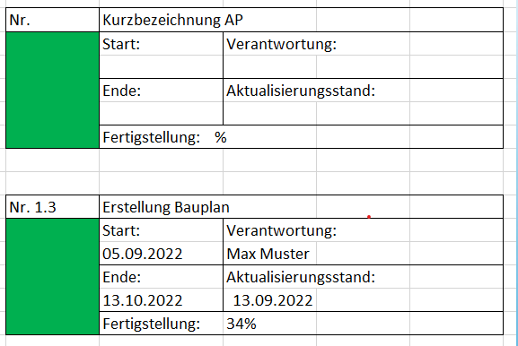

# Projektstrukturplan

## Übersicht

- Was ist der Projektstrukturplan (PSP)?
- Aufteilungsmöglichkeiten
- Checkliste PSP
- Was ist ein Arbeitspaket (AP)?
- AP Beispiel
- Projektablaufplan

## Was ist ein PSP?

- Gliedert die Gesamtaufgabe in Haupt- und Teilaufgaben 
- Für Teilaufgaben werden Arbeitspakete AP festgelegt
- PSP ist Grundlage für den Projektablaufplan

## Aufteilungsmöglichkeiten

- nach objektorientiert, funktionsorientiert, phasenorientiert oder auch gemischt
- **Objektorientiert**: nach zu bearbeitenden Objekten z.B. Empfang, Forum oder Events
- **Phasenorientiert**: nach Entwicklungsphasen z.B. Vorbereitung, Umsetzung, Nachbereitung
- **Funktionsorientiert**: nach Funktionen im Unternehmen z.B. Marketing, Produktion oder Vertrieb
  
## Checkliste PSP

- Erzählt der Projektstrukturplan eine vollständige Story?
- Sind die Phasen in einer klaren Reihenfolge angeordnet?
- Sind die Phasen klar definiert/voneinander getrennt?
- Sind die Namen der Arbeitspakete klar definiert?
- Sind Arbeitspakete und Phasen klar unterschieden?
- Gibt es eine durchgängige Nummerierung?
- Sind die Arbeitspakete auf der gleichen Abstraktionsebene?
  
## Was ist ein AP?

- Kleinste Element im PSP
- Eine in sich abgeschlossene Aufgabe
- Hat Start- und Endzeitpunkt
- Wird einem Teammitglied zugeordnet
- Sollte mit anderen APs vergleichbar sein

## AP Beispiel

## Projektablaufplan

- Zur Terminplanung und -kontrolle
- Auch Vorgangsliste oder Meilensteinübersicht möglich
- Alle Vorgänge und APs mit Termine übersichtlich aufgelistet
- Balken- oder Ganttdiagramm 