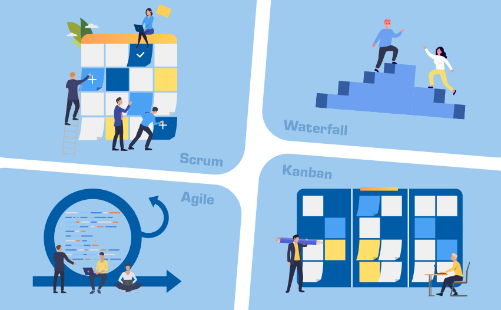
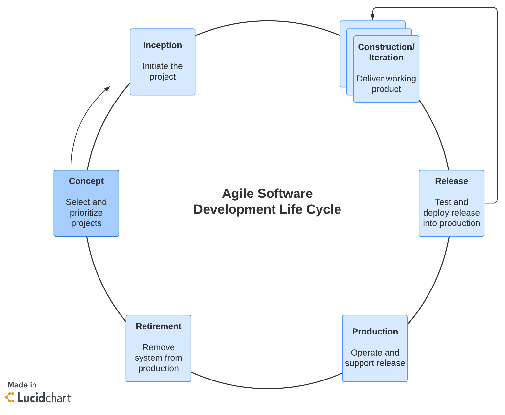

<link rel="stylesheet" type="text/css" href="../styles.css">

# Project Management Methotology

## 4 different Project Management Methotology

**Agile**, **Waterfall**, **Kanban**, and **Scrum** are all project management methodologies or frameworks used in software development and other industries.

Here's a brief explanation of each:

- **Agile**: is a flexible and iterative approach to software development. It emphasizes collaboration, customer feedback, and the ability to adapt to changing requirements. <u>**Agile** methodologies include **Scrum** and **Kanban**, among others.</u>

- **Waterfall**: is a traditional and sequential project management methodology. It follows a linear and structured approach _where each phase of the project must be completed before moving on to the next_. It's less flexible compared to **Agile** and is typically used for projects with well-defined requirements.

- **Kanban**: is a visual project management framework that focuses on continuous delivery and workflow optimization. It involves visualizing work on a **Kanban board** and moving tasks through various stages to improve efficiency and minimize bottlenecks. **Kanban** is often used in combination with other methodologies, including Agile.

- **Scrum**: is a specific Agile framework that provides a structured way to plan and manage work. It includes roles (such as Product Owner and Scrum Master), ceremonies (like Sprint Planning and Daily Standups), and artifacts (such as the Product Backlog and Sprint Backlog) to help teams deliver value incrementally in short iterations called Sprints.

These methodologies have different principles and practices, and they are chosen based on the specific needs and nature of a project. Agile is a broader umbrella that encompasses various frameworks and methodologies, including Scrum and Kanban, while Waterfall is a more traditional and sequential approach. Each has its strengths and weaknesses, and organizations choose the one that best fits their project requirements and objectives.

## What’s the Difference?

### What makes Waterfall unique

projects are broken down into linear and sequential stages, where every piece of the project relies on the completion of preceding deliverables.

#### Discrete, terminal phases

- one phase must be completed before another begins
- Waterfall uses distinct phases rather than simultaneous work.

#### Thorough documentation

- Waterfall does not allow going back to a prior phase
- project requirements need to be clear up front
- gathering and documenting requirements & making these requirements accessible to team members
- Team members also document their work

### What makes Agile unique

The Agile methodology is:

- collaborative
- self-organizing
- cross-functional approach

to completing work and requirements.

It includes Scrum and Kanban.

#### Simultaneous, incremental work

Agile methods break projects into smaller, iterative periods, which work particularly well for products that benefit from user testing and regular revision (like software).

#### Adaptability

Agile methodologies encourage teams to improve and adjust workflow as needed.

### What makes Kanban unique

Kanban strives to better coordinate and balance work with the capacity and bandwidth among workers. It uses the Agile methodology principles discussed above but implements them in a particular way.

#### Kanban board

Each task is recorded on a Kanban card, which moves from column to column on the board as it moves through the team’s process.

#### WIP limits

Teams assign a limit to the number of cards in any active-work columns. When the limit is met, no new work can enter the column until a task is completed and moved to the next column.

#### Continuous improvement

The goal of the Kanban methodology is to improve the team’s process. The team meets periodically to discuss changes that need to be made, and the data displayed on the Kanban board guides these discussions.

### What makes Scrum unique

is another Agile methodology that uses an incremental approach to work in order to complete projects more quickly.  
Kanban vs. Scrum, Kanban is primarily concerned with process improvements, while Scrum is concerned with getting more work done faster.

#### Sprint

Scrum uses two-week sprints to get work done. These sprints are planned in advance, executed, and then reviewed at the end of the two-week period. During sprint planning, the team creates a sprint backlog. The team completes these backlog tasks during the sprint, managing the work among themselves.

#### Scrum Master

A Scrum master links the team to the product owner. Before beginning a project, the Scrum master works with the product owner to define requirements. They then help the team plan sprints. Once a sprint begins, the Scrum master helps remove any roadblocks that arise.

It’s important to note that a Scrum master is not a traditional project manager, as a Scrum master facilitates work rather than managing it. The Scrum methodology encourages teams to manage their own productivity; the Scrum master merely helps them do so.

#### Burndown charts

Scrum uses a burndown chart during sprints to let team members see progress at a glance. Rather than displaying completed tasks, the burndown chart visualizes what’s left to be done. It should be continuously updated to help team members manage their workflow.
