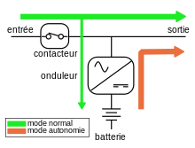

<link rel="stylesheet" type="text/css" href="styles.css">

# Prüfungen

## Sommer 2022-GA2-Aufgaben-FAAN

### SWOT analysis

SWOT stands for **Strengths, Weaknesses, Opportunities, and Threats**. It is a strategic planning tool used by individuals, businesses, and organizations to assess their current situation and make informed decisions about their future.

Here's a brief overview of each component of SWOT analysis:

    1. **Strengths**: These are the internal attributes and resources that an entity possesses and can use to its advantage. Strengths could include things like a strong brand, a talented workforce, efficient processes, or unique products or services.

    2. **Weaknesses**: These are also internal factors, but they represent areas where the entity is lacking or could improve. Weaknesses might include limited financial resources, outdated technology, or poor management practices.

    3. **Opportunities**: Opportunities are external factors and conditions that an entity can take advantage of to achieve its goals. These can be emerging markets, changes in customer preferences, new technologies, or favorable economic conditions.

    4. **Threats**: Threats are external factors that could potentially harm or hinder the entity's progress. Threats may include competition, economic downturns, regulatory changes, or shifts in consumer behavior.

By conducting a SWOT analysis, an entity can gain a better understanding of its current position and make informed decisions about strategy, goals, and resource allocation. It can help identify areas to leverage, areas to improve, opportunities to pursue, and potential risks to mitigate.

### In-memory databases

An in-memory database is a type of database management system (DBMS) that primarily stores and manages data in the computer's main memory (RAM) rather than on traditional disk storage. This results in faster data access and retrieval, making it well-suited for applications that require high-speed data processing and low-latency response times.  
 

Key characteristics of in-memory databases include:

 

1. **Faster Data Access**: Storing data in RAM allows for extremely fast data access, as there is no need to read from or write to slower disk storage. This makes in-memory databases ideal for applications where low latency is critical, such as financial trading platforms and real-time analytics.

2. **High Throughput**: In-memory databases can handle a high volume of read and write operations per second, making them suitable for applications with heavy transactional workloads.

3. **Optimized for Analytical Processing**: In-memory databases are commonly used for data warehousing and analytics, as they can quickly process and analyze large datasets.

4. **Data Durability**: To ensure data durability (the ability to recover data in case of system failure), some in-memory databases periodically write data to disk or use replication and backup strategies.

5. **Scalability**: Many in-memory databases are designed to be easily scalable, allowing you to add more RAM or nodes to handle increasing workloads.

Popular in-memory databases include Redis, Memcached, Apache Ignite, and some relational database systems like SAP HANA. They are commonly used in real-time applications, caching layers, and situations where rapid data retrieval and processing are critical.

### Zustandsdiagramm

Ein Zustandsdiagramm ist ein Diagramm, das in der Softwareentwicklung und Systemmodellierung verwendet wird, um den Zustandsübergang eines Systems zu visualisieren. Es ist eine Form der Verhaltensmodellierung und wird häufig in der Unified Modeling Language (UML) und anderen Modellierungssprachen verwendet.  
 
Ein Zustandsdiagramm stellt die verschiedenen Zustände eines Systems dar und zeigt, wie das System zwischen diesen Zuständen wechselt, basierend auf verschiedenen Ereignissen und Bedingungen. Zustandsübergänge werden oft mit Pfeilen dargestellt, die anzeigen, wie das System von einem Zustand in einen anderen übergeht.  
 
Zustandsdiagramme sind besonders nützlich, um komplexe Systeme zu modellieren, bei denen das Verhalten des Systems in verschiedenen Zuständen unterschiedlich ist, und um die Reihenfolge der Zustandsübergänge zu dokumentieren. Sie sind in verschiedenen Bereichen wie Softwareentwicklung, Automatisierung, Steuerungssystemen und anderen technischen Anwendungen weit verbreitet.

## Winter 2021-GA1-Aufgaben-FAAN

### Edge computing

Edge-Computing ist ein verteiltes Computing-Framework, das Unternehmensanwendungen näher an Datenquellen wie IoT-Geräte oder lokale Edge-Server bringt.  
 

Edge computing is a distributed computing paradigm that brings computation and data storage closer to the source of data generation. Instead of relying solely on a centralized cloud infrastructure, edge computing processes data locally on devices or at "the edge" of the network. This approach reduces latency, enhances real-time processing capabilities, and minimizes the need for extensive data transfer to a central server. Edge computing is particularly beneficial for applications requiring low latency, such as IoT devices, autonomous vehicles, and smart systems.

### USV & Notstromversorgung

#### Unterbrechungsfreie Stromversorgung (USV)

##### Funktion

Eine USV ist eine elektronische Vorrichtung, die zwischen die Hauptstromversorgung und die angeschlossenen Geräte geschaltet wird. Sie dient dazu, sofort und automatisch Strom bereitzustellen, wenn sie eine Unterbrechung oder Unregelmäßigkeiten in der Hauptstromversorgung erkennt.

##### Übergangszeit

Die Übergangszeit von der Hauptstromversorgung zur USV ist sehr kurz, oft im Bereich von Millisekunden. Dies ermöglicht eine nahezu unterbrechungsfreie Stromversorgung für angeschlossene Geräte.

##### Energiequelle

Die Energiequelle einer USV besteht normalerweise aus Batterien, die während des normalen Betriebs aufgeladen werden.

##### types

- VFI Online
- VFD OffLine
- VI Line Interactive

if avr **Automatic voltage regulator:** immer VI for usv

| VFI                                                       | VFD                                             | VI                                               |
| --------------------------------------------------------- | ----------------------------------------------- | ------------------------------------------------ |
| online                                                    | offline                                         | Line Interactive                                 |
| double conversion                                         | attente passive                                 | En interaction avec le réseau                    |
|                        |              |                |
|  |  |  |
|                       |             |               |

###### VFI Online

    In an online UPS, the load is continuously supplied by the inverter. The input power is used to charge the batteries, and the inverter draws power from the batteries to supply the load. This provides a high level of protection against power disturbances since the load is always isolated from the input power variations. The inverter is continuously operational, offering a seamless transition between different power sources.

    Die VFI-USV auch "Online-USV" genannt, bietet den maximalen Schutz. Sie gleicht Schwankungen der Netzspannung als auch der Netzfrequenz aus. Der Verbraucher wird im Normalbetrieb ständig über den Akku versorgt. Da bei dieser Art von USV bei einem Netzausfall nicht in eine andere Betriebsart umgeschaltet werden muss, treten im Vergleich zu den anderen USV-Typen keine Schaltzeiten auf. Diese USV arbeitet mit einen "Dauerwandlerprinzip", hierbei ist die Wandlung von Wechsel- in Gleichspannung und von Gleich- in Wechselspannung gemeint. Da hierbei ständig die Spannung gewandelt wird, können elektrische Verluste und Wärme entstehen. Daher liegt der Wirkungsgrad bei 90%. Wegen der Dauerbelastung ist die Lebensdauer der Akkus nicht allzu lange, im Schnitt 3 bis 4 Jahre. Dieser USV-Typ ist daher oft in der Server- und Datenkommunikation zu finden.

###### VFD OffLine

    In an offline UPS, the load is typically powered directly by the input power source. When there is a power outage or disturbance, the UPS switches to the inverter to draw power from the batteries and supply the load. The transfer time between the input power and the battery power can result in a brief interruption in power to the connected equipment.

    Diese Art von USV auch "Standby- oder Offline-USV" genannt, ist die einfachste USV, sie schützt lediglich gegen einen totalen Netzausfall. Netzspannungen, Schwankungen oder Netzfrequenzen können nicht von ihnen ausgeglichen werden. Bei einem Netzausfall übernimmt ein Akku die Energieversorgung. Auch bei einer Über- oder Unterspannung wird auf den Batteriebetrieb umgestellt. Die Schaltzeiten liegen dabei innerhalb weniger Millisekunden und reichen für die Aufrechterhaltung der meisten Systeme aus. Das Aufladen des Akku erfolgt wieder während des Normalbetrieb über einen Ladegleichrichter. Der Wirkungsgrad liegt hierbei bei rund 95%. Daher wird diese Art von USV oftmals für Kleinst-Verbraucher oder nur für einzelne Computer eingesetzt.

###### VI Line Interactive

    In a Line Interactive UPS, the inverter is not continuously running like in an Online (VFI) UPS. Instead, it operates in a standby mode, monitoring the input power. When it detects a power anomaly, such as a voltage drop or spike, it switches to the inverter and uses the energy stored in the batteries to supply power to the connected devices. The transfer time is typically faster than in Offline (VFD) UPS systems, providing a higher level of protection against power disturbances. However, it is not as seamless as an Online UPS.

        Diese USV auch "Line Interactive-USV oder Netzinteraktive-USV" bezeichnet, schützt gegen einen totalen Netzausfall und gegen Schwankungen der Netzspannungen.

    Erreicht wird dies durch einen zwischen Netzeingang und Verbraucher geschalteten Spannungsregler. Deshalb eignet sich diese USV sehr gut für eine Umgebung wo viele Spannungsschwankungen vorkommen. Der Wirkungsgrad liegt zwischen 95% und 98%. Dadurch können einzelne Computersysteme, Netzwerke oder größere TK-Anlagen abgesichert werden. Hochsensible Systeme sollten damit nicht ausgestattet werden.

    AVR
    is a feature that allows the UPS to regulate and stabilize the incoming voltage to provide a more consistent and reliable power supply to connected devices. This is particularly important in regions where voltage fluctuations are common. The AVR function helps protect sensitive electronic equipment from both overvoltage and undervoltage conditions.

    - Overvoltage Protection: If the incoming voltage exceeds a certain threshold, the AVR reduces it to a safer level.

    - Undervoltage Protection: If the incoming voltage drops below a certain threshold, the AVR boosts it to a more acceptable level.

#### Notstromversorgung

##### Funktion

Eine Notstromversorgung, oft als Generator bezeichnet, ist ein eigenständiges Stromerzeugungsgerät. Im Falle eines Stromausfalls wird der Generator manuell oder automatisch gestartet, um elektrische Energie bereitzustellen.

##### Übergangszeit

Die Zeit, die benötigt wird, um einen **Generator** zu starten und auf die volle Leistung zu kommen, ist länger im Vergleich zu einer USV. Diese Übergangszeit kann einige Minuten dauern.  

##### Energiequelle

Die Energiequelle für einen **Generator** kann vielfältig sein, einschließlich Diesel, Benzin, Erdgas oder andere Brennstoffe.

    In Bezug auf die Absicherung dezentral platzierte Server gegen Netzstörungen könnte eine Kombination aus USV und Notstromversorgung verwendet werden. Die USV würde die Server sofort mit Strom versorgen, während der Generator hochfährt, um langfristige Energiebereitstellung sicherzustellen. Diese Dual-System-Ansätze bieten eine umfassende Lösung, um den Betrieb von Servern auch bei längeren Stromausfällen aufrechtzuerhalten.

### VLAN

**Netzwerk**: A network is a collection of interconnected devices or nodes (such as computers, servers, or other hardware) that are linked together to share resources, information, or services. It allows these devices to communicate and exchange data with each other.  

**Broadcast**: A broadcast refers to a method used in computer networks where a message is sent from one sender to all devices within a network. It's a way to transmit data to all devices on a specific network without having to individually address each one.  

