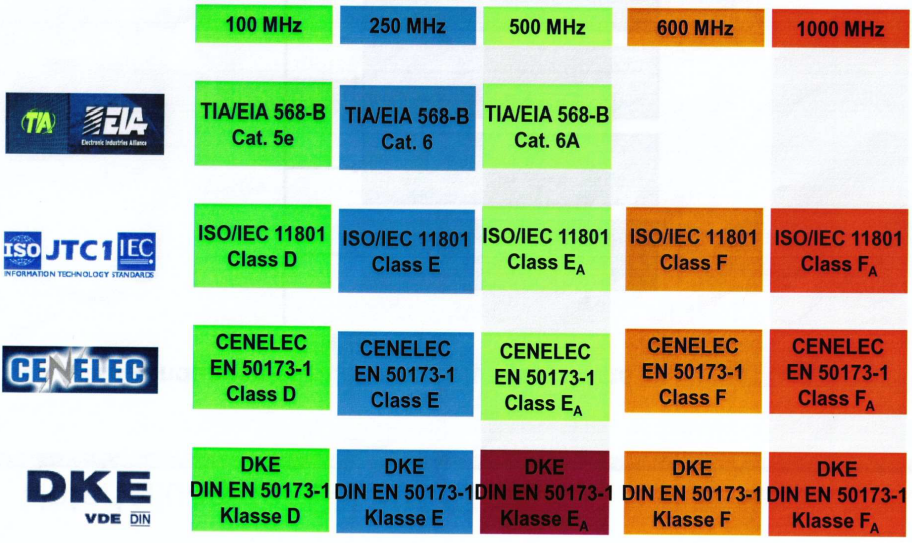

# Datenkabel TP

## 1 Datenkabel TP -Entwicklung der Verkabelung

- Beginn der strukturierten Verkabelung 90er Jahre
- seitdem mehrere Weiterentwicklungsphasen
- Frequenzen bis 10 GHz können heute über
  symmetrische Verkabelungssysteme übertragen werden
- Hersteller und Installateure geben heute eine **SYSTEMGARANTIE von 25 JAHREN!!!**

## 2 Datenkabel TP -Normen und Standards-

### die „Welt“ ist dreigeteilt:

- ISO / IEC 11801 Weltnorm

  - International Standardization Organisation
  - International Electrotechnical Commission

- ANSI / TIA / EIA 568 Nordamerika

  - American National Standard Institute
  - Telecommunication Industry Association
  - Electronic Industries Alliance

- EN 50173 Europa
  - Europäische Norm

## 3 Datenkabel TP -Normen und Standards-

## 4 Datenkabel TP -Unterteilung der EN 50173-

### EN 50173 Anwendungsneutrale Verkabelungssysteme

- EN 50173-1 Allgemeine Anforderungen

- EN 50173-2 Bürogebäude

- EN 50173-3 Industrielle Gebäude

- EN 50173-4 Heimvernetzung

- EN 50173-5 Rechenzentren

 

## 5 Datenkabel TP -Weiterführende Normen-

## CEN / CENELEC [^1]

European Commitee for Standardization
European Commitee for Electrotechnical Standardization

[^1]: CENELEC Comité Européen de Normalisation Électrotechnique; English: European Committee for Electrotechnical Standardization

### EN 61935-1
Spezifikation zur Prüfung symmetrischer
Kommunikationsverkabelung

### EN 50310

Potentialausgleich und Erdung

### EN 50288-x

Kabelnormen

### EN 60603-7-x

Steckverbinder RJ 45, GG 45

### EN 61076-3-x

Steckverbinder Tera, Cat. 7

### EN 50174-x

Installation Kommunikationsanlagen

### EN 50346

Prüfen installierter
Kommunikationsverkabelung

## 6 Datenkabel TP -Planung, Installation, Betrieb-

### IT Gebäude Planungsphase

- EN 50310

### Infrastruktur Entwurfsphase

- EN 50173-1
- EN 50288-x 
- EN 60607-7-x

### Planungsphase

- EN 50174-x 
- EN 50310

### Realisierungsphase 
- EN 50174-x; 
- EN 50310
- EN 50346
- 
### Betriebsphase
 - EN 50174-x
 - EN 50346

## 7 Datenkabel TP -neue Bauprodukte VO-

- ab 01.07.2017 gilt neue Bauprodukte VO
- nur für öffentliche Gebäude!
- Thema: Brandlast!!!

- <f>neue Verlegekabel MÜSSEN CE Kennzeichen und
ZERTIFIZIERUNG besitzen

- <f>Aber: Patchkabel bleiben OHNE Zertifizierung
wegen verschiedener Produzenten (Stecker, Kabel)

- Brandschutz
  - Flammenausbreitung, Wärme, Rauch
  - Säure, Tropfenbildung
  
- <f>IDEAL wäre: Rauchfrei, Halogenfrei und Säurefrei

## 8 Datenkabel TP -neue Bauprodukte VO-

Die Bauproduktenverordnung dient zur Festlegung harmonisierter Regeln und Normen für das Inverkehrbringen von Bauprodukten.  

Jedes Produkt, ganz gleich ob Energie-, Steuer- und Kommunikationskabel, welches dauerhaft in einem Bauwerk verlegt wird, fällt unter diese Verordnung.

Das Ziel der Bauproduktenverordnung ist es, einen europaweiten, einheitlichen Standard in Bauwerken zu schaffen, um die Flammenausbreitung, Wärmeentwicklung, Rauchentwicklung und Säurebildung im Brandfall so gering
wie möglich zu halten.

|Euroklassen | -  |ZusätzlicheKlassen| - |Sicherheitsbedarf im gebäude|
|-----|-----|-----|-----|-----|
|Flammausbreitung Wärmeentwicklung|Rauchentwicklung dichte|Säureentwicklung Korrosivität|Brennende Tropfen| |
|Aca| | | | Sehr hoch|
| B1ca| | | | Sehr hoch|
| B2ca|s1 |a1 | d1| Sehr hoch|
| Cca|s1 | a1| d1|  hoch|
| Dca| s2|a1 | d2| Mittel|
| Eca| | | | Gering|
| Fca| | | | kein|

 
## 9 Datenkabel TP -neue Bauprodukte VO 

### Europäische Kategorien:

ca = cabel (Kabel)

- Aca&nbsp;&nbsp;&nbsp;&nbsp;&nbsp;höchster Brandschutz
- B1ca
- B2ca&nbsp;&nbsp;&nbsp;&nbsp;&nbsp;wird wahrscheinlich Mindeststandard EU
- Cca
- Dca&nbsp;&nbsp;&nbsp;&nbsp;&nbsp;Datenkabel alter Standard
- Eca
- Fca&nbsp;&nbsp;&nbsp;&nbsp;&nbsp;geringster BS

##### Planungsphase: EN 50174-1 bis 3

<f>REALITÄT 2022 : die Verordnung ist noch nicht als Gesetz in Deutschland umgesetzt da in öffentlichen Gebäuden defacto
Brandmeldeanlagen gefordert sind, werden diese neuen Kabel selten eingesetzt Preis für neue Kabel: ca 30% Mehrkosten

### 10 Datenkabel TP -strukturierte Verkabelung

- TOPOLOGIE
  - Primär: MM/SM- LWL (KOAX, Cat. 3)
  - Sekundär: Datenkabel TP Cu, MM/SM- LWL
  - Tertiär: Datenkabel TP Cu (LWL)

- Kategorie und Klassen
  - Einzelkomponenten:  
   (Datenkabel, Patchkabel, Stecker, Datendosen) werden nach Kategorien spezifiziert
  - Installationsstrecken
(Permanent Link, Channel Link)
werden nach Klassen spezifiziert

## 11 Datenkabel TP -Channel und Permanent Link

Datenkabel TP

-Permanent LINK-

• Permanent LINK
• sind die Installationsstrecken
• Gesamtlänge maximal 90m
• diese bestehen üblicherweise aus den
Einzelkomponenten:
• Verteilerfeld (EV)
• Installationskabel
• Anschlussdose (TA)
• wird planerisch mit max. 90m konzipiert
• bei Ausstattung größerer Flächen kann ein
Sammelpunkt (Consolidation Point)
zum Einsatz kommen

12

Datenkabel TP

-Permanent LINK Long Reach-

• neue Entwicklung - Long Reach Kabel • sind Cat 7/7A Kabel
• mit AWG 22
• Gesamtlänge maximal 105 m
• Channel LINK 120 m
• außerhalb Normativ
• kein Fehler
• Absprache mit Auftraggeber

13

Datenkabel TP

-Permanent LINK Long Reach-

14

Rückgrat zukunftsweisender und ausfallsicherer Smart-Building- und Smart-HomeLösungen sind qualitativ hochwertige Kabelprodukte
In Zweckgebäuden versorgt Long-Reach-Kupferkabel S/FTP AWG22 bis zu 180 Meter
verteilte Gebäudedienste mit Ethernet
Für die Installation in Wohngebäuden das platzoptimierte 10-GBase-T-Home Cat.7
AWG26 an
Für die smarte Vernetzung von Zweckgebäuden das reichweitenoptimierte LongReach-Kupferkabel Draka UC LR22 10Gbit S/FTP LSHF-FR
Das mechanisch robuste AWG22-Kabel mit einem Aderdurchmesser von 1,6 mm ist a
mit der standardkonformen Anschlusstechnik voll kompatibel.
Es verfügt über eine maximale Reichweite von 180 Metern in Abhängigkeit der
Übertragungsleistung, bei gleichzeitiger Fernspeisung der Netzwerkgeräte mittels
Power over Ethernet (PoE) gemäß IEEE 802.3bt.
Durch den halogenfreien und flammwidrigen Schutzmantel erfülle das Kabel zudem
die höchsten Brandschutz-Richtlinien gemäß EU-Bauproduktenverordnung mit B2ca
s1a d1 a1.

Datenkabel TP
-Permanent LINK • neue Entwicklungen -

15

Im Heimbereich sind die Anforderungen an die IP-Infrastruktur besonders vielfältig.
Für die "unsichtbare" Installation der Kabel größtenteils in Leerrohren und im
Unterputz steht nur wenig Platz zur Verfügung.
Außerdem erwarten Anwender zukunftssichere, störfreie Lösungen, die eine flexible
Nutzung der Räume ermöglichen, keine Adapter erfordern und eine hohe Leistung
(PoE) gewährleisten.
Diesen hohen Ansprüchen begegnet Prysmian Draka Bekunden mit dem
platzoptimierten Draka UCHome Cat.7 SS26 S/FTP LSHF mit einer
Übertragungsgeschwindigkeit von 10 GBit/s.
Gegenüber Standardkabeln bietet es im Leerrohr Platz für ein Kabel mehr und hat
einen um 30 Prozent kleineren Biegeradius.
Die maximale Installationslänge des leichten und packungsdichten Kupferkabels
beträgt 60 Meter.

Datenkabel TP

-Consolidation Point-

16

• Consolidation Point
• ist ein stationärer Punkt in der Etagenverkabelung
• Einsatz bei Büroverkabelungen
• Kernelement stationärer Kabelsysteme zur
Verbindung der Anschlussdosen
• CP ist ein zusätzlicher Steckverbinder zwischen
Etagenverteiler und Anschlussdose
• dient dem Administrator zur flexibleren Verwaltung
der Etagenverkabelung
• Ein CP kann mehrere Anschlussdosen versorgen

Datenkabel TP

-Channel LINK-

17

• Channel LINK
• sind die Übertragungsstrecken
• maximale Länge 100m (Achtung LONG REACH)
• (90m Verlegekabel+10m Patchkabel)
• sind aufgebaut wie die Installationsstrecken
• Weiterhin kommen BEIDSEITIG die Patchkabel
zur Verbindung PC bzw. Switch dazu
• sind daher alle Komponenten bis zur
aktiven Seite
• die Installationsstrecke wird planerisch mit einer
Gesamtlänge von 100m konzipiert

Datenkabel TP -Komponentenansatz-

Kat. 8.1 Kat. 6A/8 Kat. 8(24m) Kat 6A/8
Kat. 8.2 Kat. 6A/8 Kat. 8(24m) Kat 6A/8

18

Kat. 8
Kat. 8

Klasse EA (GI)
Klasse FA (GII)

Datenkabel TP -Kategorien-

Kategorie

Version

Klasse

Cat. 5

Cat. 5e

D

Cat. 6

Max. Frequenz

19

Schirmmungsart

Steckverbinder

Verwendung

Anmerkung

Normen

100 MHz

F/UTP U/UTP

RJ45

1000BASE-T
2.5GBASE-T (< 75m)
5GBASE-T (< 75m)

In LANs noch weit verbreitet
Ausreichend für StandardNetzwerkanwendungen

ISO/IEC 11801
EN 50173

E

250 MHz

S/FTP F/UTP U/UTP

RJ45

5GBASE-T
10GBASE-T (< 55m)

Derzeit am weitesten
verbreitet

EN 50288
EN 50173-1

Cat. 6A

EA

500 MHz

S/FTP

RJ45

10GBASE-T

Offizielles Minimum für 10GbE

ISO/IEC 11801.2002
Anhang 2

Cat 7

F

600 MHz

S/FTP

GG45, TERA

CCTV

Im LAN oder WAN als
Verlegekabel verwendet

ISO/IEC 11801

1. Ausgabe

Cat 7A

FA

1000 MHz

S/FTP

GG45, TERA

CCTV

Im Netzwerk kaum verbreitet

ISO/IEC 11801 2. Ausgabe, Anhang 2

Schnelle Server
Interconnection-Verbindungen
Verbindungen in
Rechenzentren

ISO/IEC TR 11801-99-1

Noch kaum verwendet

ISO/IEC TR 11801-99-1

Cat. 6

Cat. 7

Cat 8.1

G (I)

2000 MHz

S/FTP

RJ45

25GBASE-T (bis 50m)
40GBASE-T (bis 30m)

Cat 8.2

G (II)

2000 MHz

S/FTP

GG45, TERA

25GBASE-T (bis 50m)
40GBASE-T (bis 30m)

Cat. 8

Datenkabel TP -Cat 6A-

20

Ethernet über Cu Cat. 6A
• 2,5Gbit/s oder 5Gbit/s
auf Standard Cat. 6A
Bei Einsatz von Cat. 6A Komponenten können
auch geringere Datenraten vereinbart werden

Datenkabel TP -Cat 7/7a-

Datenkabel Cat 7 und 7A
immer noch verfügbar
• beim Aufbau von Cat 6A Netzwerken
• dadurch entsprechende Systemreserve

• Einsatz bei PoE, wegen AWG!!!

21

Datenkabel TP -reale Entwicklung Cat. 8-

22

neuer Standard Cat. 8 (8.1 oder 8.2):
•

•

25 / 40 Gbit/s

bis 30m Channel LINK
• 24m Permanent LINK
• Patchkabel AWG 22 und 23: 7,2m (Ausnahme)
• Patchkabel AWG 24:
6,0m
• Patchkabel AWG 26:
4,8m
• insbesondere in Rechenzentren
• in Serverbereichen
• auch Homebereich
• bis 2000 MHz
• in der ISO 11801 zertifiziert

Datenkabel TP -reale Entwicklung Cat. 8-

23

Datenkabel TP -reale Entwicklung Cat. 8• Stecker:
•
•
•
•

24

RJ 45 Cat. 6A, RJ 45 25G; RJ 45 40G
Tera
GG 45 (Verfügbarkeit ???)
ARJ45 Cat. 6A (wie GG45 ohne Kurzschlusskontakte)

• Buchsen:
•
UAE Cat. xx
•
Keystone Cat. 6A, 25G und 40 G (Cat.8)
•
Patchfelder Cat.xx mit Keystone
• Normen:
• 8.1 EA
• mit RJ 45 Cat. 6A (Cat. 8.1)
• 8.2 FA
• mit GG45, Tera, ARJ45

Datenkabel TP -reale Entwicklung Cat. 8-

25

Einfügedämpfung (Insertion Loss, IL)
gibt die Abschwächung eines Signals durch ein Bauteil an,
das in einen Signalweg eingefügt wird
wird auch als die Summe aus Kopplungsverlust und Zusatzdämpfung
umschrieben
dabei kann es sich um passive Filter oder eine Steckverbindung handeln
bei guten Steckverbindungen z. B. bei einem Steckverbinder stellt diese
Größe ein wichtiges Kriterium da

Datenkabel TP -NEXT und FEXT

26

elektrisches Übersprechen ist ein physikalischer Vorgang:
ein Adernpaar stellt einen elektrischen Schwingkreis dar und kann sowohl als
Sender als auch als Empfänger elektrischer Felder dienen
Wird ein elektrisches Signal, über ein Adernpaar übertragen, das gemeinsam mit
mehreren anderen Adernpaaren in einem Kabel geführt ist, so wird dieses Signal
auf andere Adernpaare eingekoppelt
Die Einkopplung erfolgt induktiv, kapazitiv oder galvanisch
Bei Vollduplex-Datenübertragung unterscheidet man zwei Arten von
unerwünschten Störungen: Nahübersprechen (NEXT) und Fernübersprechen (FEXT)
Fernübersprechen (far end crosstalk, FEXT)
ist die Einkopplung durch einen störenden Sender „am vom Opfer-Empfänger
fernen Ende“ bzw. „auf der Seite des zu empfangenden Senders“
Störer und Opfer befinden sich an unterschiedlichen und damit fernen Enden des
Kabels

Datenkabel TP -reale Entwicklung Cat. 8-

27

Datenkabel TP -PoE- Power over Ethernet

• UB: 48 V
• I: bis 600mA pro DA
• P: 96 W
• PoE: 15,4W PoE+: 30 W

28

Betriebsspannung
Stromfluss
Leistung
HiPoE: 2\*45W

• Gefahr:
• Funkenbildung
• Funkenabriss
• Wärmeentwicklung zwischen den Kabeln

• keine komplette BÜNDELVERLEGUNG mehr
• nur noch „Klein Bündel“ mit 24 Kabeln (Patchfeld)
• Klein Bündel übereinander
• Flächenverlegung

Datenkabel TP -PoE- Power over Ethernet

29

Datenkabel TP -PoE- Power over Ethernet

30

Datenkabel TP -PoE- Power over Ethernet

Neue Anwendungsbereiche für PoE…

31

Datenkabel TP -PoE- Power over Ethernet

32

So nicht…  Patchkabel „Verlegung“ unter Teppich

Datenkabel TP -PoE- Power over Ethernet

Achtung…

33

Datenkabel TP

-Kabelbezeichnungen

S = Geflecht
F = Folie

34

Datenkabel TP -AWGACHTUNG: aktuelle Veränderungen!!!

35

Datenkabel TP

BFW Berlin-Brandenburg e.V.

-AWG-

36

Datenkabel TP

-Kabelbezeichnungen-

37

Datenkabel TP

-Kabelbezeichnungen-

38

Datenkabel TP

BFW Berlin-Brandenburg e.V.

-Kabelbezeichnungen-

39

Datenkabel TP

BFW Berlin-Brandenburg e.V.

-Kabelbezeichnungen-

40

Datenkabel TP

BFW Berlin-Brandenburg e.V.

-Kabel EXOT  -

41

Datenkabel TP

-Kabelbezeichnungen-

42

S/FTP Cat 6A AWG 23

S/FTP: Gesamtschirm und Schirm um die Paare
Cat 6A: Qualitätsstufe
AWG 23: amerikanisches Kabelmaß, mit Tabelle Durchmesser

ACHTUNG BESONDERHEIT:

AWG 26/1 oder AWG 26/7
/1: Adern sind eindrähtig = Verlegekabel
/7: Adern sind feindrähtig = Patchkabel

U/UTP: überhaupt KEINE Schirmung
noch im Einsatz in USA und außerhalb EU
(Großbritannien, Schweiz)

Datenkabel TP -Besonderheit bei der
Bezeichnung-

43

• der Unterschied zwischen den Normen

Cat. 6A und Cat. 6A wirkt im Bereich ab 500 MHz

• die Grenzwerte von NEXT (Nahnebensprechdämpfung) sind
bei der ISO/IEC 11801 bzw. EN 50173 höher

• dadurch Systemreserve von ca. 30%!!!
• Cat. 6A vs. Cat. 6A „tiefgestellt“
• Cat. 6A = ISO/IEC 11801 (EN 50173)
• Cat. 6A = TIA/EIA 568
Kategorie
Category

Kat = EU
Cat = USA

Datenkabel TP -Besonderheit TIA/EIA 568 A/B

44

• Entwicklung des Standards TIA/EIA 568

• bis 2002 genügten für die Anforderungen 2 Paare

• bei TIA/EIA 568 A (Amerika)
• 1 ws/gn (Tx+)
2 gn (Tx-) Transmit
• 3 ws/or (Rx+)
6 or (Rx-) Receive
• in Europa wurde TIA/EIA B (Bundesrepublik )
• entwickelt mit Veränderung der Sende-/ Empfangsrichtung
• 1 ws/or (Tx+)
• 3 ws/gn (Rx+)

2 or (Tx-) Transmit
6 gn (Rx-) Receive

•

• heute werden alle 4 Paare benötigt

• 4 bl 5 ws/bl
7 ws/br 8 br
• diese sind bei beiden Standards identisch (grüne Orange )

Datenkabel TP -Besonderheit TIA/EIA 568 A/B

Buchsenbeschaltung

GRÜN:
ORANGE:

1 2
3 6

BFW Berlin-Brandenburg e.V.

GRÜN:
ORANGE:

3 6
1 2

45

Datenkabel TP -Besonderheit TIA/EIA 568 A/B

TIA/EIA 568 A
GRÜN:
1 2
ORANGE: 3 6
BFW Berlin-Brandenburg e.V.

TIA/EIA 568 B
GRÜN:
3 6
ORANGE: 1 2

46

Datenkabel TP -System/Komponentenansatz-

47

• Komponentengedanke
• „MIX and Match“
• Verschiedene Komponenten von
unterschiedlichen Herstellern mit gleicher Kategorie
werden verbaut
Nur in der Theorie möglich, Verluste sind unvermeidlich!
• Systemgedanke
Aufeinander abgestimmte Komponenten von
gleichen Herstellern mit gleicher Kategorie
werden verbaut
• Garantie bestmöglicher Werte durch den Hersteller!
•

= SYSTEMGARANTIE

Datenkabel TP -Datendosen / Gesamtlängen-

48

• Herstellung Datendosen
• Aufwendige Entwicklung und Testung
• Wirkung aller 8 Anschlüsse untereinander
• Einbau von Kompensationsflächen usw.
• Betriebsgeheimnis!!
• LAN Längen Zertifizierung
• Zertifiziert nur bei Längen:
• 90 m Installationskabellänge (24 m bei Cat. 8!)
• und 10 m Patchkabellänge MAXIMAL (Achtung Cat. 8)
• werden längere Verlege oder Patchkabel eingesetzt
außerhalb NORMATIV!!!

= keine SYSTEMGARANTIE mehr

Datenkabel TP -Systemreserven

49

Immer geringere Systemreserve bedeutet immer höhere Störanfälligkeit

Datenkabel TP -ÜT Raten
Megabit und Megahertz-

50

Datenkabel TP -Verlegeabstände EN 50174-2 -

51

Abstände

Installationsart

ohne Trennsteg

ungeschirmte
Energie- und IT Kabel

Alutrennsteg

Metalltrennsteg

200 mm

100 mm

50 mm

ungeschirmte Energiekabel
geschirmte IT Kabel
50 mm

20 mm

5 mm

geschirmte Energiekabel
ungeschirmte IT Kabel

30 mm

10 mm

2 mm

0 mm

0 mm

0 mm

geschirmte Energiekabel
geschirmte IT Kabel

Datenkabel TP -Biegeradien EN 50174-2 Biegeradien bei Unterputz Installationen…

52

Datenkabel TP -Schirmung-

53

Erdung:
Schützt Mensch und Tier vor tödlichen Überspannungen
Massung:
Zusätzlich zur Personensicherheit, Anlageninstallation frei von
systemfremden Störgrößen zu halten, bzw. nicht vermeidbare, systemfremde
und systeminterne Störgrößen geeignet abzuleiten
Schirmung:
Systemmaßnahme zur Entkoppelung von Anlagenteilen gegenüber
äußeren Störeinflüssen
Ist in Erdungs- bzw. Massungskonzept mit einzubeziehen
Schützt passive und aktive Komponenten vor Beeinflussung äußerer Störgrößen

Datenkabel TP -Erdung-

54

Beeinflussung benachbarter ungeschirmter
Datenkabel

Datenkabel TP -Erdung-

55

Beeinflussung benachbarter geschirmter
Datenkabel

Datenkabel TP -Erdung EN 50310Potentialausgleich in Datenschränken

56

Datenkabel TP -Erdung-

57

Potentialausgleich im Datenraum

Datenkabel TP -Erdung-

58

Ideal ist 360° Schirmung!!!

Datenkabel TP -das Problem-

59

Datenkabel TP -reale Entwicklung Cat. 8• Messgeräte können diese Geschwindigkeiten messen
• EA Klassifikation wir gemessen
•

Geräte müssen zertifiziert sein!!!

•
•

Personen müssen nicht zertifiziert sein
außer AG macht Vorgabe

Preis: ca. 12 - 15.000 €
•

Channel Link Messung
• mit Patchkabeln

•

Permanent Link Messung
• mit Permanent Link Adapter (blau/grün/rot)
• hohe Anforderung an den Messstecker
(ca. 1000 Messungen)
• Mittenzentriert

60

Datenkabel TP -reale Entwicklung Cat. 8-

61

Datenkabel TP -reale Entwicklung Cat. 8-

62

Datenkabel TP -reale Entwicklung Cat. 8-

63

Datenkabel TP -reale Entwicklung Cat. 8Messgerät und Messkabel…

64

Datenkabel TP -Messung
Warum müssen so viele Parameter gemessen werden?

65

Datenkabel TP -Messung

66

• Messung Channel oder Permanent Link
• Zur Messung Permanent Link benötigt man
PERMANENT LINK Adapter (sehr teuer)
• Bei Messung Channel Link werden Stichproben (Patchkabel)
gesichert weggepackt

Datenkabel Messtechnik in der
Gebäudeverkabelung

67

• Verdrahtung
• Widerstand
• Dämpfung
• Return Loss / Packet Loss / Bit Loss
• Geschwindigkeit/ Delay / Deley SKEW
• PS und PS Next
• ACR / PSACR
• Schirmung!!!

Datenkabel TP -Messung
NVP Wert (Nominal Velocity of Propagation)
Geschwindigkeit mit der sich Signale im Kupferkabel
im Verhältnis zur
Lichtgeschwindigkeit im Vakuum ausbreiten
Wichtig für Längenermittlung und Fehlerlokalisierung

NVP =

Pulsausbreitungsgeschwindigkeit
-------------------------------------------Lichtgeschwindigkeit (300.000km/s)

68

Datenkabel TP Messung
PS Next (Power Summ NEXT)

69

Datenkabel Messtechnik in der
Gebäudeverkabelung

70

Datenkabel Messtechnik in der
Gebäudeverkabelung

71

ACR / PSACR

Attenuation To Crosstalk Ratio (Power summ)
Dämpfungs-Nebensprechdämpfungs-Verhältnis / Übersprechdämpfung
Verhältnis von Einfügedämpfung (Insertion Loss) zu Übersprechen (NEXT)

Datenkabel Messtechnik in der
Gebäudeverkabelung
Delay ( Laufzeit) / Delay Skew (Laufzeitunterschied)

72

Datenkabel Messtechnik in der
Gebäudeverkabelung

3 Messergebnisse:
GRÜNER HAKEN
ROTES KREUZ
I für INFORMATIV

73

