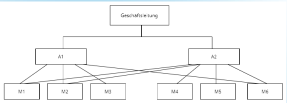

# REMEMBER

## Project Management

### grafix

#### struktogramm

#### gantt diagramm

#### datenflussplan

#### uml diagramm

#### programmablaufplan

#### Aktivität Diagramm

### PM System

#### Einliniensystem

#### Stabliniensystem

#### Mehrliniensystem

#### Matrixorganisation

Management by Exception ?  
Aufbauorganisation ??  
Handlungsvollmacht ist eine auf Dauer erteilte Vollmacht an die Abteilungsleiter zur Erledigung aller gewöhnlichen Rechtsgeschäfte in dem betreffenden Handelsgewerbe.

## Wiso

### betrieblichen Produktionsfaktoren

- **Arbeit** (dispositive und ausführende Arbeit)
- **Betriebsmittel** (Grundstücke, Maschinen, Werkzeuge und Einrichtungen)
- **Werkstoffe** (Roh-, Hilfs- und Betriebsstoffe sowie fertige Bestandteile für das zu erstellende Produkt).

### volkswirtschhaftlicher Produktionsfactor

- **BODEN**
- **Kapital**
- **Arbeit**

### Gewinnzuschlag

Der teilweise auch als Gewinnspanne bezeichnete Gewinnzuschlag bezeichnet den Betrag (in Euro) oder den Prozentsatz (Gewinnzuschlagssatz), der auf die **Selbstkosten** (die für die Herstellung und den Vertrieb anfallenden Kosten) aufgeschlagen wird, um zu dem Verkaufspreis zu gelangen.

#### Gewinnzuschlag = Verkaufspreis nach Skonto und Rabatt - Selbstkostenpreis

#### Gewinnzuschlag in Prozent = (Gewinnzuschlag / Selbstkostenpreis) \* 100

GMBH Geselschaft mit beschrankter haftung

## KUP

### Laserdrucker

- Geringe Kosten pro Seite, hohe Druckgeschwindigkeit
- Hohe thermische Belastung der Druckrmedien.

### Tintenstrahldrucker

- In der Regel keine dokumentenechten Ausdrucke
- Sehr geringe Anschaffungskosten, hohe Druckqualität 2

### Nadeldrucker / Dot-Matrix-Drucker

- Durchschläge möglich, hohe Robustheit

## pog

### struktogramm

- Kopfgesteuerte Schleife: while-Schleife
- Fussgesteurte Schleife: do-while-Schleife
- Zählschleife: for-Schleife
- Abweisende Schleife: for...in-Schleife
- Verzweigung: if-Anweisung
- Sequenz: einfache Abfolge von Anweisungen

Eine **browsergestützte Anwendung** ist eine Softwareanwendung, die über einen Webbrowser ausgeführt wird und keine separate Installation oder Download erfordert. Benutzer können auf diese Anwendungen über das Internet oder ein lokales Netzwerk zugreifen, indem sie eine URL in ihren Webbrowser eingeben. Die Anwendung wird auf einem Server gehostet und die Benutzeroberfläche wird im Browser des Benutzers angezeigt, was eine plattformunabhängige Nutzung ermöglicht.

## NT

\30 nur 4 adresse davon netz-id und Broadcat

tracert:  
Ping and traceroute are common commands you can use to troubleshoot network problems. Ping is a simple command that can test the reachability of a device on the network. Traceroute is a command you use to 'trace' the route that a packet takes when traveling to its destination

### What are the 4 protocols of IoT?

The term IoT, or Internet of Things, refers to the collective network of connected devices and the technology that facilitates communication between devices and the cloud, as well as between the devices themselves.
Internet of things
The application layer serves as the interface between the user and the device within a given IoT protocol.

- Advanced Message Queuing Protocol (AMQP) ...
- Constrained Application Protocol (CoAP) ...
- Data Distribution Service (DDS) ...
- Message Queue Telemetry Transport (MQTT)

## TOM

- ISMS information Schutz management system/information security management system
- Standard-Datenschutzmodell (SDM)

## kup

### Logische Prozessoren

Logische Prozessoren, auch als Threads oder logische Kerne bezeichnet, sind virtuelle Recheneinheiten innerhalb eines physischen Prozessors (CPU-Kerns). Sie ermöglichen es einem einzelnen physischen Kern, mehrere Aufgaben gleichzeitig auszuführen, indem sie den Kern in mehrere logische Einheiten aufteilen. Diese logischen Einheiten können eigenständige Befehle ausführen und sind in der Lage, parallel zu arbeiten.

Die Verwendung von logischen Prozessoren ist eine Technik, um die Leistungsfähigkeit moderner Prozessoren zu steigern, insbesondere in Multitasking-Szenarien, bei denen mehrere Aufgaben gleichzeitig ausgeführt werden müssen. Hier sind einige wichtige Punkte zur Erläuterung des Begriffs "Logische Prozessoren":

#### Multithreading:

Logische Prozessoren ermöglichen Multithreading, was bedeutet, dass ein physischer Kern mehrere Threads gleichzeitig ausführen kann. Threads sind separate Sequenzen von Befehlen, die unabhängig voneinander ausgeführt werden. Dies führt zu einer effizienteren Nutzung der Ressourcen des Prozessors.

#### Parallelverarbeitung:

Logische Prozessoren ermöglichen es dem Prozessor, mehrere Aufgaben parallel auszuführen. Dies ist besonders nützlich bei rechenaufwändigen Anwendungen, die von Parallelverarbeitung profitieren, wie z.B. Videobearbeitung oder wissenschaftliche Berechnungen.

#### Hyper-Threading (HT):

Intel verwendet den Begriff "Hyper-Threading" für seine Implementierung von logischen Prozessoren. Ein physischer Intel-Core-Prozessor kann beispielsweise zwei logische Kerne pro Kern haben, was bedeutet, dass ein Quad-Core-Prozessor insgesamt acht logische Prozessoren haben kann.

#### Verbesserung der Gesamtleistung:

Durch die Verwendung von logischen Prozessoren kann die Gesamtleistung eines Prozessors gesteigert werden, ohne die physische Anzahl der Kerne zu erhöhen. Dies führt zu einer besseren Leistungsfähigkeit bei Aufgaben, die von Multithreading profitieren.

Es ist jedoch wichtig zu beachten, dass die tatsächliche Leistungssteigerung von logischen Prozessoren von der Art der Anwendungen und deren Unterstützung für Multithreading abhängt. Nicht alle Anwendungen können von logischen Prozessoren gleichermaßen profitieren.

## NT

WPA-PSK oder auch WPA Personal.??

WPA-PSK-Verfahren auch das EAP-Verfahren, welches auch als WPA-Enterprise-RADIUS bezeichnet wird.??

## Dont know

### Workspace management software 

is a type of software solution designed to help organizations efficiently manage their physical workspaces, such as offices, meeting rooms, and desks. This software often includes features like:

1. **Space Reservation**: Users can book desks, meeting rooms, or other workspace resources in advance, often through a digital calendar or booking system.

2. **Resource Management**: It allows administrators to allocate and track resources, ensuring that the available workspace is used efficiently.

3. **Occupancy Tracking**: Some solutions provide sensors or tools to monitor the occupancy of various spaces, helping organizations optimize space utilization.

4. **Visitor Management**: Many workspace management systems include visitor registration and check-in functionality.

5. **Analytics and Reporting**: They often provide data and insights into space utilization, helping organizations make informed decisions about their real estate needs.

6. **Integration**: Integration with other software systems like email, calendar, or access control systems for seamless operation.

7. **Mobile Accessibility**: Many workspace management solutions offer mobile apps for convenient booking and management on the go.

8. **Security**: Access control and security features may also be part of the software to ensure that only authorized personnel can access certain spaces.

These systems are particularly valuable for organizations with flexible work arrangements, hot desking policies, or a need to optimize their workspace usage. They can help improve efficiency, reduce costs, and provide a better overall workspace experience for employees and visitors.

## pog

### Prepare for test

AP2 Teil 1:
Planen eines SW-Produktes  
und teil 2:
Entwicklung und umsetzung von Algorithmen

- UML
  - Anwendungsfalldiagramm
  - Aktivitätsdiagramm
  - Sequenzdiagramm
  - Zustandsdaigramm
  - Klasendiagramm
- Komplexe Algorithmen
  - Pseudocode
  - PAP
  - Struktogramme
- Testen
  - unites, Integration, System Abnahme
  - Statisches, dynamisches testen
  - Manuelles, automatisiertes testen
  - Äquivalenzklassen
- Vorgehensmodelle
  - klassich, agil...
- Datenbank  
  