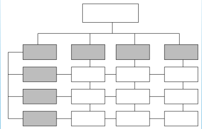
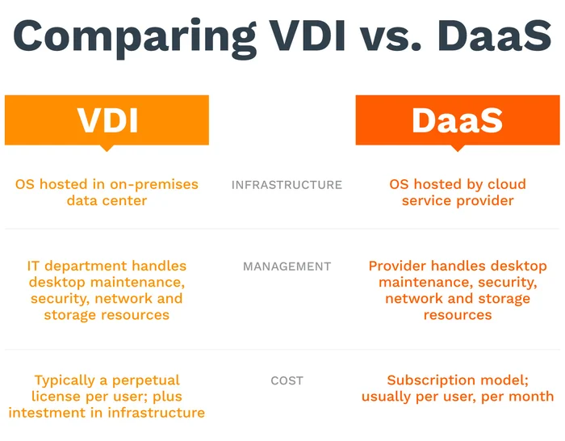
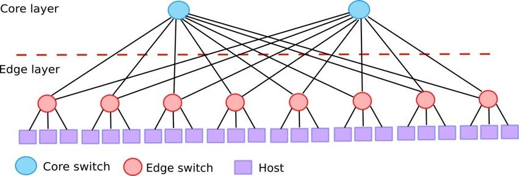

<link rel="stylesheet" type="text/css" href="styles.css">

# REMEMBER

## Project Management

### grafix

#### struktogramm

#### gantt diagramm

#### datenflussplan

#### uml diagramm

#### programmablaufplan

#### Aktivität Diagramm

### PM System

#### Einliniensystem

#### Stabliniensystem

#### Mehrliniensystem

#### Matrixorganisation

Management by Exception ?  
Aufbauorganisation ??  
Handlungsvollmacht ist eine auf Dauer erteilte Vollmacht an die Abteilungsleiter zur Erledigung aller gewöhnlichen Rechtsgeschäfte in dem betreffenden Handelsgewerbe.

## Wiso

### betrieblichen Produktionsfaktoren

- **Arbeit** (dispositive und ausführende Arbeit)
- **Betriebsmittel** (Grundstücke, Maschinen, Werkzeuge und Einrichtungen)
- **Werkstoffe** (Roh-, Hilfs- und Betriebsstoffe sowie fertige Bestandteile für das zu erstellende Produkt).

### volkswirtschhaftlicher Produktionsfactor

- **BODEN**
- **Kapital**
- **Arbeit**

### Gewinnzuschlag

Der teilweise auch als Gewinnspanne bezeichnete Gewinnzuschlag bezeichnet den Betrag (in Euro) oder den Prozentsatz (Gewinnzuschlagssatz), der auf die **Selbstkosten** (die für die Herstellung und den Vertrieb anfallenden Kosten) aufgeschlagen wird, um zu dem Verkaufspreis zu gelangen.

#### Gewinnzuschlag = Verkaufspreis nach Skonto und Rabatt - Selbstkostenpreis

#### Gewinnzuschlag in Prozent = (Gewinnzuschlag / Selbstkostenpreis) \* 100

GMBH Geselschaft mit beschrankter haftung

## KUP

### Laserdrucker

- Geringe Kosten pro Seite, hohe Druckgeschwindigkeit
- Hohe thermische Belastung der Druckrmedien.

### Tintenstrahldrucker

- In der Regel keine dokumentenechten Ausdrucke
- Sehr geringe Anschaffungskosten, hohe Druckqualität 2

### Nadeldrucker / Dot-Matrix-Drucker

- Durchschläge möglich, hohe Robustheit

## pog

### struktogramm

- Kopfgesteuerte Schleife: while-Schleife
- Fussgesteurte Schleife: do-while-Schleife
- Zählschleife: for-Schleife
- Abweisende Schleife: for...in-Schleife
- Verzweigung: if-Anweisung
- Sequenz: einfache Abfolge von Anweisungen

Eine **browsergestützte Anwendung** ist eine Softwareanwendung, die über einen Webbrowser ausgeführt wird und keine separate Installation oder Download erfordert. Benutzer können auf diese Anwendungen über das Internet oder ein lokales Netzwerk zugreifen, indem sie eine URL in ihren Webbrowser eingeben. Die Anwendung wird auf einem Server gehostet und die Benutzeroberfläche wird im Browser des Benutzers angezeigt, was eine plattformunabhängige Nutzung ermöglicht.

## NT

\30 nur 4 adresse davon netz-id und Broadcat

tracert:  
Ping and traceroute are common commands you can use to troubleshoot network problems. Ping is a simple command that can test the reachability of a device on the network. Traceroute is a command you use to 'trace' the route that a packet takes when traveling to its destination

| CIDR | Bits | Netz | IP | 2^Bits | Subnets | Hosts/Subnet | Networks | Mask       |
|------|------|------|----|--------|---------|--------------|----------|------------|
| /0   | 0    | 32   | 0  | 2^0    | 1       | 4,294,967,296| 1        | 0.0.0.0    |
| /1   | 1    | 31   | 1  | 2^1    | 2       | 2,147,483,648| 2        | 128.0.0.0  |
| /2   | 2    | 30   | 2  | 2^2    | 4       | 1,073,741,824| 4        | 192.0.0.0  |
| /3   | 3    | 29   | 3  | 2^3    | 8       | 536,870,912  | 8        | 224.0.0.0  |
| /4   | 4    | 28   | 4  | 2^4    | 16      | 268,435,456  | 16       | 240.0.0.0  |
| /5   | 5    | 27   | 5  | 2^5    | 32      | 134,217,728  | 32       | 248.0.0.0  |
| /6   | 6    | 26   | 6  | 2^6    | 64      | 67,108,864   | 64       | 252.0.0.0  |
| /7   | 7    | 25   | 7  | 2^7    | 128     | 33,554,432   | 128      | 254.0.0.0  |
| ...  | ...  | ...  | ...| ...    | ...     | ...          | ...      | ...        |

### What are the 4 protocols of IoT?

The term IoT, or Internet of Things, refers to the collective network of connected devices and the technology that facilitates communication between devices and the cloud, as well as between the devices themselves.
Internet of things
The application layer serves as the interface between the user and the device within a given IoT protocol.

- Advanced Message Queuing Protocol (AMQP) ...
- Constrained Application Protocol (CoAP) ...
- Data Distribution Service (DDS) ...
- Message Queue Telemetry Transport (MQTT)

## TOM

- ISMS information Schutz management system/information security management system
- Standard-Datenschutzmodell (SDM)

## kup

### Logische Prozessoren

Logische Prozessoren, auch als Threads oder logische Kerne bezeichnet, sind virtuelle Recheneinheiten innerhalb eines physischen Prozessors (CPU-Kerns). Sie ermöglichen es einem einzelnen physischen Kern, mehrere Aufgaben gleichzeitig auszuführen, indem sie den Kern in mehrere logische Einheiten aufteilen. Diese logischen Einheiten können eigenständige Befehle ausführen und sind in der Lage, parallel zu arbeiten.

Die Verwendung von logischen Prozessoren ist eine Technik, um die Leistungsfähigkeit moderner Prozessoren zu steigern, insbesondere in Multitasking-Szenarien, bei denen mehrere Aufgaben gleichzeitig ausgeführt werden müssen. Hier sind einige wichtige Punkte zur Erläuterung des Begriffs "Logische Prozessoren":

#### Multithreading:

Logische Prozessoren ermöglichen Multithreading, was bedeutet, dass ein physischer Kern mehrere Threads gleichzeitig ausführen kann. Threads sind separate Sequenzen von Befehlen, die unabhängig voneinander ausgeführt werden. Dies führt zu einer effizienteren Nutzung der Ressourcen des Prozessors.

#### Parallelverarbeitung:

Logische Prozessoren ermöglichen es dem Prozessor, mehrere Aufgaben parallel auszuführen. Dies ist besonders nützlich bei rechenaufwändigen Anwendungen, die von Parallelverarbeitung profitieren, wie z.B. Videobearbeitung oder wissenschaftliche Berechnungen.

#### Hyper-Threading (HT):

Intel verwendet den Begriff "Hyper-Threading" für seine Implementierung von logischen Prozessoren. Ein physischer Intel-Core-Prozessor kann beispielsweise zwei logische Kerne pro Kern haben, was bedeutet, dass ein Quad-Core-Prozessor insgesamt acht logische Prozessoren haben kann.

#### Verbesserung der Gesamtleistung:

Durch die Verwendung von logischen Prozessoren kann die Gesamtleistung eines Prozessors gesteigert werden, ohne die physische Anzahl der Kerne zu erhöhen. Dies führt zu einer besseren Leistungsfähigkeit bei Aufgaben, die von Multithreading profitieren.

Es ist jedoch wichtig zu beachten, dass die tatsächliche Leistungssteigerung von logischen Prozessoren von der Art der Anwendungen und deren Unterstützung für Multithreading abhängt. Nicht alle Anwendungen können von logischen Prozessoren gleichermaßen profitieren.

## NT

WPA-PSK oder auch WPA Personal.??

WPA-PSK-Verfahren auch das EAP-Verfahren, welches auch als WPA-Enterprise-RADIUS bezeichnet wird.??

## Dont know

### Workspace management software

is a type of software solution designed to help organizations efficiently manage their physical workspaces, such as offices, meeting rooms, and desks. This software often includes features like:

1. **Space Reservation**: Users can book desks, meeting rooms, or other workspace resources in advance, often through a digital calendar or booking system.

2. **Resource Management**: It allows administrators to allocate and track resources, ensuring that the available workspace is used efficiently.

3. **Occupancy Tracking**: Some solutions provide sensors or tools to monitor the occupancy of various spaces, helping organizations optimize space utilization.

4. **Visitor Management**: Many workspace management systems include visitor registration and check-in functionality.

5. **Analytics and Reporting**: They often provide data and insights into space utilization, helping organizations make informed decisions about their real estate needs.

6. **Integration**: Integration with other software systems like email, calendar, or access control systems for seamless operation.

7. **Mobile Accessibility**: Many workspace management solutions offer mobile apps for convenient booking and management on the go.

8. **Security**: Access control and security features may also be part of the software to ensure that only authorized personnel can access certain spaces.

These systems are particularly valuable for organizations with flexible work arrangements, hot desking policies, or a need to optimize their workspace usage. They can help improve efficiency, reduce costs, and provide a better overall workspace experience for employees and visitors.

## pog

### Prepare for test

AP2 Teil 1:
Planen eines SW-Produktes  
und teil 2:
Entwicklung und umsetzung von Algorithmen

- UML
  - Anwendungsfalldiagramm
  - Aktivitätsdiagramm
  - Sequenzdiagramm
  - Zustandsdaigramm
  - Klasendiagramm
- Komplexe Algorithmen
  - Pseudocode
  - PAP
  - Struktogramme
- Testen
  - unites, Integration, System Abnahme
  - Statisches, dynamisches testen
  - Manuelles, automatisiertes testen
  - Äquivalenzklassen
- Vorgehensmodelle
  - klassich, agil...
- Datenbank

## Wiso

### Übungen 2

In welcher Marktform ist für den Anbieter der Preis ein Plandatum?
Polypol

Die Börse ist ein: heterogener Markt

Auf welchem Markt bestehen keine räumlichen und zeitlichen Präferenzen? Punktmarkt

## Kup

### Netbook

A netbook is a small and inexpensive laptop designed primarily as a means of accessing the Internet. Netbooks were sold from 2007 until around 2013, when the widespread advent of smartphones and tablets eclipsed their popularity.

### usb 3 & 2

USB 3.1 is the most recent version of the USB (Universal Serial Bus) standard for connecting computers and electronic devices. It is capable of data transfer speeds up to **10Gbps**, and while it can use the USB-C connector type, it can also use a variety of other connector types.

usb 2 speed: 480 megabits per second
usb 3 speed: 4,80 gigabits per second

### wiso

| allemand            | francais                  |
| ------------------- | ------------------------- |
| Listeneinkaufspreis | Prix d'achat catalogue    |
| Lieferrabatt        | Remise de livraison       |
| Bezugspreis         | Prix de référence         |
| Handlungskosten     | Frais de manutention      |
| Selbstkosten        | Coût de revient           |
| Gewinnzuschlag      | Marge bénéficiaire        |
| Barverkaufspreis    | Prix de vente au comptant |
| Kundenskonto        | l'escompte                |
| Zielverkaufspreis   | Prix de vente cible       |
| Kundenrabatt        | Remise client             |
| Listenverkaufspreis | Prix de vente catalogue   |

### kup

#### **Virtual Desktop Infrastructure** & **desktop as a service**

#### Zero Thin Client & All-in-One-Thin Client

Ein Zero Client ist ein abgespeckter Thin Client. I. d. R. steht bei Zero Clients lokal gar kein Speicherplatz für lokale Firmware oder für Softwareinstallation zur Verfügung und auch kein Browser.
Vorteil: Sehr sicher, da Benutzer keine Privatdaten und Programme speichern sondern nur die betriebliche Software nutzen können . Einfachere Wartung, günstigere Fixkosten etc.

Als ALL-in-One werden alle Thin und Zero Clients verschiedener Leistungsspezifikationen bezeichnet, die in einen Bildschirm eingebaut als Kompaktgerät angeboten werden.
Vorteil : platzsparend, Bildschirm und Rechner gut aufeinander abgestimmt, geringere Beschaffungs-, Fix- und Wartungskosten etc.

### Pog

MVC
Model View Controller is a software design pattern commonly used for developing user interfaces that divides the related program logic into three interconnected elements. These elements are the internal representations of information (the model), the interface (the view) that presents information to and accepts it from the user, and the controller software linking the two.

Traditionally used for desktop graphical user interfaces (GUIs), this pattern became popular for designing web applications. Popular programming languages have MVC frameworks that facilitate the implementation of the pattern.

## netzwerk

### switch core

A core switch is the primary switch in a network, built to transfer data fast. A core switch sits at the top of a network's structure. It handles more data and offers enhanced reliability compared to other switches.

### Proxyserver

A proxy server acts as a gateway between you and the internet. It’s an intermediary server separating end users from the websites they browse. Proxy servers provide varying levels of functionality, security, and privacy depending on your use case, needs, or company policy.

If you’re using a proxy server, internet traffic flows through the proxy server on its way to the address you requested. The request then comes back through that same proxy server (there are exceptions to this rule), and then the proxy server forwards the data received from the website to you.

### Domain Controller

A domain controller is a server that responds to authentication requests and verifies users on computer networks. Domains are a hierarchical way of organizing users and computers that work together on the same network. The domain controller keeps all of that data organized and secured.

### DMZ

DMZ Eine Demilitarisierte Zone (DMZ) bezeichnet ein Computernetz mit sicherheitstechnisch kontrollierten Zugriffsmaglichkeiten auf die daran angeschlossenen Server. Die in der DMZ aufgestellten Systeme werden durch eine oder mehrere Firewalls gegen andere Netze (z. B. Internet, LAN) abgeschirmt.

## Sommer 2022-GA2-Aufgaben-FAAN

### SWOT analysis

SWOT stands for **Strengths, Weaknesses, Opportunities, and Threats**. It is a strategic planning tool used by individuals, businesses, and organizations to assess their current situation and make informed decisions about their future.

Here's a brief overview of each component of SWOT analysis:

    1. **Strengths**: These are the internal attributes and resources that an entity possesses and can use to its advantage. Strengths could include things like a strong brand, a talented workforce, efficient processes, or unique products or services.

    2. **Weaknesses**: These are also internal factors, but they represent areas where the entity is lacking or could improve. Weaknesses might include limited financial resources, outdated technology, or poor management practices.

    3. **Opportunities**: Opportunities are external factors and conditions that an entity can take advantage of to achieve its goals. These can be emerging markets, changes in customer preferences, new technologies, or favorable economic conditions.

    4. **Threats**: Threats are external factors that could potentially harm or hinder the entity's progress. Threats may include competition, economic downturns, regulatory changes, or shifts in consumer behavior.

By conducting a SWOT analysis, an entity can gain a better understanding of its current position and make informed decisions about strategy, goals, and resource allocation. It can help identify areas to leverage, areas to improve, opportunities to pursue, and potential risks to mitigate.

### In-memory databases

An in-memory database is a type of database management system (DBMS) that primarily stores and manages data in the computer's main memory (RAM) rather than on traditional disk storage. This results in faster data access and retrieval, making it well-suited for applications that require high-speed data processing and low-latency response times.  
 

Key characteristics of in-memory databases include:

 

1. **Faster Data Access**: Storing data in RAM allows for extremely fast data access, as there is no need to read from or write to slower disk storage. This makes in-memory databases ideal for applications where low latency is critical, such as financial trading platforms and real-time analytics.

2. **High Throughput**: In-memory databases can handle a high volume of read and write operations per second, making them suitable for applications with heavy transactional workloads.

3. **Optimized for Analytical Processing**: In-memory databases are commonly used for data warehousing and analytics, as they can quickly process and analyze large datasets.

4. **Data Durability**: To ensure data durability (the ability to recover data in case of system failure), some in-memory databases periodically write data to disk or use replication and backup strategies.

5. **Scalability**: Many in-memory databases are designed to be easily scalable, allowing you to add more RAM or nodes to handle increasing workloads.

Popular in-memory databases include Redis, Memcached, Apache Ignite, and some relational database systems like SAP HANA. They are commonly used in real-time applications, caching layers, and situations where rapid data retrieval and processing are critical.

### Zustandsdiagramm

Ein Zustandsdiagramm ist ein Diagramm, das in der Softwareentwicklung und Systemmodellierung verwendet wird, um den Zustandsübergang eines Systems zu visualisieren. Es ist eine Form der Verhaltensmodellierung und wird häufig in der Unified Modeling Language (UML) und anderen Modellierungssprachen verwendet.  
 
Ein Zustandsdiagramm stellt die verschiedenen Zustände eines Systems dar und zeigt, wie das System zwischen diesen Zuständen wechselt, basierend auf verschiedenen Ereignissen und Bedingungen. Zustandsübergänge werden oft mit Pfeilen dargestellt, die anzeigen, wie das System von einem Zustand in einen anderen übergeht.  
 
Zustandsdiagramme sind besonders nützlich, um komplexe Systeme zu modellieren, bei denen das Verhalten des Systems in verschiedenen Zuständen unterschiedlich ist, und um die Reihenfolge der Zustandsübergänge zu dokumentieren. Sie sind in verschiedenen Bereichen wie Softwareentwicklung, Automatisierung, Steuerungssystemen und anderen technischen Anwendungen weit verbreitet.

## Winter 2021-GA1-Aufgaben-FAAN

### Edge computing

Edge-Computing ist ein verteiltes Computing-Framework, das Unternehmensanwendungen näher an Datenquellen wie IoT-Geräte oder lokale Edge-Server bringt.  
 

Edge computing is a distributed computing paradigm that brings computation and data storage closer to the source of data generation. Instead of relying solely on a centralized cloud infrastructure, edge computing processes data locally on devices or at "the edge" of the network. This approach reduces latency, enhances real-time processing capabilities, and minimizes the need for extensive data transfer to a central server. Edge computing is particularly beneficial for applications requiring low latency, such as IoT devices, autonomous vehicles, and smart systems.

### USV & Notstromversorgung

#### Unterbrechungsfreie Stromversorgung (USV)

##### Funktion

Eine USV ist eine elektronische Vorrichtung, die zwischen die Hauptstromversorgung und die angeschlossenen Geräte geschaltet wird. Sie dient dazu, sofort und automatisch Strom bereitzustellen, wenn sie eine Unterbrechung oder Unregelmäßigkeiten in der Hauptstromversorgung erkennt.

##### Übergangszeit

Die Übergangszeit von der Hauptstromversorgung zur USV ist sehr kurz, oft im Bereich von Millisekunden. Dies ermöglicht eine nahezu unterbrechungsfreie Stromversorgung für angeschlossene Geräte.

##### Energiequelle

Die Energiequelle einer USV besteht normalerweise aus Batterien, die während des normalen Betriebs aufgeladen werden.

##### types

- VFI Online
- VFD OffLine
- VI Line Interactive

if avr **Automatic voltage regulator:** immer VI for usv

| VFI                                                       | VFD                                             | VI                                               |
| --------------------------------------------------------- | ----------------------------------------------- | ------------------------------------------------ |
| online                                                    | offline                                         | Line Interactive                                 |
| double conversion                                         | attente passive                                 | En interaction avec le réseau                    |
|                        |              |                |
|  |  |  |
|                       |             |               |

###### VFI Online

    In an online UPS, the load is continuously supplied by the inverter. The input power is used to charge the batteries, and the inverter draws power from the batteries to supply the load. This provides a high level of protection against power disturbances since the load is always isolated from the input power variations. The inverter is continuously operational, offering a seamless transition between different power sources.

    Die VFI-USV auch "Online-USV" genannt, bietet den maximalen Schutz. Sie gleicht Schwankungen der Netzspannung als auch der Netzfrequenz aus. Der Verbraucher wird im Normalbetrieb ständig über den Akku versorgt. Da bei dieser Art von USV bei einem Netzausfall nicht in eine andere Betriebsart umgeschaltet werden muss, treten im Vergleich zu den anderen USV-Typen keine Schaltzeiten auf. Diese USV arbeitet mit einen "Dauerwandlerprinzip", hierbei ist die Wandlung von Wechsel- in Gleichspannung und von Gleich- in Wechselspannung gemeint. Da hierbei ständig die Spannung gewandelt wird, können elektrische Verluste und Wärme entstehen. Daher liegt der Wirkungsgrad bei 90%. Wegen der Dauerbelastung ist die Lebensdauer der Akkus nicht allzu lange, im Schnitt 3 bis 4 Jahre. Dieser USV-Typ ist daher oft in der Server- und Datenkommunikation zu finden.

###### VFD OffLine

    In an offline UPS, the load is typically powered directly by the input power source. When there is a power outage or disturbance, the UPS switches to the inverter to draw power from the batteries and supply the load. The transfer time between the input power and the battery power can result in a brief interruption in power to the connected equipment.

    Diese Art von USV auch "Standby- oder Offline-USV" genannt, ist die einfachste USV, sie schützt lediglich gegen einen totalen Netzausfall. Netzspannungen, Schwankungen oder Netzfrequenzen können nicht von ihnen ausgeglichen werden. Bei einem Netzausfall übernimmt ein Akku die Energieversorgung. Auch bei einer Über- oder Unterspannung wird auf den Batteriebetrieb umgestellt. Die Schaltzeiten liegen dabei innerhalb weniger Millisekunden und reichen für die Aufrechterhaltung der meisten Systeme aus. Das Aufladen des Akku erfolgt wieder während des Normalbetrieb über einen Ladegleichrichter. Der Wirkungsgrad liegt hierbei bei rund 95%. Daher wird diese Art von USV oftmals für Kleinst-Verbraucher oder nur für einzelne Computer eingesetzt.

###### VI Line Interactive

    In a Line Interactive UPS, the inverter is not continuously running like in an Online (VFI) UPS. Instead, it operates in a standby mode, monitoring the input power. When it detects a power anomaly, such as a voltage drop or spike, it switches to the inverter and uses the energy stored in the batteries to supply power to the connected devices. The transfer time is typically faster than in Offline (VFD) UPS systems, providing a higher level of protection against power disturbances. However, it is not as seamless as an Online UPS.

        Diese USV auch "Line Interactive-USV oder Netzinteraktive-USV" bezeichnet, schützt gegen einen totalen Netzausfall und gegen Schwankungen der Netzspannungen.

    Erreicht wird dies durch einen zwischen Netzeingang und Verbraucher geschalteten Spannungsregler. Deshalb eignet sich diese USV sehr gut für eine Umgebung wo viele Spannungsschwankungen vorkommen. Der Wirkungsgrad liegt zwischen 95% und 98%. Dadurch können einzelne Computersysteme, Netzwerke oder größere TK-Anlagen abgesichert werden. Hochsensible Systeme sollten damit nicht ausgestattet werden.

    AVR
    is a feature that allows the UPS to regulate and stabilize the incoming voltage to provide a more consistent and reliable power supply to connected devices. This is particularly important in regions where voltage fluctuations are common. The AVR function helps protect sensitive electronic equipment from both overvoltage and undervoltage conditions.

    - Overvoltage Protection: If the incoming voltage exceeds a certain threshold, the AVR reduces it to a safer level.

    - Undervoltage Protection: If the incoming voltage drops below a certain threshold, the AVR boosts it to a more acceptable level.

#### Notstromversorgung

##### Funktion

Eine Notstromversorgung, oft als Generator bezeichnet, ist ein eigenständiges Stromerzeugungsgerät. Im Falle eines Stromausfalls wird der Generator manuell oder automatisch gestartet, um elektrische Energie bereitzustellen.

##### Übergangszeit

Die Zeit, die benötigt wird, um einen **Generator** zu starten und auf die volle Leistung zu kommen, ist länger im Vergleich zu einer USV. Diese Übergangszeit kann einige Minuten dauern.

##### Energiequelle

Die Energiequelle für einen **Generator** kann vielfältig sein, einschließlich Diesel, Benzin, Erdgas oder andere Brennstoffe.

    In Bezug auf die Absicherung dezentral platzierte Server gegen Netzstörungen könnte eine Kombination aus USV und Notstromversorgung verwendet werden. Die USV würde die Server sofort mit Strom versorgen, während der Generator hochfährt, um langfristige Energiebereitstellung sicherzustellen. Diese Dual-System-Ansätze bieten eine umfassende Lösung, um den Betrieb von Servern auch bei längeren Stromausfällen aufrechtzuerhalten.

### VLAN

**Netzwerk**: A network is a collection of interconnected devices or nodes (such as computers, servers, or other hardware) that are linked together to share resources, information, or services. It allows these devices to communicate and exchange data with each other.

**Broadcast**: A broadcast refers to a method used in computer networks where a message is sent from one sender to all devices within a network. It's a way to transmit data to all devices on a specific network without having to individually address each one.

## SFP vs SFP+

SFP and SFP+ are both types of small form-factor pluggable transceivers used in networking equipment to connect switches, routers, and other devices to fiber-optic or copper cabling. Here are the main differences between them:

**Data Rate:** SFP supports data rates up to 1 Gbps (Gigabit per second), while SFP+ supports data rates up to 10 Gbps. This means that SFP+ is capable of handling higher bandwidth compared to SFP.

**Compatibility:** SFP modules can typically work with both 1 Gbps and 100 Mbps (Fast Ethernet) interfaces, while SFP+ modules are specifically designed for 10 Gbps interfaces.

**Form Factor:** Physically, SFP and SFP+ modules are quite similar, but SFP+ modules have an enhanced electrical interface to support higher data rates.

**Applications:** SFP modules are commonly used for 1 Gigabit Ethernet connections, while SFP+ modules are used for 10 Gigabit Ethernet connections. SFP+ modules are also used in 10 Gigabit Ethernet switches, routers, and network interface cards (NICs).

In summary, the main difference between SFP and SFP+ is the data rate they support, with SFP+ offering higher bandwidth capabilities suitable for 10 Gigabit Ethernet networks.

## JUnit Veracode: 

**JUnit**: JUnit ist ein beliebtes Open-Source-Framework für Java, das für das automatisierte Testen von Java-Anwendungen verwendet wird. Es wird hauptsächlich für Unit-Tests verwendet, bei denen einzelne Komponenten einer Anwendung isoliert und getestet werden.  
&nbsp;  
**Veracode**: Veracode ist eine Plattform für Anwendungssicherheitstests, die verschiedene Testtechniken wie statische Code-Analyse, dynamische Webanwendungssicherheitstests (DAST), interaktive Anwendungssicherheitstests (IAST) und Software-Kompositionsanalyse (SCA) bietet. Veracode hilft Unternehmen, Sicherheitsrisiken in ihren Anwendungen zu identifizieren und zu beheben, bevor sie in Produktion gehen.  
&nbsp;  
In Bezug auf deine ursprüngliche Frage könnten diese Tools in folgender Weise relevant sein:  
&nbsp;  
JUnit kann zur Durchführung von Unit-Tests verwendet werden, um sicherzustellen, dass einzelne Komponenten deiner Anwendung ordnungsgemäß funktionieren.
Veracode, insbesondere die statische Code-Analysefunktion, kann zur Identifizierung von Sicherheitslücken und potenziellen Schwachstellen im Quellcode deiner Anwendung eingesetzt werden.
Beide Tools sind wichtige Bestandteile im Bereich der Softwareentwicklung und des Testens, wobei JUnit sich auf den Bereich der Testautomatisierung und Veracode auf die Anwendungssicherheit konzentriert.  
&nbsp;  
&nbsp;  

## wiso

**1.Fusion**: Eine Fusion tritt auf, wenn zwei oder mehr Unternehmen sich zusammenschließen, um ein neues Unternehmen zu bilden. In diesem Fall hat die Gehlert AG die Mehrheit an der TAXA AG übernommen, was bedeutet, dass beide Unternehmen ihre Aktivitäten kombinieren und unter einem Dach weiterarbeiten.
-> Marktanteile ausweiten

&nbsp;&nbsp;  
**2.Kartell**: Ein Kartell besteht, wenn mehrere Unternehmen gemeinsam einheitliche Geschäftsbedingungen festlegen, um ihre Marktstellung zu stärken oder Preise zu beeinflussen. Hier hat die Ecotec GmbH mit Wettbewerbern vereinbart, einheitliche Verkaufskonditionen zu nutzen, was auf eine mögliche kartellähnliche Absprache hindeutet.

&nbsp;&nbsp;  
**3.Konzern**: Ein Konzern entsteht, wenn ein Unternehmen eine beherrschende Stellung über andere Unternehmen einnimmt, entweder durch Eigentum oder Kontrolle. In diesem Fall schließen sich die Weiß KG und die Schwarz GmbH zu einer neuen Einheit, der Schwarz GmbH & Co. KG, zusammen, was auf die Bildung eines Konzerns hinweist, in dem eine der Unternehmen eine beherrschende Rolle spielen könnte.
&nbsp;&nbsp;  
**4.Arbeitsgemeinschaft**: Eine Arbeitsgemeinschaft besteht aus mehreren Partnern, die sich vorübergehend zusammenschließen, um ein bestimmtes Projekt oder eine Aufgabe gemeinsam zu bearbeiten. Hier arbeiten mehrere Kunden der Ecotec GmbH gemeinsam an einem Großauftrag, was auf eine temporäre Zusammenarbeit hinweist, die typisch für eine Arbeitsgemeinschaft ist.

### Umsatzrentabilität

        Umsatzrentabilität =  Gewinn × 100     / umsatz
        Rentabilité du chiffre d'affaires = chiffre d'affaires /bénéfice×100  
        umsatz --> 100
        gwinn --> x

### Eigenkapitalrentabilität 

        Eigenkapitalrentabilität= Gewinn × 100 / Eigenkapital
        Rentabilité des capitaux propres = bénéfice/ capitaux propres×100

             Eigenkapital -> 100
             gewinn -> x

### wirtschaftlichsten Geschäftsbereich 

        wirtschaftlichsten Geschäftsbereich= Ertrag Erlös /Aufwand Kosten
        domaine d'activité le plus rentable= produits produits / charges coûts

### Prozentualer Anstieg

    Prozentualer Anstieg=(Neue Arbeitsproduktivität - alte)/Alte Arbeitsproduktivität×100%

### befristeten Arbeitsvertrag

Die Data IT GmbH schließt mit der Bewerberin Diana Maier einen befristeten Arbeitsvertrag auf der Grundlage des aktuellen Tarifvertrages. Die Data IT GmbH ist an einen Tarifvertrag gebunden.
Welche der folgenden Vereinbarungen ist in einem befristeten Arbeitsvertrag zulässig?  

Diana Maier erhält als außertarifliche Leistung einen Zuschuss zum Jobticket für den ÖPNV.

ÖPNV: Öffentlicher Personennahverkeh

### Entgeltfortzahlung im Krankheitsfall 

Der Mitarbeiter der Data IT GmbH Paul Schmitz hat sich bei Arbeiten im heimischen Garten verletzt und ist laut Arbeitsunfähigkeitsbescheinigung
seiner Hausärztin für zwei Wochen arbeitsunfähig.

Paul Schmitz hat während der Arbeitsunfähigkeit einen Anspruch auf Entgeltfortzahlung gegen die Data IT GmbH.

### Lohn- und Gehaltstarifvertrag

Zuschlagssätze für Mehrarbeit

### Prokura

ppa unterschreiben

### Einkommenssteuer

Die Einkommenssteuer wird zwischen Bund, Ländern und Gemeinden aufgeteilt.

### Bundeselterngeld- und Elternzeitgesetz BEEG

Elterngeld kann für maximal 14 Monate beantragt werden.

## netzplan

### Gesamt Puffer:

gibt die maximale Zeitdauer an, um eine Aktivität zu verzögern, ohne dass sich der Endtermin des Projekts verzögert. Mit anderen Worten, es ist die Zeit, um eine Aktivität zu verschieben, ohne den kritischen Pfad zu beeinflussen
Période pendant laquelle une tâche peut être retardée par rapport à son CA sans que la fin du projet ne doive être reportée.

### Freier Puffer:

ist die Zeit, um eine Aktivität zu verzögern, ohne die Startzeit der nächsten Aktivität auf dem kritischen Pfad zu beeinträchtigen. Mit anderen Worten, es ist die Zeit, um eine Aktivität zu verschieben, ohne den Beginn der nächsten kritischen Aktivität zu verzögern.
Délai pendant lequel une opération peut être décalée par rapport à son DAA sans que le DAA d'un/des successeur(s) doive être décalé.

##  Ports:

### SMTP (Simple Mail Transfer Protocol):

Standard (unencrypted): Port 25
Secure (encrypted with TLS/SSL): Port 465 or Port 587

### POP3 (Post Office Protocol version 3):

Standard (unencrypted): Port 110
Secure (encrypted with TLS/SSL): Port 995

### IMAP4 (Internet Message Access Protocol version 4):

Standard (unencrypted): Port 143
Secure (encrypted with TLS/SSL): Port 993

In summary, **SMTP** is for sending emails, **POP3** is for downloading emails to a single device (usually with the option to delete them from the server), and **IMAP4** is for accessing emails across multiple devices while keeping them synchronized with the server.

&nbsp;&nbsp; 

? ? ? ? ? ? ? ? ? ? ? ? ? ? ? ? ? ? ? ? ? ?
Gemeinkostenzuschlag = (Gesamtkosten der Gemeinkosten / Gesamtkosten der Hauptkosten) * 100%
GKZS = 100 * Gemeinkosten / Fertigungslöhne
Gemeinkosten = Fertigungslöhne * GKZS
Selbstkosten = Einzelkosten + Gemeinkosten
? ? ? ? ? ? ? ? ? ? ? ? ? ? ? ? ? ? ? ? ? ?

## VPN

- Site-to-Site-VPN 
- End-to-Site-VPN 
- End-to-End-VPN 
- Mobile VPN

## hotspare VS hotplug

### Hot Spare:
- A hot spare is a standby component, such as a hard drive or a power supply unit, that remains inactive until it is needed to replace a failed or failing component.
- In the case of storage systems, a hot spare drive is installed in a RAID (Redundant Array of Independent Disks) array but remains unused until another drive in the array fails. When a failure occurs, the RAID controller automatically initiates the rebuilding process using the hot spare to replace the failed drive.
- Hot spares provide redundancy and help minimize downtime by reducing the time required to replace failed components.

### Hot Plug:
- Hot plug refers to the ability to add or remove hardware components from a system while it is still running (hot), without the need to shut down the system.
- Common examples of hot-pluggable devices include hard drives, power supplies, network cards, and USB devices.
- Hot plug capability allows for easier maintenance and upgrades of hardware components, as it eliminates the need to power down the entire system when adding or replacing components.
- Hot plug is often used in conjunction with RAID arrays to facilitate the replacement of failed drives without interrupting system operations.

## secure boot tpm

### secure boot

- Verhindert den Start nicht gewünschter Betriebssysteme  
- Verhindert die Ausführung ungewol lter Modifikationen am Kernel

### tpm

- Chip, der Passwörter bzw. Zertifikate speichern kann
- Smartcard-Funktion
- Modul, das nachträglich eingebaut werden kann

In summary, while Secure Boot focuses on ensuring the integrity of the boot process by verifying the digital signatures of boot software, TPM provides additional security features such as secure key storage, measured boot, and remote attestation to enhance the overall security of the system. Combining Secure Boot with TPM can provide a more robust security solution for protecting computer systems against various threats.

## IaaS vs PaaS

### spi

IaaS vs PaaS A good way to think about IaaS is as the foundation for creating a cloud-based service, such as software or an e-commerce website. IaaS is where the infrastructure is built. In contrast, PaaS is a platform that allows developers to build apps without having to host them.