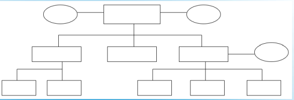

# REMEMBER

## Project Management

struktogramm  

gantt diagramm  

datenflussplan

uml diagramm

programmablaufplan  

Einliniensystem
 
Stabliniensystem
 
Mehrliniensystem
 
Matrixorganisation  

Management by Exception ?  
Aufbauorganisation ??  
Handlungsvollmacht ist eine auf Dauer erteilte Vollmacht an die Abteilungsleiter zur Erledigung aller gewöhnlichen Rechtsgeschäfte in dem betreffenden Handelsgewerbe.

## Wiso

### betrieblichen Produktionsfaktoren 

- **Arbeit** (dispositive und ausführende Arbeit)
- **Betriebsmittel** (Grundstücke, Maschinen, Werkzeuge und Einrichtungen)
- **Werkstoffe** (Roh-, Hilfs- und Betriebsstoffe sowie fertige Bestandteile für das zu erstellende Produkt).

### volkswirtschhaftlicher Produktionsfactor  

- **BODEN**
- **Kapital**
- **Arbeit**

### Gewinnzuschlag
Der teilweise auch als Gewinnspanne bezeichnete Gewinnzuschlag bezeichnet den Betrag (in Euro) oder den Prozentsatz (Gewinnzuschlagssatz), der auf die **Selbstkosten** (die für die Herstellung und den Vertrieb anfallenden Kosten) aufgeschlagen wird, um zu dem Verkaufspreis zu gelangen.

#### Gewinnzuschlag = Verkaufspreis nach Skonto und Rabatt - Selbstkostenpreis 

#### Gewinnzuschlag in Prozent = (Gewinnzuschlag / Selbstkostenpreis) * 100

GMBH Geselschaft mit beschrankter haftung
## KUP

### Laserdrucker  
- Geringe Kosten pro Seite, hohe Druckgeschwindigkeit
- Hohe thermische Belastung der Druckrmedien.

### Tintenstrahldrucker  
- In der Regel keine dokumentenechten Ausdrucke	 
- Sehr geringe Anschaffungskosten, hohe Druckqualität		2

### Nadeldrucker / Dot-Matrix-Drucker
- Durchschläge möglich, hohe Robustheit 
## pog

### struktogramm

- Kopfgesteuerte Schleife: while-Schleife    
- Fussgesteurte Schleife: do-while-Schleife  
- Zählschleife: for-Schleife  
- Abweisende Schleife: for...in-Schleife  
- Verzweigung: if-Anweisung  
- Sequenz: einfache Abfolge von Anweisungen  

Eine **browsergestützte Anwendung** ist eine Softwareanwendung, die über einen Webbrowser ausgeführt wird und keine separate Installation oder Download erfordert. Benutzer können auf diese Anwendungen über das Internet oder ein lokales Netzwerk zugreifen, indem sie eine URL in ihren Webbrowser eingeben. Die Anwendung wird auf einem Server gehostet und die Benutzeroberfläche wird im Browser des Benutzers angezeigt, was eine plattformunabhängige Nutzung ermöglicht.